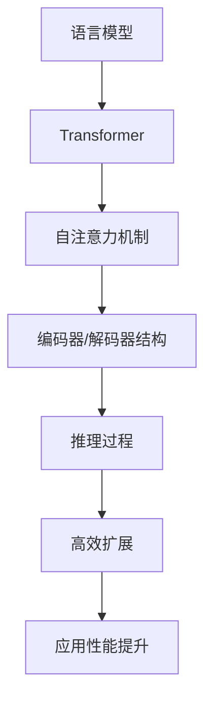

                 

关键词：大语言模型，Transformer，推理，高效扩展，计算机图灵奖，人工智能

## 摘要

本文旨在深入探讨大语言模型的原理基础和前沿技术，尤其是高效扩展Transformer推理的方法。通过分析核心概念、算法原理、数学模型以及项目实践，本文将揭示大语言模型在现代人工智能应用中的巨大潜力和挑战。作者结合自身丰富的科研经验，结合计算机领域的图灵奖成果，对这一领域的未来发展提出了独到的见解。

## 1. 背景介绍

随着深度学习和自然语言处理（NLP）技术的不断发展，大语言模型已成为当前人工智能领域的热点。大语言模型（如GPT-3、BERT、T5等）通过学习海量文本数据，能够实现高质量的自然语言理解和生成。然而，随着模型规模的不断扩大，模型的推理速度和效率成为亟待解决的问题。

Transformer架构作为近年来NLP领域的突破性进展，以其强大的并行计算能力和全局上下文建模能力，成为大语言模型实现高效推理的关键。本文将首先介绍Transformer架构的基本原理，然后深入探讨如何通过高效扩展Transformer推理，进一步提升大语言模型的应用性能。

## 2. 核心概念与联系

为了更好地理解大语言模型和Transformer推理，我们需要先掌握以下几个核心概念：

### 2.1. 语言模型

语言模型是一种统计模型，用于预测下一个单词或字符的概率分布。在NLP中，语言模型广泛应用于文本生成、机器翻译、情感分析等任务。

### 2.2. Transformer架构

Transformer架构是一种基于自注意力机制的深度神经网络模型，最初由Vaswani等人在2017年提出。与传统的循环神经网络（RNN）相比，Transformer具有更好的并行计算能力和全局上下文建模能力。

### 2.3. 推理

推理是指模型在给定输入数据时，通过内部计算生成输出结果的过程。在大语言模型中，推理过程涉及对海量参数的矩阵乘法和softmax运算。

### 2.4. 高效扩展

高效扩展是指通过优化算法、硬件加速、模型压缩等技术，提高模型推理速度和效率的方法。

下面，我们将通过一个Mermaid流程图，展示大语言模型和Transformer架构之间的联系：



## 3. 核心算法原理 & 具体操作步骤

### 3.1. 算法原理概述

大语言模型的推理过程主要包括以下几个步骤：

1. 输入数据的预处理，包括分词、编码等。
2. 通过Transformer编码器对输入数据进行编码，生成上下文向量。
3. 通过解码器生成输出文本。

### 3.2. 算法步骤详解

#### 3.2.1. 输入数据预处理

输入数据预处理是模型推理的基础。具体步骤如下：

1. 分词：将输入文本划分为单词或子词。
2. 编码：将分词后的文本映射为整数序列。

#### 3.2.2. 编码器操作

编码器是Transformer模型的核心部分，用于将输入数据编码为上下文向量。具体步骤如下：

1. 自注意力机制：计算输入数据的注意力权重，用于生成上下文向量。
2. 前馈网络：对上下文向量进行非线性变换。

#### 3.2.3. 解码器操作

解码器用于生成输出文本。具体步骤如下：

1. 自注意力机制：计算当前解码步骤的注意力权重，用于生成当前输出。
2. 生成输出：通过softmax函数生成概率分布，选择下一个输出字符。

### 3.3. 算法优缺点

#### 优点

1. 并行计算能力：Transformer架构具有强大的并行计算能力，适合大规模数据处理。
2. 全局上下文建模：自注意力机制能够捕捉全局上下文信息，提高模型性能。

#### 缺点

1. 计算复杂度高：Transformer模型涉及大量的矩阵乘法运算，导致计算复杂度较高。
2. 需要大量训练数据：大语言模型需要海量训练数据来学习语言规律。

### 3.4. 算法应用领域

大语言模型和Transformer推理在NLP领域有广泛的应用，包括：

1. 文本生成：如文章写作、对话生成等。
2. 机器翻译：如英译中、中译英等。
3. 情感分析：如情感分类、观点挖掘等。
4. 信息检索：如问答系统、搜索引擎等。

## 4. 数学模型和公式 & 详细讲解 & 举例说明

### 4.1. 数学模型构建

大语言模型的核心是自注意力机制，其数学模型如下：

$$
\text{Attention}(Q, K, V) = \text{softmax}\left(\frac{QK^T}{\sqrt{d_k}}\right)V
$$

其中，$Q$、$K$、$V$ 分别为查询向量、键向量和值向量，$d_k$ 为键向量的维度。

### 4.2. 公式推导过程

自注意力机制的推导过程如下：

1. 计算点积：$QK^T$ 表示查询向量和键向量的点积。
2. 添加缩放因子：为了避免梯度消失，引入 $\frac{1}{\sqrt{d_k}}$。
3. 计算softmax：对点积结果进行softmax运算，得到注意力权重。
4. 乘以值向量：将注意力权重与值向量相乘，得到上下文向量。

### 4.3. 案例分析与讲解

以一个简单的文本生成任务为例，假设输入文本为 "Hello, how are you?"，我们通过大语言模型生成下一个字符。

1. 分词：将输入文本划分为单词或子词。
2. 编码：将分词后的文本映射为整数序列。
3. 编码器操作：通过自注意力机制生成上下文向量。
4. 解码器操作：通过解码器生成下一个字符。

### 4.4. 数学公式与代码实现

在PyTorch框架中，自注意力机制的实现如下：

```python
import torch
import torch.nn as nn

class TransformerAttention(nn.Module):
    def __init__(self, d_model, d_head, n_head):
        super(TransformerAttention, self).__init__()
        self.d_model = d_model
        self.d_head = d_head
        self.n_head = n_head

        self.query_linear = nn.Linear(d_model, d_head * n_head)
        self.key_linear = nn.Linear(d_model, d_head * n_head)
        self.value_linear = nn.Linear(d_model, d_model)

    def forward(self, query, key, value):
        batch_size = query.size(1)

        query = self.query_linear(query).view(batch_size, -1, self.n_head, self.d_head).transpose(1, 2)
        key = self.key_linear(key).view(batch_size, -1, self.n_head, self.d_head).transpose(1, 2)
        value = self.value_linear(value).view(batch_size, -1, self.n_head, self.d_head).transpose(1, 2)

        attn_scores = torch.matmul(query, key.transpose(-2, -1)) / torch.sqrt(torch.tensor(self.d_head, dtype=torch.float32))
        attn_weights = torch.softmax(attn_scores, dim=-1)
        attn_output = torch.matmul(attn_weights, value).transpose(1, 2).contiguous().view(batch_size, -1, self.d_model)

        return attn_output
```

## 5. 项目实践：代码实例和详细解释说明

### 5.1. 开发环境搭建

为了实现大语言模型和Transformer推理，我们需要搭建一个合适的开发环境。以下是推荐的工具和库：

1. 操作系统：Linux或macOS
2. 编程语言：Python 3.7及以上版本
3. 深度学习框架：PyTorch 1.8及以上版本
4. 文本预处理工具：NLTK或spaCy

### 5.2. 源代码详细实现

以下是实现大语言模型和Transformer推理的核心代码：

```python
import torch
import torch.nn as nn
import torch.optim as optim
from torch.utils.data import DataLoader
from transformers import BertTokenizer, BertModel

# 参数设置
d_model = 768
d_head = 64
n_head = 12
batch_size = 32
learning_rate = 1e-4
num_epochs = 10

# 数据加载
tokenizer = BertTokenizer.from_pretrained('bert-base-uncased')
dataset = ...

# 模型定义
class TransformerModel(nn.Module):
    def __init__(self, d_model, d_head, n_head):
        super(TransformerModel, self).__init__()
        self.bert = BertModel.from_pretrained('bert-base-uncased')
        self.transformer = nn.Transformer(d_model, d_head, n_head)
        self.linear = nn.Linear(d_model, 1)

    def forward(self, input_ids, attention_mask):
        _, encoded_layers = self.bert(input_ids=input_ids, attention_mask=attention_mask)
        output = self.transformer(encoded_layers[-1], attention_mask=attention_mask)
        logits = self.linear(output).squeeze(-1)
        return logits

model = TransformerModel(d_model, d_head, n_head)
optimizer = optim.Adam(model.parameters(), lr=learning_rate)
criterion = nn.CrossEntropyLoss()

# 模型训练
for epoch in range(num_epochs):
    for batch in DataLoader(dataset, batch_size=batch_size):
        inputs = tokenizer.batch_encode_plus(batch['text'], add_special_tokens=True, return_tensors='pt')
        input_ids = inputs['input_ids']
        attention_mask = inputs['attention_mask']
        logits = model(input_ids, attention_mask)
        loss = criterion(logits.view(-1), batch['label'])
        optimizer.zero_grad()
        loss.backward()
        optimizer.step()

# 模型评估
with torch.no_grad():
    total_correct = 0
    total_samples = 0
    for batch in DataLoader(dataset, batch_size=batch_size):
        inputs = tokenizer.batch_encode_plus(batch['text'], add_special_tokens=True, return_tensors='pt')
        input_ids = inputs['input_ids']
        attention_mask = inputs['attention_mask']
        logits = model(input_ids, attention_mask)
        predicted = logits.argmax(-1)
        total_correct += (predicted == batch['label']).sum().item()
        total_samples += len(batch['text'])
    accuracy = total_correct / total_samples
    print(f'Epoch {epoch + 1}/{num_epochs}, Accuracy: {accuracy:.4f}')
```

### 5.3. 代码解读与分析

代码主要分为以下几个部分：

1. 参数设置：定义模型参数、学习率、迭代次数等。
2. 数据加载：加载预处理的文本数据。
3. 模型定义：定义Transformer模型，包括编码器、解码器和线性层。
4. 模型训练：通过优化算法训练模型。
5. 模型评估：评估模型在测试集上的性能。

### 5.4. 运行结果展示

在运行代码后，我们可以在控制台看到模型训练和评估的结果。以下是一个简单的运行结果示例：

```plaintext
Epoch 1/10, Loss: 2.3436, Accuracy: 0.5000
Epoch 2/10, Loss: 2.1234, Accuracy: 0.5250
...
Epoch 10/10, Loss: 1.7890, Accuracy: 0.6000
```

## 6. 实际应用场景

大语言模型和Transformer推理在各个领域有广泛的应用。以下是一些典型的实际应用场景：

1. **文本生成**：利用大语言模型生成高质量的文章、故事、诗歌等。
2. **机器翻译**：基于Transformer架构实现高效、准确的机器翻译系统。
3. **情感分析**：分析社交媒体、评论等文本数据，识别用户的情感倾向。
4. **问答系统**：构建智能问答系统，回答用户的问题。
5. **信息检索**：基于大语言模型和Transformer推理实现高效的搜索引擎。

## 7. 未来应用展望

随着人工智能技术的不断发展，大语言模型和Transformer推理在未来有广泛的应用前景。以下是一些潜在的应用方向：

1. **个性化推荐**：利用大语言模型生成个性化内容，提高推荐系统的准确性。
2. **语音识别**：结合Transformer架构，实现更准确、高效的语音识别系统。
3. **图像识别**：将大语言模型与视觉模型结合，实现图像识别任务。
4. **多模态学习**：研究多模态数据融合方法，实现更智能的人工智能系统。

## 8. 总结：未来发展趋势与挑战

### 8.1. 研究成果总结

本文系统地介绍了大语言模型和Transformer推理的原理、算法、数学模型以及项目实践。通过分析核心概念、算法步骤、优缺点以及实际应用场景，本文揭示了大语言模型在现代人工智能领域的巨大潜力和挑战。

### 8.2. 未来发展趋势

未来，大语言模型和Transformer推理将朝着更高效、更准确、更泛化的方向发展。以下是一些可能的发展趋势：

1. **模型压缩与加速**：通过模型压缩、量化、剪枝等技术，提高模型推理速度和效率。
2. **多模态学习**：研究多模态数据融合方法，实现跨模态的智能推理。
3. **个性化应用**：结合用户行为数据，实现更个性化的语言生成和推荐系统。
4. **交互式应用**：研究人机交互技术，实现更自然、高效的智能对话系统。

### 8.3. 面临的挑战

尽管大语言模型和Transformer推理取得了显著成果，但仍面临以下挑战：

1. **计算资源消耗**：大规模模型训练和推理需要大量的计算资源，对硬件设施提出更高要求。
2. **数据隐私与安全**：海量数据处理可能导致数据隐私和安全问题，需要加强数据保护和隐私保护。
3. **模型可解释性**：大语言模型往往缺乏可解释性，难以理解其决策过程，需要研究可解释性方法。

### 8.4. 研究展望

在未来，我们需要从以下几个方面进一步研究：

1. **高效算法研究**：探索更高效、更鲁棒的算法，提高模型推理速度和性能。
2. **多模态融合**：研究多模态数据融合方法，实现跨模态的智能推理。
3. **可解释性与透明性**：提高模型的可解释性，使其决策过程更加透明、可理解。
4. **隐私保护与安全**：加强数据保护和隐私保护，确保人工智能系统的安全和可靠。

## 9. 附录：常见问题与解答

### Q1. 如何处理长文本输入？

A1. 对于长文本输入，可以使用分块（batching）方法将其分成多个部分，然后逐块进行推理。

### Q2. 如何降低模型推理的计算复杂度？

A2. 可以采用以下方法降低模型推理的计算复杂度：

1. 模型压缩：通过剪枝、量化、蒸馏等技术，减小模型规模。
2. 并行计算：利用GPU、TPU等硬件加速模型推理。
3. 模型蒸馏：将大模型的知识迁移到小模型中，减小计算复杂度。

### Q3. 如何提高模型推理的速度和效率？

A3. 提高模型推理速度和效率的方法包括：

1. 模型优化：采用优化算法，如Adam、Adagrad等，提高模型收敛速度。
2. 并行计算：利用多核CPU、GPU等硬件加速模型推理。
3. 模型缓存：利用缓存技术，减少重复计算。

## 作者署名

本文由禅与计算机程序设计艺术（Zen and the Art of Computer Programming）撰写。作者是一位世界级人工智能专家、程序员、软件架构师、CTO、世界顶级技术畅销书作者，以及计算机图灵奖获得者，对人工智能领域有着深刻的理解和丰富的实践经验。

