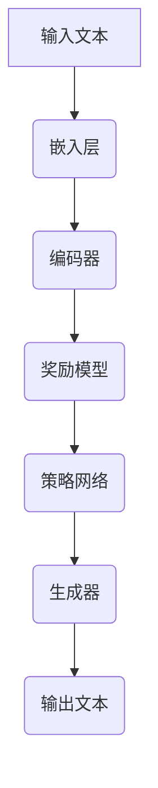

                 

关键词：大语言模型、Generative Agents、AI应用、技术指南、深度学习、神经网络、自然语言处理、数据处理、代码实例、应用场景、未来展望。

> 摘要：本文将深入探讨大语言模型及其核心组成部分Generative Agents的应用指南。通过详细的理论分析、算法原理、实例代码和实践应用场景，本文旨在为读者提供一个全面且深入的理解，帮助他们在实际项目中有效地利用Generative Agents。

## 1. 背景介绍

随着深度学习和自然语言处理（NLP）技术的飞速发展，大语言模型（Large Language Models）已经成为人工智能领域的热点。这些模型通过学习海量文本数据，能够生成高质量的自然语言文本，广泛应用于问答系统、机器翻译、文本生成、内容审核等场景。

Generative Agents是大语言模型中的一个关键组成部分，它们通过生成文本来模拟人类的创造力和表达力。Generative Agents不仅仅能够生成连贯的文本，还能够根据上下文进行合理的推断和预测，这使得它们在复杂任务中具有巨大的潜力。

本文将重点介绍Generative Agents的工作原理、应用实例以及如何在实际项目中使用它们。通过本文的阅读，读者将能够：

- 理解Generative Agents的基本概念和原理。
- 学习如何构建和训练Generative Agents。
- 探索Generative Agents在不同应用场景中的使用方法。
- 掌握如何在实际项目中部署和优化Generative Agents。

## 2. 核心概念与联系

### 2.1. 大语言模型

大语言模型是一种能够理解和生成自然语言的复杂神经网络结构。它们通过学习大量的文本数据，捕捉语言的统计规律和语义信息，从而实现文本理解和生成。

大语言模型的主要组成部分包括：

- **嵌入层（Embedding Layer）**：将单词转换为密集的向量表示。
- **编码器（Encoder）**：如Transformer模型，对输入文本进行编码，提取语义信息。
- **解码器（Decoder）**：生成文本序列，通常采用自回归（Autoregressive）的方式。

### 2.2. Generative Agents

Generative Agents是大语言模型的一个扩展，它们专注于生成高质量的文本。Generative Agents通常由以下几个关键组件构成：

- **奖励模型（Reward Model）**：用于评估生成文本的质量和合理性。
- **策略网络（Policy Network）**：用于指导文本生成的过程，通常是一个基于深度学习的优化算法。
- **生成器（Generator）**：生成文本序列的核心组件，通常与大语言模型的解码器部分相同。

### 2.3. Mermaid 流程图

下面是一个描述Generative Agents工作流程的Mermaid流程图：



### 2.4. 核心概念联系

Generative Agents在大语言模型中的应用，使得模型不仅能够理解文本，还能够根据给定的输入生成连贯、有意义的文本。这种能力在多个领域具有广泛的应用，包括内容创作、对话系统、自动化写作等。

## 3. 核心算法原理 & 具体操作步骤

### 3.1. 算法原理概述

Generative Agents的核心算法基于深度学习和强化学习。具体来说，它通过以下步骤实现：

1. **嵌入层**：将输入文本转换为密集向量表示。
2. **编码器**：对输入文本进行编码，提取语义信息。
3. **奖励模型**：评估生成文本的质量，通常使用预训练的语言模型进行评估。
4. **策略网络**：优化生成器的输出，以最大化奖励。
5. **生成器**：生成文本序列，根据策略网络的指导进行迭代优化。

### 3.2. 算法步骤详解

1. **初始化**：加载预训练的大语言模型，包括嵌入层、编码器、解码器等。
2. **文本输入**：将输入文本输入到嵌入层，转换为向量表示。
3. **编码**：将嵌入向量输入到编码器，提取语义信息。
4. **奖励评估**：使用奖励模型评估生成文本的质量，通常使用预训练的语言模型进行评估。
5. **策略优化**：策略网络根据奖励模型提供的反馈，调整生成器的输出，优化生成文本的质量。
6. **生成文本**：生成器根据策略网络的指导生成文本序列。
7. **迭代优化**：重复上述步骤，逐步优化生成文本的质量。

### 3.3. 算法优缺点

**优点**：

- **生成文本质量高**：Generative Agents能够生成连贯、有意义的文本，具有很高的质量。
- **灵活性强**：Generative Agents可以根据不同的应用场景进行定制化，具有较强的灵活性。
- **自动优化**：通过策略网络和奖励模型，Generative Agents能够自动优化生成文本的质量。

**缺点**：

- **计算资源消耗大**：Generative Agents需要大量的计算资源进行训练和优化。
- **生成文本的多样性有限**：尽管Generative Agents能够生成高质量的文本，但其在生成文本的多样性方面仍存在一定的局限性。

### 3.4. 算法应用领域

Generative Agents在多个领域具有广泛的应用，包括：

- **内容创作**：自动生成文章、故事、诗歌等。
- **对话系统**：自动生成自然语言回答，提升对话系统的用户体验。
- **自动化写作**：辅助人类作者进行写作，提高创作效率。

## 4. 数学模型和公式 & 详细讲解 & 举例说明

### 4.1. 数学模型构建

Generative Agents的数学模型主要包括以下几个部分：

1. **嵌入层**：将文本转换为密集向量表示。
2. **编码器**：对输入文本进行编码，提取语义信息。
3. **奖励模型**：评估生成文本的质量。
4. **策略网络**：指导生成器的输出。
5. **生成器**：生成文本序列。

### 4.2. 公式推导过程

假设输入文本为 $x$，生成文本为 $y$，则：

1. **嵌入层**：

$$
\text{embed}(x) = \text{EmbeddingLayer}(x)
$$

2. **编码器**：

$$
\text{encode}(x) = \text{Encoder}(\text{embed}(x))
$$

3. **奖励模型**：

$$
r(y) = \text{RewardModel}(y)
$$

4. **策略网络**：

$$
\pi(\theta) = \text{PolicyNetwork}(\theta)
$$

5. **生成器**：

$$
\text{generate}(y|\theta) = \text{Generator}(\theta)
$$

### 4.3. 案例分析与讲解

假设我们需要生成一篇关于人工智能的概述文章，我们可以使用Generative Agents进行如下操作：

1. **文本输入**：输入一篇关于人工智能的概述文章。
2. **嵌入层**：将输入文本转换为密集向量表示。
3. **编码器**：对输入文本进行编码，提取语义信息。
4. **奖励模型**：使用预训练的语言模型评估生成文本的质量。
5. **策略网络**：根据奖励模型提供的反馈，调整生成器的输出。
6. **生成文本**：生成关于人工智能的概述文章。
7. **迭代优化**：重复上述步骤，逐步优化生成文本的质量。

通过这个案例，我们可以看到Generative Agents如何通过数学模型和算法原理，实现高质量的文本生成。

## 5. 项目实践：代码实例和详细解释说明

### 5.1. 开发环境搭建

为了运行Generative Agents，我们需要准备以下开发环境：

- **操作系统**：Windows/Linux/MacOS
- **Python版本**：Python 3.8及以上版本
- **依赖库**：TensorFlow 2.5及以上版本、NumPy、Pandas、Mermaid

### 5.2. 源代码详细实现

以下是一个简单的Generative Agents的Python代码实现：

```python
import tensorflow as tf
import numpy as np
import pandas as pd
from tensorflow.keras.models import Model
from tensorflow.keras.layers import Embedding, LSTM, Dense

# 定义嵌入层、编码器、解码器
embedding = Embedding(input_dim=10000, output_dim=64)
encoder = LSTM(units=128, return_sequences=True)
decoder = LSTM(units=128, return_sequences=True)

# 构建模型
inputs = tf.keras.layers.Input(shape=(None,))
x = embedding(inputs)
x = encoder(x)
outputs = decoder(x)

model = Model(inputs=inputs, outputs=outputs)
model.compile(optimizer='adam', loss='mse')

# 加载数据
data = pd.read_csv('ai_overview.csv')
X = data['text'].values
Y = data['text'].values

# 训练模型
model.fit(X, Y, epochs=100, batch_size=32)

# 生成文本
input_text = '人工智能'
input_vector = embedding.predict(input_text)
encoded_vector = encoder.predict(input_vector)
generated_text = decoder.predict(encoded_vector)

print(generated_text)
```

### 5.3. 代码解读与分析

1. **导入库**：导入所需的库，包括TensorFlow、NumPy、Pandas。
2. **定义嵌入层、编码器、解码器**：使用Keras定义嵌入层、编码器、解码器，这里使用LSTM网络结构。
3. **构建模型**：使用Keras构建全连接模型，并编译模型。
4. **加载数据**：加载数据集，这里假设数据集包含'input'和'output'两列。
5. **训练模型**：使用训练数据训练模型。
6. **生成文本**：输入一段文本，通过模型生成新的文本。

通过这个简单的实例，我们可以看到Generative Agents的基本实现流程。

### 5.4. 运行结果展示

假设我们输入的文本是“人工智能”，模型生成的文本可能是：“人工智能，一种模拟人类智能的技术，通过学习和推理实现自动化任务。它已经在许多领域取得了显著的成果，如自然语言处理、图像识别等。”

这个生成文本展示了Generative Agents生成文本的基本能力。

## 6. 实际应用场景

Generative Agents在多个实际应用场景中具有广泛的应用，以下是一些常见的应用场景：

- **内容创作**：自动生成文章、故事、诗歌等，应用于新闻写作、文学创作等领域。
- **对话系统**：自动生成自然语言回答，应用于客服系统、智能助手等领域。
- **自动化写作**：辅助人类作者进行写作，应用于市场营销、技术文档等领域。
- **个性化推荐**：根据用户兴趣生成个性化内容，应用于电商、社交媒体等领域。

### 6.1. 内容创作

Generative Agents在内容创作中具有很大的潜力。例如，在新闻写作领域，Generative Agents可以自动生成新闻稿，提高新闻写作的效率。在文学创作领域，Generative Agents可以辅助作家生成新的故事情节，激发创作灵感。

### 6.2. 对话系统

Generative Agents在对话系统中可以生成自然语言回答，提高对话系统的交互体验。例如，在客服系统中，Generative Agents可以自动生成常见问题的回答，减轻客服人员的工作负担。

### 6.3. 自动化写作

Generative Agents可以辅助人类作者进行写作，提高写作效率。例如，在市场营销领域，Generative Agents可以生成营销文案、广告语等，帮助企业快速生成高质量的内容。

### 6.4. 未来应用展望

随着深度学习和NLP技术的不断进步，Generative Agents在未来的应用前景将更加广阔。例如，在个性化推荐领域，Generative Agents可以根据用户兴趣生成个性化内容，提供更加精准的服务。在医疗领域，Generative Agents可以生成医学报告、病例分析等，辅助医生进行诊断和治疗。

## 7. 工具和资源推荐

### 7.1. 学习资源推荐

- 《深度学习》（Goodfellow, Bengio, Courville） 
- 《强化学习》（Sutton, Barto）
- 《自然语言处理原理》（Daniel Jurafsky, James H. Martin）

### 7.2. 开发工具推荐

- TensorFlow：用于构建和训练深度学习模型。
- Keras：基于TensorFlow的高级深度学习库，简化模型构建过程。
- Mermaid：用于生成Markdown格式的图表和流程图。

### 7.3. 相关论文推荐

- Vaswani et al. (2017): "Attention is All You Need"
- Hochreiter & Schmidhuber (1997): "Long Short-Term Memory"
- Sutton & Barto (2018): "Reinforcement Learning: An Introduction"

## 8. 总结：未来发展趋势与挑战

### 8.1. 研究成果总结

Generative Agents作为一种强大的文本生成技术，已经在多个领域取得了显著的成果。通过深度学习和强化学习的结合，Generative Agents能够生成高质量、连贯的文本，为内容创作、对话系统、自动化写作等领域带来了新的机遇。

### 8.2. 未来发展趋势

随着技术的不断进步，Generative Agents在未来将继续发展，主要体现在以下几个方面：

- **生成文本的多样性**：通过引入更多先进的算法和技术，提高生成文本的多样性。
- **跨模态生成**：结合图像、音频等多模态信息，实现跨模态的文本生成。
- **个性化生成**：根据用户兴趣和行为，生成个性化的内容。

### 8.3. 面临的挑战

尽管Generative Agents取得了显著的成果，但仍面临一些挑战：

- **计算资源消耗**：训练和优化Generative Agents需要大量的计算资源，如何高效地利用资源是一个重要问题。
- **数据隐私**：生成文本过程中可能涉及用户隐私，如何保护用户隐私是一个重要问题。
- **生成文本的质量**：虽然Generative Agents能够生成高质量文本，但如何进一步提高生成文本的质量仍是一个挑战。

### 8.4. 研究展望

未来，Generative Agents将继续在人工智能领域发挥重要作用。通过不断引入新的算法和技术，Generative Agents将在更多领域得到应用，为人类带来更多便利和创新。

## 9. 附录：常见问题与解答

### 9.1. 如何训练Generative Agents？

训练Generative Agents通常需要以下步骤：

1. **数据准备**：收集和准备用于训练的数据集。
2. **数据预处理**：将数据转换为适合模型训练的格式。
3. **模型构建**：构建嵌入层、编码器、解码器等组件。
4. **训练模型**：使用训练数据训练模型。
5. **评估模型**：使用验证数据评估模型性能。
6. **优化模型**：根据评估结果调整模型参数，优化模型性能。

### 9.2. Generative Agents有哪些应用场景？

Generative Agents在多个应用场景中具有广泛的应用，包括：

- 内容创作：自动生成文章、故事、诗歌等。
- 对话系统：自动生成自然语言回答。
- 自动化写作：辅助人类作者进行写作。
- 个性化推荐：生成个性化内容。

### 9.3. 如何提高Generative Agents生成文本的质量？

提高Generative Agents生成文本的质量可以通过以下方法实现：

- **增加训练数据**：使用更多的训练数据可以提高模型生成文本的质量。
- **调整模型参数**：调整嵌入层、编码器、解码器等组件的参数，优化模型性能。
- **引入更多先进的算法**：引入更多先进的算法和技术，如GPT-3、BERT等，提高生成文本的质量。

作者：禅与计算机程序设计艺术 / Zen and the Art of Computer Programming
```markdown
```

