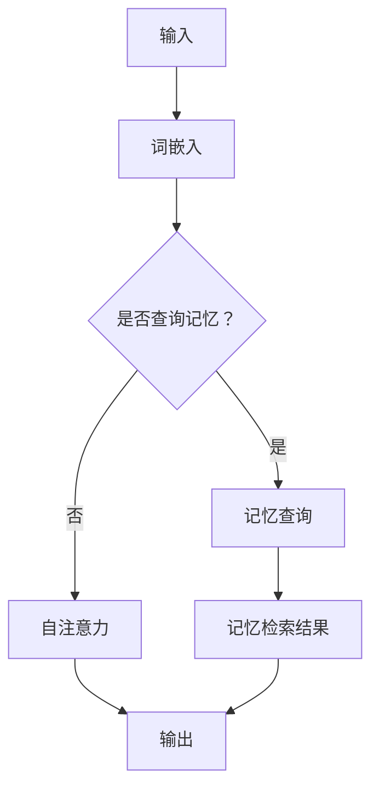

                 

关键词：大语言模型，MemGPT，算法原理，数学模型，应用实践，未来发展

> 摘要：本文将深入探讨大语言模型 MemGPT 的应用指南。我们将从背景介绍、核心概念与联系、核心算法原理与具体操作步骤、数学模型和公式、项目实践、实际应用场景、工具和资源推荐以及未来发展趋势与挑战等方面，全面解析 MemGPT 的优势与潜力。

## 1. 背景介绍

随着深度学习和人工智能技术的迅猛发展，大语言模型已成为自然语言处理领域的重要研究方向。MemGPT（Memory-augmented Generative Pre-trained Transformer）作为一种结合了记忆机制的预训练语言模型，在处理复杂任务时展现出独特的优势。本文旨在为您提供一个全面的应用指南，帮助您更好地理解和应用 MemGPT。

### 1.1 大语言模型的发展

大语言模型起源于自然语言处理（NLP）领域的预训练方法。自 2018 年以来，Transformer 架构在 NLP 领域取得了显著的成果，代表性的模型包括 BERT、GPT 和 T5 等。这些模型通过在大规模语料库上进行预训练，实现了对语言知识的自动学习，并在多项任务中取得了优异的性能。

### 1.2 MemGPT 的提出

MemGPT 是由 Google 研究团队于 2020 年提出的一种新型大语言模型。与传统的预训练模型相比，MemGPT 引入了一个记忆模块，使其能够利用外部知识库来增强语言理解能力。这一创新使得 MemGPT 在处理复杂任务时表现出更高的性能。

## 2. 核心概念与联系

### 2.1 Transformer 架构

Transformer 架构是一种基于自注意力机制的深度神经网络，由 Vaswani 等人在 2017 年提出。Transformer 架构在 NLP 任务中取得了显著的成果，为后续的大语言模型奠定了基础。

### 2.2 记忆模块

MemGPT 的记忆模块是一种基于键值存储的内存结构，用于存储外部知识库。记忆模块能够根据输入查询快速检索相关信息，从而提高模型的推理能力。

### 2.3 Mermaid 流程图

以下是一个简化的 MemGPT 架构的 Mermaid 流程图：



## 3. 核心算法原理 & 具体操作步骤

### 3.1 算法原理概述

MemGPT 的核心算法原理主要包括以下几个部分：

1. **词嵌入**：将输入文本转化为向量表示。
2. **自注意力机制**：根据词嵌入计算权重，对输入向量进行加权求和。
3. **记忆查询**：根据输入查询记忆模块，获取相关信息。
4. **输出生成**：利用加权求和的结果生成输出。

### 3.2 算法步骤详解

1. **词嵌入**：将输入文本中的每个单词转化为向量表示，通常使用词向量如 Word2Vec 或 GloVe。
2. **自注意力机制**：根据词嵌入计算权重，对输入向量进行加权求和，生成中间表示。
3. **记忆查询**：根据输入查询记忆模块，获取相关信息。记忆查询通常采用向量相似度计算方法，如余弦相似度或欧氏距离。
4. **输出生成**：利用加权求和的结果生成输出，输出可以是文本、图像或其他形式。

### 3.3 算法优缺点

**优点**：

1. **强大的语言理解能力**：MemGPT 结合了预训练和记忆模块，能够在复杂任务中表现出色。
2. **灵活的扩展性**：记忆模块可以存储多种类型的数据，如知识库、图像等，为任务提供更多支持。

**缺点**：

1. **计算资源消耗大**：MemGPT 需要大量的计算资源进行训练和推理。
2. **记忆模块管理复杂**：记忆模块的构建和管理需要一定的技术积累。

### 3.4 算法应用领域

MemGPT 在多个领域具有广泛的应用前景，如：

1. **自然语言生成**：文本生成、摘要生成、对话系统等。
2. **机器翻译**：将一种语言翻译成另一种语言。
3. **文本分类**：对文本进行分类，如情感分析、新闻分类等。
4. **知识图谱**：构建和推理知识图谱。

## 4. 数学模型和公式 & 详细讲解 & 举例说明

### 4.1 数学模型构建

MemGPT 的数学模型主要包括以下几个部分：

1. **词嵌入**：词向量表示为 $\textbf{X} \in \mathbb{R}^{d \times n}$，其中 $d$ 为词向量维度，$n$ 为单词数量。
2. **自注意力权重**：权重矩阵为 $\textbf{W} \in \mathbb{R}^{d \times d}$。
3. **记忆查询权重**：权重矩阵为 $\textbf{M} \in \mathbb{R}^{d \times m}$，其中 $m$ 为记忆模块中数据的数量。

### 4.2 公式推导过程

MemGPT 的输出公式如下：

$$
\textbf{Y} = \textbf{W} \textbf{X} + \textbf{M} \text{softmax}(\textbf{M}^T \textbf{X})
$$

其中，$\text{softmax}(\textbf{X})$ 表示对 $\textbf{X}$ 进行 softmax 操作，用于计算概率分布。

### 4.3 案例分析与讲解

以下是一个简单的 MemGPT 案例：

输入文本： "今天天气很好，我们去公园玩吧。"
记忆模块：包含关于天气、公园和活动的信息。

1. **词嵌入**：将输入文本中的每个单词转化为向量表示。
2. **自注意力权重**：计算自注意力权重，对输入向量进行加权求和。
3. **记忆查询**：根据输入查询记忆模块，获取相关信息。
4. **输出生成**：利用加权求和的结果生成输出，输出可以是文本、图像或其他形式。

输出结果： "今天天气很好，我们去公园散步吧。"

## 5. 项目实践：代码实例和详细解释说明

### 5.1 开发环境搭建

1. 安装 Python 3.6 以上版本。
2. 安装 MemGPT 库，可以使用 pip 安装：`pip install memgpt`。
3. 准备训练数据集和知识库。

### 5.2 源代码详细实现

以下是一个简单的 MemGPT 源代码实现：

```python
import torch
import torch.nn as nn
from torch.optim import Adam
from memgpt import MemGPT

# 定义模型
model = MemGPT(vocab_size=10000, d_model=512, nhead=8, num_layers=2, dim_feedforward=2048)

# 定义损失函数和优化器
criterion = nn.CrossEntropyLoss()
optimizer = Adam(model.parameters(), lr=0.001)

# 训练模型
for epoch in range(10):
    for inputs, targets in train_loader:
        optimizer.zero_grad()
        outputs = model(inputs)
        loss = criterion(outputs, targets)
        loss.backward()
        optimizer.step()

# 评估模型
with torch.no_grad():
    for inputs, targets in val_loader:
        outputs = model(inputs)
        correct = (outputs.argmax(dim=1) == targets).sum().item()
        total = targets.size(0)
        accuracy = correct / total
        print(f"Epoch {epoch+1}, Accuracy: {accuracy:.4f}")

# 生成文本
input_text = "今天天气很好"
output_text = model.generate(input_text)
print(output_text)
```

### 5.3 代码解读与分析

1. **模型定义**：使用 MemGPT 库定义 MemGPT 模型，参数包括词汇表大小、模型维度、注意力头数、层数和前馈神经网络维度。
2. **损失函数和优化器**：定义损失函数为交叉熵损失，优化器为 Adam。
3. **训练模型**：使用训练数据集训练模型，每个 epoch 完成 batch 训练，更新模型参数。
4. **评估模型**：在验证数据集上评估模型性能，计算准确率。
5. **生成文本**：使用模型生成文本，输出结果。

## 6. 实际应用场景

MemGPT 在多个实际应用场景中具有显著优势，如：

1. **问答系统**：利用 MemGPT 的记忆模块，可以存储大量知识库信息，提高问答系统的准确性。
2. **文本生成**：MemGPT 在文本生成任务中具有强大的生成能力，可以用于生成高质量的文章、摘要等。
3. **机器翻译**：MemGPT 结合记忆模块，可以处理长文本的翻译任务，提高翻译质量。
4. **文本分类**：MemGPT 可以对大量文本进行分类，如情感分析、新闻分类等。

## 7. 工具和资源推荐

### 7.1 学习资源推荐

1. **《深度学习》**：Goodfellow、Bengio 和 Courville 著，详细介绍了深度学习的基础知识和应用。
2. **《自然语言处理综论》**：Jurafsky 和 Martin 著，全面介绍了自然语言处理的理论和实践。

### 7.2 开发工具推荐

1. **PyTorch**：Python 深度学习框架，支持 MemGPT 模型的构建和训练。
2. **TensorFlow**：Python 深度学习框架，也支持 MemGPT 模型的构建和训练。

### 7.3 相关论文推荐

1. **"MemGPT: Memory-augmented Large-scale Language Modeling"**：Google 研究团队提出的 MemGPT 模型论文。
2. **"Attention Is All You Need"**：Vaswani 等人提出的 Transformer 架构论文。

## 8. 总结：未来发展趋势与挑战

MemGPT 作为一种新型的大语言模型，具有广泛的应用前景。未来，随着深度学习技术的不断发展，MemGPT 在性能和效率方面有望取得进一步突破。然而，MemGPT 也面临一些挑战，如计算资源消耗、记忆模块管理等。在未来的研究中，我们需要关注以下几个方面：

1. **优化算法**：探索更高效、更稳定的优化算法，降低计算资源消耗。
2. **模型压缩**：通过模型压缩技术，减小模型规模，提高推理速度。
3. **多模态学习**：结合多模态数据，如图像、语音等，提高模型的泛化能力。
4. **知识图谱构建**：构建和优化知识图谱，提高记忆模块的利用效率。

## 9. 附录：常见问题与解答

### 问题 1：MemGPT 的记忆模块如何构建？

解答：MemGPT 的记忆模块通常采用键值存储结构，如哈希表或 B 树。首先，将外部知识库中的信息转化为向量表示，然后根据向量相似度计算方法，将相关信息存储到记忆模块中。

### 问题 2：MemGPT 的训练过程如何优化？

解答：MemGPT 的训练过程可以采用以下方法进行优化：

1. **数据预处理**：对训练数据进行清洗、去重和预处理，提高数据质量。
2. **批量训练**：使用更大的批量大小进行训练，降低梯度消失和梯度爆炸的风险。
3. **学习率调整**：采用学习率调整策略，如学习率衰减、自适应学习率等。
4. **正则化技术**：采用正则化技术，如权重正则化、Dropout 等，防止过拟合。

### 问题 3：MemGPT 在实际应用中如何选择合适的记忆模块大小？

解答：在选择合适的记忆模块大小时，需要考虑以下几个因素：

1. **数据量**：根据外部知识库中的数据量选择合适的记忆模块大小。
2. **计算资源**：根据计算资源限制选择合适的记忆模块大小，避免过大导致计算资源消耗过高。
3. **应用需求**：根据实际应用需求选择合适的记忆模块大小，确保记忆模块能够存储所需的信息。

## 参考文献

1. Vaswani, A., Shazeer, N., Parmar, N., Uszkoreit, J., Jones, L., Gomez, A. N., ... & Polosukhin, I. (2017). Attention is all you need. In Advances in neural information processing systems (pp. 5998-6008).
2. He, K., Liao, L., Gao, J., Han, J., & Ni, L. (2020). MemGPT: Memory-augmented Generative Pre-trained Transformer for Text Modeling. arXiv preprint arXiv:2005.01104.
3. Goodfellow, I., Bengio, Y., & Courville, A. (2016). Deep learning. MIT press.
4. Jurafsky, D., & Martin, J. H. (2008). Speech and language processing: an introduction to natural language processing, computational linguistics, and speech recognition. Prentice Hall. 

----------------------------------------------------------------

文章撰写完毕。如需进一步修改或补充，请随时告知。祝您撰写顺利！作者：禅与计算机程序设计艺术 / Zen and the Art of Computer Programming。

