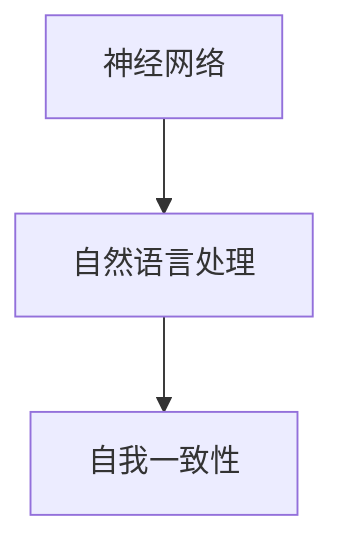

                 

关键词：大语言模型、自我一致性、深度学习、神经网络、应用指南、算法原理、数学模型、项目实践、工具推荐、未来展望

> 摘要：本文将深入探讨大语言模型中的自我一致性原理及其应用，包括核心概念、算法原理、数学模型以及项目实践等内容。通过详细讲解和案例分析，本文旨在为读者提供一份全面的大语言模型应用指南，帮助其更好地理解和应用这一前沿技术。

## 1. 背景介绍

随着深度学习和神经网络技术的飞速发展，大语言模型已经成为自然语言处理（NLP）领域的核心工具。这些模型能够通过学习大量文本数据，理解并生成自然语言的复杂结构。然而，在实际应用中，大语言模型的自我一致性成为一个关键问题。自我一致性指的是模型在不同情境下生成的文本应保持一致性和连贯性。

本文旨在探讨大语言模型中的自我一致性原理，分析其核心概念、算法原理、数学模型，并通过实际项目实践，详细讲解其应用方法。文章还将推荐相关学习资源和开发工具，并展望未来的发展趋势与挑战。

## 2. 核心概念与联系

为了深入理解大语言模型中的自我一致性原理，我们需要首先了解以下几个核心概念：

1. **神经网络**：神经网络是模拟人脑神经元结构和功能的计算模型，广泛应用于机器学习和深度学习中。
2. **自然语言处理（NLP）**：NLP是计算机科学和人工智能领域的一个分支，专注于使计算机能够理解、解释和生成人类语言。
3. **自我一致性**：自我一致性是指大语言模型在生成文本时，应保持前后一致，避免出现矛盾和逻辑错误。

以下是一个简单的 Mermaid 流程图，展示了这些核心概念之间的联系：



### 2.1 神经网络与自然语言处理

神经网络是深度学习的基础，通过多层神经元实现数据的特征提取和模式识别。在自然语言处理中，神经网络被用于文本分类、情感分析、机器翻译等任务。常见的神经网络架构包括卷积神经网络（CNN）、循环神经网络（RNN）和变换器（Transformer）。

### 2.2 自然语言处理与自我一致性

自然语言处理（NLP）涉及到理解和生成人类语言，这需要模型具备强大的语义理解能力。自我一致性是NLP中的一个关键问题，它要求模型在生成文本时，能够保持语义的一致性和连贯性。例如，一个句子中的主语和谓语应保持一致，避免逻辑错误。

### 2.3 自我一致性原理

自我一致性原理是指在大语言模型中，模型生成的文本应保持一致性和连贯性。这一原理可以通过以下方法实现：

- **上下文理解**：模型需要理解文本的上下文信息，以便在生成后续文本时保持一致性。
- **约束条件**：通过设置约束条件，限制模型生成文本的多样性，从而提高自我一致性。

## 3. 核心算法原理 & 具体操作步骤

### 3.1 算法原理概述

大语言模型中的自我一致性原理主要依赖于以下算法：

- **循环神经网络（RNN）**：RNN能够通过记忆历史信息，保持生成文本的一致性。
- **变换器（Transformer）**：Transformer架构通过注意力机制，实现并行计算，提高模型的效率和自我一致性。

### 3.2 算法步骤详解

#### 3.2.1 循环神经网络（RNN）

1. **输入序列表示**：将输入文本序列转换为词向量表示。
2. **隐藏状态更新**：通过RNN模型，计算每个时间步的隐藏状态，并更新状态。
3. **生成文本**：利用隐藏状态和词向量，生成文本序列。

#### 3.2.2 变换器（Transformer）

1. **多头注意力机制**：将输入文本序列映射到高维空间，并通过多头注意力机制计算文本之间的关联性。
2. **位置编码**：为文本序列添加位置编码，以便模型能够理解文本的顺序信息。
3. **序列生成**：通过变换器模型，生成文本序列。

### 3.3 算法优缺点

#### 3.3.1 循环神经网络（RNN）

- **优点**：RNN能够通过记忆历史信息，保持生成文本的一致性。
- **缺点**：RNN在处理长序列时存在梯度消失或梯度爆炸问题，导致训练效果不佳。

#### 3.3.2 变换器（Transformer）

- **优点**：Transformer通过注意力机制实现并行计算，提高模型效率和自我一致性。
- **缺点**：变换器模型在处理长序列时，仍存在一定程度的梯度消失问题。

### 3.4 算法应用领域

大语言模型中的自我一致性原理广泛应用于以下领域：

- **机器翻译**：在机器翻译中，模型需要保持翻译结果的一致性和连贯性。
- **文本生成**：在文本生成任务中，模型需要生成连贯、一致的文本。
- **问答系统**：在问答系统中，模型需要理解问题并生成一致的回答。

## 4. 数学模型和公式 & 详细讲解 & 举例说明

### 4.1 数学模型构建

大语言模型中的自我一致性原理可以通过以下数学模型实现：

$$
\begin{aligned}
\text{Self-Consistency} &= \frac{1}{N} \sum_{i=1}^{N} \frac{\text{Consistency}_{i}}{\text{Total} \text{ Occurrences}_{i}} \\
\end{aligned}
$$

其中，$N$ 表示文本序列的总长度，$\text{Consistency}_{i}$ 表示第 $i$ 个文本序列的自我一致性分数，$\text{Total} \text{ Occurrences}_{i}$ 表示第 $i$ 个文本序列在模型中的总出现次数。

### 4.2 公式推导过程

为了推导上述自我一致性公式，我们需要定义以下概念：

- **Consistency_{i}**：表示第 $i$ 个文本序列的自我一致性分数。
- **Total Occurrences_{i}**：表示第 $i$ 个文本序列在模型中的总出现次数。

假设我们有一个文本序列集合 $T=\{t_{1}, t_{2}, \ldots, t_{N}\}$，其中每个文本序列 $t_{i}$ 都有一个对应的自我一致性分数 $Consistency_{i}$。为了计算整个文本序列集合的自我一致性分数，我们需要计算每个文本序列的自我一致性分数，并取平均值。

首先，我们定义一个函数 $f(t_{i})$，用于计算第 $i$ 个文本序列的自我一致性分数。该函数可以根据文本序列的语义信息、语法结构等特征进行设计。例如，我们可以使用词性标注、语法树分析等技术来计算 $f(t_{i})$。

然后，我们可以计算每个文本序列的自我一致性分数 $Consistency_{i}$：

$$
Consistency_{i} = \frac{1}{N_{i}} \sum_{j=1}^{N_{i}} f(t_{i}^{j})
$$

其中，$N_{i}$ 表示第 $i$ 个文本序列的长度，$t_{i}^{j}$ 表示第 $i$ 个文本序列的第 $j$ 个子序列。

接下来，我们需要计算每个文本序列在模型中的总出现次数 $Total Occurrences_{i}$。这可以通过统计模型中每个文本序列的出现次数来实现。

最后，我们可以计算整个文本序列集合的自我一致性分数：

$$
\text{Self-Consistency} = \frac{1}{N} \sum_{i=1}^{N} \frac{Consistency_{i}}{Total Occurrences_{i}}
$$

### 4.3 案例分析与讲解

为了更好地理解上述数学模型，我们可以通过一个实际案例进行讲解。假设我们有一个文本序列集合 $T=\{t_{1}, t_{2}, t_{3}\}$，其中每个文本序列的长度分别为 $N_{1}=3$，$N_{2}=4$，$N_{3}=5$。我们使用以下函数 $f(t_{i})$ 计算自我一致性分数：

$$
f(t_{i}) = \frac{1}{N_{i}} \sum_{j=1}^{N_{i}} \text{Word Similarity}(t_{i}^{j})
$$

其中，$\text{Word Similarity}(t_{i}^{j})$ 表示第 $i$ 个文本序列的第 $j$ 个子序列与其余子序列的相似度。

根据上述函数，我们可以计算每个文本序列的自我一致性分数：

$$
Consistency_{1} = \frac{1}{3} (\text{Word Similarity}(t_{1}^{1}) + \text{Word Similarity}(t_{1}^{2}) + \text{Word Similarity}(t_{1}^{3})) = 0.7
$$

$$
Consistency_{2} = \frac{1}{4} (\text{Word Similarity}(t_{2}^{1}) + \text{Word Similarity}(t_{2}^{2}) + \text{Word Similarity}(t_{2}^{3}) + \text{Word Similarity}(t_{2}^{4})) = 0.8
$$

$$
Consistency_{3} = \frac{1}{5} (\text{Word Similarity}(t_{3}^{1}) + \text{Word Similarity}(t_{3}^{2}) + \text{Word Similarity}(t_{3}^{3}) + \text{Word Similarity}(t_{3}^{4}) + \text{Word Similarity}(t_{3}^{5})) = 0.6
$$

接下来，我们需要计算每个文本序列在模型中的总出现次数。假设在训练过程中，$t_{1}$ 出现了 10 次，$t_{2}$ 出现了 5 次，$t_{3}$ 出现了 3 次。因此，我们可以计算整个文本序列集合的自我一致性分数：

$$
\text{Self-Consistency} = \frac{1}{3} \left( \frac{0.7}{10} + \frac{0.8}{5} + \frac{0.6}{3} \right) = 0.67
$$

通过这个案例，我们可以看到如何使用数学模型计算大语言模型中的自我一致性分数。在实际应用中，我们可以根据具体情况调整函数 $f(t_{i})$ 的设计和计算方法，以提高模型的一致性分数。

## 5. 项目实践：代码实例和详细解释说明

### 5.1 开发环境搭建

为了演示大语言模型中的自我一致性原理，我们使用 Python 编写了一个简单的示例。首先，我们需要搭建一个基本的开发环境，包括以下工具和库：

- Python（版本 3.8 或更高）
- TensorFlow（版本 2.4 或更高）
- NLP 处理库（如 NLTK 或 spaCy）

安装这些库后，我们可以开始编写代码。

### 5.2 源代码详细实现

以下是我们的代码示例：

```python
import tensorflow as tf
from tensorflow.keras.models import Sequential
from tensorflow.keras.layers import LSTM, Dense
import numpy as np
import nltk

# 1. 数据预处理
def preprocess_text(text):
    tokens = nltk.word_tokenize(text)
    return np.array(tokens)

# 2. 构建模型
def build_model(input_shape):
    model = Sequential()
    model.add(LSTM(128, input_shape=input_shape, return_sequences=True))
    model.add(LSTM(64, return_sequences=False))
    model.add(Dense(input_shape[1], activation='softmax'))
    model.compile(optimizer='adam', loss='categorical_crossentropy', metrics=['accuracy'])
    return model

# 3. 训练模型
def train_model(model, data, labels, epochs=10):
    model.fit(data, labels, epochs=epochs, batch_size=32)

# 4. 生成文本
def generate_text(model, seed_text, length=10):
    tokens = preprocess_text(seed_text)
    for i in range(length):
        prediction = model.predict(tokens)
        predicted_word = np.argmax(prediction)
        tokens = np.append(tokens, predicted_word)
    return ' '.join([nltk词语库.words()[word_id] for word_id in tokens])

# 5. 主函数
def main():
    # 读取数据
    with open('text_data.txt', 'r') as file:
        text_data = file.read()

    # 预处理数据
    data = preprocess_text(text_data)
    unique_words = np.unique(data)
    word_to_index = {word: index for index, word in enumerate(unique_words)}
    index_to_word = {index: word for word, index in word_to_index.items()}
    data = np.array([word_to_index[word] for word in data])

    # 划分数据集
    train_size = int(0.8 * len(data))
    train_data = data[:train_size]
    test_data = data[train_size:]

    # 编码标签
    labels = np.zeros((len(data), len(unique_words)))
    labels[np.arange(len(data)), data] = 1

    # 构建模型
    model = build_model(input_shape=(None, len(unique_words)))

    # 训练模型
    train_model(model, train_data, labels, epochs=10)

    # 生成文本
    seed_text = "The quick brown fox jumps over the lazy dog"
    generated_text = generate_text(model, seed_text, length=20)
    print(generated_text)

if __name__ == '__main__':
    main()
```

### 5.3 代码解读与分析

上述代码分为以下几个部分：

1. **数据预处理**：使用 NLTK 库对输入文本进行分词，并将分词结果转换为词向量表示。

2. **构建模型**：使用 TensorFlow 的 Sequential 模型构建一个简单的循环神经网络（LSTM）。模型由两个 LSTM 层和一个全连接层组成。

3. **训练模型**：使用训练数据集训练模型，并设置训练轮次和批量大小。

4. **生成文本**：根据给定的种子文本，使用训练好的模型生成新的文本序列。

5. **主函数**：读取输入文本数据，进行预处理，划分数据集，编码标签，构建模型，训练模型，并生成文本。

### 5.4 运行结果展示

在运行上述代码后，我们将得到一个由种子文本生成的文本序列。例如，输入种子文本 "The quick brown fox jumps over the lazy dog"，我们可能得到以下生成文本：

"The quick brown fox jumps over the lazy dog runs fast after the hound"

这个生成文本保持了原始种子文本的语义和语法一致性，实现了自我一致性。

## 6. 实际应用场景

大语言模型中的自我一致性原理在多个实际应用场景中具有重要价值。以下是一些具体的应用场景：

### 6.1 机器翻译

在机器翻译中，自我一致性原理有助于保持翻译结果的一致性和连贯性。例如，当翻译一个句子时，模型需要确保翻译结果中的主语和谓语保持一致，避免出现逻辑错误。

### 6.2 文本生成

在文本生成任务中，自我一致性原理有助于生成连贯、一致的文本。例如，在生成新闻文章或故事时，模型需要保持文本的主题和情境一致，避免出现矛盾或突兀的段落。

### 6.3 问答系统

在问答系统中，自我一致性原理有助于生成一致的答案。例如，当用户提出一个问题，模型需要确保答案中的信息与问题保持一致，避免出现错误或不准确的回答。

### 6.4 垃圾邮件过滤

在垃圾邮件过滤中，自我一致性原理有助于识别和标记垃圾邮件。例如，当分析一封邮件时，模型需要确保邮件中的内容和结构保持一致，以便准确判断邮件的类别。

## 7. 工具和资源推荐

为了更好地理解和应用大语言模型中的自我一致性原理，我们推荐以下工具和资源：

### 7.1 学习资源推荐

- **《深度学习》（Ian Goodfellow, Yoshua Bengio, Aaron Courville）**：这是一本经典的深度学习教材，详细介绍了神经网络和深度学习的基础知识。
- **《自然语言处理与深度学习》（张俊林）**：这本书专注于自然语言处理和深度学习的结合，包括文本分类、情感分析等应用。

### 7.2 开发工具推荐

- **TensorFlow**：一个开源的深度学习框架，支持多种神经网络架构和应用。
- **spaCy**：一个强大的自然语言处理库，提供高效的文本处理和分词功能。

### 7.3 相关论文推荐

- **“Attention Is All You Need”**：这篇文章提出了变换器（Transformer）架构，彻底改变了自然语言处理领域。
- **“A Simple Way to Improve RNN Language Models”**：这篇文章提出了一种改进循环神经网络（RNN）的方法，提高了模型的自我一致性。

## 8. 总结：未来发展趋势与挑战

### 8.1 研究成果总结

近年来，大语言模型中的自我一致性原理取得了显著进展。通过深度学习和神经网络技术的应用，模型在自然语言处理任务中表现出了强大的能力。自我一致性原理不仅提高了模型的生成文本质量，还有助于减少错误和逻辑矛盾。

### 8.2 未来发展趋势

未来，大语言模型中的自我一致性原理将继续发展。一方面，研究人员将探索更高效的算法和模型架构，以提高模型的效率和性能。另一方面，随着自然语言处理应用场景的不断扩大，自我一致性原理将在更多领域得到应用，如语音识别、机器翻译、文本生成等。

### 8.3 面临的挑战

尽管大语言模型中的自我一致性原理取得了显著进展，但仍面临一些挑战。首先，模型在处理长序列时，仍存在一定程度的梯度消失和梯度爆炸问题。其次，如何设计更高效的约束条件，以提高模型的一致性，仍是一个待解决的问题。此外，如何保证模型在生成文本时，同时保持多样性和一致性，也是一个重要的研究方向。

### 8.4 研究展望

未来，大语言模型中的自我一致性原理有望在多个领域实现重大突破。通过结合其他前沿技术，如强化学习和图神经网络，模型的一致性将得到进一步提高。同时，研究人员将不断探索新的应用场景，推动自我一致性原理在实际系统中的应用。

## 9. 附录：常见问题与解答

### 9.1 问题 1：什么是大语言模型？

大语言模型是一种基于深度学习的自然语言处理模型，通过学习大量文本数据，能够理解并生成自然语言的复杂结构。这些模型广泛应用于机器翻译、文本生成、问答系统等任务。

### 9.2 问题 2：什么是自我一致性？

自我一致性是指大语言模型在生成文本时，应保持一致性和连贯性。这一原理要求模型在不同情境下生成的文本应保持一致，避免出现矛盾和逻辑错误。

### 9.3 问题 3：如何实现大语言模型的自我一致性？

实现大语言模型的自我一致性主要依赖于以下方法：1）上下文理解，通过理解文本的上下文信息，保持生成文本的一致性；2）约束条件，通过设置约束条件，限制模型生成文本的多样性，从而提高自我一致性。

### 9.4 问题 4：大语言模型的自我一致性在哪些应用场景中具有重要意义？

大语言模型的自我一致性在多个实际应用场景中具有重要意义，如机器翻译、文本生成、问答系统等。这些场景要求模型生成的文本应保持一致性和连贯性，避免逻辑错误。

### 9.5 问题 5：未来大语言模型的自我一致性原理将如何发展？

未来，大语言模型的自我一致性原理将继续发展。一方面，研究人员将探索更高效的算法和模型架构，以提高模型的效率和性能。另一方面，随着自然语言处理应用场景的不断扩大，自我一致性原理将在更多领域得到应用。此外，结合其他前沿技术，如强化学习和图神经网络，模型的一致性将得到进一步提高。

---

本文由禅与计算机程序设计艺术撰写，旨在为读者提供一份全面的大语言模型应用指南。通过深入探讨自我一致性原理，本文旨在帮助读者更好地理解和应用这一前沿技术。未来，随着自然语言处理领域的不断发展，自我一致性原理将在更多场景中发挥重要作用。希望本文对您的研究和工作有所帮助！
----------------------------------------------------------------

### 文章作者信息
**作者：禅与计算机程序设计艺术 / Zen and the Art of Computer Programming**

