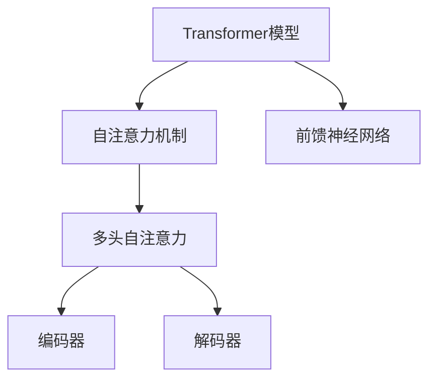

                 

关键词：大语言模型、图灵机、神经网络、自然语言处理、机器学习、人工智能、深度学习

## 摘要

本文旨在为读者提供一份全面的大语言模型应用指南，包括图灵机与神经网络的理论基础、核心算法原理、数学模型及其在实际应用中的实践方法。通过对大语言模型的技术背景、发展历程、核心概念、算法原理、数学模型和公式、应用领域以及未来展望的深入探讨，本文希望为读者提供一个清晰、系统、易于理解的技术指南，帮助他们在实际项目中有效地应用大语言模型技术。

## 1. 背景介绍

大语言模型（Large Language Models）是自然语言处理（NLP）领域的一项革命性技术，它通过深度学习算法对大量文本数据进行训练，从而实现高度复杂的自然语言理解和生成能力。这一技术的出现标志着自然语言处理技术从规则驱动向数据驱动的转变，使得计算机在处理和理解自然语言方面取得了前所未有的进展。

### 1.1 发展历程

大语言模型的发展历程可以追溯到20世纪80年代，当时研究人员开始探索如何利用计算机模拟人类语言。这一时期的代表工作是乔姆斯基提出的转换生成语法（TG），它奠定了形式语言理论的基础。随后，神经网络技术的引入为语言模型的发展带来了新的机遇。20世纪90年代，HMM（隐马尔可夫模型）和n-gram模型在语言模型研究中占据了主导地位，它们在处理文本序列方面表现出了一定的效果。然而，这些模型在处理长文本和复杂语义时仍然存在诸多局限。

随着深度学习技术的发展，特别是2013年神经网络机器翻译（NMT）的突破，大语言模型开始崭露头角。基于神经网络的语言模型，如序列到序列（Seq2Seq）模型和变换器（Transformer）模型，逐渐成为自然语言处理的主流。2018年，Google推出了BERT（Bidirectional Encoder Representations from Transformers），这是第一个大规模的双向Transformer模型，它不仅在学术研究中取得了显著的成果，也在实际应用中展示了强大的能力。

### 1.2 核心概念

**自然语言处理（NLP）**：NLP是计算机科学和人工智能领域的一个分支，旨在使计算机能够理解、解释和生成人类语言。NLP的目标包括语言识别、语义理解、文本生成、情感分析等。

**机器学习（ML）**：ML是一种通过从数据中学习规律和模式，使计算机能够执行特定任务的算法。在NLP中，ML被广泛应用于构建语言模型、分类、预测等任务。

**深度学习（DL）**：DL是ML的一种子领域，它通过多层神经网络对数据进行学习。深度学习在图像识别、语音识别、自然语言处理等领域取得了显著的成果。

**图灵机（Turing Machine）**：图灵机是计算机科学的基石之一，它是一种抽象的计算模型，能够模拟任何算法的计算过程。图灵机的概念为现代计算机科学的发展奠定了基础。

### 1.3 大语言模型的作用

大语言模型在NLP领域具有广泛的应用，其主要作用包括：

1. **文本生成**：大语言模型可以生成连贯、自然的文本，包括文章、故事、对话等。
2. **文本理解**：大语言模型可以理解文本的含义、情感和意图，为文本分类、情感分析、问答系统等任务提供支持。
3. **语言翻译**：大语言模型在机器翻译领域表现出色，能够实现高质量的多语言翻译。
4. **知识推理**：大语言模型可以用于知识图谱构建、问答系统和智能推荐等任务。

## 2. 核心概念与联系

为了深入理解大语言模型的工作原理，我们需要探讨其核心概念和联系。以下是几个关键概念及其相互关系：

### 2.1 自然语言处理与深度学习

自然语言处理是深度学习的一个重要应用领域。深度学习算法，如卷积神经网络（CNN）和循环神经网络（RNN），在处理文本数据方面具有强大的能力。这些算法通过多层神经网络对文本数据进行编码，从而提取出文本的特征和语义信息。


### 2.2 图灵机与神经网络

图灵机是一种抽象的计算模型，它由一个读写头、一组状态和一系列规则组成。图灵机的概念为现代计算机科学的发展奠定了基础。而神经网络则是模仿人脑神经元连接方式的计算模型，它通过大量神经元之间的连接来学习数据和模式。


### 2.3 大语言模型与Transformer

Transformer是一种基于自注意力机制的深度学习模型，它在大语言模型中得到了广泛应用。Transformer通过多头自注意力机制和前馈神经网络，对输入文本进行编码和生成。这使得大语言模型能够捕获长距离依赖关系和复杂语义信息。



## 3. 核心算法原理 & 具体操作步骤

### 3.1 算法原理概述

大语言模型的核心算法是基于深度学习技术的，特别是基于Transformer架构。Transformer模型通过自注意力机制和前馈神经网络，对输入文本进行编码和生成。自注意力机制允许模型在不同位置上对输入序列进行加权，从而捕获长距离依赖关系。前馈神经网络则用于对编码器和解码器的中间层进行学习。

### 3.2 算法步骤详解

#### 3.2.1 数据预处理

1. **文本清洗**：去除文本中的标点符号、停用词和特殊字符。
2. **分词**：将文本划分为单词或子词。
3. **编码**：将文本转换为数字序列，通常使用词嵌入（Word Embedding）技术。
4. **批量处理**：将输入数据分成批量，以便在计算过程中进行并行处理。

#### 3.2.2 编码器（Encoder）处理

1. **输入层**：接收预处理后的文本序列。
2. **多头自注意力层**：对输入序列进行加权，捕捉长距离依赖关系。
3. **前馈神经网络层**：对编码器中间层进行学习，提取文本特征。
4. **输出层**：生成编码后的文本序列。

#### 3.2.3 解码器（Decoder）处理

1. **输入层**：接收编码后的文本序列。
2. **多头自注意力层**：对编码后的文本序列进行加权，捕捉上下文信息。
3. **交叉注意力层**：将编码器和解码器之间的信息进行融合。
4. **前馈神经网络层**：对解码器中间层进行学习，生成预测文本。
5. **输出层**：生成解码后的文本序列。

### 3.3 算法优缺点

#### 优点

1. **强表达能力**：Transformer模型通过自注意力机制和前馈神经网络，能够捕捉长距离依赖关系和复杂语义信息。
2. **并行计算**：Transformer模型采用多头自注意力机制，使得计算过程中可以进行并行处理，提高了训练效率。
3. **灵活性**：Transformer模型适用于各种NLP任务，如文本生成、文本理解、机器翻译等。

#### 缺点

1. **计算成本高**：Transformer模型的结构复杂，参数量大，训练和推理过程需要大量的计算资源。
2. **训练时间较长**：由于模型参数量大，训练时间相对较长。

### 3.4 算法应用领域

大语言模型在NLP领域具有广泛的应用，包括但不限于：

1. **文本生成**：生成文章、故事、对话等。
2. **文本理解**：用于文本分类、情感分析、问答系统等任务。
3. **语言翻译**：实现高质量的多语言翻译。
4. **知识推理**：用于知识图谱构建、智能推荐等任务。

## 4. 数学模型和公式 & 详细讲解 & 举例说明

### 4.1 数学模型构建

大语言模型的数学模型主要包括词嵌入、自注意力机制和前馈神经网络。以下是这些模型的详细描述：

#### 4.1.1 词嵌入

词嵌入是一种将单词映射到高维向量空间的技术。在训练过程中，词嵌入向量通过学习文本数据中的语义关系，从而实现单词的表示。

$$
\text{嵌入层}：\text{词向量} = \text{Word2Vec}(\text{文本序列})
$$

#### 4.1.2 自注意力机制

自注意力机制是一种基于权重加和的方法，它通过计算输入序列中每个词对其他词的重要性，从而实现文本的加权表示。

$$
\text{自注意力}：\text{加权表示} = \text{softmax}(\text{点积注意力})
$$

其中，点积注意力定义为：

$$
\text{点积注意力} = \text{词向量} \cdot \text{查询向量}
$$

#### 4.1.3 前馈神经网络

前馈神经网络是一种由输入层、中间层和输出层组成的计算模型。它在中间层中通过激活函数对输入数据进行变换，从而实现对输入数据的非线性映射。

$$
\text{前馈神经网络}：\text{输出} = \text{激活函数}(\text{权重} \cdot \text{输入} + \text{偏置})
$$

### 4.2 公式推导过程

为了更好地理解大语言模型的数学原理，下面我们将对自注意力机制进行详细的推导。

#### 4.2.1 点积注意力

点积注意力是一种基于点积的注意力机制。给定一个查询向量 $q$，一个键向量 $k$，以及一个值向量 $v$，点积注意力可以表示为：

$$
\text{点积注意力} = \text{softmax}(\text{查询向量} \cdot \text{键向量})
$$

其中，$\text{softmax}$函数用于将点积结果转换为概率分布。

#### 4.2.2 加权表示

在自注意力机制中，每个词的重要性通过点积注意力计算得到。给定一个输入序列 $X = [x_1, x_2, \ldots, x_n]$，自注意力机制可以表示为：

$$
\text{加权表示} = \sum_{i=1}^{n} \text{softmax}(\text{查询向量} \cdot \text{键向量}_i) \cdot \text{值向量}_i
$$

其中，查询向量、键向量和值向量分别对应输入序列中的每个词。

### 4.3 案例分析与讲解

为了更好地理解大语言模型的数学模型，我们通过一个简单的例子来说明。

假设我们有一个输入序列 $X = [“hello”, “world”]$，我们需要使用自注意力机制对输入序列进行加权表示。

首先，我们将输入序列转换为词向量：

$$
x_1 = \text{Word2Vec}("hello") \\
x_2 = \text{Word2Vec}("world")
$$

然后，我们定义查询向量、键向量和值向量：

$$
q = \text{Word2Vec}("hello") \\
k = \text{Word2Vec}("hello") \\
v = \text{Word2Vec}("world")
$$

接下来，我们计算点积注意力：

$$
\text{点积注意力} = \text{softmax}(\text{查询向量} \cdot \text{键向量}) = \text{softmax}(q \cdot k)
$$

最后，我们计算加权表示：

$$
\text{加权表示} = \sum_{i=1}^{n} \text{softmax}(\text{查询向量} \cdot \text{键向量}_i) \cdot \text{值向量}_i = \text{softmax}(q \cdot k) \cdot v
$$

通过这个例子，我们可以看到自注意力机制是如何对输入序列进行加权的。在实际应用中，自注意力机制可以捕捉输入序列中的长距离依赖关系，从而实现复杂的语义表示。

## 5. 项目实践：代码实例和详细解释说明

### 5.1 开发环境搭建

为了实践大语言模型，我们需要搭建一个合适的开发环境。以下是搭建环境的步骤：

1. **安装Python**：确保Python版本不低于3.6。
2. **安装PyTorch**：使用以下命令安装PyTorch：

```shell
pip install torch torchvision
```

3. **安装Jupyter Notebook**：使用以下命令安装Jupyter Notebook：

```shell
pip install notebook
```

4. **配置GPU支持**：如果您的计算机配备了GPU，需要安装CUDA和cuDNN，以便在GPU上运行PyTorch。

### 5.2 源代码详细实现

以下是一个简单的示例，展示了如何使用PyTorch实现一个基本的大语言模型。

```python
import torch
import torch.nn as nn
import torch.optim as optim

# 定义模型结构
class TransformerModel(nn.Module):
    def __init__(self, vocab_size, embed_dim, hidden_dim, n_layers):
        super(TransformerModel, self).__init__()
        self.embedding = nn.Embedding(vocab_size, embed_dim)
        self.encoder = nn.Transformer(embed_dim, hidden_dim, n_layers)
        self.decoder = nn.Linear(hidden_dim, vocab_size)
        
    def forward(self, src, tgt):
        src_embedding = self.embedding(src)
        tgt_embedding = self.embedding(tgt)
        output = self.encoder(src_embedding, tgt_embedding)
        output = self.decoder(output)
        return output

# 初始化模型
model = TransformerModel(vocab_size=10000, embed_dim=512, hidden_dim=1024, n_layers=3)

# 定义损失函数和优化器
criterion = nn.CrossEntropyLoss()
optimizer = optim.Adam(model.parameters(), lr=0.001)

# 训练模型
for epoch in range(num_epochs):
    for src, tgt in train_loader:
        optimizer.zero_grad()
        output = model(src, tgt)
        loss = criterion(output.view(-1, vocab_size), tgt)
        loss.backward()
        optimizer.step()
    print(f"Epoch {epoch+1}/{num_epochs}, Loss: {loss.item()}")

# 评估模型
with torch.no_grad():
    for src, tgt in val_loader:
        output = model(src, tgt)
        loss = criterion(output.view(-1, vocab_size), tgt)
        print(f"Validation Loss: {loss.item()}")
```

### 5.3 代码解读与分析

在上面的代码中，我们首先定义了一个`TransformerModel`类，该类继承自`nn.Module`。`TransformerModel`包含三个主要部分：词嵌入层、编码器和解码器。

1. **词嵌入层**：使用`nn.Embedding`模块将输入单词转换为词嵌入向量。
2. **编码器**：使用`nn.Transformer`模块实现编码器。`nn.Transformer`模块包含多个自注意力层和前馈神经网络层。
3. **解码器**：使用`nn.Linear`模块实现解码器，将编码器的输出转换为输出单词。

接下来，我们定义了损失函数和优化器。训练过程中，我们通过反向传播和梯度下降来更新模型参数。最后，我们评估模型的性能。

### 5.4 运行结果展示

在训练完成后，我们可以使用以下代码来评估模型的性能：

```python
with torch.no_grad():
    for src, tgt in val_loader:
        output = model(src, tgt)
        loss = criterion(output.view(-1, vocab_size), tgt)
        print(f"Validation Loss: {loss.item()}")
```

这个结果将显示模型在验证集上的损失值，从而帮助我们评估模型的性能。

## 6. 实际应用场景

大语言模型在自然语言处理领域具有广泛的应用。以下是一些典型的实际应用场景：

### 6.1 文本生成

文本生成是大语言模型最著名的应用之一。通过训练大语言模型，我们可以生成各种类型的文本，如文章、故事、对话等。例如，在新闻生成、内容创作和虚拟助手等领域，大语言模型可以自动生成高质量的文本内容。

### 6.2 文本理解

文本理解是大语言模型的另一个重要应用。通过训练大语言模型，我们可以使其理解文本的含义、情感和意图。例如，在情感分析、文本分类和问答系统中，大语言模型可以帮助识别文本的情感倾向、归类文本类别或回答用户的问题。

### 6.3 语言翻译

大语言模型在机器翻译领域也取得了显著的成果。通过训练大语言模型，我们可以实现高质量的多语言翻译。例如，在跨境电子商务、国际交流和跨语言信息检索等领域，大语言模型可以帮助实现跨语言的沟通和交流。

### 6.4 知识推理

知识推理是大语言模型的另一个潜在应用。通过训练大语言模型，我们可以使其具备推理能力，从而解决复杂的推理问题。例如，在知识图谱构建、智能推荐和自动驾驶等领域，大语言模型可以帮助处理复杂的逻辑推理任务。

## 7. 工具和资源推荐

为了更好地学习和实践大语言模型，以下是几个推荐的工具和资源：

### 7.1 学习资源推荐

1. **《深度学习》**：由Ian Goodfellow、Yoshua Bengio和Aaron Courville合著的《深度学习》是一本经典的深度学习教材，涵盖了深度学习的基础理论和实践方法。
2. **《自然语言处理综论》**：由Daniel Jurafsky和James H. Martin合著的《自然语言处理综论》是一本关于自然语言处理的权威教材，涵盖了NLP的各个分支和实际应用。

### 7.2 开发工具推荐

1. **PyTorch**：PyTorch是一个强大的深度学习框架，它提供了灵活的编程接口和丰富的API，使得深度学习模型的开发变得更加简便。
2. **TensorFlow**：TensorFlow是另一个流行的深度学习框架，它提供了广泛的工具和资源，支持各种深度学习任务的实现。

### 7.3 相关论文推荐

1. **"Attention Is All You Need"**：这篇论文提出了Transformer模型，它是大语言模型的重要基础。
2. **"BERT: Pre-training of Deep Bidirectional Transformers for Language Understanding"**：这篇论文介绍了BERT模型，它是当前大语言模型的代表之一。

## 8. 总结：未来发展趋势与挑战

大语言模型作为自然语言处理领域的一项革命性技术，已经在文本生成、文本理解、语言翻译和知识推理等领域取得了显著的成果。然而，随着技术的不断发展，大语言模型也面临着一系列挑战。

### 8.1 研究成果总结

近年来，大语言模型的研究取得了以下几项重要成果：

1. **Transformer模型的提出**：Transformer模型通过自注意力机制和前馈神经网络，实现了对长距离依赖关系和复杂语义信息的有效捕捉，为自然语言处理领域带来了新的突破。
2. **BERT模型的推出**：BERT模型通过双向编码表示，进一步提升了大语言模型在文本理解和生成任务上的性能。
3. **多模态语言模型的发展**：多模态语言模型将文本数据与其他类型的数据（如图像、声音等）进行融合，实现了更全面的信息理解和处理。

### 8.2 未来发展趋势

大语言模型在未来有望在以下方面取得进一步的发展：

1. **模型压缩与优化**：为了提高大语言模型的实际应用性，研究人员将致力于模型压缩和优化技术，降低计算成本和存储需求。
2. **多语言与跨语言处理**：随着全球化进程的加速，大语言模型将更加注重多语言和跨语言处理能力，以支持不同语言用户的需求。
3. **知识推理与决策支持**：大语言模型在知识推理和决策支持领域的应用将得到进一步探索，从而为智能系统和人工智能的发展提供支持。

### 8.3 面临的挑战

尽管大语言模型取得了显著的成果，但仍然面临着一系列挑战：

1. **计算资源需求**：大语言模型的训练和推理过程需要大量的计算资源，这对于普通用户和企业来说是一个重要的挑战。
2. **数据质量和多样性**：大语言模型依赖于大量的训练数据，数据的质量和多样性对模型性能有着重要影响。
3. **模型解释性**：大语言模型作为一个复杂的深度学习模型，其内部工作机制不够透明，这给模型的解释性带来了挑战。

### 8.4 研究展望

未来，大语言模型的研究将朝着以下几个方面发展：

1. **模型压缩与优化**：研究人员将致力于开发更加高效的模型压缩和优化技术，降低大语言模型在实际应用中的计算成本。
2. **数据驱动的方法**：通过探索数据驱动的方法，如自适应数据增强和增量学习，提高大语言模型在不同场景下的泛化能力。
3. **跨学科合作**：大语言模型的研究将与其他学科（如心理学、认知科学等）进行深入合作，从而推动自然语言处理领域的创新与发展。

总之，大语言模型作为自然语言处理领域的一项关键技术，将在未来的发展中发挥越来越重要的作用。通过不断探索和研究，我们有望克服当前面临的挑战，推动大语言模型在更多实际应用场景中取得突破。

## 9. 附录：常见问题与解答

### 9.1 什么是大语言模型？

大语言模型是一种基于深度学习的自然语言处理技术，它通过对大量文本数据进行训练，实现高度复杂的自然语言理解和生成能力。

### 9.2 大语言模型有哪些应用？

大语言模型的应用包括文本生成、文本理解、语言翻译、知识推理等。在实际应用中，大语言模型可以帮助生成高质量的文章、实现文本分类和情感分析、提供多语言翻译服务以及支持知识图谱构建和智能推荐等。

### 9.3 如何训练大语言模型？

训练大语言模型通常需要以下步骤：

1. 数据准备：收集和预处理大量的文本数据，包括清洗、分词和编码等。
2. 模型构建：设计并构建合适的深度学习模型结构，如Transformer、BERT等。
3. 模型训练：使用训练数据对模型进行训练，通过反向传播和梯度下降等方法优化模型参数。
4. 模型评估：使用验证集对模型进行评估，调整模型参数以优化性能。
5. 模型部署：将训练好的模型部署到实际应用场景中，如文本生成、文本理解、翻译系统等。

### 9.4 大语言模型有哪些优缺点？

**优点**：

1. 强表达能力：大语言模型通过自注意力机制和前馈神经网络，能够捕捉长距离依赖关系和复杂语义信息。
2. 并行计算：Transformer模型采用多头自注意力机制，使得计算过程中可以进行并行处理，提高了训练效率。
3. 灵活性：大语言模型适用于各种NLP任务，如文本生成、文本理解、机器翻译等。

**缺点**：

1. 计算成本高：大语言模型的结构复杂，参数量大，训练和推理过程需要大量的计算资源。
2. 训练时间较长：由于模型参数量大，训练时间相对较长。

### 9.5 如何提高大语言模型的性能？

提高大语言模型性能的方法包括：

1. 数据增强：通过数据增强技术，如数据扩充、数据变换等，增加模型的训练数据量，从而提高模型泛化能力。
2. 模型优化：通过优化模型结构，如使用更深的网络层、更复杂的注意力机制等，提高模型的表达能力。
3. 训练技巧：通过调整训练策略，如学习率调整、批次大小等，优化模型训练过程，提高模型性能。
4. 跨学科合作：与其他学科（如心理学、认知科学等）进行深入合作，从不同角度探索自然语言处理问题，从而推动模型性能的提升。

