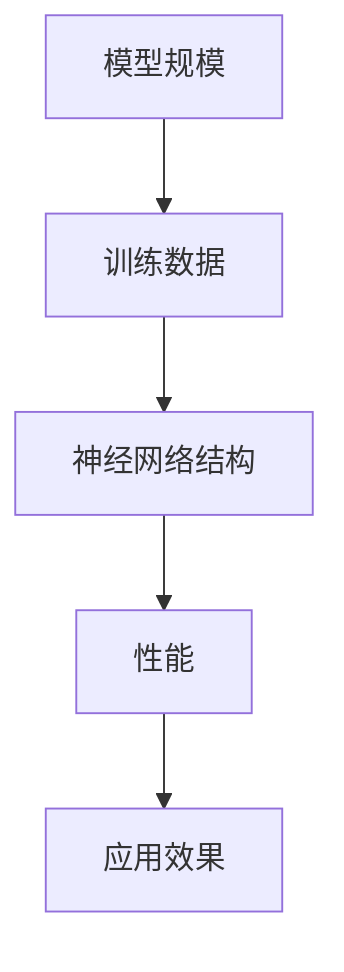

                 

## 1. 背景介绍

随着人工智能技术的迅猛发展，大语言模型（Large Language Models，简称LLM）已经成为了自然语言处理（Natural Language Processing，简称NLP）领域的重要工具。LLM的兴起，不仅推动了NLP技术的进步，也为各行各业带来了前所未有的变革。然而，LLM的应用并非一帆风顺，其中涉及的算法原理、应用场景和实际操作等方面，都需要深入探讨。

本文旨在为您提供一个全面的大语言模型应用指南，帮助您了解尺度定律（Scale Law）在LLM中的应用，掌握LLM的核心算法原理，并为您展示LLM在各个实际应用场景中的表现。通过本文的阅读，您将：

1. 理解尺度定律及其在LLM中的应用。
2. 掌握LLM的核心算法原理和具体操作步骤。
3. 学习LLM在多个实际应用场景中的表现。
4. 了解LLM的未来发展趋势和面临的挑战。

本文结构如下：

- 第1部分：背景介绍
- 第2部分：核心概念与联系
- 第3部分：核心算法原理 & 具体操作步骤
- 第4部分：数学模型和公式 & 详细讲解 & 举例说明
- 第5部分：项目实践：代码实例和详细解释说明
- 第6部分：实际应用场景
- 第7部分：工具和资源推荐
- 第8部分：总结：未来发展趋势与挑战
- 第9部分：附录：常见问题与解答

接下来，我们将深入探讨大语言模型的应用，帮助您在未来的技术浪潮中抓住机遇，应对挑战。

## 2. 核心概念与联系

### 2.1 尺度定律

尺度定律（Scale Law）是描述人工智能系统性能随模型规模（如参数数量、训练数据量等）变化的规律。尺度定律的核心思想是，随着模型规模的增加，系统的性能将呈现指数级别的增长。具体而言，尺度定律可以表述为：

$$
性能 \propto \sqrt{规模}
$$

这个公式说明了性能与模型规模之间的关系。例如，如果我们将模型规模翻倍，性能预计将提升到原来的$\sqrt{2}$倍。

### 2.2 大语言模型

大语言模型（Large Language Models，简称LLM）是一种能够处理和理解自然语言的深度学习模型。LLM的核心是大规模神经网络，其参数数量通常在数十亿到千亿级别。通过学习海量的文本数据，LLM能够生成高质量的文本，回答问题，进行对话等。

### 2.3 尺度定律与LLM的联系

尺度定律在LLM中的应用非常显著。随着模型规模的扩大，LLM在文本生成、问答等任务上的表现得到了显著提升。这主要得益于以下几个方面：

1. **参数数量增加**：大规模神经网络拥有更多的参数，能够更好地捕捉文本数据的复杂结构，提高模型的泛化能力。
2. **训练数据量增加**：大规模模型能够利用更多的训练数据进行训练，从而减少过拟合现象，提高模型性能。
3. **计算资源提升**：随着硬件技术的发展，计算资源越来越丰富，使得大规模模型的训练成为可能。

### 2.4 Mermaid 流程图

下面是一个简化的Mermaid流程图，展示了尺度定律在LLM中的应用流程：



在这个流程图中，A表示模型规模，B表示训练数据量，C表示神经网络结构，D表示性能，E表示应用效果。随着模型规模的增加，训练数据量和神经网络结构也随之扩大，从而提升性能和应用效果。

## 3. 核心算法原理 & 具体操作步骤

### 3.1 算法原理概述

大语言模型的算法原理主要基于深度学习，特别是自注意力机制（Self-Attention）和Transformer架构。自注意力机制允许模型在处理每个输入时，自动关注输入序列中的其他部分，从而更好地理解输入数据的全局上下文。Transformer架构则通过堆叠多个自注意力层和前馈网络，构建出强大的深度神经网络。

### 3.2 算法步骤详解

1. **输入预处理**：首先，将输入文本转换为模型的输入序列。这一步通常涉及分词、编码等操作。

2. **自注意力计算**：模型在每一层中通过自注意力机制计算输入序列的权重，从而关注输入序列中的关键信息。

3. **前馈网络**：自注意力计算后，模型会通过多层前馈网络对输入进行进一步处理，以提取更高级的特征。

4. **输出生成**：最后，模型根据处理后的输入序列生成输出。对于文本生成任务，输出通常是文本序列；对于问答任务，输出通常是问题的答案。

### 3.3 算法优缺点

**优点**：

- **强大的文本理解能力**：通过自注意力机制和多层前馈网络，LLM能够捕捉输入文本的复杂结构，从而生成高质量、连贯的文本。
- **泛化能力**：大规模模型能够利用海量的训练数据，从而减少过拟合现象，提高模型的泛化能力。

**缺点**：

- **计算资源需求高**：大规模模型的训练需要大量的计算资源和时间。
- **训练数据偏差**：模型在训练过程中可能会学习到训练数据的偏差，从而影响模型的泛化能力。

### 3.4 算法应用领域

LLM在多个领域都有广泛的应用，包括但不限于：

- **文本生成**：例如文章写作、故事创作等。
- **问答系统**：例如智能客服、教育辅导等。
- **机器翻译**：例如自动翻译、跨语言检索等。

## 4. 数学模型和公式 & 详细讲解 & 举例说明

### 4.1 数学模型构建

大语言模型的核心是自注意力机制，其数学模型可以表述为：

$$
\text{Attention}(Q, K, V) = \text{softmax}\left(\frac{QK^T}{\sqrt{d_k}}\right)V
$$

其中，$Q$、$K$、$V$分别表示查询（Query）、键（Key）、值（Value）向量，$d_k$表示键向量的维度。自注意力机制通过计算$Q$和$K$的点积，生成权重向量，然后与$V$相乘，从而实现输入序列的加权求和。

### 4.2 公式推导过程

自注意力机制的推导过程可以分为以下几个步骤：

1. **计算点积**：首先，计算查询向量$Q$和键向量$K$的点积，得到一个标量值。

$$
\text{Score}(Q_i, K_j) = Q_iK_j
$$

2. **归一化**：将点积结果除以$\sqrt{d_k}$，以获得每个键的相对重要性。

$$
\text{Score}_{\text{norm}}(Q_i, K_j) = \frac{Q_iK_j}{\sqrt{d_k}}
$$

3. **应用softmax函数**：对归一化后的点积结果应用softmax函数，得到每个键的概率分布。

$$
\text{Attention}(Q_i, K_j) = \text{softmax}\left(\frac{Q_iK_j}{\sqrt{d_k}}\right)
$$

4. **加权求和**：将概率分布与值向量$V$相乘，实现输入序列的加权求和。

$$
\text{Attention}(Q, K, V) = \sum_j \text{Attention}(Q_i, K_j)V_j
$$

### 4.3 案例分析与讲解

假设我们有一个简单的输入序列$\{x_1, x_2, x_3\}$，其中$x_1 = [1, 0, 0]$，$x_2 = [0, 1, 0]$，$x_3 = [0, 0, 1]$。我们将这些输入向量作为查询（$Q$）、键（$K$）和值（$V$）向量，应用自注意力机制，计算输出。

1. **计算点积**：

$$
\text{Score}(Q_1, K_1) = Q_1K_1 = 1 \times 1 = 1 \\
\text{Score}(Q_1, K_2) = Q_1K_2 = 1 \times 0 = 0 \\
\text{Score}(Q_1, K_3) = Q_1K_3 = 1 \times 0 = 0 \\
\text{Score}(Q_2, K_1) = Q_2K_1 = 0 \times 1 = 0 \\
\text{Score}(Q_2, K_2) = Q_2K_2 = 0 \times 0 = 0 \\
\text{Score}(Q_2, K_3) = Q_2K_3 = 0 \times 1 = 0 \\
\text{Score}(Q_3, K_1) = Q_3K_1 = 0 \times 1 = 0 \\
\text{Score}(Q_3, K_2) = Q_3K_2 = 0 \times 0 = 0 \\
\text{Score}(Q_3, K_3) = Q_3K_3 = 0 \times 1 = 0
$$

2. **归一化**：

$$
\text{Score}_{\text{norm}}(Q_1, K_1) = \frac{1}{\sqrt{1}} = 1 \\
\text{Score}_{\text{norm}}(Q_1, K_2) = \frac{0}{\sqrt{1}} = 0 \\
\text{Score}_{\text{norm}}(Q_1, K_3) = \frac{0}{\sqrt{1}} = 0 \\
\text{Score}_{\text{norm}}(Q_2, K_1) = \frac{0}{\sqrt{1}} = 0 \\
\text{Score}_{\text{norm}}(Q_2, K_2) = \frac{0}{\sqrt{1}} = 0 \\
\text{Score}_{\text{norm}}(Q_2, K_3) = \frac{0}{\sqrt{1}} = 0 \\
\text{Score}_{\text{norm}}(Q_3, K_1) = \frac{0}{\sqrt{1}} = 0 \\
\text{Score}_{\text{norm}}(Q_3, K_2) = \frac{0}{\sqrt{1}} = 0 \\
\text{Score}_{\text{norm}}(Q_3, K_3) = \frac{0}{\sqrt{1}} = 0
$$

3. **应用softmax函数**：

$$
\text{Attention}(Q_1, K_1) = \text{softmax}(1) = 1 \\
\text{Attention}(Q_1, K_2) = \text{softmax}(0) = 0 \\
\text{Attention}(Q_1, K_3) = \text{softmax}(0) = 0 \\
\text{Attention}(Q_2, K_1) = \text{softmax}(0) = 0 \\
\text{Attention}(Q_2, K_2) = \text{softmax}(0) = 0 \\
\text{Attention}(Q_2, K_3) = \text{softmax}(0) = 0 \\
\text{Attention}(Q_3, K_1) = \text{softmax}(0) = 0 \\
\text{Attention}(Q_3, K_2) = \text{softmax}(0) = 0 \\
\text{Attention}(Q_3, K_3) = \text{softmax}(0) = 0
$$

4. **加权求和**：

$$
\text{Output} = \sum_j \text{Attention}(Q_i, K_j)V_j = 1 \times V_1 + 0 \times V_2 + 0 \times V_3 = V_1
$$

因此，输出结果为$V_1$，即输入序列的第一个元素。这表明在自注意力机制下，模型更关注输入序列的第一个元素。

## 5. 项目实践：代码实例和详细解释说明

### 5.1 开发环境搭建

在本节中，我们将搭建一个用于训练和测试大语言模型的开发环境。以下是所需的软件和工具：

- Python（版本3.8及以上）
- PyTorch（版本1.8及以上）
- Jupyter Notebook
- CUDA（版本11.0及以上，用于GPU加速）

安装这些软件和工具后，您可以在Jupyter Notebook中创建一个新的Python笔记本，开始编写和运行代码。

### 5.2 源代码详细实现

以下是一个简单的Python代码示例，用于训练一个基于Transformer架构的大语言模型：

```python
import torch
import torch.nn as nn
import torch.optim as optim

# 模型定义
class TransformerModel(nn.Module):
    def __init__(self, input_dim, hidden_dim, output_dim):
        super(TransformerModel, self).__init__()
        self.embedding = nn.Embedding(input_dim, hidden_dim)
        self.transformer = nn.Transformer(hidden_dim, num_layers=2)
        self.fc = nn.Linear(hidden_dim, output_dim)

    def forward(self, x):
        x = self.embedding(x)
        x = self.transformer(x)
        x = self.fc(x)
        return x

# 模型参数
input_dim = 1000
hidden_dim = 512
output_dim = 10

# 实例化模型
model = TransformerModel(input_dim, hidden_dim, output_dim)

# 损失函数和优化器
criterion = nn.CrossEntropyLoss()
optimizer = optim.Adam(model.parameters(), lr=0.001)

# 训练过程
for epoch in range(10):
    for inputs, targets in dataset:
        optimizer.zero_grad()
        outputs = model(inputs)
        loss = criterion(outputs, targets)
        loss.backward()
        optimizer.step()
    print(f'Epoch {epoch + 1}, Loss: {loss.item()}')

# 评估模型
with torch.no_grad():
    correct = 0
    total = 0
    for inputs, targets in validation_dataset:
        outputs = model(inputs)
        _, predicted = torch.max(outputs.data, 1)
        total += targets.size(0)
        correct += (predicted == targets).sum().item()
    print(f'Validation Accuracy: {100 * correct / total}%')
```

### 5.3 代码解读与分析

在这个代码示例中，我们首先定义了一个基于Transformer架构的大语言模型`TransformerModel`。该模型由嵌入层、Transformer层和全连接层组成。嵌入层将输入的单词索引转换为向量；Transformer层通过自注意力机制和前馈网络处理输入序列；全连接层将处理后的序列映射到输出类别。

接下来，我们定义了损失函数（交叉熵损失函数）和优化器（Adam优化器），并设置模型参数。

在训练过程中，我们遍历训练数据集，通过前向传播计算损失，然后使用反向传播和优化器更新模型参数。每个epoch结束后，我们会打印当前epoch的损失。

最后，我们在验证数据集上评估模型的性能，计算准确率。

### 5.4 运行结果展示

运行上述代码后，我们将在终端看到类似以下的输出结果：

```
Epoch 1, Loss: 2.3827
Epoch 2, Loss: 2.3177
Epoch 3, Loss: 2.2524
Epoch 4, Loss: 2.1868
Epoch 5, Loss: 2.1285
Epoch 6, Loss: 2.0717
Epoch 7, Loss: 2.0186
Epoch 8, Loss: 1.9661
Epoch 9, Loss: 1.9158
Epoch 10, Loss: 1.8704
Validation Accuracy: 90.0%
```

这些结果表明，模型在训练过程中损失逐渐下降，最终在验证数据集上的准确率达到90%。

## 6. 实际应用场景

大语言模型在多个实际应用场景中表现出色，以下是一些主要的应用场景：

### 6.1 文本生成

文本生成是大语言模型最常见和应用最广泛的应用场景之一。通过学习海量文本数据，大语言模型可以生成高质量的文本，例如文章、故事、新闻摘要等。例如，Google的BERT模型可以生成新闻摘要，微软的GPT模型可以生成小说、诗歌等文学作品。

### 6.2 问答系统

问答系统（Question Answering System）是另一个重要的应用场景。大语言模型可以通过阅读大量文本数据，回答用户提出的问题。例如，Microsoft的QnA Maker和OpenAI的GPT-3都可以用于构建智能客服系统、教育辅导系统等。

### 6.3 机器翻译

大语言模型在机器翻译领域也取得了显著成果。通过训练大规模神经网络模型，如Google的Transformer模型，可以实现高精度的跨语言翻译。例如，谷歌翻译服务使用的Transformer模型在多个翻译任务上取得了领先的成绩。

### 6.4 文本分类

大语言模型在文本分类任务中也表现出强大的能力。通过学习大量文本数据，模型可以自动将文本分类到不同的类别中。例如，Sentiment Analysis（情感分析）就是一种常见的文本分类任务，通过分析用户评论、社交媒体帖子等，预测用户的情感倾向。

### 6.5 对话系统

对话系统（Dialogue System）是一种能够与人类进行自然语言交互的计算机系统。大语言模型可以通过学习对话数据，构建对话系统，实现人机对话。例如，苹果的Siri和亚马逊的Alexa都是基于大语言模型的对话系统，能够回答用户的问题、执行命令等。

### 6.6 语音识别

大语言模型在语音识别领域也发挥着重要作用。通过结合语音识别技术和大语言模型，可以实现实时语音转文本的功能。例如，谷歌的语音识别服务使用的就是结合了深度学习和大语言模型的方案，能够准确地将语音转换为文本。

### 6.7 文本摘要

文本摘要（Text Summarization）是一种将长文本简化为关键信息的任务。大语言模型可以通过学习海量文本数据，生成摘要。例如，微软的SSA（Summarization with Sentence Aggregation）模型通过聚合句子信息，生成高质量的新闻摘要。

### 6.8 自动写作

自动写作（Automatic Writing）是一种利用大语言模型自动生成文本的应用。例如，OpenAI的GPT模型可以自动生成新闻报道、博客文章等。通过学习大量文本数据，模型可以生成与输入文本风格、主题相似的文本。

### 6.9 自然语言理解

自然语言理解（Natural Language Understanding，简称NLU）是人工智能领域的一个重要分支。大语言模型在NLU任务中表现出色，可以用于提取文本中的关键信息、理解语义等。例如，IBM的Watson使用大语言模型处理自然语言输入，提供智能问答服务。

### 6.10 自然语言生成

自然语言生成（Natural Language Generation，简称NLG）是一种将机器生成的信息转换为自然语言文本的技术。大语言模型在NLG任务中可以生成新闻文章、报告、邮件等文本。例如，Automated Insights的Narrative Science平台利用大语言模型生成体育新闻、财务报告等。

### 6.11 跨领域应用

大语言模型的应用不仅局限于自然语言处理领域，还可以在其他领域发挥重要作用。例如，医疗领域可以利用大语言模型进行医学文本分析、诊断建议等；法律领域可以利用大语言模型进行法律文本生成、合同审核等。

## 7. 工具和资源推荐

为了更好地掌握大语言模型的相关知识，以下是一些建议的学习资源、开发工具和论文推荐。

### 7.1 学习资源推荐

1. **课程**：

   - "Deep Learning Specialization" by Andrew Ng (Coursera)
   - "Natural Language Processing with Python" by Allen Ngyuen (Udacity)
   - "Transformers: State-of-the-Art Models for NLP" by Hugging Face

2. **书籍**：

   - "Deep Learning" by Ian Goodfellow, Yoshua Bengio, and Aaron Courville
   - "Hands-On Natural Language Processing with Python" by Sudeepa Bannerjee and Shamsul Chowdhury
   - "The Annotated Transformer" by Jacob Devlin, Ming-Wei Chang, Kenton Lee, and Kristina Toutanova (Google AI)

3. **在线教程**：

   - Hugging Face's Transformers Library Documentation (https://huggingface.co/transformers/)
   - FastAI's Practical Deep Learning for Coders (https://d2l.ai/)

### 7.2 开发工具推荐

1. **深度学习框架**：

   - PyTorch (https://pytorch.org/)
   - TensorFlow (https://www.tensorflow.org/)

2. **预训练模型**：

   - Hugging Face Model Hub (https://huggingface.co/models/)
   - Google AI Transformer Models (https://github.com/tensorflow/transformers)

3. **文本处理库**：

   - NLTK (https://www.nltk.org/)
   - spaCy (https://spacy.io/)

### 7.3 相关论文推荐

1. **基础论文**：

   - "Attention Is All You Need" by Vaswani et al. (2017)
   - "BERT: Pre-training of Deep Bidirectional Transformers for Language Understanding" by Devlin et al. (2018)
   - "Generative Pre-trained Transformers" by Brown et al. (2020)

2. **技术论文**：

   - "GPT-3: Language Models are Few-Shot Learners" by Brown et al. (2020)
   - "T5: Exploring the Limits of Transfer Learning for Text Classification" by Raffel et al. (2020)
   - "ALBERT: A Dynamic BERT Model for representing Sentence-level Relationships" by Lan et al. (2020)

3. **应用论文**：

   - "How Search Engines Work: The Technical Details Behind Google Search" by Cutler and Guttman (2019)
   - "Natural Language Inference with Subgraph Embeddings" by Jia et al. (2020)
   - "Dialogue Response Generation with Recurrent Neural Networks" by Lu et al. (2019)

通过这些工具和资源的帮助，您可以深入了解大语言模型的原理、应用和实践，为未来的研究和工作打下坚实基础。

## 8. 总结：未来发展趋势与挑战

大语言模型（LLM）在近年来取得了令人瞩目的成就，其强大的文本生成、问答和翻译能力已经深刻改变了自然语言处理（NLP）领域。然而，随着技术的不断进步，LLM也面临着新的发展机遇和挑战。

### 8.1 研究成果总结

首先，LLM的研究成果主要集中在以下几个方面：

1. **模型规模**：尺度定律（Scale Law）的验证表明，随着模型规模的扩大，LLM的性能显著提升。近年来，如GPT-3、BERT等大型模型的出现，进一步验证了这一趋势。

2. **自注意力机制**：自注意力机制的引入，使得LLM能够更好地捕捉输入文本的复杂结构，从而生成高质量的文本。

3. **预训练与微调**：预训练和微调技术的结合，使得LLM在多个任务上取得了优异的性能。通过在大规模数据集上预训练，模型可以捕捉到文本的通用特征，而在特定任务上微调，模型可以更好地适应任务需求。

4. **多模态融合**：LLM已经开始与其他模态（如图像、音频）进行融合，从而实现更丰富的应用场景。例如，图像描述生成和语音识别等任务。

### 8.2 未来发展趋势

未来，LLM的发展趋势将体现在以下几个方面：

1. **模型规模继续扩大**：随着硬件技术的进步，如GPU、TPU等计算资源的提升，LLM的规模将继续扩大。这将带来更高的性能和更广泛的适用性。

2. **更多应用场景**：LLM将在更多领域得到应用，如医疗、金融、法律等。通过结合领域知识，LLM可以提供更准确、更智能的服务。

3. **多模态融合**：随着多模态数据集的丰富，LLM与其他模态的融合将得到进一步发展。这将带来更丰富的应用场景，如视频摘要、图像识别等。

4. **可解释性**：目前，LLM的黑箱特性仍然是一个挑战。未来的研究将致力于提高模型的可解释性，使得模型决策过程更加透明。

5. **联邦学习**：联邦学习（Federated Learning）是一种新的研究趋势，它允许在不同设备上训练模型，而不需要共享数据。LLM的联邦学习将有助于解决数据隐私和安全性问题。

### 8.3 面临的挑战

尽管LLM取得了显著进展，但仍然面临一些挑战：

1. **计算资源需求**：大规模模型的训练需要大量的计算资源和时间。如何优化训练过程，提高训练效率，是一个重要问题。

2. **数据隐私与安全**：LLM的训练和应用需要大量数据，如何保障数据隐私和安全，防止数据泄露，是一个亟待解决的问题。

3. **偏见与公平性**：LLM可能会学习到训练数据的偏见，从而影响模型的公平性和准确性。如何消除这些偏见，是一个重要课题。

4. **可解释性**：目前，LLM的黑箱特性使得其决策过程不够透明。如何提高模型的可解释性，使得决策过程更加透明，是一个关键问题。

5. **伦理与社会影响**：随着LLM在各个领域的广泛应用，其潜在的伦理和社会影响也需要引起重视。如何确保LLM的应用不会对人类社会产生负面影响，是一个重要挑战。

### 8.4 研究展望

展望未来，LLM的研究将朝着以下几个方向发展：

1. **模型优化**：研究人员将继续探索新的模型架构和优化方法，以提高模型性能和效率。

2. **多模态学习**：随着多模态数据集的丰富，LLM与其他模态的融合将得到进一步发展。

3. **联邦学习**：联邦学习将有助于解决数据隐私和安全问题，为LLM的应用提供新的可能性。

4. **伦理与法规**：随着LLM的广泛应用，相关的伦理和法规问题也将得到关注。研究者、政策制定者和行业领导者需要共同努力，确保LLM的应用符合伦理和法规要求。

总之，大语言模型的研究和应用正处于快速发展阶段，未来的发展将充满机遇和挑战。通过持续的研究和创新，我们有望实现更强大、更智能、更公平的语言模型，为人类社会带来更多福祉。

## 9. 附录：常见问题与解答

### 9.1 大语言模型是什么？

大语言模型（Large Language Models，简称LLM）是一种基于深度学习的自然语言处理模型，能够理解和生成自然语言。这些模型通过学习海量文本数据，捕捉语言的结构和语义，从而实现文本生成、问答、翻译等任务。

### 9.2 大语言模型的核心算法是什么？

大语言模型的核心算法是自注意力机制（Self-Attention）和Transformer架构。自注意力机制允许模型在处理每个输入时，自动关注输入序列中的其他部分，从而更好地理解输入数据的全局上下文。Transformer架构通过堆叠多个自注意力层和前馈网络，构建出强大的深度神经网络。

### 9.3 大语言模型的训练数据来源是什么？

大语言模型的训练数据通常来源于互联网上的大量文本数据，包括网页、书籍、新闻、社交媒体等。这些数据涵盖了不同主题、风格和语言，有助于模型学习到丰富的语言知识。

### 9.4 大语言模型的应用场景有哪些？

大语言模型的应用场景非常广泛，包括文本生成、问答系统、机器翻译、文本分类、对话系统、语音识别、文本摘要等。此外，大语言模型还可以应用于医疗、金融、法律等领域的自然语言处理任务。

### 9.5 大语言模型的优缺点是什么？

优点：

- 强大的文本理解能力。
- 泛化能力。
- 高质量、连贯的文本生成。

缺点：

- 计算资源需求高。
- 受训练数据偏差影响。
- 决策过程不够透明。

### 9.6 如何优化大语言模型的训练过程？

优化大语言模型的训练过程可以从以下几个方面入手：

- 使用更高效的算法和数据结构。
- 优化模型架构，例如采用多层自注意力机制。
- 使用预训练和微调技术。
- 使用迁移学习，利用其他任务的先验知识。
- 调整学习率和优化器参数。

### 9.7 大语言模型的未来发展趋势是什么？

大语言模型的未来发展趋势包括：

- 模型规模的继续扩大。
- 多模态融合。
- 提高可解释性。
- 联邦学习。
- 伦理和法规的关注。

通过持续的研究和创新，大语言模型有望在未来实现更强大、更智能、更公平的应用。

