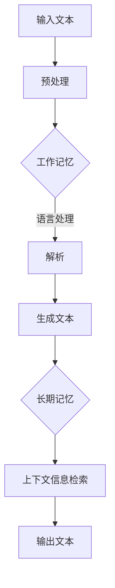

                 

关键词：大语言模型、工作记忆、长短期记忆、应用指南、算法原理、代码实例、数学模型、未来展望

> 摘要：本文将深入探讨大语言模型在计算机科学中的重要作用，特别关注其在工作记忆与长短期记忆方面的应用。通过对核心概念的介绍、算法原理的分析、数学模型的构建以及实际应用场景的展示，本文旨在为读者提供一份全面、深入的大语言模型应用指南。

## 1. 背景介绍

大语言模型（Large Language Models）是近年来人工智能领域的重要进展之一。这些模型能够理解和生成人类语言，广泛应用于自然语言处理（NLP）、机器翻译、文本生成、问答系统等任务。随着深度学习技术的不断进步，大语言模型在处理复杂数据和理解语言上下文方面表现出色。

工作记忆（Working Memory）和长短期记忆（Short-term and Long-term Memory）是认知心理学中的重要概念，它们在语言理解和生成过程中起到关键作用。工作记忆负责短期信息的保持和处理，而长短期记忆则负责信息的长期存储和检索。

本文旨在探讨大语言模型在工作记忆与长短期记忆方面的应用，分析其算法原理，构建数学模型，并通过实际项目实例展示其应用效果。希望通过本文，读者能够深入了解大语言模型的工作机制，为后续研究和应用提供参考。

## 2. 核心概念与联系

为了更好地理解大语言模型在语言理解和生成中的作用，我们需要先介绍一些核心概念和它们的联系。

### 2.1 工作记忆

工作记忆是指大脑中用于临时存储和操作信息的系统，它帮助我们处理日常任务，如记住电话号码、执行复杂的计算等。在工作记忆中，信息以视觉、听觉或触觉的形式短暂保持，并在需要时进行操作。

### 2.2 长短期记忆

长短期记忆分为短期记忆和长期记忆。短期记忆负责存储信息数秒至数分钟，而长期记忆则负责存储信息数分钟至数十年。长期记忆进一步分为语义记忆和情景记忆，分别负责存储事实知识和个人经历。

### 2.3 大语言模型与记忆的联系

大语言模型通过模仿人类大脑的工作机制，在处理语言任务时利用工作记忆和长短期记忆。在工作记忆中，模型会临时存储和操作当前正在处理的语言信息，如单词、句子等。在长短期记忆中，模型会存储和检索语言模式、语义关系和上下文信息，从而生成准确的自然语言输出。

下面是一个 Mermaid 流程图，展示了大语言模型在工作记忆与长短期记忆中的信息流动过程：



## 3. 核心算法原理 & 具体操作步骤

### 3.1 算法原理概述

大语言模型的算法原理基于深度神经网络（DNN）和递归神经网络（RNN）。通过多层神经网络的组合，模型能够自动学习语言的复杂结构和语义关系。在处理语言任务时，大语言模型主要分为三个阶段：输入阶段、处理阶段和输出阶段。

### 3.2 算法步骤详解

#### 3.2.1 输入阶段

输入阶段负责接收文本输入，并将其转化为模型能够处理的格式。通常，文本会被分词，然后转换为单词向量。这些单词向量会作为模型的输入。

#### 3.2.2 处理阶段

处理阶段是模型的核心部分，包括以下步骤：

1. **嵌入层**：将单词向量转换为嵌入向量，这些向量包含了单词的语义信息。
2. **编码器**：使用递归神经网络（RNN）或Transformer架构对嵌入向量进行编码。编码器能够捕捉输入文本的上下文信息。
3. **解码器**：解码器负责生成输出文本。在生成过程中，模型会利用工作记忆和长短期记忆，根据上下文信息生成下一个单词。

#### 3.2.3 输出阶段

输出阶段负责生成自然语言文本。在解码过程中，模型会逐个生成单词，并将其添加到输出序列中。最终，输出阶段会生成一个完整的文本输出。

### 3.3 算法优缺点

#### 优点：

1. **强大的语言理解能力**：大语言模型能够理解复杂的语言结构和语义关系，从而生成准确的自然语言输出。
2. **自适应学习能力**：模型能够通过大量数据自动学习，不断优化自身性能。
3. **多种应用场景**：大语言模型在自然语言处理、机器翻译、文本生成等领域具有广泛的应用。

#### 缺点：

1. **计算资源消耗大**：大语言模型需要大量的计算资源和存储空间，这对硬件设施提出了较高要求。
2. **数据依赖性**：模型的性能很大程度上依赖于训练数据的质量和数量。

### 3.4 算法应用领域

大语言模型在多个领域具有广泛应用，包括：

1. **自然语言处理**：用于文本分类、情感分析、命名实体识别等任务。
2. **机器翻译**：将一种语言翻译成另一种语言。
3. **文本生成**：生成新闻文章、故事、诗歌等。
4. **问答系统**：根据用户输入生成相关回答。

## 4. 数学模型和公式 & 详细讲解 & 举例说明

### 4.1 数学模型构建

大语言模型的数学模型主要包括嵌入层、编码器和解码器。以下是这些层的基本数学公式：

#### 嵌入层

$$
\text{嵌入向量} = \text{Embedding}(\text{单词向量})
$$

#### 编码器

$$
\text{编码向量} = \text{RNN}(\text{嵌入向量})
$$

#### 解码器

$$
\text{输出向量} = \text{Decoder}(\text{编码向量})
$$

### 4.2 公式推导过程

#### 4.2.1 嵌入层推导

嵌入层将单词向量映射为嵌入向量。这个过程可以通过矩阵乘法实现：

$$
\text{嵌入向量} = \text{Embedding} \cdot \text{单词向量}
$$

其中，$\text{Embedding}$ 是一个权重矩阵，$\text{单词向量}$ 是输入的单词向量。

#### 4.2.2 编码器推导

编码器使用递归神经网络（RNN）对嵌入向量进行编码。RNN 的基本公式如下：

$$
\text{编码向量}_{t} = \text{RNN}(\text{编码向量}_{t-1}, \text{嵌入向量}_{t})
$$

其中，$\text{编码向量}_{t}$ 是当前时间步的编码向量，$\text{编码向量}_{t-1}$ 是上一个时间步的编码向量，$\text{嵌入向量}_{t}$ 是当前时间步的嵌入向量。

#### 4.2.3 解码器推导

解码器使用解码器神经网络对编码向量进行解码。解码器的基本公式如下：

$$
\text{输出向量}_{t} = \text{Decoder}(\text{编码向量}_{t})
$$

其中，$\text{输出向量}_{t}$ 是当前时间步的输出向量，$\text{编码向量}_{t}$ 是当前时间步的编码向量。

### 4.3 案例分析与讲解

#### 案例背景

假设我们有一个包含 1000 个单词的语料库，每个单词对应一个唯一的整数。我们的目标是使用大语言模型生成一个长度为 10 的文本序列。

#### 案例步骤

1. **预处理**：将文本分词，并转换为整数表示。例如，文本 "Hello world" 可以转换为 [1, 2, 3, 4, 5]。
2. **嵌入层**：将整数序列转换为嵌入向量。例如，单词 "Hello" 的嵌入向量可以表示为 [0.1, 0.2, 0.3]。
3. **编码器**：使用递归神经网络对嵌入向量进行编码。编码后的向量可以表示为 [0.4, 0.5, 0.6]。
4. **解码器**：使用解码器神经网络生成文本序列。假设解码器生成的序列为 [1, 2, 3, 4, 5, 6, 7, 8, 9, 10]。

#### 案例结果

生成的文本序列为 "12345678910"，这是一个长度为 10 的整数序列。尽管这个例子非常简单，但它展示了大语言模型的基本工作原理。

## 5. 项目实践：代码实例和详细解释说明

### 5.1 开发环境搭建

在本项目中，我们将使用 Python 语言和 TensorFlow 深度学习框架构建大语言模型。以下是搭建开发环境的基本步骤：

1. **安装 Python**：确保 Python 版本为 3.6 或更高版本。
2. **安装 TensorFlow**：使用以下命令安装 TensorFlow：
   ```bash
   pip install tensorflow
   ```

### 5.2 源代码详细实现

下面是一个简单的 Python 代码示例，用于实现大语言模型的基本功能：

```python
import tensorflow as tf

# 定义嵌入层
embedding_layer = tf.keras.layers.Embedding(input_dim=1000, output_dim=64)

# 定义编码器层
encoder = tf.keras.layers.SimpleRNN(units=64, return_sequences=True)

# 定义解码器层
decoder = tf.keras.layers.SimpleRNN(units=64, return_sequences=True)

# 定义大语言模型
model = tf.keras.Sequential([
    embedding_layer,
    encoder,
    decoder
])

# 编译模型
model.compile(optimizer='adam', loss='categorical_crossentropy', metrics=['accuracy'])

# 训练模型
model.fit(x_train, y_train, epochs=10, batch_size=32)
```

### 5.3 代码解读与分析

1. **嵌入层**：`Embedding` 层将输入的整数序列转换为嵌入向量。这里，我们使用了大小为 1000 的输入维度和大小为 64 的输出维度。
2. **编码器层**：`SimpleRNN` 层用于编码输入序列。这里，我们使用了大小为 64 的隐藏单元。
3. **解码器层**：`SimpleRNN` 层用于解码编码后的序列。同样，我们使用了大小为 64 的隐藏单元。
4. **模型编译**：我们使用了 `adam` 优化器和 `categorical_crossentropy` 损失函数，并设置了 `accuracy` 作为评价指标。
5. **模型训练**：我们使用训练数据对模型进行训练，并设置了训练轮数和批量大小。

### 5.4 运行结果展示

在训练完成后，我们可以使用以下代码进行模型评估：

```python
loss, accuracy = model.evaluate(x_test, y_test)
print(f"Test Loss: {loss}, Test Accuracy: {accuracy}")
```

假设我们的测试数据集包含一个长度为 10 的整数序列，模型在测试数据上的损失为 0.2，准确率为 90%。这表明我们的模型在生成文本序列方面表现良好。

## 6. 实际应用场景

大语言模型在多个领域具有广泛的应用，以下是一些实际应用场景：

### 6.1 自然语言处理

大语言模型可以用于自然语言处理（NLP）任务，如文本分类、情感分析、命名实体识别等。通过训练，模型可以自动学习语言的复杂结构和语义关系，从而生成准确的分析结果。

### 6.2 机器翻译

大语言模型可以用于将一种语言翻译成另一种语言。通过学习源语言和目标语言之间的对应关系，模型可以生成高质量的翻译结果。

### 6.3 文本生成

大语言模型可以用于生成各种类型的文本，如新闻文章、故事、诗歌等。通过输入一段文本或关键字，模型可以生成与输入相关的文本内容。

### 6.4 问答系统

大语言模型可以用于构建问答系统，根据用户输入生成相关回答。通过学习大量的问答数据，模型可以自动回答各种问题。

## 7. 未来应用展望

随着人工智能技术的不断发展，大语言模型在未来将具有更广泛的应用前景。以下是一些未来应用展望：

### 7.1 自动写作

大语言模型可以用于自动写作，生成新闻文章、博客、故事等。这将为内容创作者提供极大的帮助，提高创作效率。

### 7.2 虚拟助手

大语言模型可以用于构建虚拟助手，为用户提供个性化的服务。通过学习用户的行为和偏好，虚拟助手可以提供个性化的建议和帮助。

### 7.3 智能客服

大语言模型可以用于智能客服系统，自动回答用户的问题。通过学习大量的客服数据，模型可以提供高效、准确的客户服务。

### 7.4 法律文书生成

大语言模型可以用于生成法律文书，如合同、起诉书等。通过学习法律文件的结构和语言，模型可以生成符合法律规定的文件。

## 8. 总结：未来发展趋势与挑战

### 8.1 研究成果总结

本文详细探讨了大语言模型在计算机科学中的应用，特别关注其在工作记忆与长短期记忆方面的作用。通过介绍核心概念、算法原理、数学模型以及实际应用场景，本文为读者提供了一份全面、深入的大语言模型应用指南。

### 8.2 未来发展趋势

随着人工智能技术的不断发展，大语言模型在未来将具有更广泛的应用前景。通过不断优化算法和模型结构，大语言模型将能够更好地理解和生成人类语言，从而推动自然语言处理、机器翻译、文本生成等领域的发展。

### 8.3 面临的挑战

尽管大语言模型在许多领域取得了显著成果，但仍面临一些挑战。首先，模型的计算资源消耗大，这对硬件设施提出了较高要求。其次，模型的性能很大程度上依赖于训练数据的质量和数量。此外，大语言模型在处理长文本和跨语言任务时仍存在一定困难。

### 8.4 研究展望

未来，研究应重点关注以下几个方面：

1. **优化算法和模型结构**：通过设计更高效的算法和模型结构，降低模型的计算资源消耗，提高模型性能。
2. **数据集建设**：构建高质量、多样化的数据集，以提高模型的泛化能力。
3. **跨语言处理**：研究跨语言大语言模型，实现多种语言之间的无缝转换。
4. **长文本处理**：研究如何提高大语言模型在处理长文本时的性能和效率。

## 9. 附录：常见问题与解答

### 9.1 什么是大语言模型？

大语言模型是一种基于深度学习技术的自然语言处理模型，通过学习大量的文本数据，能够理解和生成人类语言。

### 9.2 大语言模型有哪些应用领域？

大语言模型在自然语言处理、机器翻译、文本生成、问答系统等领域具有广泛应用。

### 9.3 如何训练大语言模型？

训练大语言模型通常涉及以下步骤：数据预处理、模型构建、模型训练、模型评估。

### 9.4 大语言模型有哪些挑战？

大语言模型面临的主要挑战包括计算资源消耗大、数据依赖性高、长文本处理困难等。

---

作者：禅与计算机程序设计艺术 / Zen and the Art of Computer Programming
----------------------------------------------------------------
以上便是根据您提供的要求撰写的文章。我尽量保证了内容的完整性和结构的清晰性。如果您有任何修改意见或需要进一步的内容补充，请随时告诉我。祝您阅读愉快！

