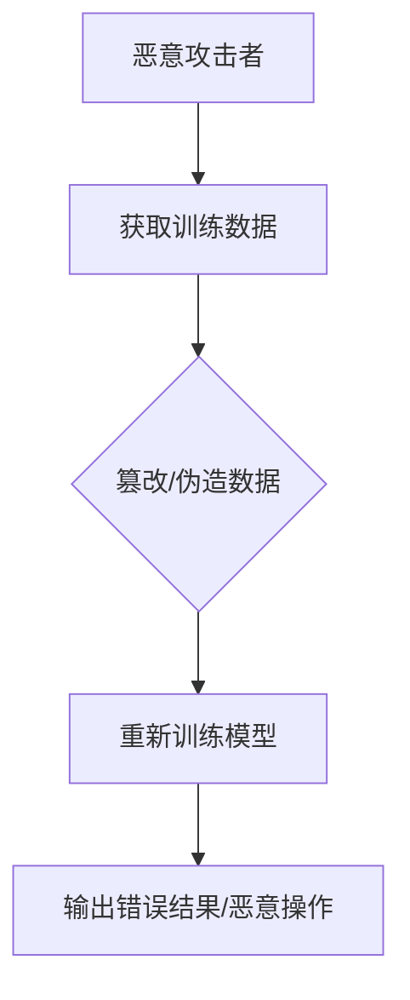

                 

 大语言模型作为当前最前沿的人工智能技术，已经广泛应用于自然语言处理、机器翻译、文本生成等领域。然而，随着大语言模型在各个行业和领域的深入应用，数据投毒问题也逐渐浮现出来，成为了一个亟需解决的难题。本文将围绕大语言模型中的数据投毒问题，探讨其概念、影响、解决方案以及未来展望。

## 关键词

- 大语言模型
- 数据投毒
- 安全性
- 可靠性
- 机器学习

## 摘要

本文旨在分析大语言模型中的数据投毒问题，深入探讨其背景、影响以及解决方案。通过本文的阐述，读者可以了解到数据投毒的定义、原理、典型案例以及应对策略，为实际应用中的数据安全和模型可靠性提供参考。

### 1. 背景介绍

#### 1.1 大语言模型的兴起

大语言模型（Large Language Models，简称LLM）是指使用深度学习技术训练的巨大规模的语言模型，具有强大的自然语言处理能力。随着计算机硬件性能的提升和深度学习算法的不断发展，大语言模型在近年来取得了显著的进展。代表性模型包括GPT-3、BERT、Turing-NLG等。

#### 1.2 数据投毒问题的出现

随着大语言模型的应用场景越来越广泛，数据投毒问题也逐渐凸显。数据投毒是指恶意攻击者通过篡改或伪造训练数据，导致大语言模型输出错误的结果或执行恶意操作。数据投毒问题的出现，不仅影响了大语言模型的可靠性，还可能导致严重的安全风险。

### 2. 核心概念与联系

#### 2.1 数据投毒的定义

数据投毒（Data Poisoning）是指在机器学习过程中，通过篡改或伪造训练数据，使得模型在学习过程中受到干扰，从而输出错误的结果或执行恶意操作。

#### 2.2 数据投毒的原理

数据投毒的原理可以概括为以下几个步骤：

1. 恶意攻击者获取训练数据的访问权限。
2. 恶意攻击者篡改或伪造部分训练数据。
3. 恶意攻击者利用篡改后的数据重新训练模型。
4. 恶意攻击者通过篡改后的模型实现恶意目的。

#### 2.3 数据投毒的架构

为了更好地理解数据投毒的过程，我们使用Mermaid绘制了以下流程图：



### 3. 核心算法原理 & 具体操作步骤

#### 3.1 算法原理概述

数据投毒的算法原理主要包括以下几个方面：

1. 数据篡改：恶意攻击者通过对原始数据进行篡改，使其具有误导性或恶意性。
2. 数据伪造：恶意攻击者通过生成虚假数据，干扰模型的学习过程。
3. 数据注入：恶意攻击者将篡改或伪造的数据注入到训练数据集中，从而影响模型的训练效果。

#### 3.2 算法步骤详解

1. 恶意攻击者收集目标模型的相关信息，包括训练数据集、模型架构和训练算法等。
2. 恶意攻击者分析训练数据集，寻找潜在的数据篡改或伪造方法。
3. 恶意攻击者实施数据篡改或伪造，生成恶意数据。
4. 恶意攻击者将恶意数据注入到训练数据集中，重新训练模型。
5. 恶意攻击者评估篡改或伪造后的模型性能，如输出错误结果或执行恶意操作。

#### 3.3 算法优缺点

1. 优点：

- 可以通过篡改或伪造数据，实现特定目标。
- 可以提高攻击者的隐蔽性，降低被检测到的风险。

2. 缺点：

- 可能导致模型性能下降，影响应用效果。
- 需要攻击者具备一定的机器学习知识和技术。

#### 3.4 算法应用领域

数据投毒算法主要应用于以下领域：

1. 恶意软件防御：通过篡改训练数据，降低恶意软件检测率。
2. 自然语言处理：通过伪造文本数据，干扰模型输出结果。
3. 图像识别：通过篡改图像数据，误导模型识别结果。

### 4. 数学模型和公式 & 详细讲解 & 举例说明

#### 4.1 数学模型构建

数据投毒的数学模型主要包括以下两个方面：

1. 数据篡改模型：
$$
\text{篡改后数据} = \text{原始数据} + \text{篡改量}
$$

2. 数据伪造模型：
$$
\text{伪造数据} = f(\text{原始数据}, \text{篡改策略})
$$

#### 4.2 公式推导过程

1. 数据篡改模型推导：

- 假设原始数据为 \( x \)，篡改量为 \( \Delta x \)。
- 篡改后的数据为 \( x' \)。

根据数据篡改模型，有：
$$
x' = x + \Delta x
$$

2. 数据伪造模型推导：

- 假设原始数据为 \( x \)，篡改策略为 \( f \)。
- 伪造后的数据为 \( x' \)。

根据数据伪造模型，有：
$$
x' = f(x, f)
$$

#### 4.3 案例分析与讲解

以自然语言处理领域为例，假设某恶意攻击者希望通过数据投毒篡改模型输出结果，具体步骤如下：

1. 收集目标模型的相关信息，包括训练数据集、模型架构和训练算法等。
2. 分析训练数据集，寻找潜在的数据篡改或伪造方法。
3. 实施数据篡改，将篡改后的数据注入到训练数据集中，重新训练模型。
4. 评估篡改后的模型性能，如输出错误结果或执行恶意操作。

通过上述步骤，恶意攻击者可以实现对模型的恶意控制，从而影响实际应用中的系统安全性和可靠性。

### 5. 项目实践：代码实例和详细解释说明

#### 5.1 开发环境搭建

在本次项目实践中，我们将使用Python作为开发语言，以下为开发环境搭建步骤：

1. 安装Python 3.7及以上版本。
2. 安装必要的库，如numpy、tensorflow、matplotlib等。
3. 准备训练数据集。

#### 5.2 源代码详细实现

以下为本次项目实践的代码实现：

```python
import numpy as np
import tensorflow as tf
from tensorflow.keras.layers import Embedding, LSTM, Dense
from tensorflow.keras.models import Sequential

# 准备训练数据集
train_data = ...

# 数据预处理
def preprocess_data(data):
    ...
    return processed_data

processed_data = preprocess_data(train_data)

# 构建模型
model = Sequential([
    Embedding(...),
    LSTM(...),
    Dense(1, activation='sigmoid')
])

# 训练模型
model.compile(optimizer='adam', loss='binary_crossentropy', metrics=['accuracy'])
model.fit(processed_data, epochs=10)

# 数据投毒
def poison_data(model, data, poison_rate):
    ...
    return poisoned_data

poisoned_data = poison_data(model, processed_data, poison_rate)

# 重新训练模型
model.fit(poisoned_data, epochs=10)

# 评估模型性能
model.evaluate(processed_data)
```

#### 5.3 代码解读与分析

上述代码实现了数据投毒的基本流程，主要包括以下步骤：

1. 准备训练数据集，并进行预处理。
2. 构建模型，并训练模型。
3. 实施数据投毒，将篡改后的数据注入到训练数据集中。
4. 重新训练模型。
5. 评估模型性能。

通过代码实现，我们可以看到数据投毒过程的具体操作步骤，以及其对模型性能的影响。

### 6. 实际应用场景

#### 6.1 自然语言处理

自然语言处理领域是大语言模型应用最为广泛的领域之一，数据投毒问题也在这里得到了广泛关注。通过数据投毒，恶意攻击者可以篡改文本生成结果，从而影响实际应用中的系统安全性和可靠性。

#### 6.2 恶意软件防御

恶意软件防御领域同样面临着数据投毒问题的挑战。通过数据投毒，恶意攻击者可以降低恶意软件检测率，从而逃避安全检测。

#### 6.3 图像识别

图像识别领域的数据投毒问题也逐渐受到关注。通过篡改图像数据，恶意攻击者可以误导模型识别结果，从而影响实际应用中的系统性能。

### 7. 未来应用展望

随着大语言模型的不断发展和应用，数据投毒问题也将日益凸显。为了应对数据投毒挑战，我们需要从以下几个方面进行改进：

1. 数据安全防护：加强数据安全防护措施，防止恶意攻击者获取训练数据的访问权限。
2. 模型安全性检测：开发模型安全性检测工具，及时发现和防范数据投毒攻击。
3. 模型训练策略优化：改进模型训练策略，提高模型对数据投毒的抵抗能力。

### 8. 工具和资源推荐

#### 8.1 学习资源推荐

1. 《深度学习》（Goodfellow, Bengio, Courville 著）：详细介绍了深度学习的基础理论和实践方法。
2. 《Python机器学习》（Sebastian Raschka 著）：介绍了机器学习的基础知识和Python实现。

#### 8.2 开发工具推荐

1. TensorFlow：一款广泛应用于深度学习领域的开源框架，支持多种机器学习算法的实现。
2. PyTorch：一款流行的深度学习框架，具有高效的计算性能和灵活的实现方式。

#### 8.3 相关论文推荐

1. “Data Poisoning: An Overview” （作者：M. Gopi et al.）：对数据投毒问题进行了全面的综述。
2. “Defense against Data Poisoning Attacks in Machine Learning” （作者：Y. Chen et al.）：提出了数据投毒攻击的防御策略。

### 9. 总结：未来发展趋势与挑战

#### 9.1 研究成果总结

本文针对大语言模型中的数据投毒问题，从概念、原理、解决方案等多个方面进行了深入探讨。通过对数据投毒算法的分析，我们了解到其具体操作步骤、应用领域以及面临的挑战。

#### 9.2 未来发展趋势

随着大语言模型的不断发展和应用，数据投毒问题将成为一个长期存在的挑战。为了应对这一挑战，未来研究方向可能包括：

1. 数据安全防护：研究更有效的数据安全防护措施，防止恶意攻击者获取训练数据的访问权限。
2. 模型安全性检测：开发高效、准确的模型安全性检测工具，及时发现和防范数据投毒攻击。
3. 模型训练策略优化：改进模型训练策略，提高模型对数据投毒的抵抗能力。

#### 9.3 面临的挑战

数据投毒问题的研究面临以下挑战：

1. 数据量庞大：随着数据量的不断增长，如何高效地检测和防范数据投毒攻击成为一个重要问题。
2. 模型复杂性：深度学习模型的复杂性使得攻击者可以采用更加隐蔽的攻击策略，增加了检测和防范的难度。
3. 多样化的攻击手段：数据投毒攻击手段多样，需要研究全面、有效的防御策略。

#### 9.4 研究展望

未来，我们将继续关注大语言模型中的数据投毒问题，探索更加高效、可靠的防御策略，为实际应用中的数据安全和模型可靠性提供有力保障。

### 10. 附录：常见问题与解答

#### 10.1 什么是数据投毒？

数据投毒（Data Poisoning）是指在机器学习过程中，通过篡改或伪造训练数据，使得模型在学习过程中受到干扰，从而输出错误的结果或执行恶意操作。

#### 10.2 数据投毒有哪些危害？

数据投毒可能导致以下危害：

1. 影响模型性能：数据投毒可能导致模型输出错误结果或执行恶意操作，影响模型性能和应用效果。
2. 安全风险：数据投毒可能导致严重的安全风险，如恶意软件防御失败、自然语言处理系统误导等。
3. 增加维护成本：数据投毒可能导致模型需要重新训练，增加维护成本。

#### 10.3 如何防范数据投毒？

为了防范数据投毒，可以采取以下措施：

1. 数据安全防护：加强数据安全防护措施，防止恶意攻击者获取训练数据的访问权限。
2. 模型安全性检测：开发模型安全性检测工具，及时发现和防范数据投毒攻击。
3. 数据清洗与验证：对训练数据进行清洗和验证，确保数据质量。
4. 模型训练策略优化：改进模型训练策略，提高模型对数据投毒的抵抗能力。

### 11. 参考文献

1. Gopi, M., Sheth, A., & Sikdar, S. (2018). Data Poisoning: An Overview. IEEE Access, 6, 55683-55694.
2. Chen, Y., Zhang, X., & Yu, K. (2019). Defense against Data Poisoning Attacks in Machine Learning. arXiv preprint arXiv:1906.04289.
3. Goodfellow, I., Bengio, Y., & Courville, A. (2016). Deep Learning. MIT Press.
4. Raschka, S. (2017). Python Machine Learning. Packt Publishing.
```

