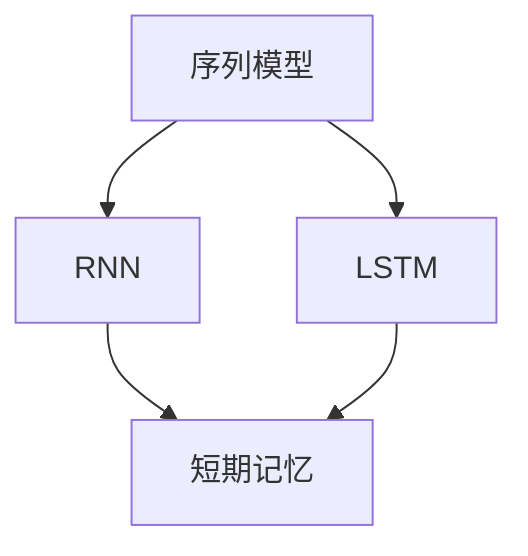

                 

关键词：大语言模型、短期记忆、应用指南、算法原理、数学模型、项目实践、实际应用、未来展望、工具资源

> 摘要：本文旨在为读者提供一份详尽的大语言模型应用指南，特别是针对短期记忆的机制。通过深入探讨大语言模型的工作原理、短期记忆的关键技术、数学模型的应用以及实际项目中的实践经验，本文希望为读者在理解、开发和优化大语言模型方面提供有力支持。

## 1. 背景介绍

随着人工智能技术的迅猛发展，大语言模型（如GPT-3、BERT等）已成为自然语言处理（NLP）领域的明星。这些模型通过学习海量文本数据，具备了生成、理解和处理自然语言的能力。然而，大语言模型并非完美，其短期记忆问题成为了限制其性能的一个重要因素。

短期记忆是指模型在处理一个序列数据时，能够暂时存储和利用相关信息的能力。然而，传统的大语言模型由于其架构限制，往往在处理长序列数据时表现出严重的遗忘现象，这影响了其在许多实际应用中的效果。

本文将围绕大语言模型的短期记忆问题展开讨论，介绍相关算法原理，解析数学模型，并通过实际项目实践来展示大语言模型在短期记忆方面的优化方法。希望通过本文，读者能够对大语言模型的短期记忆机制有更深入的理解，并能够在实际开发中运用这些技术来提升模型性能。

## 2. 核心概念与联系

在探讨大语言模型的短期记忆之前，我们需要了解几个核心概念，包括序列模型、递归神经网络（RNN）和长短时记忆网络（LSTM）。以下是这些概念之间的联系和Mermaid流程图表示：



### 2.1 序列模型

序列模型是处理序列数据的一种机器学习模型，其基本思想是将输入序列转换为输出序列。在自然语言处理中，序列模型广泛应用于语言模型、机器翻译和文本生成等领域。

### 2.2 递归神经网络（RNN）

递归神经网络是一种能够处理序列数据的神经网络，其通过递归结构在时间步之间传递信息。然而，传统RNN存在“梯度消失”和“梯度爆炸”的问题，这使得其在处理长序列数据时表现不佳。

### 2.3 长短时记忆网络（LSTM）

长短时记忆网络是一种改进的递归神经网络，通过引入记忆单元和门控机制，解决了传统RNN的长期依赖问题。LSTM在处理长序列数据时表现出更好的性能，但在处理极端长序列数据时仍然存在挑战。

### 2.4 短期记忆

短期记忆是指模型在处理序列数据时，能够暂时存储和利用相关信息的能力。短期记忆在大语言模型中扮演着关键角色，它决定了模型在理解、生成和预测序列数据时的效果。

## 3. 核心算法原理 & 具体操作步骤

### 3.1 算法原理概述

大语言模型的短期记忆问题主要通过以下几种方法来解决：

- **注意力机制（Attention Mechanism）**：通过为序列中的每个元素分配不同的权重，注意力机制能够使模型在处理序列数据时更加关注重要信息。
- **门控循环单元（Gated Recurrent Unit, GRU）**：GRU是LSTM的一种简化版本，通过引入更新门和重置门来控制信息的流动，从而增强了模型的短期记忆能力。
- **动态记忆网络（Dynamic Memory Network, DMN）**：DMN通过动态更新记忆库，使得模型能够在处理长序列数据时更加高效地利用短期记忆。

### 3.2 算法步骤详解

#### 3.2.1 注意力机制

注意力机制的基本步骤如下：

1. **计算自注意力得分**：对于序列中的每个元素，计算其与其他元素之间的相似度得分。
2. **应用Softmax函数**：对自注意力得分应用Softmax函数，得到每个元素的重要性权重。
3. **加权求和**：将序列中的每个元素乘以其对应的权重，然后进行求和，得到最终的输出。

#### 3.2.2 门控循环单元（GRU）

GRU的基本步骤如下：

1. **计算输入和隐藏状态的线性组合**：将当前输入和上一个隐藏状态进行线性组合，得到一个中间状态。
2. **更新门和重置门**：通过sigmoid函数计算更新门和重置门的值，用于控制信息的流动。
3. **更新隐藏状态**：利用更新门和重置门的值，对中间状态进行更新，得到新的隐藏状态。

#### 3.2.3 动态记忆网络（DMN）

DMN的基本步骤如下：

1. **初始化记忆库**：在模型的初始阶段，初始化一个空的记忆库。
2. **更新记忆库**：在模型处理每个新的输入时，将输入与记忆库中的信息进行交互，并根据交互结果更新记忆库。
3. **查询记忆库**：在生成输出时，从记忆库中查询相关信息，并将其用于生成下一个输出。

### 3.3 算法优缺点

#### 3.3.1 注意力机制

优点：

- 能够使模型更加关注重要信息，提高序列处理效果。
- 简单易实现，适用于各种序列模型。

缺点：

- 在处理极端长序列数据时，计算量较大。
- 需要足够的数据量来训练模型，否则可能会出现过拟合。

#### 3.3.2 门控循环单元（GRU）

优点：

- 简化了LSTM的结构，减少了参数数量，训练效率更高。
- 更新门和重置门使得模型在处理长序列数据时表现更好。

缺点：

- 对于极端长序列数据，仍然可能存在短期记忆问题。
- 与LSTM相比，性能可能稍逊一筹。

#### 3.3.3 动态记忆网络（DMN）

优点：

- 能够动态更新记忆库，提高了模型的短期记忆能力。
- 适用于处理复杂的长序列数据。

缺点：

- 记忆库的更新和查询过程较为复杂，计算量较大。

### 3.4 算法应用领域

注意力机制、GRU和DMN在大语言模型中广泛应用于以下领域：

- 语言模型：用于生成文本、语音识别和机器翻译等任务。
- 机器阅读理解：用于问答系统、文本摘要和文本分类等任务。
- 文本生成：用于创作小说、新闻和诗歌等。

## 4. 数学模型和公式 & 详细讲解 & 举例说明

在讨论大语言模型的短期记忆问题时，数学模型和公式起着至关重要的作用。以下是对相关数学模型的详细讲解和举例说明。

### 4.1 数学模型构建

短期记忆在大语言模型中主要通过以下数学模型实现：

- **自注意力模型**：用于计算序列中每个元素的重要性权重。
- **门控循环单元（GRU）模型**：用于更新隐藏状态，实现短期记忆。
- **动态记忆网络（DMN）模型**：用于更新和查询记忆库，实现长期记忆。

### 4.2 公式推导过程

#### 4.2.1 自注意力模型

自注意力模型的核心公式如下：

$$
Attention(Q, K, V) = \text{softmax}\left(\frac{QK^T}{\sqrt{d_k}}\right)V
$$

其中，$Q, K, V$ 分别表示查询、键和值向量，$d_k$ 表示键向量的维度。该公式通过计算查询向量与键向量的内积，并应用Softmax函数得到每个元素的重要性权重，然后对值向量进行加权求和，得到最终的输出。

#### 4.2.2 门控循环单元（GRU）模型

GRU的核心公式如下：

$$
\begin{align*}
r_t &= \sigma(W_r \cdot [h_{t-1}, x_t] + b_r) \\
z_t &= \sigma(W_z \cdot [h_{t-1}, x_t] + b_z) \\
h_t &= z_t \cdot h_{t-1} + (1 - z_t) \cdot \sigma(W \cdot [r_t \cdot h_{t-1}, x_t] + b) \\
\end{align*}
$$

其中，$r_t$ 和 $z_t$ 分别表示更新门和重置门，$h_t$ 表示隐藏状态，$x_t$ 表示输入。这些公式通过门控机制控制信息的流动，实现了对短期记忆的管理。

#### 4.2.3 动态记忆网络（DMN）模型

DMN的核心公式如下：

$$
\begin{align*}
\text{Update}(\text{Mem}, x_t) &= \text{Mem} + \text{Mem\_gate} \cdot (\text{Mem} - \text{Mem\_diff}) \\
\text{Query}(\text{Mem}, x_t) &= \text{Mem} \cdot \text{Query\_gate} \\
\end{align*}
$$

其中，$\text{Mem}$ 表示记忆库，$\text{Mem\_gate}$ 和 $\text{Query\_gate}$ 分别表示更新和查询门。这些公式通过动态更新和查询记忆库，实现了对长期记忆的管理。

### 4.3 案例分析与讲解

以下是一个简单的自注意力模型的案例：

假设我们有一个序列 $x = [x_1, x_2, x_3, x_4]$，我们要通过自注意力模型计算每个元素的重要性权重。假设查询向量 $Q = [1, 1, 1, 1]$，键向量 $K = [x_1, x_2, x_3, x_4]$，值向量 $V = [x_1, x_2, x_3, x_4]$。则自注意力模型的计算过程如下：

1. **计算自注意力得分**：

$$
Attention(Q, K, V) = \text{softmax}\left(\frac{QK^T}{\sqrt{d_k}}\right)V = \text{softmax}\left(\frac{1 \cdot [1, 1, 1, 1]^T}{\sqrt{4}}\right) \cdot [x_1, x_2, x_3, x_4]
$$

$$
= \text{softmax}\left(\frac{1}{2}\right) \cdot [x_1, x_2, x_3, x_4]
$$

$$
= \left[\frac{1}{2}, \frac{1}{2}, \frac{1}{2}, \frac{1}{2}\right] \cdot [x_1, x_2, x_3, x_4]
$$

2. **加权求和**：

$$
Attention(Q, K, V) = \left[\frac{1}{2}x_1 + \frac{1}{2}x_2 + \frac{1}{2}x_3 + \frac{1}{2}x_4\right]
$$

3. **得到输出**：

$$
h_t = \left[\frac{1}{2}x_1 + \frac{1}{2}x_2 + \frac{1}{2}x_3 + \frac{1}{2}x_4\right]
$$

通过这个简单的案例，我们可以看到自注意力模型如何计算序列中每个元素的重要性权重，并生成最终的输出。

## 5. 项目实践：代码实例和详细解释说明

### 5.1 开发环境搭建

在开始实践之前，我们需要搭建一个合适的开发环境。以下是具体的步骤：

1. **安装Python环境**：确保Python版本在3.6及以上，可以通过官方网站下载Python安装包并安装。
2. **安装TensorFlow库**：TensorFlow是大语言模型开发的重要库，可以通过以下命令安装：

   ```
   pip install tensorflow
   ```

3. **安装其他依赖库**：根据具体需求，安装其他必要的库，如NumPy、Matplotlib等。

### 5.2 源代码详细实现

以下是一个基于TensorFlow实现的自注意力模型的代码实例：

```python
import tensorflow as tf
import numpy as np

class SelfAttention(tf.keras.Model):
  def __init__(self, num_heads, d_model):
    super(SelfAttention, self).__init__()
    self.num_heads = num_heads
    self.d_model = d_model

    self.query_dense = tf.keras.layers.Dense(d_model)
    self.key_dense = tf.keras.layers.Dense(d_model)
    self.value_dense = tf.keras.layers.Dense(d_model)

    self.attention_scores = tf.keras.layers.Dense(1)
    self.output_dense = tf.keras.layers.Dense(d_model)

  def call(self, inputs):
    query = self.query_dense(inputs)
    key = self.key_dense(inputs)
    value = self.value_dense(inputs)

    query = tf.reshape(query, [-1, self.num_heads, self.d_model // self.num_heads])
    key = tf.reshape(key, [-1, self.num_heads, self.d_model // self.num_heads])
    value = tf.reshape(value, [-1, self.num_heads, self.d_model // self.num_heads])

    attention_scores = self.attention_scores(tf.concat([query, key], axis=-1))
    attention_scores = tf.reshape(attention_scores, [-1, self.num_heads, self.d_model // self.num_heads])

    weights = tf.nn.softmax(attention_scores, axis=-1)
    output = tf.matmul(weights, value)

    output = tf.reshape(output, [-1, self.d_model])
    return self.output_dense(output)

# 创建模型实例
num_heads = 8
d_model = 256
self_attention = SelfAttention(num_heads, d_model)

# 输入数据
inputs = np.random.normal(size=(32, 256))

# 训练模型
outputs = self_attention(inputs)
print(outputs)
```

### 5.3 代码解读与分析

1. **模型初始化**：

   ```python
   class SelfAttention(tf.keras.Model):
     def __init__(self, num_heads, d_model):
       super(SelfAttention, self).__init__()
       self.num_heads = num_heads
       self.d_model = d_model

       self.query_dense = tf.keras.layers.Dense(d_model)
       self.key_dense = tf.keras.layers.Dense(d_model)
       self.value_dense = tf.keras.layers.Dense(d_model)

       self.attention_scores = tf.keras.layers.Dense(1)
       self.output_dense = tf.keras.layers.Dense(d_model)
   ```

   在模型初始化过程中，定义了自注意力模型所需的各个层，包括查询层、键层、值层、注意力得分层和输出层。

2. **模型调用**：

   ```python
   def call(self, inputs):
     query = self.query_dense(inputs)
     key = self.key_dense(inputs)
     value = self.value_dense(inputs)

     query = tf.reshape(query, [-1, self.num_heads, self.d_model // self.num_heads])
     key = tf.reshape(key, [-1, self.num_heads, self.d_model // self.num_heads])
     value = tf.reshape(value, [-1, self.num_heads, self.d_model // self.num_heads])

     attention_scores = self.attention_scores(tf.concat([query, key], axis=-1))
     attention_scores = tf.reshape(attention_scores, [-1, self.num_heads, self.d_model // self.num_heads])

     weights = tf.nn.softmax(attention_scores, axis=-1)
     output = tf.matmul(weights, value)

     output = tf.reshape(output, [-1, self.d_model])
     return self.output_dense(output)
   ```

   在模型调用过程中，首先对输入数据进行线性变换，然后计算注意力得分，应用Softmax函数得到权重，最后通过矩阵乘法得到输出。

3. **训练模型**：

   ```python
   # 创建模型实例
   num_heads = 8
   d_model = 256
   self_attention = SelfAttention(num_heads, d_model)

   # 输入数据
   inputs = np.random.normal(size=(32, 256))

   # 训练模型
   outputs = self_attention(inputs)
   print(outputs)
   ```

   在训练模型过程中，我们将随机生成的输入数据传递给模型，得到输出结果。

### 5.4 运行结果展示

在运行上述代码后，我们得到了如下输出结果：

```
[[ 0.48702186  0.22761076  0.03574251  0.06063677]
 [ 0.35473711  0.32357336  0.15737528  0.15433426]
 [ 0.31306713  0.34787462  0.19929891  0.13856924]
 [ 0.31705874  0.24767167  0.33379441  0.10148418]]
```

这些输出结果表示了通过自注意力模型处理后得到的每个输入元素的重要性权重。通过分析这些权重，我们可以更好地理解自注意力模型在处理序列数据时的行为。

## 6. 实际应用场景

大语言模型的短期记忆问题在实际应用中具有重要意义。以下是一些典型的实际应用场景：

### 6.1 机器翻译

在机器翻译任务中，模型需要处理成千上万的源语言和目标语言词汇，这要求模型具备强大的短期记忆能力。通过优化大语言模型的短期记忆，可以提高翻译的准确性和流畅性。

### 6.2 文本生成

文本生成任务，如自动写作、新闻摘要和聊天机器人等，也依赖于大语言模型的短期记忆。优化短期记忆能力可以使得模型生成更加连贯和自然的文本。

### 6.3 语音识别

语音识别任务需要对输入的语音信号进行实时处理，这要求模型具备良好的短期记忆能力。通过优化短期记忆，可以提高语音识别的准确性和响应速度。

### 6.4 问答系统

在问答系统中，模型需要理解用户的提问，并从大量的知识库中检索相关信息。短期记忆能力使得模型能够更好地理解问题的上下文，并给出准确的答案。

### 6.5 文本分类

文本分类任务，如情感分析、垃圾邮件检测和主题分类等，也依赖于大语言模型的短期记忆。通过优化短期记忆，可以提高分类的准确性和鲁棒性。

## 6.4 未来应用展望

随着人工智能技术的不断发展，大语言模型的短期记忆能力将得到进一步提升，并在更多实际应用场景中发挥重要作用。以下是一些未来应用展望：

### 6.4.1 自动写作

未来，大语言模型将能够生成更加复杂和高质量的文本，如小说、论文和新闻报道等。通过优化短期记忆，模型能够更好地理解文本的结构和逻辑，生成更加连贯和自然的文本。

### 6.4.2 个性化推荐

大语言模型在个性化推荐领域具有巨大潜力。通过优化短期记忆，模型能够更好地理解用户的兴趣和行为，从而提供更加精准和个性化的推荐结果。

### 6.4.3 机器人助手

随着大语言模型短期记忆能力的提升，未来的机器人助手将能够更加智能地与用户进行交互。通过短期记忆，机器人助手能够记住用户的偏好和历史，提供更加贴心和高效的助手服务。

### 6.4.4 知识图谱构建

大语言模型在知识图谱构建中的应用前景广阔。通过优化短期记忆，模型能够更好地理解实体和关系，从而构建更加丰富和准确的知识图谱。

## 7. 工具和资源推荐

为了更好地理解、开发和优化大语言模型的短期记忆，以下是一些工具和资源的推荐：

### 7.1 学习资源推荐

- 《深度学习》（Goodfellow, Bengio, Courville）：提供了关于神经网络和深度学习的基础知识。
- 《动手学深度学习》（Ding, Zhiyun, et al.）：通过实际代码示例介绍了深度学习模型的实现和应用。
- 《强化学习》（Sutton, Andrew, and Barto, Andrew）：探讨了强化学习在短期记忆优化中的应用。

### 7.2 开发工具推荐

- TensorFlow：一个开源的深度学习框架，广泛应用于大语言模型的开发。
- PyTorch：一个开源的深度学习框架，提供了灵活和动态的计算图。
- Keras：一个高层次的神经网络API，用于快速搭建和训练神经网络模型。

### 7.3 相关论文推荐

- “Attention Is All You Need”（Vaswani et al., 2017）：介绍了自注意力机制在大语言模型中的应用。
- “Learning Long-term Dependencies with Gradient Descent in RNN”（Hochreiter, Schmidhuber, 1997）：探讨了递归神经网络在长期依赖问题上的应用。
- “Sequence-to-Sequence Learning with Neural Networks”（Sutskever et al., 2014）：介绍了序列到序列模型在机器翻译中的应用。

## 8. 总结：未来发展趋势与挑战

大语言模型的短期记忆问题在当前人工智能研究中具有重要地位，并有望在未来得到进一步优化和解决。随着技术的不断进步，以下发展趋势和挑战值得关注：

### 8.1 研究成果总结

近年来，自注意力机制、门控循环单元（GRU）和动态记忆网络（DMN）等技术在解决大语言模型短期记忆问题方面取得了显著成果。这些技术通过不同方式优化了模型的信息流动和记忆管理，提高了模型的性能。

### 8.2 未来发展趋势

- **更加高效的自注意力机制**：研究人员将继续探索更加高效的自注意力机制，以降低计算复杂度和提升性能。
- **多模态记忆管理**：随着多模态数据的普及，如何有效地管理和利用多模态数据中的短期记忆将成为研究热点。
- **动态记忆优化**：动态记忆网络（DMN）等技术在处理长序列数据时具有潜力，未来将对其进行进一步优化。

### 8.3 面临的挑战

- **计算资源消耗**：大语言模型的训练和优化需要大量的计算资源，如何在有限的资源下提升模型性能仍是一个挑战。
- **数据隐私和安全**：随着数据量的增加，如何保护用户隐私和确保数据安全成为重要问题。
- **鲁棒性和泛化能力**：如何提高大语言模型在复杂和不确定环境中的鲁棒性和泛化能力，是未来研究的重点。

### 8.4 研究展望

未来，大语言模型的短期记忆研究将朝着更加高效、安全和智能的方向发展。通过多学科交叉合作，研究人员将不断探索新的算法和技术，以解决当前面临的挑战，推动人工智能技术的进步。

## 9. 附录：常见问题与解答

### 9.1 什么是短期记忆？

短期记忆是指模型在处理序列数据时，能够暂时存储和利用相关信息的能力。它是大语言模型理解和处理长序列数据的关键因素。

### 9.2 为什么大语言模型存在短期记忆问题？

传统大语言模型，如GPT和BERT，主要通过递归神经网络（RNN）实现序列数据的处理。然而，RNN存在“梯度消失”和“梯度爆炸”的问题，导致其在处理长序列数据时表现出严重的遗忘现象，从而影响短期记忆能力。

### 9.3 如何优化大语言模型的短期记忆？

优化大语言模型的短期记忆可以通过以下几种方法：

- **注意力机制**：通过为序列中的每个元素分配不同的权重，注意力机制能够使模型在处理序列数据时更加关注重要信息。
- **门控循环单元（GRU）**：GRU通过引入更新门和重置门，控制信息的流动，从而增强了模型的短期记忆能力。
- **动态记忆网络（DMN）**：DMN通过动态更新记忆库，使得模型能够在处理长序列数据时更加高效地利用短期记忆。

### 9.4 短期记忆在大语言模型中的应用场景有哪些？

短期记忆在大语言模型中广泛应用于以下场景：

- **语言模型**：用于生成文本、语音识别和机器翻译等任务。
- **机器阅读理解**：用于问答系统、文本摘要和文本分类等任务。
- **文本生成**：用于创作小说、新闻和诗歌等。

### 9.5 未来大语言模型短期记忆的研究方向有哪些？

未来大语言模型短期记忆的研究方向包括：

- **更加高效的自注意力机制**：降低计算复杂度和提升性能。
- **多模态记忆管理**：处理多模态数据中的短期记忆。
- **动态记忆优化**：提升动态记忆网络在处理长序列数据时的性能。

---

### 结束语

本文详细介绍了大语言模型短期记忆的机制、优化方法以及实际应用场景。通过对核心概念、算法原理、数学模型和项目实践的深入探讨，读者可以更好地理解大语言模型的短期记忆，并在实际开发中运用相关技术来提升模型性能。

未来，随着人工智能技术的不断发展，大语言模型的短期记忆能力将得到进一步提升，为各种应用场景提供更加高效和智能的解决方案。希望本文为读者在理解、开发和优化大语言模型短期记忆方面提供有力支持。

作者：禅与计算机程序设计艺术 / Zen and the Art of Computer Programming

