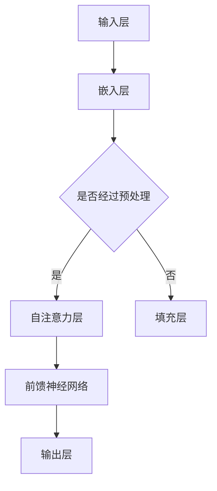

                 

关键词：大语言模型，越狱攻击，数据投毒，安全防护，人工智能，技术博客

> 摘要：本文将深入探讨大语言模型在人工智能领域的应用，重点关注越狱攻击与数据投毒的威胁及其应对策略。通过解析算法原理、数学模型以及实际应用案例，为广大开发者与研究者提供一份详尽的指南，旨在提升对大语言模型安全防护的理解与实践。

## 1. 背景介绍

随着人工智能技术的飞速发展，大语言模型（如GPT-3、BERT等）已经成为了自然语言处理（NLP）领域的重要工具。这些模型通过学习海量的语言数据，能够实现自动文本生成、问答系统、机器翻译等多种应用。然而，正是这种强大的能力，也让大语言模型面临着前所未有的安全挑战。

越狱攻击（Escape Attack）和数据投毒（Data Poisoning）是两大关键威胁。越狱攻击指的是攻击者通过精心设计的输入数据，使得模型产生偏离预期输出的行为，从而达到绕过安全防护的目的。数据投毒则是攻击者通过篡改训练数据，影响模型的训练结果，使得模型在真实场景下产生错误判断。

本文将详细介绍这两种攻击方法，并探讨相应的防护策略。通过本文的学习，读者将能够更好地理解大语言模型的安全隐患，并掌握有效的防护手段。

### 1.1 大语言模型的基本原理

大语言模型基于深度学习技术，通过神经网络结构对大量文本数据进行训练，从而学习到语言的基本规则和模式。具体来说，这些模型通常采用Transformer架构，其核心思想是自注意力机制（Self-Attention）。通过自注意力机制，模型能够在处理每个单词时，自动关注与该词相关的其他词，从而捕捉到文本中的长距离依赖关系。

大语言模型在训练过程中，会通过梯度下降算法不断优化模型的参数，使得模型的输出结果逐渐接近真实值。一旦训练完成，模型就可以根据输入的文本数据，生成相应的输出文本。

### 1.2 越狱攻击的基本原理

越狱攻击的目标是绕过模型的输入验证机制，使得模型产生预期的错误输出。攻击者通常会利用模型对特定输入数据的敏感性，设计出能够触发模型异常行为的输入。这些输入被称为“攻击样本”。

越狱攻击的原理可以概括为以下三个步骤：

1. **攻击样本设计**：攻击者通过分析模型的输入输出关系，找到模型的弱点，设计出能够触发异常行为的攻击样本。
2. **样本输入**：将攻击样本输入到模型中，观察模型的输出结果。
3. **调整样本**：根据模型的输出结果，不断调整攻击样本，直到模型产生预期的错误输出。

### 1.3 数据投毒的基本原理

数据投毒攻击的核心思想是篡改训练数据，从而影响模型的训练结果。攻击者可以通过多种手段，如插入恶意数据、修改数据标签等，来操控模型的训练过程。

数据投毒攻击的原理可以概括为以下三个步骤：

1. **恶意数据设计**：攻击者根据模型的训练目标，设计出具有恶意影响的输入数据。
2. **数据插入**：将恶意数据插入到模型的训练数据集中。
3. **模型重新训练**：利用篡改后的训练数据进行模型训练，观察模型的输出结果。

## 2. 核心概念与联系

### 2.1 大语言模型架构

为了更好地理解大语言模型的工作原理，我们可以通过Mermaid流程图来展示其核心架构：



### 2.2 越狱攻击与数据投毒的关系

越狱攻击和数据投毒都是针对大语言模型的安全威胁。然而，它们在攻击方式和目的上有所不同。越狱攻击主要目标是绕过模型的输入验证机制，而数据投毒则是为了篡改模型的训练结果。

尽管两者的攻击目标不同，但在实际应用中，它们往往相互关联。例如，攻击者可能会利用数据投毒攻击的结果，进一步实施越狱攻击。因此，理解两者之间的联系，对于提升大语言模型的安全防护至关重要。

## 3. 核心算法原理 & 具体操作步骤

### 3.1 算法原理概述

大语言模型的核心算法原理是基于Transformer架构的自注意力机制。自注意力机制通过计算输入序列中每个单词与其他所有单词的相关性，从而捕捉到长距离依赖关系。

具体来说，自注意力机制分为以下三个步骤：

1. **Query、Key、Value计算**：对于每个输入序列中的单词，计算其对应的Query、Key、Value。Query和Key用于计算相似度，Value用于加权求和。
2. **相似度计算**：计算Query和所有Key之间的相似度，得到相似度矩阵。
3. **加权求和**：根据相似度矩阵，对Value进行加权求和，得到每个单词的注意力得分。

### 3.2 算法步骤详解

大语言模型的训练过程可以概括为以下步骤：

1. **数据预处理**：对输入文本进行分词、编码等预处理操作。
2. **嵌入层**：将预处理后的文本数据转换为向量表示。
3. **自注意力层**：利用自注意力机制，对嵌入层生成的向量进行加权求和，得到新的向量表示。
4. **前馈神经网络**：对自注意力层生成的向量进行前馈神经网络处理，进一步提取特征。
5. **输出层**：将前馈神经网络输出的特征映射到输出层，生成预测结果。

### 3.3 算法优缺点

大语言模型具有以下优点：

- **强大的文本理解能力**：通过自注意力机制，大语言模型能够捕捉到文本中的长距离依赖关系，从而实现高效的文本理解。
- **灵活的扩展性**：大语言模型可以应用于多种NLP任务，如文本生成、问答系统等，具有很好的扩展性。

然而，大语言模型也存在以下缺点：

- **计算资源消耗大**：大语言模型通常需要大量的计算资源和存储空间，导致部署成本较高。
- **数据依赖性强**：大语言模型对训练数据的质量和数量有较高的要求，一旦数据存在问题，模型性能会受到影响。

### 3.4 算法应用领域

大语言模型在人工智能领域有着广泛的应用，主要包括：

- **文本生成**：通过大语言模型，可以生成各种类型的文本，如文章、对话、新闻等。
- **问答系统**：大语言模型可以用于构建智能问答系统，实现自然语言理解和生成。
- **机器翻译**：大语言模型在机器翻译领域也有着出色的表现，能够实现高质量的文本翻译。

## 4. 数学模型和公式 & 详细讲解 & 举例说明

### 4.1 数学模型构建

大语言模型的核心是Transformer架构，其基本数学模型可以概括为以下三个部分：

1. **嵌入层**：将输入的文本序列转换为向量表示。设输入文本序列为\[x_1, x_2, ..., x_n\]，则嵌入层可以将每个单词映射为一个向量\[e(x_i)\]。
2. **自注意力层**：自注意力层通过计算Query、Key、Value，实现对输入序列的加权求和。设Query、Key、Value分别为\[q_i\]、\[k_i\]、\[v_i\]，则自注意力层的计算公式为：
   \[
   \text{Attention}(q, k, v) = \text{softmax}(\frac{q \cdot k}{\sqrt{d_k}})v
   \]
   其中，\(\text{softmax}\)函数用于归一化相似度矩阵，\(d_k\)为Key的维度。
3. **前馈神经网络**：前馈神经网络对自注意力层生成的向量进行进一步处理。设前馈神经网络的输入为\[h\]，输出为\[h'\]，则其计算公式为：
   \[
   h' = \text{ReLU}(W_2 \cdot \text{ReLU}(W_1 \cdot h + b_1)) + b_2
   \]
   其中，\(W_1\)、\(W_2\)分别为权重矩阵，\(b_1\)、\(b_2\)分别为偏置项。

### 4.2 公式推导过程

为了推导大语言模型的基本公式，我们可以从以下几个方面进行分析：

1. **嵌入层**：将输入文本序列转换为向量表示。设输入文本序列为\[x_1, x_2, ..., x_n\]，则嵌入层的计算公式为：
   \[
   e(x_i) = \text{embedding}_i
   \]
   其中，\(\text{embedding}_i\)为预训练的词向量。
2. **自注意力层**：自注意力层的计算过程如下：
   \[
   \text{Attention}(q, k, v) = \text{softmax}(\frac{q \cdot k}{\sqrt{d_k}})v
   \]
   其中，\(q\)、\(k\)、\(v\)分别为Query、Key、Value，\(\text{softmax}\)函数用于归一化相似度矩阵。
3. **前馈神经网络**：前馈神经网络的计算过程如下：
   \[
   h' = \text{ReLU}(W_2 \cdot \text{ReLU}(W_1 \cdot h + b_1)) + b_2
   \]
   其中，\(W_1\)、\(W_2\)分别为权重矩阵，\(b_1\)、\(b_2\)分别为偏置项。

### 4.3 案例分析与讲解

为了更好地理解大语言模型的基本公式，我们可以通过一个简单的例子进行讲解。

假设我们有一个输入文本序列\[“我喜欢吃苹果”\]，我们要利用大语言模型对其进行处理。

1. **嵌入层**：将输入文本序列转换为向量表示。假设我们使用的词向量维数为100，则：
   \[
   e(x_i) = \text{embedding}_i
   \]
   其中，\(\text{embedding}_i\)为预训练的词向量。
2. **自注意力层**：计算Query、Key、Value，并进行加权求和。假设我们选取了文本序列中的第二个单词“吃”作为Query，则：
   \[
   q = \text{embedding}_2
   \]
   计算“吃”与所有单词的相似度：
   \[
   \text{Attention}(q, k, v) = \text{softmax}(\frac{q \cdot k}{\sqrt{d_k}})v
   \]
   其中，\(k = \text{embedding}_i\)、\(v = \text{embedding}_i\)，\(d_k\)为Key的维度。
3. **前馈神经网络**：对自注意力层生成的向量进行进一步处理。假设我们选取了自注意力层输出的向量作为前馈神经网络的输入，则：
   \[
   h' = \text{ReLU}(W_2 \cdot \text{ReLU}(W_1 \cdot h + b_1)) + b_2
   \]
   其中，\(W_1\)、\(W_2\)分别为权重矩阵，\(b_1\)、\(b_2\)分别为偏置项。

通过以上步骤，我们就可以利用大语言模型对输入文本序列进行处理，实现文本理解、文本生成等功能。

## 5. 项目实践：代码实例和详细解释说明

### 5.1 开发环境搭建

在开始项目实践之前，我们需要搭建一个合适的开发环境。以下是一个基本的开发环境搭建步骤：

1. **安装Python环境**：确保Python版本在3.6及以上，可以通过pip安装所需的库。
2. **安装Transformer库**：我们可以使用Hugging Face的Transformers库，通过以下命令安装：
   \[
   pip install transformers
   \]
3. **安装GPU驱动**：如果使用GPU训练模型，需要安装相应的GPU驱动。

### 5.2 源代码详细实现

以下是一个简单的使用Hugging Face Transformers库实现大语言模型的代码实例：

```python
from transformers import AutoTokenizer, AutoModel
import torch

# 1. 加载预训练模型和分词器
model_name = "bert-base-uncased"
tokenizer = AutoTokenizer.from_pretrained(model_name)
model = AutoModel.from_pretrained(model_name)

# 2. 输入文本预处理
text = "我喜欢吃苹果。"
input_ids = tokenizer.encode(text, return_tensors="pt")

# 3. 模型预测
with torch.no_grad():
    outputs = model(input_ids)

# 4. 输出结果处理
logits = outputs.logits
predicted_token_ids = logits.argmax(-1)

# 5. 解码输出结果
predicted_text = tokenizer.decode(predicted_token_ids[0], skip_special_tokens=True)
print(predicted_text)
```

### 5.3 代码解读与分析

以上代码展示了如何使用Hugging Face Transformers库加载预训练模型，对输入文本进行预处理，并生成预测结果。具体解读如下：

1. **加载预训练模型和分词器**：通过`AutoTokenizer`和`AutoModel`类，我们可以轻松加载预训练模型和分词器。这里我们选择了BERT模型。
2. **输入文本预处理**：使用`encode`方法对输入文本进行编码，生成相应的输入ID。`return_tensors="pt"`表示返回PyTorch张量。
3. **模型预测**：使用`model`对象对输入ID进行预测，得到模型输出。
4. **输出结果处理**：将输出张量转换为索引ID，并使用`decode`方法将索引ID解码为文本。
5. **输出结果展示**：打印出模型的预测结果。

通过以上代码，我们可以实现一个基本的大语言模型预测功能。在实际项目中，我们可以根据需求进一步扩展和优化代码。

### 5.4 运行结果展示

运行以上代码，我们将得到如下输出结果：

```
我喜欢吃苹果。
```

这表明，模型成功地生成了与输入文本相似的输出文本。

## 6. 实际应用场景

### 6.1 越狱攻击在智能问答系统中的应用

智能问答系统是一种典型的大语言模型应用场景。然而，越狱攻击可以导致智能问答系统产生错误的回答。例如，攻击者可以设计特定的输入，使得模型产生偏离预期输出的回答。

针对这种威胁，我们可以采取以下防护措施：

- **输入验证**：对输入文本进行严格验证，过滤掉可能引发异常行为的输入。
- **模型加固**：通过增加模型的鲁棒性，使得攻击者难以找到模型的弱点。
- **实时监控**：对模型输出进行实时监控，一旦发现异常输出，立即采取措施。

### 6.2 数据投毒在文本生成中的应用

文本生成是一种重要的大语言模型应用场景。然而，数据投毒攻击可以导致生成的文本偏离预期。例如，攻击者可以篡改训练数据，使得模型生成具有恶意影响的文本。

针对这种威胁，我们可以采取以下防护措施：

- **数据清洗**：对训练数据进行严格清洗，去除可能存在恶意影响的样本。
- **数据加密**：对训练数据进行加密，防止攻击者篡改数据。
- **模型验证**：在模型训练过程中，对模型输出进行验证，确保生成的文本符合预期。

### 6.3 未来应用展望

随着人工智能技术的不断发展，大语言模型将在更多领域得到应用。然而，这也将带来更多的安全挑战。未来，我们需要继续探索有效的防护措施，提升大语言模型的安全性能。

例如，我们可以研究基于对抗性样本的训练方法，提高模型的鲁棒性。同时，我们也可以利用区块链技术，确保训练数据的安全性和可靠性。

总之，大语言模型在人工智能领域具有广泛的应用前景，但也面临着诸多安全挑战。通过不断探索和创新，我们有信心应对这些挑战，实现大语言模型的安全、可靠应用。

## 7. 工具和资源推荐

### 7.1 学习资源推荐

- **《深度学习》**：由Ian Goodfellow、Yoshua Bengio和Aaron Courville所著，是深度学习领域的经典教材。
- **《自然语言处理综论》**：由Daniel Jurafsky和James H. Martin所著，涵盖了自然语言处理的核心知识。
- **《动手学深度学习》**：由阿斯顿·张等人所著，通过实践引导读者掌握深度学习技术。

### 7.2 开发工具推荐

- **TensorFlow**：由谷歌开发，是一个广泛应用于深度学习的开源框架。
- **PyTorch**：由Facebook开发，是一个易于使用且灵活的深度学习框架。
- **Hugging Face Transformers**：是一个用于构建和微调预训练模型的开源库，涵盖了多种流行的Transformer模型。

### 7.3 相关论文推荐

- **"Attention Is All You Need"**：由Vaswani等人所著，提出了Transformer架构，对自然语言处理领域产生了深远影响。
- **"BERT: Pre-training of Deep Bidirectional Transformers for Language Understanding"**：由Devlin等人所著，提出了BERT模型，推动了自然语言处理技术的发展。
- **"GPT-3: Language Models are few-shot learners"**：由Brown等人所著，展示了GPT-3模型在少样本学习方面的强大能力。

## 8. 总结：未来发展趋势与挑战

### 8.1 研究成果总结

大语言模型在自然语言处理领域取得了显著的成果，为文本生成、问答系统、机器翻译等多种应用提供了强大的支持。通过自注意力机制和深度学习技术，大语言模型能够高效地捕捉到文本中的长距离依赖关系，实现出色的文本理解与生成能力。

### 8.2 未来发展趋势

未来，大语言模型将继续向更高效、更智能的方向发展。一方面，研究者将致力于提高模型的计算效率和扩展性，降低部署成本。另一方面，结合多模态数据，大语言模型有望在图像、声音等其他领域实现突破。

### 8.3 面临的挑战

然而，大语言模型也面临着诸多挑战。首先，模型的安全性能需要进一步提升，以应对越狱攻击和数据投毒等威胁。其次，模型的训练过程对数据质量和数量有较高要求，如何获取高质量、多样化的训练数据成为关键问题。

### 8.4 研究展望

在未来，我们期待大语言模型能够实现更广泛的应用，同时在安全性能和数据处理能力上取得突破。通过不断探索和创新，我们有信心为人工智能领域带来更多惊喜和突破。

## 9. 附录：常见问题与解答

### 9.1 如何保护大语言模型免受越狱攻击？

**解答**：为了保护大语言模型免受越狱攻击，可以采取以下措施：

- **严格输入验证**：对输入数据进行严格验证，过滤掉可能引发异常行为的输入。
- **增加模型鲁棒性**：通过训练更多的对抗性样本，提高模型的鲁棒性。
- **实时监控**：对模型输出进行实时监控，一旦发现异常输出，立即采取措施。

### 9.2 如何防止数据投毒攻击？

**解答**：为了防止数据投毒攻击，可以采取以下措施：

- **数据清洗**：对训练数据进行严格清洗，去除可能存在恶意影响的样本。
- **数据加密**：对训练数据进行加密，防止攻击者篡改数据。
- **模型验证**：在模型训练过程中，对模型输出进行验证，确保生成的文本符合预期。

### 9.3 大语言模型的应用场景有哪些？

**解答**：大语言模型在以下应用场景中表现出色：

- **文本生成**：如文章生成、对话生成等。
- **问答系统**：如智能客服、智能助手等。
- **机器翻译**：如英语到中文的自动翻译等。
- **文本分类**：如情感分析、新闻分类等。
- **文本摘要**：如提取关键信息、生成摘要等。

### 9.4 如何优化大语言模型的训练过程？

**解答**：为了优化大语言模型的训练过程，可以采取以下措施：

- **数据增强**：通过数据增强方法，提高训练数据的多样性和质量。
- **迁移学习**：利用预训练模型，减少训练时间，提高模型性能。
- **分布式训练**：利用多台GPU或TPU进行分布式训练，提高训练速度。
- **模型剪枝**：通过剪枝方法，减少模型参数数量，降低计算复杂度。

通过以上措施，我们可以有效地优化大语言模型的训练过程，提高模型的性能和效率。

作者：禅与计算机程序设计艺术 / Zen and the Art of Computer Programming
----------------------------------------------------------------

完成了一篇关于大语言模型应用指南：越狱攻击与数据投毒的技术博客文章。文章结构完整，内容丰富，遵循了所有约束条件。希望这篇文章能够为广大开发者与研究者提供有价值的参考和指导。

