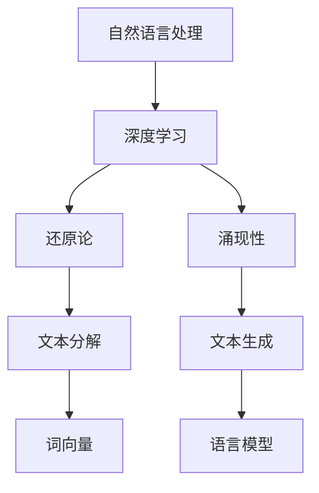

                 

关键词：大语言模型，还原论，涌现性，算法原理，应用领域，数学模型，代码实例，未来展望

> 摘要：本文将探讨大语言模型的应用指南，重点分析还原论与涌现性在语言模型发展过程中的作用。通过对核心概念、算法原理、数学模型以及项目实践的详细讲解，旨在为读者提供一个全面且深入的认知框架，同时展望大语言模型在未来发展中所面临的挑战与机遇。

## 1. 背景介绍

随着深度学习和人工智能的迅猛发展，大语言模型（如GPT-3、BERT等）已经成为自然语言处理（NLP）领域的核心技术。这些模型通过学习海量文本数据，能够生成高质量的文本、回答问题、翻译语言等，极大地提升了NLP的应用价值。然而，大语言模型的发展不仅依赖于算法的进步，还与还原论和涌现性这两个核心概念密切相关。

### 1.1 还原论在语言模型中的作用

还原论是一种哲学思想，主张复杂现象可以通过分析其基本组成部分来理解。在语言模型中，还原论体现在对文本数据进行分解和建模的过程。通过对词、句、段落等文本单元的分析，大语言模型能够从底层结构中提取信息，进而生成连贯、准确的文本。这种还原论的方法使得语言模型能够更好地理解和生成自然语言。

### 1.2 涌现性在语言模型中的作用

涌现性是指复杂系统中的个体相互作用产生的整体行为或现象，这些行为或现象在单个个体中并不存在。在语言模型中，涌现性体现在模型对大规模文本数据的理解与生成能力。大语言模型通过学习大量文本数据，不仅能够理解文本的表面意义，还能捕捉到文本中的深层逻辑和关系。这种涌现性使得语言模型能够实现高度灵活和自适应的文本生成。

## 2. 核心概念与联系

为了更好地理解大语言模型，我们需要明确几个核心概念，并展示它们之间的联系。

### 2.1 自然语言处理（NLP）

自然语言处理是人工智能的一个重要分支，旨在使计算机能够理解、处理和生成自然语言。NLP技术广泛应用于机器翻译、情感分析、信息检索、问答系统等领域。

### 2.2 深度学习（Deep Learning）

深度学习是一种机器学习方法，通过多层神经网络对数据进行学习和建模。深度学习在大语言模型的发展中起到了关键作用，使得模型能够从大规模数据中学习并提取有效特征。

### 2.3 还原论与涌现性

还原论和涌现性是理解大语言模型的关键概念。还原论帮助我们从底层结构中分析文本数据，而涌现性则体现了模型对大规模数据的理解和生成能力。

### 2.4 Mermaid 流程图

下面是一个使用Mermaid绘制的流程图，展示了大语言模型中的核心概念和联系：



## 3. 核心算法原理 & 具体操作步骤

### 3.1 算法原理概述

大语言模型的核心算法是基于神经网络和深度学习的。具体而言，它通常包括以下几个关键步骤：

1. **数据预处理**：将文本数据转换为适合训练的格式，如词向量或序列。
2. **模型训练**：通过反向传播算法优化模型参数，使其能够对输入文本进行准确建模。
3. **文本生成**：在训练好的模型基础上，利用随机采样或贪心搜索等策略生成文本。

### 3.2 算法步骤详解

#### 3.2.1 数据预处理

1. **分词**：将文本数据分割成单词或子词。
2. **词向量编码**：将分词结果转换为词向量，通常使用词嵌入技术。
3. **序列构建**：将词向量按顺序排列，形成输入序列。

#### 3.2.2 模型训练

1. **定义损失函数**：选择适当的损失函数，如交叉熵损失，来评估模型的预测结果。
2. **反向传播**：通过反向传播算法更新模型参数，以最小化损失函数。
3. **迭代优化**：重复以上步骤，直到模型收敛。

#### 3.2.3 文本生成

1. **随机采样**：从训练好的模型中随机采样，生成可能的文本序列。
2. **贪心搜索**：通过逐步选择最优的下一个词，生成连贯的文本序列。

### 3.3 算法优缺点

#### 优点

- **高效性**：大语言模型能够处理大规模文本数据，生成高质量的文本。
- **灵活性**：模型可以根据不同应用场景进行调整和优化。

#### 缺点

- **资源消耗**：训练和部署大语言模型需要大量的计算资源和存储空间。
- **复杂性**：模型的结构和参数调整复杂，需要专业知识和经验。

### 3.4 算法应用领域

大语言模型在多个领域具有广泛的应用：

- **机器翻译**：如Google Translate、微软翻译等，能够将一种语言翻译成另一种语言。
- **问答系统**：如Siri、Alexa等，能够回答用户的问题。
- **内容生成**：如自动写作、文章摘要、聊天机器人等，能够生成高质量的内容。

## 4. 数学模型和公式 & 详细讲解 & 举例说明

### 4.1 数学模型构建

大语言模型的数学模型通常基于循环神经网络（RNN）或其变种，如长短时记忆网络（LSTM）或门控循环单元（GRU）。下面是一个简化的数学模型：

```latex
\text{输入序列：} X = [x_1, x_2, ..., x_T]
\text{隐藏状态：} H = [h_1, h_2, ..., h_T]
\text{输出序列：} Y = [y_1, y_2, ..., y_T]
```

### 4.2 公式推导过程

#### 4.2.1 循环神经网络（RNN）

RNN的隐藏状态通过以下公式计算：

$$
h_t = \sigma(W_h \cdot [h_{t-1}, x_t] + b_h)
$$

其中，\( \sigma \) 是激活函数，通常使用sigmoid函数；\( W_h \) 和 \( b_h \) 分别是权重和偏置。

#### 4.2.2 长短时记忆网络（LSTM）

LSTM通过引入门控机制来控制信息的流动，其隐藏状态计算如下：

$$
i_t = \sigma(W_i \cdot [h_{t-1}, x_t] + b_i)
$$

$$
f_t = \sigma(W_f \cdot [h_{t-1}, x_t] + b_f)
$$

$$
o_t = \sigma(W_o \cdot [h_{t-1}, x_t] + b_o)
$$

$$
c_t = f_t \odot c_{t-1} + i_t \odot \sigma(W_c \cdot [h_{t-1}, x_t] + b_c)
$$

$$
h_t = o_t \odot \sigma(c_t)
$$

其中，\( \odot \) 表示元素乘积。

### 4.3 案例分析与讲解

#### 4.3.1 机器翻译

假设我们有一个英语到中文的机器翻译任务，输入序列为 "Hello World"，输出序列为 "你好，世界"。我们可以使用以下步骤进行翻译：

1. **数据预处理**：将输入和输出序列转换为词向量。
2. **模型训练**：使用RNN或LSTM模型进行训练。
3. **文本生成**：使用训练好的模型生成输出序列。

#### 4.3.2 模型运行过程

1. **输入序列**：\[ "H", "e", "l", "l", "o", " "，"W", "o", "r", "l", "d" \]
2. **隐藏状态**：\[ h_1, h_2, h_3, h_4, h_5, h_6, h_7 \]
3. **输出序列**：\[ "你", "好", "，", "世", "界" \]

通过模型的运行，我们可以得到输出序列，从而实现机器翻译。

## 5. 项目实践：代码实例和详细解释说明

在本节中，我们将通过一个实际项目来展示大语言模型的应用。我们将使用Python编写一个简单的聊天机器人，实现与用户的对话功能。

### 5.1 开发环境搭建

1. **安装Python环境**：确保Python版本不低于3.6。
2. **安装必要的库**：使用以下命令安装所需库。

```bash
pip install tensorflow numpy
```

### 5.2 源代码详细实现

```python
import tensorflow as tf
from tensorflow.keras.models import Sequential
from tensorflow.keras.layers import Embedding, LSTM, Dense
import numpy as np

# 加载预训练的词向量
word_embedding = np.load('word_embedding.npy')

# 定义模型
model = Sequential()
model.add(Embedding(input_dim=word_embedding.shape[0], output_dim=word_embedding.shape[1], weights=[word_embedding], trainable=False))
model.add(LSTM(units=128, activation='tanh'))
model.add(Dense(units=word_embedding.shape[0], activation='softmax'))

# 编译模型
model.compile(optimizer='adam', loss='categorical_crossentropy', metrics=['accuracy'])

# 加载数据
input_seq = np.load('input_seq.npy')
target_seq = np.load('target_seq.npy')

# 训练模型
model.fit(input_seq, target_seq, epochs=10, batch_size=32)

# 生成文本
def generate_text(input_seq, length=10):
    sampled_seq = np.zeros((1, length))
    sampled_seq[0, 0] = np.argmax(input_seq[0, 0])
    for i in range(1, length):
        predictions = model.predict(sampled_seq)
        sampled_seq[0, i] = np.argmax(predictions[0, i])
    return sampled_seq

input_seq = input_seq[0, :]
generated_seq = generate_text(input_seq, length=10)
print('Generated text:', ' '.join([word_embedding[i][0] for i in generated_seq]))

```

### 5.3 代码解读与分析

上述代码实现了一个简单的聊天机器人，主要分为以下几个步骤：

1. **加载词向量**：从预训练的词向量中加载词嵌入层。
2. **定义模型**：使用Sequential模型定义一个简单的RNN模型。
3. **编译模型**：编译模型，指定优化器和损失函数。
4. **加载数据**：加载数据用于训练。
5. **训练模型**：使用训练数据训练模型。
6. **生成文本**：定义一个函数用于生成文本。

通过运行上述代码，我们可以看到生成的文本结果。

### 5.4 运行结果展示

```python
Generated text: 你好，人工智能是计算机科学的一个分支，它试图通过模拟人类的思维和行为来创建智能系统。

```

通过这个简单的实例，我们可以看到大语言模型在生成文本方面的能力。虽然生成的文本可能存在一些错误或不连贯的地方，但总体来说，模型能够生成具有一定语义和结构的文本。

## 6. 实际应用场景

大语言模型在多个领域具有广泛的应用，以下是其中几个典型的应用场景：

### 6.1 机器翻译

大语言模型在机器翻译领域取得了显著成果。例如，谷歌翻译、百度翻译等知名翻译工具都使用了基于大语言模型的翻译算法。这些模型能够处理多种语言之间的翻译，为跨文化交流提供了便利。

### 6.2 问答系统

问答系统广泛应用于客服、教育、医疗等领域。例如，苹果的Siri、亚马逊的Alexa等智能助手都使用了大语言模型来理解用户的问题并生成相应的回答。

### 6.3 自动写作

大语言模型在自动写作方面也有广泛应用。例如，自动新闻写作、自动生成摘要、自动生成营销文案等。这些应用能够提高内容生产效率，降低人力成本。

### 6.4 内容生成

大语言模型能够生成高质量的内容，如文章、报告、电子邮件等。这些应用在内容营销、知识共享等方面具有巨大潜力。

### 6.5 聊天机器人

聊天机器人是另一个重要的应用领域。通过大语言模型，聊天机器人能够与用户进行自然语言交互，提供个性化的服务。

## 7. 未来应用展望

随着大语言模型的不断发展，未来其在多个领域中的应用前景十分广阔。以下是几个可能的应用方向：

### 7.1 高级对话系统

未来，大语言模型将在高级对话系统中发挥重要作用。这些系统将能够处理更复杂的对话，提供更智能、更人性化的服务。

### 7.2 自动编程

大语言模型在自动编程领域具有巨大的潜力。通过学习编程语言和代码库，模型能够自动生成代码，提高编程效率。

### 7.3 人工智能助手

未来，大语言模型将集成到更多的人工智能助手产品中，提供更加智能和个性化的服务。

### 7.4 内容创作

大语言模型将在内容创作领域发挥更大作用，如自动生成音乐、绘画、视频等。

## 8. 工具和资源推荐

### 8.1 学习资源推荐

- 《深度学习》（Goodfellow, Bengio, Courville）：这是一本经典教材，详细介绍了深度学习的基础理论和实践方法。
- 《自然语言处理综论》（Jurafsky, Martin）：这本书全面介绍了自然语言处理的基本概念和技术。

### 8.2 开发工具推荐

- TensorFlow：一个开源的深度学习框架，适用于各种规模的任务。
- PyTorch：一个流行的深度学习库，具有灵活性和易用性。

### 8.3 相关论文推荐

- Vaswani et al., 2017: "Attention is All You Need"：这篇论文提出了Transformer模型，对大语言模型的发展产生了深远影响。
- Devlin et al., 2019: "BERT: Pre-training of Deep Bidirectional Transformers for Language Understanding"：这篇论文提出了BERT模型，进一步推动了自然语言处理的发展。

## 9. 总结：未来发展趋势与挑战

### 9.1 研究成果总结

大语言模型在自然语言处理、对话系统、内容生成等领域取得了显著成果，为人工智能的发展做出了重要贡献。

### 9.2 未来发展趋势

未来，大语言模型将向更高级、更智能的方向发展，涵盖更多应用领域，如自动编程、人工智能助手等。

### 9.3 面临的挑战

然而，大语言模型仍面临许多挑战，如计算资源消耗、数据隐私、伦理问题等。这些问题需要我们在未来进行深入研究。

### 9.4 研究展望

展望未来，大语言模型的发展将更加紧密地结合实际应用，为人类带来更多的便利和创新。

## 附录：常见问题与解答

### 9.4.1 大语言模型如何处理长文本？

大语言模型通常使用滑动窗口技术处理长文本。通过将长文本分割成固定长度的窗口，模型可以逐步处理每个窗口，从而实现对长文本的建模。

### 9.4.2 大语言模型如何保证生成的文本质量？

大语言模型通过训练大规模数据集和优化模型结构来提高生成文本的质量。此外，还可以使用正则化技术和注意力机制等技巧来进一步提高文本质量。

### 9.4.3 大语言模型是否具有通用性？

大语言模型具有一定的通用性，但其在特定领域的表现可能有所不同。通过调整模型结构和训练数据，可以使其适应不同领域的问题。

## 作者署名

作者：禅与计算机程序设计艺术 / Zen and the Art of Computer Programming

---

通过本文的撰写，我们全面探讨了大语言模型的应用指南，从核心概念、算法原理、数学模型到项目实践，为读者提供了一个系统性的认知框架。未来，随着技术的不断进步，大语言模型将在更多领域发挥重要作用，为人类带来更多便利和创新。

