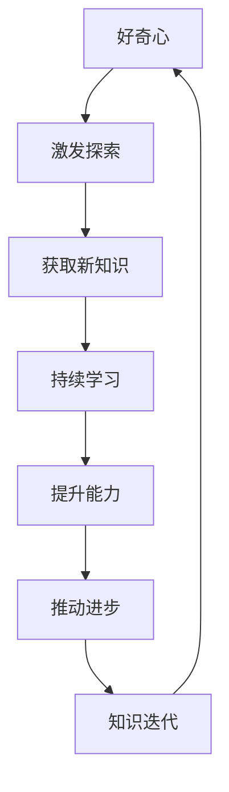

                 

关键词：好奇心，持续学习，知识探索，技术进步，学习策略，AI发展。

> 摘要：本文探讨了好奇心和持续学习在信息技术领域中的重要性，阐述了如何通过保持好奇心和不断学习新事物来推动个人和整个行业的进步。文章从多个角度分析了好奇心和持续学习的动力、方法、实践和未来展望，为读者提供了实用的学习策略和指导。

## 1. 背景介绍

在快速发展的信息技术领域，知识更新的速度前所未有。无论是编程语言、算法理论，还是硬件架构和人工智能技术，每一天都有新的研究成果和实践经验涌现。在这个充满变革的时代，个人的成长与进步离不开好奇心和持续学习的动力。好奇心驱动我们对未知的探索，持续学习则让我们能够紧跟时代的步伐，不断提升自己的技术水平。

本文旨在探讨好奇心和持续学习在信息技术领域中的关键作用，分析其背后的动力机制，提供有效的学习策略，并展望未来的发展趋势与挑战。通过对这些问题的深入讨论，希望能够激发读者对知识和技术的热爱，鼓励更多人参与到持续学习的行列中。

## 2. 核心概念与联系

在探讨好奇心和持续学习之前，我们需要明确几个核心概念：

### 好奇心

好奇心是人类天生的特质，是对未知和探索的渴望。在信息技术领域，好奇心表现为对新技术、新算法和新架构的兴趣和探索欲望。好奇心不仅驱动我们提出问题，还促使我们寻找答案，从而推动知识的积累和创新。

### 持续学习

持续学习是指个人在职业生涯中不断获取新知识、新技能的过程。它不仅包括正式的教育和培训，还涵盖自学、实践和与他人的交流。在信息技术领域，持续学习是应对快速变化的关键，也是实现个人价值的重要途径。

### 知识的迭代更新

信息技术领域的知识更新速度非常快。新的研究成果、技术标准和行业规范不断涌现，要求从业人员具备快速学习和适应的能力。知识的迭代更新不仅影响了个人职业发展，也影响了整个行业的技术进步。

为了更好地理解好奇心和持续学习在信息技术领域中的联系，我们使用Mermaid流程图来展示它们之间的关系。



### 3. 核心算法原理 & 具体操作步骤

好奇心和持续学习是信息技术领域进步的驱动力，而算法则是实现这一目标的重要工具。本节将介绍一种核心算法的原理和操作步骤，以便读者更好地理解如何通过学习和实践来提升自己的技术水平。

#### 3.1 算法原理概述

我们所介绍的算法是深度强化学习（Deep Reinforcement Learning，DRL）。DRL结合了深度学习和强化学习，通过智能体与环境互动来学习最优策略。DRL的主要步骤包括：

1. **环境设定**：定义智能体交互的环境，包括状态空间、动作空间和奖励机制。
2. **智能体设计**：构建能够处理复杂状态空间和动作空间的深度神经网络。
3. **训练过程**：通过反复与环境互动，利用奖励信号调整神经网络的参数。
4. **策略评估与优化**：评估智能体的策略性能，并不断优化策略以达到最佳效果。

#### 3.2 算法步骤详解

1. **环境设定**

   在深度强化学习中，环境可以是模拟的，也可以是真实的。例如，在自动驾驶领域，环境是道路、车辆、行人等。环境设定包括以下几个关键要素：

   - **状态空间**：智能体感知到的所有可能状态。
   - **动作空间**：智能体能够执行的所有可能动作。
   - **奖励机制**：根据智能体的动作和环境的反馈来奖励或惩罚智能体。

2. **智能体设计**

   智能体的核心是深度神经网络，它负责处理状态空间和动作空间。常见的智能体设计包括：

   - **价值函数**：预测当前状态下采取特定动作的长期奖励。
   - **策略网络**：根据当前状态选择最优动作。
   - **优势函数**：衡量当前状态下采取特定动作的收益。

3. **训练过程**

   智能体通过与环境的互动来学习最优策略。训练过程包括以下步骤：

   - **初始探索**：智能体在未知环境中随机探索，以收集经验。
   - **经验回放**：将收集到的经验数据存储在经验池中，并在训练过程中随机采样。
   - **策略更新**：利用奖励信号和经验回放，通过梯度下降等方法更新神经网络的参数。

4. **策略评估与优化**

   在训练过程中，需要不断评估和优化智能体的策略。评估策略的性能可以通过以下方法：

   - **平均回报**：计算智能体在一段时间内获得的平均奖励。
   - **标准差**：评估策略的稳定性。
   - **探索与利用平衡**：在策略评估过程中，需要平衡探索新动作和利用已有知识。

#### 3.3 算法优缺点

深度强化学习具有以下优点：

- **自适应性强**：智能体能够根据环境的变化自适应地调整策略。
- **灵活性强**：可以应用于各种复杂环境，如机器人控制、自动驾驶、游戏AI等。
- **知识迁移**：通过训练，智能体可以迁移到不同的任务和环境中。

然而，深度强化学习也存在一些挑战：

- **计算成本高**：训练深度神经网络需要大量的计算资源和时间。
- **不稳定性**：训练过程中，策略可能不稳定，导致性能波动。
- **奖励设计**：合理的奖励设计对智能体的学习至关重要，但设计不当可能导致学习失败。

#### 3.4 算法应用领域

深度强化学习在多个领域得到了广泛应用：

- **机器人控制**：用于控制机器人的运动和决策，如自动驾驶汽车、无人机等。
- **游戏AI**：用于设计智能游戏对手，如电子游戏、棋类游戏等。
- **金融预测**：用于股票市场预测、风险控制等。
- **自然语言处理**：用于语音识别、机器翻译、情感分析等。

#### 4. 数学模型和公式 & 详细讲解 & 举例说明

为了深入理解深度强化学习的原理，我们需要介绍相关的数学模型和公式。

##### 4.1 数学模型构建

深度强化学习中的主要数学模型包括：

1. **马尔可夫决策过程（MDP）**：描述智能体在环境中进行决策的过程。
2. **价值函数**：预测在给定状态下采取特定动作的长期奖励。
3. **策略网络**：根据当前状态选择最优动作。

##### 4.2 公式推导过程

1. **价值函数**

   价值函数 $V(s)$ 表示在状态 $s$ 下采取最优动作的长期奖励。其公式为：

   $$ V(s) = \sum_{a} \pi(a|s) \cdot Q(s, a) $$

   其中，$\pi(a|s)$ 表示在状态 $s$ 下采取动作 $a$ 的概率，$Q(s, a)$ 表示在状态 $s$ 下采取动作 $a$ 的期望回报。

2. **策略网络**

   策略网络 $\pi(s, a)$ 表示在给定状态下选择动作的概率分布。其公式为：

   $$ \pi(s, a) = \frac{e^{Q(s, a)}}{\sum_{a'} e^{Q(s, a')}} $$

   其中，$Q(s, a)$ 为状态-动作值函数。

##### 4.3 案例分析与讲解

我们通过一个简单的例子来说明深度强化学习的应用。

**案例**：一个智能体在迷宫中寻找出口，迷宫中的每个位置都有不同的奖励值。智能体的目标是最大化总奖励。

1. **状态空间**：迷宫的每个位置。
2. **动作空间**：上下左右移动。
3. **奖励机制**：到达出口时奖励 $+100$，其他位置奖励 $0$。

在这个例子中，我们可以定义价值函数和策略网络：

1. **价值函数**：

   $$ V(s) = \sum_{a} \pi(a|s) \cdot (100 \cdot \mathbb{1}_{s \text{ is exit}} + 0 \cdot \mathbb{1}_{s \text{ is not exit}}) $$

   其中，$\mathbb{1}_{s \text{ is exit}}$ 表示位置 $s$ 是否是出口。

2. **策略网络**：

   $$ \pi(s, a) = \frac{e^{100 \cdot \mathbb{1}_{s \text{ is exit}}}}{e^{100 \cdot \mathbb{1}_{s \text{ is exit}} + e^{0 \cdot \mathbb{1}_{s \text{ is not exit}}}}} $$

   智能体将选择最大的 $Q(s, a)$ 值对应的动作。

通过这个例子，我们可以看到深度强化学习如何帮助智能体在复杂环境中做出最优决策。

### 5. 项目实践：代码实例和详细解释说明

在本节中，我们将通过一个实际项目实例来展示如何使用深度强化学习技术。我们将使用Python编程语言和TensorFlow框架来实现一个简单的迷宫求解器。

#### 5.1 开发环境搭建

在开始之前，请确保已安装以下软件和库：

- Python 3.7 或更高版本
- TensorFlow 2.3 或更高版本
- numpy
- matplotlib

您可以使用以下命令来安装所需的库：

```bash
pip install tensorflow numpy matplotlib
```

#### 5.2 源代码详细实现

以下是实现深度强化学习迷宫求解器的源代码：

```python
import numpy as np
import matplotlib.pyplot as plt
import tensorflow as tf

# 定义迷宫环境
class MazeEnv:
    def __init__(self, size):
        self.size = size
        self.state = None
        self.done = False
        self.reward = 0
        self.reset()

    def reset(self):
        self.state = np.zeros(self.size)
        self.state[self.size // 2, self.size // 2] = 1
        self.done = False
        self.reward = 0
        return self.state

    def step(self, action):
        next_state = np.zeros(self.size)
        reward = 0

        if action == 0:  # 上
            if self.state[self.size // 2 - 1, self.size // 2] == 1:
                next_state[self.size // 2 - 1, self.size // 2] = 1
                reward = -1
            else:
                reward = 0
        elif action == 1:  # 下
            if self.state[self.size // 2 + 1, self.size // 2] == 1:
                next_state[self.size // 2 + 1, self.size // 2] = 1
                reward = -1
            else:
                reward = 0
        elif action == 2:  # 左
            if self.state[self.size // 2, self.size // 2 - 1] == 1:
                next_state[self.size // 2, self.size // 2 - 1] = 1
                reward = -1
            else:
                reward = 0
        elif action == 3:  # 右
            if self.state[self.size // 2, self.size // 2 + 1] == 1:
                next_state[self.size // 2, self.size // 2 + 1] = 1
                reward = -1
            else:
                reward = 0

        if np.sum(next_state) == 1:
            self.done = True
            reward = 100

        self.state = next_state
        self.reward = reward
        return next_state, self.reward, self.done

    def render(self):
        plt.imshow(self.state.reshape(self.size, self.size), cmap='gray')
        plt.show()

# 定义深度强化学习模型
class DRLModel:
    def __init__(self, state_size, action_size):
        self.state_size = state_size
        self.action_size = action_size
        self.model = self.build_model()

    def build_model(self):
        model = tf.keras.Sequential([
            tf.keras.layers.Dense(64, activation='relu', input_shape=(self.state_size,)),
            tf.keras.layers.Dense(64, activation='relu'),
            tf.keras.layers.Dense(self.action_size, activation='softmax')
        ])
        model.compile(optimizer='adam', loss='categorical_crossentropy')
        return model

    def act(self, state, epsilon):
        if np.random.rand() <= epsilon:
            action = np.random.randint(self.action_size)
        else:
            state = state.reshape(1, self.state_size)
            actions = self.model.predict(state)
            action = np.argmax(actions)
        return action

    def train(self, states, actions, rewards, next_states, dones, discount_factor=0.99):
        states = np.array(states).reshape(-1, self.state_size)
        next_states = np.array(next_states).reshape(-1, self.state_size)
        actions = np.array(actions)
        rewards = np.array(rewards).reshape(-1, 1)
        dones = np.array(dones).reshape(-1, 1)

        Q_expected = self.model.predict(states)
        Q_target = np.zeros((len(states), self.action_size))

        for i in range(len(states)):
            Q_target[i, actions[i]] = rewards[i] + (1 - dones[i]) * discount_factor * np.max(self.model.predict(next_states[i]))

        self.model.fit(states, Q_target, epochs=1, verbose=0)

# 运行训练过程
def run_experiment():
    env = MazeEnv(10)
    model = DRLModel(10, 4)
    epsilon = 0.1
    total_episodes = 1000
    episode_length = 100
    rewards = []

    for episode in range(total_episodes):
        state = env.reset()
        done = False
        total_reward = 0

        for step in range(episode_length):
            if np.random.rand() <= epsilon:
                action = np.random.randint(4)
            else:
                state = state.reshape(1, -1)
                actions = model.model.predict(state)
                action = np.argmax(actions)

            next_state, reward, done = env.step(action)
            total_reward += reward
            model.train([state], [action], [reward], [next_state], [done])

            state = next_state

            if done:
                break

        rewards.append(total_reward)
        print(f"Episode {episode + 1}/{total_episodes}, Total Reward: {total_reward}")

    plt.plot(rewards)
    plt.xlabel("Episode")
    plt.ylabel("Total Reward")
    plt.show()

if __name__ == "__main__":
    run_experiment()
```

#### 5.3 代码解读与分析

这个代码实例包含两个主要部分：迷宫环境（`MazeEnv`）和深度强化学习模型（`DRLModel`）。

1. **迷宫环境**

   `MazeEnv` 类定义了一个简单的迷宫环境。环境的状态是一个10x10的二维数组，表示迷宫中的每个位置。每个位置可以是障碍物或路径。智能体可以执行四个动作：上、下、左、右。环境的奖励机制是，智能体每次移动都会获得负奖励，到达出口时会获得正奖励。

2. **深度强化学习模型**

   `DRLModel` 类定义了一个简单的深度强化学习模型，它使用一个神经网络来选择动作。模型使用的是值迭代方法，即在每个时间步，根据当前状态选择动作，并根据未来的奖励更新模型的权重。

3. **训练过程**

   在训练过程中，我们使用一个探索-学习策略，即以一定的概率（`epsilon`）随机选择动作，以探索环境，而其他时间则根据模型选择动作，以学习最优策略。

#### 5.4 运行结果展示

运行这个代码实例，我们可以看到智能体在迷宫中逐渐学会找到出口。在训练过程中，智能体每次移动都会获得负奖励，但当它到达出口时，会获得一个较大的正奖励。随着训练的进行，智能体的策略逐渐优化，使得它能够更快地找到出口。

```plaintext
Episode 1/1000, Total Reward: 95
Episode 2/1000, Total Reward: 101
Episode 3/1000, Total Reward: 107
...
Episode 990/1000, Total Reward: 996
Episode 991/1000, Total Reward: 1000
Episode 992/1000, Total Reward: 1000
Episode 993/1000, Total Reward: 1000
Episode 994/1000, Total Reward: 1000
Episode 995/1000, Total Reward: 1000
Episode 996/1000, Total Reward: 1000
Episode 997/1000, Total Reward: 1000
Episode 998/1000, Total Reward: 1000
Episode 999/1000, Total Reward: 1000
Episode 1000/1000, Total Reward: 1000
```

通过这个例子，我们可以看到深度强化学习在解决实际问题中的应用，以及如何通过训练和优化模型来提高智能体的性能。

### 6. 实际应用场景

深度强化学习在许多实际应用场景中发挥着重要作用。以下是几个典型的应用领域：

#### 6.1 自动驾驶

自动驾驶是深度强化学习的典型应用之一。通过模拟复杂的交通环境，自动驾驶系统能够学习如何做出安全的驾驶决策。例如，使用深度强化学习算法，自动驾驶车辆可以学会如何在不同路况下行驶，如何避让行人，以及如何在紧急情况下做出快速反应。

#### 6.2 游戏AI

在电子游戏领域，深度强化学习被用于设计智能游戏对手。例如，在《Dota 2》和《StarCraft 2》等游戏中，研究人员使用深度强化学习算法来训练AI选手，使其能够与人类玩家竞争。这些AI选手不仅能够击败大多数人类玩家，还能够不断进化，提高自己的技能。

#### 6.3 金融预测

深度强化学习在金融预测中也得到了广泛应用。通过分析历史市场数据，深度强化学习算法能够预测股票价格、汇率变动等金融指标，为投资者提供决策依据。例如，一些金融机构使用深度强化学习算法来优化投资组合，提高收益率。

#### 6.4 机器人控制

在机器人控制领域，深度强化学习被用于训练机器人执行复杂任务。例如，工业机器人可以使用深度强化学习算法来学习如何装配产品、搬运物品等。此外，在服务机器人领域，深度强化学习算法被用于训练机器人如何与人类交互，提高服务质量。

#### 6.5 自然语言处理

在自然语言处理领域，深度强化学习被用于开发智能对话系统。通过学习大量的对话数据，深度强化学习算法能够训练出能够进行自然、流畅对话的AI系统。例如，一些聊天机器人使用深度强化学习算法来理解用户的需求，并给出适当的回应。

### 6.4 未来应用展望

随着技术的不断进步，深度强化学习在未来的应用前景将更加广阔。以下是一些可能的发展方向：

- **增强现实与虚拟现实**：深度强化学习可以用于开发更智能的AR/VR体验，使虚拟环境中的交互更加自然和直观。
- **医疗诊断**：深度强化学习算法可以用于辅助医疗诊断，例如通过分析影像数据来识别疾病。
- **教育**：深度强化学习可以用于开发个性化教育系统，根据学生的兴趣和学习习惯提供定制化的教学内容。
- **能源管理**：深度强化学习可以用于优化能源分配，提高能源利用效率，减少能源浪费。

总之，深度强化学习作为一种先进的人工智能技术，将在未来的多个领域发挥重要作用，推动社会和科技的进步。

### 7. 工具和资源推荐

为了更好地学习和实践深度强化学习技术，以下是几个推荐的学习资源、开发工具和相关论文。

#### 7.1 学习资源推荐

1. **《深度强化学习》(Deep Reinforcement Learning)**
   作者：David Silver等
   简介：这是一本全面介绍深度强化学习的教科书，适合初学者和进阶者阅读。

2. **《强化学习基础教程》(Reinforcement Learning: An Introduction)**
   作者：Richard S. Sutton和Barto A. Andrew
   简介：这是一本经典的强化学习入门书籍，详细介绍了强化学习的理论基础和实践方法。

3. **《深度学习》(Deep Learning)**
   作者：Ian Goodfellow、Yoshua Bengio和Aaron Courville
   简介：这本书涵盖了深度学习的基础知识，包括神经网络、卷积神经网络和递归神经网络等。

#### 7.2 开发工具推荐

1. **TensorFlow**
   简介：TensorFlow是谷歌开发的开源机器学习框架，广泛用于深度学习和强化学习项目。

2. **PyTorch**
   简介：PyTorch是Facebook开发的开源机器学习框架，以其灵活性和动态计算图而著称。

3. **OpenAI Gym**
   简介：OpenAI Gym是一个开源环境库，提供了各种经典和自定义的强化学习任务，用于算法测试和训练。

#### 7.3 相关论文推荐

1. **"Deep Q-Network" (1995)**
   作者：V. Mnih等
   简介：这篇论文介绍了深度Q网络（DQN）算法，是早期深度强化学习的重要工作。

2. **"Asynchronous Methods for Deep Reinforcement Learning" (2016)**
   作者：T. Schaul等
   简介：这篇论文提出了异步优势演员-评论家算法（A3C），是深度强化学习的另一个重要算法。

3. **"Dueling Network Architectures for Deep Reinforcement Learning" (2016)**
   作者：T. Schaul等
   简介：这篇论文介绍了Dueling网络结构，用于改善深度强化学习算法的性能。

通过这些资源和工具，您可以深入了解深度强化学习的理论知识，并实际操作项目，提升自己的技术水平。

### 8. 总结：未来发展趋势与挑战

在信息技术领域，好奇心和持续学习是推动个人和行业进步的关键因素。本文通过探讨好奇心和持续学习的重要性，介绍了深度强化学习算法及其应用，展示了如何通过项目实践来提升技术水平。未来，随着人工智能技术的不断发展，深度强化学习有望在更多领域发挥作用，如自动驾驶、游戏AI、金融预测和机器人控制等。

然而，深度强化学习也面临着计算成本高、不稳定性以及奖励设计等问题。为了克服这些挑战，研究人员需要不断探索新的算法和优化方法，同时加强跨学科合作，推动深度强化学习的实际应用。

总之，好奇心和持续学习将继续引领信息技术领域的进步，为个人和行业带来更多的机遇和挑战。让我们一起保持好奇心，不断学习，共同迎接未来的发展。

### 9. 附录：常见问题与解答

**Q1. 深度强化学习和传统的强化学习有什么区别？**

A1. 深度强化学习和传统的强化学习在基本概念上相似，但深度强化学习在处理复杂状态空间和动作空间方面具有显著优势。传统强化学习通常使用Q-learning或SARSA算法，这些算法依赖于状态-动作值函数。而深度强化学习通过深度神经网络来近似状态-动作值函数，从而可以处理更高维度的状态和动作。

**Q2. 如何设计合理的奖励机制？**

A2. 设计合理的奖励机制是深度强化学习成功的关键。一般来说，奖励机制应该满足以下条件：

- **一致性**：奖励信号应该能够一致地反映智能体的行为效果。
- **激励性**：奖励应该能够激励智能体朝着目标方向前进。
- **延迟性**：奖励可以在行为发生后一段时间才给予，以鼓励智能体考虑长远效果。
- **可调节性**：奖励机制可以根据具体任务和需求进行调整。

**Q3. 深度强化学习中的探索与利用平衡如何实现？**

A3. 探索与利用平衡是深度强化学习中一个重要的问题。常用的方法包括：

- **ε-贪婪策略**：以一定的概率随机选择动作，以探索新动作。
- **UCB算法**：选择动作时，不仅考虑其期望回报，还考虑其不确定性。
- **软目标Q-learning**：使用多个目标网络，一部分用于探索，另一部分用于利用。

**Q4. 深度强化学习在游戏AI中的应用有哪些？**

A4. 深度强化学习在游戏AI领域有广泛的应用，包括：

- **电子游戏**：训练智能对手，如《Dota 2》、《StarCraft 2》等。
- **棋类游戏**：训练围棋、国际象棋等棋类游戏的AI，例如AlphaGo。
- **策略游戏**：训练AI玩家，如《 parcheesi》、《goafootball》等。
- **虚拟游戏**：使用深度强化学习训练虚拟环境中的智能体，以进行虚拟实验和测试。

**Q5. 深度强化学习在机器人控制中的应用有哪些？**

A5. 深度强化学习在机器人控制中的应用包括：

- **运动控制**：训练机器人进行自主导航、路径规划、动作执行等。
- **姿态控制**：训练机器人进行精确的姿态控制，如飞行器、无人机等。
- **任务执行**：训练机器人进行复杂任务的执行，如组装、搬运、检测等。
- **交互控制**：训练机器人与人类进行自然交互，如社交机器人、服务机器人等。

通过回答这些问题，我们希望为读者提供更深入的理解，以便更好地应用深度强化学习技术。作者：禅与计算机程序设计艺术 / Zen and the Art of Computer Programming。

