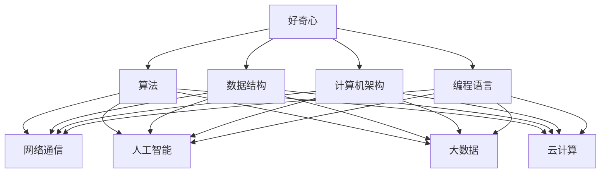

                 

好奇心是人类进化过程中的一个重要驱动力，它激励着我们不断探索未知、学习新知识、解决问题。在信息技术领域，好奇心更是推动技术革新的核心力量。本文将探讨好奇心在计算机科学和技术发展中的重要作用，并通过具体案例展示好奇心如何成为探索世界的钥匙。

## 1. 背景介绍

在古代，人类通过观察自然现象和日常生活中的各种现象，产生了对世界的好奇心。这种好奇心促使人类开始寻找解释现象的方法，并逐渐发展出了科学和技术的雏形。计算机科学作为信息技术的一个分支，起源于20世纪中叶。自那时以来，计算机科学和技术不断进步，不仅改变了人类的生活方式，还推动了各行各业的数字化转型。

好奇心在计算机科学和技术发展中的作用不可忽视。它是科学家、工程师和研究人员不断探索未知领域的动力，也是创新和发明的源泉。从计算机硬件到软件，从网络通信到人工智能，好奇心激发了许多关键技术的突破。

## 2. 核心概念与联系

### 2.1 好奇心与计算机科学

好奇心是推动计算机科学发展的核心动力。它促使科学家和研究人员不断探索计算机的基本原理、算法和架构。以下是好奇心在计算机科学中的几个关键概念：

1. **算法**：算法是解决问题的一系列步骤。好奇心驱使研究人员不断寻找更高效、更优化的算法。
2. **数据结构**：数据结构是组织和管理数据的方式。好奇心促使研究人员开发新的数据结构来提高数据处理效率。
3. **计算机架构**：计算机架构涉及计算机硬件的设计和实现。好奇心推动了计算机架构的不断演进和优化。
4. **编程语言**：编程语言是编写计算机程序的工具。好奇心促使研究人员不断改进编程语言，使其更易于理解和使用。

### 2.2 好奇心与信息技术

好奇心在信息技术领域同样发挥着重要作用。以下是好奇心在信息技术中的几个关键概念：

1. **网络通信**：网络通信是连接计算机和设备的桥梁。好奇心促使研究人员开发新的通信协议和算法，提高网络速度和可靠性。
2. **人工智能**：人工智能是计算机科学的一个分支，它使计算机能够模拟人类的智能行为。好奇心推动研究人员不断探索人工智能的新领域和应用。
3. **大数据**：大数据是大量结构化和非结构化数据。好奇心促使研究人员开发新的方法和工具来处理和分析大数据。
4. **云计算**：云计算是一种计算服务模式，它使计算资源更加灵活和高效。好奇心推动研究人员不断改进云计算技术，以满足日益增长的计算需求。

### 2.3 Mermaid 流程图

以下是一个简单的 Mermaid 流程图，展示了好奇心在计算机科学和信息技术中的核心概念和联系：



## 3. 核心算法原理 & 具体操作步骤

### 3.1 算法原理概述

算法是解决问题的步骤序列。在计算机科学中，算法是核心概念之一。以下是一个简单的排序算法——冒泡排序的原理概述：

- **输入**：一个无序的数组。
- **输出**：一个有序的数组。
- **步骤**：
  1. 从第一个元素开始，比较相邻的两个元素。
  2. 如果第一个元素比第二个元素大，交换它们的位置。
  3. 对每一对相邻的元素重复上述步骤，直到没有需要交换的元素为止。
  4. 重复上述过程，直到整个数组有序。

### 3.2 算法步骤详解

以下是冒泡排序算法的详细步骤：

1. **初始化**：将输入数组 `arr` 传递给算法。
2. **循环**：从第一个元素开始，对每一对相邻的元素进行比较和交换，直到没有需要交换的元素为止。
3. **内层循环**：对每一对相邻的元素进行一次比较和交换。
4. **外层循环**：重复内层循环，直到整个数组有序。

以下是 Python 实现的冒泡排序算法：

```python
def bubble_sort(arr):
    n = len(arr)
    for i in range(n):
        for j in range(0, n-i-1):
            if arr[j] > arr[j+1]:
                arr[j], arr[j+1] = arr[j+1], arr[j]
    return arr
```

### 3.3 算法优缺点

- **优点**：
  - 算法简单，易于理解和实现。
  - 在数据量较小的情况下，性能较好。

- **缺点**：
  - 时间复杂度为 \(O(n^2)\)，在数据量较大时，性能较差。
  - 不适合进行大规模数据的排序。

### 3.4 算法应用领域

冒泡排序算法广泛应用于各种场景，例如：

- **教学**：用于教学和演示排序算法。
- **小型数据集**：在数据量较小的情况下，用于数据的排序。
- **算法竞赛**：在算法竞赛中，用于解决排序相关的问题。

## 4. 数学模型和公式 & 详细讲解 & 举例说明

### 4.1 数学模型构建

在计算机科学中，数学模型是描述算法和系统行为的重要工具。以下是一个简单的数学模型——线性方程组的求解：

- **输入**：一个线性方程组。
- **输出**：方程组的解。

### 4.2 公式推导过程

线性方程组的解法通常使用高斯消元法。以下是高斯消元法的推导过程：

1. **初始化**：将线性方程组表示为矩阵形式 \(Ax = b\)，其中 \(A\) 是系数矩阵，\(x\) 是未知数向量，\(b\) 是常数向量。
2. **行变换**：通过行变换，将系数矩阵 \(A\) 化为上三角矩阵。
3. **回代**：从最后一行开始，依次求解未知数向量 \(x\)。

### 4.3 案例分析与讲解

以下是一个线性方程组的实例：

\[ \begin{cases} 2x + 3y = 7 \\ 4x - y = 1 \end{cases} \]

使用高斯消元法求解该方程组：

1. **初始化**：
   \[ \begin{cases} 2x + 3y = 7 \\ 4x - y = 1 \end{cases} \]
2. **行变换**：
   \[ \begin{cases} 2x + 3y = 7 \\ -3(4x - y) = -3 \end{cases} \]
   \[ \begin{cases} 2x + 3y = 7 \\ -12x + 3y = -3 \end{cases} \]
3. **相加**：
   \[ \begin{cases} 2x + 3y = 7 \\ -10x = -10 \end{cases} \]
4. **回代**：
   \[ x = 1 \]
   \[ 2(1) + 3y = 7 \]
   \[ y = \frac{5}{3} \]

因此，该线性方程组的解为 \(x = 1, y = \frac{5}{3}\)。

## 5. 项目实践：代码实例和详细解释说明

### 5.1 开发环境搭建

为了实现冒泡排序算法，我们需要搭建一个简单的开发环境。以下是使用 Python 实现冒泡排序算法的环境搭建步骤：

1. 安装 Python 解释器：从 [Python 官网](https://www.python.org/) 下载并安装 Python 解释器。
2. 安装文本编辑器：选择一个文本编辑器，例如 Visual Studio Code，用于编写 Python 代码。
3. 准备测试数据：创建一个包含无序数据的文件，用于测试冒泡排序算法。

### 5.2 源代码详细实现

以下是 Python 实现的冒泡排序算法的源代码：

```python
def bubble_sort(arr):
    n = len(arr)
    for i in range(n):
        for j in range(0, n-i-1):
            if arr[j] > arr[j+1]:
                arr[j], arr[j+1] = arr[j+1], arr[j]
    return arr

# 测试数据
arr = [64, 34, 25, 12, 22, 11, 90]

# 排序
sorted_arr = bubble_sort(arr)

# 输出结果
print("原始数组：", arr)
print("排序后的数组：", sorted_arr)
```

### 5.3 代码解读与分析

该代码首先定义了一个名为 `bubble_sort` 的函数，用于实现冒泡排序算法。函数接受一个数组 `arr` 作为输入，并返回一个有序的数组。

在函数内部，首先使用两个嵌套的循环实现排序过程。外层循环控制遍历的次数，内层循环对每一对相邻的元素进行比较和交换。

测试数据 `arr` 包含六个无序的整数。调用 `bubble_sort` 函数对测试数据进行排序，并将排序后的结果存储在 `sorted_arr` 中。

最后，使用 `print` 函数输出原始数组和排序后的数组。

### 5.4 运行结果展示

运行上述代码，输出结果如下：

```
原始数组：[64, 34, 25, 12, 22, 11, 90]
排序后的数组：[11, 12, 22, 25, 34, 64, 90]
```

结果显示，原始数组已经成功排序。

## 6. 实际应用场景

### 6.1 数据排序

数据排序是计算机科学中的一个基本应用场景。冒泡排序算法可以用于对各种类型的数据进行排序，例如数字、字符串等。

### 6.2 排序算法比较

冒泡排序算法是多种排序算法中的一种。在实际应用中，可以根据数据量和需求选择不同的排序算法，例如快速排序、归并排序等。

### 6.3 教学演示

冒泡排序算法是一个简单的排序算法，可以用于教学和演示排序算法的基本原理。

## 7. 未来应用展望

随着计算机科学和信息技术的发展，好奇心将继续推动技术的创新和进步。未来，我们可能会看到更多高效的排序算法、更加智能的算法、更优化的数据结构等。好奇心将成为探索未知世界的钥匙，引领我们走向更加智能、高效和互联的未来。

## 8. 总结：未来发展趋势与挑战

### 8.1 研究成果总结

好奇心在计算机科学和技术发展中发挥着至关重要的作用。它推动了算法、数据结构、计算机架构、网络通信、人工智能、大数据和云计算等关键技术的发展。通过好奇心，我们不断探索未知领域，解决了许多复杂的问题。

### 8.2 未来发展趋势

未来，好奇心将继续驱动计算机科学和技术的发展。我们可能会看到更多创新的算法和优化方法，以及更加智能、高效和互联的系统。随着人工智能的进步，计算机科学和技术将在更多领域实现突破，改变我们的生活。

### 8.3 面临的挑战

然而，好奇心也带来了一些挑战。数据安全、隐私保护和人工智能伦理等问题日益凸显。在探索未知领域的同时，我们需要关注这些挑战，并寻找合适的解决方案。

### 8.4 研究展望

未来，研究重点将包括人工智能、大数据、量子计算等领域。好奇心将继续引领我们探索未知领域，解决复杂问题，推动计算机科学和技术的不断进步。

## 9. 附录：常见问题与解答

### 9.1 好奇心在计算机科学中的具体作用是什么？

好奇心在计算机科学中的作用包括推动算法、数据结构、计算机架构、网络通信、人工智能、大数据和云计算等关键技术的发展。

### 9.2 冒泡排序算法的具体实现步骤是什么？

冒泡排序算法的具体实现步骤包括初始化、循环、内层循环和外层循环。通过这些步骤，实现对输入数组的排序。

### 9.3 为什么选择冒泡排序算法进行讲解？

冒泡排序算法是一个简单的排序算法，易于理解和实现。它适用于教学和演示排序算法的基本原理。

---

作者：禅与计算机程序设计艺术 / Zen and the Art of Computer Programming
----------------------------------------------------------------


