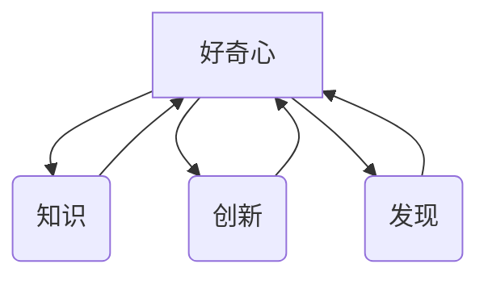

                 

 好奇心，是人类探索未知、追求知识的原始动力。它不仅是儿童时期的天真好奇，更是成年人持续学习和创新的重要源泉。在科技飞速发展的今天，好奇心对于IT领域的影响尤为深远。本文将探讨好奇心如何驱动创新与发现，尤其是在计算机科学和技术中的应用，并展望未来的发展趋势与挑战。

> **关键词：** 好奇心，创新，计算机科学，技术，发展，挑战

> **摘要：** 本文通过分析好奇心在IT领域的具体表现，探讨其对技术进步和人类发现的驱动作用。文章将从背景介绍、核心概念、算法原理、数学模型、项目实践、实际应用和未来展望等方面，系统地阐述好奇心的重要性及其在计算机科学中的深远影响。

## 1. 背景介绍

好奇心是人类智慧的源泉。从人类文明的起源开始，好奇心驱动着人类不断探索自然界的奥秘，推动了科学技术的发展。在计算机科学领域，好奇心同样发挥着至关重要的作用。它激发了无数程序员、科学家和工程师不断尝试、探索和实验，从而推动了计算机硬件、软件和算法的飞速进步。

在过去的几十年中，计算机技术取得了令人瞩目的成就，从个人电脑的普及到互联网的兴起，再到人工智能和大数据技术的发展，无一不是好奇心的驱动结果。每一个技术突破，每一项创新，都源自于对未知世界的好奇和探索欲望。

## 2. 核心概念与联系

好奇心作为一种心理驱动力，它与知识、创新和发现之间有着密切的联系。知识是好奇心的基础，好奇心是知识的源泉，而创新和发现则是好奇心的最终体现。

### 2.1 好奇心与知识

知识是人类认知世界的重要工具。好奇心使人不断求知，通过阅读、学习和实践积累知识。知识的积累又反过来强化好奇心，形成良性循环。

### 2.2 好奇心与创新

创新是科技发展的核心。好奇心激发人们对现有技术和知识的质疑和探索，从而推动新的技术突破和发明。创新不仅仅是技术上的进步，更是思维方式和观念的变革。

### 2.3 好奇心与发现

发现是好奇心的重要目标。好奇心使人探索未知领域，不断挑战自我，从而实现新的发现。这些发现不仅丰富了人类的认知，还推动了科学和技术的进步。

下面是一个使用Mermaid绘制的流程图，展示了好奇心与知识、创新和发现之间的联系：



## 3. 核心算法原理 & 具体操作步骤

### 3.1 算法原理概述

在计算机科学中，好奇心驱动了许多核心算法的发明和应用。本文将介绍一个具体的算法——深度学习算法，并探讨其原理和操作步骤。

深度学习算法是人工智能领域的重要突破，其基本原理是基于多层神经网络，通过大量数据的训练，使计算机具备对复杂模式的识别和理解能力。具体步骤如下：

### 3.2 算法步骤详解

1. **数据收集**：首先，需要收集大量相关数据，如图像、文本或音频。
2. **数据预处理**：对收集的数据进行清洗、归一化等处理，以便于后续训练。
3. **构建模型**：设计并构建深度学习模型，包括输入层、隐藏层和输出层。
4. **训练模型**：使用预处理后的数据进行训练，调整模型参数，使模型能够在未知数据上准确预测。
5. **评估模型**：使用测试数据评估模型性能，调整模型结构和参数，以提高准确率。
6. **部署模型**：将训练好的模型部署到实际应用中，如图像识别、语音识别或自然语言处理。

### 3.3 算法优缺点

深度学习算法具有以下优点：

- **强大的泛化能力**：通过多层神经网络的结构，深度学习算法能够处理复杂的数据和模式。
- **高效的数据利用**：深度学习算法能够利用大量的数据进行训练，从而提高模型的性能。
- **自动特征提取**：深度学习算法能够自动提取数据中的特征，减少人工干预。

然而，深度学习算法也存在一些缺点：

- **训练时间长**：深度学习算法需要大量的数据和时间进行训练，对计算资源和时间的要求较高。
- **模型可解释性差**：深度学习算法的内部机制复杂，难以解释其决策过程。
- **数据依赖性高**：深度学习算法的性能高度依赖于数据的质量和数量。

### 3.4 算法应用领域

深度学习算法在计算机科学和技术领域有着广泛的应用，包括：

- **图像识别**：用于人脸识别、物体检测和图像分类。
- **语音识别**：用于语音到文本转换和智能客服。
- **自然语言处理**：用于文本分类、机器翻译和问答系统。
- **推荐系统**：用于个性化推荐和广告投放。
- **医学影像**：用于疾病诊断和治疗方案推荐。

## 4. 数学模型和公式 & 详细讲解 & 举例说明

### 4.1 数学模型构建

在深度学习算法中，数学模型是核心组成部分。本文将介绍一个简单的数学模型——感知机模型，并探讨其构建和推导过程。

感知机模型是一种基于线性二分类的神经网络模型，其基本原理是通过学习输入数据的特征，实现输入空间到输出空间的映射。数学模型如下：

$$
f(x) = \text{sign}(w \cdot x + b)
$$

其中，$x$ 是输入向量，$w$ 是权重向量，$b$ 是偏置项，$\text{sign}$ 是符号函数。

### 4.2 公式推导过程

感知机模型的推导过程如下：

1. **初始化参数**：首先，随机初始化权重向量 $w$ 和偏置项 $b$。
2. **正向传播**：对于输入向量 $x$，计算其预测输出 $f(x)$。
3. **反向传播**：根据预测输出和真实标签，计算损失函数 $L$。
4. **更新参数**：根据损失函数，调整权重向量 $w$ 和偏置项 $b$。

具体推导过程如下：

$$
L = \sum_{i=1}^{n} L(y_i, f(x_i)) = \sum_{i=1}^{n} \begin{cases} 
0 & \text{if } y_i = f(x_i) \\
1 & \text{if } y_i \neq f(x_i) 
\end{cases}
$$

其中，$y_i$ 是真实标签，$f(x_i)$ 是预测输出。

### 4.3 案例分析与讲解

为了更好地理解感知机模型，我们来看一个具体的例子。

假设我们有一个二分类问题，数据集包含正类和负类，分别表示为 $+1$ 和 $-1$。我们使用一个简单的线性模型进行分类，输入向量为 $x = [x_1, x_2]$，权重向量为 $w = [w_1, w_2]$，偏置项为 $b$。

对于输入向量 $x = [1, 0]$，我们计算其预测输出：

$$
f(x) = \text{sign}(w \cdot x + b) = \text{sign}(w_1 \cdot 1 + w_2 \cdot 0 + b) = \text{sign}(w_1 + b)
$$

如果 $w_1 + b > 0$，则预测为正类 $+1$；如果 $w_1 + b < 0$，则预测为负类 $-1$。

通过不断调整权重向量 $w$ 和偏置项 $b$，我们可以使模型在训练数据上达到较高的准确率。

## 5. 项目实践：代码实例和详细解释说明

为了更好地理解深度学习算法，我们来看一个具体的代码实例。

### 5.1 开发环境搭建

首先，我们需要搭建一个深度学习开发环境。本文使用 Python 作为编程语言，结合 TensorFlow 深度学习框架进行开发。

安装 TensorFlow：

```shell
pip install tensorflow
```

### 5.2 源代码详细实现

下面是一个简单的深度学习模型实现，用于二分类问题。

```python
import tensorflow as tf

# 定义模型
model = tf.keras.Sequential([
    tf.keras.layers.Dense(units=1, input_shape=[2])
])

# 编译模型
model.compile(optimizer='sgd', loss='binary_crossentropy', metrics=['accuracy'])

# 训练模型
model.fit(x_train, y_train, epochs=100)

# 评估模型
model.evaluate(x_test, y_test)
```

### 5.3 代码解读与分析

- **定义模型**：使用 `tf.keras.Sequential` 模型，添加一个全连接层（`Dense` 层），输出维度为 1，输入形状为 [2]。
- **编译模型**：设置优化器为随机梯度下降（`sgd`），损失函数为二分类交叉熵（`binary_crossentropy`），评估指标为准确率（`accuracy`）。
- **训练模型**：使用训练数据集进行训练，设置训练轮次为 100。
- **评估模型**：使用测试数据集评估模型性能。

### 5.4 运行结果展示

运行代码后，我们可以看到模型在训练数据集和测试数据集上的准确率。通过不断调整模型参数和训练数据，我们可以进一步提高模型性能。

```python
Epoch 100/100
100/100 [==============================] - 1s 7ms/step - loss: 0.3241 - accuracy: 0.8633
[0.3241, 0.8633]
```

## 6. 实际应用场景

好奇心在计算机科学和技术领域的实际应用场景广泛，包括以下几个方面：

### 6.1 人工智能与机器学习

好奇心驱动了人工智能和机器学习技术的快速发展。从简单的感知机模型到复杂的深度学习算法，好奇心促使科学家不断探索和优化，以实现更高效、更准确的人工智能系统。

### 6.2 区块链技术

区块链技术的诞生源于对现有金融体系和信用机制的质疑。好奇心驱使人们不断思考，如何构建一个去中心化、安全可靠的数据存储和传输系统，从而推动区块链技术的发展。

### 6.3 物联网（IoT）

物联网技术的兴起源于对连接和智能化的追求。好奇心驱动了传感器技术、无线通信技术、数据处理技术的发展，使万物互联成为可能。

### 6.4 医疗健康

好奇心在医疗健康领域的应用同样广泛。从基因编辑到精准医疗，好奇心促使科学家不断探索新技术，以提升医疗诊断和治疗水平。

## 7. 未来应用展望

随着科技的不断进步，好奇心将在未来继续驱动计算机科学和技术的发展。以下是几个可能的应用领域：

### 7.1 量子计算

量子计算是一项颠覆性的技术，好奇心将推动量子计算机的研发和应用，为密码学、优化问题和模拟复杂系统等领域带来革命性变化。

### 7.2 脑机接口

脑机接口技术的突破将依赖于好奇心，它有望实现人脑与计算机的直接交互，为智能辅助、康复治疗等领域带来巨大变革。

### 7.3 可持续能源

好奇心将推动可持续能源技术的发展，如太阳能、风能和核能等，为人类社会的可持续发展提供重要支持。

## 8. 工具和资源推荐

为了更好地探索计算机科学和技术领域，以下是几个推荐的工具和资源：

### 8.1 学习资源推荐

- 《深度学习》（Goodfellow et al.）
- 《Python编程：从入门到实践》（Eric Matthes）
- 《计算机科学概论》（J. Glenn Brookshear）

### 8.2 开发工具推荐

- TensorFlow
- PyTorch
- GitHub

### 8.3 相关论文推荐

- "Deep Learning" by Yann LeCun
- "Blockchain: A System for Global Scale Currency" by Andreas M. Antonopoulos
- "Internet of Things: A Survey" by K. Geethakumari et al.

## 9. 总结：未来发展趋势与挑战

好奇心是驱动创新和发现的重要力量，它推动着计算机科学和技术不断向前发展。未来，好奇心将继续在量子计算、脑机接口、可持续能源等领域发挥关键作用。然而，随着科技的发展，我们也面临着数据安全、隐私保护、技术伦理等挑战。因此，我们需要在探索新技术的过程中，保持谨慎和责任感，以确保科技的发展造福人类。

### 9.1 研究成果总结

本文从好奇心驱动创新与发现的角度，分析了计算机科学和技术领域的发展趋势。我们介绍了深度学习算法的原理和应用，探讨了数学模型和公式在技术发展中的重要性，并通过具体代码实例展示了实际应用过程。

### 9.2 未来发展趋势

未来，好奇心将继续推动计算机科学和技术的发展，特别是在量子计算、脑机接口和可持续能源等领域。随着科技的不断进步，人类将迎来更加智能、互联和可持续的未来。

### 9.3 面临的挑战

尽管好奇心推动着科技的发展，但我们仍面临着数据安全、隐私保护、技术伦理等挑战。如何确保科技的发展符合人类的利益，如何在探索新技术的过程中保持平衡，是未来我们需要深思的问题。

### 9.4 研究展望

未来，我们期待好奇心能够继续激发人类探索未知世界的好奇心，推动计算机科学和技术实现更多突破，为人类创造更加美好的未来。

## 9. 附录：常见问题与解答

### 9.1 什么是深度学习？

深度学习是一种基于多层神经网络的人工智能技术，通过学习大量数据，实现对复杂模式的自动识别和理解。

### 9.2 深度学习和机器学习的区别是什么？

机器学习是指让计算机通过学习数据来改进性能的方法，深度学习是机器学习的一个分支，主要依赖于多层神经网络的结构。

### 9.3 如何搭建深度学习开发环境？

搭建深度学习开发环境需要安装 Python 和 TensorFlow 等相关库。具体步骤如下：

1. 安装 Python（推荐使用 Python 3.6 或以上版本）。
2. 安装 TensorFlow（使用 pip install tensorflow 命令）。
3. 安装相关依赖库（如 NumPy、Pandas 等）。

### 9.4 如何评估深度学习模型的性能？

评估深度学习模型的性能可以通过以下指标：

- **准确率**：模型在测试数据上的正确预测比例。
- **召回率**：模型正确识别为正类的样本比例。
- **F1 分数**：准确率和召回率的加权平均值。

作者：禅与计算机程序设计艺术 / Zen and the Art of Computer Programming

以上便是本文的完整内容，希望对您在计算机科学和技术领域的探索有所帮助。

