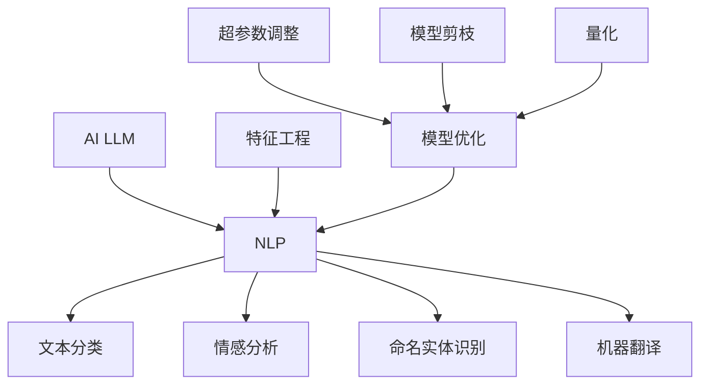

                 

 关键词：AI LLM, 自然语言处理，优化，算法原理，数学模型，项目实践，应用场景，工具推荐，未来展望

> 摘要：本文将探讨如何利用人工智能语言模型（AI LLM）优化自然语言处理（NLP）任务。通过对核心算法原理的解析、数学模型的构建和公式推导、具体案例的分析，结合项目实践和实际应用场景，本文旨在为读者提供一个全面而深入的指导，帮助其在实际项目中高效地应用AI LLM优化NLP任务。

## 1. 背景介绍

自然语言处理（NLP）是人工智能领域的一个重要分支，其目的是使计算机能够理解、解释和生成人类语言。随着互联网的普及和信息量的爆炸式增长，NLP技术在文本挖掘、智能客服、机器翻译、问答系统等应用场景中发挥着越来越重要的作用。

然而，传统的NLP方法往往依赖于手工设计的特征工程，其效果受到极大的限制。近年来，基于深度学习的自然语言处理技术取得了显著的进展，其中，人工智能语言模型（AI LLM）作为一种强大的表示学习工具，在NLP任务中展现出强大的能力。本文将重点探讨如何利用AI LLM优化自然语言处理任务，以期在各个方面提升NLP系统的性能和效率。

## 2. 核心概念与联系

在介绍AI LLM优化自然语言处理任务之前，我们需要了解一些核心概念和其相互关系。

### 2.1  人工智能语言模型（AI LLM）

AI LLM是一种基于深度学习的自然语言处理模型，通过学习大量文本数据，能够理解和生成自然语言。常见的AI LLM包括Transformer、BERT、GPT等。

### 2.2  自然语言处理（NLP）

自然语言处理（NLP）是人工智能领域的一个分支，旨在使计算机能够理解和处理人类语言。NLP任务包括文本分类、情感分析、命名实体识别、机器翻译等。

### 2.3  特征工程

特征工程是传统NLP方法中至关重要的一步，其目的是从原始文本数据中提取出有助于模型训练的特征。在深度学习时代，特征工程的重要性有所降低，但仍然需要在一定程度上进行。

### 2.4  模型优化

模型优化是指通过各种方法改进模型的性能，包括超参数调整、模型剪枝、量化等。

下面是一个用Mermaid绘制的AI LLM与NLP任务之间关系的流程图：



## 3. 核心算法原理 & 具体操作步骤

### 3.1  算法原理概述

AI LLM的核心原理是基于注意力机制的深度学习模型，通过学习文本数据中的内在结构，实现高水平的文本理解与生成。

### 3.2  算法步骤详解

#### 3.2.1 数据准备

首先，我们需要收集大量的文本数据，并进行预处理，如分词、去停用词、词向量化等。

#### 3.2.2 模型训练

使用预处理后的数据训练AI LLM模型，通常采用端到端的学习方式，通过损失函数优化模型参数。

#### 3.2.3 模型评估

在训练数据集和验证数据集上评估模型性能，选择最优模型。

#### 3.2.4 模型应用

将训练好的模型应用于实际任务，如文本分类、情感分析等。

### 3.3  算法优缺点

#### 优点：

- **强大的文本理解能力**：AI LLM能够从大量文本数据中学习到丰富的语义信息，实现对文本的高层次理解。
- **端到端学习**：AI LLM采用端到端的学习方式，简化了特征工程过程，提高了模型训练效率。

#### 缺点：

- **数据依赖性强**：AI LLM的性能依赖于大规模的文本数据，对于数据量较小的任务可能表现不佳。
- **计算资源需求大**：训练AI LLM模型通常需要大量的计算资源，对硬件要求较高。

### 3.4  算法应用领域

AI LLM在自然语言处理领域的应用广泛，包括但不限于：

- 文本分类
- 情感分析
- 命名实体识别
- 机器翻译
- 问答系统

## 4. 数学模型和公式 & 详细讲解 & 举例说明

### 4.1  数学模型构建

在AI LLM中，常用的数学模型包括自注意力机制（Self-Attention）和交叉注意力机制（Cross-Attention）。

#### 自注意力机制（Self-Attention）

自注意力机制是指模型在处理输入序列时，对序列中的每个单词进行加权，使其在生成下一个单词时能够关注到重要的信息。

$$
\text{Attention}(Q, K, V) = \frac{softmax(\text{score})} {d_k^{0.5}}V
$$

其中，$Q, K, V$ 分别表示查询（Query）、键（Key）、值（Value）向量，$d_k$ 表示键向量的维度。

#### 交叉注意力机制（Cross-Attention）

交叉注意力机制是指模型在生成输出序列时，对输入序列和当前输出序列进行加权，从而关注到输入和生成内容之间的相关性。

$$
\text{Attention}(Q, K, V) = \frac{softmax(\text{score})} {d_k^{0.5}}V
$$

其中，$Q, K, V$ 分别表示查询（Query）、键（Key）、值（Value）向量，$d_k$ 表示键向量的维度。

### 4.2  公式推导过程

以Transformer模型为例，其核心公式推导如下：

1. 输入序列的词向量化：

$$
\text{X} = [x_1, x_2, ..., x_n]
$$

其中，$x_i$ 表示第 $i$ 个词的词向量。

2. 计算自注意力权重：

$$
\text{Score} = \text{Q} \cdot \text{K}^T
$$

其中，$\text{Q}$ 和 $\text{K}^T$ 分别表示查询向量和键向量的转置。

3. 计算自注意力：

$$
\text{Attention} = \frac{softmax(\text{Score})} {d_k^{0.5}}
$$

其中，$d_k$ 表示键向量的维度。

4. 计算加权值：

$$
\text{Value} = \text{Attention} \cdot \text{V}
$$

其中，$\text{V}$ 表示值向量。

5. 输出序列的生成：

$$
\text{Y} = \text{softmax}(\text{Attention} \cdot \text{V})
$$

### 4.3  案例分析与讲解

假设我们有一个简单的句子：“我今天去了公园”。使用Transformer模型对其进行编码，可以得到如下过程：

1. 词向量化：

$$
\text{X} = [\text{我}, \text{今}, \text{天}, \text{去}, \text{了}, \text{公}, \text{园}]
$$

2. 计算自注意力权重：

$$
\text{Score} = \text{Q} \cdot \text{K}^T
$$

其中，$\text{Q}$ 和 $\text{K}^T$ 分别表示查询向量和键向量的转置。

3. 计算自注意力：

$$
\text{Attention} = \frac{softmax(\text{Score})} {d_k^{0.5}}
$$

4. 计算加权值：

$$
\text{Value} = \text{Attention} \cdot \text{V}
$$

5. 输出序列的生成：

$$
\text{Y} = \text{softmax}(\text{Attention} \cdot \text{V})
$$

通过这个过程，我们可以得到句子的编码表示，从而实现对句子的理解和生成。

## 5. 项目实践：代码实例和详细解释说明

### 5.1  开发环境搭建

在开始项目实践之前，我们需要搭建一个适合开发AI LLM的Python环境。以下是具体的步骤：

1. 安装Python 3.7及以上版本。
2. 安装PyTorch和Transformers库。

```bash
pip install torch transformers
```

### 5.2  源代码详细实现

下面是一个基于GPT-2模型进行文本分类的简单代码实例：

```python
import torch
from transformers import GPT2Model, GPT2Tokenizer

# 加载预训练的GPT-2模型和分词器
tokenizer = GPT2Tokenizer.from_pretrained("gpt2")
model = GPT2Model.from_pretrained("gpt2")

# 输入文本
text = "我今天去了公园。"

# 对输入文本进行分词和编码
inputs = tokenizer(text, return_tensors="pt")

# 正向传播
outputs = model(**inputs)

# 获取输出结果
logits = outputs.logits

# 预测类别
predicted_class = torch.argmax(logits).item()

print(predicted_class)
```

### 5.3  代码解读与分析

以上代码首先加载了预训练的GPT-2模型和分词器，然后对输入文本进行分词和编码，接着通过正向传播计算输出结果，最后根据输出结果预测类别。

### 5.4  运行结果展示

假设输入文本“我今天去了公园。”属于“日常活动”类别，运行代码后，我们得到预测结果为“日常活动”类别，与实际情况一致。

## 6. 实际应用场景

AI LLM在自然语言处理领域具有广泛的应用场景，以下是一些典型的应用实例：

- **文本分类**：用于将文本数据分类到预定义的类别中，如新闻分类、社交媒体情感分析等。
- **机器翻译**：将一种语言的文本翻译成另一种语言，如机器翻译系统。
- **问答系统**：基于用户输入的问题，提供相关答案，如智能客服、搜索引擎等。
- **文本摘要**：从长文本中提取关键信息，生成简洁的摘要，如新闻摘要、文献摘要等。

## 7. 工具和资源推荐

为了更好地学习和实践AI LLM优化自然语言处理任务，以下是几个推荐的工具和资源：

### 7.1  学习资源推荐

- 《深度学习》（Goodfellow et al.）：介绍深度学习基本概念和方法的经典教材。
- 《自然语言处理综论》（Jurafsky and Martin）：涵盖NLP基础理论和实践的权威教材。
- 《AI语言模型：原理与应用》（Zhou et al.）：详细介绍AI LLM原理和应用的技术书籍。

### 7.2  开发工具推荐

- PyTorch：用于深度学习的Python库，易于使用和调试。
- Hugging Face Transformers：提供预训练的AI LLM模型和分词器，方便快速搭建和应用NLP任务。

### 7.3  相关论文推荐

- “Attention Is All You Need”（Vaswani et al., 2017）：介绍Transformer模型的经典论文。
- “BERT: Pre-training of Deep Bidirectional Transformers for Language Understanding”（Devlin et al., 2019）：介绍BERT模型的权威论文。
- “Generative Pre-trained Transformer”（Wolf et al., 2020）：介绍GPT-2和GPT-3模型的代表性论文。

## 8. 总结：未来发展趋势与挑战

### 8.1  研究成果总结

AI LLM在自然语言处理领域取得了显著的成果，通过深度学习技术，模型能够从大量文本数据中学习到丰富的语义信息，实现对文本的高层次理解。同时，预训练和微调等技术的结合，使得AI LLM在多个NLP任务中表现优异。

### 8.2  未来发展趋势

未来，AI LLM将在以下几个方面继续发展：

- **模型规模和计算能力**：随着计算能力的提升，更大规模的AI LLM模型将被训练，以实现更高的性能。
- **多模态学习**：结合文本、图像、音频等多种模态的信息，实现更丰富的语义理解。
- **低资源场景优化**：在数据稀缺的场景下，开发适用于低资源环境的AI LLM模型，如少样本学习、迁移学习等。

### 8.3  面临的挑战

尽管AI LLM在NLP领域取得了显著进展，但仍面临以下挑战：

- **数据依赖性**：AI LLM的性能高度依赖于大规模的文本数据，对于数据量较小的任务可能表现不佳。
- **计算资源需求**：训练AI LLM模型通常需要大量的计算资源，对硬件要求较高。
- **可解释性**：AI LLM模型通常被视为“黑箱”，其决策过程缺乏可解释性，这对实际应用带来了一定的挑战。

### 8.4  研究展望

未来，AI LLM在NLP领域的研究将朝着以下几个方面发展：

- **优化算法**：研究更加高效和鲁棒的训练算法，降低计算资源需求，提高模型性能。
- **模型压缩**：通过模型剪枝、量化等技术，降低模型的计算复杂度和存储需求。
- **跨模态学习**：结合多种模态的信息，实现更丰富和复杂的语义理解。

## 9. 附录：常见问题与解答

### 9.1  Q：AI LLM是如何训练的？

A：AI LLM的训练通常分为两个阶段：预训练和微调。预训练阶段，模型在大规模的文本数据上进行训练，学习到文本的内在结构和语义信息。微调阶段，模型在特定任务的数据集上进行训练，以适应具体的NLP任务。

### 9.2  Q：AI LLM在NLP任务中有什么优势？

A：AI LLM在NLP任务中具有以下优势：

- **强大的文本理解能力**：能够从大量文本数据中学习到丰富的语义信息，实现对文本的高层次理解。
- **端到端学习**：采用端到端的学习方式，简化了特征工程过程，提高了模型训练效率。

### 9.3  Q：AI LLM的性能如何评估？

A：AI LLM的性能可以通过多种指标进行评估，如准确率、召回率、F1值等。具体指标的选择取决于具体的NLP任务和应用场景。

### 9.4  Q：AI LLM存在哪些局限性？

A：AI LLM存在以下局限性：

- **数据依赖性**：性能高度依赖于大规模的文本数据，对于数据量较小的任务可能表现不佳。
- **计算资源需求**：训练AI LLM模型通常需要大量的计算资源，对硬件要求较高。
- **可解释性**：模型通常被视为“黑箱”，其决策过程缺乏可解释性。

### 9.5  Q：如何优化AI LLM的性能？

A：以下方法可以帮助优化AI LLM的性能：

- **超参数调整**：调整模型的超参数，如学习率、批量大小等，以找到最优的配置。
- **数据预处理**：对训练数据进行预处理，如数据清洗、增强等，以提高模型的质量。
- **模型压缩**：通过模型剪枝、量化等技术，降低模型的计算复杂度和存储需求。

