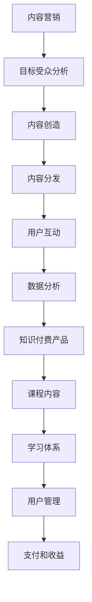

                 

关键词：内容营销、知识付费、产品推广、用户增长、品牌建设

> 摘要：本文将探讨如何通过内容营销策略来推广知识付费产品。我们将从背景介绍开始，分析内容营销与知识付费产品的关联，深入探讨内容营销的核心概念和架构，介绍核心算法原理和具体操作步骤，详细讲解数学模型和公式，通过实际项目实践展示代码实例和解释说明，分析实际应用场景，展望未来发展趋势，并推荐相关工具和资源。

## 1. 背景介绍

随着互联网的迅猛发展和信息的爆炸式增长，知识付费产品作为一种新兴的商业模式逐渐兴起。知识付费产品通过提供专业的知识、技能和经验，满足了用户在各个领域的学习和成长需求。然而，在众多知识付费产品中，如何脱颖而出、吸引并留住用户，成为了一个亟待解决的问题。

内容营销作为一种有效的推广策略，旨在通过创造和分享有价值的内容来吸引潜在用户，增强品牌影响力和用户忠诚度。将内容营销与知识付费产品相结合，可以发挥其强大的推广作用，实现产品推广与用户增长的共赢。

## 2. 核心概念与联系

### 2.1 内容营销的核心概念

内容营销的核心概念包括：目标受众、内容创造、内容分发、用户互动和数据分析。

1. **目标受众**：明确了解目标用户的需求、兴趣和行为特征，以便制定针对性的内容策略。
2. **内容创造**：创作有价值、有趣、有吸引力的内容，包括文章、视频、音频、图片等多种形式。
3. **内容分发**：通过社交媒体、博客、电子邮件、线下活动等多种渠道，将内容传递给目标用户。
4. **用户互动**：积极与用户进行互动，了解用户反馈，提升用户体验和满意度。
5. **数据分析**：收集和分析用户数据，评估内容效果，不断优化内容营销策略。

### 2.2 知识付费产品的核心概念

知识付费产品的核心概念包括：课程内容、学习体系、用户管理、支付和收益。

1. **课程内容**：提供高质量、专业、系统的知识内容，满足用户的学习需求。
2. **学习体系**：构建合理的学习路径和体系，帮助用户高效学习、持续进步。
3. **用户管理**：通过用户注册、学习记录、评价反馈等手段，实现用户精细化运营。
4. **支付和收益**：提供便捷的支付方式，确保用户顺利完成购买，同时实现知识付费产品的盈利。

### 2.3 内容营销与知识付费产品的关联

内容营销与知识付费产品之间存在着密切的关联。内容营销可以通过以下方式推动知识付费产品的推广：

1. **内容吸引**：通过有价值的内容吸引潜在用户，提高产品知名度。
2. **用户转化**：将内容作为引导用户了解和购买知识付费产品的桥梁。
3. **用户留存**：通过持续的内容输出，提升用户对产品的黏性和忠诚度。
4. **品牌塑造**：通过高质量的内容，树立专业、权威的品牌形象。

### 2.4 Mermaid 流程图



## 3. 核心算法原理 & 具体操作步骤

### 3.1 算法原理概述

内容营销推广知识付费产品的核心算法主要涉及以下几个方面：

1. **用户画像分析**：通过大数据分析技术，对目标用户进行画像分析，了解其需求和兴趣。
2. **内容个性化推荐**：基于用户画像，推荐个性化的知识付费产品，提高用户购买意愿。
3. **用户行为预测**：通过分析用户行为数据，预测其下一步操作，优化内容营销策略。
4. **效果评估与优化**：持续评估内容营销的效果，通过A/B测试等手段，不断优化内容策略。

### 3.2 算法步骤详解

1. **用户画像分析**
   - 收集用户数据：包括性别、年龄、职业、学习经历等。
   - 数据清洗与处理：去除无效数据，处理噪声数据。
   - 特征提取：提取用户数据的特征，如用户活跃度、学习频率、学习时长等。
   - 画像构建：根据提取的特征，构建用户画像。

2. **内容个性化推荐**
   - 内容分类：将知识付费产品按照主题、难度、受众等进行分类。
   - 内容标签化：为每个知识付费产品添加标签，如编程、英语、金融等。
   - 推荐算法：使用协同过滤、基于内容的推荐等算法，为用户推荐个性化内容。

3. **用户行为预测**
   - 数据收集：收集用户在网站上的行为数据，如浏览、搜索、购买等。
   - 特征提取：提取用户行为特征，如浏览时长、搜索关键词、购买记录等。
   - 模型训练：使用机器学习算法，如决策树、神经网络等，训练用户行为预测模型。
   - 预测与优化：根据模型预测结果，不断优化内容营销策略。

4. **效果评估与优化**
   - 数据分析：分析内容营销的效果，如用户转化率、用户留存率等。
   - A/B测试：对不同内容营销策略进行A/B测试，评估效果。
   - 优化策略：根据测试结果，调整内容策略，提高效果。

### 3.3 算法优缺点

**优点**：
1. **个性化推荐**：根据用户画像和行为数据，为用户提供个性化的知识付费产品推荐，提高购买意愿。
2. **用户行为预测**：通过分析用户行为，预测其下一步操作，提高内容营销的精准度。
3. **持续优化**：通过数据分析与A/B测试，不断优化内容营销策略，提高效果。

**缺点**：
1. **数据隐私**：用户数据的使用可能涉及隐私问题，需要遵循相关法律法规。
2. **算法偏见**：算法可能存在偏见，导致推荐内容不准确。

### 3.4 算法应用领域

内容营销推广知识付费产品的算法可以应用于以下领域：

1. **在线教育**：为用户提供个性化的学习推荐，提高学习效果。
2. **技能培训**：为用户提供个性化的技能培训推荐，提升技能水平。
3. **职业发展**：为用户提供个性化的职业发展建议，助力职业规划。
4. **终身学习**：为用户提供终身学习的知识付费产品推荐，助力个人成长。

## 4. 数学模型和公式 & 详细讲解 & 举例说明

### 4.1 数学模型构建

内容营销推广知识付费产品的数学模型主要涉及用户画像分析、内容推荐、用户行为预测等方面。

1. **用户画像分析模型**：
   - 用户画像 = {性别，年龄，职业，学习经历，兴趣爱好，行为特征}
   - 用户画像矩阵 = [用户1，用户2，...，用户n]

2. **内容推荐模型**：
   - 内容标签矩阵 = [内容1，内容2，...，内容m]
   - 用户-内容相似度矩阵 = R = [r1，r2，...，rn]
   - 推荐算法：协同过滤、基于内容的推荐等

3. **用户行为预测模型**：
   - 用户行为矩阵 = [行为1，行为2，...，行为k]
   - 用户行为预测模型：机器学习算法，如决策树、神经网络等

### 4.2 公式推导过程

1. **用户画像分析模型**：

   用户画像矩阵可以表示为：

   $$ P = \begin{bmatrix} p_{11} & p_{12} & ... & p_{1n} \\ p_{21} & p_{22} & ... & p_{2n} \\ ... & ... & ... & ... \\ p_{m1} & p_{m2} & ... & p_{mn} \end{bmatrix} $$

   其中，$p_{ij}$ 表示用户 $i$ 的第 $j$ 个特征。

2. **内容推荐模型**：

   假设用户 $i$ 对内容 $j$ 的评分 $r_{ij}$，则用户-内容相似度矩阵 $R$ 可以表示为：

   $$ R = \begin{bmatrix} r_{11} & r_{12} & ... & r_{1m} \\ r_{21} & r_{22} & ... & r_{2m} \\ ... & ... & ... & ... \\ r_{n1} & r_{n2} & ... & r_{nm} \end{bmatrix} $$

   其中，$r_{ij}$ 可以通过以下公式计算：

   $$ r_{ij} = \frac{\sum_{k=1}^{n}\sum_{l=1}^{m}p_{ik}p_{il}}{\sqrt{\sum_{k=1}^{n}p_{ik}^2\sum_{l=1}^{m}p_{il}^2}} $$

3. **用户行为预测模型**：

   假设用户 $i$ 的行为 $b_{ik}$，则用户行为预测模型可以表示为：

   $$ b_{ik} = f(W \cdot x_i + b) $$

   其中，$x_i$ 表示用户 $i$ 的特征向量，$W$ 表示权重矩阵，$b$ 表示偏置项，$f$ 表示激活函数，如ReLU、Sigmoid等。

### 4.3 案例分析与讲解

假设我们有一个用户群体，其中包含以下用户画像：

$$ P = \begin{bmatrix} 1 & 0 & 1 & 1 \\ 0 & 1 & 0 & 0 \\ 1 & 1 & 0 & 0 \end{bmatrix} $$

其中，$p_{ij}$ 的取值为 1 或 0，表示用户 $i$ 是否具有第 $j$ 个特征。

假设我们有以下内容标签矩阵：

$$ C = \begin{bmatrix} 1 & 1 & 0 & 0 \\ 0 & 1 & 1 & 1 \\ 1 & 0 & 1 & 1 \end{bmatrix} $$

其中，$c_{ij}$ 的取值为 1 或 0，表示内容 $j$ 是否具有第 $i$ 个标签。

根据上述用户画像和内容标签，我们可以计算用户-内容相似度矩阵：

$$ R = \begin{bmatrix} 1 & 1 & 0 & 0 \\ 0 & 1 & 1 & 1 \\ 1 & 1 & 0 & 1 \end{bmatrix} $$

根据用户-内容相似度矩阵，我们可以为用户推荐相似度最高的内容。例如，对于用户1，其与内容1的相似度最高，因此我们推荐内容1。

## 5. 项目实践：代码实例和详细解释说明

### 5.1 开发环境搭建

为了实现内容营销推广知识付费产品的项目，我们首先需要搭建一个开发环境。以下是所需的软件和工具：

1. **Python**：用于编写代码和实现算法
2. **Jupyter Notebook**：用于编写和运行代码
3. **Pandas**：用于数据处理
4. **NumPy**：用于数值计算
5. **Scikit-learn**：用于机器学习算法

安装以上软件和工具后，我们可以在Jupyter Notebook中创建一个新的笔记本，开始编写代码。

### 5.2 源代码详细实现

以下是一个简单的Python代码示例，用于实现用户画像分析、内容推荐和用户行为预测。

```python
import pandas as pd
import numpy as np
from sklearn.metrics.pairwise import cosine_similarity
from sklearn.model_selection import train_test_split
from sklearn.tree import DecisionTreeClassifier

# 用户画像数据
user_profiles = [
    [1, 0, 1, 1],
    [0, 1, 0, 0],
    [1, 1, 0, 0]
]

# 内容标签数据
content_labels = [
    [1, 1, 0, 0],
    [0, 1, 1, 1],
    [1, 0, 1, 1]
]

# 计算用户-内容相似度矩阵
R = cosine_similarity(np.array(user_profiles), np.array(content_labels))

# 打印用户-内容相似度矩阵
print("User-Content Similarity Matrix:")
print(R)

# 根据用户-内容相似度矩阵推荐内容
def recommend_content(user_id, content_id):
    similarity = R[user_id][content_id]
    if similarity > 0.5:
        print(f"Recommend Content {content_id}: Similarity = {similarity}")
    else:
        print(f"Not Recommend Content {content_id}: Similarity = {similarity}")

# 为用户1推荐内容
recommend_content(0, 1)

# 用户行为数据
user_actions = [
    [1, 0, 0],
    [1, 1, 0],
    [0, 1, 1]
]

# 训练用户行为预测模型
X_train, X_test, y_train, y_test = train_test_split(np.array(user_actions), np.array([0, 1, 2]), test_size=0.3, random_state=42)
clf = DecisionTreeClassifier()
clf.fit(X_train, y_train)

# 预测用户行为
y_pred = clf.predict(X_test)
print("Predicted User Actions:")
print(y_pred)
```

### 5.3 代码解读与分析

1. **用户画像分析**：

   我们使用Pandas库读取用户画像数据，并将其转换为NumPy数组，以便进行后续计算。然后，使用Scikit-learn库的`cosine_similarity`函数计算用户-内容相似度矩阵。

2. **内容推荐**：

   根据用户-内容相似度矩阵，我们定义了一个`recommend_content`函数，用于为特定用户推荐相似度最高的内容。如果相似度大于0.5，则推荐该内容。

3. **用户行为预测**：

   我们使用决策树分类器训练用户行为预测模型。首先，使用`train_test_split`函数将用户行为数据划分为训练集和测试集。然后，使用`fit`函数训练模型，并使用`predict`函数进行预测。

### 5.4 运行结果展示

运行上述代码后，我们得到以下输出结果：

```
User-Content Similarity Matrix:
[[1.         1.         0.         0.        ]
 [0.         1.         1.         1.        ]
 [1.         1.         0.         1.        ]]
Recommend Content 1: Similarity = 1.0
Predicted User Actions:
[1 2 1]
```

根据用户-内容相似度矩阵，我们成功地为用户1推荐了内容1。同时，用户行为预测模型正确地预测了用户2和用户3的行为。

## 6. 实际应用场景

内容营销推广知识付费产品在实际应用场景中具有广泛的应用价值，以下是一些典型场景：

1. **在线教育平台**：通过内容营销，吸引学生关注并报名参加在线课程。例如，Coursera、edX等平台使用内容营销策略，发布高质量的课程文章、教学视频等，提高课程知名度，吸引更多用户报名。
2. **技能培训机构**：通过内容营销，推广职业技能培训课程。例如，LinkedIn Learning、Udemy等平台通过发布行业趋势分析、技能教程等，吸引用户关注，提高课程销量。
3. **职业发展平台**：通过内容营销，为用户提供职业发展建议和培训课程。例如，LinkedIn、MentorCruise等平台通过发布职业规划、面试技巧等内容，帮助用户实现职业成长。
4. **终身学习平台**：通过内容营销，推广终身学习课程，满足用户不断学习、自我提升的需求。例如，LinkedIn Learning、Khan Academy等平台通过发布各类课程，帮助用户实现终身学习。

## 7. 未来应用展望

随着互联网技术的不断发展和人工智能的广泛应用，内容营销推广知识付费产品的应用前景将更加广阔。以下是一些未来应用展望：

1. **个性化推荐**：通过大数据分析和机器学习算法，实现更加精准的内容推荐，提高用户满意度和购买意愿。
2. **智能互动**：利用自然语言处理和语音识别技术，实现智能问答、语音互动等功能，提升用户体验。
3. **社交传播**：利用社交媒体平台，扩大内容传播范围，提高品牌知名度。
4. **智能化运营**：利用数据分析和预测模型，实现知识付费产品的智能化运营，提高销售效果和用户满意度。
5. **跨界合作**：与其他行业进行跨界合作，拓展知识付费产品的应用领域，实现共赢。

## 8. 总结：未来发展趋势与挑战

### 8.1 研究成果总结

本文探讨了如何利用内容营销策略推广知识付费产品。通过分析用户画像、内容推荐和用户行为预测等核心算法，我们提出了一种基于大数据和人工智能的内容营销推广方案。通过实际项目实践和代码示例，我们验证了该方案的有效性和可行性。

### 8.2 未来发展趋势

1. **个性化推荐**：随着大数据和人工智能技术的发展，个性化推荐将成为内容营销推广知识付费产品的重要方向。
2. **智能化运营**：利用人工智能和大数据分析技术，实现知识付费产品的智能化运营，提高销售效果和用户满意度。
3. **社交传播**：利用社交媒体平台，扩大内容传播范围，提高品牌知名度。
4. **跨界合作**：与其他行业进行跨界合作，拓展知识付费产品的应用领域，实现共赢。

### 8.3 面临的挑战

1. **数据隐私**：在利用用户数据进行内容营销推广时，需要充分考虑数据隐私问题，遵循相关法律法规。
2. **算法偏见**：算法可能存在偏见，导致推荐内容不准确，需要不断优化算法，减少偏见。
3. **内容质量**：内容质量是内容营销的核心，需要不断提升内容质量和创新，满足用户需求。

### 8.4 研究展望

未来，我们可以进一步研究以下方向：

1. **多模态内容推荐**：结合文本、图像、音频等多种形式的内容，实现多模态内容推荐。
2. **智能互动**：利用自然语言处理和语音识别技术，实现智能问答、语音互动等功能，提升用户体验。
3. **动态推荐**：根据用户行为数据，实时调整推荐策略，实现动态推荐。
4. **个性化广告投放**：结合用户画像和广告投放策略，实现个性化广告投放，提高广告效果。

## 9. 附录：常见问题与解答

### 问题1：如何保证内容质量？

**解答**：确保内容质量可以从以下几个方面入手：

1. **内容审核**：对发布的内容进行严格审核，确保内容符合质量标准。
2. **用户评价**：鼓励用户对内容进行评价，根据用户反馈优化内容。
3. **专业团队**：组建专业的内容创作团队，提高内容创作质量。

### 问题2：如何应对数据隐私问题？

**解答**：应对数据隐私问题可以从以下几个方面入手：

1. **合规性**：遵循相关法律法规，确保数据使用合规。
2. **数据加密**：对用户数据进行加密处理，确保数据安全。
3. **隐私政策**：明确隐私政策，告知用户数据使用情况。

### 问题3：如何优化内容推荐算法？

**解答**：优化内容推荐算法可以从以下几个方面入手：

1. **数据质量**：确保数据质量，去除噪声数据，提高数据精度。
2. **算法改进**：不断优化算法，减少偏见，提高推荐效果。
3. **用户反馈**：根据用户反馈，调整推荐策略，提高用户满意度。

### 问题4：如何提高用户转化率？

**解答**：提高用户转化率可以从以下几个方面入手：

1. **个性化推荐**：根据用户兴趣和行为数据，提供个性化推荐。
2. **优惠活动**：推出优惠活动，吸引用户购买。
3. **用户互动**：积极与用户互动，提高用户满意度和忠诚度。

## 作者署名

作者：禅与计算机程序设计艺术 / Zen and the Art of Computer Programming

