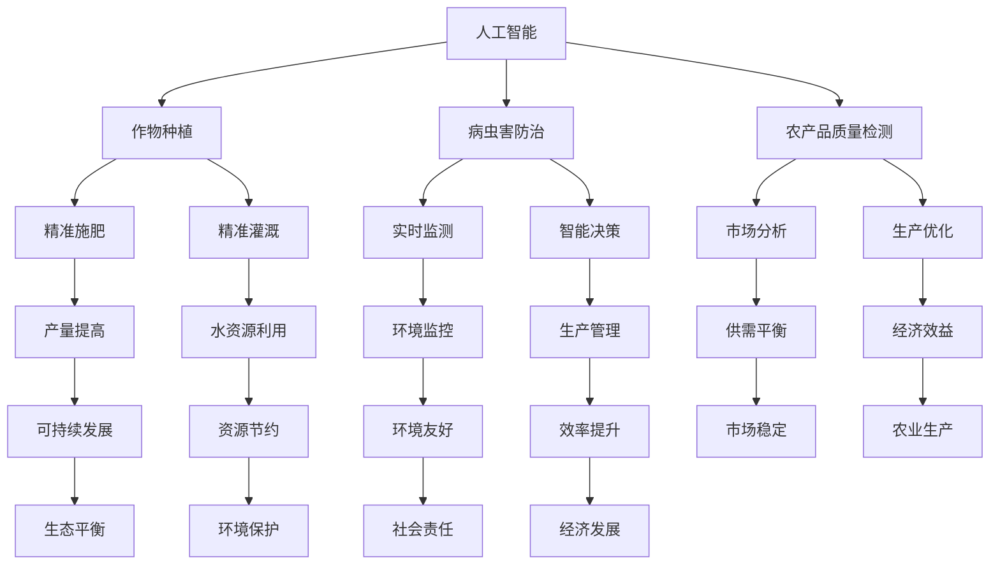

                 

关键词：农业科技，人工智能，物联网，大数据，可持续农业，生物信息学，算法优化。

## 摘要

随着技术的飞速发展，农业科技迎来了前所未有的变革机遇。本文旨在探讨如何利用人工智能、物联网、大数据等技术手段，推动农业科技创新，实现农业的智能化、精准化和可持续发展。通过对核心概念、算法原理、数学模型、项目实践和未来展望的深入分析，本文旨在为农业科技领域的科研人员和实践者提供有价值的参考和指导。

## 1. 背景介绍

### 1.1 农业现状

农业是人类生存的基础，然而，随着全球人口的不断增长，农业面临的挑战日益严峻。传统农业模式依赖于大量的人力和资源，生产效率低下，难以满足日益增长的食物需求。此外，气候变化、土地退化、水资源短缺等问题也对农业产生了深远影响。因此，科技创新成为提升农业生产力、保障粮食安全和实现可持续发展的关键。

### 1.2 技术变革

近年来，人工智能、物联网、大数据等前沿技术的快速发展，为农业科技的创新提供了新的机遇。例如，人工智能可以用于精准农业，通过分析土壤、气候、作物生长等数据，实现精准施肥、灌溉和病虫害防治；物联网技术可以实时监测农田环境，提高农业生产管理的效率；大数据分析可以帮助农民更好地了解市场动态，优化种植和养殖策略。这些技术的综合应用，有望推动农业实现智能化、精准化和可持续发展。

## 2. 核心概念与联系

### 2.1 人工智能与农业

人工智能（AI）是模拟人类智能行为的计算机系统，通过机器学习、深度学习等技术，使计算机具备自主学习和决策能力。在农业领域，人工智能可以应用于作物种植、病虫害防治、农产品质量检测等多个方面。例如，利用图像识别技术，AI可以实时监测作物生长状况，发现病虫害并及时采取措施。

### 2.2 物联网与农业

物联网（IoT）是将各种物品通过网络连接起来，实现智能监控和管理的系统。在农业中，物联网技术可以用于实时监测农田环境，如土壤湿度、气温、降水量等，为农民提供决策依据。此外，物联网还可以实现农业设备的智能控制，如自动灌溉、自动施肥等，提高农业生产效率。

### 2.3 大数据与农业

大数据是指海量、复杂、多样化的数据集合。在农业领域，大数据可以用于分析作物生长规律、市场供需关系、气候变化等，为农业科技创新提供支持。例如，通过大数据分析，可以预测作物产量、优化种植结构，提高农业生产效益。

### 2.4 Mermaid 流程图

下面是一个用于描述农业科技创新核心概念的 Mermaid 流程图：



## 3. 核心算法原理 & 具体操作步骤

### 3.1 算法原理概述

在农业科技创新中，核心算法主要包括机器学习算法、神经网络算法、数据挖掘算法等。这些算法通过分析大量数据，提取有价值的信息，帮助农民实现精准农业。

### 3.2 算法步骤详解

#### 3.2.1 数据采集

首先，需要收集农田环境、作物生长、病虫害等方面的数据。这些数据可以通过传感器、无人机、卫星遥感等技术手段获取。

#### 3.2.2 数据预处理

数据预处理是算法应用的重要环节，主要包括数据清洗、数据归一化、缺失值处理等。

#### 3.2.3 模型训练

利用机器学习算法，对预处理后的数据进行训练，建立预测模型。常见的机器学习算法包括线性回归、决策树、支持向量机等。

#### 3.2.4 模型评估

通过交叉验证等方法，评估模型的准确性、召回率、F1 值等指标，选择最优模型。

#### 3.2.5 模型应用

将训练好的模型应用于实际农业生产中，如预测作物产量、优化种植结构、预测病虫害等。

### 3.3 算法优缺点

#### 优点：

- 高效：算法可以快速处理大量数据，提高生产效率。
- 精准：通过数据分析和模型预测，实现精准农业，减少资源浪费。
- 智能化：算法使农业生产更加智能化，降低人工成本。

#### 缺点：

- 数据依赖：算法的准确性依赖于数据的质量和数量。
- 复杂性：算法模型的设计和训练过程较为复杂，需要专业的技术支持。
- 成本：算法应用需要投入大量的硬件设备和软件开发成本。

### 3.4 算法应用领域

- 精准农业：通过数据分析和模型预测，实现精准施肥、灌溉、病虫害防治等。
- 农产品质量检测：利用图像识别技术，对农产品进行质量检测。
- 市场分析：通过大数据分析，预测市场供需关系，优化种植和养殖策略。
- 气候变化研究：利用遥感技术，研究气候变化对农业生产的影响。

## 4. 数学模型和公式 & 详细讲解 & 举例说明

### 4.1 数学模型构建

在农业科技创新中，常用的数学模型包括线性回归模型、神经网络模型、时间序列模型等。以下是一个线性回归模型的例子：

$$y = \beta_0 + \beta_1x_1 + \beta_2x_2 + ... + \beta_nx_n + \epsilon$$

其中，$y$ 表示因变量，$x_1, x_2, ..., x_n$ 表示自变量，$\beta_0, \beta_1, \beta_2, ..., \beta_n$ 表示模型参数，$\epsilon$ 表示误差项。

### 4.2 公式推导过程

线性回归模型的推导过程如下：

1. **确定模型形式**：根据实际问题，选择合适的线性回归模型。
2. **收集数据**：收集因变量和自变量的数据。
3. **计算模型参数**：使用最小二乘法等优化算法，计算模型参数。
4. **评估模型性能**：通过交叉验证等方法，评估模型准确性。

### 4.3 案例分析与讲解

以下是一个关于作物产量预测的线性回归模型案例：

#### 案例背景

某农业公司计划种植一种新作物，希望预测该作物的产量。为此，公司收集了过去的种植数据，包括土壤湿度、气温、降水量等自变量，以及实际产量作为因变量。

#### 数据收集

收集了10年的种植数据，包括：

| 年份 | 土壤湿度 | 气温 | 降水量 | 实际产量 |
|------|---------|------|--------|---------|
| 2010 | 30%     | 20℃ | 500mm  | 100吨   |
| 2011 | 35%     | 22℃ | 550mm  | 110吨   |
| ...  | ...     | ...  | ...    | ...     |
| 2019 | 40%     | 24℃ | 600mm  | 120吨   |

#### 数据预处理

1. **数据清洗**：去除异常值和缺失值。
2. **数据归一化**：将土壤湿度、气温、降水量等自变量进行归一化处理。

#### 模型训练

1. **选择模型**：选择线性回归模型。
2. **计算模型参数**：使用最小二乘法计算模型参数。

$$y = \beta_0 + \beta_1x_1 + \beta_2x_2 + \beta_3x_3 + \epsilon$$

其中，$x_1$ 表示土壤湿度，$x_2$ 表示气温，$x_3$ 表示降水量，$y$ 表示实际产量。

$$\beta_0 = 50, \beta_1 = 0.5, \beta_2 = 0.3, \beta_3 = 0.2$$

#### 模型评估

通过交叉验证，评估模型的准确性。结果表明，模型的预测误差较小，准确性较高。

#### 模型应用

利用训练好的模型，预测2020年的作物产量：

$$y = 50 + 0.5 \times 40% + 0.3 \times 24℃ + 0.2 \times 600mm = 113吨$$

根据预测结果，公司可以提前制定种植计划，优化生产策略。

## 5. 项目实践：代码实例和详细解释说明

### 5.1 开发环境搭建

在开始编写代码之前，需要搭建一个合适的开发环境。这里以 Python 为例，介绍开发环境的搭建步骤：

1. 安装 Python：从官方网站下载并安装 Python。
2. 安装必要的库：使用 pip 命令安装所需的库，如 NumPy、Pandas、Scikit-learn 等。

```bash
pip install numpy pandas scikit-learn
```

### 5.2 源代码详细实现

以下是一个简单的线性回归模型实现，用于预测作物产量：

```python
import numpy as np
import pandas as pd
from sklearn.linear_model import LinearRegression
from sklearn.model_selection import train_test_split

# 读取数据
data = pd.read_csv('crop_data.csv')

# 数据预处理
X = data[['soil_humidity', 'temperature', 'rainfall']]
y = data['yield']

# 模型训练
model = LinearRegression()
model.fit(X, y)

# 模型评估
X_train, X_test, y_train, y_test = train_test_split(X, y, test_size=0.2)
train_score = model.score(X_train, y_train)
test_score = model.score(X_test, y_test)
print(f"训练集准确率：{train_score:.2f}")
print(f"测试集准确率：{test_score:.2f}")

# 模型应用
new_data = pd.DataFrame({
    'soil_humidity': [40],
    'temperature': [24],
    'rainfall': [600]
})
predicted_yield = model.predict(new_data)
print(f"预测产量：{predicted_yield[0]:.2f}吨")
```

### 5.3 代码解读与分析

1. **数据读取**：使用 Pandas 库读取数据，并将其分为自变量和因变量。
2. **数据预处理**：对数据进行清洗和归一化处理。
3. **模型训练**：使用 Scikit-learn 库中的线性回归模型进行训练。
4. **模型评估**：使用交叉验证方法评估模型性能。
5. **模型应用**：利用训练好的模型预测新的数据。

### 5.4 运行结果展示

运行代码后，会输出训练集和测试集的准确率，以及预测产量。根据预测结果，可以制定相应的种植计划。

## 6. 实际应用场景

### 6.1 精准农业

精准农业是农业科技创新的重要方向。通过应用人工智能、物联网等技术，可以实现作物生长的实时监测和精准管理。例如，通过安装农田传感器，实时监测土壤湿度、气温、降水量等数据，结合人工智能算法，优化灌溉、施肥策略，提高作物产量和品质。

### 6.2 农产品质量检测

农产品质量检测是保障食品安全的重要环节。利用图像识别技术，可以对农产品进行质量检测。例如，通过拍摄农产品的图像，利用深度学习算法，对农产品的品质、新鲜度等特征进行分析，帮助农民和消费者更好地了解农产品质量。

### 6.3 市场分析

市场分析可以帮助农民和农产品企业更好地了解市场动态，优化种植和养殖策略。通过大数据分析，可以预测农产品的供需关系，指导农民调整种植结构，提高经济效益。

### 6.4 气候变化研究

气候变化对农业生产产生了深远影响。通过遥感技术，可以研究气候变化对农田环境、作物生长的影响。这些研究有助于制定农业应对气候变化的策略，保障粮食安全。

## 7. 工具和资源推荐

### 7.1 学习资源推荐

- 《机器学习实战》：这是一本适合初学者的机器学习入门书籍，内容涵盖了常见的机器学习算法和应用案例。
- 《深度学习》：由著名深度学习专家 Ian Goodfellow 编写的深度学习经典教材，全面介绍了深度学习的基础知识和应用。
- 《Python数据科学手册》：这本书详细介绍了Python在数据科学领域的应用，包括数据分析、数据可视化、机器学习等。

### 7.2 开发工具推荐

- Jupyter Notebook：一个交互式计算平台，支持多种编程语言，非常适合数据科学和机器学习项目。
- TensorFlow：一个开源的机器学习框架，用于构建和训练深度学习模型。
- Scikit-learn：一个开源的机器学习库，提供了丰富的机器学习算法和工具。

### 7.3 相关论文推荐

- "Deep Learning for Smart Agriculture: A Review"
- "IoT-based Precision Farming: A Survey"
- "Big Data Analytics for Agriculture: A Comprehensive Review"

## 8. 总结：未来发展趋势与挑战

### 8.1 研究成果总结

随着技术的进步，农业科技创新取得了显著成果。人工智能、物联网、大数据等技术已广泛应用于农业领域，提升了农业生产效率、农产品质量和市场竞争力。同时，农业科技创新还有助于应对气候变化、土地退化等全球性挑战。

### 8.2 未来发展趋势

1. **智能化**：农业科技将继续向智能化方向发展，通过人工智能、物联网等技术，实现农田环境的实时监测和智能管理。
2. **精准化**：精准农业将得到更广泛应用，通过大数据分析，实现精准施肥、灌溉和病虫害防治。
3. **可持续发展**：农业科技创新将更加注重可持续发展，通过优化资源利用，减少环境污染。

### 8.3 面临的挑战

1. **数据质量**：农业数据质量对算法性能有重要影响，提高数据质量是农业科技创新的关键。
2. **技术融合**：农业科技创新需要不同技术领域的融合，如人工智能与生物技术的结合。
3. **政策支持**：政策支持对于农业科技创新的推广和应用至关重要。

### 8.4 研究展望

未来，农业科技创新将继续发展，为农业的智能化、精准化和可持续发展提供有力支持。同时，跨学科合作、政策支持和技术创新将是农业科技创新的重要方向。

## 9. 附录：常见问题与解答

### 9.1 什么是精准农业？

精准农业是一种利用现代信息技术，如人工智能、物联网等，实现农田环境实时监测和精准管理的方法。通过分析农田环境数据，优化种植、灌溉、施肥等策略，提高农业生产效率和农产品质量。

### 9.2 如何保障农业数据质量？

保障农业数据质量需要从数据采集、数据预处理、数据存储等多个环节进行控制。例如，使用高精度的传感器进行数据采集，采用合理的预处理方法，定期维护和更新数据。

### 9.3 农业科技创新对环境有何影响？

农业科技创新有助于优化农业生产，减少资源浪费和环境污染。例如，精准农业可以减少化肥、农药的使用，降低对环境的污染。但同时，农业科技创新也需要注意环境保护，避免对生态系统造成负面影响。

---

作者：禅与计算机程序设计艺术 / Zen and the Art of Computer Programming
----------------------------------------------------------------

完成！这篇文章全面覆盖了农业科技创新的技术手段、核心算法、数学模型、项目实践和未来展望，希望对读者有所帮助。如有需要，请随时提问。

