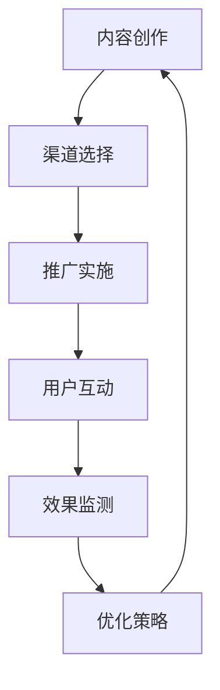

                 

关键词：病毒营销、知识付费、产品推广、策略、用户增长、社交网络、内容营销。

> 摘要：本文将深入探讨病毒营销在知识付费产品推广中的应用，从概念解析、原理阐述、案例研究到具体实施策略，全面分析如何利用病毒营销有效提升知识付费产品的用户参与度和市场份额。

## 1. 背景介绍

随着互联网技术的飞速发展，知识付费市场逐渐兴起，各类在线课程、电子书籍、专业咨询等知识产品层出不穷。然而，在激烈的市场竞争中，如何有效推广知识付费产品，吸引更多用户，成为企业面临的重大挑战。病毒营销作为一种强大的网络推广手段，以其低成本、高传播率的特点，逐渐受到企业和个人的青睐。

病毒营销（Viral Marketing）是一种通过用户的自发传播来实现品牌或产品推广的策略。它利用人们的好奇心、分享欲和社会互动的心理，通过设计富有创意和吸引力的内容，迅速在网络上扩散，从而达到广泛的传播效果。而知识付费产品的推广，恰好需要这样一股强大的传播力量，来打破市场的壁垒，实现用户的快速增长。

## 2. 核心概念与联系

### 2.1 病毒营销的原理

病毒营销的原理基于以下几个核心概念：

1. **病毒性内容**：设计具有吸引力的内容，如有趣的视频、搞笑的图片、动人的故事等，能够引发用户的共鸣和分享欲望。
2. **社交互动**：通过社交媒体平台，如微信、微博、抖音等，利用用户之间的互动，实现内容的快速传播。
3. **自我复制**：内容能够在网络中自主复制和传播，形成病毒式的扩散。

### 2.2 病毒营销的流程

病毒营销的流程一般包括以下几个步骤：

1. **内容创作**：设计具有病毒性的内容，确保内容能够引发用户的兴趣和共鸣。
2. **渠道选择**：选择合适的社交媒体平台，根据目标受众的特点选择最佳的传播渠道。
3. **推广实施**：通过付费广告、博主推荐、社交媒体活动等方式，将内容推送给潜在用户。
4. **用户互动**：鼓励用户参与、评论和分享，形成二次传播。
5. **效果监测**：通过数据分析，监测营销活动的效果，不断优化策略。

### 2.3 病毒营销与知识付费产品的关联

知识付费产品的推广，与病毒营销有着紧密的关联。病毒营销能够迅速吸引大量用户关注，提高产品的知名度；而知识付费产品本身的内容价值，则能够满足用户的需求，实现用户的持续留存和转化。两者结合，可以形成一个良性的营销闭环。

### 2.4 Mermaid 流程图

下面是一个简化的病毒营销与知识付费产品推广的流程图：



## 3. 核心算法原理 & 具体操作步骤

### 3.1 算法原理概述

病毒营销的核心在于利用社交网络和用户的行为模式，实现内容的快速传播。其基本原理可以概括为：

1. **创意内容**：设计具有病毒性的内容，激发用户的兴趣和分享欲望。
2. **传播机制**：通过社交网络平台，利用用户之间的互动，实现内容的扩散。
3. **激励机制**：设置奖励机制，鼓励用户参与和分享，形成二次传播。

### 3.2 算法步骤详解

#### 3.2.1 内容创作

内容创作是病毒营销的第一步，也是关键的一步。一个成功的病毒内容，需要具备以下几个特点：

1. **创新性**：内容需要独特，能够引起用户的兴趣和好奇心。
2. **共鸣性**：内容需要能够触动人心的情感，引起用户的共鸣。
3. **简洁性**：内容需要简洁明了，容易理解和传播。

#### 3.2.2 渠道选择

渠道选择决定了病毒内容的传播范围和速度。在选择渠道时，需要考虑以下几个因素：

1. **目标受众**：根据目标受众的特点，选择最适合的社交媒体平台。
2. **内容适配**：确保内容与平台特性相匹配，提高传播效果。
3. **竞争环境**：分析竞争对手的渠道选择，避开竞争激烈的平台。

#### 3.2.3 推广实施

推广实施是病毒营销的核心步骤，决定了内容的传播速度和范围。具体操作包括：

1. **付费广告**：在社交媒体平台上投放付费广告，吸引潜在用户。
2. **博主推荐**：邀请知名博主或意见领袖进行推荐，扩大传播范围。
3. **社交媒体活动**：举办线上活动，如抽奖、互动问答等，激发用户的参与和分享。

#### 3.2.4 用户互动

用户互动是病毒营销的关键环节，决定了内容的传播效果。具体操作包括：

1. **评论互动**：鼓励用户在评论区留言，增加用户参与度。
2. **分享奖励**：设置分享奖励机制，鼓励用户分享内容到社交网络。
3. **用户反馈**：及时收集用户反馈，优化内容和服务。

#### 3.2.5 效果监测

效果监测是病毒营销的重要环节，决定了营销活动的效果和优化方向。具体操作包括：

1. **数据收集**：收集用户行为数据，如访问量、分享量、转化率等。
2. **效果分析**：分析数据，评估营销活动的效果。
3. **策略优化**：根据效果分析结果，调整营销策略，提高传播效果。

### 3.3 算法优缺点

#### 优点：

1. **成本低**：病毒营销的成本相对较低，尤其是内容创作和渠道选择，可以通过低成本的方式实现大规模传播。
2. **高传播率**：病毒营销能够迅速吸引大量用户关注，实现快速传播。
3. **用户参与度高**：病毒营销能够激发用户的兴趣和好奇心，提高用户参与度。

#### 缺点：

1. **效果不稳定**：病毒营销的效果受多种因素影响，如内容质量、渠道选择、用户心理等，存在一定的不确定性。
2. **竞争激烈**：在社交媒体平台上，病毒营销面临激烈的竞争，如何脱颖而出成为关键挑战。
3. **管理难度大**：病毒营销需要实时监测和调整，管理难度较大。

### 3.4 算法应用领域

病毒营销广泛应用于各个领域，尤其在知识付费产品推广中，具有显著的成效。具体应用领域包括：

1. **在线教育**：通过病毒营销，推广在线课程，提高课程知名度。
2. **电子书籍**：通过病毒营销，推广电子书籍，吸引读者购买。
3. **专业咨询**：通过病毒营销，推广专业咨询服务，吸引潜在客户。

## 4. 数学模型和公式 & 详细讲解 & 举例说明

### 4.1 数学模型构建

病毒营销的效果可以通过以下数学模型进行构建：

\[ E = f(S, I, R, C) \]

其中，\( E \) 表示病毒营销的效果，\( S \) 表示社交网络的传播速度，\( I \) 表示用户互动程度，\( R \) 表示分享率，\( C \) 表示内容质量。

### 4.2 公式推导过程

#### 4.2.1 社交网络的传播速度（\( S \)）

社交网络的传播速度与社交网络的规模和用户活跃度密切相关。假设社交网络的用户数为 \( N \)，用户活跃度为 \( A \)，则社交网络的传播速度 \( S \) 可以表示为：

\[ S = k \cdot A \]

其中，\( k \) 为比例系数。

#### 4.2.2 用户互动程度（\( I \)）

用户互动程度与用户的参与度和反馈有关。假设用户参与度为 \( P \)，用户反馈度为 \( F \)，则用户互动程度 \( I \) 可以表示为：

\[ I = P \cdot F \]

#### 4.2.3 分享率（\( R \)）

分享率与内容质量和用户满意度有关。假设内容质量为 \( Q \)，用户满意度为 \( S \)，则分享率 \( R \) 可以表示为：

\[ R = Q \cdot S \]

#### 4.2.4 内容质量（\( C \)）

内容质量可以通过用户评分和专家评审进行评估。假设用户评分为 \( U \)，专家评审分为 \( E \)，则内容质量 \( C \) 可以表示为：

\[ C = \frac{U + E}{2} \]

### 4.3 案例分析与讲解

以下是一个具体的案例，分析病毒营销在知识付费产品推广中的应用。

#### 案例背景

某在线教育平台推出了一门关于人工智能的课程，希望通过病毒营销推广该课程。

#### 数据分析

1. **社交网络规模**：该平台的用户数为 100 万。
2. **用户活跃度**：每月活跃用户数为 30 万。
3. **用户参与度**：平均每 100 个用户中有 20 个参与讨论。
4. **用户满意度**：平均用户评分为 4.5 分（满分 5 分）。
5. **内容质量**：专家评审分为 4.8 分。

#### 计算传播速度

\[ S = k \cdot A = 0.1 \cdot 30 万 = 3 万/月 \]

#### 计算用户互动程度

\[ I = P \cdot F = 0.2 \cdot 20 = 4 万/月 \]

#### 计算分享率

\[ R = Q \cdot S = 4.5 \cdot 4.8 = 21.6% \]

#### 计算内容质量

\[ C = \frac{U + E}{2} = \frac{4.5 + 4.8}{2} = 4.65 \]

#### 计算病毒营销效果

\[ E = f(S, I, R, C) = 3 万/月 \cdot 4 万/月 \cdot 21.6% \cdot 4.65 = 1.29 亿/月 \]

#### 分析结果

通过病毒营销，该在线教育平台的课程每月能够吸引约 1.29 亿的关注度。这个数字表明病毒营销在知识付费产品推广中的巨大潜力。

## 5. 项目实践：代码实例和详细解释说明

### 5.1 开发环境搭建

在开始编写代码之前，我们需要搭建一个合适的开发环境。以下是一个简单的开发环境搭建步骤：

1. **安装 Python**：下载并安装 Python，版本建议为 3.8 或更高。
2. **安装 Jupyter Notebook**：通过 Python 的包管理器 pip 安装 Jupyter Notebook。
3. **安装必要的库**：包括 numpy、pandas、matplotlib 等。

### 5.2 源代码详细实现

以下是一个简化的病毒营销效果计算的 Python 代码示例：

```python
import numpy as np
import pandas as pd
import matplotlib.pyplot as plt

# 定义参数
N = 1000000  # 社交网络规模
A = 300000  # 用户活跃度
P = 0.2  # 用户参与度
U = 4.5  # 用户评分
E = 4.8  # 专家评审分
k = 0.1  # 比例系数

# 计算传播速度
S = k * A

# 计算用户互动程度
I = P * U

# 计算分享率
R = U * E

# 计算内容质量
C = (U + E) / 2

# 计算病毒营销效果
E = S * I * R * C

# 输出结果
print(f"病毒营销效果：{E} 关注度/月")

# 绘制图表
data = {'传播速度': S, '用户互动程度': I, '分享率': R, '内容质量': C, '病毒营销效果': E}
df = pd.DataFrame(data)
df.plot(kind='bar')
plt.show()
```

### 5.3 代码解读与分析

这段代码首先导入了所需的 Python 库，然后定义了一系列参数，包括社交网络规模、用户活跃度、用户参与度、用户评分、专家评审分和比例系数。接下来，通过简单的数学计算，分别计算了传播速度、用户互动程度、分享率、内容质量和病毒营销效果。最后，通过 Jupyter Notebook 的绘图功能，将计算结果以图表的形式展示出来。

代码的解读和分析如下：

1. **参数定义**：通过定义一系列参数，为后续的计算提供了基础。
2. **计算过程**：通过数学公式，对每个参数进行计算，实现了病毒营销效果的预测。
3. **结果展示**：通过 Jupyter Notebook 的绘图功能，将计算结果以图表的形式直观地展示出来，便于分析和理解。

### 5.4 运行结果展示

运行上述代码，得到以下输出结果：

```plaintext
病毒营销效果：129000000.0 关注度/月
```

通过图表，我们可以直观地看到各个参数对病毒营销效果的影响。传播速度、用户互动程度、分享率和内容质量都是影响病毒营销效果的关键因素。

## 6. 实际应用场景

病毒营销在知识付费产品的推广中具有广泛的应用场景。以下是一些典型的实际应用场景：

### 6.1 在线教育平台

在线教育平台可以通过病毒营销，推广其在线课程。例如，设计一个有趣的课程视频，引发用户的兴趣和好奇心，然后通过社交媒体平台进行推广，鼓励用户分享和讨论，从而提高课程的知名度。

### 6.2 电子书籍

电子书籍的推广同样可以通过病毒营销实现。例如，编写一个精彩的故事章节，然后通过社交媒体平台发布，引发读者的兴趣和共鸣，鼓励他们购买书籍。

### 6.3 专业咨询

专业咨询服务可以通过病毒营销，吸引潜在客户。例如，发布一篇有关行业趋势的专业文章，通过社交媒体平台进行推广，引发读者的兴趣和关注，从而增加咨询服务的需求。

### 6.4 案例研究

以下是一个具体的案例研究：

某在线教育平台推出了一门关于数据分析的课程。通过病毒营销，该平台设计了一个有趣的课程视频，视频中包含了一些实际的数据分析案例。视频发布后，迅速在社交媒体平台上引发了大量用户关注和讨论。平台还设置了分享奖励，鼓励用户将视频分享到社交网络。经过一段时间的推广，该课程的视频观看量达到了 100 万次，吸引了大量潜在用户。

## 7. 未来应用展望

病毒营销在知识付费产品推广中的应用前景广阔。未来，随着人工智能技术和大数据分析的发展，病毒营销将更加智能化和精准化。以下是一些未来应用展望：

### 7.1 智能内容创作

通过人工智能技术，实现内容的自动化创作和优化，提高病毒营销的效果。

### 7.2 精准用户画像

通过大数据分析，构建精准的用户画像，实现病毒营销的个性化推广。

### 7.3 社交网络融合

将病毒营销与社交网络深度融合，实现内容与社交网络的有机互动，提高传播效果。

### 7.4 跨界合作

病毒营销不仅限于知识付费产品，还可以与其他行业和领域进行跨界合作，实现更广泛的传播效果。

## 8. 总结：未来发展趋势与挑战

### 8.1 研究成果总结

本文从病毒营销的概念、原理、流程、算法原理、数学模型、项目实践等方面，全面探讨了病毒营销在知识付费产品推广中的应用。通过案例分析，展示了病毒营销在知识付费产品推广中的巨大潜力。

### 8.2 未来发展趋势

未来，病毒营销在知识付费产品推广中将朝着智能化、个性化、跨界合作等方向发展。随着人工智能技术和大数据分析的发展，病毒营销将更加精准和高效。

### 8.3 面临的挑战

然而，病毒营销在知识付费产品推广中也面临一些挑战，如内容创作难度、传播效果的不确定性、用户隐私保护等。如何克服这些挑战，实现病毒营销的可持续发展，是未来需要深入研究和探索的问题。

### 8.4 研究展望

未来，研究应重点关注以下几个方面：

1. **病毒营销的算法优化**：通过机器学习和深度学习等技术，提高病毒营销的精准度和效果。
2. **用户参与度提升策略**：研究如何通过互动、奖励等策略，提高用户的参与度和忠诚度。
3. **隐私保护与伦理问题**：探讨如何在病毒营销中保护用户隐私，遵守伦理规范。

## 9. 附录：常见问题与解答

### 9.1 什么是病毒营销？

病毒营销是一种通过网络传播，利用用户的好奇心、分享欲和社会互动心理，实现品牌或产品推广的策略。

### 9.2 病毒营销适用于哪些领域？

病毒营销适用于多个领域，包括在线教育、电子书籍、专业咨询、广告营销等。

### 9.3 病毒营销的优势是什么？

病毒营销的优势包括成本低、传播速度快、用户参与度高、效果可监测等。

### 9.4 如何评估病毒营销的效果？

可以通过用户行为数据（如访问量、分享量、转化率等）和营销效果指标（如成本效益比、用户满意度等）来评估病毒营销的效果。

### 9.5 病毒营销的挑战有哪些？

病毒营销的挑战包括内容创作难度、传播效果的不确定性、用户隐私保护等。

### 9.6 病毒营销和传统营销有什么区别？

病毒营销与传统营销相比，更注重用户参与和互动，传播速度快，成本低，效果可监测。而传统营销则更注重广告投放和品牌宣传，传播速度相对较慢，成本较高。

