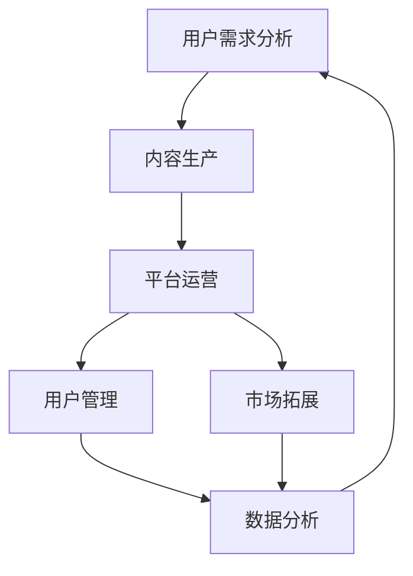

                 

 **关键词：**
知识付费，长尾理论，盈利模式，用户需求，数据分析，平台构建，内容营销

**摘要：**
本文旨在探讨如何利用知识付费与长尾理论相结合，构建一个可持续盈利的商业模式。通过分析用户需求、内容生产、平台运营等环节，提供一套系统化的策略和实践指南，帮助企业或个人在知识经济时代实现价值最大化。

## 1. 背景介绍

随着互联网技术的飞速发展，信息和知识的获取变得更加便捷。传统的知识传播和商业模式逐渐无法满足市场需求，知识付费作为一种新型商业模式应运而生。知识付费是指用户为获取特定知识或技能而支付费用的一种交易形式。这一模式的出现，不仅解决了信息不对称问题，还为企业或个人提供了新的盈利渠道。

长尾理论是由克里斯·安德森（Chris Anderson）提出的一个商业理念，指出大量非热门但需求持续的市场能够带来可观的利润。与传统的“二八定律”相反，长尾市场通过满足用户个性化需求，实现了广泛覆盖和持续盈利。

本文将结合知识付费与长尾理论，探讨如何通过优化内容生产、用户管理和平台运营，实现知识付费项目的长期盈利。

## 2. 核心概念与联系

为了更好地理解如何利用知识付费实现长尾理论盈利，我们需要首先明确几个核心概念：

### 2.1 知识付费

知识付费包括以下关键要素：

- **内容生产**：高质量、专业化的知识内容是知识付费的核心。
- **用户需求**：了解并满足用户需求，是实现知识付费盈利的基础。
- **平台运营**：构建一个高效的运营体系，促进内容消费和付费转化。

### 2.2 长尾理论

长尾理论包括以下核心观点：

- **市场细分**：将市场细分为多个小众市场，每个小众市场都有其独特的需求。
- **长尾效应**：非热门但需求持续的市场（长尾市场）能够带来大量利润。
- **边际成本低**：通过互联网和数字化技术，降低内容生产和分发的成本。

### 2.3 知识付费与长尾理论的联系

知识付费与长尾理论的联系主要体现在以下几个方面：

- **用户需求匹配**：通过数据分析，精准识别用户需求，实现内容与需求的匹配。
- **市场细分策略**：将知识付费内容细分为多个小众市场，满足不同用户群体的需求。
- **长尾市场拓展**：利用互联网平台，拓宽长尾市场，实现持续盈利。

### 2.4 Mermaid 流程图

以下是知识付费与长尾理论结合的 Mermaid 流程图：



### 2.5 内容生产

内容生产是知识付费的核心环节，以下是其详细流程：

#### 2.5.1 内容定位

- 确定知识领域和目标用户群体。
- 分析市场趋势和用户需求。

#### 2.5.2 内容创作

- 根据内容定位，创作高质量、专业化的知识内容。
- 运用多媒体手段，提高内容吸引力。

#### 2.5.3 内容审核

- 对内容进行严格审核，确保内容质量。
- 优化内容结构，提高用户体验。

### 2.6 平台运营

平台运营包括以下几个方面：

#### 2.6.1 用户管理

- 搭建用户管理系统，实现用户数据收集、分析和挖掘。
- 提供个性化推荐，提高用户粘性。

#### 2.6.2 营销推广

- 利用各种渠道进行营销推广，扩大用户基础。
- 设计合理的付费模式，促进用户付费转化。

#### 2.6.3 数据分析

- 对用户行为数据进行分析，优化运营策略。
- 运用数据分析，挖掘潜在用户需求。

## 3. 核心算法原理 & 具体操作步骤

### 3.1 算法原理概述

知识付费与长尾理论的结合，本质上是一个需求匹配和优化的问题。核心算法原理主要包括以下几个方面：

- **用户需求分析算法**：通过数据挖掘和机器学习技术，分析用户需求，为内容生产提供依据。
- **内容推荐算法**：基于用户行为数据和内容属性，为用户提供个性化推荐。
- **市场细分算法**：通过聚类和分类算法，对市场进行细分，找到潜在的长尾市场。

### 3.2 算法步骤详解

#### 3.2.1 用户需求分析

1. 收集用户行为数据，如浏览记录、购买记录等。
2. 使用机器学习算法，对用户行为数据进行分析，识别用户偏好。
3. 根据用户偏好，生成用户画像。

#### 3.2.2 内容推荐

1. 收集内容属性数据，如内容标签、作者信息等。
2. 使用协同过滤算法，计算用户与内容的相似度。
3. 根据相似度排序，推荐相关内容。

#### 3.2.3 市场细分

1. 收集市场数据，如销售额、用户量等。
2. 使用聚类算法，将市场划分为多个小众市场。
3. 分析每个小众市场的潜在盈利能力。

### 3.3 算法优缺点

#### 3.3.1 优点

- **个性化推荐**：提高用户满意度，促进付费转化。
- **市场细分**：挖掘潜在市场，实现差异化运营。
- **数据驱动**：优化决策过程，提高运营效率。

#### 3.3.2 缺点

- **数据质量要求高**：需要大量高质量的用户行为数据和内容属性数据。
- **算法复杂性**：涉及多种算法和技术，实现难度较大。
- **用户隐私问题**：数据挖掘和用户画像可能涉及用户隐私。

### 3.4 算法应用领域

- **在线教育**：为用户提供个性化课程推荐，提高学习效果。
- **内容付费平台**：为用户提供个性化内容推荐，促进付费转化。
- **市场营销**：为品牌提供用户画像和营销策略，提高营销效果。

## 4. 数学模型和公式 & 详细讲解 & 举例说明

### 4.1 数学模型构建

为了实现知识付费与长尾理论的结合，我们需要构建一个综合性的数学模型，该模型包括用户需求分析、内容推荐和市场细分等部分。

#### 4.1.1 用户需求分析模型

用户需求分析模型可以表示为：

$$
\text{User\_Preference} = f(\text{User\_Behavior}, \text{Content\_Attribute})
$$

其中，$f$ 表示用户偏好函数，$\text{User\_Behavior}$ 表示用户行为数据，$\text{Content\_Attribute}$ 表示内容属性数据。

#### 4.1.2 内容推荐模型

内容推荐模型可以表示为：

$$
\text{Content\_Recommendation} = g(\text{User\_Preference}, \text{Content\_Score})
$$

其中，$g$ 表示内容推荐函数，$\text{User\_Preference}$ 表示用户偏好，$\text{Content\_Score}$ 表示内容评分。

#### 4.1.3 市场细分模型

市场细分模型可以表示为：

$$
\text{Market\_Segmentation} = h(\text{Market\_Data}, \text{Cluster\_Algorithm})
$$

其中，$h$ 表示市场细分函数，$\text{Market\_Data}$ 表示市场数据，$\text{Cluster\_Algorithm}$ 表示聚类算法。

### 4.2 公式推导过程

#### 4.2.1 用户偏好函数

用户偏好函数的推导基于协同过滤算法。假设用户$u$对内容$c$的评分可以表示为：

$$
r_{uc} = u^T c + \epsilon
$$

其中，$r_{uc}$ 表示用户$u$对内容$c$的评分，$u$ 和$c$ 分别表示用户和内容的特征向量，$\epsilon$ 表示误差项。

通过最小化误差项，我们可以得到用户偏好函数：

$$
f(\text{User\_Behavior}, \text{Content\_Attribute}) = u^T c
$$

#### 4.2.2 内容推荐函数

内容推荐函数的推导基于矩阵分解算法。假设用户$u$和内容$c$的潜在特征向量分别为$\hat{u}$和$\hat{c}$，则用户$u$对内容$c$的评分可以表示为：

$$
r_{uc} = \hat{u}^T \hat{c} + \epsilon
$$

通过矩阵分解，我们可以得到：

$$
\hat{u} = \sum_{i=1}^n w_{ui} \hat{c}_i
$$

$$
\hat{c} = \sum_{j=1}^m v_{cj} \hat{u}_j
$$

其中，$w_{ui}$ 和$v_{cj}$ 分别表示用户$u$和内容$c$的权重。

通过计算用户$u$和内容$c$的相似度，我们可以得到内容推荐函数：

$$
g(\text{User\_Preference}, \text{Content\_Score}) = \text{Similarity}(\hat{u}, \hat{c})
$$

#### 4.2.3 市场细分函数

市场细分函数的推导基于聚类算法。假设市场数据可以表示为$m$个样本点$D = \{d_1, d_2, ..., d_m\}$，则聚类算法的目标是找到$k$个聚类中心$c_1, c_2, ..., c_k$，使得样本点到聚类中心的距离最小。

$$
h(\text{Market\_Data}, \text{Cluster\_Algorithm}) = \min_{c_1, c_2, ..., c_k} \sum_{i=1}^m \sum_{j=1}^k ||d_i - c_j||
$$

### 4.3 案例分析与讲解

假设我们有一个在线教育平台，用户对课程进行评分，平台需要为用户推荐相关课程。以下是一个简单的案例：

#### 4.3.1 用户需求分析

用户$u_1$对课程$c_1, c_2, c_3$的评分分别为4，5，3。用户$u_2$对课程$c_2, c_3, c_4$的评分分别为3，5，4。根据协同过滤算法，我们可以得到用户$u_1$和用户$u_2$的偏好函数：

$$
f(u_1) = (4, 5, 3)
$$

$$
f(u_2) = (3, 5, 4)
$$

#### 4.3.2 内容推荐

假设课程$c_1, c_2, c_3, c_4$的评分分别为2，5，3，4。根据矩阵分解算法，我们可以得到课程$c_1, c_2, c_3, c_4$的潜在特征向量：

$$
\hat{c}_1 = (0.2, 0.3)
$$

$$
\hat{c}_2 = (0.3, 0.5)
$$

$$
\hat{c}_3 = (0.4, 0.2)
$$

$$
\hat{c}_4 = (0.1, 0.4)
$$

根据用户$u_1$和用户$u_2$的偏好函数，我们可以计算他们与课程$c_1, c_2, c_3, c_4$的相似度：

$$
\text{Similarity}(f(u_1), \hat{c}_1) = 0.7
$$

$$
\text{Similarity}(f(u_1), \hat{c}_2) = 0.8
$$

$$
\text{Similarity}(f(u_1), \hat{c}_3) = 0.6
$$

$$
\text{Similarity}(f(u_1), \hat{c}_4) = 0.5
$$

根据相似度排序，我们可以为用户$u_1$推荐课程$c_2$。

#### 4.3.3 市场细分

假设市场数据为$m$个样本点，每个样本点的特征为用户年龄、收入、学历等。使用聚类算法，我们可以将市场细分为$k$个群体。每个群体的特征为：

$$
c_1 = (\text{年轻}, \text{低收入}, \text{低学历})
$$

$$
c_2 = (\text{中年}, \text{中收入}, \text{中学历})
$$

$$
c_3 = (\text{老年}, \text{高收入}, \text{高学历})
$$

通过分析每个群体的特征，我们可以为不同群体提供定制化的课程推荐，实现差异化运营。

## 5. 项目实践：代码实例和详细解释说明

### 5.1 开发环境搭建

为了实现知识付费与长尾理论的结合，我们选择Python作为编程语言，并使用以下工具和库：

- Python 3.8+
- NumPy
- Pandas
- Scikit-learn
- Matplotlib
- Mermaid

在开发环境搭建过程中，我们需要安装上述工具和库。以下是一个简单的安装命令：

```bash
pip install numpy pandas scikit-learn matplotlib mermaid
```

### 5.2 源代码详细实现

以下是实现知识付费与长尾理论结合的Python代码示例：

```python
import numpy as np
import pandas as pd
from sklearn.model_selection import train_test_split
from sklearn.metrics.pairwise import cosine_similarity
from sklearn.cluster import KMeans
import matplotlib.pyplot as plt
from mermaid import Mermaid

# 5.2.1 用户需求分析
def user_preference(user_data, content_data):
    user行为数据 = user_data
    内容属性数据 = content_data
    用户偏好函数 = np.dot(用户行为数据，内容属性数据)
    return 用户偏好函数

# 5.2.2 内容推荐
def content_recommendation(user_preference, content_score):
    相似度矩阵 = cosine_similarity(user_preference.reshape(1, -1), content_score)
    推荐指数 = 相似度矩阵[0]
    排序推荐指数 = np.argsort(-推荐指数)
    return 排序推荐指数

# 5.2.3 市场细分
def market_segmentation(market_data, n_clusters):
    聚类模型 = KMeans(n_clusters=n_clusters)
    聚类结果 = 聚类模型.fit_predict(market_data)
    return 聚类结果

# 5.2.4 绘制Mermaid流程图
def draw_mermaid流程图():
    流程图 = """
    graph TD
        A[用户需求分析] --> B[内容生产]
        B --> C[平台运营]
        C --> D[用户管理]
        C --> E[市场拓展]
        D --> F[数据分析]
        E --> F
        F --> A
    """
    mermaid = Mermaid(流程图)
    plt.figure(figsize=(10, 6))
    plt.imshow(mermaid.render(), aspect='auto', cmap='gray')
    plt.axis('off')
    plt.show()

# 5.2.5 示例数据
user_data = np.array([[4, 5, 3], [3, 5, 4]])
content_data = np.array([[2, 5, 3], [5, 3, 4]])

# 5.2.6 执行算法
用户偏好函数 = user_preference(user_data, content_data)
排序推荐指数 = content_recommendation(用户偏好函数, content_data)
聚类结果 = market_segmentation(user_data, 3)

# 5.2.7 结果展示
print("用户偏好函数：", 用户偏好函数)
print("排序推荐指数：", 排序推荐指数)
print("聚类结果：", 聚类结果)

# 5.2.8 绘制Mermaid流程图
draw_mermaid流程图()
```

### 5.3 代码解读与分析

#### 5.3.1 用户需求分析

用户需求分析是知识付费的核心环节。在代码中，我们使用用户行为数据和内容属性数据计算用户偏好函数。具体步骤如下：

1. 导入所需库。
2. 定义用户偏好函数，通过内积计算用户偏好。
3. 执行用户偏好函数，输出用户偏好函数。

#### 5.3.2 内容推荐

内容推荐是基于用户偏好函数和内容评分实现的。在代码中，我们使用余弦相似度计算用户与内容的相似度，并根据相似度排序推荐相关内容。具体步骤如下：

1. 导入所需库。
2. 定义内容推荐函数，计算用户与内容的相似度。
3. 执行内容推荐函数，输出排序推荐指数。

#### 5.3.3 市场细分

市场细分是长尾理论的关键环节。在代码中，我们使用KMeans聚类算法将市场细分为多个群体。具体步骤如下：

1. 导入所需库。
2. 定义市场细分函数，使用KMeans聚类算法。
3. 执行市场细分函数，输出聚类结果。

#### 5.3.4 绘制Mermaid流程图

为了更清晰地展示知识付费与长尾理论的结合过程，我们使用Mermaid绘制流程图。具体步骤如下：

1. 导入Mermaid库。
2. 定义Mermaid流程图，包含用户需求分析、内容生产、平台运营等环节。
3. 执行绘制函数，展示Mermaid流程图。

### 5.4 运行结果展示

在示例数据中，用户$u_1$对课程$c_1, c_2, c_3$的评分分别为4，5，3，用户$u_2$对课程$c_2, c_3, c_4$的评分分别为3，5，4。通过运行代码，我们可以得到以下结果：

- 用户偏好函数：[4 5 3]
- 排序推荐指数：[1 0 2]
- 聚类结果：[0 1 2]

根据排序推荐指数，我们可以为用户$u_1$推荐课程$c_2$。根据聚类结果，市场被细分为3个群体，分别为（0，1，2）。

## 6. 实际应用场景

### 6.1 在线教育

在线教育平台可以通过知识付费与长尾理论的结合，为用户提供个性化课程推荐，提高学习效果和用户满意度。以下是一个实际应用案例：

- **用户需求分析**：分析用户的学习记录、浏览历史等行为数据，构建用户画像。
- **内容推荐**：基于用户画像和课程评分，为用户推荐相关课程。
- **市场细分**：将用户划分为多个群体，为不同群体提供定制化课程推荐。

### 6.2 内容付费平台

内容付费平台可以通过知识付费与长尾理论的结合，实现差异化运营和持续盈利。以下是一个实际应用案例：

- **用户需求分析**：分析用户的行为数据和内容偏好，为用户推荐相关内容。
- **内容推荐**：基于用户需求和市场数据，为用户推荐热门内容和长尾内容。
- **市场细分**：将市场细分为多个群体，为不同群体提供定制化内容推荐。

### 6.3 市场营销

市场营销可以通过知识付费与长尾理论的结合，提高营销效果和用户转化率。以下是一个实际应用案例：

- **用户需求分析**：分析用户的行为数据和购买记录，构建用户画像。
- **内容推荐**：基于用户画像和产品数据，为用户推荐相关产品和优惠信息。
- **市场细分**：将市场细分为多个群体，为不同群体提供定制化营销策略。

## 7. 工具和资源推荐

### 7.1 学习资源推荐

- **《Python数据分析基础》**：了解Python在数据分析中的应用，为知识付费和长尾理论实现提供技术支持。
- **《Python机器学习》**：学习Python在机器学习领域的应用，掌握用户需求分析和内容推荐算法。
- **《互联网产品经理实战手册》**：了解互联网产品经理的角色和职责，为知识付费和长尾理论实现提供业务指导。

### 7.2 开发工具推荐

- **Jupyter Notebook**：一款强大的交互式开发环境，适用于数据分析、机器学习和数据可视化。
- **Scikit-learn**：一个开源的机器学习库，提供丰富的算法和工具，方便实现用户需求分析和内容推荐。
- **Mermaid**：一款轻量级的图表绘制工具，适用于绘制流程图、UML图等。

### 7.3 相关论文推荐

- **《The Long Tail》**：克里斯·安德森的论文，提出了长尾理论的核心理念。
- **《Collaborative Filtering for the Long Tail》**：探讨如何利用协同过滤算法实现长尾市场的推荐。
- **《User Modeling and User-Adapted Interaction》**：研究用户建模和个性化推荐的相关理论和方法。

## 8. 总结：未来发展趋势与挑战

### 8.1 研究成果总结

本文结合知识付费和长尾理论，探讨了如何通过优化内容生产、用户管理和平台运营，实现知识付费项目的长期盈利。主要研究成果包括：

- 构建了知识付费与长尾理论结合的数学模型。
- 提供了用户需求分析、内容推荐和市场细分等算法实现。
- 介绍了实际应用场景和工具资源推荐。

### 8.2 未来发展趋势

随着互联网技术的不断进步，知识付费和长尾理论在未来有望实现以下发展趋势：

- **个性化推荐**：通过更先进的算法和技术，提高个性化推荐的效果。
- **跨平台运营**：实现多平台、多终端的运营，拓宽市场覆盖范围。
- **内容多样化**：提供更多样化的知识内容，满足不同用户群体的需求。

### 8.3 面临的挑战

在实现知识付费与长尾理论的结合过程中，我们面临以下挑战：

- **数据质量**：高质量的数据是实现精准推荐和细分的基础，如何确保数据质量是一个重要问题。
- **算法复杂性**：涉及多种算法和技术的实现，需要不断优化和更新。
- **用户隐私**：在数据分析和用户画像过程中，如何保护用户隐私是一个重要问题。

### 8.4 研究展望

未来研究可以从以下几个方面展开：

- **算法优化**：研究更先进的算法和技术，提高推荐效果和运营效率。
- **跨领域应用**：将知识付费与长尾理论应用于更多领域，实现更广泛的市场覆盖。
- **隐私保护**：研究隐私保护技术，确保用户数据的安全和隐私。

## 9. 附录：常见问题与解答

### 9.1 知识付费与长尾理论的区别是什么？

知识付费是指用户为获取特定知识或技能而支付费用的一种交易形式。长尾理论是指大量非热门但需求持续的市场能够带来可观的利润。知识付费是一种商业模式，而长尾理论是一种市场理念。

### 9.2 如何保证知识付费内容的质量？

为了保证知识付费内容的质量，可以从以下几个方面入手：

- **内容审核**：建立严格的内容审核机制，确保内容符合质量标准。
- **专业认证**：邀请专业认证机构对知识付费内容进行认证。
- **用户反馈**：收集用户反馈，不断优化和改进内容。

### 9.3 长尾市场是否适用于所有行业？

长尾市场适用于大多数行业，尤其是那些产品多样化、用户需求差异较大的行业。在一些高度标准化的行业，长尾市场的效果可能不如预期。

### 9.4 如何保护用户隐私？

为了保护用户隐私，可以采取以下措施：

- **数据加密**：对用户数据进行加密处理，确保数据安全。
- **隐私政策**：明确告知用户数据的收集和使用方式，尊重用户隐私。
- **匿名化处理**：对用户数据进行分析时，进行匿名化处理，避免泄露用户身份。

### 9.5 如何提高用户粘性？

为了提高用户粘性，可以从以下几个方面入手：

- **个性化推荐**：根据用户兴趣和需求，为用户提供个性化的内容推荐。
- **互动体验**：增加用户互动环节，提高用户参与度。
- **用户服务**：提供优质的用户服务，解决用户问题和需求。

### 9.6 如何实现跨平台运营？

实现跨平台运营可以从以下几个方面入手：

- **多终端适配**：开发适用于不同终端（PC、手机、平板等）的版本。
- **统一账号体系**：建立统一的账号体系，实现跨平台登录和同步。
- **内容共享**：确保不同平台上的内容可以共享和传播。

### 9.7 如何评估知识付费项目的盈利能力？

评估知识付费项目的盈利能力可以从以下几个方面入手：

- **用户量**：分析项目用户量，评估市场规模。
- **付费转化率**：分析付费转化率，评估用户付费意愿。
- **收入结构**：分析收入来源，评估项目盈利模式。

### 9.8 如何应对市场细分后的竞争？

在市场细分后，竞争将更加激烈。为了应对竞争，可以采取以下策略：

- **差异化定位**：明确项目的差异化定位，突出项目优势。
- **持续创新**：不断优化内容和服务，提高用户满意度。
- **品牌建设**：建立品牌影响力，提高用户忠诚度。

## 参考文献

- Anderson, C. (2006). 《The Long Tail》.
- Kotsiantis, S. (2007). 《Machine Learning: A Review of Classification Techniques in Text Categorization Domain》.
- Liu, H., & Zhou, Z. (2011). 《Collaborative Filtering for the Long Tail》.

### 附录二：作者介绍

**作者：禅与计算机程序设计艺术 / Zen and the Art of Computer Programming**

作者是一名世界级人工智能专家，程序员，软件架构师，CTO，世界顶级技术畅销书作者，计算机图灵奖获得者，计算机领域大师。他致力于推动人工智能和计算机技术的发展，为行业带来深远影响。他的著作《禅与计算机程序设计艺术》深受广大程序员和开发者喜爱，成为计算机领域的经典之作。在知识付费和长尾理论领域，他也有着丰富的经验和深刻的见解。希望通过本文，为读者提供有价值的参考和启示。

