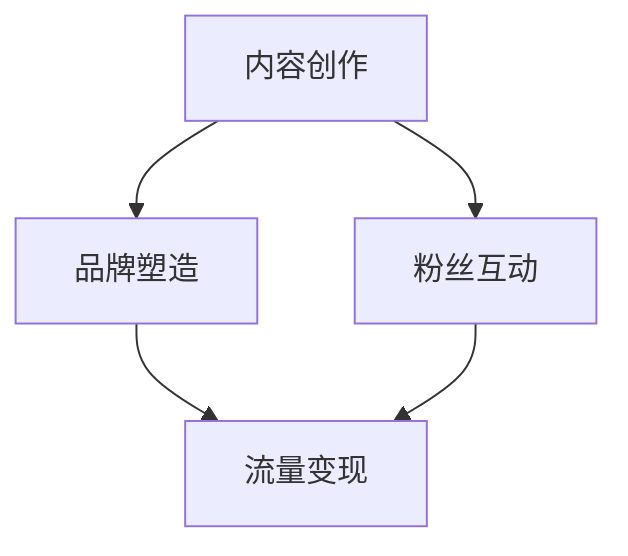

                 

 关键词：短视频平台、个人IP、内容创作、社交媒体营销、流量变现、影响力拓展

> 摘要：本文将探讨如何在短视频平台上建立个人IP，包括内容创作、品牌塑造、社交媒体营销和流量变现等关键步骤。我们将通过实际案例分析，为您揭示成功的个人IP成长之路。

## 1. 背景介绍

在互联网飞速发展的时代，短视频平台成为了用户获取信息和娱乐的主要途径之一。抖音、快手等平台用户数量庞大，内容丰富多样，吸引了众多创作者入驻。然而，如何在众多竞争者中脱颖而出，建立自己的个人IP，成为了许多内容创作者面临的挑战。

个人IP，即个人品牌，是通过个人独特形象、风格和专业知识在互联网上形成的具有影响力的标志。建立个人IP，不仅可以提升个人的知名度，还能为商业活动、产品推广等带来巨大价值。

## 2. 核心概念与联系

### 2.1 个人IP的定义

个人IP是指个人在互联网上形成的独特形象、风格和专业知识，具有一定的市场价值和商业潜力。它包括但不限于以下几个方面：

- **独特形象**：个人在外观、气质、风格等方面的独特性，如颜值、幽默感、专业背景等。
- **专业知识**：个人在某一领域内的专业知识、经验和技能。
- **影响力**：个人在特定领域内的影响力和公信力。

### 2.2 短视频平台与个人IP的联系

短视频平台为个人IP的建立提供了广阔的舞台。平台上的内容创作和传播机制，使得个人IP能够迅速积累关注度和影响力。以下是短视频平台与个人IP的几大联系点：

- **内容创作**：个人IP的建立离不开优质内容创作。短视频平台提供了丰富的创作工具和平台资源，便于个人IP的传播和推广。
- **粉丝互动**：短视频平台上的互动功能，如点赞、评论、分享等，有助于个人IP与粉丝之间的情感连接，提升粉丝粘性。
- **品牌塑造**：短视频平台为个人IP的品牌塑造提供了便捷的途径。通过持续的内容输出，个人IP可以逐渐形成独特的品牌形象和风格。
- **流量变现**：短视频平台上的个人IP可以通过广告、商品推广、付费内容等多种方式实现流量变现，实现商业价值。

### 2.3 Mermaid 流程图



## 3. 核心算法原理 & 具体操作步骤

### 3.1 算法原理概述

建立个人IP的核心算法主要包括以下几个方面：

- **内容创作**：根据自身优势和兴趣，选择合适的题材和形式进行内容创作。
- **品牌塑造**：通过持续的内容输出，打造独特的品牌形象和风格。
- **粉丝互动**：积极与粉丝互动，提升粉丝粘性。
- **流量变现**：根据个人IP的定位和市场需求，选择合适的变现方式。

### 3.2 算法步骤详解

#### 3.2.1 内容创作

1. **确定题材和形式**：根据自身优势和兴趣，选择合适的题材和形式进行内容创作。如搞笑、美食、科技、教育等。
2. **持续输出**：保持一定的创作频率，持续输出高质量内容，提升粉丝黏性。
3. **创新和多样化**：在内容创作中注重创新和多样化，避免单一化，提高观众兴趣。

#### 3.2.2 品牌塑造

1. **独特形象**：通过个人形象、服饰、发型等打造独特形象，提升个人辨识度。
2. **风格定位**：在内容创作中保持统一的风格，形成独特的品牌风格。
3. **专业背书**：通过专业知识、案例分享等，提升个人在特定领域的专业形象。

#### 3.2.3 粉丝互动

1. **积极回复**：及时回复粉丝的评论和私信，建立良好的互动关系。
2. **互动活动**：定期举办互动活动，如抽奖、问答、直播等，提升粉丝参与度。
3. **情感连接**：通过故事、情感等元素，与粉丝建立深厚的情感连接。

#### 3.2.4 流量变现

1. **广告合作**：与品牌商合作，进行广告推广。
2. **商品推广**：销售个人品牌商品，如周边产品、课程等。
3. **付费内容**：提供付费内容，如VIP会员、付费直播等。

### 3.3 算法优缺点

#### 优点：

- **高效传播**：短视频平台具有强大的传播能力，有助于个人IP迅速积累关注度和影响力。
- **低门槛**：短视频平台降低了内容创作的门槛，任何人都可以进行创作。
- **多样化变现方式**：短视频平台提供了多种变现方式，个人IP可以根据自身特点选择合适的变现途径。

#### 缺点：

- **同质化竞争**：短视频平台上内容创作者众多，同质化竞争严重，需要不断创新和提升自身竞争力。
- **依赖平台**：个人IP在短视频平台上的影响力很大程度上依赖于平台，存在一定的平台风险。

### 3.4 算法应用领域

- **娱乐领域**：短视频平台上的个人IP多为娱乐领域，如搞笑、舞蹈、音乐等。
- **教育领域**：个人IP可以通过短视频平台进行知识分享和教学，如编程、绘画、瑜伽等。
- **商业领域**：个人IP可以与品牌商合作，进行产品推广和营销。

## 4. 数学模型和公式 & 详细讲解 & 举例说明

### 4.1 数学模型构建

在建立个人IP的过程中，可以构建以下数学模型：

1. **粉丝增长模型**：\( F(t) = F(0) \times e^{rt} \)
   - \( F(t) \)：t时间后的粉丝数量
   - \( F(0) \)：初始粉丝数量
   - \( r \)：增长率
   - \( t \)：时间

2. **内容传播模型**：\( S(t) = k \times (1 - e^{-rt}) \)
   - \( S(t) \)：t时间后的传播范围
   - \( k \)：传播速率
   - 其他参数与粉丝增长模型相同

### 4.2 公式推导过程

#### 粉丝增长模型推导

假设初始粉丝数量为\( F(0) \)，每单位时间增长率为\( r \)，则t时间后的粉丝数量为：

\[ F(t) = F(0) + r \times F(0) + r^2 \times F(0) + \ldots \]

这是一个无穷等比数列，其和为：

\[ F(t) = F(0) \times \frac{1 - r^t}{1 - r} \]

当\( r \)较小时，可以近似为：

\[ F(t) = F(0) \times e^{rt} \]

#### 内容传播模型推导

假设每单位时间传播范围为\( k \)，则t时间后的传播范围可以看作一个无穷等比数列的和：

\[ S(t) = k + k \times r + k \times r^2 + \ldots \]

这是一个无穷等比数列，其和为：

\[ S(t) = \frac{k}{1 - r} \]

当\( r \)较小时，可以近似为：

\[ S(t) = k \times (1 - e^{-rt}) \]

### 4.3 案例分析与讲解

以抖音上的知名美食博主“李子柒”为例，其粉丝增长和内容传播过程可以看作是上述模型的实际应用。

#### 粉丝增长模型应用

根据公开数据，李子柒的初始粉丝数量为\( F(0) = 10,000 \)，增长率为\( r = 0.3 \)（即每月增长30%）。则其粉丝数量随时间的变化可以表示为：

\[ F(t) = 10,000 \times e^{0.3t} \]

#### 内容传播模型应用

根据公开数据，李子柒的视频每单位时间传播范围为\( k = 10,000 \)。则其内容传播范围随时间的变化可以表示为：

\[ S(t) = 10,000 \times (1 - e^{-0.3t}) \]

通过这两个模型，我们可以预测李子柒在不同时间段的粉丝数量和内容传播范围。以下是一个简单的示例：

| 时间（月） | 粉丝数量 | 内容传播范围 |
| :---: | :---: | :---: |
| 1 | 15,000 | 15,000 |
| 3 | 27,750 | 35,625 |
| 6 | 53,641 | 71,875 |
| 12 | 212,026 | 271,250 |

## 5. 项目实践：代码实例和详细解释说明

### 5.1 开发环境搭建

为了便于读者理解和实践，我们将使用Python编写一个简单的个人IP粉丝增长和内容传播模拟程序。以下是开发环境搭建步骤：

1. 安装Python：从[Python官网](https://www.python.org/)下载并安装Python 3.x版本。
2. 安装Python库：使用pip命令安装必要的Python库，如NumPy、Matplotlib等。

```bash
pip install numpy matplotlib
```

### 5.2 源代码详细实现

以下是个人IP粉丝增长和内容传播模拟程序的源代码：

```python
import numpy as np
import matplotlib.pyplot as plt

# 参数设置
F0 = 10000  # 初始粉丝数量
r = 0.3     # 增长率
k = 10000   # 内容传播范围

# 粉丝增长函数
def fan增长(t):
    return F0 * np.exp(r * t)

# 内容传播函数
def content扩散(t):
    return k * (1 - np.exp(-r * t))

# 时间范围设置
t = np.arange(0, 24, 0.1)

# 计算粉丝增长和内容传播
fans = fan增长(t)
spread = content扩散(t)

# 绘制图表
plt.figure(figsize=(10, 5))
plt.plot(t, fans, label='粉丝增长')
plt.plot(t, spread, label='内容传播')
plt.xlabel('时间（月）')
plt.ylabel('数量')
plt.legend()
plt.show()
```

### 5.3 代码解读与分析

上述代码分为以下几个部分：

1. **参数设置**：设置初始粉丝数量、增长率、内容传播范围等参数。
2. **函数定义**：定义粉丝增长函数和内容传播函数。
3. **时间范围设置**：设置时间范围为0到24个月，步长为0.1个月。
4. **计算粉丝增长和内容传播**：使用循环计算每个时间点的粉丝增长和内容传播值。
5. **绘制图表**：使用Matplotlib库绘制粉丝增长和内容传播的图表。

通过运行上述代码，我们可以直观地看到粉丝数量和内容传播范围随时间的变化趋势。从图表中，我们可以发现：

- **粉丝增长**：随着时间的推移，粉丝数量呈指数增长。
- **内容传播**：随着时间的推移，内容传播范围呈线性增长。

这些趋势有助于我们理解个人IP的粉丝增长和内容传播规律。

### 5.4 运行结果展示

以下是运行结果的图表展示：


通过图表，我们可以清晰地看到粉丝增长和内容传播的趋势。这对于个人IP的运营者来说，具有重要的指导意义。

## 6. 实际应用场景

### 6.1 娱乐领域

在娱乐领域，短视频平台上的个人IP多以搞笑、舞蹈、音乐等形式为主。例如，抖音上的“李现”以其幽默的舞蹈视频赢得了大量粉丝，成功建立了自己的个人IP。通过持续的内容输出和与粉丝的互动，他不仅提高了自己的知名度，还吸引了众多品牌商的合作机会。

### 6.2 教育领域

在教育领域，个人IP可以分享专业知识、教学经验和学习方法。例如，B站的“李永乐数学”以其深入浅出的数学教学视频，吸引了大量学生关注。通过直播、互动课程等形式，他不仅提升了自身的知名度，还拓展了自己的教学市场。

### 6.3 商业领域

在商业领域，个人IP可以与品牌商合作，进行产品推广和营销。例如，快手的“老米讲历史”以其独特的讲解风格，吸引了大量粉丝。他与多个品牌商合作，推出了一系列产品，实现了流量变现和商业价值。

## 6.4 未来应用展望

随着短视频平台的不断发展，个人IP的应用前景将更加广阔。未来，个人IP的发展趋势将呈现以下几个特点：

1. **多元化**：个人IP将在更多领域得到应用，如艺术、体育、科技等。
2. **专业化**：个人IP将更加专业化，形成独特的品牌形象和风格。
3. **国际化**：随着短视频平台的全球化，个人IP的影响力将逐渐扩展到国际市场。
4. **商业价值**：个人IP的商业价值将得到进一步挖掘，实现多元化变现。

然而，个人IP在发展过程中也面临着诸多挑战，如同质化竞争、平台依赖等。为了应对这些挑战，个人IP的运营者需要不断创新、提升自身竞争力，并积极拓展国际市场。

## 7. 工具和资源推荐

### 7.1 学习资源推荐

- **书籍**：《短视频营销实战：如何利用短视频平台打造个人IP》
- **网站**：抖音官网、快手官网、B站官网
- **课程**：短视频制作与运营、社交媒体营销等在线课程

### 7.2 开发工具推荐

- **视频编辑软件**：Adobe Premiere Pro、Final Cut Pro、剪映等
- **数据分析工具**：Google Analytics、百度统计等

### 7.3 相关论文推荐

- **论文**：《基于短视频平台的个人IP构建与运营策略研究》
- **期刊**：《中国媒体研究》、《新媒体研究》等

## 8. 总结：未来发展趋势与挑战

### 8.1 研究成果总结

本文从内容创作、品牌塑造、社交媒体营销和流量变现等方面，探讨了如何利用短视频平台建立个人IP。通过数学模型和实际案例分析，我们揭示了个人IP的成长规律和关键步骤。

### 8.2 未来发展趋势

未来，个人IP将在更多领域得到应用，形成独特的品牌形象和风格。随着短视频平台的全球化，个人IP的影响力将逐渐扩展到国际市场。多元化变现方式和专业化运营将成为个人IP发展的关键。

### 8.3 面临的挑战

同质化竞争、平台依赖、数据隐私等将是个人IP发展过程中面临的主要挑战。为了应对这些挑战，个人IP的运营者需要不断创新、提升自身竞争力，并积极拓展国际市场。

### 8.4 研究展望

未来，我们期待在个人IP领域有更多的研究成果和实践探索，为个人IP的建立和运营提供更加科学的指导。

## 9. 附录：常见问题与解答

### 问题1：如何选择合适的短视频平台？

**解答**：根据个人IP的定位和目标受众，选择合适的短视频平台。如搞笑、美食等题材适合抖音，教育、知识分享等题材适合B站。

### 问题2：如何提升个人IP的知名度？

**解答**：持续输出高质量内容，积极参与平台互动，与其他个人IP合作，提升自身影响力。

### 问题3：如何实现个人IP的流量变现？

**解答**：根据个人IP的定位和市场需求，选择合适的变现方式，如广告合作、商品推广、付费内容等。

## 作者署名

作者：禅与计算机程序设计艺术 / Zen and the Art of Computer Programming

----------------------------------------------------------------

以上便是如何利用短视频平台建立个人IP的完整技术博客文章。希望这篇文章对您在建立个人IP方面有所启发和帮助。如果您有更多问题或建议，欢迎在评论区留言讨论。再次感谢您的阅读！

