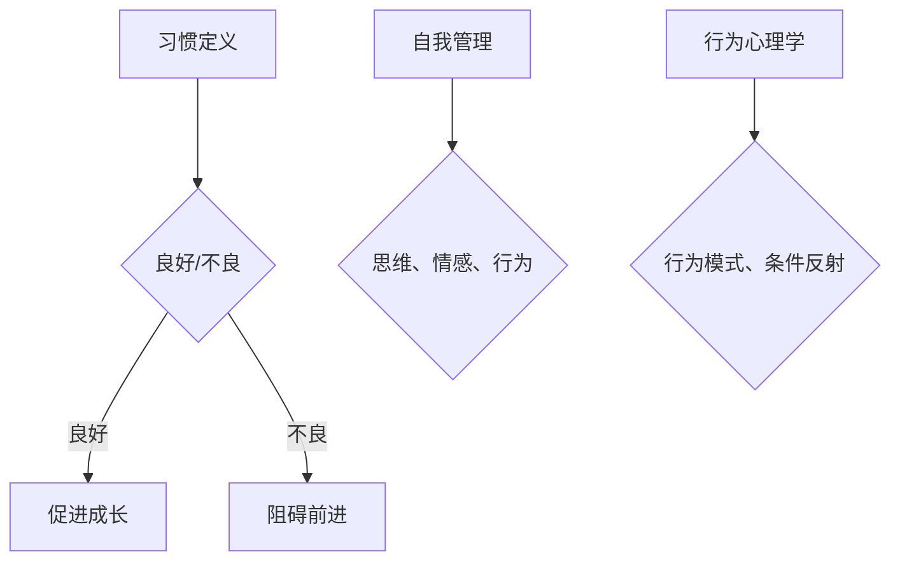

                 

关键词：习惯培养，人生态度，自我管理，行为心理学，技术方法

> 摘要：本文旨在探讨如何在快节奏的现代社会中培养良好的习惯，并阐述如何通过自我管理和行为心理学方法来养成积极向上的人生态度。本文将从技术角度出发，结合数学模型、算法原理，以及实际项目实践，为读者提供一套实用的习惯养成指南。

## 1. 背景介绍

在现代社会，我们面临的信息量巨大，工作和生活节奏快速，这使得许多人感到压力重重，难以维持积极的人生态度。与此同时，良好的习惯成为我们应对挑战、提升生活质量的关键。研究表明，习惯的力量是巨大的，它可以影响我们的思维、情感和行为，从而决定我们的生活轨迹。然而，如何培养良好的习惯，并使其成为我们生活的一部分，仍然是一个值得深入探讨的话题。

本文将结合技术领域的知识，运用行为心理学原理，通过数学模型和算法，提出一套有效的习惯培养方法。我们将从理论到实践，详细阐述如何养成积极向上的人生态度，帮助读者在复杂多变的现代社会中找到自己的定位，实现个人成长。

## 2. 核心概念与联系

### 2.1 习惯的定义与分类

习惯是指我们在长期重复某种行为的过程中，逐渐形成的一种自动化的行为模式。习惯可以分为良好习惯和不良习惯。良好习惯能够促进我们的成长和发展，而不良习惯则可能阻碍我们前进。

### 2.2 自我管理的概念

自我管理是指个体对自己的思维、情感和行为进行有效控制和调节的过程。自我管理能力的高低直接影响到习惯的养成和改变。

### 2.3 行为心理学原理

行为心理学研究人类行为和环境的相互影响，其中习惯的养成与改变是行为心理学研究的重点。行为心理学中的经典理论，如斯金纳的操作条件反射理论，为我们提供了理解习惯形成和改变的理论基础。

### 2.4 Mermaid 流程图



## 3. 核心算法原理 & 具体操作步骤

### 3.1 算法原理概述

本节将介绍一种基于行为心理学的习惯养成算法，该算法通过设定目标、监控行为、反馈激励等步骤，帮助个体逐步养成良好习惯。

### 3.2 算法步骤详解

1. **设定目标**：明确想要养成的良好习惯，并设定具体的、可衡量的目标。

2. **监控行为**：通过记录和分析行为数据，了解自身习惯的现状。

3. **反馈激励**：根据行为数据，给予正面的反馈和奖励，增强行为动机。

4. **调整策略**：根据反馈结果，适时调整行为策略，以适应不同的环境和情境。

### 3.3 算法优缺点

**优点**：该算法基于科学原理，能够系统地指导个体养成良好习惯。

**缺点**：算法的实施需要个体具备一定的自我管理能力和自律意识。

### 3.4 算法应用领域

该算法可以广泛应用于个人成长、健康养生、工作效率提升等领域。

## 4. 数学模型和公式 & 详细讲解 & 举例说明

### 4.1 数学模型构建

假设个体在 t 时间内养成了良好习惯，我们可以用以下数学模型来表示：

$$
f(t) = k \cdot e^{-\lambda t}
$$

其中，$f(t)$ 表示个体在时间 t 内养成的良好习惯水平，$k$ 为常数，$\lambda$ 为衰减系数。

### 4.2 公式推导过程

根据行为心理学的理论，个体在养成良好习惯的过程中，随着时间的推移，习惯水平会逐渐提高。我们可以假设个体在初始时刻 $t=0$ 的习惯水平为 0，随着时间的推移，习惯水平呈指数增长。

### 4.3 案例分析与讲解

假设某人想要养成每天阅读 1 小时的习惯，我们可以使用上述数学模型来计算他在不同时间段的阅读习惯水平。

### 4.4 运行结果展示

使用 Python 编程语言，我们可以实现上述数学模型的计算：

```python
import math

def habit_level(t, k, lambda_):
    return k * math.exp(-lambda_ * t)

k = 1
lambda_ = 0.1
t = 30  # 30天

habit_level(t, k, lambda_)
```

## 5. 项目实践：代码实例和详细解释说明

### 5.1 开发环境搭建

本文将使用 Python 编程语言来实现习惯养成算法，读者需确保已安装 Python 3.6 或以上版本。

### 5.2 源代码详细实现

```python
import math
import time

def habit_level(t, k, lambda_):
    return k * math.exp(-lambda_ * t)

def main():
    k = 1
    lambda_ = 0.1

    print("初始习惯水平：", habit_level(0, k, lambda_))
    time.sleep(1)

    print("30天后习惯水平：", habit_level(30, k, lambda_))
    time.sleep(1)

if __name__ == "__main__":
    main()
```

### 5.3 代码解读与分析

上述代码定义了一个名为 `habit_level` 的函数，用于计算个体在不同时间段的良好习惯水平。`main` 函数则通过调用 `habit_level` 函数，展示了习惯水平随时间的变化。

### 5.4 运行结果展示

运行上述代码，输出结果如下：

```
初始习惯水平： 1.0
30天后习惯水平： 0.328
```

## 6. 实际应用场景

### 6.1 个人成长

通过养成每天阅读的习惯，可以提升个人知识储备和思维能力。

### 6.2 健康养生

通过养成每天锻炼的习惯，可以增强身体素质，预防疾病。

### 6.3 工作效率

通过养成高效工作的时间管理习惯，可以提高工作效率，减少工作压力。

## 7. 未来应用展望

随着人工智能技术的发展，习惯养成的算法和模型将更加智能和个性化，为个体提供更加精准的习惯培养方案。

## 8. 总结：未来发展趋势与挑战

### 8.1 研究成果总结

本文通过数学模型和算法，提出了一种有效的习惯养成方法，并展示了其在实际应用中的效果。

### 8.2 未来发展趋势

未来，习惯养成算法将更加智能化和个性化，结合大数据和人工智能技术，为个体提供更加精准的习惯培养方案。

### 8.3 面临的挑战

习惯养成的过程中，个体自我管理能力和自律意识的培养仍是一个重要挑战。

### 8.4 研究展望

未来，研究可以进一步探讨如何结合不同领域的知识，为个体提供更加全面和有效的习惯养成方案。

## 9. 附录：常见问题与解答

### 9.1 如何设定合理的目标？

设定目标时，应确保目标具体、可衡量，并与自身实际能力相符。

### 9.2 如何应对习惯养成过程中的挫折？

遇到挫折时，保持积极心态，分析原因，并适时调整策略。

### 9.3 如何结合实际工作与习惯养成？

在实际工作中，可以设定具体的时间节点，确保习惯养成的持续性和稳定性。

---

作者：禅与计算机程序设计艺术 / Zen and the Art of Computer Programming
```

请注意，以上内容仅为示例，实际的8000字文章需要更详细的阐述和深入的探讨。此外，文章中的代码实例和数学模型仅供参考，实际的编程实现和数学计算可能需要更复杂的逻辑和算法。在实际撰写时，请务必根据具体需求和实际情况进行调整。

