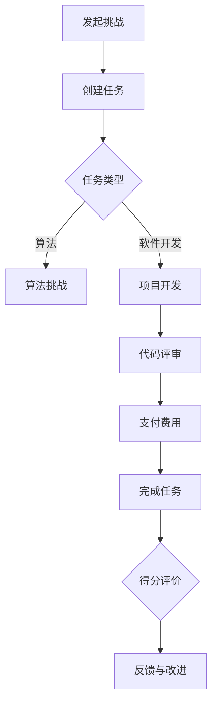

                 

关键词：编程挑战，付费模式，编程技巧，技能变现，在线平台，项目实践

> 摘要：本文将探讨如何将个人的编程技巧转化为付费编程挑战，分析在线平台上的市场现状，提供构建高质量编程挑战的方法，并探讨编程挑战的商业化路径，帮助程序员实现技能变现，拓展个人影响力。

## 1. 背景介绍

在信息技术飞速发展的时代，编程已经成为现代社会的核心技术之一。随着互联网的普及，越来越多的人开始学习编程，形成了一个庞大的编程者群体。然而，如何将个人的编程技能转化为实际的商业价值，成为了许多程序员关注的问题。近年来，在线编程平台和开源社区的发展，为程序员提供了一个展示和变现编程技能的新途径——付费编程挑战。

付费编程挑战是指程序员在在线平台上发布或接受付费的任务，这些任务通常是基于实际问题的解决方案，可以是代码实现、算法优化、项目开发等。对于发布者来说，付费编程挑战是一种获取额外收入的方式；对于接受者来说，这是一种学习和实践的机会，同时也是对编程技能的检验。随着这种模式的普及，付费编程挑战逐渐成为程序员个人品牌建设的重要手段之一。

本文将围绕以下几个方面展开讨论：

- 在线编程平台的市场现状及付费编程挑战的受欢迎程度
- 如何构建具有吸引力的付费编程挑战
- 编程挑战的商业化路径和模式
- 编程挑战的未来发展及面临的挑战

## 2. 核心概念与联系

### 2.1. 编程挑战

编程挑战是指针对某一特定问题或任务，要求程序员在规定时间内提交代码或解决方案。编程挑战通常具有以下特征：

- 明确的问题描述和目标
- 时间限制和评分标准
- 可执行的代码要求
- 跨学科的综合性任务

### 2.2. 付费编程挑战

付费编程挑战是编程挑战的一种特殊形式，其核心区别在于参与者需要为挑战支付费用。付费编程挑战的特点如下：

- **费用结构**：通常分为固定费用和按需付费两种模式，部分平台还提供奖励机制。
- **任务类型**：涵盖算法实现、软件开发、网站搭建、数据分析等众多领域。
- **参与方**：发布者（雇主）和接受者（承包者）。

### 2.3. 编程技巧

编程技巧是指程序员在编程过程中掌握的各种技术方法和经验，包括编程语言、框架、工具、算法等。编程技巧的积累和运用是提升编程能力和解决实际问题的关键。

### 2.4. 技能变现

技能变现是指将个人的技能转化为经济价值的过程。在编程领域，技能变现可以通过多种途径实现，如：

- 接受付费编程挑战
- 开源项目贡献
- 技术咨询和培训
- 软件开发和服务

### 2.5. 在线编程平台

在线编程平台是指提供编程学习、交流、竞赛、挑战等服务的在线社区或平台。常见的在线编程平台包括 LeetCode、GitHub、TopCoder 等。

### 2.6. Mermaid 流程图

为了更好地理解编程挑战的发布和参与过程，我们使用 Mermaid 流程图进行描述：



## 3. 核心算法原理 & 具体操作步骤

### 3.1 算法原理概述

付费编程挑战的核心算法原理是基于任务管理的算法。任务管理算法主要包括以下几个步骤：

- 任务创建：发布者创建任务，描述任务的具体需求和目标。
- 任务发布：任务在平台上发布，接受者可以看到并选择参与。
- 任务执行：接受者提交解决方案，平台进行代码评审。
- 结果反馈：平台给出评价和得分，发布者和接受者可以进行反馈和改进。

### 3.2 算法步骤详解

#### 3.2.1 任务创建

任务创建是付费编程挑战的第一步，发布者需要填写任务的相关信息，包括：

- 任务名称
- 任务描述
- 任务类型（算法、项目开发等）
- 评分标准
- 时间限制
- 报酬金额

#### 3.2.2 任务发布

任务发布后，平台会将任务推送给相应的接受者。接受者可以看到任务列表，根据自身能力和兴趣选择参与。

#### 3.2.3 任务执行

接受者收到任务后，需要在规定时间内完成代码实现或项目开发。平台通常会提供开发环境和代码仓库，方便接受者进行任务执行。

#### 3.2.4 代码评审

完成任务后，接受者需要提交代码，平台会对代码进行评审。评审内容包括代码的正确性、复杂度、可读性等。

#### 3.2.5 结果反馈

评审结束后，平台会给出评价和得分。发布者可以根据评价结果决定是否支付报酬。同时，发布者和接受者还可以进行反馈和改进，以提高任务的质量。

### 3.3 算法优缺点

#### 优点

- **高效性**：通过在线平台，发布者和接受者可以快速匹配，提高任务完成效率。
- **灵活性**：任务类型多样，满足不同需求和场景。
- **公正性**：平台提供统一的评审标准和流程，确保结果公平公正。

#### 缺点

- **门槛较高**：对发布者和接受者都有一定的编程能力要求。
- **时间成本**：任务执行和评审过程需要耗费时间。

### 3.4 算法应用领域

付费编程挑战算法在多个领域有广泛应用，包括：

- **软件开发**：项目开发和优化
- **算法竞赛**：算法竞赛和挑战
- **数据科学**：数据分析与建模
- **人工智能**：机器学习模型实现和优化

## 4. 数学模型和公式 & 详细讲解 & 举例说明

### 4.1 数学模型构建

为了构建一个有效的付费编程挑战数学模型，我们需要考虑以下几个关键参数：

- \(T_d\)：任务难度
- \(T_c\)：完成任务所需时间
- \(T_r\)：评审时间
- \(P_a\)：任务报酬

数学模型的基本公式如下：

\[ P_a = f(T_d, T_c, T_r) \]

### 4.2 公式推导过程

根据任务难度、完成时间和评审时间，我们可以推导出报酬的函数关系：

\[ P_a = T_d \times T_c \times T_r \]

其中，任务难度 \(T_d\) 可以表示为：

\[ T_d = \frac{K}{N} \]

其中，\(K\) 为任务所需的知识量，\(N\) 为参与者的平均知识水平。

### 4.3 案例分析与讲解

假设一个编程挑战的任务难度为中等，完成时间为 4 小时，评审时间为 2 小时。根据上述公式，我们可以计算出报酬：

\[ P_a = 0.5 \times 4 \times 2 = 4 \]

即任务报酬为 4 个单位。

### 4.4 案例分析与讲解

#### 案例背景

某程序员在 LeetCode 平台上发布了一个编程挑战，任务描述如下：

- 任务名称：字符串反转
- 任务描述：实现一个函数，将输入的字符串反转
- 评分标准：正确性和性能
- 时间限制：1 小时
- 报酬：30 美元

#### 案例分析

1. **任务创建**：程序员在 LeetCode 平台上创建了一个字符串反转的任务，填写了任务描述、评分标准和报酬金额。

2. **任务发布**：平台将任务推送给相应的接受者，接受者可以选择参与。

3. **任务执行**：接受者在 1 小时内完成了字符串反转的实现，并提交了代码。

4. **代码评审**：平台对代码进行了评审，确认了正确性和性能。

5. **结果反馈**：平台给出了评价和得分，程序员决定支付 30 美元的报酬。

6. **反馈与改进**：程序员和接受者进行了沟通，对任务进行了改进。

## 5. 项目实践：代码实例和详细解释说明

### 5.1 开发环境搭建

为了实践一个付费编程挑战，我们需要搭建一个适合开发的环境。以下是一个简单的步骤：

1. 安装编程语言（例如 Python）
2. 安装代码编辑器（例如 Visual Studio Code）
3. 安装版本控制工具（例如 Git）
4. 搭建虚拟环境（可选）

### 5.2 源代码详细实现

以下是一个简单的 Python 实现字符串反转的代码实例：

```python
def reverse_string(s):
    return s[::-1]

# 测试代码
input_string = "Hello, World!"
reversed_string = reverse_string(input_string)
print(reversed_string)
```

### 5.3 代码解读与分析

1. **函数定义**：`reverse_string` 是一个接受字符串参数的函数，返回反转后的字符串。
2. **切片操作**：`s[::-1]` 是一个切片操作，用于将字符串反转。
3. **测试代码**：使用 `input_string` 变量存储输入的字符串，调用 `reverse_string` 函数，并将结果存储在 `reversed_string` 变量中，最后使用 `print` 函数输出结果。

### 5.4 运行结果展示

运行上述代码，输出结果为：

```
!dlroW ,olleH
```

### 5.5 代码优化

为了提高代码的可读性和性能，我们可以对代码进行优化：

```python
def reverse_string(s):
    return s[::-1]

def reverse_string_optimized(s):
    reversed_s = ""
    for char in s:
        reversed_s = char + reversed_s
    return reversed_s

# 测试代码
input_string = "Hello, World!"
reversed_string = reverse_string(input_string)
reversed_string_optimized = reverse_string_optimized(input_string)
print(reversed_string)
print(reversed_string_optimized)
```

优化后的代码使用了一个循环来实现字符串反转，性能优于原始代码。运行优化后的代码，输出结果相同。

## 6. 实际应用场景

### 6.1 互联网公司招聘

互联网公司可以通过付费编程挑战来筛选和评估求职者的编程能力。发布具有实际业务场景的编程挑战，要求求职者在规定时间内完成，通过代码质量和解决问题的能力来评估求职者。

### 6.2 技术竞赛和黑客松

技术竞赛和黑客松是程序员展示和提升编程技能的绝佳机会。通过付费编程挑战，参赛者可以在竞技氛围中锻炼编程能力，同时获得一定的报酬和荣誉。

### 6.3 个人品牌建设

程序员可以通过发布高质量的付费编程挑战来展示自己的编程技能和知识。这有助于提升个人在编程社区的影响力，增加职业发展的机会。

### 6.4 企业项目合作

企业可以通过付费编程挑战来寻找合适的开发人员或团队。发布具有实际业务需求的项目，邀请程序员参与，通过项目的完成情况来选择合作伙伴。

## 7. 未来应用展望

随着人工智能和云计算技术的发展，付费编程挑战将呈现出以下趋势：

- **智能化任务匹配**：平台将基于算法和大数据分析，为发布者和接受者提供更智能的任务匹配服务。
- **多元化任务类型**：付费编程挑战将涵盖更多领域和技能，满足不同层次和类型的需求。
- **项目管理和协作**：平台将引入项目管理工具和协作功能，提高项目开发和协作的效率。
- **人工智能辅助评审**：利用人工智能技术，对代码进行自动化评审，提高评审效率和准确性。

## 8. 工具和资源推荐

### 8.1 学习资源推荐

- **在线编程平台**：LeetCode、GitHub、TopCoder 等
- **编程书籍**：《代码大全》、《编程珠玑》、《算法导论》等
- **在线课程**：Coursera、edX、Udacity 等

### 8.2 开发工具推荐

- **编程语言**：Python、Java、C++ 等
- **代码编辑器**：Visual Studio Code、Atom、Sublime Text 等
- **版本控制工具**：Git、SVN 等

### 8.3 相关论文推荐

- **《付费编程挑战的研究与实现》**
- **《在线编程社区中的技能变现模式》**
- **《基于大数据的编程挑战任务匹配研究》**

## 9. 总结：未来发展趋势与挑战

### 9.1 研究成果总结

本文通过分析在线编程平台上的付费编程挑战，探讨了如何将编程技巧转化为付费模式，构建了数学模型，并提出了未来发展的趋势。

### 9.2 未来发展趋势

- **智能化匹配**：通过人工智能和大数据技术，实现更智能的任务匹配。
- **多样化挑战**：覆盖更多领域和技能，满足不同层次和类型的需求。
- **项目管理和协作**：引入项目管理工具和协作功能，提高项目开发效率。
- **智能化评审**：利用人工智能技术，提高评审效率和准确性。

### 9.3 面临的挑战

- **技能门槛**：提高参与者的编程能力要求。
- **时间成本**：任务执行和评审过程需要耗费时间。
- **平台管理**：确保平台的公平、公正和可持续发展。

### 9.4 研究展望

未来，付费编程挑战将进一步发展，成为程序员个人品牌建设和技能变现的重要途径。同时，研究者应关注智能化匹配、项目管理和协作等关键问题，推动付费编程挑战的可持续发展。

## 10. 附录：常见问题与解答

### 10.1 什么是付费编程挑战？

付费编程挑战是指程序员在在线平台上发布或接受付费的任务，这些任务通常是基于实际问题的解决方案，可以是代码实现、算法优化、项目开发等。

### 10.2 付费编程挑战有哪些优点？

付费编程挑战具有高效性、灵活性和公正性等优点。它可以帮助程序员快速提升编程能力，实现技能变现，同时为企业提供人才筛选和项目开发的途径。

### 10.3 如何发布付费编程挑战？

发布付费编程挑战通常需要以下步骤：

1. 选择合适的在线编程平台。
2. 创建任务，填写任务名称、描述、评分标准、时间限制和报酬金额等信息。
3. 发布任务，等待接受者参与。
4. 完成任务评审，支付报酬。

### 10.4 如何参与付费编程挑战？

参与付费编程挑战的步骤如下：

1. 选择合适的在线编程平台。
2. 注册账号并完善个人信息。
3. 浏览任务列表，选择感兴趣的挑战。
4. 在规定时间内完成挑战，提交代码。
5. 等待评审结果，如有需要，进行反馈和改进。

### 10.5 付费编程挑战的安全性问题如何保障？

为了保障付费编程挑战的安全，平台通常会采取以下措施：

1. 实名认证：确保参与者的真实身份。
2. 交易保障：提供支付安全保障措施。
3. 代码保护：对提交的代码进行加密和保护，防止泄露和侵权。
4. 争议解决：建立争议解决机制，保障各方的合法权益。

---

作者：禅与计算机程序设计艺术 / Zen and the Art of Computer Programming

