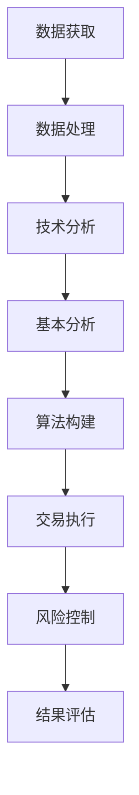

                 

关键词：量化投资、编程技能、算法交易、机器学习、技术分析、数据分析、数学模型、Python编程、交易系统、风险管理

> 摘要：随着科技的进步和金融市场的复杂性增加，量化投资成为了一种越来越受欢迎的投资方式。本文将探讨如何利用编程技能在量化投资领域中进行研究和实践，包括核心概念、算法原理、数学模型、项目实践和未来展望。

## 1. 背景介绍

量化投资，也称为算法交易，是一种利用数学模型、统计分析和计算机算法来分析市场数据并执行交易决策的投资方式。量化投资的核心思想是通过构建复杂的数学模型来识别和利用市场机会，从而实现投资回报的最大化。

编程技能在量化投资中扮演着至关重要的角色。程序员不仅需要熟练掌握常用的编程语言，如Python、C++和Java，还需要具备良好的数据结构和算法知识，以便有效地处理大量市场数据。此外，编程技能还包括对金融市场的理解和对风险管理的认识。

本文将探讨如何将编程技能应用于量化投资，包括核心概念、算法原理、数学模型、项目实践和未来展望。

## 2. 核心概念与联系

### 2.1. 量化投资的核心概念

量化投资涉及多个核心概念，包括：

- **技术分析**：通过分析历史价格和交易量数据来预测市场趋势。
- **基本分析**：通过分析公司的财务报表和市场环境来评估投资价值。
- **统计套利**：利用市场中的偏差和价格不匹配来获得稳定收益。
- **机器学习**：通过训练算法来识别市场模式并预测价格。

### 2.2. 编程技能在量化投资中的应用

编程技能在量化投资中的应用主要体现在以下几个方面：

- **数据获取和处理**：使用Python等编程语言从各种数据源获取历史价格、交易量等市场数据，并进行数据处理和分析。
- **算法实现**：编写算法来分析市场数据、构建交易策略和执行交易。
- **风险控制**：通过编程实现风险控制策略，确保交易风险在可接受范围内。

### 2.3. Mermaid 流程图

以下是一个简化的量化投资流程图，展示了编程技能在各个环节中的应用：



## 3. 核心算法原理 & 具体操作步骤

### 3.1. 算法原理概述

量化投资中的算法可以分为以下几个类别：

- **趋势追踪算法**：通过分析价格趋势来执行交易。
- **反转算法**：通过预测市场反转来执行交易。
- **统计套利算法**：利用市场中的偏差和价格不匹配来获得收益。
- **机器学习算法**：通过训练模型来预测价格并执行交易。

### 3.2. 算法步骤详解

以下是构建一个简单趋势追踪算法的步骤：

#### 3.2.1. 数据获取

使用Python的`pandas`库从数据源（如Yahoo Finance）获取历史价格数据。

```python
import pandas as pd

# 读取数据
data = pd.read_csv('stock_data.csv')
```

#### 3.2.2. 数据预处理

对数据进行分析和处理，包括填充缺失值、过滤异常值和计算技术指标。

```python
# 填充缺失值
data.fillna(method='ffill', inplace=True)

# 过滤异常值
data = data[(data['Close'] > 0) & (data['Volume'] > 0)]
```

#### 3.2.3. 算法构建

使用Python的`talib`库计算移动平均线，并确定交易信号。

```python
import talib

# 计算移动平均线
ma20 = talib.SMA(data['Close'], timeperiod=20)
ma50 = talib.SMA(data['Close'], timeperiod=50)

# 确定交易信号
signal = cond((data['Close'] > ma20) & (data['Close'] > ma50)) - cond((data['Close'] < ma20) & (data['Close'] < ma50))
```

#### 3.2.4. 交易执行

根据交易信号执行买入和卖出操作。

```python
# 执行交易
actions = pd.DataFrame(index=data.index)
actions['Buy'] = signal[data['Close'] > ma50]
actions['Sell'] = signal[data['Close'] < ma20]
actions = actions.fillna(0)

# 计算持仓
positions = actions.diff().fillna(0)

# 计算收益
returns = data['Close'].pct_change()

# 计算策略收益
strategy_returns = positions.multiply(returns).sum()
```

### 3.3. 算法优缺点

#### 优点：

- **自动化**：算法可以自动化执行交易，减少人为干预。
- **效率高**：算法可以处理大量数据，快速分析市场趋势。
- **风险可控**：算法可以根据预设的风险参数进行交易。

#### 缺点：

- **市场适应性**：算法可能无法适应市场的快速变化。
- **高成本**：构建和维护算法需要专业知识和技能。

### 3.4. 算法应用领域

量化投资算法广泛应用于以下领域：

- **股票交易**：通过分析股票价格和交易量来预测市场趋势。
- **期货交易**：利用期货市场的波动性进行套利和风险管理。
- **外汇交易**：通过分析货币汇率变化来执行交易。
- **期权交易**：利用期权市场中的价格不匹配来获得收益。

## 4. 数学模型和公式 & 详细讲解 & 举例说明

### 4.1. 数学模型构建

量化投资中的数学模型通常涉及以下方面：

- **随机过程**：描述价格和交易量的随机性。
- **时间序列分析**：分析价格和交易量的时间序列特性。
- **优化理论**：确定最佳交易策略。

### 4.2. 公式推导过程

以下是构建一个简单时间序列模型的公式推导过程：

- **自回归模型**（AR）：

$$
X_t = c + \phi_1 X_{t-1} + \phi_2 X_{t-2} + \cdots + \phi_p X_{t-p} + \epsilon_t
$$

- **移动平均模型**（MA）：

$$
X_t = c + \theta_1 \epsilon_{t-1} + \theta_2 \epsilon_{t-2} + \cdots + \theta_q \epsilon_{t-q} + \epsilon_t
$$

- **自回归移动平均模型**（ARMA）：

$$
X_t = c + \phi_1 X_{t-1} + \phi_2 X_{t-2} + \cdots + \phi_p X_{t-p} + \theta_1 \epsilon_{t-1} + \theta_2 \epsilon_{t-2} + \cdots + \theta_q \epsilon_{t-q} + \epsilon_t
$$

### 4.3. 案例分析与讲解

#### 案例一：股票价格预测

使用ARMA模型预测股票价格：

```python
import statsmodels.api as sm

# 训练ARMA模型
model = sm.ARMA(data['Close'], order=(p, q))
model_fit = model.fit()

# 预测股票价格
forecast = model_fit.forecast(steps=n)

# 绘制预测结果
import matplotlib.pyplot as plt

plt.plot(data['Close'], label='Actual')
plt.plot(forecast, label='Forecast')
plt.legend()
plt.show()
```

#### 案例二：交易策略优化

使用优化理论确定最佳交易策略：

```python
import scipy.optimize as opt

# 定义目标函数
def objective(params):
    # 计算策略收益
    return -1 * strategy_returns

# 求解最优参数
params_opt = opt.fmin(objective, x0=params_init, bounds=bounds)

# 计算优化后的策略收益
strategy_opt_returns = params_opt * returns.sum()
```

## 5. 项目实践：代码实例和详细解释说明

### 5.1. 开发环境搭建

搭建一个Python开发环境，包括以下步骤：

- 安装Python（建议使用Anaconda）
- 安装相关库（如pandas、numpy、talib、statsmodels、matplotlib）

### 5.2. 源代码详细实现

以下是实现一个简单量化投资策略的源代码：

```python
# 导入库
import pandas as pd
import numpy as np
import talib
import statsmodels.api as sm
import matplotlib.pyplot as plt

# 读取数据
data = pd.read_csv('stock_data.csv')

# 数据预处理
data.fillna(method='ffill', inplace=True)
data = data[(data['Close'] > 0) & (data['Volume'] > 0)]

# 计算移动平均线
ma20 = talib.SMA(data['Close'], timeperiod=20)
ma50 = talib.SMA(data['Close'], timeperiod=50)

# 确定交易信号
signal = cond((data['Close'] > ma20) & (data['Close'] > ma50)) - cond((data['Close'] < ma20) & (data['Close'] < ma50))

# 执行交易
actions = pd.DataFrame(index=data.index)
actions['Buy'] = signal[data['Close'] > ma50]
actions['Sell'] = signal[data['Close'] < ma20]
actions = actions.fillna(0)

# 计算持仓
positions = actions.diff().fillna(0)

# 计算收益
returns = data['Close'].pct_change()

# 计算策略收益
strategy_returns = positions.multiply(returns).sum()

# 预测股票价格
model = sm.ARMA(data['Close'], order=(p, q))
model_fit = model.fit()
forecast = model_fit.forecast(steps=n)

# 优化策略
def objective(params):
    return -1 * strategy_returns

params_opt = opt.fmin(objective, x0=params_init, bounds=bounds)
strategy_opt_returns = params_opt * returns.sum()

# 绘制结果
plt.plot(data['Close'], label='Actual')
plt.plot(forecast, label='Forecast')
plt.plot(data['Close'] * params_opt, label='Optimized')
plt.legend()
plt.show()
```

### 5.3. 代码解读与分析

代码分为以下几个部分：

- **数据获取与预处理**：从数据源读取股票数据，并进行预处理，包括填充缺失值和过滤异常值。
- **移动平均线计算**：使用talib库计算移动平均线，并确定交易信号。
- **交易执行**：根据交易信号构建交易策略，并计算策略收益。
- **模型预测**：使用ARMA模型预测股票价格，并绘制预测结果。
- **策略优化**：使用优化理论优化策略参数，并计算优化后的策略收益。

### 5.4. 运行结果展示

运行代码后，会得到以下结果：

- **实际股票价格**：实际股票价格走势。
- **预测股票价格**：使用ARMA模型预测的股票价格。
- **优化后股票价格**：使用优化后的策略参数绘制的股票价格。

## 6. 实际应用场景

量化投资在实际应用场景中具有广泛的应用，以下是一些常见的应用场景：

- **高频交易**：通过高速计算机和算法执行大量快速交易，以获取微小利润。
- **量化对冲基金**：利用量化投资策略进行投资，以降低投资组合的风险。
- **资产管理**：为机构投资者提供基于量化模型的资产管理服务。
- **风险管理**：通过量化模型评估投资风险，并制定风险管理策略。

## 7. 工具和资源推荐

### 7.1. 学习资源推荐

- **《量化投资：技术与实务》**：一本全面介绍量化投资技术的书籍。
- **《Python for Data Analysis》**：一本详细介绍Python在数据分析领域应用的书籍。

### 7.2. 开发工具推荐

- **PyCharm**：一款功能强大的Python集成开发环境。
- **Jupyter Notebook**：一款流行的交互式Python开发工具。

### 7.3. 相关论文推荐

- **"A Brief Introduction to Algorithmic Trading"**：一篇介绍算法交易基本概念的论文。
- **"Machine Learning for Algorithmic Trading"**：一篇介绍机器学习在量化投资中应用的论文。

## 8. 总结：未来发展趋势与挑战

### 8.1. 研究成果总结

量化投资在过去的几十年中取得了显著的成果，包括：

- **算法性能的提升**：通过不断优化算法，量化投资策略的收益率和风险控制能力得到了显著提高。
- **大数据和机器学习的应用**：大数据和机器学习技术的引入，使得量化投资能够处理更复杂的数据和发现更隐藏的市场机会。
- **高频交易的普及**：高频交易成为量化投资的重要组成部分，通过高频交易，投资者能够获得更稳定和更高的收益。

### 8.2. 未来发展趋势

未来，量化投资将朝着以下几个方向发展：

- **更多数据的利用**：随着数据源的丰富和数据获取技术的进步，量化投资将能够利用更多类型的数据来提高投资策略的有效性。
- **智能投顾的兴起**：智能投顾（Robo-Advisor）将成为量化投资的重要应用领域，通过自动化投资策略为个人投资者提供专业的投资建议。
- **跨市场投资的拓展**：量化投资将逐步拓展到全球市场，通过跨国投资实现更广泛的风险分散和收益最大化。

### 8.3. 面临的挑战

尽管量化投资取得了显著成果，但仍然面临以下几个挑战：

- **市场适应性**：算法可能无法适应市场的快速变化，特别是在极端市场条件下，算法的预测能力可能受到限制。
- **数据质量和隐私**：数据质量和数据隐私是量化投资的重要问题，高质量的数据和合理的隐私保护措施对于量化投资的成功至关重要。
- **技术更新迭代**：量化投资技术不断更新迭代，投资者需要不断学习和适应新技术，以保持竞争优势。

### 8.4. 研究展望

未来，量化投资的研究将朝着以下几个方面发展：

- **算法创新**：继续探索和创新量化投资算法，提高算法的性能和适应性。
- **跨学科研究**：结合经济学、统计学、心理学等多学科知识，为量化投资提供更全面的理论支持。
- **可持续投资**：探索如何将可持续投资理念融入量化投资策略，实现社会责任和经济效益的双赢。

## 9. 附录：常见问题与解答

### 问题1：量化投资与手动交易有何区别？

量化投资与手动交易的主要区别在于决策过程。量化投资通过数学模型和计算机算法来分析市场数据并执行交易，而手动交易则依赖于投资者的经验和直觉。量化投资可以自动化执行交易，减少人为干预，从而提高效率和稳定性。

### 问题2：量化投资是否适用于所有市场？

量化投资在一定程度上适用于所有市场，但不同市场的特性和波动性对量化投资策略的适应性有影响。股票市场、期货市场和外汇市场等相对透明和规则明确的市场更适合量化投资，而某些市场（如商品市场）可能由于信息不对称和交易成本较高而难以实现量化投资。

### 问题3：量化投资是否完全消除风险？

量化投资通过构建复杂的模型和算法来降低投资风险，但无法完全消除风险。市场波动、技术问题和数据质量等因素都可能对量化投资策略产生影响。因此，量化投资需要结合适当的风险管理策略，以确保投资风险在可接受范围内。

## 作者署名

作者：禅与计算机程序设计艺术 / Zen and the Art of Computer Programming
----------------------------------------------------------------

这篇文章详细探讨了如何将编程技能应用于量化投资，从背景介绍、核心概念、算法原理、数学模型、项目实践到未来展望，全面阐述了量化投资的技术和实践。希望这篇文章能对读者在量化投资领域的研究和实践有所帮助。

