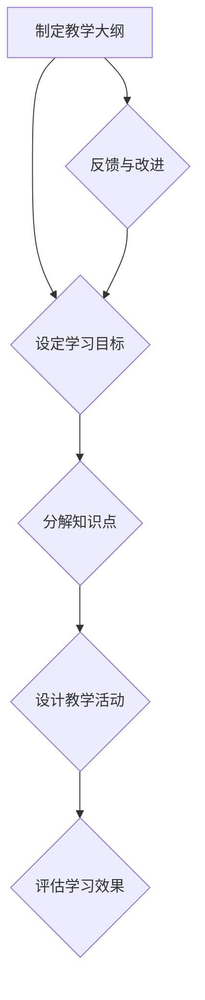
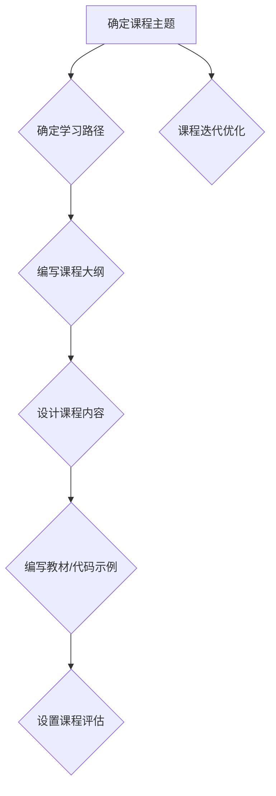
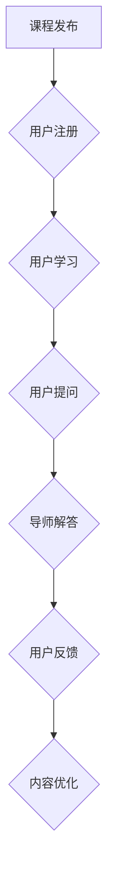

                 

 **关键词**：编程技能、在线编程训练营、教学策略、代码实例、技术资源

**摘要**：随着互联网的普及，在线编程训练营成为越来越多编程爱好者和专业人士的学习选择。本文将探讨如何将个人编程技能转化为成功的在线编程训练营，包括教学策略、课程设计、技术资源利用等方面，帮助开发者实现知识的传播与共享。

## 1. 背景介绍

在信息技术飞速发展的今天，编程已经成为现代社会不可或缺的技能。随着在线教育平台的兴起，越来越多的编程爱好者选择通过在线编程训练营来提升自己的编程能力。这种形式的学习不仅方便灵活，还可以接触到全球顶尖的编程资源。对于拥有编程技能的个人来说，创建在线编程训练营不仅能够实现知识变现，还能为更多人提供学习机会，促进整个编程社区的共同进步。

然而，将个人编程技能转化为在线编程训练营并非易事。需要明确的是，这不仅仅是技术问题，更涉及到教学策略、课程设计、用户体验等多个方面。因此，本文将围绕这些核心问题，提供一套系统的解决方案，帮助编程爱好者或专业人士顺利开展在线编程训练营。

## 2. 核心概念与联系

### 2.1 教学策略

**Mermaid 流程图：**



### 2.2 课程设计

**Mermaid 流程图：**



### 2.3 用户互动

**Mermaid 流程图：**



## 3. 核心算法原理 & 具体操作步骤

### 3.1 算法原理概述

在线编程训练营的成功离不开良好的教学策略和课程设计。教学策略是指导师如何有效地将知识传授给学生的方法论。它包括学习目标的设定、知识点的分解、教学活动的组织以及学习效果的评估等多个方面。有效的教学策略能够提高学生的学习效率，促进知识的内化。

### 3.2 算法步骤详解

#### 3.2.1 制定教学大纲

1. **确定课程主题**：选择一个具体且具有吸引力的编程主题，如“Python 数据分析入门”。
2. **设定学习目标**：明确学生通过本课程能学到哪些具体技能，如掌握数据类型、熟悉 NumPy 和 Pandas 库等。
3. **分解知识点**：将学习目标分解为若干个具体知识点，如“了解 Python 的基本语法”。
4. **设计教学活动**：根据知识点设计相应的教学活动，如讲授、练习、讨论等。
5. **评估学习效果**：通过作业、测验等手段，评估学生对知识点的掌握情况。

#### 3.2.2 课程设计

1. **编写课程大纲**：明确课程的总体结构，包括课程名称、目标、内容安排等。
2. **设计课程内容**：围绕教学大纲，编写详细的教学内容，包括理论讲解、实例代码、练习题等。
3. **设置课程评估**：设计作业、测验等评估手段，确保学生对知识的掌握。

### 3.3 算法优缺点

**优点：**

- **灵活性**：在线编程训练营可以随时随地进行，学习者可以根据自己的时间安排学习。
- **个性化**：可以根据学习者的进度和需求，提供个性化的教学服务。
- **资源丰富**：可以借助互联网资源，如在线文档、视频教程等，丰富课程内容。

**缺点：**

- **自律性要求高**：在线学习需要学习者具备较高的自律性，否则容易半途而废。
- **互动性不足**：相较于传统课堂，在线课堂的互动性较差，可能影响教学效果。

### 3.4 算法应用领域

- **职业培训**：企业可以开展在线编程训练营，提升员工的技能水平。
- **素质教育**：学校可以开设在线编程课程，培养学生创新思维和解决问题的能力。
- **兴趣爱好**：编程爱好者可以通过在线编程训练营，深入学习和交流。

## 4. 数学模型和公式 & 详细讲解 & 举例说明

### 4.1 数学模型构建

在线编程训练营的成功离不开科学的课程设计和教学策略。以下是一个简化的数学模型，用于描述课程设计的流程。

$$
\text{课程设计} = f(\text{学习目标}, \text{知识点分解}, \text{教学活动设计}, \text{评估手段})
$$

### 4.2 公式推导过程

1. **确定学习目标**：根据学习者的需求和课程主题，设定具体的学习目标。
2. **分解知识点**：将学习目标分解为若干个具体知识点，确保每个知识点都是可衡量的。
3. **设计教学活动**：根据知识点设计相应的教学活动，如理论讲解、实例分析、练习等。
4. **设置评估手段**：设计作业、测验等评估手段，以检验学习者的掌握情况。

### 4.3 案例分析与讲解

假设我们设计一个名为“Python 基础入门”的课程，学习目标为掌握 Python 的基本语法和数据类型。

1. **确定学习目标**：设定以下学习目标：
   - 掌握 Python 的基本语法。
   - 熟悉 Python 的数据类型。

2. **分解知识点**：将学习目标分解为以下知识点：
   - Python 的变量和赋值。
   - Python 的数据类型（整数、浮点数、字符串等）。

3. **设计教学活动**：设计以下教学活动：
   - 讲解 Python 的基本语法和变量使用。
   - 通过实例演示 Python 的数据类型及其操作。

4. **设置评估手段**：设置以下评估手段：
   - 课后作业：编写简单的 Python 脚本。
   - 测验：测试对 Python 基本语法和数据类型的掌握情况。

通过上述步骤，我们构建了一个简化的课程设计模型，并进行了实际案例的分析。

## 5. 项目实践：代码实例和详细解释说明

### 5.1 开发环境搭建

在进行在线编程训练营的准备工作时，首先需要搭建一个合适的开发环境。以下是一个简单的 Python 开发环境搭建步骤：

1. **安装 Python 解释器**：在 [Python 官网](https://www.python.org/downloads/) 下载并安装合适的 Python 版本。
2. **配置 Python 环境变量**：在系统环境变量中配置 Python 解释器的路径。
3. **安装必备的 Python 库**：使用 `pip` 工具安装必要的 Python 库，如 NumPy、Pandas 等。

### 5.2 源代码详细实现

以下是一个简单的 Python 代码实例，用于演示如何使用 NumPy 库进行数据操作。

```python
import numpy as np

# 创建一个一维数组
array_1d = np.array([1, 2, 3, 4, 5])

# 打印数组
print("原始数组：", array_1d)

# 计算数组之和
sum_value = np.sum(array_1d)
print("数组之和：", sum_value)

# 计算数组平均值
avg_value = np.mean(array_1d)
print("数组平均值：", avg_value)
```

### 5.3 代码解读与分析

在上面的代码中，我们首先导入了 NumPy 库。然后创建了一个包含五个整数的一维数组。接着，我们使用了 NumPy 的 `sum()` 和 `mean()` 函数来计算数组的和与平均值。

- `np.array([1, 2, 3, 4, 5])`：创建一个包含整数 1、2、3、4、5 的一维数组。
- `np.sum(array_1d)`：计算数组的和。
- `np.mean(array_1d)`：计算数组的平均值。

通过这个简单的实例，我们可以看到如何使用 Python 和 NumPy 库进行基本的数据操作。

### 5.4 运行结果展示

运行上述代码后，我们将得到以下输出结果：

```
原始数组： [1 2 3 4 5]
数组之和： 15
数组平均值： 3.0
```

这些结果表明我们成功创建了一个数组，并计算出了其和与平均值。

## 6. 实际应用场景

### 6.1 职业培训

许多企业和机构都希望通过在线编程训练营来提升员工的技能。例如，一家科技公司可以开设针对其员工的 Python 编程训练营，帮助员工掌握数据分析、机器学习等相关技能。

### 6.2 素质教育

学校和教育机构可以开设在线编程课程，培养学生的编程兴趣和技能。例如，一所高中可以开设面向学生的 Python 编程入门课程，帮助学生掌握编程基础。

### 6.3 兴趣爱好

编程爱好者可以通过在线编程训练营深入学习和研究编程。例如，一位对人工智能感兴趣的开发者可以参加在线的深度学习训练营，学习相关理论和实践技能。

## 7. 工具和资源推荐

### 7.1 学习资源推荐

- **书籍**：推荐《Python 编程：从入门到实践》、《深度学习》等。
- **在线教程**：推荐 Coursera、edX、Udacity 等在线学习平台。
- **社区和论坛**：推荐 Stack Overflow、GitHub、Reddit 等。

### 7.2 开发工具推荐

- **集成开发环境（IDE）**：推荐 PyCharm、VS Code 等。
- **代码托管平台**：推荐 GitHub、GitLab 等。
- **版本控制工具**：推荐 Git。

### 7.3 相关论文推荐

- **深度学习领域**：《深度学习：方法与应用》、《神经网络的训练原理》等。
- **编程语言领域**：《Python 3 编程快速上手》、《C++ 从入门到精通》等。

## 8. 总结：未来发展趋势与挑战

### 8.1 研究成果总结

本文详细探讨了如何将个人编程技能转化为在线编程训练营。通过教学策略、课程设计、技术资源等多个方面的分析，提供了一套系统的解决方案，旨在帮助开发者成功开展在线编程教育。

### 8.2 未来发展趋势

随着互联网技术的不断进步，在线编程训练营将继续发挥重要作用。未来的发展趋势可能包括：

- **人工智能辅助教学**：利用人工智能技术，实现个性化教学和智能评估。
- **虚拟现实（VR）教学**：通过 VR 技术提升教学互动性和体验感。
- **开源课程平台**：更多的开源课程平台将涌现，促进知识的共享和传播。

### 8.3 面临的挑战

在线编程训练营在发展过程中也将面临一些挑战，如：

- **教学质量**：确保在线课程的教学质量，满足不同层次学习者的需求。
- **用户留存率**：提高用户留存率，确保课程能够持续吸引学习者。
- **技术更新**：及时跟进技术更新，保持课程内容的实用性和前瞻性。

### 8.4 研究展望

未来研究可以进一步探索以下几个方面：

- **混合式教学**：结合在线和线下教学，发挥各自优势。
- **跨学科融合**：将编程与其他学科如数学、物理等相结合，拓展课程内容。
- **社会责任**：关注在线编程训练营的社会影响，促进教育公平。

## 9. 附录：常见问题与解答

### Q: 如何确保在线编程训练营的教学质量？

A: 确保教学质量的几个关键点包括：

- **精心设计课程内容**：确保课程内容既有深度又具有实用性。
- **严格筛选导师**：选择经验丰富、教学能力强的导师。
- **持续教学评估**：定期进行教学评估，收集学生反馈，及时调整教学内容。

### Q: 在线编程训练营有哪些收费模式？

A: 常见的收费模式包括：

- **一次性收费**：学员一次性支付全部费用。
- **分期支付**：学员按课程进度分期支付费用。
- **会员制**：学员支付一定费用成为会员，享受课程优惠。

### Q: 如何提高在线编程训练营的用户留存率？

A: 提高用户留存率的策略包括：

- **优质教学内容**：提供高质量的课程内容，满足学员的学习需求。
- **互动性设计**：增加学员之间的互动，提升学习体验。
- **学习支持服务**：提供在线答疑、作业批改等支持服务。

通过以上措施，可以显著提高在线编程训练营的用户留存率。希望本文能为编程爱好者或专业人士提供有价值的参考。

### 作者署名

**作者：禅与计算机程序设计艺术 / Zen and the Art of Computer Programming**

