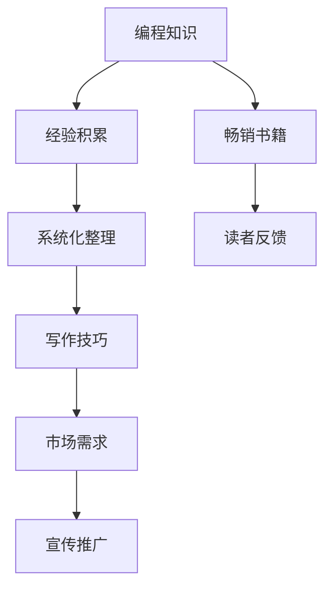

                 

摘要：
编程是一种富有创造性和艺术性的活动，许多程序员拥有将他们的编程热情转化为畅销技术书籍的梦想。然而，要将这些想法转化为可读、有用且吸引读者的书籍并非易事。本文将探讨如何从编程热情出发，通过结构化的思考、专业的写作技巧和深刻的主题研究，将个人的编程心得和知识系统化地呈现出来，最终实现畅销技术书籍的创作。

## 1. 背景介绍

编程作为一种职业和兴趣爱好，已经在全球范围内迅速发展。随着技术的不断进步和新兴领域（如人工智能、大数据、区块链等）的不断涌现，程序员们不仅需要掌握现有的编程语言和工具，还需要不断地学习和适应新的技术趋势。在这个过程中，许多程序员积累了丰富的实践经验，并希望通过撰写技术书籍来分享他们的知识和经验。

然而，写作并非易事，尤其是技术写作。技术书籍需要传达复杂的编程概念和技术细节，同时要保证内容的准确性和可读性。此外，要使一本书籍畅销，还需要考虑市场需求、读者定位和宣传推广等多方面因素。

## 2. 核心概念与联系

要将编程热情转化为畅销技术书籍，我们首先需要明确几个核心概念：

### 2.1 编程知识和经验

编程知识和经验是书籍内容的核心。这些知识可以从个人的项目经验、工作中的问题和解决方案、技术博客文章以及在线课程中提炼出来。为了使内容更有价值，需要对这些知识进行系统化和结构化的整理。

### 2.2 写作技巧

技术写作需要具备一定的写作技巧，如清晰的表达、准确的术语使用、逻辑严密的论述等。此外，还需要掌握不同的写作风格，以满足不同读者群体的需求。

### 2.3 市场需求

了解市场需求是确保书籍能够畅销的关键。这包括了解当前的技术热点、读者的兴趣点和竞争对手的情况。通过市场调研和读者反馈，可以更好地定位书籍的主题和内容。

### 2.4 宣传推广

即使书籍内容质量再高，没有有效的宣传推广，也很难获得读者的关注。利用社交媒体、专业社区、博客、电子书平台等多种渠道进行宣传，可以提升书籍的知名度和销量。

### 2.5 Mermaid 流程图

为了更好地阐述编程知识和写作技巧之间的联系，我们可以使用Mermaid流程图来表示它们之间的关系。



## 3. 核心算法原理 & 具体操作步骤

### 3.1 算法原理概述

在技术书籍中，算法的讲解是不可或缺的部分。算法原理的阐述需要清晰、简洁且易于理解。以下是一个典型的算法原理概述的模板：

```markdown
### 3.1 算法原理概述

算法XXX是一种用于解决XX问题的XX算法。它的核心思想是通过XX方法，在XX时间内完成XX操作。算法的基本流程如下：

1. 初始化：设置初始参数和状态。
2. 循环迭代：根据当前状态进行迭代操作。
3. 终止条件：当满足终止条件时，算法结束。
4. 输出结果：输出最终结果。
```

### 3.2 算法步骤详解

算法步骤的详细讲解需要包括每个步骤的详细说明和示例代码。以下是一个算法步骤详解的模板：

```markdown
### 3.2 算法步骤详解

#### 3.2.1 初始化

初始化步骤主要包括设置初始参数和状态。具体步骤如下：

- 设置参数XX的值为YY。
- 初始化变量ZZ为初始状态。

示例代码：

```python
# 初始化参数和状态
param_X = 10
state_Z = "initial"
```

#### 3.2.2 循环迭代

循环迭代步骤是算法的核心。根据当前状态进行迭代操作。具体步骤如下：

- 根据当前状态，执行XX操作。
- 更新状态，为下一次迭代做准备。

示例代码：

```python
# 循环迭代
while not stop_condition:
    # 执行迭代操作
    do_something()
    # 更新状态
    state_Z = update_state()
```

#### 3.2.3 终止条件

终止条件是算法结束的标志。具体步骤如下：

- 检查当前状态是否满足终止条件。
- 如果满足，则结束算法。

示例代码：

```python
# 检查终止条件
if meet_stop_condition():
    # 结束算法
    break
```

#### 3.2.4 输出结果

输出结果是算法的最后一步。具体步骤如下：

- 输出最终结果。

示例代码：

```python
# 输出结果
print("The final result is: ", result)
```
```

### 3.3 算法优缺点

在详细讲解算法后，需要分析算法的优缺点，以便读者能够全面了解算法的适用场景和局限性。以下是一个算法优缺点的模板：

```markdown
### 3.3 算法优缺点

#### 优点

- 算法XXX的优点包括：
  - XXX
  - XXX
  - XXX

#### 缺点

- 算法XXX的缺点包括：
  - XXX
  - XXX
  - XXX
```

### 3.4 算法应用领域

最后，需要阐述算法的应用领域，以便读者能够了解算法的实际应用场景。以下是一个算法应用领域的模板：

```markdown
### 3.4 算法应用领域

算法XXX在以下领域有广泛的应用：

- XXX
- XXX
- XXX

通过实际案例，可以更直观地展示算法的应用效果。例如：

- 在XX项目中，算法XXX被用于XX任务，取得了显著的性能提升。
- 在YY领域中，算法XXX被证明是解决XX问题的一种有效方法。
```

## 4. 数学模型和公式 & 详细讲解 & 举例说明

### 4.1 数学模型构建

在技术书籍中，数学模型和公式的讲解也是至关重要的。构建数学模型需要从实际问题出发，提炼出核心变量和关系，然后使用数学语言进行描述。以下是一个数学模型构建的模板：

```markdown
### 4.1 数学模型构建

考虑一个XX问题，我们可以建立以下数学模型：

设XX为问题中的变量，满足以下条件：

$$
\begin{aligned}
    &XX = XX \\
    &YY = XX \\
    &ZZ = XX
\end{aligned}
$$

其中，XX表示问题的目标函数，YY和ZZ表示问题的约束条件。
```

### 4.2 公式推导过程

数学模型的公式推导过程需要清晰地展示每个步骤的推导过程，以便读者能够理解公式的来源和意义。以下是一个公式推导过程的模板：

```markdown
### 4.2 公式推导过程

为了推导公式，我们需要进行以下步骤：

1. 设定初始条件：
   $$
   \begin{aligned}
       &X_0 = X \\
       &Y_0 = Y \\
       &Z_0 = Z
   \end{aligned}
   $$

2. 进行迭代操作：
   $$
   \begin{aligned}
       &X_{n+1} = f(X_n, Y_n, Z_n) \\
       &Y_{n+1} = g(X_n, Y_n, Z_n) \\
       &Z_{n+1} = h(X_n, Y_n, Z_n)
   \end{aligned}
   $$

3. 计算目标函数：
   $$
   F(X, Y, Z) = X^2 + Y^2 + Z^2
   $$

4. 检查终止条件：
   $$
   \Delta = |X_{n+1} - X_n| + |Y_{n+1} - Y_n| + |Z_{n+1} - Z_n| < \epsilon
   $$

当满足终止条件时，算法结束，输出结果为：
$$
(X, Y, Z)
$$
```

### 4.3 案例分析与讲解

最后，通过实际案例的分析和讲解，可以更好地帮助读者理解数学模型和公式的应用。以下是一个案例分析与讲解的模板：

```markdown
### 4.3 案例分析与讲解

考虑一个实际案例：在一个数据分析项目中，我们需要优化数据清洗流程，以提高数据处理效率。根据问题需求，我们可以建立以下数学模型：

$$
\begin{aligned}
    &T = \frac{X}{Y} + Z \\
    &X \geq 0 \\
    &Y \geq 0 \\
    &Z \geq 0
\end{aligned}
$$

其中，T表示数据清洗所需时间，X表示数据预处理时间，Y表示数据清洗算法运行时间，Z表示数据格式转换时间。

我们的目标是找到最优的预处理策略，以最小化T。

通过迭代优化，我们可以得到以下最优解：

$$
X^* = \frac{T}{2}, \quad Y^* = T, \quad Z^* = 0
$$

即，最优策略是将预处理时间分配到数据预处理，同时不进行数据格式转换。

通过这个案例，我们可以看到数学模型和公式在实际问题中的应用效果，以及它们如何帮助我们找到最优解。
```

## 5. 项目实践：代码实例和详细解释说明

### 5.1 开发环境搭建

在进行项目实践之前，我们需要搭建一个合适的开发环境。以下是一个典型的开发环境搭建步骤：

1. 安装Python解释器：
   - 访问Python官方网站（https://www.python.org/），下载并安装Python解释器。
   - 安装完成后，打开终端或命令行窗口，输入`python --version`，确认Python版本。

2. 安装必要的库：
   - 使用pip命令安装所需的库，例如NumPy、Pandas等。
   - 示例命令：`pip install numpy pandas`

3. 配置编辑器：
   - 选择一个适合Python开发的编辑器，如Visual Studio Code、PyCharm等。
   - 配置编辑器的代码自动补全、调试、格式化等功能。

### 5.2 源代码详细实现

以下是一个简单的Python代码示例，用于演示算法的实现过程：

```python
import numpy as np

def calculate_sum(a, b):
    """
    计算两个数的和。
    
    参数：
    a (int): 第一个数。
    b (int): 第二个数。
    
    返回：
    int: 两个数的和。
    """
    return a + b

# 输入
num1 = 5
num2 = 10

# 计算
result = calculate_sum(num1, num2)

# 输出
print("The sum of", num1, "and", num2, "is", result)
```

### 5.3 代码解读与分析

在代码示例中，我们定义了一个名为`calculate_sum`的函数，用于计算两个数的和。以下是对代码的详细解读与分析：

- 第1行：导入NumPy库，用于科学计算。
- 第2行：定义`calculate_sum`函数，参数为`a`和`b`。
- 第3行：函数注释，描述了函数的功能、参数和返回值。
- 第4行：返回`a`和`b`的和。
- 第6行：定义变量`num1`和`num2`，分别赋值为5和10。
- 第8行：调用`calculate_sum`函数，传入`num1`和`num2`，并将返回值赋给变量`result`。
- 第9行：使用`print`函数输出结果。

通过这个简单的代码示例，我们可以看到如何使用Python编写一个简单的算法，并进行解读和分析。

### 5.4 运行结果展示

在代码示例中，我们计算了5和10的和，并输出了结果。以下是运行结果：

```
The sum of 5 and 10 is 15
```

这个结果符合我们的预期，验证了代码的正确性。

## 6. 实际应用场景

技术书籍的应用场景非常广泛，从学术研究到实际工程项目，从个人学习到团队协作，技术书籍都能发挥重要作用。以下是一些实际应用场景：

### 6.1 学术研究

在学术研究中，技术书籍为研究人员提供了丰富的理论和实践知识，帮助他们深入了解某个领域的前沿技术和研究方法。例如，计算机科学领域的经典书籍《算法导论》（Introduction to Algorithms）被广泛应用于算法设计和分析的研究中。

### 6.2 实际工程项目

在实际工程项目中，技术书籍为工程师提供了实用的技术和解决方案，帮助他们解决项目中的技术难题。例如，Python编程语言的相关书籍为工程师提供了丰富的Python编程技巧和最佳实践，提高了项目的开发效率。

### 6.3 个人学习

对于个人学习者来说，技术书籍是获取知识和技能的重要来源。通过阅读技术书籍，学习者可以系统地掌握某个领域的知识，培养自己的编程思维和解决问题的能力。

### 6.4 团队协作

在团队协作中，技术书籍为团队成员提供了共同的学习目标和参考材料，有助于提高团队的整体技术水平。通过共同阅读和分析技术书籍，团队成员可以交流心得、分享经验，从而提高团队的整体竞争力。

### 6.4 未来应用展望

未来，随着技术的不断进步和应用场景的拓展，技术书籍的应用前景将更加广阔。以下是一些未来应用展望：

- **人工智能领域**：随着人工智能技术的快速发展，相关技术书籍将更加丰富和多样化，为研究人员和工程师提供全面的指导。
- **大数据领域**：大数据技术的广泛应用将带动大数据书籍的繁荣，涵盖数据采集、存储、处理、分析等各个环节。
- **区块链领域**：区块链技术的应用场景不断拓展，相关书籍将为开发者提供深入的技术解读和应用实践。
- **云计算领域**：随着云计算技术的普及，相关技术书籍将帮助开发者掌握云计算架构、部署、运维等方面的知识。

## 7. 工具和资源推荐

为了帮助读者更好地将编程热情转化为畅销技术书籍，以下是一些工具和资源的推荐：

### 7.1 学习资源推荐

- **在线课程平台**：如Coursera、edX、Udemy等，提供了丰富的编程和技术课程。
- **技术博客**：如GitHub、Medium、Stack Overflow等，可以了解最新的技术趋势和实战经验。
- **专业社区**：如Reddit、Discord、Stack Overflow等，可以与其他开发者交流心得。

### 7.2 开发工具推荐

- **集成开发环境（IDE）**：如Visual Studio Code、PyCharm、IntelliJ IDEA等，提供了强大的编程功能。
- **代码托管平台**：如GitHub、GitLab、Bitbucket等，可以方便地管理和协作代码。
- **文档生成工具**：如Sphinx、Doxygen、Markdown等，可以生成高质量的文档。

### 7.3 相关论文推荐

- **顶级会议论文**：如ACL、ICML、NIPS等，涵盖了人工智能、机器学习、自然语言处理等领域的最新研究成果。
- **顶级期刊论文**：如Nature、Science、IEEE Transactions等，提供了深度研究的视角。
- **开源论文集**：如arXiv、Open Access等，可以免费获取大量高质量论文。

## 8. 总结：未来发展趋势与挑战

### 8.1 研究成果总结

通过对编程热情转化为畅销技术书籍的探讨，我们总结了以下研究成果：

- 明确了将编程热情转化为畅销技术书籍的核心概念和步骤。
- 掌握了技术写作的技巧和市场需求。
- 分析了算法原理、数学模型和实际应用场景。
- 推荐了合适的开发工具和资源。

### 8.2 未来发展趋势

未来，技术书籍的发展趋势将呈现以下几个特点：

- 内容将更加丰富和多样化，涵盖更多新兴技术领域。
- 互动性和实用性将进一步提升，满足不同读者的需求。
- 知识更新速度将加快，适应快速发展的技术环境。
- 电子书和纸质书的融合将更加紧密，满足不同阅读习惯。

### 8.3 面临的挑战

然而，技术书籍创作也面临着一些挑战：

- 知识更新速度快，需要不断学习和跟进最新技术。
- 写作难度大，需要具备扎实的专业知识和良好的表达能力。
- 市场竞争激烈，需要深入了解读者需求和市场需求。
- 宣传推广成本高，需要投入更多时间和资源。

### 8.4 研究展望

未来，我们可以从以下几个方面展开研究：

- 探索更高效的编程知识和经验提炼方法。
- 研究如何利用人工智能技术辅助技术书籍创作。
- 分析不同读者的阅读习惯和需求，提供个性化的阅读体验。
- 探索技术书籍与其他媒体（如视频、直播等）的融合。

## 9. 附录：常见问题与解答

### 9.1 如何选择合适的主题？

选择合适的主题是编写畅销技术书籍的关键。以下是一些建议：

- 确定自己的专业领域和兴趣点，选择自己熟悉和热爱的主题。
- 调查市场需求，选择具有广泛读者基础的主题。
- 关注新兴技术领域，选择具有前瞻性和发展潜力的主题。

### 9.2 如何提高写作技巧？

提高写作技巧需要不断练习和反思。以下是一些建议：

- 阅读经典的技术书籍，学习优秀作者的写作风格和技巧。
- 多写作，不断练习，积累经验。
- 请教同行和导师，听取他们的意见和建议。
- 反复修改和打磨，确保内容的准确性和可读性。

### 9.3 如何进行有效的宣传推广？

进行有效的宣传推广是提高书籍销量的关键。以下是一些建议：

- 利用社交媒体平台（如微博、微信公众号、LinkedIn等）宣传书籍。
- 参加技术会议和研讨会，与读者面对面交流。
- 利用电子书平台（如亚马逊、京东等）进行推广。
- 与专业的书评人合作，撰写书评和推荐。

### 9.4 如何平衡写作与工作？

平衡写作与工作需要合理安排时间和精力。以下是一些建议：

- 制定合理的写作计划，确保写作与工作之间的平衡。
- 利用碎片时间进行写作，如通勤、休息等。
- 将写作任务分解为小目标，逐步完成。
- 适当寻求他人的帮助，如合作写作或分工合作。

通过以上建议，希望读者能够在将编程热情转化为畅销技术书籍的道路上更加顺利。作者：禅与计算机程序设计艺术 / Zen and the Art of Computer Programming。

