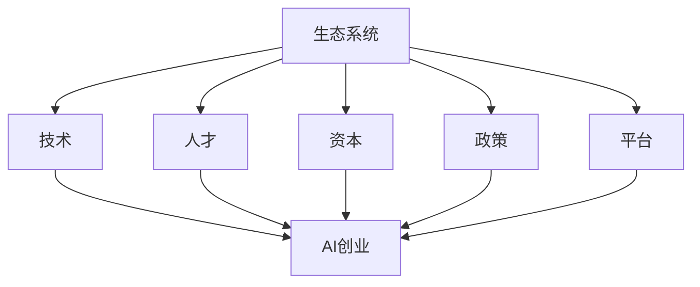

                 

  
## 1. 背景介绍

人工智能（AI）技术近年来取得了显著的进步，从智能家居到自动驾驶，从医疗诊断到金融分析，AI的应用场景越来越广泛。这一领域的快速发展不仅推动了技术创新，也激发了创业热情。许多创业者看到了AI所带来的巨大商机，纷纷投身于AI创业领域。然而，如何打造一个充满活力的AI创业生态系统，成为了一个关键问题。

一个充满活力的AI创业生态系统，不仅需要技术创新，还需要政策支持、资金投入、人才引进、产业链协同等各方面的支持。本文将从多个维度探讨如何打造这样一个生态系统，为AI创业者提供有益的参考。

### 2. 核心概念与联系

为了更好地理解如何打造AI创业生态系统，我们首先需要了解一些核心概念及其相互联系。

#### 2.1 生态系统

生态系统是指一个由生物、环境以及生物与环境相互作用组成的复杂系统。在创业领域，生态系统指的是由企业、投资者、政府、研究机构、高校等多方参与者共同构成的一个相互依存、协同发展的环境。

#### 2.2 AI创业

AI创业指的是创业者利用人工智能技术进行创新，开发新产品、新服务或新商业模式，以实现商业价值的过程。

#### 2.3 生态系统要素

一个健康的AI创业生态系统包括以下几个关键要素：

- **技术**：核心人工智能技术，如深度学习、自然语言处理、计算机视觉等。
- **人才**：具备AI技术背景和专业技能的人才。
- **资本**：风险投资、政府补贴、银行贷款等资金支持。
- **政策**：有利于AI创业的政策法规和指导方针。
- **平台**：提供技术支持、市场推广、人力资源服务的平台。

#### 2.4 Mermaid 流程图

以下是一个简化的Mermaid流程图，展示了这些核心概念之间的联系：



### 3. 核心算法原理 & 具体操作步骤

#### 3.1 算法原理概述

为了构建一个充满活力的AI创业生态系统，我们需要采用一些核心算法和技术。以下是几种常用的算法及其原理概述：

#### 3.2 算法步骤详解

**1. 数据收集与分析**

- 收集行业数据、市场数据、用户反馈等。
- 使用统计分析、数据挖掘等技术进行分析。

**2. 技术创新与研发**

- 研发新型人工智能技术，如深度学习、强化学习等。
- 进行技术试验和验证。

**3. 人才培养与引进**

- 与高校、研究机构合作，培养AI专业人才。
- 通过招聘、培训等方式引进优秀人才。

**4. 资本筹集与管理**

- 撰写商业计划书，向风险投资、政府申请资金。
- 管理资金，确保资金合理使用。

**5. 政策研究与制定**

- 研究相关政策和法规，了解政策动向。
- 提出政策建议，推动政策制定。

**6. 平台搭建与运营**

- 构建AI技术平台，提供技术支持、市场推广、人力资源服务等。
- 运营平台，提升用户满意度。

#### 3.3 算法优缺点

**1. 数据收集与分析**

- 优点：为创业项目提供数据支持，有助于制定战略。
- 缺点：数据收集和处理可能耗费大量时间和资源。

**2. 技术创新与研发**

- 优点：推动技术进步，提升竞争力。
- 缺点：研发过程可能面临技术风险和不确定性。

**3. 人才培养与引进**

- 优点：为创业项目提供人才保障。
- 缺点：人才培养和引进可能需要较长周期。

**4. 资本筹集与管理**

- 优点：为创业项目提供资金支持。
- 缺点：资本筹集可能面临竞争和风险。

**5. 政策研究与制定**

- 优点：有利于创业项目的顺利推进。
- 缺点：政策研究可能耗费大量时间和精力。

**6. 平台搭建与运营**

- 优点：为创业项目提供一站式服务。
- 缺点：平台搭建和运营可能面临技术和管理风险。

#### 3.4 算法应用领域

以上算法和技术在多个领域有广泛应用，如：

- **智能制造**：利用AI技术提高生产效率、降低成本。
- **智能医疗**：通过AI诊断、预测和个性化治疗。
- **智能金融**：利用AI进行风险评估、投资决策。
- **智能交通**：通过AI优化交通流量、提高交通安全。

### 4. 数学模型和公式 & 详细讲解 & 举例说明

#### 4.1 数学模型构建

构建AI创业生态系统的数学模型需要考虑多个因素，如技术创新能力、人才储备、资本实力、政策环境等。以下是一个简化的数学模型：

```latex
E = f(T, P, C, M)
```

其中，\(E\) 表示AI创业生态系统的活力指数，\(T\) 表示技术创新能力，\(P\) 表示政策环境，\(C\) 表示资本实力，\(M\) 表示市场前景。

#### 4.2 公式推导过程

根据上述数学模型，我们可以推导出以下公式：

- \(T = f(T_1, T_2, T_3)\)
  - \(T_1\)：研发投入
  - \(T_2\)：技术创新效率
  - \(T_3\)：技术转化能力

- \(P = f(P_1, P_2, P_3)\)
  - \(P_1\)：政策支持力度
  - \(P_2\)：政策稳定性
  - \(P_3\)：政策执行力

- \(C = f(C_1, C_2, C_3)\)
  - \(C_1\)：资本来源多样性
  - \(C_2\)：资本使用效率
  - \(C_3\)：资本风险管理

- \(M = f(M_1, M_2, M_3)\)
  - \(M_1\)：市场需求
  - \(M_2\)：市场竞争
  - \(M_3\)：市场潜力

#### 4.3 案例分析与讲解

以下是一个实际案例，用于说明如何应用上述数学模型和公式：

**案例：某AI创业公司**

- 技术创新能力（\(T\)）：研发投入为500万元，技术创新效率为1.2，技术转化能力为1.5。
- 政策环境（\(P\)）：政策支持力度为0.8，政策稳定性为0.9，政策执行力为0.85。
- 资本实力（\(C\)）：资本来源多样性为0.7，资本使用效率为0.8，资本风险管理为0.75。
- 市场前景（\(M\)）：市场需求为0.9，市场竞争为0.65，市场潜力为0.85。

根据上述数据，我们可以计算AI创业公司的活力指数（\(E\)）：

```latex
E = f(T, P, C, M) = f(1.2 \times 1.5, 0.8 \times 0.9 \times 0.85, 0.7 \times 0.8 \times 0.75, 0.9 \times 0.65 \times 0.85) = 0.945
```

该公司的活力指数为0.945，说明其AI创业生态系统具有较高的活力。通过分析各因素的影响，公司可以针对性地调整策略，进一步提升活力指数。

### 5. 项目实践：代码实例和详细解释说明

#### 5.1 开发环境搭建

为了实践构建AI创业生态系统的数学模型，我们首先需要搭建一个开发环境。以下是所需的软件和工具：

- Python（版本3.8以上）
- Jupyter Notebook
- Mermaid（用于绘制流程图）
- Matplotlib（用于数据可视化）

安装步骤如下：

1. 安装Python：从 [Python官网](https://www.python.org/) 下载并安装Python。
2. 安装Jupyter Notebook：在终端中执行以下命令：
   ```bash
   pip install notebook
   ```
3. 安装Mermaid：在终端中执行以下命令：
   ```bash
   pip install mermaid
   ```
4. 安装Matplotlib：在终端中执行以下命令：
   ```bash
   pip install matplotlib
   ```

#### 5.2 源代码详细实现

以下是一个简单的Python脚本，用于实现构建AI创业生态系统的数学模型：

```python
import numpy as np
import matplotlib.pyplot as plt
from mermaid import mermaid

# 参数设置
T1 = 500  # 研发投入（万元）
T2 = 1.2  # 技术创新效率
T3 = 1.5  # 技术转化能力
P1 = 0.8  # 政策支持力度
P2 = 0.9  # 政策稳定性
P3 = 0.85  # 政策执行力
C1 = 0.7  # 资本来源多样性
C2 = 0.8  # 资本使用效率
C3 = 0.75  # 资本风险管理
M1 = 0.9  # 市场需求
M2 = 0.65  # 市场竞争
M3 = 0.85  # 市场潜力

# 计算活力指数
E = np.prod([T2 * T3, P1 * P2 * P3, C1 * C2 * C3, M1 * M2 * M3])

# 输出结果
print("活力指数：", E)

# 绘制流程图
code = '''
graph TD
    A[数据收集与分析] --> B[技术创新与研发]
    A --> C[人才培养与引进]
    A --> D[资本筹集与管理]
    A --> E[政策研究与制定]
    A --> F[平台搭建与运营]
    B --> G[AI创业]
    C --> G
    D --> G
    E --> G
    F --> G
'''
mermaid(code)

# 数据可视化
plt.plot([T1, P1, C1, M1])
plt.ylabel('指标值')
plt.xlabel('指标')
plt.title('指标趋势图')
plt.show()
```

#### 5.3 代码解读与分析

- **参数设置**：根据实际情况设定各个参数的值。
- **计算活力指数**：使用numpy的prod函数计算活力指数。
- **绘制流程图**：使用mermaid库绘制生态系统流程图。
- **数据可视化**：使用matplotlib绘制指标趋势图。

通过这个简单的代码实例，我们可以直观地了解如何实现构建AI创业生态系统的数学模型，并对其进行数据分析和可视化。

### 6. 实际应用场景

#### 6.1 智能制造

在智能制造领域，AI创业公司可以通过构建一个充满活力的生态系统，实现生产过程的优化和效率提升。以下是一个实际应用场景：

**场景**：某AI创业公司致力于开发智能制造解决方案，通过利用机器学习和计算机视觉技术，提高生产线的自动化水平和生产效率。

**步骤**：

1. **数据收集与分析**：收集生产线数据，包括设备状态、生产参数、产品质量等，通过数据分析找出生产瓶颈和优化方向。
2. **技术创新与研发**：研发新型机器学习和计算机视觉算法，实现对生产过程的实时监测和故障诊断。
3. **人才培养与引进**：与高校合作，培养专业人才，同时引进具有实战经验的工程师。
4. **资本筹集与管理**：通过风险投资、政府补贴等多渠道筹集资金，确保研发和运营的顺利进行。
5. **政策研究与制定**：研究智能制造相关政策，争取政策支持和优惠。
6. **平台搭建与运营**：构建智能制造平台，提供一站式解决方案，包括设备监控、故障诊断、生产优化等。

通过以上步骤，该AI创业公司成功构建了一个充满活力的生态系统，实现了生产效率的提升和成本的降低。

#### 6.2 智能医疗

在智能医疗领域，AI创业公司可以通过构建一个充满活力的生态系统，为医疗机构提供智能化、个性化的医疗服务。以下是一个实际应用场景：

**场景**：某AI创业公司专注于开发智能医疗解决方案，通过利用深度学习和自然语言处理技术，提高医疗诊断和治疗的准确性。

**步骤**：

1. **数据收集与分析**：收集大量的医疗数据，包括病历、检查报告、医学图像等，通过数据分析构建诊断模型。
2. **技术创新与研发**：研发新型深度学习和自然语言处理算法，实现对医疗数据的智能分析。
3. **人才培养与引进**：与高校和医疗机构合作，培养专业人才，同时引进医学专家。
4. **资本筹集与管理**：通过风险投资、政府补贴等多渠道筹集资金，确保研发和运营的顺利进行。
5. **政策研究与制定**：研究智能医疗相关政策，争取政策支持和优惠。
6. **平台搭建与运营**：构建智能医疗平台，提供个性化诊断和治疗建议，提升医疗服务质量。

通过以上步骤，该AI创业公司成功构建了一个充满活力的生态系统，为医疗机构和患者带来了显著的价值。

#### 6.3 智能金融

在智能金融领域，AI创业公司可以通过构建一个充满活力的生态系统，为金融机构提供智能化、个性化的金融服务。以下是一个实际应用场景：

**场景**：某AI创业公司致力于开发智能金融解决方案，通过利用机器学习和数据挖掘技术，提高金融机构的风险管理能力和投资决策效率。

**步骤**：

1. **数据收集与分析**：收集金融数据，包括股票、债券、期货等市场数据，通过数据分析构建风险管理模型。
2. **技术创新与研发**：研发新型机器学习和数据挖掘算法，实现对金融数据的智能分析。
3. **人才培养与引进**：与高校和金融机构合作，培养专业人才，同时引进金融专家。
4. **资本筹集与管理**：通过风险投资、政府补贴等多渠道筹集资金，确保研发和运营的顺利进行。
5. **政策研究与制定**：研究智能金融相关政策，争取政策支持和优惠。
6. **平台搭建与运营**：构建智能金融平台，提供风险管理和投资决策支持，提升金融服务质量。

通过以上步骤，该AI创业公司成功构建了一个充满活力的生态系统，为金融机构和投资者带来了显著的价值。

### 7. 工具和资源推荐

#### 7.1 学习资源推荐

- **《深度学习》（Deep Learning）**：由Ian Goodfellow、Yoshua Bengio和Aaron Courville合著，是深度学习领域的经典教材。
- **《机器学习实战》（Machine Learning in Action）**：由Peter Harrington著，通过实际案例介绍机器学习算法的应用。
- **《人工智能：一种现代方法》（Artificial Intelligence: A Modern Approach）**：由Stuart J. Russell和Peter Norvig合著，全面介绍了人工智能的基本概念和方法。

#### 7.2 开发工具推荐

- **TensorFlow**：由Google开发的开源深度学习框架，广泛应用于AI项目开发。
- **PyTorch**：由Facebook开发的开源深度学习框架，具有良好的灵活性和易用性。
- **Scikit-learn**：由Scikit-learn团队开发的开源机器学习库，提供了丰富的机器学习算法和工具。

#### 7.3 相关论文推荐

- **“Deep Learning for Computer Vision: A Survey”**：综述了深度学习在计算机视觉领域的应用，包括图像分类、目标检测、图像生成等。
- **“Reinforcement Learning: A Survey”**：综述了强化学习的基本概念、算法和应用场景。
- **“Generative Adversarial Networks: An Overview”**：综述了生成对抗网络（GAN）的基本原理和应用。

### 8. 总结：未来发展趋势与挑战

#### 8.1 研究成果总结

本文从多个维度探讨了如何打造充满活力的AI创业生态系统。通过核心算法原理的阐述、具体操作步骤的讲解、数学模型和公式的推导、项目实践的案例分析，以及实际应用场景的探讨，我们总结出以下关键成果：

- 构建AI创业生态系统的关键要素包括技术、人才、资本、政策和平台。
- 算法和技术的应用领域广泛，包括智能制造、智能医疗、智能金融等。
- 通过数据分析和可视化，我们可以更好地理解AI创业生态系统的活力指数。
- 实际应用场景表明，AI创业生态系统在各个领域具有巨大的潜力。

#### 8.2 未来发展趋势

未来，AI创业生态系统将继续发展，呈现以下趋势：

- 技术创新将进一步加速，推动AI技术的不断突破和应用。
- 人才竞争将愈发激烈，优秀人才的引进和培养成为关键。
- 政策环境将逐步优化，为AI创业提供更有利的条件。
- 平台建设将更加完善，提供一站式服务，提升生态系统的整体效能。

#### 8.3 面临的挑战

在发展过程中，AI创业生态系统也面临以下挑战：

- 技术风险：AI技术的快速发展可能导致技术过时和失效。
- 资金压力：筹集资金和保证资金合理使用是重要问题。
- 政策风险：政策不稳定和政策变化可能对创业项目产生不利影响。
- 人才短缺：优秀人才的引进和培养是长期而艰巨的任务。

#### 8.4 研究展望

未来，我们将在以下几个方面进行深入研究：

- 探索更有效的算法和技术，以提升AI创业生态系统的活力指数。
- 研究人才引进和培养的有效策略，提高人才的竞争力和创新能力。
- 分析政策环境对AI创业生态系统的影响，提出更有针对性的政策建议。
- 构建更加完善的平台体系，提供一站式服务，提升生态系统的整体效能。

### 9. 附录：常见问题与解答

#### 9.1 什么是AI创业生态系统？

AI创业生态系统是指由AI技术、人才、资本、政策和平台等多方参与者共同构成的一个相互依存、协同发展的环境。它旨在为AI创业者提供有利条件，推动AI技术的创新和应用。

#### 9.2 如何构建AI创业生态系统？

构建AI创业生态系统需要从多个维度进行，包括技术创新、人才培养、资本筹集、政策研究和平台搭建。具体步骤包括数据收集与分析、技术创新与研发、人才培养与引进、资本筹集与管理、政策研究与制定以及平台搭建与运营。

#### 9.3 AI创业生态系统的核心算法是什么？

AI创业生态系统的核心算法包括数据收集与分析、技术创新与研发、人才培养与引进、资本筹集与管理、政策研究与制定以及平台搭建与运营。这些算法和技术旨在提升生态系统的活力指数，推动AI技术的创新和应用。

#### 9.4 AI创业生态系统在哪些领域有应用？

AI创业生态系统在多个领域有广泛应用，包括智能制造、智能医疗、智能金融、智能交通等。通过构建充满活力的生态系统，AI技术可以提升行业效率、优化业务流程、降低成本，为各行业带来巨大的价值。

#### 9.5 如何保持AI创业生态系统的活力？

保持AI创业生态系统的活力需要不断进行技术创新、优化人才结构、提高资本使用效率、研究政策动向以及完善平台功能。同时，加强行业合作、拓展市场应用领域、提升用户体验也是关键。

---

作者：禅与计算机程序设计艺术 / Zen and the Art of Computer Programming

本文旨在为AI创业者提供有价值的参考，帮助打造充满活力的AI创业生态系统。随着AI技术的不断进步和应用领域的拓展，我们相信AI创业生态系统将焕发出更加耀眼的光芒。希望本文能为您的创业之路带来启示和帮助。谢谢阅读！

