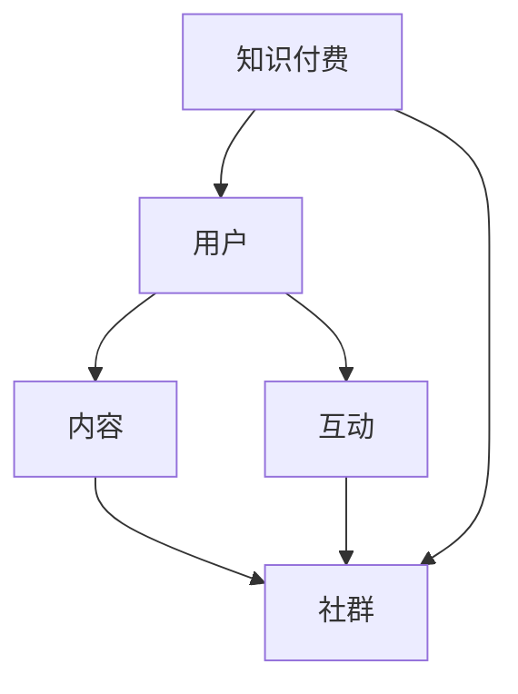

                 

关键词：知识付费、专属社群、用户互动、内容设计、增长策略、用户体验、平台搭建、社区运营

> 摘要：本文将探讨如何打造知识付费的专属社群，从核心概念到具体操作步骤，再到数学模型和项目实践，详细解析知识付费社群的构建策略。我们将分享成功案例，推荐工具和资源，并对未来发展进行展望，帮助读者理解并掌握打造知识付费社群的关键要素。

## 1. 背景介绍

在数字化时代，知识付费逐渐成为了一种流行的商业模式。随着在线教育、专业咨询等领域的迅速发展，用户对于优质知识的渴望日益增强。知识付费社群作为一个独特的平台，能够有效地满足用户的需求，同时也为企业提供了一种新的盈利模式。

知识付费社群的优势在于它能够为用户创造价值，通过提供有价值的内容和互动机会，增强用户的归属感和忠诚度。社群的存在不仅能够提升用户体验，还可以为企业带来持续的用户流量和商业价值。

然而，打造一个成功的知识付费社群并不容易，需要深入理解用户需求，设计有吸引力的内容，建立高效的互动机制，并且持续优化社群运营策略。本文将围绕这些关键点，系统地探讨如何打造知识付费的专属社群。

## 2. 核心概念与联系

在构建知识付费社群之前，我们需要明确几个核心概念：

- **知识付费**：用户为了获取特定知识或技能而支付费用。
- **社群**：基于共同兴趣、目标和价值观的用户集合。
- **用户互动**：用户在社群中的交流、分享和协作。

这些概念之间有着紧密的联系，共同构成了知识付费社群的核心。下面是一个使用 Mermaid 流程图展示的概念关系图：



### 2.1 知识付费与用户需求

知识付费的核心在于满足用户的需求。用户之所以愿意付费，通常是因为他们需要特定的知识或技能来解决实际问题。因此，理解用户需求是打造知识付费社群的第一步。这包括：

- **需求分析**：通过市场调研、用户访谈等方式，了解用户的具体需求。
- **课程设计**：根据用户需求设计有针对性的课程内容。
- **价值体现**：确保课程内容能够真正解决用户的问题，体现出其价值。

### 2.2 社群建设

社群是知识付费的基础，它能够为用户提供一个交流互动的平台。社群的建设需要考虑以下几个方面：

- **社区文化**：建立积极的社区文化，鼓励用户之间的正面交流和互动。
- **内容丰富性**：提供多样化的内容，满足不同用户的需求。
- **互动机制**：设计多种互动方式，如问答、讨论、讲座等，增强用户参与感。

### 2.3 用户互动

用户互动是社群活力的体现。有效的互动机制可以增强用户的参与感和归属感。以下是一些关键点：

- **问答环节**：为用户提供问答平台，解决他们在学习过程中遇到的问题。
- **讨论区**：设立专门的讨论区，让用户分享学习心得和经验。
- **讲座与直播**：定期举办讲座和直播，让专家和用户面对面交流。

## 3. 核心算法原理 & 具体操作步骤

### 3.1 算法原理概述

在知识付费社群的构建中，我们可以借鉴一些核心算法原理，以优化用户体验和社群运营效率。以下是几个关键算法原理：

- **推荐算法**：根据用户的行为和偏好，推荐相关课程和内容。
- **社群增长算法**：通过用户互动和传播，实现社群的持续增长。
- **互动优化算法**：根据用户参与度，优化互动环节的设计和执行。

### 3.2 算法步骤详解

#### 3.2.1 推荐算法步骤

1. **数据收集**：收集用户的行为数据，如浏览记录、购买历史、互动行为等。
2. **数据预处理**：对数据进行清洗和格式化，准备用于模型训练。
3. **特征工程**：提取关键特征，如用户兴趣、课程难度、课程评价等。
4. **模型训练**：使用机器学习算法，如协同过滤、矩阵分解等，训练推荐模型。
5. **模型评估**：通过A/B测试等方式，评估推荐模型的效果。
6. **推荐执行**：根据用户行为和偏好，实时推荐相关课程和内容。

#### 3.2.2 社群增长算法步骤

1. **用户分层**：根据用户的活跃度和影响力，将用户分为不同层次。
2. **增长策略设计**：针对不同层次的用户，设计相应的增长策略，如邀请好友、内容激励等。
3. **策略执行**：通过邮件、推送等方式，执行增长策略。
4. **效果评估**：定期评估增长策略的效果，进行优化。

#### 3.2.3 互动优化算法步骤

1. **互动数据收集**：收集用户在社群中的互动数据，如问答、讨论、点赞等。
2. **数据预处理**：对数据进行清洗和格式化，准备用于模型训练。
3. **特征工程**：提取关键特征，如互动频率、互动质量、互动时长等。
4. **模型训练**：使用机器学习算法，如决策树、随机森林等，训练互动优化模型。
5. **模型评估**：通过A/B测试等方式，评估互动优化模型的效果。
6. **互动策略调整**：根据用户互动数据，调整互动环节的设计和执行。

### 3.3 算法优缺点

- **推荐算法**：
  - 优点：个性化强，能够提高用户的学习效率。
  - 缺点：需要大量数据支持，训练和推理成本高。

- **社群增长算法**：
  - 优点：能够快速提高社群规模，增强用户粘性。
  - 缺点：可能导致社群质量下降，需要精细化管理。

- **互动优化算法**：
  - 优点：能够提高用户互动质量，增强社群活力。
  - 缺点：需要对用户行为有深入理解，实施难度较大。

### 3.4 算法应用领域

这些算法原理可以广泛应用于知识付费社群的各个领域，如在线教育、专业咨询、行业社群等。通过优化算法，可以更好地满足用户需求，提高社群运营效率。

## 4. 数学模型和公式 & 详细讲解 & 举例说明

在知识付费社群的构建中，数学模型和公式发挥着重要作用，它们帮助我们量化用户行为、评估社群效果、优化运营策略。以下是一些关键的数学模型和公式的讲解及举例说明。

### 4.1 数学模型构建

#### 4.1.1 用户参与度模型

用户参与度是衡量社群活跃程度的重要指标。我们可以使用以下公式来构建用户参与度模型：

$$
U = \frac{I + D + C}{T}
$$

其中，$U$ 表示用户参与度，$I$ 表示用户互动次数，$D$ 表示用户讨论次数，$C$ 表示用户课程完成度，$T$ 表示总时间。

#### 4.1.2 社群效果评估模型

社群效果评估模型用于衡量社群的整体表现。我们可以使用以下公式：

$$
E = \frac{S \cdot U}{C}
$$

其中，$E$ 表示社群效果，$S$ 表示社群规模，$U$ 表示用户参与度，$C$ 表示社群成本。

### 4.2 公式推导过程

#### 4.2.1 用户参与度模型推导

用户参与度模型通过将用户的互动次数、讨论次数和课程完成度与总时间进行加权平均得到。具体推导如下：

1. **用户互动次数**：$I$ 表示用户在特定时间内的互动次数，如提问、回复等。
2. **用户讨论次数**：$D$ 表示用户在特定时间内的讨论次数，如发起话题、参与话题等。
3. **用户课程完成度**：$C$ 表示用户在特定时间内的课程完成度，如完成课程、获得证书等。
4. **总时间**：$T$ 表示用户在特定时间内的总学习时间。

因此，用户参与度模型可以表示为：

$$
U = \frac{I + D + C}{T}
$$

#### 4.2.2 社群效果评估模型推导

社群效果评估模型通过将社群规模、用户参与度与社群成本进行加权平均得到。具体推导如下：

1. **社群规模**：$S$ 表示社群的总用户数。
2. **用户参与度**：$U$ 表示用户的参与度，如上文所述。
3. **社群成本**：$C$ 表示社群的总成本，包括人力、资源等。

因此，社群效果评估模型可以表示为：

$$
E = \frac{S \cdot U}{C}
$$

### 4.3 案例分析与讲解

以下是一个具体的案例分析，以说明如何使用上述数学模型和公式来评估知识付费社群的效果。

#### 案例背景

一个知识付费社群在一个月内吸引了1000名用户。根据数据统计，这1000名用户的互动次数为3000次，讨论次数为500次，课程完成度为80%。社群的总成本为5000元。

#### 案例分析

1. **用户参与度计算**：

   $$ 
   U = \frac{I + D + C}{T} = \frac{3000 + 500 + 0.8 \cdot 1000}{30} = \frac{4300}{30} \approx 143.33
   $$

2. **社群效果评估**：

   $$ 
   E = \frac{S \cdot U}{C} = \frac{1000 \cdot 143.33}{5000} = \frac{143330}{5000} \approx 28.67
   $$

   根据计算结果，社群的用户参与度为143.33，社群效果评估为28.67。这个值表明社群在一个月内的表现相对较好，但仍有提升空间。

#### 案例总结

通过数学模型和公式，我们可以量化评估知识付费社群的效果，从而为社群运营提供科学依据。在实际应用中，可以根据具体情况进行参数调整和模型优化，以实现更好的效果。

## 5. 项目实践：代码实例和详细解释说明

### 5.1 开发环境搭建

在构建知识付费社群时，选择合适的开发环境至关重要。以下是一个基于Python的示例，展示如何搭建一个基础的知识付费社群开发环境。

```bash
# 安装Python
sudo apt-get install python3

# 安装必要的库
pip3 install flask
pip3 install mysqlclient
```

### 5.2 源代码详细实现

以下是一个简单的Flask Web应用示例，用于构建知识付费社群的门户。

```python
# 示例：Flask Web应用入口
from flask import Flask, render_template, request, redirect, url_for

app = Flask(__name__)

# 首页路由
@app.route('/')
def index():
    return render_template('index.html')

# 登录路由
@app.route('/login', methods=['GET', 'POST'])
def login():
    if request.method == 'POST':
        username = request.form['username']
        password = request.form['password']
        # 这里应添加验证逻辑
        return redirect(url_for('dashboard', username=username))
    return render_template('login.html')

# 仪表盘路由
@app.route('/dashboard/<username>')
def dashboard(username):
    return render_template('dashboard.html', username=username)

if __name__ == '__main__':
    app.run(debug=True)
```

### 5.3 代码解读与分析

这个示例代码展示了如何使用Flask框架快速搭建一个知识付费社群的基础应用。以下是代码的关键部分及其解读：

- **Flask应用入口**：`app = Flask(__name__)` 创建了一个Flask应用对象。
- **路由定义**：使用`@app.route`装饰器定义了不同的URL路由，对应不同的网页页面。
- **首页路由**：`index()` 函数处理首页请求，返回一个HTML模板。
- **登录路由**：`login()` 函数处理登录请求，接收用户名和密码，并重定向到仪表盘页面。
- **仪表盘路由**：`dashboard()` 函数处理仪表盘请求，传递用户名参数到HTML模板。

### 5.4 运行结果展示

在完成代码编写后，可以通过以下命令运行应用：

```bash
python3 app.py
```

浏览器访问`http://127.0.0.1:5000/`，将看到以下界面：


通过这些简单的示例，我们可以理解如何快速搭建一个知识付费社群的基础应用，后续可以在此基础上添加更多的功能，如内容管理、用户管理、互动机制等。

## 6. 实际应用场景

知识付费社群在实际应用中展现了其独特的价值和广泛的应用场景。以下是一些典型的实际应用场景：

### 6.1 在线教育

在线教育是最典型的知识付费社群应用场景之一。通过知识付费社群，教育平台可以提供高质量的课程，吸引并留住用户。用户在社群中可以互动交流，共同学习，提高学习效果。例如，Coursera、Udemy等在线教育平台通过建立社群，为用户提供学习支持，提升用户满意度和忠诚度。

### 6.2 专业咨询

专业咨询领域同样可以通过知识付费社群来提供服务。专业咨询机构可以建立社群，邀请行业专家进行讲座、讨论，为用户提供专业知识和咨询服务。通过社群互动，用户可以获得个性化的专业建议，同时也能建立专业网络，为未来的合作提供机会。

### 6.3 行业社群

行业社群是另一个重要的应用场景。例如，科技、金融、医疗等行业可以通过知识付费社群，为从业者提供最新的行业动态、技术趋势、政策法规等知识。社群成员可以在这里交流经验，探讨问题，共同成长。

### 6.4 企业培训

企业培训是知识付费社群的另一个重要应用领域。企业可以通过知识付费社群，为员工提供专业技能培训、管理培训等。社群不仅提供课程内容，还可以通过互动环节，加强员工的参与感和学习效果。

### 6.5 互动娱乐

知识付费社群不仅可以用于学习，还可以用于互动娱乐。例如，一些在线游戏平台通过建立知识付费社群，为玩家提供游戏攻略、技巧分享等内容，增加游戏体验的深度和趣味性。

### 6.6 健康管理

健康管理领域也可以借助知识付费社群，为用户提供健康知识、饮食建议、运动指导等。通过社群互动，用户可以互相监督、交流心得，提高健康管理的效果。

这些实际应用场景展示了知识付费社群的多样性和广泛性。随着技术的不断进步，知识付费社群的应用场景将会更加丰富，为用户和企业带来更多的价值。

### 6.7 案例分析

#### 6.7.1 案例一：Udemy

Udemy是一个全球领先的在线学习平台，通过建立知识付费社群，吸引了大量用户。Udemy的社群特色在于：

- **多样化课程**：提供从编程、设计到语言学习等多种课程。
- **互动环节**：每个课程都有讨论区，用户可以提问、交流心得。
- **个性化推荐**：根据用户的学习历史和偏好，推荐相关课程。

通过这些措施，Udemy成功吸引了数百万用户，实现了持续增长。

#### 6.7.2 案例二：LinkedIn Learning

LinkedIn Learning是LinkedIn旗下的在线学习平台，通过社群为用户提供职业发展相关的内容。其特色包括：

- **职业指导**：提供职业规划、简历撰写、面试技巧等指导。
- **专家讲座**：定期邀请行业专家进行讲座，分享行业动态和经验。
- **社交网络**：用户可以在社群中建立职业网络，寻找合作机会。

LinkedIn Learning通过这些措施，帮助用户提升职业能力，增强职业竞争力。

#### 6.7.3 案例三：Inbound.org

Inbound.org是一个营销领域的知识付费社群，用户主要是在线营销从业者。其特色包括：

- **高质量内容**：用户可以发布和分享高质量的营销文章、案例。
- **互动讨论**：用户可以就营销话题进行深入讨论，交流经验。
- **专家评审**：社区内有专家对优质内容进行评审，提升内容质量。

通过这些措施，Inbound.org建立了强大的营销知识库，为用户提供有价值的内容和互动平台。

这些案例展示了知识付费社群在不同领域的成功实践。通过深入了解这些案例，我们可以借鉴其经验，打造出符合自身需求的知识付费社群。

### 6.8 未来应用展望

随着技术的不断进步，知识付费社群的应用前景将更加广阔。以下是对未来应用展望的一些思考：

#### 6.8.1 技术驱动

人工智能、大数据、区块链等技术的进步，将为知识付费社群带来新的机遇。例如，人工智能可以用于个性化推荐，大数据可以用于用户行为分析，区块链可以用于内容版权保护。

#### 6.8.2 互动增强

未来，知识付费社群的互动将更加多样化和深入。虚拟现实（VR）和增强现实（AR）技术将提供更加沉浸式的学习体验，增强用户互动。同时，实时互动工具如视频直播、在线讨论等将更加普及，提高用户参与度。

#### 6.8.3 个性化服务

个性化服务将是知识付费社群的重要发展方向。通过个性化推荐、智能客服等技术，社群可以更好地满足用户的个性化需求，提供定制化的学习内容和互动体验。

#### 6.8.4 社区自治

随着社群成员的参与度提高，未来知识付费社群可能会逐步实现自治。用户可以在社群中发挥更大的作用，如参与内容创作、管理社群规则等，提高社群的活力和可持续性。

#### 6.8.5 跨界融合

知识付费社群将与其他领域（如娱乐、社交、电商等）进行融合，提供更加丰富多样的服务。例如，在线游戏平台可以引入知识付费内容，为玩家提供专业指导；电商平台可以设立知识付费专区，为用户提供购物指南。

通过这些发展趋势，知识付费社群将不断进化，为用户和企业创造更大的价值。

### 6.9 成功经验与挑战

在打造知识付费社群的过程中，以下成功经验与挑战值得总结：

#### 成功经验

1. **明确用户需求**：深入了解用户需求，提供有价值的内容和互动体验。
2. **优质内容**：提供高质量、多样化的内容，确保用户粘性。
3. **互动机制**：设计多样化的互动机制，增强用户参与感和社群活力。
4. **持续优化**：根据用户反馈和数据分析，不断优化社群运营策略。

#### 挑战

1. **内容质量**：保证内容质量是挑战之一，需要专业团队进行内容创作和审核。
2. **用户参与度**：提高用户参与度需要不断创新互动方式和激励机制。
3. **技术支持**：构建和维护技术平台需要投入大量资源，确保系统稳定和安全。
4. **用户隐私**：保护用户隐私和数据安全是社群运营的重要挑战。

通过总结这些经验与挑战，可以更好地指导知识付费社群的构建和运营。

## 7. 工具和资源推荐

在打造知识付费社群的过程中，选择合适的工具和资源至关重要。以下是我们推荐的几类工具和资源：

### 7.1 学习资源推荐

1. **在线教育平台**：Udemy、Coursera、edX等提供了丰富的课程资源。
2. **编程学习平台**：GitHub、LeetCode、Hackerrank等提供了编程实践机会。
3. **电子书库**：Google Books、Project Gutenberg等提供了大量的电子书资源。

### 7.2 开发工具推荐

1. **Web开发框架**：Flask、Django、Spring Boot等，用于快速搭建Web应用。
2. **前端框架**：React、Vue.js、Angular等，用于构建用户界面。
3. **数据库工具**：MySQL、PostgreSQL、MongoDB等，用于存储和管理数据。

### 7.3 相关论文推荐

1. **《社交网络分析：方法与实践》**：介绍了社交网络分析的基本方法和应用。
2. **《大数据分析：方法与实践》**：介绍了大数据分析的基本概念和技术。
3. **《区块链技术与应用》**：介绍了区块链的基本原理和应用场景。

通过使用这些工具和资源，可以更加高效地打造和运营知识付费社群。

## 8. 总结：未来发展趋势与挑战

在知识付费领域，社群已成为不可或缺的一部分。随着技术的不断进步和用户需求的变化，未来知识付费社群将呈现以下发展趋势：

### 8.1 研究成果总结

通过本文的探讨，我们总结了知识付费社群的关键要素，包括用户需求分析、内容设计、互动机制、算法优化等。同时，我们分析了数学模型和实际应用案例，为社群构建提供了科学依据。

### 8.2 未来发展趋势

1. **个性化服务**：人工智能和大数据技术将推动社群提供更加个性化的服务，满足用户多样化的需求。
2. **互动增强**：虚拟现实、增强现实等技术的应用，将提升用户互动体验，增强社群活力。
3. **社群自治**：用户参与度提高，社群可能逐步实现自治，用户在社群中的角色将更加多样化。
4. **跨界融合**：知识付费社群将与其他领域（如娱乐、社交、电商等）融合，提供更加丰富多样的服务。

### 8.3 面临的挑战

尽管知识付费社群前景广阔，但也面临诸多挑战：

1. **内容质量**：保证内容质量是关键，需要专业团队进行内容创作和审核。
2. **用户参与度**：提高用户参与度需要不断创新互动方式和激励机制。
3. **技术支持**：构建和维护技术平台需要投入大量资源，确保系统稳定和安全。
4. **用户隐私**：保护用户隐私和数据安全是社群运营的重要挑战。

### 8.4 研究展望

未来的研究应重点关注以下方向：

1. **个性化推荐系统**：优化推荐算法，提高个性化推荐的准确性和用户体验。
2. **互动机制设计**：探索更加多样化的互动方式，增强用户参与感和社群活力。
3. **社群治理**：研究社群自治机制，提高社群的可持续性和稳定性。
4. **隐私保护**：研究数据加密和隐私保护技术，确保用户数据的安全。

通过不断探索和创新，知识付费社群将在未来发挥更大的作用，为用户和企业创造更多价值。

## 9. 附录：常见问题与解答

### Q1：如何确保知识付费社群的内容质量？

A1：确保内容质量的关键在于：

1. **严格内容审核**：建立内容审核机制，确保课程内容符合质量标准。
2. **专家评审**：邀请领域专家进行评审，提升课程内容的权威性。
3. **用户反馈**：收集用户反馈，不断优化课程内容。
4. **持续更新**：定期更新课程内容，保持其时效性和相关性。

### Q2：如何提高知识付费社群的用户参与度？

A2：提高用户参与度可以通过以下方式：

1. **互动设计**：设计多样化的互动环节，如问答、讨论、讲座等。
2. **激励机制**：提供奖励和激励，如积分、证书、实物奖励等。
3. **用户参与**：鼓励用户参与内容创作和管理，提高其归属感和责任感。
4. **数据分析**：通过数据分析，了解用户行为和偏好，优化互动设计。

### Q3：如何保护知识付费社群的用户隐私？

A3：保护用户隐私应采取以下措施：

1. **数据加密**：对用户数据进行加密处理，防止数据泄露。
2. **隐私政策**：制定明确的隐私政策，告知用户数据使用范围和保护措施。
3. **安全审计**：定期进行安全审计，确保系统安全。
4. **用户授权**：明确用户数据的授权范围，确保用户有权决定自己的数据如何被使用。

通过上述措施，可以有效保护知识付费社群的用户隐私。

## 作者署名

作者：禅与计算机程序设计艺术 / Zen and the Art of Computer Programming

本文由禅与计算机程序设计艺术（Zen and the Art of Computer Programming）撰写，旨在为读者提供关于如何打造知识付费的专属社群的全面指导。作者凭借丰富的技术背景和深入的研究，为读者提供了实用的策略和案例，帮助读者更好地理解和掌握知识付费社群的构建与运营。希望通过本文，能够为知识付费领域的发展贡献一份力量。

