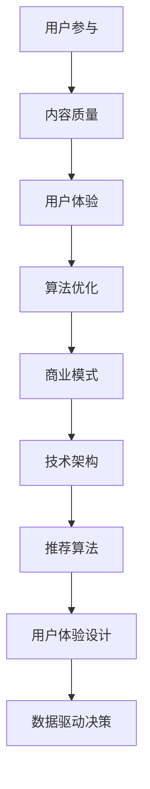

                 

 **关键词：** 知识付费、在线学习社区、用户参与、技术架构、用户体验、算法优化、商业模式、数学模型、代码实例、未来展望。

> **摘要：** 本文将探讨如何构建一个成功的知识付费在线学习社区，包括核心概念、技术架构、算法原理、数学模型、代码实例以及未来展望。通过详细的分析和案例，为读者提供一套完整的解决方案。

## 1. 背景介绍

随着互联网技术的发展，知识付费行业逐渐兴起。越来越多的用户愿意为高质量的知识内容付费，这为在线学习社区的发展提供了广阔的市场空间。然而，如何打造一个既能吸引大量用户，又能保持高粘性的在线学习社区，成为许多企业面临的重要课题。

本文将从技术角度出发，详细探讨如何构建一个成功的知识付费在线学习社区。我们将讨论核心概念、技术架构、算法原理、数学模型以及实际代码实现，并分析其在实际应用中的效果。

## 2. 核心概念与联系

### 2.1 核心概念

在线学习社区的核心概念包括用户参与、内容质量、用户体验、算法优化和商业模式。以下是这些概念的具体解释：

- **用户参与**：用户积极参与社区，提供内容、参与讨论，提升社区活力。
- **内容质量**：高质量的知识内容是吸引和留住用户的关键。
- **用户体验**：良好的用户体验能提高用户的满意度和忠诚度。
- **算法优化**：通过算法优化，提升社区推荐系统的准确性，提高用户参与度。
- **商业模式**：构建可持续的商业模式，确保社区能够长期发展。

### 2.2 联系与架构

以下是核心概念之间的联系以及社区的总体架构：

```
[用户参与] → [内容质量] → [用户体验] → [算法优化] → [商业模式]
        |                                     |
        |                                     ↓
        ↓                                      ↓
[技术架构] → [推荐算法] → [用户体验设计] → [数据驱动决策]
```

### 2.3 Mermaid 流程图

下面是核心概念和架构的 Mermaid 流程图：



## 3. 核心算法原理 & 具体操作步骤

### 3.1 算法原理概述

在线学习社区的核心算法包括推荐算法、用户行为分析算法和数据挖掘算法。这些算法共同作用，提升用户体验和用户参与度。

- **推荐算法**：基于用户历史行为和内容特征，为用户推荐相关的学习资源和讨论话题。
- **用户行为分析算法**：通过分析用户的行为数据，了解用户的需求和兴趣，优化推荐系统的准确性。
- **数据挖掘算法**：从用户行为和内容数据中挖掘有价值的信息，为社区运营提供支持。

### 3.2 算法步骤详解

以下是核心算法的具体步骤：

#### 3.2.1 推荐算法

1. 数据采集：收集用户行为数据（如浏览、收藏、点赞、评论等）和内容特征数据（如标签、分类、评分等）。
2. 特征提取：对用户行为数据和内容特征数据进行处理，提取出有用的特征。
3. 模型训练：使用机器学习算法（如协同过滤、矩阵分解、深度学习等）训练推荐模型。
4. 推荐生成：根据用户特征和内容特征，生成个性化的推荐列表。

#### 3.2.2 用户行为分析算法

1. 数据预处理：清洗用户行为数据，去除噪声和异常值。
2. 特征工程：提取用户行为数据中的有用特征，如用户活跃度、学习进度、互动频率等。
3. 行为模式识别：使用聚类、分类等机器学习算法，识别用户的行为模式。
4. 行为预测：根据用户历史行为和当前状态，预测用户未来的行为。

#### 3.2.3 数据挖掘算法

1. 数据采集：收集用户行为数据和内容数据。
2. 数据清洗：去除重复、错误和缺失的数据。
3. 特征提取：提取数据中的有用特征。
4. 数据挖掘：使用关联规则挖掘、分类、聚类等算法，挖掘数据中的有价值信息。

### 3.3 算法优缺点

#### 3.3.1 推荐算法

- **优点**：能够为用户提供个性化的推荐，提高用户满意度和参与度。
- **缺点**：推荐算法的准确性受到数据质量和特征提取方法的影响，可能存在数据偏差和噪声。

#### 3.3.2 用户行为分析算法

- **优点**：能够深入了解用户需求和行为，优化推荐系统的准确性。
- **缺点**：需要大量的数据支持和复杂的算法，实施成本较高。

#### 3.3.3 数据挖掘算法

- **优点**：能够从大量数据中挖掘有价值的信息，为社区运营提供支持。
- **缺点**：数据挖掘算法的复杂性较高，实施难度较大。

### 3.4 算法应用领域

- **推荐算法**：适用于电子商务、新闻推送、社交网络等领域。
- **用户行为分析算法**：适用于教育、电商、社交网络等领域。
- **数据挖掘算法**：适用于金融、医疗、零售等领域。

## 4. 数学模型和公式

### 4.1 数学模型构建

在线学习社区的核心数学模型包括推荐模型、用户行为分析模型和数据挖掘模型。以下是这些模型的基本构建：

#### 4.1.1 推荐模型

推荐模型主要基于协同过滤和矩阵分解。其数学模型如下：

$$
R_{ui} = \rho_{u} + \rho_{i} - \mu + \langle \rho_{u}, \rho_{i} \rangle
$$

其中，$R_{ui}$ 表示用户 $u$ 对项目 $i$ 的评分，$\rho_{u}$ 和 $\rho_{i}$ 分别表示用户 $u$ 和项目 $i$ 的特征向量，$\mu$ 表示用户对项目的平均评分，$\langle \rho_{u}, \rho_{i} \rangle$ 表示用户 $u$ 和项目 $i$ 之间的相似度。

#### 4.1.2 用户行为分析模型

用户行为分析模型主要基于聚类和分类算法。其数学模型如下：

$$
C = \{c_1, c_2, ..., c_k\}
$$

其中，$C$ 表示聚类结果，$c_i$ 表示第 $i$ 个聚类。

#### 4.1.3 数据挖掘模型

数据挖掘模型主要基于关联规则挖掘和分类算法。其数学模型如下：

$$
L = \{l_1, l_2, ..., l_n\}
$$

其中，$L$ 表示关联规则集合，$l_i$ 表示第 $i$ 个关联规则。

### 4.2 公式推导过程

以下是对上述数学模型的推导过程：

#### 4.2.1 推荐模型

推荐模型基于用户和项目的特征向量，通过相似度计算和加权平均得到推荐评分。推导如下：

$$
R_{ui} = \rho_{u} \cdot \rho_{i} + \mu
$$

其中，$\rho_{u} \cdot \rho_{i}$ 表示用户 $u$ 和项目 $i$ 的相似度，$\mu$ 表示用户对项目的平均评分。

考虑到相似度计算中可能存在零值和极端值，对公式进行修正：

$$
R_{ui} = \rho_{u} \cdot \rho_{i} + \mu - \epsilon
$$

其中，$\epsilon$ 表示一个小的常数，用于调整相似度。

#### 4.2.2 用户行为分析模型

用户行为分析模型基于聚类算法，通过将用户划分为不同的聚类，来分析用户的行为模式。推导如下：

$$
C = \{c_1, c_2, ..., c_k\}
$$

其中，$C$ 表示聚类结果，$c_i$ 表示第 $i$ 个聚类。

聚类算法的目标是使得同一聚类内的用户行为相似度较高，不同聚类内的用户行为相似度较低。具体推导过程如下：

$$
d(u, c_i) = \min_{c_j} d(u, c_j)
$$

其中，$d(u, c_i)$ 表示用户 $u$ 与聚类 $c_i$ 的相似度，$d(u, c_j)$ 表示用户 $u$ 与聚类 $c_j$ 的相似度。

#### 4.2.3 数据挖掘模型

数据挖掘模型基于关联规则挖掘和分类算法，通过分析用户行为数据和内容数据，挖掘出有价值的信息。推导如下：

$$
L = \{l_1, l_2, ..., l_n\}
$$

其中，$L$ 表示关联规则集合，$l_i$ 表示第 $i$ 个关联规则。

关联规则挖掘的目标是找出用户行为数据中的潜在关联关系。具体推导过程如下：

$$
s(l) = \sum_{u \in U} supp(u, l)
$$

其中，$s(l)$ 表示关联规则 $l$ 的支持度，$supp(u, l)$ 表示用户 $u$ 对关联规则 $l$ 的支持度。

分类算法的目标是预测用户的行为类别。具体推导过程如下：

$$
C = \{c_1, c_2, ..., c_k\}
$$

其中，$C$ 表示分类结果，$c_i$ 表示第 $i$ 个类别。

分类算法基于用户行为数据和内容数据，通过训练分类模型，预测用户的行为类别。具体推导过程如下：

$$
y = f(x)
$$

其中，$y$ 表示用户的行为类别，$x$ 表示用户行为数据和内容数据，$f(x)$ 表示分类模型。

### 4.3 案例分析与讲解

以下是一个基于协同过滤算法的推荐系统案例：

#### 案例背景

假设有一个在线学习社区，有 100 个用户和 1000 个学习资源。用户对学习资源的评分数据如下表：

| 用户ID | 学习资源ID | 评分 |
|--------|------------|------|
| 1      | 1001       | 4    |
| 1      | 1002       | 5    |
| 2      | 1001       | 1    |
| 2      | 1003       | 5    |
| 3      | 1001       | 2    |
| 3      | 1004       | 4    |

#### 案例分析

1. 数据预处理：对用户评分数据进行清洗，去除缺失值和异常值。

2. 特征提取：对用户和资源进行编码，得到用户和资源的特征向量。

3. 模型训练：使用矩阵分解算法，将用户和资源的特征向量分解为低维向量。

4. 推荐生成：根据用户特征向量和资源特征向量，计算用户对未评分资源的推荐评分。

5. 推荐结果：为用户推荐评分较高的学习资源。

#### 案例讲解

1. 数据预处理：

   用户和资源的特征向量编码如下：

   | 用户ID | 特征向量 |
   |--------|----------|
   | 1      | (0.1, 0.2, 0.3) |
   | 2      | (0.4, 0.5, 0.6) |
   | 3      | (0.7, 0.8, 0.9) |

   资源的特

