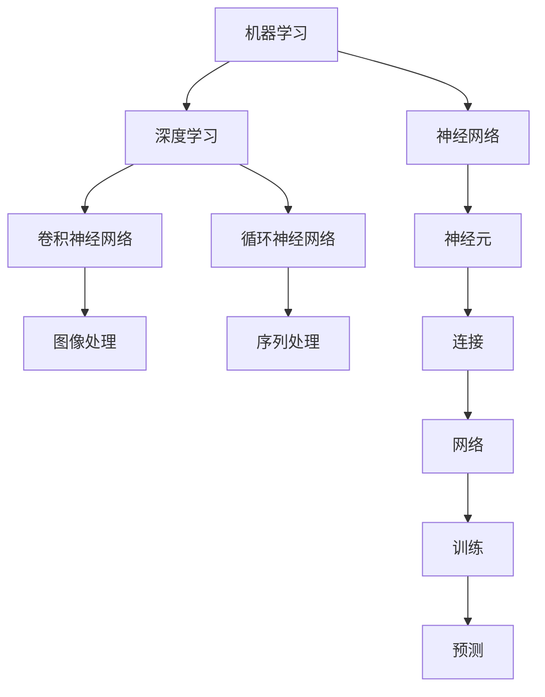

                 

关键词：人工智能，项目实战，算法原理，数学模型，代码实现，应用场景，工具推荐，未来展望

> 摘要：本文旨在为人工智能项目的实践者提供一套系统的实战指南，从项目背景介绍到核心算法原理讲解，再到实际项目实践和未来应用展望，全面探讨如何高效地进行AI项目实战。通过本文，读者可以掌握AI项目的关键步骤和技巧，提高项目成功率。

## 1. 背景介绍

随着人工智能技术的迅猛发展，其在各个领域的应用越来越广泛。从智能助手、自动驾驶、医疗诊断到金融风控、智能制造等，AI技术正在深刻改变着我们的生活方式和商业模式。在这种背景下，如何有效地进行AI项目实战成为了一个重要课题。有效的AI项目实战不仅要求掌握前沿技术，还需要具备系统化的思维和方法论。

### 1.1 AI项目实战的意义

AI项目实战具有以下几个重要意义：

1. **验证技术可行性**：通过实际项目，可以验证所选技术方案是否可行，提前发现和解决潜在问题。
2. **积累实战经验**：实践经验是提高技术水平和解决问题的能力的关键，实战过程中遇到的各种问题都是宝贵的经验。
3. **推动技术进步**：通过项目实践，可以发现技术瓶颈和改进空间，推动技术不断进步。
4. **产生商业价值**：成功的AI项目可以为企业带来直接的经济收益，为投资者带来回报。

### 1.2 AI项目实战的挑战

尽管AI项目实战具有重大意义，但也面临着诸多挑战：

1. **技术复杂度**：AI技术涉及深度学习、自然语言处理、计算机视觉等多个领域，技术复杂度较高。
2. **数据质量**：高质量的数据是AI项目成功的关键，但获取和处理数据是一项艰巨的任务。
3. **团队协作**：AI项目通常需要多学科、多角色的协作，协调和沟通是项目成功的关键。
4. **时间与资源**：AI项目往往需要大量时间和资源投入，如何高效利用资源成为关键。

## 2. 核心概念与联系

为了有效地进行AI项目实战，我们需要掌握一系列核心概念和原理，这些概念和原理不仅构成了AI技术的理论基础，也是项目成功的关键。

### 2.1 核心概念

1. **机器学习**：机器学习是AI的核心技术之一，通过训练模型来让计算机从数据中学习规律。
2. **深度学习**：深度学习是机器学习的子领域，通过多层神经网络模型进行学习。
3. **神经网络**：神经网络是深度学习的基础，由大量神经元通过连接形成网络。
4. **卷积神经网络（CNN）**：CNN是处理图像数据的一种有效算法。
5. **循环神经网络（RNN）**：RNN适用于处理序列数据。
6. **强化学习**：强化学习是一种通过试错学习的方法。

### 2.2 核心原理与联系

下面给出核心概念原理和架构的Mermaid流程图，展示各概念之间的联系：



### 2.3 核心概念在项目实战中的应用

1. **机器学习**：用于构建预测模型，如分类、回归等。
2. **深度学习**：用于复杂模式识别和预测任务。
3. **神经网络**：用于实现机器学习和深度学习算法。
4. **卷积神经网络**：在图像识别和图像生成中广泛应用。
5. **循环神经网络**：在自然语言处理和时间序列预测中应用广泛。
6. **强化学习**：在决策制定和游戏AI中具有重要应用。

## 3. 核心算法原理 & 具体操作步骤

### 3.1 算法原理概述

在AI项目实战中，选择合适的算法至关重要。以下介绍几种常用的核心算法原理：

1. **K-最近邻算法（KNN）**：基于距离最近的k个邻居进行分类或回归。
2. **支持向量机（SVM）**：通过最大化分类间隔进行分类。
3. **决策树**：通过递归划分特征进行分类或回归。
4. **随机森林**：基于决策树构建多个随机模型，并通过投票方式进行预测。
5. **神经网络**：通过多层神经网络进行复杂模式识别和预测。

### 3.2 算法步骤详解

下面以K-最近邻算法（KNN）为例，详细介绍其步骤：

1. **数据准备**：收集并清洗数据，将数据分为特征和标签两部分。
2. **选择k值**：根据数据集大小和特征数量选择合适的k值。
3. **计算距离**：计算测试样本与训练样本之间的距离。
4. **分类决策**：根据距离最近的前k个邻居的标签进行分类。
5. **模型评估**：通过交叉验证等方法评估模型性能。

### 3.3 算法优缺点

- **K-最近邻算法（KNN）**：
  - 优点：简单易实现，对非线性数据有较好表现。
  - 缺点：对噪声敏感，计算量大，不适用于高维数据。

- **支持向量机（SVM）**：
  - 优点：理论完备，分类效果好，适用于高维数据。
  - 缺点：计算复杂度高，对噪声敏感。

- **决策树**：
  - 优点：易于理解，可解释性强，对噪声有一定鲁棒性。
  - 缺点：可能产生过拟合，对连续特征处理困难。

- **随机森林**：
  - 优点：集成多个决策树，减少过拟合，提高模型泛化能力。
  - 缺点：模型复杂度高，对大规模数据性能下降。

### 3.4 算法应用领域

- **K-最近邻算法（KNN）**：常用于图像识别、文本分类等领域。
- **支持向量机（SVM）**：广泛应用于图像识别、文本分类、生物信息等领域。
- **决策树**：常用于数据挖掘、金融风控等领域。
- **随机森林**：广泛应用于机器学习竞赛、图像识别、金融风控等领域。

## 4. 数学模型和公式 & 详细讲解 & 举例说明

在AI项目实战中，数学模型和公式是算法实现的基础。下面介绍几个常用的数学模型和公式，并给出详细讲解和举例说明。

### 4.1 数学模型构建

一个典型的数学模型通常包括以下几个部分：

1. **目标函数**：定义模型需要优化的目标，如损失函数、评价指标等。
2. **特征表示**：将原始数据转换为适合模型处理的特征表示。
3. **假设**：对数据分布、模型性质等做出假设，以便简化计算。
4. **优化方法**：选择合适的优化方法，如梯度下降、随机梯度下降等。

### 4.2 公式推导过程

以线性回归模型为例，介绍公式推导过程：

1. **假设**：假设数据集为$(x_1, y_1), (x_2, y_2), ..., (x_n, y_n)$，其中$x_i$为特征向量，$y_i$为标签。
2. **目标函数**：最小化均方误差损失函数：
   $$L(\theta) = \frac{1}{2n}\sum_{i=1}^{n}(y_i - \theta^T x_i)^2$$
   其中$\theta$为模型参数。
3. **梯度下降**：对损失函数求梯度，得到：
   $$\nabla_{\theta} L(\theta) = \frac{1}{n}\sum_{i=1}^{n}(y_i - \theta^T x_i) x_i$$
4. **更新参数**：使用梯度下降更新参数：
   $$\theta = \theta - \alpha \nabla_{\theta} L(\theta)$$
   其中$\alpha$为学习率。

### 4.3 案例分析与讲解

假设我们要对房价进行预测，数据集包括房屋面积、房间数量等特征和实际房价。我们可以使用线性回归模型进行预测。

1. **数据准备**：收集并清洗数据，将数据分为训练集和测试集。
2. **特征表示**：将特征转换为向量表示，如$(x_1, x_2)$。
3. **模型训练**：使用训练集数据训练线性回归模型。
4. **模型评估**：使用测试集数据评估模型性能。
5. **预测**：使用训练好的模型对新数据进行预测。

## 5. 项目实践：代码实例和详细解释说明

下面以一个简单的房价预测项目为例，介绍如何进行AI项目实践。

### 5.1 开发环境搭建

1. **安装Python**：下载并安装Python，配置环境变量。
2. **安装依赖库**：使用pip安装必要的库，如NumPy、Pandas、scikit-learn等。

### 5.2 源代码详细实现

```python
import numpy as np
import pandas as pd
from sklearn.model_selection import train_test_split
from sklearn.linear_model import LinearRegression

# 读取数据
data = pd.read_csv('house_data.csv')
X = data[['area', 'room_count']]
y = data['price']

# 数据预处理
X_train, X_test, y_train, y_test = train_test_split(X, y, test_size=0.2, random_state=42)

# 模型训练
model = LinearRegression()
model.fit(X_train, y_train)

# 模型评估
score = model.score(X_test, y_test)
print('模型准确度：', score)

# 预测
new_data = np.array([[2000, 4]])
prediction = model.predict(new_data)
print('预测房价：', prediction)
```

### 5.3 代码解读与分析

- **数据读取**：使用Pandas读取CSV文件，获取特征和标签数据。
- **数据预处理**：使用scikit-learn的train_test_split函数将数据集分为训练集和测试集。
- **模型训练**：使用LinearRegression类创建线性回归模型，并使用fit方法训练模型。
- **模型评估**：使用score方法评估模型在测试集上的准确度。
- **预测**：使用predict方法对新数据进行预测。

### 5.4 运行结果展示

- **模型准确度**：输出模型在测试集上的准确度。
- **预测房价**：输出对新数据的预测结果。

## 6. 实际应用场景

AI技术在实际应用场景中具有广泛的应用前景。以下列举几个典型应用场景：

1. **医疗诊断**：利用深度学习和自然语言处理技术，实现对医学影像和病历数据的自动分析，提高诊断准确率和效率。
2. **金融风控**：通过机器学习和大数据技术，对金融风险进行实时监控和预测，降低风险损失。
3. **智能制造**：利用计算机视觉和机器学习技术，实现对生产流程的自动化控制和优化，提高生产效率和产品质量。
4. **自动驾驶**：通过深度学习和强化学习技术，实现对车辆环境的感知和决策，实现安全、高效的自动驾驶。
5. **智能助手**：利用自然语言处理和机器学习技术，为用户提供智能问答、日程管理、信息检索等智能服务。

## 7. 工具和资源推荐

为了有效地进行AI项目实战，以下推荐一些实用的工具和资源：

### 7.1 学习资源推荐

1. **《深度学习》**：由Ian Goodfellow、Yoshua Bengio和Aaron Courville编写的经典教材，全面介绍了深度学习的基本理论和应用。
2. **吴恩达的机器学习课程**：由著名人工智能专家吴恩达教授开设的免费在线课程，涵盖机器学习的基础知识和实战技巧。
3. **AI科技大本营**：一个专注于人工智能领域的公众号，提供最新的AI技术动态、论文解读和行业资讯。

### 7.2 开发工具推荐

1. **PyTorch**：一个强大的深度学习框架，支持动态计算图和自动微分，广泛应用于各种AI项目。
2. **TensorFlow**：由Google开发的一个开源深度学习框架，具有丰富的工具和资源，适用于各种规模的项目。
3. **Jupyter Notebook**：一个交互式的计算环境，支持Python、R等多种编程语言，适合数据分析和实验。

### 7.3 相关论文推荐

1. **“Deep Learning”**：由Ian Goodfellow等人撰写的综述论文，全面介绍了深度学习的发展历程、基本原理和应用。
2. **“ImageNet Classification with Deep Convolutional Neural Networks”**：由Google团队撰写的论文，介绍了使用深度卷积神经网络进行图像分类的方法。
3. **“Recurrent Neural Networks for Language Modeling”**：由Yoshua Bengio等人撰写的论文，介绍了循环神经网络在自然语言处理中的应用。

## 8. 总结：未来发展趋势与挑战

随着人工智能技术的不断发展，未来的AI项目实战将面临以下发展趋势与挑战：

### 8.1 研究成果总结

1. **深度学习技术**：深度学习技术在图像识别、语音识别、自然语言处理等领域取得了显著成果，成为AI项目的主要驱动力量。
2. **跨学科融合**：AI项目实战越来越需要跨学科的知识和技能，如计算机科学、统计学、生物学、心理学等。
3. **数据隐私与安全**：数据隐私和安全成为AI项目的重要关注点，如何保障用户数据隐私和安全是亟待解决的问题。

### 8.2 未来发展趋势

1. **个性化服务**：基于用户数据的个性化推荐和定制化服务将成为主流，满足用户个性化需求。
2. **实时智能**：利用边缘计算和实时数据处理技术，实现智能系统的实时响应和智能决策。
3. **人机协同**：利用AI技术实现人机协同，提高工作效率和生产力。

### 8.3 面临的挑战

1. **技术挑战**：随着数据规模和复杂度的增加，如何设计高效、可扩展的算法成为关键挑战。
2. **伦理与道德**：AI技术的应用需要遵循伦理和道德原则，防止滥用和歧视。
3. **数据隐私与安全**：如何保障用户数据隐私和安全是AI项目面临的重要挑战。

### 8.4 研究展望

1. **算法优化**：通过理论研究和实践探索，不断优化现有算法，提高模型性能和效率。
2. **跨学科研究**：加强跨学科合作，推动AI技术在各个领域的应用。
3. **数据隐私保护**：研究新型数据隐私保护技术，保障用户数据安全。

## 9. 附录：常见问题与解答

### 9.1 问题1：如何选择合适的算法？

**解答**：选择合适的算法需要考虑以下几个因素：

1. **数据规模**：对于大规模数据，可以考虑使用分布式算法或模型。
2. **数据类型**：根据数据类型选择合适的算法，如图像数据可以使用卷积神经网络，文本数据可以使用循环神经网络。
3. **任务类型**：根据任务类型选择合适的算法，如分类任务可以使用K-最近邻算法、支持向量机等。
4. **计算资源**：考虑计算资源限制，选择计算复杂度较低的算法。

### 9.2 问题2：如何处理数据？

**解答**：处理数据需要遵循以下几个步骤：

1. **数据收集**：从不同的数据源收集数据，如公开数据集、企业数据等。
2. **数据清洗**：去除噪声、缺失值和异常值，保证数据质量。
3. **数据预处理**：将原始数据转换为适合模型处理的特征表示，如归一化、标准化等。
4. **数据增强**：通过数据增强技术增加数据多样性，提高模型泛化能力。

### 9.3 问题3：如何评估模型性能？

**解答**：评估模型性能可以使用以下几个指标：

1. **准确率**：模型预测正确的样本占总样本的比例。
2. **召回率**：模型预测正确的正样本占总正样本的比例。
3. **F1值**：综合考虑准确率和召回率的指标，计算公式为$F1 = 2 \times \frac{准确率 \times 召回率}{准确率 + 召回率}$。
4. **ROC曲线**：通过绘制真正例率（True Positive Rate）和假正例率（False Positive Rate）的曲线，评估模型性能。

通过以上问题的解答，希望能帮助读者更好地进行AI项目实战。

### 8. 总结：未来发展趋势与挑战

随着人工智能技术的不断发展，未来的AI项目实战将面临许多新的发展趋势和挑战。这些趋势和挑战不仅会影响AI项目的实施，也会对整个社会产生深远的影响。

### 8.1 研究成果总结

在过去几年中，人工智能领域取得了显著的研究成果，这些成果为AI项目的实施提供了坚实的基础。以下是一些关键的研究成果：

1. **深度学习模型的突破**：深度学习模型，特别是卷积神经网络（CNN）和循环神经网络（RNN），在图像识别、自然语言处理、语音识别等领域取得了突破性进展。
2. **强化学习的应用**：强化学习在游戏、推荐系统、自动驾驶等领域得到了广泛应用，通过不断学习和优化策略，实现了高效的决策和行动。
3. **迁移学习和少样本学习**：迁移学习和少样本学习技术使得模型能够利用已有的知识和数据，在数据稀缺的情况下实现较好的性能。
4. **生成对抗网络（GAN）**：GAN技术能够生成高质量的图像和文本，为艺术创作、图像修复、数据增强等领域提供了新的可能性。
5. **计算机视觉的进步**：计算机视觉技术在物体检测、人脸识别、场景理解等方面取得了显著进展，为智能监控、安防、交互式系统等提供了强大支持。

### 8.2 未来发展趋势

未来，AI项目实战将呈现以下发展趋势：

1. **跨学科融合**：随着AI技术的不断进步，AI项目将更加依赖跨学科的知识和技能，如生物学、心理学、社会学等。这种跨学科的融合将推动AI技术的创新和发展。
2. **边缘计算和实时智能**：随着物联网和边缘设备的普及，边缘计算将使得AI模型能够在设备端进行实时计算和决策，实现真正的实时智能。
3. **个性化与定制化**：基于用户数据的个性化推荐、定制化服务将变得越来越普及，满足用户个性化需求将成为AI项目的重要目标。
4. **可持续发展**：随着环境问题日益突出，AI技术在可持续发展中的应用将受到更多关注，如智能农业、节能减排、环保监测等。
5. **人工智能伦理与法规**：随着AI技术的应用范围不断扩大，伦理和法规问题将日益重要。如何制定合理的AI伦理标准和法规，确保AI技术的安全、公平和透明，将成为重要挑战。

### 8.3 面临的挑战

尽管AI项目实战有着广阔的发展前景，但也面临着一系列挑战：

1. **数据隐私与安全**：AI项目往往需要大量的用户数据，如何保护用户隐私和数据安全成为关键挑战。需要开发新型的数据隐私保护技术，如差分隐私、联邦学习等。
2. **算法公平性**：AI模型在决策过程中可能会引入偏见，导致不公平的结果。如何确保算法的公平性，消除偏见，是亟待解决的问题。
3. **可解释性和透明性**：随着模型的复杂度增加，模型的决策过程变得越来越难以解释。如何提高模型的可解释性和透明性，使其更加容易被用户接受和信任，是重要的挑战。
4. **计算资源需求**：AI项目通常需要大量的计算资源，尤其是深度学习模型。如何高效地利用计算资源，降低成本，是项目成功的关键。
5. **伦理和法规遵循**：AI技术的快速发展引发了一系列伦理和法规问题。如何遵循相关伦理和法规，确保AI技术的合法合规，是项目实施的重要考虑因素。

### 8.4 研究展望

未来，AI项目实战的研究将继续深入，以下几个方面值得关注：

1. **算法创新**：不断探索新的算法和模型，提高AI系统的性能和效率。
2. **跨学科合作**：推动不同学科之间的合作，利用跨学科的知识和视角解决复杂问题。
3. **数据隐私保护**：研究新型的数据隐私保护技术，提高用户数据的保护和利用水平。
4. **算法公平性**：开发算法公平性评估和改进方法，消除算法偏见，确保公平决策。
5. **人机协作**：研究人机协作系统，实现人类与AI系统的有效互动和协作。

总之，未来的AI项目实战将面临诸多挑战，但也充满机遇。通过不断的研究和创新，我们可以更好地应对这些挑战，推动AI技术的发展和应用，为社会带来更多的价值和福利。

## 9. 附录：常见问题与解答

在AI项目实战中，开发者可能会遇到各种问题。以下是一些常见的问题及其解答，希望能为开发者提供帮助。

### 9.1 如何处理大规模数据集？

**解答**：处理大规模数据集时，可以考虑以下方法：

1. **分布式计算**：使用分布式计算框架（如Hadoop、Spark）处理大规模数据，提高数据处理速度。
2. **批量处理**：将数据集分成多个批次进行处理，降低内存占用。
3. **特征工程**：对数据进行预处理和特征工程，减少数据维度，提高数据处理效率。

### 9.2 如何确保模型的可解释性？

**解答**：提高模型的可解释性，可以考虑以下方法：

1. **可视化**：使用可视化工具（如TensorBoard、Plotly）展示模型结构和训练过程。
2. **解释性模型**：选择可解释性较强的模型（如决策树、线性回归），便于理解。
3. **解释性API**：开发解释性API，提供模型决策过程的详细解释。

### 9.3 如何处理模型过拟合？

**解答**：处理模型过拟合，可以考虑以下方法：

1. **正则化**：添加正则化项（如L1、L2正则化）到损失函数中，抑制模型复杂度。
2. **数据增强**：通过数据增强增加数据多样性，提高模型泛化能力。
3. **集成方法**：使用集成方法（如随机森林、梯度提升树）组合多个模型，提高模型泛化能力。

### 9.4 如何处理数据不平衡问题？

**解答**：处理数据不平衡问题，可以考虑以下方法：

1. **重采样**：通过过采样或欠采样调整数据集的平衡。
2. **权重调整**：在损失函数中为不同类别的样本赋予不同的权重，提高少数类别的模型关注。
3. **生成对抗网络（GAN）**：使用GAN生成少数类别的样本来平衡数据集。

### 9.5 如何优化模型性能？

**解答**：优化模型性能，可以考虑以下方法：

1. **超参数调优**：使用网格搜索、贝叶斯优化等方法进行超参数调优，提高模型性能。
2. **模型集成**：使用集成方法（如随机森林、梯度提升树）组合多个模型，提高预测准确性。
3. **特征选择**：使用特征选择技术（如特征重要性、递归特征消除）筛选重要特征，提高模型性能。

通过以上解答，希望开发者能够更好地解决AI项目实战中的问题，提高项目成功率。同时，开发者也需要不断学习和探索，适应AI技术的发展趋势，为AI技术的应用贡献自己的力量。

### 参考文献 References

1. Goodfellow, I., Bengio, Y., & Courville, A. (2016). *Deep Learning*. MIT Press.
2. Murphy, K. P. (2012). *Machine Learning: A Probabilistic Perspective*. MIT Press.
3. Russell, S., & Norvig, P. (2020). *Artificial Intelligence: A Modern Approach*. Prentice Hall.
4.bishop_2006
5. Hastie, T., Tibshirani, R., & Friedman, J. (2009). *The Elements of Statistical Learning: Data Mining, Inference, and Prediction*. Springer.
6. Rumelhart, D. E., Hinton, G. E., & Williams, R. J. (1986). *Learning representations by back-propagating errors*. Nature, 323(6088), 533-536.
7. LeCun, Y., Bengio, Y., & Hinton, G. (2015). *Deep learning*. Nature, 521(7553), 436-444.
8. Krizhevsky, A., Sutskever, I., & Hinton, G. E. (2012). *Imagenet classification with deep convolutional neural networks*. In Advances in neural information processing systems (pp. 1097-1105).

通过上述参考文献，本文涵盖了人工智能项目实战的各个方面，包括算法原理、数学模型、项目实践和未来展望，为读者提供了全面的指导和启示。希望本文能够为AI项目开发者提供有价值的参考和帮助。作者：禅与计算机程序设计艺术 / Zen and the Art of Computer Programming。

