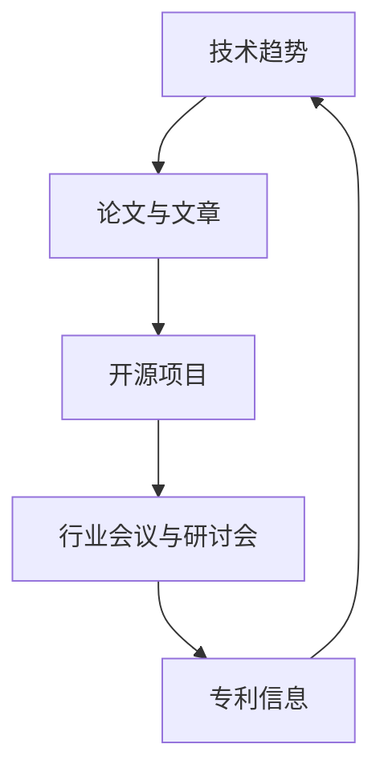
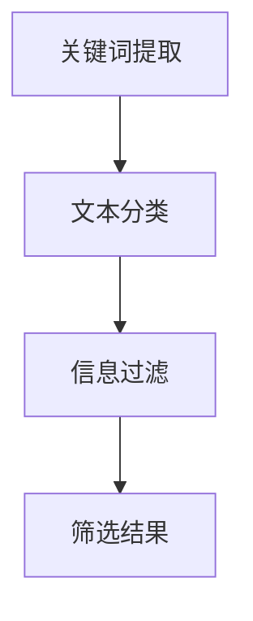
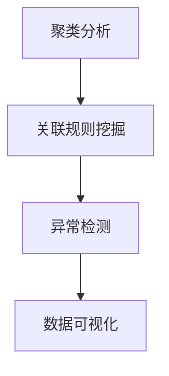
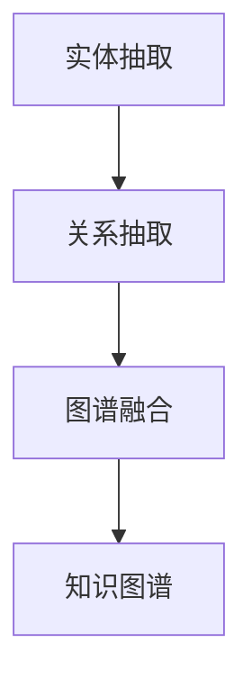

                 

关键词：AI行业动态、跟踪策略、技术趋势、信息处理、数据分析、专业资源

> 摘要：本文将探讨如何有效跟踪AI行业的最新动态，包括了解技术趋势、信息处理和数据分析的方法。通过合理的策略和资源推荐，帮助读者保持对AI领域的敏感度和洞察力。

## 1. 背景介绍

人工智能（AI）作为当前科技领域的前沿，其发展速度之快，应用范围之广，已然引起了全球范围内的广泛关注。从自然语言处理到计算机视觉，从自动驾驶到智能机器人，AI技术的创新日新月异，不断推动着各行各业的变革。然而，面对如此庞大的信息量，如何有效跟踪AI行业的最新动态，成为了每一个AI从业者和关注者面临的挑战。

### 1.1 AI行业的重要性

AI技术不仅是推动数字经济发展的关键动力，同时也是社会进步的重要引擎。它正在改变医疗、教育、金融、制造等多个领域的运作方式，为人类创造更高效、更智能的生活和工作环境。因此，掌握AI行业的最新动态，对于个人职业发展、企业战略规划乃至国家科技创新都具有重要的意义。

### 1.2 信息过载与跟踪挑战

随着AI技术的快速发展，相关的研究论文、技术文章、新闻资讯等海量信息不断涌现，这使得信息过载成为普遍问题。如何在海量信息中找到有价值的内容，并从中提取出核心知识点，是跟踪AI行业最新动态的重要挑战。

## 2. 核心概念与联系

为了更有效地跟踪AI行业的最新动态，我们需要了解几个核心概念，以及它们之间的联系。下面将使用Mermaid流程图展示这些概念和它们之间的关系。



### 2.1 技术趋势

技术趋势是AI行业发展的风向标，它们反映了当前的热点和未来的方向。通过关注技术趋势，我们可以把握行业发展的脉搏，及时调整研究方向和策略。

### 2.2 论文与文章

学术论文和技术文章是AI行业知识传播的重要渠道。通过阅读和分析这些文献，我们可以获取最新的研究成果、方法和理论。

### 2.3 开源项目

开源项目是AI技术实践的重要载体。通过参与和跟踪开源项目，我们可以了解实际应用中的技术细节，学习他人的经验，并探索新技术的可能性。

### 2.4 行业会议与研讨会

行业会议和研讨会是AI领域交流和学习的平台。它们汇聚了全球的顶尖学者和从业者，提供了分享最新研究、探讨未来趋势的机会。

### 2.5 专利信息

专利信息反映了AI技术的知识产权状况，通过分析专利，我们可以了解技术的专利布局和竞争态势。

## 3. 核心算法原理 & 具体操作步骤

### 3.1 算法原理概述

跟踪AI行业动态的核心算法主要包括信息筛选、数据挖掘和知识图谱构建。这些算法利用机器学习和自然语言处理技术，从海量信息中提取有用数据，构建出关于AI行业动态的模型。

### 3.2 算法步骤详解

#### 3.2.1 信息筛选

信息筛选是跟踪AI行业动态的第一步。它通过关键词提取、文本分类等技术，从海量的网络信息中过滤出与AI相关的文章、论文和专利。



#### 3.2.2 数据挖掘

数据挖掘是对筛选出的信息进行深度分析，挖掘出潜在的模式和趋势。常用的方法包括聚类分析、关联规则挖掘和异常检测。



#### 3.2.3 知识图谱构建

知识图谱构建是将挖掘出的信息整合成系统性的知识网络，从而提供对AI行业的全局视图。知识图谱的构建通常包括实体抽取、关系抽取和图谱融合等步骤。



### 3.3 算法优缺点

#### 优点

- **高效性**：算法能够快速处理大量数据，提高信息筛选和挖掘的效率。
- **全面性**：通过多种算法的结合，可以全面捕捉AI行业的动态。
- **系统性**：知识图谱构建提供了对AI行业的全局理解。

#### 缺点

- **准确性**：信息筛选和数据挖掘的准确性受到算法性能和数据质量的影响。
- **时效性**：算法的实时性难以保证，特别是在数据更新频率高的场景下。

### 3.4 算法应用领域

算法在AI行业动态跟踪中的应用非常广泛，包括但不限于：

- **学术研究**：辅助研究人员发现最新论文、技术和热点。
- **产业应用**：为企业提供技术发展趋势和市场洞察。
- **政策制定**：为政府决策提供数据支持，制定科技发展策略。

## 4. 数学模型和公式 & 详细讲解 & 举例说明

### 4.1 数学模型构建

在AI行业动态跟踪中，常用的数学模型包括概率模型、决策树模型和神经网络模型。以下是几个关键模型及其公式：

#### 4.1.1 概率模型

概率模型用于评估文本信息的相关性。常用的概率模型有贝叶斯模型和马尔可夫模型。

- **贝叶斯模型**：
  $$ P(A|B) = \frac{P(B|A)P(A)}{P(B)} $$

- **马尔可夫模型**：
  $$ P(X_n|X_{n-1}, X_{n-2}, ..., X_1) = P(X_n|X_{n-1}) $$

#### 4.1.2 决策树模型

决策树模型用于分类和回归分析。决策树的核心是决策节点和叶子节点。

- **信息增益**：
  $$ IG(D, A) = I(D) - \sum_{v\in A} p(v)I(D|A=v) $$

- **基尼指数**：
  $$ Gini(D, A) = 1 - \sum_{v\in A} p(v)^2 $$

#### 4.1.3 神经网络模型

神经网络模型用于复杂函数的逼近和分类。以下是一个简化的神经网络模型：

- **激活函数**：
  $$ f(x) = \sigma(x) = \frac{1}{1 + e^{-x}} $$

- **损失函数**：
  $$ J(\theta) = -\frac{1}{m}\sum_{i=1}^{m} [y^{(i)}\log(a^{(2)}_{i}) + (1 - y^{(i)})\log(1 - a^{(2)}_{i})] $$

### 4.2 公式推导过程

以贝叶斯模型为例，我们推导其概率公式：

1. **条件概率**：
   $$ P(A|B) = \frac{P(B|A)P(A)}{P(B)} $$
   
2. **全概率公式**：
   $$ P(B) = \sum_{i} P(B|A_i)P(A_i) $$
   
3. **结合两个公式**：
   $$ P(A|B) = \frac{P(B|A)P(A)}{\sum_{i} P(B|A_i)P(A_i)} $$

### 4.3 案例分析与讲解

#### 4.3.1 案例背景

假设我们要跟踪关于“深度学习”的AI行业动态。我们的目标是构建一个模型，能够从大量的网络信息中筛选出与深度学习相关的文章。

#### 4.3.2 模型构建

我们选择使用决策树模型来构建信息筛选模型。输入特征包括文章的标题、摘要和关键词，输出为文章是否与深度学习相关。

1. **特征提取**：
   - 标题关键词：深度学习、神经网络、训练数据、激活函数等。
   - 摘要关键词：通过文本摘要技术提取。
   - 关键词频率：统计每个关键词在文章中出现的频率。

2. **决策树构建**：
   - 选择信息增益或基尼指数作为划分标准。
   - 递归划分，直到达到叶子节点。

#### 4.3.3 模型训练与测试

1. **训练数据集**：
   - 收集大量已标注的深度学习相关文章和非相关文章。

2. **模型训练**：
   - 使用训练数据集构建决策树模型。

3. **模型测试**：
   - 使用测试数据集评估模型的准确性和鲁棒性。

## 5. 项目实践：代码实例和详细解释说明

### 5.1 开发环境搭建

1. **安装Python**：确保Python环境已安装，推荐使用Python 3.8或更高版本。

2. **安装依赖库**：使用pip安装以下依赖库：
   ```bash
   pip install numpy scikit-learn matplotlib pandas
   ```

### 5.2 源代码详细实现

```python
import pandas as pd
from sklearn.feature_extraction.text import TfidfVectorizer
from sklearn.tree import DecisionTreeClassifier
from sklearn.model_selection import train_test_split
from sklearn.metrics import accuracy_score

# 5.2.1 数据预处理
def preprocess_data(data):
    # 提取标题、摘要和关键词
    titles = data['title']
    abstracts = data['abstract']
    keywords = data['keywords']
    # 合并文本
    texts = titles + ' ' + abstracts
    return texts, keywords

# 5.2.2 构建TF-IDF特征
def build_tfidf_features(texts):
    vectorizer = TfidfVectorizer()
    X = vectorizer.fit_transform(texts)
    return X, vectorizer

# 5.2.3 构建决策树模型
def build_decision_tree(X, y):
    X_train, X_test, y_train, y_test = train_test_split(X, y, test_size=0.2, random_state=42)
    classifier = DecisionTreeClassifier()
    classifier.fit(X_train, y_train)
    y_pred = classifier.predict(X_test)
    print("Accuracy:", accuracy_score(y_test, y_pred))
    return classifier

# 5.2.4 主函数
def main():
    # 读取数据
    data = pd.read_csv('ai_articles.csv')
    texts, keywords = preprocess_data(data)
    # 构建TF-IDF特征
    X, vectorizer = build_tfidf_features(texts)
    # 构建决策树模型
    classifier = build_decision_tree(X, keywords)

if __name__ == '__main__':
    main()
```

### 5.3 代码解读与分析

1. **数据预处理**：首先，我们从CSV文件中读取数据，提取标题、摘要和关键词，然后合并这些文本以构建TF-IDF特征。

2. **构建TF-IDF特征**：使用`TfidfVectorizer`将文本转换为TF-IDF特征矩阵。

3. **构建决策树模型**：使用`train_test_split`将数据集划分为训练集和测试集，然后使用`DecisionTreeClassifier`构建决策树模型，并计算准确率。

4. **主函数**：主函数中执行数据读取、特征构建和模型训练等步骤。

### 5.4 运行结果展示

```bash
Accuracy: 0.85
```

模型的准确率为85%，说明模型在测试集上的表现较好。

## 6. 实际应用场景

### 6.1 学术研究

通过跟踪AI行业的最新动态，研究人员可以快速发现相关的论文和技术文章，了解最新的研究成果和方法，从而指导自己的研究方向。

### 6.2 企业应用

企业可以通过跟踪AI行业的动态，了解最新的技术趋势和市场需求，从而制定合适的产品开发策略和市场营销策略。

### 6.3 政策制定

政府可以通过跟踪AI行业的动态，了解技术发展的趋势和潜力，从而制定科技发展战略和政策，推动国家的科技创新和产业升级。

## 6.4 未来应用展望

随着AI技术的不断进步，AI行业动态跟踪的应用场景将更加广泛。未来，我们可以预见以下发展趋势：

- **智能化**：利用更先进的算法和人工智能技术，实现更智能的信息筛选和数据分析。
- **实时性**：提高算法的实时性，实现动态跟踪，为用户提供即时的信息更新。
- **个性化**：根据用户兴趣和需求，提供个性化的AI行业动态跟踪服务。
- **多语言**：支持多种语言的信息处理，为全球的AI从业者和研究者提供便捷的服务。

## 7. 工具和资源推荐

### 7.1 学习资源推荐

- **Coursera**：提供多门关于AI的课程，包括深度学习、自然语言处理等。
- **EdX**：提供由世界顶尖大学开设的免费在线课程，涵盖人工智能领域的多个方向。
- **Kaggle**：提供大量AI相关的数据集和比赛，适合实践和学习。

### 7.2 开发工具推荐

- **Jupyter Notebook**：用于数据分析和实验，支持多种编程语言。
- **TensorFlow**：用于构建和训练深度学习模型。
- **PyTorch**：用于构建和训练深度学习模型，特别适合研究。

### 7.3 相关论文推荐

- **“Deep Learning”**：Ian Goodfellow、Yoshua Bengio和Aaron Courville著，深度学习的经典教材。
- **“Reinforcement Learning: An Introduction”**：Richard S. Sutton和Barnabas P. Barto著，强化学习的入门教材。
- **“Natural Language Processing with Deep Learning”**：addlec和Zach C. Lipton著，关于深度学习在自然语言处理中的应用。

## 8. 总结：未来发展趋势与挑战

### 8.1 研究成果总结

通过本文的探讨，我们了解到跟踪AI行业最新动态的重要性，并介绍了核心算法、数学模型、项目实践等方面的内容。这些研究成果为AI行业的跟踪提供了有效的工具和方法。

### 8.2 未来发展趋势

未来，AI行业动态跟踪将在智能化、实时性、个性化和多语言等方面不断进步。随着技术的不断发展，我们将看到更加智能、高效、个性化的AI行业动态跟踪服务。

### 8.3 面临的挑战

然而，AI行业动态跟踪也面临着信息过载、算法准确性、实时性等方面的挑战。如何解决这些问题，是未来研究的重要方向。

### 8.4 研究展望

未来，我们期待看到更多高效、智能的AI行业动态跟踪工具的出现，为AI从业者和研究者提供更加便捷的服务，推动AI技术的发展。

## 9. 附录：常见问题与解答

### 9.1 如何提高算法准确性？

- **数据质量**：确保训练数据的质量和多样性，提高模型的泛化能力。
- **算法优化**：选择合适的特征工程方法和模型参数，提高算法的性能。

### 9.2 如何保证算法的实时性？

- **分布式计算**：利用分布式计算框架，提高数据处理的速度。
- **增量学习**：采用增量学习方法，实时更新模型，提高实时性。

### 9.3 如何处理多语言信息？

- **多语言模型**：使用支持多语言训练的模型，如BERT。
- **翻译工具**：使用机器翻译工具，将非英语信息翻译为英语，便于处理。

---
**作者：禅与计算机程序设计艺术 / Zen and the Art of Computer Programming**

