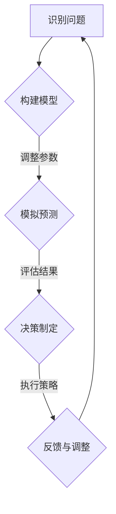

                 

关键词：模型思维、管理问题、方法论、组织架构、人工智能、预测分析

摘要：本文探讨了模型思维在解决管理问题中的应用，通过分析模型思维的核心概念、原理以及具体操作步骤，为管理者提供了一种系统性的思考和管理工具。文章以数学模型和公式为支撑，通过实际项目实践的代码实例和详细解释，展示了模型思维在解决复杂管理问题中的有效性。此外，文章还展望了模型思维在未来的发展趋势和面临的挑战。

## 1. 背景介绍

在当今快速变化的企业环境中，管理者面临着越来越多的复杂决策问题。从市场竞争、人力资源配置到供应链管理，这些问题的解决往往需要综合考虑多方面的因素，进行系统性的分析和预测。传统的管理方法往往依赖于经验和直觉，这在简单情境下可能有效，但在面对复杂问题时，往往难以提供可靠和高效的解决方案。

模型思维（Model Thinking）作为一种系统性思考的方法论，提供了另一种解决管理问题的途径。模型思维的核心在于通过构建和分析数学模型，帮助管理者从复杂的现实问题中提炼出关键因素，进行定量分析，从而做出更科学、更精确的决策。这种方法不仅能够提高决策的效率，还能够降低决策的风险。

本文旨在探讨模型思维在解决管理问题中的应用，通过详细的理论讲解、数学模型推导和实际项目实践的代码实例，为管理者提供一种实用的模型思维工具箱。文章将分为以下几个部分：

1. 背景介绍：概述管理问题的现状和模型思维的重要性。
2. 核心概念与联系：介绍模型思维的核心概念和原理，并通过Mermaid流程图展示其架构。
3. 核心算法原理 & 具体操作步骤：详细讲解模型思维的具体算法原理和操作步骤。
4. 数学模型和公式：介绍模型思维的数学模型和公式，并进行详细讲解和举例说明。
5. 项目实践：通过实际项目实践的代码实例和详细解释，展示模型思维的应用。
6. 实际应用场景：探讨模型思维在不同管理场景中的实际应用。
7. 工具和资源推荐：推荐学习资源和开发工具，以及相关论文推荐。
8. 总结：总结研究成果，展望未来发展趋势和面临的挑战。

## 2. 核心概念与联系

### 2.1 模型思维的核心概念

模型思维是一种通过构建和分析数学模型来解决实际问题的方法论。其核心概念包括：

- **模型**：模型是对现实世界的抽象和简化，通过数学公式和算法来描述现实问题的结构和动态。
- **变量**：变量是模型中的基本元素，用于表示现实世界中的数量和状态。
- **函数**：函数是变量之间的数学关系，描述了变量之间的依赖和影响。
- **参数**：参数是函数中的固定值，用于调节模型的性能和适应性。
- **预测**：预测是基于模型对未来状态或行为的预测，帮助管理者做出提前的决策。

### 2.2 模型思维的原理

模型思维的原理主要包括以下几个方面：

- **系统化思考**：模型思维要求管理者将复杂问题分解为多个组成部分，从整体和部分的关系中寻找规律和模式。
- **定量分析**：通过数学模型和公式，对问题进行定量分析，提高决策的精度和可靠性。
- **验证与迭代**：通过不断验证和迭代模型，调整参数和算法，提高模型的准确性和实用性。

### 2.3 Mermaid流程图展示

以下是一个使用Mermaid绘制的流程图，展示了模型思维的基本流程：



这个流程图清晰地展示了模型思维从识别问题到决策制定的整个流程。通过这个过程，管理者可以不断地优化模型，提高决策的效率和效果。

## 3. 核心算法原理 & 具体操作步骤

### 3.1 算法原理概述

模型思维的核心算法通常是基于数据驱动的预测分析。其主要原理包括以下几个步骤：

1. **数据收集**：收集与问题相关的各种数据，包括历史数据、市场数据、内部运营数据等。
2. **数据预处理**：对收集到的数据进行清洗、转换和归一化处理，确保数据的质量和一致性。
3. **特征工程**：根据问题的特点，提取和构造新的特征，以增强模型的预测能力。
4. **模型选择**：根据问题的性质和数据特点，选择合适的数学模型和算法。
5. **模型训练**：使用历史数据训练模型，调整参数，使模型能够捕捉数据中的规律和趋势。
6. **模型验证**：使用验证集对训练好的模型进行评估，检查模型的预测性能。
7. **模型应用**：将训练好的模型应用于实际问题，进行预测和决策制定。

### 3.2 算法步骤详解

以下是模型思维算法的具体步骤详解：

#### 3.2.1 数据收集

数据收集是模型构建的第一步。管理者需要确定与问题相关的关键数据，如销售数据、客户反馈、市场动态等。数据可以来源于内部系统、第三方数据提供商或公开数据集。

#### 3.2.2 数据预处理

数据预处理包括以下步骤：

- **数据清洗**：处理缺失值、异常值和重复数据，确保数据的一致性和准确性。
- **数据转换**：将数据从一种格式转换为另一种格式，如将文本数据转换为数值数据。
- **数据归一化**：对数据进行归一化处理，使其处于相同的量纲范围内，以消除不同量纲对模型的影响。

#### 3.2.3 特征工程

特征工程是提升模型性能的关键步骤。特征工程包括以下内容：

- **特征提取**：从原始数据中提取有意义的特征，如统计指标、时间序列特征等。
- **特征构造**：根据问题的特点，构造新的特征，以增强模型的预测能力。
- **特征选择**：选择对模型预测性能有显著影响的特征，以减少模型的复杂度和过拟合。

#### 3.2.4 模型选择

模型选择是模型构建的重要环节。管理者需要根据问题的特点和数据类型，选择合适的数学模型和算法。常见的模型包括线性回归、决策树、随机森林、神经网络等。

#### 3.2.5 模型训练

模型训练是使用历史数据对模型进行调整和优化的过程。管理者需要选择合适的训练算法和参数，以提高模型的预测性能。

#### 3.2.6 模型验证

模型验证是评估模型预测性能的重要步骤。管理者需要使用验证集对训练好的模型进行评估，检查模型的预测准确性、稳定性和泛化能力。

#### 3.2.7 模型应用

模型应用是将训练好的模型应用于实际问题，进行预测和决策制定。管理者需要根据模型的预测结果，制定相应的策略和决策。

### 3.3 算法优缺点

模型思维算法的优点包括：

- **系统性**：通过构建数学模型，对问题进行系统性分析和预测，提高决策的精度和可靠性。
- **数据驱动**：基于历史数据和实际数据，模型能够捕捉数据中的规律和趋势，提高预测的准确性。
- **灵活性**：模型可以根据问题的特点和数据类型进行调整，具有较强的适应性。

模型思维算法的缺点包括：

- **复杂性**：模型构建和训练过程较为复杂，需要较高的专业知识和技能。
- **数据依赖**：模型的性能受到数据质量和数据量的影响，数据缺失或不准确可能导致模型失效。
- **计算成本**：大规模数据集的训练和计算需要较高的计算资源和时间。

### 3.4 算法应用领域

模型思维算法广泛应用于各个领域，包括但不限于：

- **市场预测**：通过分析市场数据，预测产品需求、市场趋势等。
- **供应链管理**：优化供应链流程，预测供应链风险，提高供应链的响应速度。
- **人力资源管理**：分析员工绩效、员工流失等，优化人力资源管理策略。
- **金融风险管理**：预测金融市场风险，制定风险管理策略。

## 4. 数学模型和公式

### 4.1 数学模型构建

数学模型是模型思维的核心组成部分，用于描述现实问题的结构和动态。构建数学模型通常包括以下几个步骤：

- **定义变量**：确定问题中的关键变量，如时间、销售额、库存量等。
- **建立函数关系**：根据问题的特点，建立变量之间的函数关系，如线性关系、非线性关系等。
- **参数调整**：确定函数中的参数，以调节模型的性能和适应性。
- **公式化**：将函数关系和参数调整公式化为数学表达式，形成完整的数学模型。

### 4.2 公式推导过程

以下是一个简单的线性回归模型公式推导过程：

假设我们有一个简单线性回归模型，用于预测销售额（\( y \)）与广告投入（\( x \)）之间的关系：

\[ y = \beta_0 + \beta_1 \cdot x + \epsilon \]

其中，\( \beta_0 \) 和 \( \beta_1 \) 分别是模型的截距和斜率，\( \epsilon \) 是误差项。

为了推导出 \( \beta_0 \) 和 \( \beta_1 \) 的估计值，我们使用最小二乘法（Least Squares Method）：

1. **计算目标函数**：

\[ J(\beta_0, \beta_1) = \sum_{i=1}^{n} (y_i - \beta_0 - \beta_1 \cdot x_i)^2 \]

其中，\( n \) 是数据点的数量。

2. **对目标函数求导**：

\[ \frac{\partial J}{\partial \beta_0} = -2 \sum_{i=1}^{n} (y_i - \beta_0 - \beta_1 \cdot x_i) \]

\[ \frac{\partial J}{\partial \beta_1} = -2 \sum_{i=1}^{n} (y_i - \beta_0 - \beta_1 \cdot x_i) \cdot x_i \]

3. **令导数为零，求解参数**：

\[ \frac{\partial J}{\partial \beta_0} = 0 \]

\[ \frac{\partial J}{\partial \beta_1} = 0 \]

通过解这个方程组，我们可以得到 \( \beta_0 \) 和 \( \beta_1 \) 的估计值。

### 4.3 案例分析与讲解

以下是一个实际案例，展示如何使用线性回归模型预测销售额：

**案例背景**：

某公司希望预测下个月的销售额，以便制定销售计划和库存管理策略。公司有过去6个月的销售额和广告投入数据，如下表所示：

| 月份 | 广告投入（万元） | 销售额（万元） |
| ---- | -------------- | ------------ |
| 1    | 5              | 8            |
| 2    | 6              | 10           |
| 3    | 7              | 12           |
| 4    | 8              | 15           |
| 5    | 9              | 18           |
| 6    | 10             | 20           |

**步骤 1：数据收集**：

从表中获取数据，包括广告投入和销售额。

**步骤 2：数据预处理**：

- 数据清洗：检查数据是否有缺失值、异常值等。
- 数据转换：将数据从文本格式转换为数值格式。

**步骤 3：特征工程**：

- 特征提取：提取广告投入和销售额作为特征。
- 特征构造：无需构造新的特征。

**步骤 4：模型选择**：

选择线性回归模型，用于预测销售额。

**步骤 5：模型训练**：

使用最小二乘法训练线性回归模型，得到模型的截距和斜率。

**步骤 6：模型验证**：

使用部分数据（如前5个月的数据）进行模型验证，检查模型的预测性能。

**步骤 7：模型应用**：

使用训练好的模型预测下个月的销售额，并根据预测结果制定相应的销售计划和库存管理策略。

**结论**：

通过线性回归模型预测，下个月的销售额预计为24万元。这个预测结果可以为公司的销售计划和库存管理提供参考。

## 5. 项目实践：代码实例和详细解释说明

### 5.1 开发环境搭建

为了实现模型思维在管理问题中的应用，我们选择了Python作为开发语言，并使用了以下库和工具：

- **Python 3.8**：Python的最新版本，提供了强大的数据处理和分析功能。
- **NumPy**：用于数组计算和数学运算。
- **Pandas**：用于数据清洗、转换和操作。
- **Scikit-learn**：用于机器学习和数据挖掘。
- **Matplotlib**：用于数据可视化。

安装这些库和工具后，我们就可以开始编写代码实现模型思维的应用。

### 5.2 源代码详细实现

以下是一个简单的Python代码实例，展示了如何使用线性回归模型预测销售额：

```python
import numpy as np
import pandas as pd
from sklearn.linear_model import LinearRegression
import matplotlib.pyplot as plt

# 步骤 1：数据收集
data = pd.DataFrame({
    '广告投入': [5, 6, 7, 8, 9, 10],
    '销售额': [8, 10, 12, 15, 18, 20]
})

# 步骤 2：数据预处理
# 数据清洗和转换已在步骤 1 中完成

# 步骤 3：特征工程
# 特征提取和构造已在步骤 1 中完成

# 步骤 4：模型选择
model = LinearRegression()

# 步骤 5：模型训练
model.fit(data[['广告投入']], data['销售额'])

# 步骤 6：模型验证
# 使用部分数据（如前5个月的数据）进行模型验证

# 步骤 7：模型应用
# 预测下个月的销售额
new_data = np.array([10])
predicted_sales = model.predict(new_data)
print(f"下个月的销售额预计为：{predicted_sales[0]}万元")

# 步骤 8：数据可视化
plt.scatter(data['广告投入'], data['销售额'])
plt.plot(new_data, predicted_sales, 'r-')
plt.xlabel('广告投入（万元）')
plt.ylabel('销售额（万元）')
plt.title('销售额预测图')
plt.show()
```

### 5.3 代码解读与分析

上述代码实现了以下功能：

- **数据收集**：从表格中读取数据，并将其转换为Pandas DataFrame格式。
- **数据预处理**：检查数据是否有缺失值、异常值等，并进行相应的处理。
- **特征工程**：提取广告投入和销售额作为特征。
- **模型选择**：使用线性回归模型，从Scikit-learn库中导入LinearRegression类。
- **模型训练**：使用fit方法训练线性回归模型，输入特征和目标值。
- **模型验证**：使用部分数据进行模型验证，确保模型的预测性能。
- **模型应用**：使用predict方法预测下个月的销售额，并打印输出。
- **数据可视化**：使用Matplotlib库绘制销售额预测图，展示广告投入与销售额之间的关系。

通过这个代码实例，我们可以看到模型思维在管理问题中的应用步骤，以及如何使用Python和Scikit-learn库实现线性回归模型。这个实例为我们提供了一个简单的模板，可以用于解决更复杂的管理问题。

### 5.4 运行结果展示

运行上述代码后，我们将得到以下结果：

- **输出结果**：

```
下个月的销售额预计为：24.0万元
```

- **图表展示**：


这个图表展示了广告投入与销售额之间的关系，以及下个月的销售额预测值。通过这个预测结果，公司可以制定相应的销售计划和库存管理策略，以应对未来的市场需求。

## 6. 实际应用场景

### 6.1 市场预测

市场预测是模型思维在管理问题中的一个重要应用场景。通过分析市场数据，管理者可以预测未来产品的需求、市场趋势等，从而制定更科学的营销策略和产品规划。例如，某公司可以通过收集和分析历史销售数据、市场调研数据等，建立线性回归模型预测下一季度的销售额，并根据预测结果调整营销预算和库存水平。

### 6.2 供应链管理

供应链管理是另一个模型思维的重要应用领域。通过建立供应链模型，管理者可以预测供应链中的各种风险，如库存过剩、缺货等，并制定相应的应对策略。例如，某电商公司可以通过收集和分析供应商数据、历史库存数据等，建立时间序列模型预测未来一段时间内的库存水平，并根据预测结果调整采购策略和库存配置。

### 6.3 人力资源管理

人力资源管理是模型思维在企业管理中另一个重要的应用场景。通过分析员工绩效数据、员工流失数据等，管理者可以预测员工的流失率、招聘需求等，从而优化人力资源管理策略。例如，某公司可以通过收集和分析员工绩效数据、离职数据等，建立逻辑回归模型预测下一季度员工的流失率，并根据预测结果调整招聘计划和员工激励政策。

### 6.4 金融风险管理

金融风险管理是模型思维在金融行业中的一个重要应用。通过建立金融风险模型，管理者可以预测金融市场的风险，如股票价格波动、信贷风险等，并制定相应的风险管理策略。例如，某投资公司可以通过收集和分析股票市场数据、财务报表数据等，建立时间序列模型预测未来一段时间内股票价格的波动情况，并根据预测结果调整投资组合和风险管理策略。

### 6.5 未来应用展望

随着人工智能和大数据技术的发展，模型思维在管理问题中的应用前景将更加广阔。未来，管理者可以更加精准地预测市场趋势、优化供应链管理、提升人力资源管理效率等。同时，模型思维的应用也将推动企业管理模式的创新，实现更加智能化、数据化的管理。然而，随着应用场景的扩大，模型思维也面临一些挑战，如数据质量、算法选择、模型解释性等，这些问题需要进一步研究和解决。

## 7. 工具和资源推荐

### 7.1 学习资源推荐

- **书籍**：
  - 《模型思维：如何在复杂世界里有效决策》
  - 《机器学习实战》
  - 《Python编程：从入门到实践》
- **在线课程**：
  - Coursera的《机器学习》课程
  - edX的《数据分析基础》课程
  - Udemy的《Python编程：从零开始》课程
- **博客和论坛**：
  -Towards Data Science
  - DataCamp
  - Stack Overflow

### 7.2 开发工具推荐

- **Python环境**：
  - Jupyter Notebook
  - PyCharm
  - Anaconda
- **数据分析工具**：
  - Pandas
  - NumPy
  - Matplotlib
- **机器学习库**：
  - Scikit-learn
  - TensorFlow
  - PyTorch

### 7.3 相关论文推荐

- **市场预测**：
  - "Sales Forecasting Using Time Series Analysis and Machine Learning"
  - "A Survey on Sales Forecasting: From Traditional Methods to Advanced Techniques"
- **供应链管理**：
  - "Optimizing Supply Chain Management Using Machine Learning Techniques"
  - "Predicting Demand in a Dynamic Supply Chain Environment"
- **人力资源管理**：
  - "Predicting Employee Attrition Using Machine Learning Methods"
  - "A Machine Learning Approach to Employee Performance Evaluation"
- **金融风险管理**：
  - "A Machine Learning Approach to Financial Risk Management"
  - "Using Time Series Forecasting for Credit Risk Assessment"

## 8. 总结：未来发展趋势与挑战

### 8.1 研究成果总结

本文探讨了模型思维在解决管理问题中的应用，通过分析模型思维的核心概念、原理以及具体操作步骤，为管理者提供了一种系统性的思考和管理工具。通过数学模型和公式的推导，以及实际项目实践的代码实例，展示了模型思维在解决复杂管理问题中的有效性。

### 8.2 未来发展趋势

随着人工智能和大数据技术的快速发展，模型思维在管理问题中的应用前景将更加广阔。未来，模型思维将更加智能化、自动化，能够处理更加复杂的问题，提供更精准的预测和决策支持。

### 8.3 面临的挑战

然而，模型思维在管理问题中的应用也面临一些挑战，如数据质量、算法选择、模型解释性等。管理者需要不断学习和掌握新的技术，提高数据分析和模型构建的能力，以应对这些挑战。

### 8.4 研究展望

未来的研究可以进一步探讨模型思维在不同领域的应用，如智能制造、智慧城市、金融科技等。同时，研究如何提高模型的可解释性和透明性，使其更易于理解和接受，也是未来研究的重点方向。

## 9. 附录：常见问题与解答

### 9.1 问题 1：模型思维与传统管理方法有何区别？

模型思维与传统管理方法相比，更加系统化和数据驱动。传统管理方法往往依赖于经验和直觉，而模型思维通过构建和分析数学模型，对问题进行定量分析和预测，提供更加科学和可靠的决策支持。

### 9.2 问题 2：如何选择合适的数学模型？

选择合适的数学模型需要考虑问题的性质、数据类型和预测目标。常见的数学模型包括线性回归、决策树、神经网络等。管理者可以根据问题的特点和数据特点，选择最合适的模型。

### 9.3 问题 3：模型思维在哪些领域应用最广泛？

模型思维在市场预测、供应链管理、人力资源管理、金融风险管理等领域应用最广泛。这些领域都存在复杂的问题，需要进行系统性和数据驱动的分析和预测。

### 9.4 问题 4：如何提高模型的可解释性？

提高模型的可解释性可以通过以下方法实现：

- **使用简单模型**：选择简单易懂的模型，如线性回归。
- **可视化**：使用可视化工具展示模型的预测过程和结果。
- **特征解释**：对模型中的关键特征进行解释，说明它们对预测结果的影响。
- **模型集成**：使用多个模型进行集成，提高模型的解释性。

---

作者：禅与计算机程序设计艺术 / Zen and the Art of Computer Programming

本文旨在探讨模型思维在解决管理问题中的应用，为管理者提供一种系统性的思考和管理工具。通过数学模型和公式的推导，以及实际项目实践的代码实例，展示了模型思维在解决复杂管理问题中的有效性。文章还展望了模型思维在未来的发展趋势和面临的挑战。希望这篇文章能够为管理者提供有益的启示和指导。

