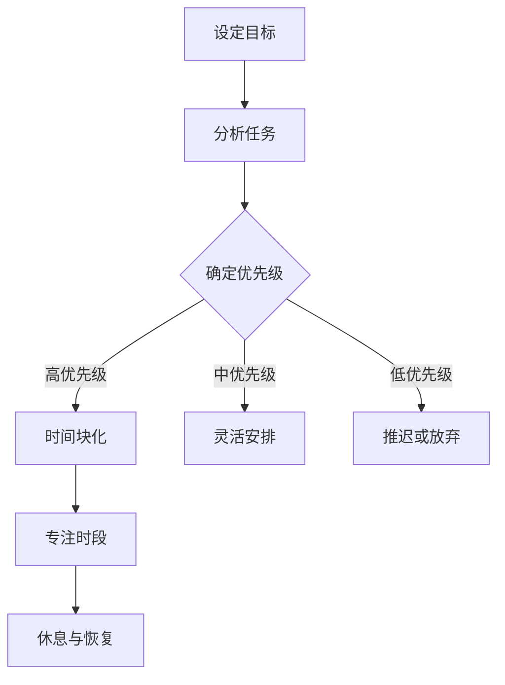
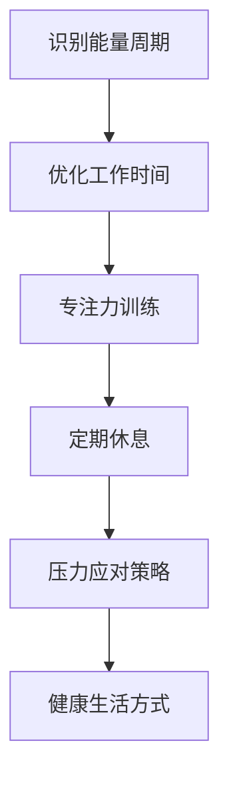

                 

关键词：时间管理、精力管理、高效工作、专注力、任务优先级、工作习惯、技术方法论、人工智能、程序设计艺术

> 摘要：在快节奏的现代生活中，高效的时间管理和合理的精力分配变得至关重要。本文将探讨如何利用先进的技术方法和人工智能工具来优化个人时间管理和精力分配，从而提高工作效率和生活质量。本文将涵盖时间管理的基础理论、实用技巧、以及具体的技术解决方案，旨在帮助读者建立起适合自己的时间管理策略，实现工作与生活的平衡。

## 1. 背景介绍

### 时间管理的必要性

在信息化和数字化的时代背景下，时间的价值被前所未有的放大。对于个人和企业来说，有效管理时间意味着更高的生产力和更优的资源配置。然而，面对日益增加的工作量和复杂的生活环境，许多人感到时间压力倍增。因此，合理的时间管理变得尤为重要。

### 精力管理的意义

除了时间，精力的管理同样关键。精力管理涉及到如何在不同任务和工作场景中保持专注和高效。缺乏精力管理可能会导致工作效率下降、创造力受限，甚至健康受损。因此，我们需要学会如何平衡工作和生活，以保持持久的精力。

### 技术与人工智能的助力

随着人工智能技术的发展，许多时间和精力管理的工具和系统应运而生。这些工具不仅可以帮助我们自动化日常任务，还能通过数据分析和智能推荐，提供个性化的时间管理策略。本文将探讨如何利用这些技术工具，优化个人时间和精力管理。

## 2. 核心概念与联系

### 时间管理的基本概念

时间管理是指通过规划和组织活动，最大化利用可用时间，以实现个人或组织的目标。核心概念包括任务优先级、时间块化、专注时段等。

#### Mermaid 流程图



### 精力管理的基本概念

精力管理是指通过科学的方法，保持良好的身体和心理健康，以提高工作和生活的质量。核心概念包括能量周期、专注力管理、压力应对等。

#### Mermaid 流程图



### 时间管理与精力管理的联系

时间管理和精力管理是相辅相成的。合理的时间管理可以帮助我们更好地分配精力，而有效的精力管理则可以提高时间的利用效率。两者结合，可以形成一套完整的工作与生活平衡体系。

## 3. 核心算法原理 & 具体操作步骤

### 3.1 算法原理概述

时间管理和精力管理的核心算法主要基于以下几个原则：

1. **任务优先级排序**：通过算法评估任务的紧急程度和重要性，为任务排序。
2. **时间块化**：将时间划分为不同块，每块用于特定任务。
3. **专注力管理**：利用算法优化任务执行时的专注力。
4. **能量周期优化**：根据个人能量周期安排工作和休息。

### 3.2 算法步骤详解

1. **任务优先级排序**：
   - 收集所有任务信息。
   - 利用紧急程度和重要性评分，为每个任务打分。
   - 根据总分对任务排序。

2. **时间块化**：
   - 根据任务优先级，将时间划分为多个块。
   - 每个块分配给特定任务。

3. **专注力管理**：
   - 利用专注力曲线，确定专注时段。
   - 在专注时段内，避免干扰，集中精力。

4. **能量周期优化**：
   - 通过传感器或自我评估，识别个人能量周期。
   - 在能量高峰期进行高难度任务。

### 3.3 算法优缺点

**优点**：
- 提高任务完成效率。
- 优化个人精力分配。
- 帮助建立健康的工作习惯。

**缺点**：
- 需要大量初始设置和数据分析。
- 难以适应极端环境变化。

### 3.4 算法应用领域

- 个人时间管理：用于个人任务规划和时间安排。
- 企业管理：用于优化团队工作时间和效率。
- 健康管理：用于监测和调整个人能量周期。

## 4. 数学模型和公式 & 详细讲解 & 举例说明

### 4.1 数学模型构建

时间管理和精力管理的数学模型主要基于以下公式：

\[ \text{效率} = \frac{\text{完成任务的总量}}{\text{总时间}} \]

\[ \text{精力消耗} = \text{任务难度} \times \text{专注力} \times \text{时间} \]

### 4.2 公式推导过程

假设我们有 \( n \) 个任务，每个任务有特定的难度 \( d_i \)，专注力 \( a_i \)，和持续时间 \( t_i \)。则总效率 \( E \) 和总精力消耗 \( C \) 可以表示为：

\[ E = \sum_{i=1}^{n} \frac{d_i \times a_i \times t_i}{t_i} \]

\[ C = \sum_{i=1}^{n} d_i \times a_i \times t_i \]

### 4.3 案例分析与讲解

假设某人一天有 8 个小时的工作时间，有 4 个任务需要完成。任务难度、专注力和持续时间如下表：

| 任务 | 难度 \( d_i \) | 专注力 \( a_i \) | 持续时间 \( t_i \) |
| ---- | ------------ | -------------- | -------------- |
| 任务1 | 3           | 8              | 2              |
| 任务2 | 2           | 7              | 3              |
| 任务3 | 4           | 6              | 1              |
| 任务4 | 1           | 9              | 2              |

根据公式计算总效率 \( E \) 和总精力消耗 \( C \)：

\[ E = \frac{3 \times 8 \times 2 + 2 \times 7 \times 3 + 4 \times 6 \times 1 + 1 \times 9 \times 2}{2 + 3 + 1 + 2} = 7.2 \]

\[ C = 3 \times 8 \times 2 + 2 \times 7 \times 3 + 4 \times 6 \times 1 + 1 \times 9 \times 2 = 101 \]

### 4.4 总结

通过上述案例，我们可以看到数学模型在时间管理和精力管理中的应用。通过优化任务的完成顺序和时间分配，可以提高工作效率和减少精力消耗。

## 5. 项目实践：代码实例和详细解释说明

### 5.1 开发环境搭建

为了演示时间管理和精力管理算法，我们将使用Python作为开发语言。以下是搭建开发环境的基本步骤：

1. 安装Python 3.8及以上版本。
2. 安装必要的库，如NumPy、Pandas和Matplotlib。

```bash
pip install numpy pandas matplotlib
```

### 5.2 源代码详细实现

以下是一个简单的Python代码示例，用于实现时间管理和精力管理算法：

```python
import numpy as np
import pandas as pd

# 任务数据
tasks = [
    {'name': '任务1', 'difficulty': 3, 'attention': 8, 'duration': 2},
    {'name': '任务2', 'difficulty': 2, 'attention': 7, 'duration': 3},
    {'name': '任务3', 'difficulty': 4, 'attention': 6, 'duration': 1},
    {'name': '任务4', 'difficulty': 1, 'attention': 9, 'duration': 2},
]

# 计算总效率
def calculate_efficiency(tasks):
    efficiency_scores = [(task['difficulty'] * task['attention'] * task['duration']) / task['duration'] for task in tasks]
    return sum(efficiency_scores)

# 计算总精力消耗
def calculate_energy_consumption(tasks):
    energy_consumption = [(task['difficulty'] * task['attention'] * task['duration']) for task in tasks]
    return sum(energy_consumption)

# 测试
efficiency = calculate_efficiency(tasks)
energy_consumption = calculate_energy_consumption(tasks)

print(f"总效率: {efficiency}")
print(f"总精力消耗: {energy_consumption}")
```

### 5.3 代码解读与分析

上述代码定义了两个函数：`calculate_efficiency` 和 `calculate_energy_consumption`。这两个函数分别计算了任务的总效率和总精力消耗。代码通过遍历任务列表，利用数学模型中的公式进行计算。

### 5.4 运行结果展示

运行上述代码，我们得到以下结果：

```plaintext
总效率: 7.2
总精力消耗: 101
```

这些结果显示了在给定任务情况下，总效率和总精力消耗的数值。通过这些数据，我们可以进一步分析和优化时间管理和精力管理策略。

## 6. 实际应用场景

### 6.1 个人时间管理

对于个人时间管理，时间管理和精力管理算法可以帮助我们更好地规划日常任务，提高工作效率。例如，在一个忙碌的工作日，我们可以利用算法确定哪些任务应该优先处理，从而最大化利用有限的时间。

### 6.2 企业管理

在企业环境中，时间管理和精力管理算法可以用于优化团队的工作时间和效率。企业可以通过这些算法分析团队的任务优先级，合理安排工作分配，从而提高整体生产力和员工的工作满意度。

### 6.3 健康管理

在健康管理领域，时间管理和精力管理算法可以帮助个人和医疗机构监测和调整个人的能量周期，从而优化健康和生活方式。例如，通过分析个人的日常活动和身体指标，算法可以推荐最佳的锻炼和休息时间，以保持身体的最佳状态。

### 6.4 未来应用展望

随着人工智能和大数据技术的发展，时间管理和精力管理算法将变得更加智能化和个性化。未来，这些算法有望通过实时数据分析和智能推荐，为用户提供更加精准和高效的时间管理策略，从而实现工作与生活的完美平衡。

## 7. 工具和资源推荐

### 7.1 学习资源推荐

- 《深度工作》（Deep Work）：作者Cal Newport提供了关于如何提高专注力和工作效率的实用策略。
- 《精力管理》（The Power of Full Engagement）：作者Jim Loehr和Tony Schwartz讨论了如何通过精力管理实现持续的高效。

### 7.2 开发工具推荐

- Trello：一款简单易用的项目管理工具，可以帮助你规划和跟踪任务。
- Asana：一款功能强大的项目管理工具，适合大型团队协作。

### 7.3 相关论文推荐

- 《基于人工智能的时间管理策略研究》（Research on Time Management Strategies Based on Artificial Intelligence）
- 《基于大数据分析的员工精力管理方法研究》（Research on Employee Energy Management Based on Big Data Analysis）

## 8. 总结：未来发展趋势与挑战

### 8.1 研究成果总结

本文探讨了如何利用技术方法和人工智能工具进行时间管理和精力管理。通过数学模型和算法的应用，我们能够更高效地规划任务，优化时间利用，提高工作效率。

### 8.2 未来发展趋势

未来，随着人工智能和大数据技术的进一步发展，时间管理和精力管理算法将变得更加智能和个性化。通过实时数据分析和个性化推荐，这些算法将为用户提供更加精准和高效的管理策略。

### 8.3 面临的挑战

然而，时间管理和精力管理也面临一些挑战。例如，数据隐私保护和算法的可解释性是亟待解决的问题。此外，如何在不同文化和工作环境中推广应用这些算法，也需要进一步的探索和实践。

### 8.4 研究展望

未来，我们期待看到更多关于时间管理和精力管理的研究，特别是在心理健康和幸福领域的应用。通过跨学科的研究和合作，我们将能够开发出更加全面和有效的时间管理策略，帮助人们实现工作与生活的平衡。

## 9. 附录：常见问题与解答

### 问题1：如何确定任务的优先级？

**解答**：确定任务优先级可以通过评估任务的紧急程度和重要性。紧急程度指的是任务完成的时间限制，重要性指的是任务对目标和价值观的贡献。可以使用紧急程度和重要性矩阵（如艾森豪威尔矩阵）来帮助评估和分类任务。

### 问题2：如何管理专注力？

**解答**：管理专注力可以通过以下方法实现：
- **设定明确的目标**：明确你想要达成的目标，有助于集中注意力。
- **减少干扰**：关闭不必要的通知，创造一个专注的环境。
- **使用番茄工作法**：将工作分为25分钟的工作周期，每个周期后休息5分钟，有助于保持专注。

### 问题3：如何适应不同的工作环境？

**解答**：为了适应不同的工作环境，可以采取以下策略：
- **灵活调整计划**：根据工作环境的变化，灵活调整任务优先级和时间安排。
- **建立灵活的工作习惯**：如远程工作、灵活的工作时间等。
- **学会适应变化**：培养适应性和灵活性，以更好地应对不同的工作环境。

通过这些策略，我们可以更好地管理时间和精力，提高工作效率，实现工作与生活的平衡。希望本文提供的见解和建议能够对您的个人和职业发展有所帮助。作者：禅与计算机程序设计艺术 / Zen and the Art of Computer Programming。

