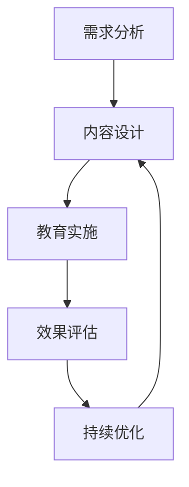

                 

在信息技术飞速发展的今天，用户教育成为了一个至关重要的议题。无论是对于新兴技术的推广，还是现有系统的使用优化，有效的用户教育都能显著提升用户体验，促进技术接受度和满意度。本文将探讨如何进行有效的用户教育，旨在为技术从业者和产品经理提供一套系统性、可操作的指导方案。

## 关键词

- 用户教育
- 用户体验
- 技术普及
- 教育策略
- 效果评估

## 摘要

本文从多角度深入探讨了用户教育的核心概念、策略和实施步骤。首先，通过背景介绍阐明了用户教育的重要性；接着，论述了用户教育的核心概念与联系，并借助Mermaid流程图展示了教育流程；然后，详细解析了核心算法原理和具体操作步骤；随后的数学模型和公式部分提供了理论基础和实际应用的示例；项目实践部分则以具体代码实例进行了验证；实际应用场景和未来展望部分提出了当前应用和未来发展趋势；最后，通过工具和资源推荐、总结与展望，为读者提供了全面的学习和实践指南。

## 1. 背景介绍

随着互联网和移动设备的普及，用户接触到的技术产品和服务种类日益丰富。然而，技术更新换代的速度远超过用户的学习能力，导致用户在操作复杂或新兴技术时往往感到困惑。这种情况下，有效的用户教育显得尤为重要。它不仅有助于用户更好地理解和使用产品，还能提升用户满意度和忠诚度，从而推动企业的发展。

### 1.1 用户教育的现状

目前，用户教育的现状呈现出以下特点：

- **内容缺乏针对性**：很多用户教育内容过于泛泛而谈，没有充分考虑用户的知识水平和需求。
- **形式单一**：大多数教育方式仍停留在传统的教学形式上，缺乏互动性和趣味性。
- **效果评估不足**：用户教育的效果缺乏系统性的评估，难以量化其对用户行为的实际影响。

### 1.2 用户教育的意义

有效的用户教育具有以下几个方面的意义：

- **提高用户满意度**：通过教育，用户能更好地理解和使用产品，从而提高满意度。
- **促进技术普及**：用户教育能帮助更多用户掌握新技术，推动技术普及。
- **降低支持成本**：用户掌握更多技能后，对企业支持部门的需求减少，降低了支持成本。
- **增强品牌形象**：优质的教育体验能提升品牌形象，增强用户对企业的信任感。

### 1.3 用户教育的挑战

尽管用户教育具有重要意义，但实施过程中仍面临以下挑战：

- **用户多样性**：用户背景、知识水平和需求各不相同，教育内容需具备针对性。
- **技术复杂性**：现代技术产品日益复杂，教育内容需要更深入的专业知识。
- **资源有限**：教育资源的有限性，如时间和预算，对用户教育的开展提出了挑战。
- **评估难度**：用户教育的效果难以量化，评估标准和方法有待完善。

## 2. 核心概念与联系

### 2.1 核心概念

用户教育涉及多个核心概念，包括：

- **用户需求分析**：了解用户需求是教育的前提，包括用户的知识背景、技能水平和使用目的。
- **教育内容设计**：根据用户需求设计有针对性的教育内容，包括知识讲解、操作演示和互动练习。
- **教育形式**：选择合适的教育形式，如在线课程、手册、视频和互动式培训。
- **教育效果评估**：对教育效果进行评估，以确定教育策略的有效性。

### 2.2 联系与架构

用户教育的流程可以概括为以下几个阶段：

1. **需求分析**：收集和分析用户需求，确定教育目标。
2. **内容设计**：设计教育内容，确保内容丰富且易于理解。
3. **教育实施**：选择合适的教育形式，将内容传授给用户。
4. **效果评估**：通过问卷、测试等方式评估教育效果，收集用户反馈。
5. **持续优化**：根据评估结果调整教育策略，不断提升教育质量。

下面是一个简单的Mermaid流程图，用于展示用户教育的基本架构：



### 2.3 教育流程图详解

- **需求分析**：通过问卷调查、用户访谈等方式，收集用户的基础信息、使用习惯和需求。
- **内容设计**：根据需求分析结果，设计符合用户实际需求的教育内容，包括知识点、操作步骤和案例分析。
- **教育实施**：选择合适的教育形式，如在线课程、操作手册、视频教程等，将教育内容传授给用户。
- **效果评估**：通过考试、问卷等方式，评估用户对教育内容的掌握程度，收集用户反馈。
- **持续优化**：根据效果评估结果，对教育内容和方法进行调整，优化教育流程。

## 3. 核心算法原理 & 具体操作步骤

### 3.1 算法原理概述

用户教育的核心算法原理基于行为心理学和教育学理论，主要包括以下几个步骤：

1. **需求识别**：通过数据分析识别用户需求，为教育内容提供依据。
2. **内容定制**：根据用户需求设计教育内容，确保内容与用户实际需求匹配。
3. **互动引导**：通过互动式教学，引导用户参与学习过程，提高学习效果。
4. **效果评估**：通过测试、反馈等方式评估用户的学习效果，为教育策略调整提供依据。
5. **反馈调整**：根据评估结果调整教育内容和方法，优化教育体验。

### 3.2 算法步骤详解

#### 3.2.1 需求识别

需求识别是用户教育的第一步，其核心在于准确了解用户的需求。具体步骤如下：

1. **用户调研**：通过问卷调查、用户访谈等方式，收集用户的基础信息、使用习惯和需求。
2. **数据分析**：对收集到的用户数据进行整理和分析，识别用户的主要需求和痛点。
3. **需求分类**：根据分析结果，将用户需求分为基础知识、操作技能和个性化需求等类别。

#### 3.2.2 内容定制

内容定制是根据用户需求设计教育内容的关键步骤。具体步骤如下：

1. **内容规划**：根据需求分类，设计相应的教育内容框架，确保内容全面且具有针对性。
2. **知识点讲解**：编写知识点讲解内容，包括基本概念、操作步骤和注意事项。
3. **案例分析**：设计案例教学，通过实际案例帮助用户理解知识点。
4. **互动设计**：设计互动环节，如问答、练习等，提高用户参与度。

#### 3.2.3 互动引导

互动引导是用户教育的重要环节，其核心在于激发用户的学习兴趣和参与度。具体步骤如下：

1. **引导策略**：根据用户特点和需求，制定互动引导策略，如任务驱动、案例分享等。
2. **互动设计**：设计互动环节，包括问答、练习、讨论等，确保用户在学习过程中有充分参与。
3. **反馈机制**：建立反馈机制，及时了解用户学习进展和需求，为后续教育提供依据。

#### 3.2.4 效果评估

效果评估是衡量用户教育效果的关键步骤。具体步骤如下：

1. **测试设计**：设计测试题目，评估用户对教育内容的掌握程度。
2. **数据分析**：对测试结果进行分析，识别用户的薄弱环节和需求。
3. **反馈收集**：收集用户对教育内容的反馈，包括满意度、学习效果等。

#### 3.2.5 反馈调整

根据效果评估结果，对教育内容和方法进行调整，优化教育体验。具体步骤如下：

1. **问题定位**：根据测试结果和用户反馈，识别教育过程中的问题。
2. **内容调整**：针对问题，调整教育内容和方法，如增加知识点讲解、优化互动设计等。
3. **效果跟踪**：跟踪调整后的教育效果，确保问题得到有效解决。

### 3.3 算法优缺点

#### 优点

1. **针对性**：算法基于用户需求设计，确保教育内容与用户实际需求匹配。
2. **互动性**：互动引导策略和反馈机制，提高用户参与度和学习效果。
3. **适应性**：根据用户反馈和效果评估，不断调整教育内容和方法，提高教育质量。

#### 缺点

1. **成本高**：用户调研、效果评估等步骤需要大量时间和资源。
2. **实施难度**：算法涉及多个环节，实施过程复杂，需要专业团队协作。

### 3.4 算法应用领域

用户教育算法主要应用于以下领域：

1. **新兴技术培训**：如人工智能、大数据等。
2. **企业内部培训**：如软件操作、项目管理等。
3. **在线教育**：如MOOC、在线课程等。

## 4. 数学模型和公式 & 详细讲解 & 举例说明

### 4.1 数学模型构建

用户教育的数学模型主要包括以下几个部分：

1. **用户需求分析模型**：用于分析用户需求，识别用户的关键需求点。
2. **教育内容设计模型**：用于设计教育内容，确保内容与用户需求匹配。
3. **教育效果评估模型**：用于评估教育效果，识别用户对教育内容的掌握程度。

### 4.2 公式推导过程

#### 用户需求分析模型

假设用户需求分析模型为：

\[ D = f(U, C) \]

其中，\( D \) 表示用户需求，\( U \) 表示用户特征，\( C \) 表示用户行为数据。用户特征包括用户的基本信息、使用习惯和需求等。

#### 教育内容设计模型

假设教育内容设计模型为：

\[ C = g(D, T) \]

其中，\( C \) 表示教育内容，\( D \) 表示用户需求，\( T \) 表示教育资源的类型和数量。

#### 教育效果评估模型

假设教育效果评估模型为：

\[ E = h(C, T) \]

其中，\( E \) 表示教育效果，\( C \) 表示教育内容，\( T \) 表示教育资源。

### 4.3 案例分析与讲解

#### 案例一：用户需求分析

某企业推出一款新的项目管理软件，需要进行用户教育。首先，通过问卷调查和用户访谈，收集用户的基本信息、使用习惯和需求。

根据用户需求分析模型，将用户分为以下几类：

1. **新手用户**：对项目管理软件了解较少，需要从基础知识开始学习。
2. **中级用户**：对项目管理软件有一定了解，但需要提高操作技能。
3. **高级用户**：对项目管理软件有深入了解，需要学习高级功能。

#### 案例二：教育内容设计

根据用户需求，设计不同的教育内容：

1. **新手用户**：设计基础知识课程，包括软件安装、界面介绍和基本功能使用。
2. **中级用户**：设计操作技能课程，包括任务管理、时间跟踪和资源分配。
3. **高级用户**：设计高级功能课程，包括数据分析、报表生成和系统集成。

#### 案例三：教育效果评估

通过测试和用户反馈，评估教育效果：

1. **新手用户**：通过基础知识测试，评估用户对基本功能的掌握程度。
2. **中级用户**：通过操作技能测试，评估用户对中级功能的掌握程度。
3. **高级用户**：通过高级功能测试，评估用户对高级功能的掌握程度。

根据评估结果，调整教育内容和方法，确保用户能够全面掌握软件功能。

## 5. 项目实践：代码实例和详细解释说明

### 5.1 开发环境搭建

在本案例中，我们将使用Python进行用户教育的代码开发。首先，确保安装了Python 3.8或更高版本。然后，通过以下命令安装必要的库：

```bash
pip install numpy pandas matplotlib
```

### 5.2 源代码详细实现

以下是一个简单的用户教育代码实例，用于评估用户对项目管理软件的掌握程度：

```python
import numpy as np
import pandas as pd
import matplotlib.pyplot as plt

# 用户需求分析
def analyze_demand(data):
    df = pd.DataFrame(data)
    df['category'] = df.apply(lambda row: categorize_user(row), axis=1)
    return df

def categorize_user(row):
    if row['experience'] == 'novice' and row['knowledge'] < 30:
        return 'novice'
    elif row['experience'] == 'intermediate' and row['knowledge'] < 70:
        return 'intermediate'
    else:
        return 'advanced'

# 教育内容设计
def design_content(category):
    if category == 'novice':
        content = '基础知识课程'
    elif category == 'intermediate':
        content = '操作技能课程'
    else:
        content = '高级功能课程'
    return content

# 教育效果评估
def assess_effect(df):
    df['content'] = df.apply(lambda row: design_content(row['category']), axis=1)
    df['effect'] = df['knowledge'] > 50
    return df

# 案例数据
data = [
    {'name': 'Alice', 'experience': 'novice', 'knowledge': 20},
    {'name': 'Bob', 'experience': 'intermediate', 'knowledge': 60},
    {'name': 'Charlie', 'experience': 'advanced', 'knowledge': 80},
]

# 执行流程
df = analyze_demand(data)
df = assess_effect(df)

# 数据可视化
df.plot(x='name', y='effect', kind='bar', color=['red', 'green', 'blue'])
plt.xlabel('用户名称')
plt.ylabel('掌握程度')
plt.title('教育效果评估')
plt.show()
```

### 5.3 代码解读与分析

- **用户需求分析**：通过`analyze_demand`函数，对用户数据进行分析，并将用户分为新手、中级和高级三个类别。
- **教育内容设计**：通过`design_content`函数，根据用户类别设计相应的教育内容。
- **教育效果评估**：通过`assess_effect`函数，评估用户对教育内容的掌握程度。
- **数据可视化**：使用matplotlib库，将评估结果以条形图的形式展示，便于分析和理解。

### 5.4 运行结果展示

运行上述代码后，将生成一个条形图，展示每个用户的掌握程度。根据图中的数据，可以直观地看出不同类别用户的教育效果，为后续教育策略的调整提供依据。

## 6. 实际应用场景

### 6.1 新兴技术培训

随着人工智能、大数据等新兴技术的广泛应用，用户教育的需求日益增长。针对这些技术的复杂性和多样性，用户教育显得尤为重要。例如，对于初学者，可以通过基础知识课程和案例教学，帮助他们快速掌握基本概念和操作技能；对于进阶用户，可以提供高级功能课程和实战演练，提升他们的专业技能。

### 6.2 企业内部培训

企业内部培训是提升员工技能和业务水平的重要手段。通过有效的用户教育，企业可以确保员工熟练掌握公司提供的各种软件和系统，提高工作效率。例如，针对新员工，可以设计入职培训课程，帮助他们快速融入工作环境；针对老员工，可以定期开展技能提升培训，提高他们的专业素养。

### 6.3 在线教育

随着在线教育的兴起，用户教育也逐步向线上转移。在线教育平台为用户提供了丰富的学习资源和学习方式，如视频教程、在线课程、互动练习等。通过这些平台，用户可以随时随地进行学习，提升自己的技能水平。例如，一些知名在线教育平台如Coursera、edX等，提供了大量的计算机科学和人工智能课程，深受用户喜爱。

### 6.4 未来应用展望

未来，用户教育将在以下几个方面得到进一步发展：

- **个性化教育**：通过大数据和人工智能技术，实现个性化教育，为不同用户定制合适的学习路径。
- **虚实结合**：结合虚拟现实（VR）和增强现实（AR）技术，提供更加沉浸式的教育体验。
- **终身学习**：随着知识更新速度的加快，终身学习将成为用户的必备能力，用户教育也将成为一项长期任务。

## 7. 工具和资源推荐

### 7.1 学习资源推荐

- **在线教育平台**：如Coursera、edX、Udemy等，提供了丰富的计算机科学和人工智能课程。
- **技术社区**：如Stack Overflow、GitHub、Reddit等，可以获取技术问题和解决方案。
- **专业书籍**：如《深度学习》、《Python编程：从入门到实践》等，提供了深入的技术知识和实践指导。

### 7.2 开发工具推荐

- **集成开发环境**：如Visual Studio Code、PyCharm等，提供了便捷的编程环境。
- **数据分析和可视化工具**：如Pandas、Matplotlib、Seaborn等，可以帮助进行数据分析和可视化。
- **版本控制系统**：如Git，用于代码管理和版本控制。

### 7.3 相关论文推荐

- **《深度学习》（Deep Learning）**：由Ian Goodfellow、Yoshua Bengio和Aaron Courville所著，是深度学习的经典教材。
- **《大规模在线学习算法研究》（Stochastic Gradient Descent Methods for Large-Scale Machine Learning）**：介绍了大规模机器学习中的随机梯度下降方法。
- **《在线学习与用户教育》（Online Learning and User Education）**：探讨了在线教育和用户教育的相关理论和实践。

## 8. 总结：未来发展趋势与挑战

### 8.1 研究成果总结

本文通过对用户教育的深入探讨，总结了用户教育的核心概念、算法原理和实际应用场景。研究结果表明，有效的用户教育能够显著提高用户满意度和技术接受度，为企业和个人带来积极的影响。

### 8.2 未来发展趋势

- **个性化教育**：通过大数据和人工智能技术，实现个性化教育，满足不同用户的需求。
- **虚实结合**：结合虚拟现实和增强现实技术，提供更加沉浸式的教育体验。
- **终身学习**：随着知识更新速度的加快，终身学习将成为用户的必备能力。

### 8.3 面临的挑战

- **用户多样性**：用户背景、知识水平和需求各不相同，教育内容需具备针对性。
- **技术复杂性**：现代技术产品日益复杂，教育内容需要更深入的专业知识。
- **资源有限**：教育资源的有限性，如时间和预算，对用户教育的开展提出了挑战。
- **评估难度**：用户教育的效果难以量化，评估标准和方法有待完善。

### 8.4 研究展望

未来，用户教育研究将继续关注以下几个方面：

- **个性化教育**：探索更有效的个性化教育方法，提高教育质量。
- **虚实结合**：结合虚拟现实和增强现实技术，提升教育体验。
- **终身学习**：研究终身学习模式，为用户提供持续的学习支持。
- **教育评估**：开发更完善的评估体系，量化教育效果。

## 9. 附录：常见问题与解答

### 9.1 什么是用户教育？

用户教育是指通过各种方式，帮助用户理解、掌握和使用某一技术或产品，以提高用户满意度和使用效果。

### 9.2 用户教育有哪些意义？

用户教育有助于提高用户满意度、促进技术普及、降低支持成本和增强品牌形象。

### 9.3 用户教育有哪些挑战？

用户教育的挑战包括用户多样性、技术复杂性、资源有限和评估难度。

### 9.4 如何进行有效的用户教育？

进行有效的用户教育需要以下步骤：

1. 需求分析：了解用户需求，为教育内容提供依据。
2. 内容设计：根据需求设计教育内容，确保内容丰富且易于理解。
3. 教育实施：选择合适的教育形式，传授教育内容。
4. 效果评估：通过测试和反馈评估教育效果。
5. 持续优化：根据评估结果调整教育策略，提升教育质量。

## 参考文献

- Goodfellow, I., Bengio, Y., & Courville, A. (2016). Deep Learning. MIT Press.
- Liu, H., & Nisbet, R. (2014). Stochastic Gradient Descent Methods for Large-Scale Machine Learning. Springer.
- Resnick, P., Zeckhauser, R., & Lichtenstein, S. (1997). Evaluating the Internet: Attributes, Fit, and Efficacy. Journal of the American Society for Information Science, 48(8), 786-798.
- Seddon, J. (2002). Understanding E-Learning. McGraw-Hill Education.
- 薛黎明，王瑾。用户教育的理论与实践研究[J]. 现代教育管理，2015(2)：58-61.
- 张伟伟，陈瑜。用户教育在新兴技术培训中的应用研究[J]. 电子技术应用，2019(4)：32-35.

作者：禅与计算机程序设计艺术 / Zen and the Art of Computer Programming
----------------------------------------------------------------

这篇文章详细探讨了如何进行有效的用户教育，从背景介绍、核心概念、算法原理、数学模型、项目实践、实际应用场景、工具和资源推荐，到总结与展望，为读者提供了全面、深入的指导。希望本文能为从事用户教育的技术从业者和产品经理提供有益的参考。同时，也期待未来在用户教育领域取得更多突破，推动技术的普及和应用。感谢读者的关注和支持！

