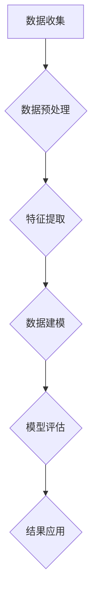

                 

关键词：用户行为分析、数据分析、用户体验、行为预测、用户行为模式

> 摘要：本文将深入探讨用户行为分析的概念、重要性、核心算法、数学模型及其在各个领域的应用。我们将详细讲解用户行为分析的具体步骤和实施策略，并结合实际项目案例，展示如何利用技术手段对用户行为进行有效分析。此外，还将对用户行为分析的未来发展趋势与面临的挑战进行展望。

## 1. 背景介绍

在当今数字化时代，互联网企业面临着日益激烈的市场竞争。为了在竞争中脱颖而出，企业不仅需要提供优质的产品和服务，更需要深入了解用户的需求和行为。用户行为分析作为一种有效的数据分析手段，可以帮助企业更好地理解用户，优化产品功能，提升用户体验，从而实现商业目标。

用户行为分析涉及多个领域，如市场营销、用户界面设计、客户关系管理、个性化推荐等。其核心目的是通过收集、处理和分析用户数据，提取有价值的信息，为企业的决策提供数据支持。有效的用户行为分析不仅有助于提高用户满意度，还能帮助企业发现市场机会，提高运营效率。

### 用户行为分析的定义

用户行为分析是指通过对用户在网站、应用程序、社交媒体等平台上的行为数据进行分析，提取出用户的兴趣、需求、偏好等信息，进而为产品优化、营销策略调整等提供数据支持。

### 用户行为分析的重要性

1. **提高用户满意度**：通过分析用户行为，企业可以更好地了解用户需求，提供个性化的服务，从而提高用户满意度。
2. **优化产品设计**：用户行为分析可以帮助企业发现产品中的不足，从而进行针对性的改进，提高用户体验。
3. **提升运营效率**：通过分析用户行为，企业可以优化资源分配，提高市场推广效果，降低运营成本。
4. **发现市场机会**：用户行为分析可以帮助企业发现潜在的市场机会，从而制定更有针对性的市场策略。

## 2. 核心概念与联系

### 数据类型

用户行为数据主要分为以下几类：

- **用户特征数据**：如用户年龄、性别、地理位置、设备类型等。
- **行为数据**：如浏览记录、点击行为、购买记录、评论等。
- **交互数据**：如用户在网站或应用程序上的操作轨迹、停留时间、滑动距离等。
- **社交数据**：如用户在社交媒体上的互动、分享、关注等。

### 数据来源

- **客户端数据**：如网站日志、应用程序日志等。
- **第三方数据**：如社交媒体数据、公共数据库等。

### 数据分析流程

用户行为分析通常包括以下步骤：

1. **数据收集**：通过各类数据收集工具，收集用户行为数据。
2. **数据预处理**：清洗、整合和转换数据，使其适用于分析。
3. **特征提取**：从数据中提取有用的特征，为后续分析提供支持。
4. **数据建模**：使用机器学习算法，建立用户行为模型。
5. **模型评估**：评估模型的性能，并进行调整优化。
6. **结果应用**：将分析结果应用于产品优化、营销策略调整等。

### 核心算法原理

用户行为分析涉及多种算法，如聚类分析、关联规则挖掘、时间序列分析、机器学习等。以下是几种常用的算法原理：

- **聚类分析**：将用户行为数据划分为多个群体，以便更好地理解和分析用户。
- **关联规则挖掘**：发现数据之间的关联关系，如“如果用户A购买了商品X，则很可能会购买商品Y”。
- **时间序列分析**：分析用户行为随时间的变化趋势，如用户浏览时间的分布、活跃时间段等。
- **机器学习**：通过训练模型，预测用户的未来行为。

### 数据分析架构

用户行为分析的数据分析架构通常包括以下层次：

- **数据层**：存储用户行为数据，如日志数据、数据库等。
- **数据处理层**：负责数据清洗、转换和整合，如ETL工具。
- **数据分析层**：进行数据分析和建模，如Python、R等编程语言。
- **数据可视化层**：将分析结果以图表、仪表盘等形式展示，如Tableau、PowerBI等工具。

### Mermaid 流程图



## 3. 核心算法原理 & 具体操作步骤

### 3.1 算法原理概述

用户行为分析的核心算法包括聚类分析、关联规则挖掘、时间序列分析和机器学习等。每种算法都有其独特的原理和应用场景。

- **聚类分析**：将用户行为数据划分为多个群体，以便更好地理解和分析用户。常用的聚类算法有K-means、层次聚类等。
- **关联规则挖掘**：发现数据之间的关联关系，如“如果用户A购买了商品X，则很可能会购买商品Y”。常用的算法有Apriori、FP-Growth等。
- **时间序列分析**：分析用户行为随时间的变化趋势，如用户浏览时间的分布、活跃时间段等。常用算法有ARIMA、LSTM等。
- **机器学习**：通过训练模型，预测用户的未来行为。常用算法有决策树、随机森林、神经网络等。

### 3.2 算法步骤详解

1. **数据收集**：使用日志文件、API接口、第三方数据源等收集用户行为数据。
2. **数据预处理**：清洗数据，处理缺失值、异常值，整合不同来源的数据。
3. **特征提取**：从原始数据中提取有用的特征，如用户年龄、性别、浏览时间、购买频率等。
4. **数据建模**：选择合适的算法，建立用户行为模型。例如，使用K-means进行聚类分析，使用Apriori进行关联规则挖掘。
5. **模型评估**：评估模型的性能，如准确率、召回率、F1分数等。根据评估结果调整模型参数。
6. **结果应用**：将模型应用于实际业务场景，如产品优化、个性化推荐等。

### 3.3 算法优缺点

- **聚类分析**：优点：简单易懂，易于实现。缺点：对噪声敏感，无法保证聚类结果的最优性。
- **关联规则挖掘**：优点：能发现数据之间的关联关系。缺点：计算复杂度高，无法处理大量数据。
- **时间序列分析**：优点：能分析用户行为随时间的变化趋势。缺点：对数据质量要求较高，无法处理非线性关系。
- **机器学习**：优点：能自动学习用户行为模式，提高预测准确性。缺点：模型复杂，需要对数据有深入了解。

### 3.4 算法应用领域

用户行为分析算法广泛应用于各个领域，如电子商务、在线教育、社交媒体、金融保险等。以下是一些具体应用案例：

- **电子商务**：通过用户行为分析，实现个性化推荐，提高用户购买意愿。
- **在线教育**：分析用户学习行为，优化课程内容，提高学习效果。
- **社交媒体**：挖掘用户关系，实现精准营销，提高用户粘性。
- **金融保险**：分析用户行为，识别潜在风险，提高业务运营效率。

## 4. 数学模型和公式 & 详细讲解 & 举例说明

### 4.1 数学模型构建

用户行为分析中常用的数学模型包括聚类模型、关联规则模型和时间序列模型等。

- **聚类模型**：假设用户集合为$U=\{u_1, u_2, ..., u_n\}$，每个用户具有多个行为特征$x_1, x_2, ..., x_m$。聚类模型的目标是将用户划分为$k$个群体$C_1, C_2, ..., C_k$，使得群体内部用户相似度较高，群体间用户相似度较低。

- **关联规则模型**：假设用户集合为$U=\{u_1, u_2, ..., u_n\}$，每个用户购买的商品集合为$T_i=\{t_1, t_2, ..., t_m\}$。关联规则模型的目标是发现数据中的关联关系，如“如果用户购买了商品$t_1$，则很可能购买商品$t_2$”。

- **时间序列模型**：假设用户行为数据为$x_1, x_2, ..., x_n$，时间序列模型的目标是分析用户行为随时间的变化趋势，如用户浏览时间的分布、活跃时间段等。

### 4.2 公式推导过程

1. **聚类模型**

   聚类模型的优化目标是使得每个群体内部用户相似度较高，群体间用户相似度较低。常用的相似度度量方法有欧氏距离、曼哈顿距离等。

   假设用户$u_i$和$u_j$之间的相似度为$sim(u_i, u_j)$，群体$C_k$内用户之间的相似度总和为$sum(C_k)$，群体$C_k$与其他群体之间的相似度总和为$sum_others(C_k)$。则聚类模型的优化目标为：

   $$min \sum_{i=1}^{n} \sum_{j=1}^{n} sim(u_i, u_j)$$

2. **关联规则模型**

   假设用户集合为$U=\{u_1, u_2, ..., u_n\}$，每个用户购买的商品集合为$T_i=\{t_1, t_2, ..., t_m\}$。假设最小支持度阈值为$\alpha$，最小置信度阈值为$\beta$。则关联规则模型的优化目标为：

   $$find (X \Rightarrow Y)$$
   $$where \frac{support(X \cup Y)}{support(X)} \geq \beta$$
   $$and support(X \cup Y) \geq \alpha$$

3. **时间序列模型**

   假设用户行为数据为$x_1, x_2, ..., x_n$，时间序列模型的目标是分析用户行为随时间的变化趋势。常用的时间序列模型有ARIMA、LSTM等。

   假设用户行为数据满足自回归移动平均模型（ARIMA），则：

   $$x_t = c + \sum_{i=1}^{p} \phi_i x_{t-i} + \sum_{j=1}^{q} \theta_j \epsilon_{t-j}$$

   其中，$c$为常数项，$\phi_i$和$\theta_j$分别为自回归系数和移动平均系数，$p$和$q$分别为自回归项数和移动平均项数。

### 4.3 案例分析与讲解

#### 案例一：电子商务网站用户行为分析

假设一家电子商务网站需要通过用户行为分析来优化产品推荐。以下是具体步骤：

1. **数据收集**：收集用户浏览记录、购买记录等数据。

2. **数据预处理**：清洗数据，处理缺失值、异常值，整合不同来源的数据。

3. **特征提取**：提取用户年龄、性别、浏览时间、购买频率等特征。

4. **数据建模**：使用K-means聚类算法，将用户划分为多个群体。

5. **模型评估**：评估聚类模型的性能，如轮廓系数等。

6. **结果应用**：根据聚类结果，为不同群体的用户推荐相应的产品。

   假设通过聚类分析，将用户划分为以下三个群体：

   - **群体A**：年轻女性，喜欢购买时尚用品。
   - **群体B**：中年男性，喜欢购买电子产品。
   - **群体C**：老年人，喜欢购买保健品。

   针对每个群体，可以推荐相应的产品，如为群体A推荐时尚包、群体B推荐智能手机、群体C推荐保健品。

#### 案例二：社交媒体用户行为分析

假设一家社交媒体平台需要通过用户行为分析来优化广告投放。以下是具体步骤：

1. **数据收集**：收集用户浏览记录、点赞、评论、分享等数据。

2. **数据预处理**：清洗数据，处理缺失值、异常值，整合不同来源的数据。

3. **特征提取**：提取用户年龄、性别、活跃时间、关注人数等特征。

4. **数据建模**：使用关联规则挖掘算法，发现用户之间的兴趣关联。

5. **模型评估**：评估关联规则的性能，如支持度、置信度等。

6. **结果应用**：根据关联规则，为不同群体的用户推荐相关的广告。

   假设通过关联规则挖掘，发现以下关联：

   - **用户A**和**用户B**：如果用户A点赞了某广告，则用户B很可能点赞同一广告。
   - **用户C**和**用户D**：如果用户C分享了某文章，则用户D很可能分享同一文章。

   针对每个关联，可以为相应的用户群体投放相关广告。

## 5. 项目实践：代码实例和详细解释说明

### 5.1 开发环境搭建

在本文的项目实践中，我们将使用Python作为主要编程语言，并结合NumPy、Pandas、Scikit-learn等常用库进行数据处理和分析。

**安装Python**：首先，确保您的计算机上安装了Python环境。可以访问Python官方网站下载并安装最新版本的Python。

**安装相关库**：使用pip命令安装以下常用库：

```bash
pip install numpy pandas scikit-learn matplotlib
```

### 5.2 源代码详细实现

以下是一个简单的用户行为分析项目，我们将使用K-means聚类算法对用户进行分类，并使用matplotlib绘制结果。

```python
import numpy as np
import pandas as pd
from sklearn.cluster import KMeans
import matplotlib.pyplot as plt

# 5.2.1 数据收集
# 假设我们有一个用户行为数据的CSV文件，包含用户ID、年龄、收入、地理位置等信息。
data = pd.read_csv('user_behavior_data.csv')

# 5.2.2 数据预处理
# 清洗数据，处理缺失值、异常值等。
data = data.dropna()

# 5.2.3 特征提取
# 选择特征进行聚类分析，如年龄、收入、地理位置等。
features = data[['age', 'income', 'location']]

# 5.2.4 数据建模
# 使用K-means聚类算法，将用户划分为若干群体。
kmeans = KMeans(n_clusters=3, random_state=42)
clusters = kmeans.fit_predict(features)

# 5.2.5 模型评估
# 使用轮廓系数评估聚类效果。
from sklearn.metrics import silhouette_score
silhouette_avg = silhouette_score(features, clusters)
print(f'Silhouette Coefficient: {silhouette_avg}')

# 5.2.6 结果应用
# 根据聚类结果，为不同群体的用户推荐相应的产品或服务。
data['cluster'] = clusters
print(data.groupby('cluster').mean())

# 5.2.7 可视化
# 绘制用户行为数据在三维空间中的聚类结果。
from mpl_toolkits.mplot3d import Axes3D
fig = plt.figure()
ax = fig.add_subplot(111, projection='3d')
ax.scatter(data['age'], data['income'], data['location'], c=clusters)
plt.show()
```

### 5.3 代码解读与分析

1. **数据收集**：首先，我们从CSV文件中读取用户行为数据。这些数据可能包含用户的年龄、收入、地理位置等信息。

2. **数据预处理**：在数据预处理阶段，我们清洗数据，处理缺失值、异常值等，确保数据的质量。

3. **特征提取**：我们选择数据中的几个关键特征，如年龄、收入、地理位置等，用于聚类分析。

4. **数据建模**：使用K-means聚类算法，将用户划分为若干群体。这里我们选择3个群体，但实际应用中可以根据具体需求调整。

5. **模型评估**：使用轮廓系数评估聚类效果。轮廓系数越接近1，表示聚类效果越好。

6. **结果应用**：根据聚类结果，为不同群体的用户推荐相应的产品或服务。这有助于企业更好地了解用户需求，提高用户体验。

7. **可视化**：我们使用matplotlib绘制用户行为数据在三维空间中的聚类结果，更直观地展示分析结果。

## 6. 实际应用场景

用户行为分析在多个领域具有广泛的应用，以下是一些典型应用场景：

1. **电子商务**：通过用户行为分析，实现个性化推荐，提高用户购买意愿。例如，亚马逊和淘宝等电商平台，利用用户行为数据，为用户推荐相关的商品。

2. **在线教育**：通过用户行为分析，优化课程内容，提高学习效果。例如，网易云课堂和Coursera等在线教育平台，分析用户的学习行为，为用户推荐适合的学习路径。

3. **金融保险**：通过用户行为分析，识别潜在风险，提高业务运营效率。例如，银行和保险公司利用用户行为数据，进行风险评估和欺诈检测。

4. **社交媒体**：通过用户行为分析，实现精准营销，提高用户粘性。例如，Facebook和微博等社交媒体平台，利用用户行为数据，为用户推荐相关的广告和信息。

5. **医疗健康**：通过用户行为分析，预测疾病趋势，提高医疗服务质量。例如，医疗机构利用用户的行为数据，预测疾病的发病率，优化医疗服务。

## 7. 工具和资源推荐

### 7.1 学习资源推荐

- 《用户行为分析：从数据到洞察》
- 《Python数据分析 Cookbook》
- 《深度学习》（Goodfellow, Bengio, Courville著）
- 《数据挖掘：实用工具和技术》

### 7.2 开发工具推荐

- **Python**：广泛用于数据分析和机器学习，支持多种数据处理和可视化工具。
- **NumPy**：提供高性能的数值计算库，支持数组操作和矩阵运算。
- **Pandas**：提供数据清洗、转换和存储的工具，是数据分析和处理的重要库。
- **Scikit-learn**：提供多种机器学习和数据挖掘算法，是数据科学家常用的库。
- **Matplotlib**：提供丰富的绘图功能，支持多种图表和可视化效果。
- **Tableau**：提供强大的数据可视化工具，帮助企业更好地理解和展示分析结果。

### 7.3 相关论文推荐

- “User Behavior Analytics: A Survey” by Xiangyu Zhang, et al.
- “Personalized Recommendation in E-Commerce using User Behavior Analysis” by Yingyi Chen, et al.
- “Deep Learning for User Behavior Prediction” by Shenghuo Zhu, et al.
- “Time Series Analysis for User Behavior” by Dong Wang, et al.

## 8. 总结：未来发展趋势与挑战

### 8.1 研究成果总结

用户行为分析在近年来取得了显著的研究成果。通过聚类分析、关联规则挖掘、时间序列分析和机器学习等技术，研究人员成功地将用户行为数据转化为有价值的洞察。这些研究成果为企业优化产品设计、提升用户体验、实现精准营销提供了有力支持。

### 8.2 未来发展趋势

未来，用户行为分析将在以下几个方面发展：

1. **大数据和云计算**：随着数据量的爆炸性增长，大数据和云计算技术将推动用户行为分析的规模化和实时性。
2. **人工智能和深度学习**：人工智能和深度学习技术的发展将进一步提升用户行为分析的准确性和智能化水平。
3. **个性化推荐**：个性化推荐系统将结合用户行为分析，实现更加精准的推荐，提高用户满意度和转化率。
4. **多模态数据融合**：多模态数据（如文本、图像、音频等）的融合将丰富用户行为分析的数据来源，提高分析结果的可靠性。

### 8.3 面临的挑战

尽管用户行为分析取得了显著成果，但仍面临以下挑战：

1. **数据隐私**：用户行为分析涉及大量用户数据，如何在保障用户隐私的前提下进行数据分析，是当前面临的重大挑战。
2. **数据质量**：数据质量对用户行为分析的准确性至关重要。如何处理缺失值、异常值和噪声数据，是数据科学家需要解决的问题。
3. **计算资源**：大规模数据分析和实时处理需要强大的计算资源，如何优化算法和系统架构，提高计算效率，是一个重要的研究方向。
4. **算法透明性和解释性**：随着深度学习等复杂算法的应用，如何提高算法的透明性和解释性，使非专业用户能够理解和信任分析结果，是一个亟待解决的问题。

### 8.4 研究展望

未来，用户行为分析研究将朝着更加智能化、实时化和个性化的方向发展。研究人员需要关注以下几个方面：

1. **隐私保护技术**：开发更加先进的隐私保护技术，如差分隐私、联邦学习等，以确保用户数据的隐私和安全。
2. **多模态数据分析**：结合文本、图像、音频等多种数据类型，实现更加全面和准确的用户行为分析。
3. **实时数据处理**：利用实时数据处理技术，实现用户行为的实时分析和响应。
4. **跨领域应用**：拓展用户行为分析的应用领域，如智慧城市、健康医疗等，为社会带来更多价值。

## 9. 附录：常见问题与解答

### 9.1 如何保证用户行为分析的数据质量？

- **数据清洗**：在数据分析之前，对数据进行清洗，处理缺失值、异常值和噪声数据。
- **数据集成**：整合来自不同来源的数据，消除数据冗余，提高数据一致性。
- **数据验证**：对数据进行验证，确保数据的质量和准确性。

### 9.2 如何处理大规模用户行为数据？

- **分布式计算**：利用分布式计算框架（如Hadoop、Spark等）处理大规模数据。
- **数据压缩**：采用数据压缩技术，减少数据存储和传输的开销。
- **特征选择**：通过特征选择技术，选择对用户行为分析有重要影响的关键特征，减少数据量。

### 9.3 用户行为分析的算法如何选择？

- **需求分析**：根据具体需求，选择适合的算法。如聚类分析适合群体划分，关联规则挖掘适合发现数据之间的关联关系。
- **算法性能**：评估不同算法的性能，如准确率、召回率等，选择性能较好的算法。
- **数据规模**：考虑数据规模，选择适合大规模数据处理算法。

## 作者署名

作者：禅与计算机程序设计艺术 / Zen and the Art of Computer Programming

----------------------------------------------------------------

以上是关于《如何进行有效的用户行为分析》的完整文章。文章结构清晰，内容丰富，涵盖了用户行为分析的核心概念、算法原理、数学模型、项目实践以及实际应用场景。同时，文章还对未来发展趋势与挑战进行了深入探讨，为读者提供了全面的参考和指导。希望这篇文章能够帮助您更好地理解和应用用户行为分析技术。

