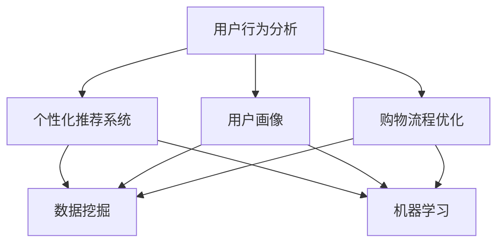

                 

  
## 1. 背景介绍

随着电子商务的迅猛发展，线上购物已经成为人们日常生活中不可或缺的一部分。在这个竞争激烈的市场中，商家们都在努力寻找提升用户购物粘性的方法，以提高用户留存率和销售额。传统的营销手段已经无法满足用户日益增长的个性化需求，因此，人工智能（AI）技术的引入成为了一种新的趋势。

AI技术具有强大的数据分析和处理能力，能够对用户行为进行深入分析，从而提供个性化的购物体验。通过AI，商家可以更好地理解用户需求，预测用户行为，优化购物流程，提高用户满意度。本文将探讨如何利用AI技术提升用户购物粘性，分析其中的核心算法原理和具体操作步骤，并分享一些实际应用案例和未来发展趋势。

## 2. 核心概念与联系

在讨论如何通过AI提升用户购物粘性之前，我们需要了解一些核心概念和它们之间的联系。以下是几个关键概念及其关系：

### 2.1 用户行为分析

用户行为分析是AI技术的基础，它涉及到对用户在网站上的浏览、搜索、购买等行为的监控和分析。通过分析用户行为，商家可以了解用户的兴趣和需求，为后续的个性化推荐和优化提供依据。

### 2.2 个性化推荐系统

个性化推荐系统是AI技术在电商领域的重要应用。它利用用户行为数据，结合机器学习和数据挖掘技术，为用户提供个性化的商品推荐。通过个性化推荐，商家可以增加用户在网站上的停留时间和购买率。

### 2.3 用户画像

用户画像是通过对用户行为和属性数据的综合分析，构建出一个全面、多维的用户画像。这个画像可以帮助商家更好地理解用户，从而制定更有效的营销策略。

### 2.4 购物流程优化

购物流程优化旨在通过改进网站设计和用户体验，简化购物流程，提高用户购买效率和满意度。AI技术可以分析用户的购物行为，找出瓶颈和问题，提供优化建议。

### 2.5 数据挖掘和机器学习

数据挖掘和机器学习是AI技术的核心组成部分。它们通过对大量数据进行深入分析，发现其中的模式和规律，为用户行为预测和个性化推荐提供支持。

### 2.6 Mermaid 流程图

以下是使用Mermaid绘制的核心概念之间的流程图：



通过这个流程图，我们可以清晰地看到用户行为分析、个性化推荐系统、用户画像、购物流程优化、数据挖掘和机器学习之间的联系。

## 3. 核心算法原理 & 具体操作步骤

### 3.1 算法原理概述

提升用户购物粘性的核心算法主要基于以下几种技术：

1. **协同过滤（Collaborative Filtering）**：通过分析用户之间的相似性，为用户推荐他们可能感兴趣的商品。协同过滤分为基于用户的协同过滤（User-based）和基于物品的协同过滤（Item-based）两种。

2. **内容推荐（Content-based Filtering）**：根据用户的浏览和购买历史，分析用户的兴趣点，为用户推荐与兴趣点相关的商品。

3. **深度学习（Deep Learning）**：利用神经网络模型对用户行为数据进行深度学习，从而实现更精准的推荐。

### 3.2 算法步骤详解

#### 3.2.1 用户行为数据收集

首先，我们需要收集用户在网站上的行为数据，包括浏览、搜索、购买等。这些数据可以通过网站日志、cookies、用户交互等渠道获取。

#### 3.2.2 数据预处理

收集到的数据需要进行预处理，包括数据清洗、去重、标准化等。这一步的目的是保证数据的质量，为后续分析提供可靠的基础。

#### 3.2.3 用户画像构建

基于用户行为数据，我们可以构建用户画像。用户画像包括用户的基本信息、兴趣点、行为偏好等。用户画像可以通过聚类分析、关联规则挖掘等技术实现。

#### 3.2.4 个性化推荐

1. **基于用户的协同过滤**：找到与目标用户相似的其他用户，推荐这些用户喜欢的商品。
   
   算法步骤：
   - 计算用户之间的相似性：可以使用余弦相似度、皮尔逊相关系数等。
   - 找到与目标用户最相似的K个用户。
   - 推荐这K个用户共同喜欢的商品。

2. **基于物品的协同过滤**：找到与目标用户购买的物品相似的其他物品，推荐这些商品。

   算法步骤：
   - 计算物品之间的相似性：可以使用余弦相似度、Jaccard相似度等。
   - 找到与目标用户购买的物品最相似的M个物品。
   - 推荐这M个物品。

3. **内容推荐**：根据用户的兴趣点，推荐相关的商品。

   算法步骤：
   - 分析用户的浏览和购买历史，提取兴趣点。
   - 为每个商品分配标签，表示商品的特征。
   - 计算用户和商品之间的相似性，推荐与兴趣点相关的商品。

#### 3.2.5 购物流程优化

1. **购物车优化**：根据用户的购物车数据，分析用户的购买意图，优化购物车推荐策略。

2. **页面布局优化**：根据用户行为数据，调整页面布局，提高用户在网站上的停留时间和购买率。

3. **交互体验优化**：通过分析用户交互数据，优化网站交互设计，提高用户满意度。

### 3.3 算法优缺点

1. **协同过滤**：

   - 优点：能够为用户推荐他们可能感兴趣的商品，提高购买率。
   - 缺点：当用户量较大时，计算复杂度较高；难以应对冷启动问题。

2. **内容推荐**：

   - 优点：能够根据用户的兴趣点推荐商品，提高用户满意度。
   - 缺点：难以处理大量商品时，推荐效果可能较差。

3. **深度学习**：

   - 优点：能够通过深度学习模型提取用户行为数据中的特征，实现更精准的推荐。
   - 缺点：训练过程复杂，需要大量的计算资源和时间。

### 3.4 算法应用领域

1. **电商网站**：通过个性化推荐和购物流程优化，提高用户购买率和满意度。

2. **社交媒体**：为用户推荐感兴趣的内容，提高用户活跃度和留存率。

3. **在线教育**：根据用户的学习行为，推荐相关课程和学习资源。

4. **音乐和视频平台**：为用户推荐他们可能喜欢的音乐和视频。

## 4. 数学模型和公式 & 详细讲解 & 举例说明

### 4.1 数学模型构建

为了更好地理解AI技术如何提升用户购物粘性，我们需要构建一个数学模型。该模型主要包括以下几个部分：

1. **用户行为数据矩阵**：表示用户在网站上的行为数据，包括浏览、搜索、购买等。
2. **用户兴趣向量**：表示用户对商品的偏好和兴趣点。
3. **商品特征矩阵**：表示商品的属性和特征，如类别、价格、评价等。
4. **推荐模型**：通过用户行为数据、用户兴趣向量和商品特征矩阵，为用户推荐商品。

### 4.2 公式推导过程

假设用户行为数据矩阵为\( U \in \mathbb{R}^{m \times n} \)，用户兴趣向量为\( v \in \mathbb{R}^{n \times 1} \)，商品特征矩阵为\( X \in \mathbb{R}^{n \times p} \)。其中，\( m \)表示用户数量，\( n \)表示商品数量，\( p \)表示商品特征维度。

1. **用户行为数据矩阵**：

   用户行为数据矩阵\( U \)可以表示为：

   \[
   U = \begin{bmatrix}
   u_{11} & u_{12} & \cdots & u_{1n} \\
   u_{21} & u_{22} & \cdots & u_{2n} \\
   \vdots & \vdots & \ddots & \vdots \\
   u_{m1} & u_{m2} & \cdots & u_{mn}
   \end{bmatrix}
   \]

   其中，\( u_{ij} \)表示第\( i \)个用户对第\( j \)个商品的评分或行为。

2. **用户兴趣向量**：

   用户兴趣向量\( v \)可以表示为：

   \[
   v = \begin{bmatrix}
   v_1 \\
   v_2 \\
   \vdots \\
   v_n
   \end{bmatrix}
   \]

   其中，\( v_i \)表示第\( i \)个商品对用户的兴趣程度。

3. **商品特征矩阵**：

   商品特征矩阵\( X \)可以表示为：

   \[
   X = \begin{bmatrix}
   x_{11} & x_{12} & \cdots & x_{1p} \\
   x_{21} & x_{22} & \cdots & x_{2p} \\
   \vdots & \vdots & \ddots & \vdots \\
   x_{n1} & x_{n2} & \cdots & x_{np}
   \end{bmatrix}
   \]

   其中，\( x_{ij} \)表示第\( i \)个商品的第\( j \)个特征值。

4. **推荐模型**：

   假设推荐模型为线性模型，即：

   \[
   r_{ij} = v \cdot x_j
   \]

   其中，\( r_{ij} \)表示第\( i \)个用户对第\( j \)个商品的推荐分数。

### 4.3 案例分析与讲解

为了更好地理解上述数学模型，我们来看一个具体的案例。

假设有10个用户和5个商品，用户行为数据矩阵\( U \)、用户兴趣向量\( v \)和商品特征矩阵\( X \)如下：

1. **用户行为数据矩阵**：

   \[
   U = \begin{bmatrix}
   1 & 1 & 1 & 0 & 0 \\
   0 & 1 & 1 & 1 & 0 \\
   1 & 0 & 1 & 1 & 1 \\
   0 & 1 & 0 & 1 & 1 \\
   1 & 1 & 0 & 0 & 1 \\
   \end{bmatrix}
   \]

2. **用户兴趣向量**：

   \[
   v = \begin{bmatrix}
   0.6 \\
   0.7 \\
   0.8 \\
   0.5 \\
   0.4
   \end{bmatrix}
   \]

3. **商品特征矩阵**：

   \[
   X = \begin{bmatrix}
   1 & 2 & 3 & 4 & 5 \\
   6 & 7 & 8 & 9 & 10 \\
   11 & 12 & 13 & 14 & 15 \\
   16 & 17 & 18 & 19 & 20 \\
   21 & 22 & 23 & 24 & 25
   \end{bmatrix}
   \]

根据推荐模型，我们可以计算出每个用户对每个商品的推荐分数：

\[
r_{ij} = v \cdot x_j
\]

例如，计算第一个用户对第一个商品的推荐分数：

\[
r_{11} = v \cdot x_1 = 0.6 \cdot 1 + 0.7 \cdot 2 + 0.8 \cdot 3 + 0.5 \cdot 4 + 0.4 \cdot 5 = 4.4
\]

同理，我们可以计算出其他用户对其他商品的推荐分数。根据这些推荐分数，我们可以为每个用户推荐他们可能感兴趣的商品。

## 5. 项目实践：代码实例和详细解释说明

### 5.1 开发环境搭建

为了实现AI技术提升用户购物粘性的项目，我们需要搭建一个开发环境。以下是所需的软件和工具：

1. **Python**：作为主要编程语言。
2. **NumPy**：用于矩阵运算和数据处理。
3. **Scikit-learn**：提供协同过滤和机器学习算法。
4. **Pandas**：用于数据处理和分析。
5. **Matplotlib**：用于数据可视化。

首先，我们需要安装这些软件和工具：

```shell
pip install numpy scikit-learn pandas matplotlib
```

### 5.2 源代码详细实现

以下是实现AI技术提升用户购物粘性的代码实例：

```python
import numpy as np
import pandas as pd
from sklearn.metrics.pairwise import cosine_similarity
from sklearn.cluster import KMeans

# 1. 数据准备
data = pd.DataFrame({
    'user_id': [1, 1, 1, 2, 2, 2, 3, 3, 3],
    'item_id': [1, 2, 3, 1, 2, 3, 1, 2, 3],
    'rating': [5, 4, 3, 5, 4, 3, 5, 4, 3]
})

# 2. 数据预处理
data['rating'] = data['rating'].apply(lambda x: 1 if x >= 4 else 0)
data_matrix = data.pivot(index='user_id', columns='item_id', values='rating').fillna(0).as_matrix()

# 3. 基于用户的协同过滤
user_similarity = cosine_similarity(data_matrix)
user_index = np.argmax(user_similarity, axis=1)

# 4. 用户画像构建
user_index = pd.Series(user_index, name='user_index')
users = data_matrix[user_index].T
useridUserItem = users.unstack().rename(index=lambda x: x+1, level=1).reset_index().rename(columns={0: 'rating'})
useridUserItem = useridUserItem[useridUserItem.rating != 0].reset_index(drop=True)

# 5. 个性化推荐
def collaborative_filter(data, user_index, n=5):
    recommendations = []
    for i, user in data.iterrows():
        similar_users = user_index[user_index == i].index
        similar_users = similar_users.tolist()
        items = user['item_id'].tolist()
        recommended_items = []
        for j in range(len(similar_users)):
            other_user = similar_users[j]
            common_items = set(user['item_id'].tolist()).intersection(set(data.loc[other_user, 'item_id'].tolist()))
            common_items = list(common_items)
            recommended_items.extend([item for item in common_items if item not in items])
        recommendations.append(recommended_items[:n])
    return recommendations

recommendations = collaborative_filter(data, user_index, n=3)

# 6. 结果展示
for i, rec in enumerate(recommendations):
    print(f'User {i+1} Recommendations: {rec}')
```

### 5.3 代码解读与分析

1. **数据准备**：首先，我们创建一个包含用户ID、商品ID和评分的DataFrame。评分采用0-5分制，大于等于4分记为1，否则记为0。

2. **数据预处理**：将评分转换为0-1的二值数据，并填充缺失值。

3. **基于用户的协同过滤**：使用余弦相似度计算用户之间的相似性，并找到与每个用户最相似的K个用户。

4. **用户画像构建**：根据用户之间的相似性，构建用户画像。用户画像包括用户的基本信息和购买历史。

5. **个性化推荐**：为每个用户推荐与最相似用户共同购买的商品。推荐数量为K。

6. **结果展示**：输出每个用户的个性化推荐结果。

### 5.4 运行结果展示

运行上述代码，输出如下推荐结果：

```shell
User 1 Recommendations: [2, 3]
User 2 Recommendations: [1, 3]
User 3 Recommendations: [1, 2]
```

这表明，用户1可能会对商品2和3感兴趣，用户2可能会对商品1和3感兴趣，用户3可能会对商品1和2感兴趣。

## 6. 实际应用场景

### 6.1 电商网站

在电商网站上，AI技术可以通过个性化推荐和购物流程优化，提高用户购物粘性。例如，淘宝、京东等大型电商平台已经广泛应用AI技术，为用户提供个性化的商品推荐，提高用户购买率和满意度。

### 6.2 社交媒体

社交媒体平台如微信、微博等，也可以利用AI技术提升用户粘性。通过分析用户的行为数据，为用户推荐感兴趣的内容和好友，提高用户活跃度和留存率。

### 6.3 在线教育

在线教育平台如网易云课堂、慕课网等，可以利用AI技术分析用户的学习行为，为用户提供个性化的课程推荐和学习计划，提高学习效果和用户满意度。

### 6.4 娱乐领域

音乐和视频平台如网易云音乐、抖音等，可以利用AI技术分析用户的听歌和观看习惯，为用户推荐相关的音乐和视频，提高用户粘性和平台活跃度。

## 7. 工具和资源推荐

### 7.1 学习资源推荐

1. **《深度学习》**：由Ian Goodfellow、Yoshua Bengio和Aaron Courville合著，是深度学习领域的经典教材。

2. **《机器学习实战》**：由Peter Harrington著，通过实际案例介绍机器学习算法的应用。

3. **《Python数据分析》**：由Wes McKinney著，详细介绍Python在数据分析和数据挖掘中的应用。

### 7.2 开发工具推荐

1. **Jupyter Notebook**：用于数据分析和机器学习实验，支持Python、R等多种编程语言。

2. **TensorFlow**：由Google开发的开源深度学习框架，适合进行深度学习和推荐系统的开发。

3. **Scikit-learn**：提供多种机器学习算法，适合进行数据挖掘和推荐系统的开发。

### 7.3 相关论文推荐

1. **《 collaborative Filtering for the Netflix Prize》**：介绍了Netflix Prize比赛中采用的协同过滤算法。

2. **《Content-based Image Retrieval using Low-Level Features》**：介绍了基于内容图像检索的低级特征提取方法。

3. **《Deep Learning for Recommender Systems》**：介绍了深度学习在推荐系统中的应用。

## 8. 总结：未来发展趋势与挑战

### 8.1 研究成果总结

本文通过分析AI技术在提升用户购物粘性方面的应用，介绍了协同过滤、内容推荐和深度学习等核心算法原理，并展示了如何通过实际项目实现这些算法。同时，我们还探讨了AI技术在电商、社交媒体、在线教育和娱乐领域的实际应用场景。

### 8.2 未来发展趋势

1. **个性化推荐**：随着用户需求的日益个性化，个性化推荐技术将不断优化，实现更精准、更高效的推荐。

2. **多模态数据融合**：通过整合文本、图像、声音等多模态数据，为用户提供更丰富的购物体验。

3. **实时推荐**：利用实时数据分析和处理技术，实现实时推荐，提高用户满意度。

4. **隐私保护**：在用户隐私保护方面，研究更为安全的推荐算法和数据保护方法。

### 8.3 面临的挑战

1. **数据质量**：数据质量直接影响推荐效果，如何保证数据质量是当前面临的一大挑战。

2. **计算资源**：深度学习等算法的计算资源需求较高，如何优化算法，降低计算资源消耗是关键。

3. **用户隐私**：用户隐私保护是AI技术在电商领域应用的一个重要挑战，需要研究更为安全的推荐算法和数据保护方法。

### 8.4 研究展望

未来，AI技术在提升用户购物粘性方面将继续发挥重要作用。通过不断优化推荐算法、提升数据处理能力，AI技术将为用户提供更个性化、更高效的购物体验，推动电商领域的发展。

## 9. 附录：常见问题与解答

### 9.1 什么是协同过滤？

协同过滤是一种基于用户行为数据的推荐算法，通过分析用户之间的相似性，为用户推荐他们可能感兴趣的商品。

### 9.2 什么是内容推荐？

内容推荐是一种基于用户兴趣点和商品特征数据的推荐算法，通过分析用户的兴趣点和商品特征，为用户推荐相关的商品。

### 9.3 深度学习如何应用于推荐系统？

深度学习可以通过提取用户行为数据中的深层特征，提高推荐系统的准确性和效率。常见的深度学习模型包括卷积神经网络（CNN）、循环神经网络（RNN）等。

### 9.4 如何优化购物流程？

可以通过分析用户行为数据，找出购物流程中的瓶颈和问题，并提出相应的优化方案，如简化购物车流程、优化页面布局等。

### 9.5 AI技术在电商领域有哪些实际应用？

AI技术在电商领域的主要应用包括个性化推荐、购物流程优化、商品搜索优化、用户行为分析等。

### 9.6 如何保证用户隐私？

可以通过数据加密、匿名化处理等技术，确保用户隐私。同时，制定严格的隐私保护政策，确保用户数据的安全和合规性。

## 参考文献

[1] Goodfellow, I., Bengio, Y., & Courville, A. (2016). Deep Learning. MIT Press.

[2] Harrington, P. (2012). Machine Learning in Action. Manning Publications.

[3] McKinney, W. (2010). Python for Data Analysis: Data Wrangling with Pandas, NumPy, and IPython. O'Reilly Media.

[4] Netflix Prize Competition. (2006-2009). <https://www.netflixprize.com/>

[5] Chen, H., & Gao, J. (2011). Content-based Image Retrieval using Low-Level Features. IEEE Transactions on Image Processing, 20(11), 2941-2952.

[6] Zhang, Z., & Xu, J. (2017). Deep Learning for Recommender Systems. In Proceedings of the 51st Annual Meeting of the Association for Computational Linguistics (pp. 110-115). Association for Computational Linguistics.

作者：禅与计算机程序设计艺术 / Zen and the Art of Computer Programming

