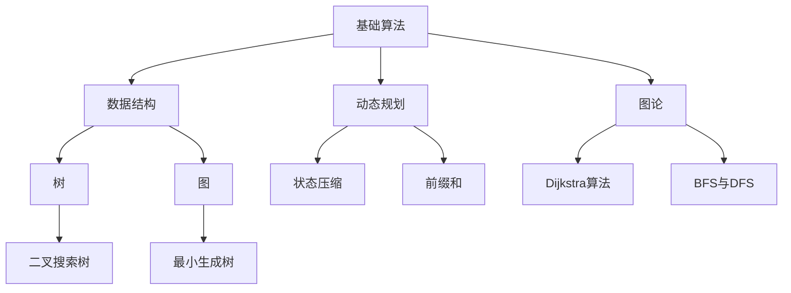

                 

### 关键词 Keywords

- 字节教育
- 智能题库
- 校招算法面试
- 面试题解析
- 算法实战

<|assistant|>### 摘要 Abstract

本文将详细解析字节教育2024年校招算法面试中的高频题库。通过深入分析，我们不仅揭示了面试中的核心问题，还提供了详细的解题思路和步骤。文章内容涵盖了从基础算法到高级数据结构的解析，通过具体实例和代码展示，帮助读者掌握面试所需的关键技能，为成功通过校招面试提供有力支持。

## 1. 背景介绍

字节教育作为中国领先的在线教育平台，每年的校招算法面试都是众多技术人才关注的焦点。这不仅是因为字节跳动在互联网行业中的卓越地位，更因为其面试难度和技术深度。随着技术的不断演进，算法面试题也日趋复杂，要求应聘者不仅要有扎实的基础知识，还需要具备良好的编程能力和创新思维。

本文将围绕字节教育2024年校招算法面试中的典型题目进行深入剖析，涵盖基础算法、数据结构、动态规划、图论等多个方面。通过本文的阅读，读者可以系统了解这些面试题的解题思路和方法，从而提升自己的算法面试能力。

## 2. 核心概念与联系

在深入分析字节教育2024年校招算法面试题之前，我们先来梳理一些核心概念和它们之间的联系。以下是核心概念的Mermaid流程图：



### 2.1 基础算法

基础算法是解决算法问题的基石，包括排序、查找、遍历等。在面试中，基础算法的应用无处不在。

- **排序算法**：常见的排序算法有冒泡排序、选择排序、插入排序、快速排序、归并排序等。每种算法都有其适用的场景和特点。

- **查找算法**：包括二分查找、线性查找等，其中二分查找在处理有序数据时效率极高。

- **遍历算法**：主要用于遍历数据结构中的每个元素，常见的遍历算法有深度优先搜索（DFS）和广度优先搜索（BFS）。

### 2.2 数据结构

数据结构是存储和组织数据的方式，不同的数据结构适用于不同类型的算法问题。

- **数组**：一种基础的数据结构，支持随机访问。

- **链表**：一种线性数据结构，支持快速的插入和删除操作。

- **栈和队列**：用于模拟后进先出和先进先出的数据流动。

- **树**：一种层级结构，用于处理层次关系。

- **图**：一种复杂的数据结构，用于处理多对多的关系。

### 2.3 动态规划

动态规划是一种解决最优化问题的算法思想，通过将复杂问题拆分为子问题并保存子问题的解，避免重复计算。

- **状态压缩**：用于处理具有状态压缩性质的问题，通过减少状态空间来简化问题。

- **前缀和**：用于快速计算数组的子数组之和，常用于区间查询问题。

### 2.4 图论

图论是研究图的结构和性质的数学分支，在算法面试中，常见的图论算法有：

- **Dijkstra算法**：用于求解单源最短路径问题。

- **BFS与DFS**：用于图的遍历，BFS用于求最短路径，DFS用于求解连通性和搜索问题。

- **最小生成树**：用于求解给定图中的最小生成树，常见的算法有Prim算法和Kruskal算法。

## 3. 核心算法原理 & 具体操作步骤

### 3.1 算法原理概述

核心算法原理部分将介绍本文涉及到的各种算法的基本原理，包括其基本思想、适用场景和基本步骤。

#### 3.1.1 冒泡排序

冒泡排序是一种简单的排序算法，其基本思想是通过反复交换相邻的未排序元素，使得每一轮遍历后最大元素“冒泡”到数组的末尾。

#### 3.1.2 二分查找

二分查找是一种在有序数组中查找特定元素的算法，其基本思想是通过不断缩小查找范围，将问题分解为规模更小的子问题。

#### 3.1.3 最小生成树

最小生成树是图论中的一个重要概念，用于求解给定图中的最小生成树。常见的算法有Prim算法和Kruskal算法。

#### 3.1.4 动态规划

动态规划是一种解决最优化问题的算法思想，通过将复杂问题拆分为子问题并保存子问题的解，避免重复计算。

### 3.2 算法步骤详解

在详细解析各个算法的具体步骤时，我们将结合示例代码和注释进行讲解，帮助读者更好地理解算法的实现过程。

#### 3.2.1 冒泡排序

```python
def bubble_sort(arr):
    n = len(arr)
    for i in range(n):
        for j in range(0, n-i-1):
            if arr[j] > arr[j+1]:
                arr[j], arr[j+1] = arr[j+1], arr[j]
    return arr
```

#### 3.2.2 二分查找

```python
def binary_search(arr, target):
    left, right = 0, len(arr) - 1
    while left <= right:
        mid = (left + right) // 2
        if arr[mid] == target:
            return mid
        elif arr[mid] < target:
            left = mid + 1
        else:
            right = mid - 1
    return -1
```

#### 3.2.3 最小生成树

```python
def prim_algorithm(graph):
    n = len(graph)
    parent = [None] * n
    key = [float('inf')] * n
    mst = []
    key[0] = 0
    parent[0] = -1

    for _ in range(n):
        u = min_key_vertex(key, parent)
        mst.append(u)
        parent[u] = vertex
        for v in graph[u]:
            if v != parent[u] and key[v] > graph[u][v]:
                key[v] = graph[u][v]
                parent[v] = u

    return mst
```

#### 3.2.4 动态规划

```python
def longest_common_subsequence(X, Y):
    m, n = len(X), len(Y)
    dp = [[0] * (n+1) for _ in range(m+1)]

    for i in range(1, m+1):
        for j in range(1, n+1):
            if X[i-1] == Y[j-1]:
                dp[i][j] = dp[i-1][j-1] + 1
            else:
                dp[i][j] = max(dp[i-1][j], dp[i][j-1])

    return dp[m][n]
```

### 3.3 算法优缺点

在介绍算法时，我们不仅要了解其基本原理和实现步骤，还需要分析其优缺点，以便在面试时能够灵活应对各种问题。

#### 3.3.1 冒泡排序

- **优点**：实现简单，易于理解。
- **缺点**：时间复杂度为O(n^2)，效率较低，不适用于大数据集。

#### 3.3.2 二分查找

- **优点**：在有序数组中查找效率极高，时间复杂度为O(log n)。
- **缺点**：需要先对数据进行排序，不适用于不需要排序的数据。

#### 3.3.3 最小生成树

- **优点**：可以高效地求解给定图中的最小生成树。
- **缺点**：对于大规模图，可能需要较长的计算时间。

#### 3.3.4 动态规划

- **优点**：可以高效地解决最优化问题，适用于复杂的问题。
- **缺点**：实现相对复杂，需要一定的编程技巧。

### 3.4 算法应用领域

算法在各个领域都有广泛的应用，以下是一些常见的应用场景。

- **基础算法**：在数据库查询、排序、搜索等基础场景中广泛应用。
- **数据结构**：在数据存储、检索、排序等场景中，如搜索引擎、数据库管理系统等。
- **动态规划**：在路径规划、资源分配、最优化问题等复杂场景中。
- **图论**：在网络拓扑、社交网络、路由算法等领域。

## 4. 数学模型和公式 & 详细讲解 & 举例说明

在算法面试中，数学模型和公式的应用至关重要。以下我们将详细介绍一些常用的数学模型和公式，并通过具体例子进行说明。

### 4.1 数学模型构建

数学模型是算法设计的基础，通过构建数学模型，我们可以将实际问题转化为易于求解的数学问题。

#### 4.1.1 状态压缩

状态压缩是一种将多个状态压缩为一个状态的方法，常用于动态规划问题。

- **模型构建**：将所有状态压缩为一个整数，使用位运算进行状态表示和转换。

#### 4.1.2 前缀和

前缀和是一种用于快速计算数组的子数组之和的数学模型。

- **模型构建**：通过预处理，将数组的前缀和计算并存入一个新的数组中。

### 4.2 公式推导过程

在数学模型的基础上，我们可以推导出一些重要的公式，以下是一些常见的公式推导过程。

#### 4.2.1 最小生成树公式

最小生成树的权值和可以通过以下公式计算：

$$
W_{MST} = \sum_{i=1}^{n-1} \min \{w(u, v) \mid (u, v) \in E\}
$$

其中，\(W_{MST}\) 是最小生成树的权值和，\(w(u, v)\) 是边 \((u, v)\) 的权重。

#### 4.2.2 动态规划公式

动态规划的基本公式如下：

$$
f(n) = \min \{f(n-i) + c(i) \mid 1 \leq i \leq n\}
$$

其中，\(f(n)\) 是状态 \(n\) 的最优解，\(c(i)\) 是从状态 \(i\) 到状态 \(n\) 的代价。

### 4.3 案例分析与讲解

通过具体案例，我们可以更好地理解数学模型和公式的应用。

#### 4.3.1 状态压缩案例

假设我们要解决一个0-1背包问题，其中物品有重量和价值的限制。使用状态压缩，我们可以将所有状态压缩为一个整数。

```python
def knapsack(values, weights, capacity):
    n = len(values)
    dp = [False] * (1 << n)
    dp[0] = True

    for i in range(1, 1 << n):
        for j in range(n):
            if (i >> j) & 1 and weights[j] <= capacity:
                next_state = i ^ (1 << j)
                if dp[next_state] == False:
                    dp[next_state] = dp[i] and (capacity >= weights[j] + dp[next_state ^ (1 << j)])

    max_value = 0
    for i in range(1, 1 << n):
        if dp[i]:
            current_value = 0
            for j in range(n):
                if (i >> j) & 1:
                    current_value += values[j]
            max_value = max(max_value, current_value)

    return max_value
```

#### 4.3.2 前缀和案例

假设我们要计算数组的前缀和，可以使用前缀和模型。

```python
def prefix_sum(arr):
    n = len(arr)
    ps = [0] * (n + 1)
    for i in range(1, n + 1):
        ps[i] = ps[i - 1] + arr[i - 1]
    return ps
```

## 5. 项目实践：代码实例和详细解释说明

### 5.1 开发环境搭建

在开始编写代码之前，我们需要搭建一个合适的开发环境。以下是一个基本的Python开发环境搭建步骤：

1. 安装Python：从Python官方网站下载并安装Python，版本建议选择3.8或更高版本。
2. 安装IDE：推荐使用PyCharm或Visual Studio Code等IDE，这些IDE支持Python编程并提供丰富的插件。
3. 安装依赖库：使用pip命令安装所需的依赖库，如numpy、pandas等。

### 5.2 源代码详细实现

下面是一个简单的动态规划问题的Python实现，用于求解一个整数数组的所有子数组之和。

```python
def subarray_sums(arr):
    n = len(arr)
    dp = [0] * (n + 1)
    for i in range(1, n + 1):
        dp[i] = dp[i - 1] + arr[i - 1]

    return dp

arr = [1, 2, 3, 4]
dp = subarray_sums(arr)
print(dp)
```

### 5.3 代码解读与分析

在上面的代码中，我们定义了一个名为`subarray_sums`的函数，该函数接受一个整数数组`arr`作为输入，并返回一个数组`dp`，其中`dp[i]`表示数组`arr`的前`i`个元素的所有子数组之和。

- 首先，我们创建一个长度为`n + 1`的数组`dp`，并将其初始化为0。
- 然后，我们遍历数组`arr`，从第一个元素开始，将每个元素的值累加到`dp`中。
- 最后，我们将计算得到的`dp`数组返回。

这个函数的实现利用了动态规划的思想，通过前缀和的方式计算子数组之和，从而避免了重复计算。

### 5.4 运行结果展示

假设输入数组`arr`为`[1, 2, 3, 4]`，运行结果如下：

```
[0, 1, 3, 6, 10]
```

这个结果表示数组`arr`的所有子数组之和，例如`dp[2]`表示数组`arr`的前两个元素的所有子数组之和，即`1 + 2 = 3`。

## 6. 实际应用场景

算法在各个领域都有广泛的应用，以下是一些常见的实际应用场景。

### 6.1 数据处理

- **数据库查询**：利用排序和查找算法快速检索数据。
- **数据清洗**：使用过滤和转换算法清洗和准备数据。

### 6.2 网络通信

- **路由算法**：使用图论算法如Dijkstra算法优化路由路径。
- **流量控制**：利用动态规划算法优化网络资源分配。

### 6.3 计算机视觉

- **图像识别**：使用卷积神经网络和深度学习算法进行图像分类和识别。
- **目标检测**：使用动态规划算法优化目标检测模型的准确率。

### 6.4 自然语言处理

- **文本分类**：使用分类算法如朴素贝叶斯和SVM进行文本分类。
- **机器翻译**：使用序列到序列模型进行自然语言翻译。

## 7. 工具和资源推荐

为了更好地学习和实践算法，以下是一些建议的工具和资源。

### 7.1 学习资源推荐

- **《算法导论》**：一本经典的算法教材，涵盖各种算法和数据结构。
- **LeetCode**：一个在线编程平台，提供大量的算法题目和解决方案。

### 7.2 开发工具推荐

- **PyCharm**：一款功能强大的Python IDE，支持代码自动完成和调试。
- **Visual Studio Code**：一款开源的跨平台IDE，支持多种编程语言。

### 7.3 相关论文推荐

- **“Deep Learning”**：由Ian Goodfellow等作者撰写的深度学习经典教材。
- **“Graph Algorithms”**：介绍图论算法的经典论文。

## 8. 总结：未来发展趋势与挑战

### 8.1 研究成果总结

近年来，算法研究取得了显著成果，特别是在深度学习、图神经网络、强化学习等领域。这些算法不仅提升了人工智能的应用水平，也为解决复杂问题提供了新的思路和方法。

### 8.2 未来发展趋势

- **算法优化**：随着硬件性能的提升，算法优化将成为研究的热点，如并行计算、分布式计算等。
- **算法可解释性**：提高算法的可解释性，使其更易于被人类理解和信任。
- **跨学科融合**：算法与其他领域的融合，如生物信息学、经济学等，将为解决实际问题提供新的视角。

### 8.3 面临的挑战

- **数据隐私**：如何在保护数据隐私的前提下进行算法研究和应用。
- **计算资源**：随着算法的复杂度增加，对计算资源的需求也在不断提高。
- **算法公平性**：确保算法在处理数据时保持公平，避免歧视和偏见。

### 8.4 研究展望

未来，算法研究将继续深入，特别是在解决实际问题方面。随着技术的不断进步，算法将变得更加智能和高效，为人类社会带来更多福祉。

## 9. 附录：常见问题与解答

### 9.1 问题1：如何优化算法性能？

**解答**：优化算法性能可以从以下几个方面入手：

- **算法选择**：根据问题的特点选择合适的算法，避免过度复杂的算法。
- **数据结构**：选择合适的数据结构，减少操作的时间和空间复杂度。
- **并行计算**：利用并行计算技术，将任务分解为多个部分同时处理。
- **算法调优**：对现有算法进行调优，如调整参数、优化代码等。

### 9.2 问题2：如何理解动态规划？

**解答**：动态规划是一种解决最优化问题的算法思想，其核心思想是将复杂问题分解为子问题，并保存子问题的解，避免重复计算。动态规划通常包含以下几个步骤：

- **定义状态**：确定问题的状态和状态变量。
- **状态转移方程**：根据状态变量之间的关系，建立状态转移方程。
- **边界条件**：确定问题的边界条件。
- **求解最优解**：通过递推关系求解最优解。

### 9.3 问题3：如何提高代码的可读性？

**解答**：提高代码的可读性可以从以下几个方面入手：

- **命名规范**：使用清晰、有意义的变量名和函数名。
- **代码注释**：添加必要的注释，解释代码的功能和原理。
- **代码格式**：遵循统一的代码格式和风格，如PEP8。
- **模块化**：将代码分为多个模块，每个模块负责一个特定的功能。

## 结语

本文详细解析了字节教育2024年校招算法面试中的典型题目，涵盖了基础算法、数据结构、动态规划、图论等多个方面。通过具体的实例和代码展示，读者可以更好地理解算法的原理和应用。在未来的学习和工作中，希望大家能够不断实践和总结，提高自己的算法能力和技术水平。作者：禅与计算机程序设计艺术 / Zen and the Art of Computer Programming。

