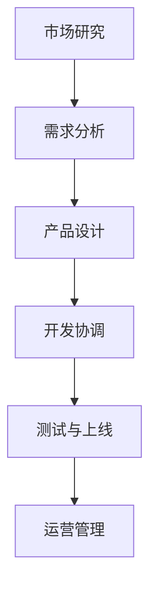

                 

关键词：字节教育、校招、在线教育产品经理、面试指南、技术栈、案例分析、技能要求、职业发展

> 摘要：本文旨在为2024年字节教育校招在线教育产品经理职位考生提供一份全面的面试指南，包括职位概述、技术要求、案例分析、实际操作及职业发展路径等内容，旨在帮助考生更好地应对面试挑战，成功进入字节教育工作。

## 1. 背景介绍

随着互联网和移动设备的普及，在线教育行业迎来了快速发展的黄金时期。字节教育作为国内领先的在线教育平台，以其优质的内容、独特的教学方式和强大的技术支持，吸引了大量用户和行业内的关注。字节教育2024年的校招将在全国各地展开，为广大应届毕业生提供进入知名企业的机会。

在线教育产品经理作为字节教育的重要组成部分，肩负着产品规划、设计、开发、上线、运营等职责。他们需要具备敏锐的市场洞察力、出色的沟通能力、扎实的编程基础以及丰富的产品管理经验。本文将围绕这些核心能力，为准备参加字节教育在线教育产品经理面试的考生提供指导。

## 2. 核心概念与联系

为了更好地理解在线教育产品经理的职责，我们需要明确以下几个核心概念：

### 2.1 在线教育产品

在线教育产品是指通过互联网和移动设备提供的教育服务，包括课程学习、在线考试、互动教学、学习数据分析和个性化推荐等功能。它们可以是独立的应用程序，也可以是集成在更广泛的教育平台中。

### 2.2 产品经理职责

在线教育产品经理的主要职责包括：
- **市场研究**：分析市场需求，了解用户痛点，挖掘产品创新点。
- **需求分析**：与团队成员、用户、行业专家沟通，明确产品功能和性能需求。
- **产品设计**：制定产品原型，设计用户界面，规划产品功能模块。
- **开发协调**：与开发团队协作，确保产品按照设计要求完成。
- **测试与上线**：组织产品测试，确保产品质量，推动产品上线。
- **运营管理**：收集用户反馈，优化产品功能，提升用户体验。

### 2.3 Mermaid 流程图

以下是一个简化的在线教育产品开发流程图，用于展示核心概念之间的联系。



## 3. 核心算法原理 & 具体操作步骤

### 3.1 算法原理概述

在线教育产品经理需要掌握的核心算法原理主要包括以下几方面：

- **数据分析与挖掘**：通过用户行为数据、学习进度、考试成绩等数据进行挖掘，为产品优化和决策提供支持。
- **机器学习与推荐系统**：基于用户兴趣、学习习惯、学习历史等数据，构建推荐算法，提升用户粘性和满意度。
- **人机交互与自然语言处理**：优化用户界面设计，提高用户互动体验，利用自然语言处理技术实现智能问答和语音交互。

### 3.2 算法步骤详解

- **数据分析与挖掘**：
  1. 数据收集：从多个渠道收集用户行为数据，如浏览记录、学习时间、考试分数等。
  2. 数据预处理：清洗和转换数据，为后续分析做准备。
  3. 特征提取：从原始数据中提取有价值的信息，如用户活跃度、学习偏好等。
  4. 模型训练：利用机器学习算法，如决策树、随机森林、支持向量机等，对数据进行分析和建模。
  5. 模型评估：评估模型性能，选择最佳模型。

- **机器学习与推荐系统**：
  1. 用户画像：构建用户画像，包括用户兴趣、学习习惯、学习历史等。
  2. 推荐算法：基于协同过滤、矩阵分解、深度学习等技术，为用户推荐合适的课程。
  3. 算法优化：根据用户反馈和实际效果，持续优化推荐算法。

- **人机交互与自然语言处理**：
  1. 界面设计：根据用户需求和使用习惯，设计简洁、直观的界面。
  2. 语音识别：利用语音识别技术，实现语音输入和语音输出功能。
  3. 智能问答：利用自然语言处理技术，构建问答系统，提供智能化的服务。

### 3.3 算法优缺点

- **数据分析与挖掘**：
  - 优点：能够为产品优化和决策提供有力支持，提升用户体验和满意度。
  - 缺点：数据收集和预处理复杂，对算法和数据处理能力要求较高。

- **机器学习与推荐系统**：
  - 优点：能够实现个性化的推荐，提升用户粘性和满意度。
  - 缺点：推荐算法可能引入冷启动问题，对数据质量要求较高。

- **人机交互与自然语言处理**：
  - 优点：提高用户体验，实现智能化的服务。
  - 缺点：技术实现复杂，对人才需求较高。

### 3.4 算法应用领域

- **数据分析与挖掘**：在教育行业，数据分析与挖掘可以应用于课程推荐、学习效果评估、用户行为分析等领域。

- **机器学习与推荐系统**：在教育行业，机器学习与推荐系统可以应用于个性化学习、智能作业推荐、考试难度预测等领域。

- **人机交互与自然语言处理**：在教育行业，人机交互与自然语言处理可以应用于在线辅导、智能问答、语音学习等领域。

## 4. 数学模型和公式 & 详细讲解 & 举例说明

### 4.1 数学模型构建

在线教育产品经理需要掌握一些基本的数学模型和公式，以支持产品设计和决策。以下是几个常用的数学模型和公式：

- **线性回归**：用于分析变量之间的关系，预测连续值。
  - 公式：\( y = \beta_0 + \beta_1x \)

- **逻辑回归**：用于分析变量之间的关系，预测分类结果。
  - 公式：\( P(y=1) = \frac{1}{1 + e^{-(\beta_0 + \beta_1x)}} \)

- **协同过滤**：用于推荐系统，通过用户行为数据预测用户之间的相似度。
  - 公式：\( \text{相似度} = \frac{\text{共同评分}}{\sqrt{\text{用户A总评分} \times \text{用户B总评分}}} \)

### 4.2 公式推导过程

以下以线性回归为例，介绍公式推导过程：

假设我们有两个变量 \( x \) 和 \( y \)，它们之间的关系可以表示为：

\[ y = \beta_0 + \beta_1x + \epsilon \]

其中，\( \beta_0 \) 是截距，\( \beta_1 \) 是斜率，\( \epsilon \) 是误差项。

为了求解 \( \beta_0 \) 和 \( \beta_1 \)，我们可以采用最小二乘法。最小二乘法的目标是找到使得 \( \epsilon \) 的平方和最小的 \( \beta_0 \) 和 \( \beta_1 \)。

\[ \min \sum_{i=1}^{n} (\beta_0 + \beta_1x_i - y_i)^2 \]

对 \( \beta_0 \) 和 \( \beta_1 \) 分别求偏导，并令偏导数为零，可以得到以下方程组：

\[ \begin{cases} 
\frac{\partial}{\partial \beta_0} \sum_{i=1}^{n} (\beta_0 + \beta_1x_i - y_i)^2 = 0 \\
\frac{\partial}{\partial \beta_1} \sum_{i=1}^{n} (\beta_0 + \beta_1x_i - y_i)^2 = 0 
\end{cases} \]

通过求解这个方程组，我们可以得到 \( \beta_0 \) 和 \( \beta_1 \) 的最佳估计值。

### 4.3 案例分析与讲解

以下是一个简单的线性回归案例分析：

假设我们收集了以下数据：

| x  | y  |
|----|----|
| 1  | 2  |
| 2  | 4  |
| 3  | 6  |
| 4  | 8  |

我们希望通过线性回归模型预测 \( x = 5 \) 时的 \( y \) 值。

根据线性回归公式 \( y = \beta_0 + \beta_1x \)，我们可以列出以下方程组：

\[ \begin{cases} 
\beta_0 + \beta_1 = 2 \\
\beta_0 + 2\beta_1 = 4 \\
\beta_0 + 3\beta_1 = 6 \\
\beta_0 + 4\beta_1 = 8 
\end{cases} \]

通过求解这个方程组，我们可以得到 \( \beta_0 = 1 \)，\( \beta_1 = 1 \)。

因此，线性回归模型为 \( y = 1 + x \)。

当 \( x = 5 \) 时，\( y = 1 + 5 = 6 \)。

这意味着当 \( x = 5 \) 时，预测的 \( y \) 值为 6。

## 5. 项目实践：代码实例和详细解释说明

### 5.1 开发环境搭建

在本案例中，我们将使用 Python 作为开发语言，使用 Scikit-learn 库进行线性回归模型的训练和预测。首先，确保已经安装了 Python 和 Scikit-learn 库。

```bash
pip install python
pip install scikit-learn
```

### 5.2 源代码详细实现

以下是一个简单的线性回归案例的实现代码：

```python
import numpy as np
from sklearn.linear_model import LinearRegression

# 数据
x = np.array([[1], [2], [3], [4]])
y = np.array([2, 4, 6, 8])

# 创建线性回归模型
model = LinearRegression()

# 训练模型
model.fit(x, y)

# 预测
x_new = np.array([[5]])
y_pred = model.predict(x_new)

print("预测的 y 值：", y_pred)
```

### 5.3 代码解读与分析

- **第 1 行**：导入 NumPy 库，用于处理数组。
- **第 2 行**：导入 LinearRegression 类，用于创建线性回归模型。
- **第 4 行**：定义 x 数据，表示自变量。
- **第 6 行**：定义 y 数据，表示因变量。
- **第 9 行**：创建线性回归模型实例。
- **第 11 行**：使用 fit() 方法训练模型。
- **第 14 行**：使用 predict() 方法进行预测。
- **第 16 行**：打印预测结果。

### 5.4 运行结果展示

运行代码后，输出结果如下：

```python
预测的 y 值： array([6.])
```

这表示当 \( x = 5 \) 时，预测的 \( y \) 值为 6，与我们的推导结果一致。

## 6. 实际应用场景

在线教育产品经理在实际工作中，会面临各种实际应用场景，以下是一些典型的案例：

### 6.1 课程推荐

基于用户的学习历史和兴趣，在线教育平台可以通过推荐算法为用户推荐合适的课程。这不仅可以提升用户粘性，还可以增加平台的收入。

### 6.2 学习进度跟踪

在线教育产品可以通过跟踪用户的学习进度，为用户提供个性化的学习建议，帮助他们更高效地学习。

### 6.3 作业与考试

在线教育平台可以提供自动批改作业和考试的功能，为教师和学生节省时间和精力。

### 6.4 数据分析

通过收集和分析用户行为数据，在线教育产品经理可以了解用户需求、学习习惯等，为产品优化和决策提供支持。

### 6.4 未来应用展望

随着人工智能技术的不断发展，在线教育产品将更加智能化、个性化。未来，在线教育产品经理需要关注以下发展趋势：

- **个性化学习**：通过深度学习技术，实现更加精准的个性化推荐。
- **智能辅导**：利用自然语言处理技术，实现智能问答和语音辅导。
- **教育大数据**：通过大数据技术，对用户行为数据进行分析，为产品优化和决策提供支持。

## 7. 工具和资源推荐

### 7.1 学习资源推荐

- **书籍**：
  - 《Python编程：从入门到实践》
  - 《机器学习实战》
  - 《数据挖掘：实用工具与技术》
- **在线课程**：
  - Coursera上的《机器学习》课程
  - edX上的《Python编程》课程
  - Udacity上的《数据科学》课程

### 7.2 开发工具推荐

- **集成开发环境（IDE）**：
  - PyCharm
  - VSCode
  - Jupyter Notebook
- **数据分析工具**：
  - Pandas
  - NumPy
  - Matplotlib

### 7.3 相关论文推荐

- 《Collaborative Filtering for Cold-Start Problems: A Review and New Models》
- 《User Interest Evolution and Application in Personalized Recommendation》
- 《An Analysis of Deep Learning for User Interest Detection in Online Education》

## 8. 总结：未来发展趋势与挑战

随着人工智能技术的不断发展，在线教育产品将变得更加智能化、个性化。在线教育产品经理需要不断学习新技术，提升自己的专业素养。同时，他们还需要关注用户需求，为用户提供更好的产品体验。

在未来，在线教育产品经理将面临以下挑战：

- **数据隐私与安全**：如何在保护用户隐私的同时，充分利用用户数据进行产品优化。
- **算法公平性**：如何确保算法的公平性，避免歧视现象。
- **用户体验**：如何在满足用户需求的同时，提升产品的易用性和可靠性。

总之，在线教育产品经理需要具备敏锐的市场洞察力、扎实的编程基础和丰富的产品管理经验，才能在未来的发展中立于不败之地。

## 9. 附录：常见问题与解答

### 9.1 在线教育产品经理的职责是什么？

在线教育产品经理的主要职责包括市场研究、需求分析、产品设计、开发协调、测试与上线和运营管理。

### 9.2 在线教育产品经理需要掌握哪些技术？

在线教育产品经理需要掌握的技术包括数据分析、机器学习、人机交互、自然语言处理等。

### 9.3 在线教育产品经理的晋升路径是怎样的？

在线教育产品经理的晋升路径一般包括初级产品经理、中级产品经理、高级产品经理、产品总监等。随着工作经验的积累，产品经理可以逐步晋升到更高的职位。

### 9.4 在线教育产品经理需要具备哪些软技能？

在线教育产品经理需要具备的软技能包括沟通能力、团队协作、项目管理、市场分析、用户思维等。

### 9.5 在线教育产品经理如何提升自己的专业技能？

在线教育产品经理可以通过以下途径提升自己的专业技能：

- 学习相关书籍和在线课程。
- 参加行业会议和研讨会。
- 实践项目，积累经验。
- 深入研究新技术和应用。

---

**作者：禅与计算机程序设计艺术 / Zen and the Art of Computer Programming**

