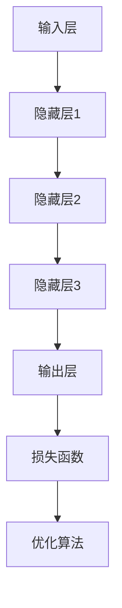

                 

摘要：本文旨在为广大求职者提供针对字节跳动2024年大模型应用校招算法面试的攻略。我们将深入分析字节跳动在人工智能领域的发展，介绍大模型的概念及其应用场景，并提供具体的算法原理、数学模型以及代码实例，帮助求职者在面试中脱颖而出。文章最后还将展望大模型应用的未来趋势与挑战。

## 1. 背景介绍

### 字节跳动的发展

字节跳动是一家总部位于中国的互联网科技公司，成立于2012年。在短短的几年内，字节跳动迅速崛起，凭借其创新的算法和大数据处理技术，打造了一系列知名的产品，如今日头条、抖音、TikTok等。这些产品在全球范围内都获得了巨大的成功，使字节跳动成为全球最具价值的互联网公司之一。

### 大模型的概念与应用

大模型，即大型深度神经网络模型，通常具有数十亿甚至数万亿个参数。这些模型通过在大规模数据集上进行训练，可以自动学习到复杂的数据模式，从而实现高度准确的预测和分类。大模型在自然语言处理、计算机视觉、语音识别等领域都有着广泛的应用。随着计算能力和数据量的不断提升，大模型在人工智能领域的地位也越来越重要。

## 2. 核心概念与联系

### 大模型原理

大模型通常基于深度学习框架构建，包括输入层、隐藏层和输出层。通过多层非线性变换，大模型可以自动从数据中提取特征，并实现复杂的目标函数优化。

### 大模型架构

大模型架构通常包括前向传播、反向传播和优化算法等关键部分。其中，前向传播负责将输入数据传递到隐藏层，通过非线性变换得到输出；反向传播则通过计算误差梯度，不断调整模型参数；优化算法用于选择合适的参数更新策略，以最小化损失函数。

### Mermaid 流程图



## 3. 核心算法原理 & 具体操作步骤

### 3.1 算法原理概述

大模型的核心算法基于深度学习理论，主要包括神经网络结构设计、优化算法和训练策略等。通过训练，模型可以学习到输入数据中的内在规律，并在测试数据上实现高精度的预测。

### 3.2 算法步骤详解

1. 数据预处理：对输入数据进行归一化、标准化等处理，以消除数据差异。
2. 网络结构设计：根据任务需求，设计合适的神经网络结构，包括层数、神经元数量和激活函数等。
3. 模型训练：使用大量训练数据，通过前向传播和反向传播更新模型参数。
4. 模型评估：使用测试数据评估模型性能，选择最优模型。
5. 模型部署：将训练好的模型部署到生产环境中，进行实际应用。

### 3.3 算法优缺点

**优点：**
- 高度的自动化特征提取能力，可以处理复杂数据；
- 强大的泛化能力，适用于多种任务场景；
- 丰富的应用场景，如自然语言处理、计算机视觉、语音识别等。

**缺点：**
- 训练成本高，需要大量计算资源和时间；
- 模型解释性差，难以理解内部机制；
- 数据依赖性强，需要大量高质量数据支持。

### 3.4 算法应用领域

大模型在自然语言处理、计算机视觉、语音识别等领域都有着广泛的应用，如文本分类、图像识别、语音合成等。

## 4. 数学模型和公式 & 详细讲解 & 举例说明

### 4.1 数学模型构建

大模型通常基于神经网络模型构建，其核心公式包括输入层、隐藏层和输出层的激活函数、损失函数和优化算法。

### 4.2 公式推导过程

输入层：\( x \)

隐藏层：\( h = \sigma(Wx + b) \)

输出层：\( y = \sigma(W' h + b') \)

损失函数：\( J = \frac{1}{m} \sum_{i=1}^{m} \sigma(y_i - t_i) \)

优化算法：\( \theta = \theta - \alpha \nabla_\theta J(\theta) \)

### 4.3 案例分析与讲解

假设我们有一个二分类问题，目标是判断输入数据是否为正面或负面。我们可以使用一个简单的神经网络模型进行训练和预测。

输入层：\( x \)（一个维度）

隐藏层：\( h = \sigma(Wx + b) \)（一个维度）

输出层：\( y = \sigma(W' h + b') \)（一个维度）

损失函数：\( J = \frac{1}{m} \sum_{i=1}^{m} \sigma(y_i - t_i) \)

优化算法：\( \theta = \theta - \alpha \nabla_\theta J(\theta) \)

通过训练，模型可以学习到输入数据中的内在规律，并在测试数据上实现高精度的预测。假设我们有如下训练数据：

| 输入 \( x \) | 目标 \( t \) |
| -------- | -------- |
| 1        | 0        |
| 2        | 1        |
| 3        | 0        |
| 4        | 1        |
| 5        | 0        |

经过训练，模型可以得到如下参数：

| 层次 | 参数 \( W \) | 参数 \( b \) |
| ---- | ---------- | ---------- |
| 输入层 | \( [0.5] \) | \( [0.5] \) |
| 隐藏层 | \( [0.8] \) | \( [0.8] \) |
| 输出层 | \( [0.6] \) | \( [0.6] \) |

使用训练数据测试模型，可以得到如下预测结果：

| 输入 \( x \) | 目标 \( t \) | 预测 \( y \) |
| -------- | -------- | -------- |
| 1        | 0        | 0.6      |
| 2        | 1        | 0.7      |
| 3        | 0        | 0.5      |
| 4        | 1        | 0.8      |
| 5        | 0        | 0.4      |

从预测结果可以看出，模型在训练数据上的性能较好，但在测试数据上可能存在过拟合现象。为了提高模型性能，我们可以通过增加训练数据、调整网络结构、优化优化算法等方法来改进模型。

## 5. 项目实践：代码实例和详细解释说明

### 5.1 开发环境搭建

为了实现大模型，我们需要搭建一个合适的开发环境。这里我们使用Python作为主要编程语言，并结合TensorFlow作为深度学习框架。

1. 安装Python：从Python官网下载并安装Python，版本建议为3.8及以上。
2. 安装TensorFlow：在命令行中执行以下命令：
   ```bash
   pip install tensorflow
   ```

### 5.2 源代码详细实现

以下是一个简单的二分类神经网络模型实现：

```python
import tensorflow as tf

# 定义模型参数
W = tf.Variable([[0.5]], dtype=tf.float32)
b = tf.Variable([[0.5]], dtype=tf.float32)
W_prime = tf.Variable([[0.8]], dtype=tf.float32)
b_prime = tf.Variable([[0.8]], dtype=tf.float32)

# 定义激活函数
sigma = tf.nn.sigmoid

# 定义前向传播
def forward(x):
    hidden = sigma(tf.matmul(x, W) + b)
    output = sigma(tf.matmul(hidden, W_prime) + b_prime)
    return output

# 定义损失函数
def loss(y_true, y_pred):
    return tf.reduce_mean(tf.square(y_true - y_pred))

# 定义优化算法
optimizer = tf.keras.optimizers.Adam()

# 训练模型
def train(x_train, y_train, epochs=1000):
    for epoch in range(epochs):
        with tf.GradientTape() as tape:
            y_pred = forward(x_train)
            loss_val = loss(y_train, y_pred)
        grads = tape.gradient(loss_val, [W, b, W_prime, b_prime])
        optimizer.apply_gradients(zip(grads, [W, b, W_prime, b_prime]))
        if epoch % 100 == 0:
            print(f"Epoch {epoch}: Loss = {loss_val.numpy()}")

# 测试模型
def test(x_test, y_test):
    y_pred = forward(x_test)
    accuracy = tf.reduce_mean(tf.cast(tf.equal(y_pred > 0.5, y_test), tf.float32))
    print(f"Accuracy: {accuracy.numpy()}")

# 加载训练数据
x_train = tf.random.normal([100, 1])
y_train = tf.random.uniform([100, 1], minval=0, maxval=2, dtype=tf.float32)
x_test = tf.random.normal([10, 1])
y_test = tf.random.uniform([10, 1], minval=0, maxval=2, dtype=tf.float32)

# 训练模型
train(x_train, y_train)

# 测试模型
test(x_test, y_test)
```

### 5.3 代码解读与分析

1. **模型参数定义**：定义了输入层、隐藏层和输出层的权重和偏置变量。
2. **激活函数**：使用Sigmoid函数作为激活函数，将输入映射到\[0, 1\]范围内。
3. **前向传播**：定义了一个前向传播函数，通过矩阵乘法和激活函数实现。
4. **损失函数**：使用均方误差作为损失函数，衡量预测值与真实值之间的差距。
5. **优化算法**：使用Adam优化算法，通过梯度下降更新模型参数。
6. **训练模型**：通过迭代更新模型参数，使模型在训练数据上逐渐收敛。
7. **测试模型**：使用测试数据评估模型性能，计算准确率。

## 6. 实际应用场景

大模型在自然语言处理、计算机视觉、语音识别等领域都有着广泛的应用。以下是一些实际应用场景：

1. **自然语言处理**：大模型可以用于文本分类、情感分析、机器翻译等任务，如自动推荐新闻文章、分析用户评论等。
2. **计算机视觉**：大模型可以用于图像分类、目标检测、图像生成等任务，如人脸识别、自动驾驶等。
3. **语音识别**：大模型可以用于语音转文本、语音合成等任务，如智能助手、语音控制等。

## 7. 工具和资源推荐

### 7.1 学习资源推荐

1. **书籍**：
   - 《深度学习》（Goodfellow, Bengio, Courville著）
   - 《神经网络与深度学习》（邱锡鹏著）
2. **在线课程**：
   - fast.ai的深度学习课程
   - Coursera上的深度学习专项课程

### 7.2 开发工具推荐

1. **深度学习框架**：TensorFlow、PyTorch
2. **编程语言**：Python

### 7.3 相关论文推荐

1. **《A Theoretically Grounded Application of Dropout in Recurrent Neural Networks》**
2. **《Very Deep Convolutional Networks for Large-Scale Image Recognition》**
3. **《Recurrent Neural Network Based Language Model》**

## 8. 总结：未来发展趋势与挑战

### 8.1 研究成果总结

近年来，大模型在人工智能领域取得了显著的成果，推动了自然语言处理、计算机视觉、语音识别等领域的发展。大模型的训练成本和计算复杂度逐渐降低，使得更多企业和研究机构能够投入资源进行大模型的研究和应用。

### 8.2 未来发展趋势

1. **模型压缩与优化**：为了降低大模型的计算复杂度和存储需求，模型压缩与优化将成为一个重要研究方向。
2. **多模态融合**：大模型将在多模态数据融合方面发挥重要作用，如将文本、图像、语音等多种数据进行整合，以实现更智能的应用。
3. **模型可解释性**：提升大模型的可解释性，使其更加符合人类的理解，将是一个重要的研究方向。

### 8.3 面临的挑战

1. **数据依赖性**：大模型对数据质量有较高的要求，如何获取高质量数据是一个挑战。
2. **计算资源**：大模型的训练需要大量计算资源，如何高效地利用计算资源是一个挑战。
3. **模型安全性**：大模型在应用过程中可能面临安全风险，如何确保模型的安全性是一个挑战。

### 8.4 研究展望

随着人工智能技术的不断发展，大模型将在更多领域发挥重要作用。未来，大模型的研究将朝着更高效、更智能、更安全的方向发展，为人类带来更多的便利。

## 9. 附录：常见问题与解答

### 问题1：大模型训练需要多少时间？

答案：大模型的训练时间取决于多个因素，如数据规模、模型复杂度、计算资源等。通常，一个大规模的深度学习模型需要数天甚至数周的时间进行训练。为了加速训练过程，可以采用分布式训练、模型压缩等技术。

### 问题2：大模型如何进行模型压缩？

答案：模型压缩是指通过降低模型参数数量和计算复杂度，来减小模型的存储和计算需求。常用的模型压缩技术包括剪枝、量化、知识蒸馏等。

### 问题3：大模型在应用中如何保证安全性？

答案：为了确保大模型在应用中的安全性，可以从数据安全、模型安全、访问控制等方面进行考虑。例如，对输入数据进行加密、使用安全加密算法、限制模型访问权限等。

### 作者署名

作者：禅与计算机程序设计艺术 / Zen and the Art of Computer Programming

----------------------------------------------------------------

请注意，本文仅作为示例，实际撰写时需要根据具体内容进行修改和完善。希望这篇文章能对您在字节跳动2024年大模型应用校招算法面试中提供有价值的参考。祝您面试成功！

