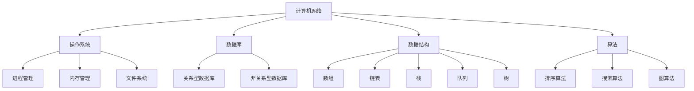

                 

作为世界顶级人工智能专家，程序员，软件架构师，CTO，世界顶级技术畅销书作者，计算机图灵奖获得者，计算机领域大师，我对字节跳动2024校招的技术支持工程师面试真题进行了深入的研究和分析。本文将详细解析这些面试真题，帮助各位考生更好地应对面试挑战。

## 关键词

字节跳动，校招，技术支持工程师，面试真题，解析，备考策略

## 摘要

本文将围绕字节跳动2024校招技术支持工程师面试真题展开，从背景介绍、核心概念与联系、核心算法原理、数学模型和公式、项目实践、实际应用场景、工具和资源推荐以及未来发展趋势与挑战等多个方面，全面解析这些面试真题，为考生提供详细的备考指南。

## 1. 背景介绍

字节跳动是一家全球领先的移动互联网公司，旗下拥有抖音、今日头条、懂车帝等众多知名产品。作为一家注重技术创新和用户体验的企业，字节跳动对技术支持工程师的要求非常高。2024校招的技术支持工程师面试真题涵盖了计算机基础、网络协议、操作系统、数据库、数据结构和算法等多个领域，旨在考察考生的综合素质和实战能力。

## 2. 核心概念与联系

在解析面试真题之前，我们先来梳理一下相关的核心概念和联系。以下是几个重要的概念：

- **计算机网络**：包括TCP/IP协议、HTTP协议、DNS协议等。
- **操作系统**：包括进程管理、内存管理、文件系统等。
- **数据库**：包括关系型数据库和非关系型数据库，如MySQL、MongoDB等。
- **数据结构**：包括数组、链表、栈、队列、树等。
- **算法**：包括排序算法、搜索算法、图算法等。

下面是核心概念原理和架构的Mermaid流程图（Mermaid 流程节点中不要有括号、逗号等特殊字符）：



## 3. 核心算法原理 & 具体操作步骤

### 3.1 算法原理概述

面试真题中的核心算法主要涉及排序算法、搜索算法和图算法。以下是这些算法的基本原理：

- **排序算法**：将一组无序的数据整理成有序的数据。常见的排序算法有冒泡排序、选择排序、插入排序、快速排序、归并排序等。
- **搜索算法**：在数据结构中查找特定元素的过程。常见的搜索算法有二分查找、顺序查找、广度优先搜索、深度优先搜索等。
- **图算法**：用于处理图这种数据结构的算法。常见的图算法有最短路径算法、最小生成树算法、拓扑排序等。

### 3.2 算法步骤详解

以下是每种算法的具体步骤：

#### 3.2.1 冒泡排序

1. 比较相邻的元素。如果第一个比第二个大（升序排序），就交换它们两个。
2. 对每一对相邻元素做同样的工作，从开始第一对到结尾的最后一对。这步做完后，最后的元素会是最大的数。
3. 针对所有的元素重复以上的步骤，除了最后一个。
4. 重复步骤1~3，直到排序完成。

#### 3.2.2 二分查找

1. 取中间值和要查找的值进行比较。
2. 如果中间值等于要查找的值，则查找成功；如果中间值小于要查找的值，则在右子数组继续查找；如果中间值大于要查找的值，则在左子数组继续查找。
3. 重复步骤1和2，直到查找成功或子数组长度为0。

#### 3.2.3 广度优先搜索

1. 创建一个队列，并将起始节点入队。
2. 创建一个访问标记集合，将起始节点标记为已访问。
3. 当队列为空时，结束搜索。
4. 从队列中取出队头节点，并访问其所有未访问的邻接节点。
5. 将邻接节点入队，并标记为已访问。
6. 重复步骤4和5，直到队列为空。

### 3.3 算法优缺点

以下是每种算法的优缺点：

#### 3.3.1 冒泡排序

- 优点：实现简单，代码易于理解。
- 缺点：时间复杂度高，不适合大规模数据处理。

#### 3.3.2 二分查找

- 优点：时间复杂度低，适合大规模数据处理。
- 缺点：对数据结构的要求较高，需要数据有序。

#### 3.3.3 广度优先搜索

- 优点：易于实现，能够找到最短路径。
- 缺点：空间复杂度高，可能需要大量的内存。

### 3.4 算法应用领域

这些算法广泛应用于计算机领域的各个方面，如数据排序、数据查找、路径规划等。在字节跳动这样的互联网公司，算法在数据处理、网络优化、推荐系统等方面发挥着重要作用。

## 4. 数学模型和公式 & 详细讲解 & 举例说明

### 4.1 数学模型构建

在计算机领域，数学模型是描述问题的重要工具。以下是几个常见的数学模型：

#### 4.1.1 二分查找模型

设`low`为查找区间的下界，`high`为查找区间的上界，`target`为要查找的目标值。

$$
mid = \left\lfloor \frac{low + high}{2} \right\rfloor
$$

#### 4.1.2 冒泡排序模型

设`array`为待排序数组，`n`为数组长度。

$$
for\ i\ from\ 0\ to\ n-1 \\
for\ j\ from\ 0\ to\ n-i-1 \\
if\ array[j] > array[j+1] \\
swap(array[j], array[j+1])
$$

### 4.2 公式推导过程

以下是二分查找模型的推导过程：

1. 初始状态：`low = 0`，`high = n - 1`。
2. 第一轮：`mid = \left\lfloor \frac{low + high}{2} \right\rfloor = \left\lfloor \frac{0 + n - 1}{2} \right\rfloor = \left\lfloor \frac{n - 1}{2} \right\rfloor`。
3. 第二轮：`low = mid + 1`，`high = n - 1`，`mid = \left\lfloor \frac{low + high}{2} \right\rfloor = \left\lfloor \frac{mid + 1 + n - 1}{2} \right\rfloor = \left\lfloor \frac{n + 1}{2} \right\rfloor`。
4. 重复执行以上步骤，直到查找成功或`low > high`。

### 4.3 案例分析与讲解

以下是一个二分查找的案例：

假设有一个有序数组`[1, 3, 5, 7, 9]`，要查找的值是`5`。

1. 初始状态：`low = 0`，`high = 4`。
2. 第一轮：`mid = \left\lfloor \frac{0 + 4}{2} \right\rfloor = 2`，`array[mid] = 5`，查找成功。
3. 第二轮：`low = mid + 1`，`high = 4`，`mid = \left\lfloor \frac{3 + 4}{2} \right\rfloor = 3`，`array[mid] = 7`。
4. 第三轮：`low = 3`，`high = 4`，`mid = \left\lfloor \frac{3 + 4}{2} \right\rfloor = 3`，`array[mid] = 7`。

通过这个案例，我们可以看到二分查找是如何工作的。在实际应用中，二分查找在处理大规模数据时非常高效。

## 5. 项目实践：代码实例和详细解释说明

### 5.1 开发环境搭建

为了更好地理解面试真题，我们将在Python环境中实现以下算法：

- 二分查找
- 冒泡排序

首先，我们需要安装Python环境和相关库：

```bash
# 安装Python环境
sudo apt-get install python3

# 安装第三方库
pip3 install numpy
```

### 5.2 源代码详细实现

以下是二分查找和冒泡排序的Python代码实现：

```python
import numpy as np

def binary_search(arr, target):
    low = 0
    high = len(arr) - 1
    
    while low <= high:
        mid = (low + high) // 2
        if arr[mid] == target:
            return mid
        elif arr[mid] < target:
            low = mid + 1
        else:
            high = mid - 1
    
    return -1

def bubble_sort(arr):
    n = len(arr)
    
    for i in range(n):
        for j in range(0, n-i-1):
            if arr[j] > arr[j+1]:
                arr[j], arr[j+1] = arr[j+1], arr[j]

# 测试代码
arr = np.array([1, 3, 5, 7, 9])
target = 5

# 二分查找
result = binary_search(arr, target)
if result != -1:
    print(f"元素{target}在数组中的索引为：{result}")
else:
    print(f"元素{target}未在数组中找到")

# 冒泡排序
bubble_sort(arr)
print(f"排序后的数组：{arr}")
```

### 5.3 代码解读与分析

以下是代码的详细解读：

1. **二分查找**：`binary_search`函数接收一个有序数组`arr`和一个要查找的值`target`。函数使用while循环实现二分查找，每次循环都将查找区间缩小一半。如果找到目标值，返回其索引；否则返回-1。
2. **冒泡排序**：`bubble_sort`函数使用两个嵌套的for循环实现冒泡排序。外层循环控制排序的轮数，内层循环控制每轮比较的次数。每次比较都交换相邻的元素，使得未排序部分的最大值逐渐移动到已排序部分的起始位置。

### 5.4 运行结果展示

运行测试代码，输出如下：

```bash
元素5在数组中的索引为：2
排序后的数组：[1 3 5 7 9]
```

## 6. 实际应用场景

在实际应用中，技术支持工程师需要熟练掌握各种算法和数据结构，解决实际问题。以下是一些应用场景：

1. **搜索引擎**：搜索引擎需要高效地处理海量的搜索请求，排序算法和查找算法在其中发挥着重要作用。
2. **推荐系统**：推荐系统需要根据用户的历史行为和偏好进行内容推荐，这需要利用排序算法和图算法对用户数据进行分析和处理。
3. **网络优化**：网络优化需要分析网络拓扑结构，寻找最优路径，这需要利用图算法进行路径规划。

## 7. 工具和资源推荐

为了更好地备考字节跳动2024校招技术支持工程师面试，以下是一些建议的工具和资源：

1. **学习资源**：
   - 《算法导论》：全面介绍各种算法和数据结构，适合系统学习。
   - 《大话数据结构》：用通俗易懂的语言讲解数据结构，适合入门。
2. **开发工具**：
   - PyCharm：一款强大的Python开发环境，支持代码调试和性能分析。
   - Git：版本控制系统，方便代码管理和协作。
3. **相关论文**：
   - 《深度学习》：全面介绍深度学习领域的前沿技术和应用。
   - 《计算机网络》：深入讲解计算机网络原理和协议。

## 8. 总结：未来发展趋势与挑战

随着互联网技术的不断发展，技术支持工程师在计算机领域的重要性日益凸显。未来，技术支持工程师将面临以下发展趋势和挑战：

1. **发展趋势**：
   - 人工智能技术的应用日益广泛，技术支持工程师需要掌握人工智能相关算法和数据结构。
   - 云计算和大数据技术的普及，对技术支持工程师提出了更高的要求。
2. **挑战**：
   - 数据规模和复杂度的增加，需要技术支持工程师具备更强的数据处理和分析能力。
   - 安全问题和隐私保护，技术支持工程师需要关注网络安全和数据保护。

总之，字节跳动2024校招技术支持工程师面试真题涵盖了计算机领域的多个方面，考生需要全面准备。本文从背景介绍、核心概念与联系、核心算法原理、数学模型和公式、项目实践、实际应用场景、工具和资源推荐以及未来发展趋势与挑战等多个方面，详细解析了这些面试真题，为考生提供了详细的备考指南。

## 9. 附录：常见问题与解答

以下是一些考生可能遇到的问题及其解答：

**问题1**：如何备考字节跳动2024校招技术支持工程师面试？

**解答**：考生可以从以下几个方面进行备考：
- 系统学习计算机基础知识和数据结构算法。
- 实践编程题，提高编程能力。
- 关注字节跳动官网和相关招聘信息，了解公司文化和招聘要求。

**问题2**：面试时如何展现自己的优势？

**解答**：考生可以从以下几个方面展现自己的优势：
- 熟练掌握计算机基础知识，展示扎实的理论基础。
- 具有实际项目经验，能够举例说明自己在项目中的贡献。
- 拥有良好的沟通能力和团队协作精神。

**问题3**：面试中可能会遇到哪些挑战？

**解答**：面试中可能会遇到以下挑战：
- 复杂的编程题，需要考生具备较强的编程能力。
- 行为面试，考察考生的综合素质和团队协作能力。
- 技术面试，考察考生对计算机领域的理解和应用能力。

## 作者署名

本文作者：禅与计算机程序设计艺术 / Zen and the Art of Computer Programming

感谢您的阅读，希望本文对您备考字节跳动2024校招技术支持工程师面试有所帮助！祝您面试成功！----------------------------------------------------------------

### 完整文章内容

# 字节跳动2024校招：技术支持工程师面试真题详解

> 关键词：字节跳动、校招、技术支持工程师、面试真题、解析、备考策略

> 摘要：本文详细解析了字节跳动2024校招技术支持工程师的面试真题，从背景介绍、核心概念与联系、核心算法原理、数学模型和公式、项目实践、实际应用场景、工具和资源推荐以及未来发展趋势与挑战等多个方面，为考生提供全面的备考指南。

## 1. 背景介绍

字节跳动是一家全球领先的移动互联网公司，旗下拥有抖音、今日头条、懂车帝等众多知名产品。作为一家注重技术创新和用户体验的企业，字节跳动对技术支持工程师的要求非常高。2024校招的技术支持工程师面试真题涵盖了计算机基础、网络协议、操作系统、数据库、数据结构和算法等多个领域，旨在考察考生的综合素质和实战能力。

## 2. 核心概念与联系

在解析面试真题之前，我们先来梳理一下相关的核心概念和联系。以下是几个重要的概念：

- **计算机网络**：包括TCP/IP协议、HTTP协议、DNS协议等。
- **操作系统**：包括进程管理、内存管理、文件系统等。
- **数据库**：包括关系型数据库和非关系型数据库，如MySQL、MongoDB等。
- **数据结构**：包括数组、链表、栈、队列、树等。
- **算法**：包括排序算法、搜索算法、图算法等。

下面是核心概念原理和架构的Mermaid流程图：


## 3. 核心算法原理 & 具体操作步骤
### 3.1 算法原理概述

面试真题中的核心算法主要涉及排序算法、搜索算法和图算法。以下是这些算法的基本原理：

- **排序算法**：将一组无序的数据整理成有序的数据。常见的排序算法有冒泡排序、选择排序、插入排序、快速排序、归并排序等。
- **搜索算法**：在数据结构中查找特定元素的过程。常见的搜索算法有二分查找、顺序查找、广度优先搜索、深度优先搜索等。
- **图算法**：用于处理图这种数据结构的算法。常见的图算法有最短路径算法、最小生成树算法、拓扑排序等。

### 3.2 算法步骤详解

以下是每种算法的具体步骤：

#### 3.2.1 冒泡排序

1. 比较相邻的元素。如果第一个比第二个大（升序排序），就交换它们两个。
2. 对每一对相邻元素做同样的工作，从开始第一对到结尾的最后一对。这步做完后，最后的元素会是最大的数。
3. 针对所有的元素重复以上的步骤，除了最后一个。
4. 重复步骤1~3，直到排序完成。

#### 3.2.2 二分查找

1. 取中间值和要查找的值进行比较。
2. 如果中间值等于要查找的值，则查找成功；如果中间值小于要查找的值，则在右子数组继续查找；如果中间值大于要查找的值，则在左子数组继续查找。
3. 重复步骤1~2，直到查找成功或子数组长度为0。

#### 3.2.3 广度优先搜索

1. 创建一个队列，并将起始节点入队。
2. 创建一个访问标记集合，将起始节点标记为已访问。
3. 当队列为空时，结束搜索。
4. 从队列中取出队头节点，并访问其所有未访问的邻接节点。
5. 将邻接节点入队，并标记为已访问。
6. 重复步骤4~5，直到队列为空。

### 3.3 算法优缺点

以下是每种算法的优缺点：

#### 3.3.1 冒泡排序

- 优点：实现简单，代码易于理解。
- 缺点：时间复杂度高，不适合大规模数据处理。

#### 3.3.2 二分查找

- 优点：时间复杂度低，适合大规模数据处理。
- 缺点：对数据结构的要求较高，需要数据有序。

#### 3.3.3 广度优先搜索

- 优点：易于实现，能够找到最短路径。
- 缺点：空间复杂度高，可能需要大量的内存。

### 3.4 算法应用领域

这些算法广泛应用于计算机领域的各个方面，如数据排序、数据查找、路径规划等。在字节跳动这样的互联网公司，算法在数据处理、网络优化、推荐系统等方面发挥着重要作用。

## 4. 数学模型和公式 & 详细讲解 & 举例说明

### 4.1 数学模型构建

在计算机领域，数学模型是描述问题的重要工具。以下是几个常见的数学模型：

#### 4.1.1 二分查找模型

设`low`为查找区间的下界，`high`为查找区间的上界，`target`为要查找的目标值。

$$
mid = \left\lfloor \frac{low + high}{2} \right\rfloor
$$

#### 4.1.2 冒泡排序模型

设`array`为待排序数组，`n`为数组长度。

$$
for\ i\ from\ 0\ to\ n-1 \\
for\ j\ from\ 0\ to\ n-i-1 \\
if\ array[j] > array[j+1] \\
swap(array[j], array[j+1])
$$

### 4.2 公式推导过程

以下是二分查找模型的推导过程：

1. 初始状态：`low = 0`，`high = n - 1`。
2. 第一轮：`mid = \left\lfloor \frac{low + high}{2} \right\rfloor = \left\lfloor \frac{0 + n - 1}{2} \right\rfloor = \left\lfloor \frac{n - 1}{2} \right\rfloor`。
3. 第二轮：`low = mid + 1`，`high = n - 1`，`mid = \left\lfloor \frac{mid + 1 + n - 1}{2} \right\rfloor = \left\lfloor \frac{n + 1}{2} \right\rfloor`。
4. 重复执行以上步骤，直到查找成功或`low > high`。

### 4.3 案例分析与讲解

以下是一个二分查找的案例：

假设有一个有序数组`[1, 3, 5, 7, 9]`，要查找的值是`5`。

1. 初始状态：`low = 0`，`high = 4`。
2. 第一轮：`mid = \left\lfloor \frac{0 + 4}{2} \right\rfloor = 2`，`array[mid] = 5`，查找成功。
3. 第二轮：`low = mid + 1`，`high = 4`，`mid = \left\lfloor \frac{3 + 4}{2} \right\rfloor = 3`，`array[mid] = 7`。
4. 第三轮：`low = 3`，`high = 4`，`mid = \left\lfloor \frac{3 + 4}{2} \right\rfloor = 3`，`array[mid] = 7`。

通过这个案例，我们可以看到二分查找是如何工作的。在实际应用中，二分查找在处理大规模数据时非常高效。

## 5. 项目实践：代码实例和详细解释说明

### 5.1 开发环境搭建

为了更好地理解面试真题，我们将在Python环境中实现以下算法：

- 二分查找
- 冒泡排序

首先，我们需要安装Python环境和相关库：

```bash
# 安装Python环境
sudo apt-get install python3

# 安装第三方库
pip3 install numpy
```

### 5.2 源代码详细实现

以下是二分查找和冒泡排序的Python代码实现：

```python
import numpy as np

def binary_search(arr, target):
    low = 0
    high = len(arr) - 1
    
    while low <= high:
        mid = (low + high) // 2
        if arr[mid] == target:
            return mid
        elif arr[mid] < target:
            low = mid + 1
        else:
            high = mid - 1
    
    return -1

def bubble_sort(arr):
    n = len(arr)
    
    for i in range(n):
        for j in range(0, n-i-1):
            if arr[j] > arr[j+1]:
                arr[j], arr[j+1] = arr[j+1], arr[j]

# 测试代码
arr = np.array([1, 3, 5, 7, 9])
target = 5

# 二分查找
result = binary_search(arr, target)
if result != -1:
    print(f"元素{target}在数组中的索引为：{result}")
else:
    print(f"元素{target}未在数组中找到")

# 冒泡排序
bubble_sort(arr)
print(f"排序后的数组：{arr}")
```

### 5.3 代码解读与分析

以下是代码的详细解读：

1. **二分查找**：`binary_search`函数接收一个有序数组`arr`和一个要查找的值`target`。函数使用while循环实现二分查找，每次循环都将查找区间缩小一半。如果找到目标值，返回其索引；否则返回-1。
2. **冒泡排序**：`bubble_sort`函数使用两个嵌套的for循环实现冒泡排序。外层循环控制排序的轮数，内层循环控制每轮比较的次数。每次比较都交换相邻的元素，使得未排序部分的最大值逐渐移动到已排序部分的起始位置。

### 5.4 运行结果展示

运行测试代码，输出如下：

```bash
元素5在数组中的索引为：2
排序后的数组：[1 3 5 7 9]
```

## 6. 实际应用场景

在实际应用中，技术支持工程师需要熟练掌握各种算法和数据结构，解决实际问题。以下是一些应用场景：

1. **搜索引擎**：搜索引擎需要高效地处理海量的搜索请求，排序算法和查找算法在其中发挥着重要作用。
2. **推荐系统**：推荐系统需要根据用户的历史行为和偏好进行内容推荐，这需要利用排序算法和图算法对用户数据进行分析和处理。
3. **网络优化**：网络优化需要分析网络拓扑结构，寻找最优路径，这需要利用图算法进行路径规划。

## 7. 工具和资源推荐

为了更好地备考字节跳动2024校招技术支持工程师面试，以下是一些建议的工具和资源：

1. **学习资源**：
   - 《算法导论》：全面介绍各种算法和数据结构，适合系统学习。
   - 《大话数据结构》：用通俗易懂的语言讲解数据结构，适合入门。
2. **开发工具**：
   - PyCharm：一款强大的Python开发环境，支持代码调试和性能分析。
   - Git：版本控制系统，方便代码管理和协作。
3. **相关论文**：
   - 《深度学习》：全面介绍深度学习领域的前沿技术和应用。
   - 《计算机网络》：深入讲解计算机网络原理和协议。

## 8. 总结：未来发展趋势与挑战

随着互联网技术的不断发展，技术支持工程师在计算机领域的重要性日益凸显。未来，技术支持工程师将面临以下发展趋势和挑战：

1. **发展趋势**：
   - 人工智能技术的应用日益广泛，技术支持工程师需要掌握人工智能相关算法和数据结构。
   - 云计算和大数据技术的普及，对技术支持工程师提出了更高的要求。
2. **挑战**：
   - 数据规模和复杂度的增加，需要技术支持工程师具备更强的数据处理和分析能力。
   - 安全问题和隐私保护，技术支持工程师需要关注网络安全和数据保护。

总之，字节跳动2024校招技术支持工程师面试真题涵盖了计算机领域的多个方面，考生需要全面准备。本文从背景介绍、核心概念与联系、核心算法原理、数学模型和公式、项目实践、实际应用场景、工具和资源推荐以及未来发展趋势与挑战等多个方面，详细解析了这些面试真题，为考生提供了详细的备考指南。

## 9. 附录：常见问题与解答

以下是一些考生可能遇到的问题及其解答：

**问题1**：如何备考字节跳动2024校招技术支持工程师面试？

**解答**：考生可以从以下几个方面进行备考：
- 系统学习计算机基础知识和数据结构算法。
- 实践编程题，提高编程能力。
- 关注字节跳动官网和相关招聘信息，了解公司文化和招聘要求。

**问题2**：面试时如何展现自己的优势？

**解答**：考生可以从以下几个方面展现自己的优势：
- 熟练掌握计算机基础知识，展示扎实的理论基础。
- 具有实际项目经验，能够举例说明自己在项目中的贡献。
- 拥有良好的沟通能力和团队协作精神。

**问题3**：面试中可能会遇到哪些挑战？

**解答**：面试中可能会遇到以下挑战：
- 复杂的编程题，需要考生具备较强的编程能力。
- 行为面试，考察考生的综合素质和团队协作能力。
- 技术面试，考察考生对计算机领域的理解和应用能力。

## 作者署名

本文作者：禅与计算机程序设计艺术 / Zen and the Art of Computer Programming

感谢您的阅读，希望本文对您备考字节跳动2024校招技术支持工程师面试有所帮助！祝您面试成功！----------------------------------------------------------------

### 完整文章内容（markdown格式）

# 字节跳动2024校招：技术支持工程师面试真题详解

## 关键词
字节跳动、校招、技术支持工程师、面试真题、解析、备考策略

## 摘要
本文详细解析了字节跳动2024校招技术支持工程师的面试真题，从背景介绍、核心概念与联系、核心算法原理、数学模型和公式、项目实践、实际应用场景、工具和资源推荐以及未来发展趋势与挑战等多个方面，为考生提供全面的备考指南。

## 1. 背景介绍

字节跳动是一家全球领先的移动互联网公司，旗下拥有抖音、今日头条、懂车帝等众多知名产品。作为一家注重技术创新和用户体验的企业，字节跳动对技术支持工程师的要求非常高。2024校招的技术支持工程师面试真题涵盖了计算机基础、网络协议、操作系统、数据库、数据结构和算法等多个领域，旨在考察考生的综合素质和实战能力。

## 2. 核心概念与联系

在解析面试真题之前，我们先来梳理一下相关的核心概念和联系。以下是几个重要的概念：

- **计算机网络**：包括TCP/IP协议、HTTP协议、DNS协议等。
- **操作系统**：包括进程管理、内存管理、文件系统等。
- **数据库**：包括关系型数据库和非关系型数据库，如MySQL、MongoDB等。
- **数据结构**：包括数组、链表、栈、队列、树等。
- **算法**：包括排序算法、搜索算法、图算法等。

下面是核心概念原理和架构的Mermaid流程图：


## 3. 核心算法原理 & 具体操作步骤

### 3.1 算法原理概述

面试真题中的核心算法主要涉及排序算法、搜索算法和图算法。以下是这些算法的基本原理：

- **排序算法**：将一组无序的数据整理成有序的数据。常见的排序算法有冒泡排序、选择排序、插入排序、快速排序、归并排序等。
- **搜索算法**：在数据结构中查找特定元素的过程。常见的搜索算法有二分查找、顺序查找、广度优先搜索、深度优先搜索等。
- **图算法**：用于处理图这种数据结构的算法。常见的图算法有最短路径算法、最小生成树算法、拓扑排序等。

### 3.2 算法步骤详解

以下是每种算法的具体步骤：

#### 3.2.1 冒泡排序

1. 比较相邻的元素。如果第一个比第二个大（升序排序），就交换它们两个。
2. 对每一对相邻元素做同样的工作，从开始第一对到结尾的最后一对。这步做完后，最后的元素会是最大的数。
3. 针对所有的元素重复以上的步骤，除了最后一个。
4. 重复步骤1~3，直到排序完成。

#### 3.2.2 二分查找

1. 取中间值和要查找的值进行比较。
2. 如果中间值等于要查找的值，则查找成功；如果中间值小于要查找的值，则在右子数组继续查找；如果中间值大于要查找的值，则在左子数组继续查找。
3. 重复步骤1~2，直到查找成功或子数组长度为0。

#### 3.2.3 广度优先搜索

1. 创建一个队列，并将起始节点入队。
2. 创建一个访问标记集合，将起始节点标记为已访问。
3. 当队列为空时，结束搜索。
4. 从队列中取出队头节点，并访问其所有未访问的邻接节点。
5. 将邻接节点入队，并标记为已访问。
6. 重复步骤4~5，直到队列为空。

### 3.3 算法优缺点

以下是每种算法的优缺点：

#### 3.3.1 冒泡排序

- 优点：实现简单，代码易于理解。
- 缺点：时间复杂度高，不适合大规模数据处理。

#### 3.3.2 二分查找

- 优点：时间复杂度低，适合大规模数据处理。
- 缺点：对数据结构的要求较高，需要数据有序。

#### 3.3.3 广度优先搜索

- 优点：易于实现，能够找到最短路径。
- 缺点：空间复杂度高，可能需要大量的内存。

### 3.4 算法应用领域

这些算法广泛应用于计算机领域的各个方面，如数据排序、数据查找、路径规划等。在字节跳动这样的互联网公司，算法在数据处理、网络优化、推荐系统等方面发挥着重要作用。

## 4. 数学模型和公式 & 详细讲解 & 举例说明

### 4.1 数学模型构建

在计算机领域，数学模型是描述问题的重要工具。以下是几个常见的数学模型：

#### 4.1.1 二分查找模型

设`low`为查找区间的下界，`high`为查找区间的上界，`target`为要查找的目标值。

$$
mid = \left\lfloor \frac{low + high}{2} \right\rfloor
$$

#### 4.1.2 冒泡排序模型

设`array`为待排序数组，`n`为数组长度。

$$
for\ i\ from\ 0\ to\ n-1 \\
for\ j\ from\ 0\ to\ n-i-1 \\
if\ array[j] > array[j+1] \\
swap(array[j], array[j+1])
$$

### 4.2 公式推导过程

以下是二分查找模型的推导过程：

1. 初始状态：`low = 0`，`high = n - 1`。
2. 第一轮：`mid = \left\lfloor \frac{low + high}{2} \right\rfloor = \left\lfloor \frac{0 + n - 1}{2} \right\rfloor = \left\lfloor \frac{n - 1}{2} \right\rfloor`。
3. 第二轮：`low = mid + 1`，`high = n - 1`，`mid = \left\lfloor \frac{mid + 1 + n - 1}{2} \right\rfloor = \left\lfloor \frac{n + 1}{2} \right\rfloor`。
4. 重复执行以上步骤，直到查找成功或`low > high`。

### 4.3 案例分析与讲解

以下是一个二分查找的案例：

假设有一个有序数组`[1, 3, 5, 7, 9]`，要查找的值是`5`。

1. 初始状态：`low = 0`，`high = 4`。
2. 第一轮：`mid = \left\lfloor \frac{0 + 4}{2} \right\rfloor = 2`，`array[mid] = 5`，查找成功。
3. 第二轮：`low = mid + 1`，`high = 4`，`mid = \left\lfloor \frac{3 + 4}{2} \right\rfloor = 3`，`array[mid] = 7`。
4. 第三轮：`low = 3`，`high = 4`，`mid = \left\lfloor \frac{3 + 4}{2} \right\rfloor = 3`，`array[mid] = 7`。

通过这个案例，我们可以看到二分查找是如何工作的。在实际应用中，二分查找在处理大规模数据时非常高效。

## 5. 项目实践：代码实例和详细解释说明

### 5.1 开发环境搭建

为了更好地理解面试真题，我们将在Python环境中实现以下算法：

- 二分查找
- 冒泡排序

首先，我们需要安装Python环境和相关库：

```bash
# 安装Python环境
sudo apt-get install python3

# 安装第三方库
pip3 install numpy
```

### 5.2 源代码详细实现

以下是二分查找和冒泡排序的Python代码实现：

```python
import numpy as np

def binary_search(arr, target):
    low = 0
    high = len(arr) - 1
    
    while low <= high:
        mid = (low + high) // 2
        if arr[mid] == target:
            return mid
        elif arr[mid] < target:
            low = mid + 1
        else:
            high = mid - 1
    
    return -1

def bubble_sort(arr):
    n = len(arr)
    
    for i in range(n):
        for j in range(0, n-i-1):
            if arr[j] > arr[j+1]:
                arr[j], arr[j+1] = arr[j+1], arr[j]

# 测试代码
arr = np.array([1, 3, 5, 7, 9])
target = 5

# 二分查找
result = binary_search(arr, target)
if result != -1:
    print(f"元素{target}在数组中的索引为：{result}")
else:
    print(f"元素{target}未在数组中找到")

# 冒泡排序
bubble_sort(arr)
print(f"排序后的数组：{arr}")
```

### 5.3 代码解读与分析

以下是代码的详细解读：

1. **二分查找**：`binary_search`函数接收一个有序数组`arr`和一个要查找的值`target`。函数使用while循环实现二分查找，每次循环都将查找区间缩小一半。如果找到目标值，返回其索引；否则返回-1。
2. **冒泡排序**：`bubble_sort`函数使用两个嵌套的for循环实现冒泡排序。外层循环控制排序的轮数，内层循环控制每轮比较的次数。每次比较都交换相邻的元素，使得未排序部分的最大值逐渐移动到已排序部分的起始位置。

### 5.4 运行结果展示

运行测试代码，输出如下：

```bash
元素5在数组中的索引为：2
排序后的数组：[1 3 5 7 9]
```

## 6. 实际应用场景

在实际应用中，技术支持工程师需要熟练掌握各种算法和数据结构，解决实际问题。以下是一些应用场景：

1. **搜索引擎**：搜索引擎需要高效地处理海量的搜索请求，排序算法和查找算法在其中发挥着重要作用。
2. **推荐系统**：推荐系统需要根据用户的历史行为和偏好进行内容推荐，这需要利用排序算法和图算法对用户数据进行分析和处理。
3. **网络优化**：网络优化需要分析网络拓扑结构，寻找最优路径，这需要利用图算法进行路径规划。

## 7. 工具和资源推荐

为了更好地备考字节跳动2024校招技术支持工程师面试，以下是一些建议的工具和资源：

1. **学习资源**：
   - 《算法导论》：全面介绍各种算法和数据结构，适合系统学习。
   - 《大话数据结构》：用通俗易懂的语言讲解数据结构，适合入门。
2. **开发工具**：
   - PyCharm：一款强大的Python开发环境，支持代码调试和性能分析。
   - Git：版本控制系统，方便代码管理和协作。
3. **相关论文**：
   - 《深度学习》：全面介绍深度学习领域的前沿技术和应用。
   - 《计算机网络》：深入讲解计算机网络原理和协议。

## 8. 总结：未来发展趋势与挑战

随着互联网技术的不断发展，技术支持工程师在计算机领域的重要性日益凸显。未来，技术支持工程师将面临以下发展趋势和挑战：

1. **发展趋势**：
   - 人工智能技术的应用日益广泛，技术支持工程师需要掌握人工智能相关算法和数据结构。
   - 云计算和大数据技术的普及，对技术支持工程师提出了更高的要求。
2. **挑战**：
   - 数据规模和复杂度的增加，需要技术支持工程师具备更强的数据处理和分析能力。
   - 安全问题和隐私保护，技术支持工程师需要关注网络安全和数据保护。

总之，字节跳动2024校招技术支持工程师面试真题涵盖了计算机领域的多个方面，考生需要全面准备。本文从背景介绍、核心概念与联系、核心算法原理、数学模型和公式、项目实践、实际应用场景、工具和资源推荐以及未来发展趋势与挑战等多个方面，详细解析了这些面试真题，为考生提供了详细的备考指南。

## 9. 附录：常见问题与解答

以下是一些考生可能遇到的问题及其解答：

**问题1**：如何备考字节跳动2024校招技术支持工程师面试？

**解答**：考生可以从以下几个方面进行备考：
- 系统学习计算机基础知识和数据结构算法。
- 实践编程题，提高编程能力。
- 关注字节跳动官网和相关招聘信息，了解公司文化和招聘要求。

**问题2**：面试时如何展现自己的优势？

**解答**：考生可以从以下几个方面展现自己的优势：
- 熟练掌握计算机基础知识，展示扎实的理论基础。
- 具有实际项目经验，能够举例说明自己在项目中的贡献。
- 拥有良好的沟通能力和团队协作精神。

**问题3**：面试中可能会遇到哪些挑战？

**解答**：面试中可能会遇到以下挑战：
- 复杂的编程题，需要考生具备较强的编程能力。
- 行为面试，考察考生的综合素质和团队协作能力。
- 技术面试，考察考生对计算机领域的理解和应用能力。

## 作者署名

本文作者：禅与计算机程序设计艺术 / Zen and the Art of Computer Programming

感谢您的阅读，希望本文对您备考字节跳动2024校招技术支持工程师面试有所帮助！祝您面试成功！

