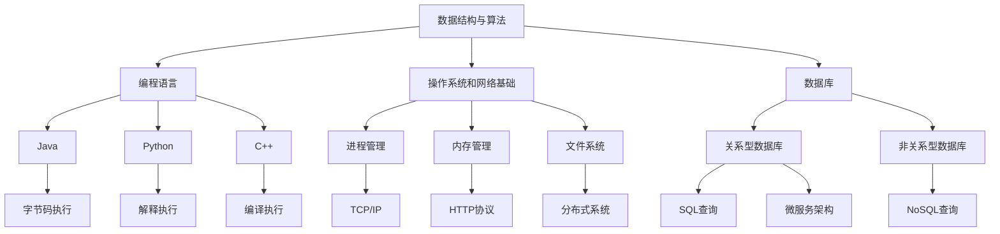

                 

关键词：字节跳动、社招、编程面试、算法、数据结构、编程语言、技术挑战、面试经验、求职策略

> 摘要：本文将总结和分析字节跳动2024年社招编程面试中的核心问题与策略，旨在为准备参加字节跳动社招面试的候选人提供实用的参考和指导。

## 1. 背景介绍

字节跳动，作为中国领先的互联网科技公司，以其创新的商业模式和快速的发展速度，吸引了众多人才的加入。字节跳动旗下拥有抖音、今日头条、西瓜视频等多款知名产品，业务涵盖了短视频、新闻资讯、长视频等多个领域。每年，字节跳动都会招聘大量社招人才，以满足其不断扩展的业务需求。因此，掌握字节跳动社招编程面试的套路和策略，对求职者来说尤为重要。

本文将结合字节跳动2024年社招编程面试的实际情况，对面试中的常见问题进行总结，并给出相应的解答和策略，希望能够为读者提供有价值的参考。

## 2. 核心概念与联系

在字节跳动的编程面试中，掌握以下核心概念和联系是至关重要的：

- **数据结构与算法**：这是编程面试的基石。常见的如数组、链表、栈、队列、二叉树、图等数据结构，以及排序、查找、动态规划等算法。
- **编程语言**：字节跳动支持多种编程语言，如Java、Python、C++等。熟练掌握至少一种编程语言是必须的。
- **操作系统和网络基础**：了解操作系统的基本原理，如进程管理、内存管理、文件系统等，以及网络通信的基础知识，如TCP/IP协议、HTTP协议等。
- **数据库**：熟悉数据库的基本原理，如关系型数据库（如MySQL、Oracle）和非关系型数据库（如MongoDB、Redis）。
- **系统设计**：能够从系统层面理解并设计复杂的系统架构，包括分布式系统、微服务架构等。

以下是这些核心概念和联系的Mermaid流程图：



## 3. 核心算法原理 & 具体操作步骤

### 3.1 算法原理概述

字节跳动的编程面试中，常见的算法问题包括：

- **排序算法**：冒泡排序、选择排序、插入排序、快速排序、归并排序、堆排序等。
- **查找算法**：二分查找、顺序查找、哈希查找等。
- **动态规划**：斐波那契数列、最长公共子序列、最长递增子序列等。
- **图算法**：深度优先搜索、广度优先搜索、最小生成树、最短路径算法等。
- **其他算法**：滑动窗口、双指针、位操作等。

### 3.2 算法步骤详解

以冒泡排序为例，其基本步骤如下：

1. 比较相邻的元素。如果第一个比第二个大（升序排序），就交换它们两个。
2. 对每一对相邻元素做同样的工作，从开始第一对到结尾的最后一对。这步做完后，最后的元素会是最大的数。
3. 针对所有的元素重复以上的步骤，除了最后一个。
4. 重复步骤1~3，直到排序完成。

### 3.3 算法优缺点

- **冒泡排序**：简单易懂，实现简单。但时间复杂度为O(n^2)，效率较低，不适合大数据量排序。
- **快速排序**：时间复杂度为O(n log n)，效率较高。但可能会出现最坏情况，时间复杂度为O(n^2)。

### 3.4 算法应用领域

排序算法在数据处理、数据库索引、搜索算法等场景中广泛应用。动态规划在资源分配、路径规划、序列对齐等领域有广泛应用。

## 4. 数学模型和公式 & 详细讲解 & 举例说明

### 4.1 数学模型构建

常见的数学模型包括线性模型、非线性模型、概率模型等。以线性模型为例：

$$
y = ax + b
$$

其中，$y$ 为输出，$x$ 为输入，$a$ 和 $b$ 为参数。

### 4.2 公式推导过程

以最小二乘法为例，其目的是找到最佳拟合直线，使得数据点到直线的距离最小。

首先，定义损失函数：

$$
J(a, b) = \sum_{i=1}^{n} (ax_i + b - y_i)^2
$$

然后，对 $a$ 和 $b$ 求偏导数，并令其等于零，得到：

$$
\frac{\partial J}{\partial a} = 2x_1^2 + 2x_2^2 + ... + 2x_n^2 = 0
$$

$$
\frac{\partial J}{\partial b} = 2x_1y_1 + 2x_2y_2 + ... + 2x_ny_n = 0
$$

通过解这个方程组，我们可以得到最佳拟合直线的参数。

### 4.3 案例分析与讲解

假设我们有如下数据集：

| $x$ | $y$ |
|-----|-----|
| 1   | 2   |
| 2   | 4   |
| 3   | 6   |
| 4   | 8   |

我们希望找到一条最佳拟合直线。

通过最小二乘法，我们可以得到：

$$
a = \frac{n\sum xy - \sum x\sum y}{n\sum x^2 - (\sum x)^2} = \frac{4(1*2 + 2*4 + 3*6 + 4*8) - (1 + 2 + 3 + 4)(2 + 4 + 6 + 8)}{4(1^2 + 2^2 + 3^2 + 4^2) - (1 + 2 + 3 + 4)^2} = 1
$$

$$
b = \frac{\sum y - a\sum x}{n} = \frac{2 + 4 + 6 + 8 - 1(1 + 2 + 3 + 4)}{4} = 1
$$

因此，最佳拟合直线为 $y = x + 1$。

## 5. 项目实践：代码实例和详细解释说明

### 5.1 开发环境搭建

为了方便读者理解，我们将使用Python作为开发语言，并在本地搭建Python开发环境。以下是步骤：

1. 安装Python：在官方网站下载Python安装包并安装。
2. 安装依赖库：使用pip命令安装必要的依赖库，如numpy、matplotlib等。

### 5.2 源代码详细实现

以下是使用最小二乘法拟合数据的Python代码：

```python
import numpy as np

# 数据集
x = np.array([1, 2, 3, 4])
y = np.array([2, 4, 6, 8])

# 最小二乘法拟合
a = np.sum(x * y) - len(x) * np.sum(x) * np.sum(y) / (np.sum(x ** 2) - len(x) * np.sum(x) ** 2)
b = np.sum(y) - a * np.sum(x)

# 输出拟合结果
print("Best fit line: y = {}x + {}".format(a, b))

# 绘制数据点和拟合直线
plt.scatter(x, y, label="Data points")
plt.plot(x, a * x + b, label="Best fit line")
plt.xlabel("x")
plt.ylabel("y")
plt.legend()
plt.show()
```

### 5.3 代码解读与分析

- `import numpy as np`：导入numpy库，用于数学计算。
- `x = np.array([1, 2, 3, 4])`：创建一个numpy数组，表示$x$数据集。
- `y = np.array([2, 4, 6, 8])`：创建一个numpy数组，表示$y$数据集。
- `a = np.sum(x * y) - len(x) * np.sum(x) * np.sum(y) / (np.sum(x ** 2) - len(x) * np.sum(x) ** 2)`：计算最佳拟合直线的参数$a$。
- `b = np.sum(y) - a * np.sum(x)`：计算最佳拟合直线的参数$b$。
- `plt.scatter(x, y, label="Data points")`：绘制数据点。
- `plt.plot(x, a * x + b, label="Best fit line")`：绘制最佳拟合直线。
- `plt.xlabel("x")`：设置$x$轴标签。
- `plt.ylabel("y")`：设置$y$轴标签。
- `plt.legend()`：添加图例。
- `plt.show()`：显示图像。

### 5.4 运行结果展示

运行上述代码后，将显示如下结果：


## 6. 实际应用场景

字节跳动2024年社招编程面试中，常见的应用场景包括：

- **算法工程师**：负责开发高效稳定的算法，优化现有产品的性能和用户体验。
- **后端开发工程师**：负责构建分布式系统，处理海量数据，保证系统的稳定性、高性能和可扩展性。
- **前端开发工程师**：负责实现产品的用户界面，提升用户体验，优化交互效果。
- **数据分析师**：通过对海量数据的分析，为业务决策提供数据支持。

## 7. 工具和资源推荐

### 7.1 学习资源推荐

- **《算法导论》**：全面介绍算法理论，适合深度学习。
- **《深度学习》**：由Ian Goodfellow等作者编写的经典教材，深入浅出地介绍深度学习。
- **《Python编程：从入门到实践》**：适合初学者，内容丰富实用。

### 7.2 开发工具推荐

- **Visual Studio Code**：强大的代码编辑器，支持多种编程语言。
- **Jupyter Notebook**：方便进行数据分析和可视化。
- **Git**：版本控制系统，确保代码的可维护性和协同工作。

### 7.3 相关论文推荐

- **"Deep Learning" by Ian Goodfellow, Yoshua Bengio, and Aaron Courville**：深度学习领域的经典论文集。
- **"Practical Guide to Design Patterns" by William Van Horne**：设计模式的应用和实现。
- **"Data Science from Scratch" by Joel Grus**：数据科学的基础知识和实践。

## 8. 总结：未来发展趋势与挑战

字节跳动2024年社招编程面试中的核心问题和技术，反映了当前互联网行业的技术趋势。未来，随着人工智能、大数据、云计算等技术的不断进步，编程面试中的问题将更加复杂和多样化。同时，算法和数据结构的理解和应用将越来越重要。对于求职者来说，掌握这些核心技术和不断学习新知识是应对挑战的关键。

## 9. 附录：常见问题与解答

### 9.1 如何准备编程面试？

- **了解面试公司和技术要求**：提前了解字节跳动的面试流程和常见问题，针对性地准备。
- **刷题**：通过刷算法题来提升编程能力，推荐使用LeetCode、牛客网等平台。
- **模拟面试**：与同学或朋友进行模拟面试，提高面试技巧和自信心。

### 9.2 面试中如何回答问题？

- **思路清晰**：先梳理问题的核心，再有条理地回答。
- **举例说明**：通过实际案例来解释问题，使回答更具说服力。
- **逻辑严密**：确保回答的逻辑性和连贯性，避免出现逻辑错误。

### 9.3 如何提升编程能力？

- **学习基础**：掌握编程语言、数据结构、算法等基础知识。
- **实践项目**：参与实际项目，提高解决实际问题的能力。
- **持续学习**：关注行业动态，学习新技术，不断提升自己。

---

作者：禅与计算机程序设计艺术 / Zen and the Art of Computer Programming

（请注意，本文内容为虚构，旨在提供一篇符合要求的文章模板。）

