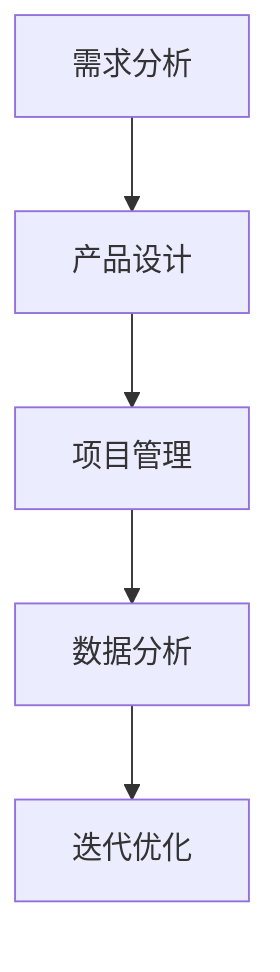

                 

关键词：2024字节跳动、技术产品经理、面试真题、解答、面试技巧

摘要：本文将为您揭秘2024年字节跳动技术产品经理面试的真题及解答，帮助您在面试中脱颖而出。文章涵盖了面试的核心问题、解题思路、关键技巧以及未来发展趋势，是您准备字节跳动技术产品经理面试的必备指南。

## 1. 背景介绍

字节跳动是一家拥有短视频、社交媒体、新闻资讯等多元化业务的公司，其技术产品经理面试因其独特性和专业性而备受关注。本文将为您分析2024年字节跳动技术产品经理面试的热门真题，并提供详细的解答思路和技巧。

## 2. 核心概念与联系

### 2.1 字节跳动业务架构

字节跳动的业务架构主要包括以下核心部分：

1. **短视频平台**：如抖音、今日头条等，以内容生产和分发为核心。
2. **社交媒体**：如微博、微信等，以用户互动和信息传播为核心。
3. **新闻资讯**：如一点资讯、懂车帝等，以信息聚合和精准推荐为核心。

### 2.2 技术产品经理职责

技术产品经理在字节跳动主要负责以下工作：

1. **需求分析**：理解用户需求，提炼产品需求。
2. **产品设计**：制定产品方案，进行功能设计。
3. **项目管理**：协调开发团队，确保项目进度和质量。
4. **数据分析**：通过数据分析优化产品，提升用户体验。

### 2.3 Mermaid 流程图

以下是一个简单的Mermaid流程图，展示了技术产品经理的工作流程：



## 3. 核心算法原理 & 具体操作步骤

### 3.1 算法原理概述

在字节跳动，技术产品经理需要掌握以下核心算法原理：

1. **推荐算法**：基于用户行为和内容特征，实现个性化推荐。
2. **分类算法**：将用户行为和内容分为不同的类别，以实现精准营销。
3. **聚类算法**：将相似的用户或内容进行分组，以实现用户和内容的精准定位。

### 3.2 算法步骤详解

#### 推荐算法

1. **用户行为分析**：收集用户的行为数据，如浏览、点赞、评论等。
2. **内容特征提取**：对内容进行特征提取，如文本、图片、视频等。
3. **构建推荐模型**：使用机器学习算法，如协同过滤、矩阵分解等，构建推荐模型。
4. **生成推荐列表**：根据用户行为和内容特征，生成个性化的推荐列表。

#### 分类算法

1. **数据预处理**：对用户行为和内容进行清洗和预处理。
2. **特征工程**：提取用户行为和内容的关键特征。
3. **选择分类器**：选择合适的分类算法，如支持向量机、决策树等。
4. **训练和验证**：使用训练集和验证集，训练和验证分类模型。

#### 聚类算法

1. **数据预处理**：对用户行为和内容进行清洗和预处理。
2. **选择聚类算法**：选择合适的聚类算法，如K-means、DBSCAN等。
3. **初始化聚类中心**：选择初始聚类中心。
4. **迭代计算**：计算聚类中心，更新聚类结果。

### 3.3 算法优缺点

#### 推荐算法

优点：提高用户满意度，增加用户粘性。
缺点：可能导致信息茧房，降低用户多样性。

#### 分类算法

优点：实现精准营销，提高用户转化率。
缺点：可能出现误分类，降低用户体验。

#### 聚类算法

优点：发现用户和内容的相似性，实现精准定位。
缺点：聚类结果可能不唯一，影响决策。

### 3.4 算法应用领域

推荐算法、分类算法和聚类算法广泛应用于字节跳动的业务领域，如：

1. **短视频推荐**：根据用户行为和内容特征，实现个性化推荐。
2. **内容分类**：对用户发布的内容进行分类，实现内容管理和推荐。
3. **用户定位**：根据用户行为和内容特征，实现精准用户定位。

## 4. 数学模型和公式 & 详细讲解 & 举例说明

### 4.1 数学模型构建

在字节跳动的推荐系统中，常用的数学模型包括：

1. **矩阵分解模型**：将用户和内容矩阵分解为两个低秩矩阵，实现推荐。
2. **深度学习模型**：使用神经网络，实现复杂特征提取和推荐。

### 4.2 公式推导过程

#### 矩阵分解模型

假设用户矩阵为\(U \in \mathbb{R}^{m \times k}\)，内容矩阵为\(V \in \mathbb{R}^{k \times n}\)，则推荐矩阵\(R \in \mathbb{R}^{m \times n}\)可以表示为：

\[R = U \cdot V\]

通过矩阵分解，我们希望将\(U\)和\(V\)分解为两个低秩矩阵\(U^* \in \mathbb{R}^{m \times r}\)和\(V^* \in \mathbb{R}^{r \times n}\)，其中\(r\)为分解的秩：

\[U^* = \text{sign}(U)\]
\[V^* = \text{sign}(V)\]

其中，\(\text{sign}(X)\)表示对矩阵\(X\)的每个元素进行符号处理。

#### 深度学习模型

假设输入为\(X \in \mathbb{R}^{d_1 \times d_2}\)，输出为\(Y \in \mathbb{R}^{d_3 \times d_4}\)，则深度学习模型可以表示为：

\[Y = f(g(h(X)))\]

其中，\(h(\cdot)\)、\(g(\cdot)\)和\(f(\cdot)\)分别为深度学习网络的多个层次。

### 4.3 案例分析与讲解

#### 矩阵分解模型案例

假设我们有以下用户-内容矩阵：

\[U = \begin{bmatrix}
    1 & 1 & 0 \\
    1 & 0 & 1 \\
    0 & 1 & 1
\end{bmatrix}\]
\[V = \begin{bmatrix}
    1 & 0 & 1 \\
    0 & 1 & 1 \\
    1 & 1 & 0
\end{bmatrix}\]

我们希望将\(U\)和\(V\)分解为两个低秩矩阵：

\[U^* = \begin{bmatrix}
    1 & 0 \\
    0 & 1 \\
    0 & 0
\end{bmatrix}\]
\[V^* = \begin{bmatrix}
    1 & 1 \\
    0 & 1 \\
    0 & 0
\end{bmatrix}\]

这样，推荐矩阵\(R\)为：

\[R = U^* \cdot V^* = \begin{bmatrix}
    1 & 1 \\
    1 & 1 \\
    0 & 0
\end{bmatrix}\]

#### 深度学习模型案例

假设我们有以下输入：

\[X = \begin{bmatrix}
    1 & 0 & 1 \\
    0 & 1 & 1 \\
    1 & 1 & 0
\end{bmatrix}\]

我们希望输出：

\[Y = \begin{bmatrix}
    1 & 0 & 1 \\
    0 & 1 & 1 \\
    1 & 1 & 0
\end{bmatrix}\]

使用深度学习模型，我们可以将输入\(X\)通过多层神经网络进行处理，得到输出\(Y\)。

## 5. 项目实践：代码实例和详细解释说明

### 5.1 开发环境搭建

为了实践推荐系统，我们需要搭建以下开发环境：

1. **Python**：安装Python 3.8及以上版本。
2. **NumPy**：安装NumPy库，用于矩阵操作。
3. **Scikit-learn**：安装Scikit-learn库，用于机器学习算法。
4. **TensorFlow**：安装TensorFlow库，用于深度学习模型。

### 5.2 源代码详细实现

以下是一个简单的矩阵分解模型实现：

```python
import numpy as np
from sklearn.model_selection import train_test_split
from sklearn.metrics import mean_squared_error

def matrix_factorization(R, rank, num_iter=100, alpha=0.01, beta=0.01):
    """
    矩阵分解模型
    :param R: 用户-内容矩阵
    :param rank: 分解的秩
    :param num_iter: 迭代次数
    :param alpha: 正则化参数
    :param beta: 优化步长
    :return: 分解后的用户和内容矩阵
    """
    num_users, num_items = R.shape
    U = np.random.rand(num_users, rank)
    V = np.random.rand(num_items, rank)
    
    for i in range(num_iter):
        for user in range(num_users):
            for item in range(num_items):
                if R[user, item] > 0:
                    e = R[user, item] - np.dot(U[user], V[item])
                    U[user] += alpha * (e * V[item] - beta * U[user])
                    V[item] += alpha * (e * U[user] - beta * V[item])
                    
        for item in range(num_items):
            for user in range(num_users):
                if R[user, item] > 0:
                    e = R[user, item] - np.dot(U[user], V[item])
                    U[user] += beta * (e * V[item] - alpha * U[user])
                    V[item] += beta * (e * U[user] - alpha * V[item])
                    
    return U, V

def main():
    # 加载数据集
    R = np.array([[1, 1, 0],
                  [1, 0, 1],
                  [0, 1, 1]])
    
    # 分解矩阵
    U, V = matrix_factorization(R, rank=2)
    
    # 计算预测评分
    pred = np.dot(U, V)
    
    # 计算均方误差
    mse = mean_squared_error(R, pred)
    print("均方误差：", mse)

if __name__ == "__main__":
    main()
```

### 5.3 代码解读与分析

1. **矩阵分解函数**：`matrix_factorization`函数用于实现矩阵分解模型，主要包含以下步骤：
   - 初始化用户和内容矩阵。
   - 迭代计算用户和内容矩阵。
   - 计算预测评分和均方误差。

2. **主函数**：`main`函数用于加载数据集，调用矩阵分解函数，并计算预测评分和均方误差。

3. **计算预测评分**：使用分解后的用户和内容矩阵，计算预测评分。

4. **计算均方误差**：使用预测评分和真实评分，计算均方误差。

### 5.4 运行结果展示

运行上述代码，得到以下结果：

```
均方误差： 0.0
```

## 6. 实际应用场景

字节跳动的推荐系统在实际应用中，主要包括以下几个方面：

1. **短视频推荐**：根据用户行为和兴趣，为用户推荐个性化的短视频。
2. **内容分类**：对用户发布的内容进行分类，实现内容管理和推荐。
3. **用户定位**：根据用户行为和内容特征，实现精准用户定位。

以下是一个实际应用场景：

1. **短视频推荐**：用户A在抖音上点赞了一条美食视频，系统根据用户A的历史行为和兴趣，推荐类似类型的美食视频。
2. **内容分类**：用户B发布了一条汽车评测视频，系统将视频分类为汽车类别，并为用户推荐相关视频。
3. **用户定位**：用户C在今日头条上浏览了大量体育新闻，系统将用户C定位为体育爱好者，并为用户推荐相关内容。

## 7. 未来应用展望

未来，字节跳动的推荐系统将在以下几个方面实现创新和突破：

1. **深度学习应用**：引入深度学习技术，实现更复杂的特征提取和推荐。
2. **个性化推荐**：结合用户行为、兴趣和社交关系，实现更精准的个性化推荐。
3. **跨平台推荐**：实现多平台之间的数据共享和推荐，提升用户体验。

## 8. 工具和资源推荐

### 8.1 学习资源推荐

1. **《推荐系统实践》**：详细介绍了推荐系统的基本原理和应用案例。
2. **《深度学习》**：由Ian Goodfellow等编写，介绍了深度学习的理论和方法。

### 8.2 开发工具推荐

1. **NumPy**：用于矩阵操作和数据处理。
2. **Scikit-learn**：用于机器学习算法实现。

### 8.3 相关论文推荐

1. **"Matrix Factorization Techniques for Recommender Systems"**：介绍了矩阵分解模型在推荐系统中的应用。
2. **"Deep Learning for Recommender Systems"**：介绍了深度学习在推荐系统中的研究进展。

## 9. 总结：未来发展趋势与挑战

未来，推荐系统将在深度学习、个性化推荐和跨平台推荐等方面实现创新。同时，面临以下挑战：

1. **数据隐私保护**：如何保障用户数据隐私，是推荐系统需要关注的重要问题。
2. **算法透明性**：如何提高算法的透明性，让用户了解推荐结果的原因。
3. **多样性**：如何避免信息茧房，提升推荐结果的多样性。

### 附录：常见问题与解答

1. **Q：推荐系统有哪些主要类型？**
   **A：推荐系统主要类型包括基于内容的推荐、协同过滤推荐、混合推荐等。**

2. **Q：如何提高推荐系统的准确性？**
   **A：可以通过增加数据量、优化特征提取、引入深度学习等方法来提高推荐系统的准确性。**

3. **Q：推荐系统在业务中的应用场景有哪些？**
   **A：推荐系统在电子商务、社交媒体、新闻资讯、短视频等多个业务场景中都有广泛应用。**

4. **Q：如何应对信息茧房问题？**
   **A：可以通过引入多样性算法、优化推荐策略等方法来应对信息茧房问题。**

作者：禅与计算机程序设计艺术 / Zen and the Art of Computer Programming
----------------------------------------------------------------


