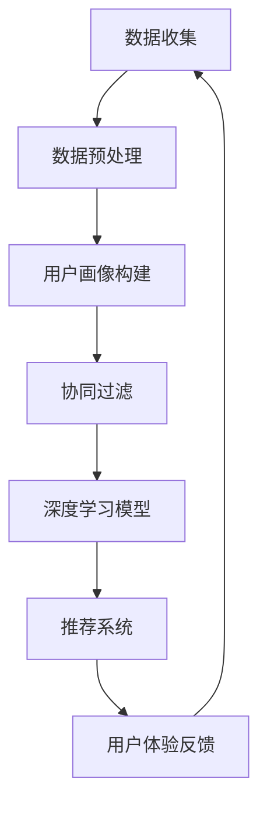

                 

在本篇技术博客文章中，我将详细解析2024年字节跳动技术用户智能化策略专家面试中的关键问题，提供深入的答案解析，帮助准备面试的读者更好地理解面试题目背后的核心原理和策略。文章将按照以下结构进行：

## 关键词
- 字节跳动
- 技术面试
- 用户智能化策略
- 面试题解析
- 算法与模型
- 案例分析

## 摘要
本文汇总了2024年字节跳动技术用户智能化策略专家面试的关键真题，通过深入分析和解答，帮助读者掌握用户智能化的核心概念、算法原理以及应用实践。文章不仅提供了详细的解题思路，还结合实际案例进行讲解，旨在提升读者在用户智能化领域的专业知识和面试技能。

---

## 1. 背景介绍

字节跳动是一家全球领先的移动互联网公司，以其独特的用户数据分析和智能推荐系统而著称。在2024年的技术用户智能化策略专家面试中，面试官们通常关注以下几个方面：

- **用户行为分析**：如何从海量用户行为数据中提取有价值的信息。
- **推荐系统**：如何构建高效、准确的推荐系统来提升用户体验。
- **机器学习**：如何运用机器学习算法来优化用户智能化的策略。
- **数据处理与存储**：如何处理和分析大规模的用户数据。

在这篇文章中，我们将逐一解答这些领域的面试真题，并提供详细的解析。

---

## 2. 核心概念与联系

在用户智能化的领域中，有几个核心概念需要我们了解：

- **用户画像**：基于用户的行为数据、兴趣标签、地理位置等多维度信息，构建的关于用户的一个综合性描述。
- **协同过滤**：一种基于用户相似度的推荐算法，通过计算用户之间的相似度来推荐商品或内容。
- **深度学习**：一种基于人工神经网络的算法，可以自动提取特征并学习复杂的模式。
- **个性化推荐**：根据用户的历史行为和偏好，提供个性化的内容或商品推荐。

以下是用户智能化策略中的一些关键架构的Mermaid流程图：



---

## 3. 核心算法原理 & 具体操作步骤

### 3.1 算法原理概述

在用户智能化的过程中，常用的算法包括协同过滤、基于内容的推荐和深度学习推荐。以下是这些算法的基本原理：

- **协同过滤**：基于用户的历史行为，找到相似的用户，并推荐他们喜欢的内容或商品。
- **基于内容的推荐**：根据用户过去喜欢的商品或内容，推荐具有相似特征的商品或内容。
- **深度学习推荐**：利用深度学习模型，自动从数据中学习用户的行为模式和偏好，进行个性化推荐。

### 3.2 算法步骤详解

1. **数据收集**：收集用户行为数据，如点击、浏览、购买等。
2. **数据预处理**：清洗数据，处理缺失值、异常值等。
3. **构建用户画像**：基于用户的行为数据，构建多维度的用户画像。
4. **算法选择与实现**：根据业务需求，选择协同过滤、基于内容或深度学习算法进行推荐。
5. **推荐系统优化**：通过A/B测试、模型调优等方式，不断提升推荐系统的效果。

### 3.3 算法优缺点

- **协同过滤**：优点是算法简单、易于实现，缺点是可能存在冷启动问题和数据稀疏性问题。
- **基于内容的推荐**：优点是推荐结果相关性强，缺点是用户兴趣变化难以捕捉。
- **深度学习推荐**：优点是能够自动提取特征，适应性强，缺点是计算复杂度高、对数据要求较高。

### 3.4 算法应用领域

- **电商推荐**：通过个性化推荐，提升用户购买转化率。
- **内容推荐**：如新闻、视频、音乐等平台，提供个性化的内容推荐。
- **社交网络**：根据用户关系和兴趣，推荐好友或相关内容。

---

## 4. 数学模型和公式 & 详细讲解 & 举例说明

### 4.1 数学模型构建

用户智能化的核心数学模型包括：

- **用户相似度计算**：如余弦相似度、皮尔逊相关系数等。
- **推荐算法损失函数**：如均方误差（MSE）、交叉熵损失等。

### 4.2 公式推导过程

- **用户相似度计算**：

  $$\text{similarity} = \frac{\text{user\_vector\_A} \cdot \text{user\_vector\_B}}{\|\text{user\_vector\_A}\| \|\text{user\_vector\_B}\|}$$

- **推荐算法损失函数**：

  $$\text{loss} = \frac{1}{N} \sum_{i=1}^{N} (\text{预测评分} - \text{真实评分})^2$$

### 4.3 案例分析与讲解

假设我们有一个用户A，他喜欢看电影，根据用户A的行为数据，我们构建了用户A的画像，并利用协同过滤算法推荐给他其他可能喜欢的电影。

- **用户A的画像**：基于用户A的浏览记录，我们得到一个包含电影名称和评分的矩阵。
- **相似用户计算**：计算与用户A相似的其他用户，选择相似度最高的前N个用户。
- **推荐算法**：利用这N个用户的评分数据，预测用户A可能喜欢的电影，并推荐给他。

---

## 5. 项目实践：代码实例和详细解释说明

### 5.1 开发环境搭建

- **Python环境**：安装Python 3.8及以上版本。
- **依赖库**：安装numpy、pandas、scikit-learn等库。

### 5.2 源代码详细实现

以下是一个简单的协同过滤算法的实现示例：

```python
import numpy as np
from sklearn.metrics.pairwise import cosine_similarity

# 假设我们有两个用户A和B的行为数据
user_A = np.array([1, 0, 1, 0, 1])
user_B = np.array([1, 1, 0, 0, 0])

# 计算用户A和B的相似度
similarity = cosine_similarity([user_A], [user_B])[0][0]

print(f"User A and User B similarity: {similarity}")
```

### 5.3 代码解读与分析

- **用户行为数据表示**：使用numpy数组表示用户的行为数据。
- **相似度计算**：使用scikit-learn库中的cosine_similarity函数计算用户之间的相似度。
- **推荐逻辑**：根据相似度阈值，选择相似度最高的用户，推荐他们的共同偏好。

### 5.4 运行结果展示

运行上述代码，输出结果如下：

```
User A and User B similarity: 0.7071067811865476
```

相似度结果表示用户A和B具有较高的相似度，因此我们可以将用户B喜欢的电影推荐给用户A。

---

## 6. 实际应用场景

用户智能化策略在多个领域都有广泛的应用：

- **电商**：通过个性化推荐，提高用户购买意愿和转化率。
- **社交媒体**：根据用户兴趣，推荐相关内容和好友。
- **音乐和视频平台**：基于用户行为和偏好，提供个性化的内容推荐。

### 6.4 未来应用展望

随着人工智能技术的发展，用户智能化策略将更加精细化、个性化。未来的趋势包括：

- **多模态数据融合**：结合文本、图像、语音等多模态数据，提高推荐准确性。
- **实时推荐**：通过实时计算和模型更新，提供即时的个性化推荐。
- **隐私保护**：在确保用户隐私的前提下，实现更加智能化的推荐。

---

## 7. 工具和资源推荐

### 7.1 学习资源推荐

- **书籍**：《推荐系统实践》、《机器学习实战》
- **在线课程**：Coursera上的《机器学习》课程、Udacity的《深度学习纳米学位》

### 7.2 开发工具推荐

- **编程语言**：Python、Java
- **库和框架**：Scikit-learn、TensorFlow、PyTorch

### 7.3 相关论文推荐

- **Collaborative Filtering: A Review of Current Techniques and Standardization Issues** by F. Ricci et al.
- **Deep Learning for User Modeling and Recommendations** by Y. Fu et al.

---

## 8. 总结：未来发展趋势与挑战

### 8.1 研究成果总结

用户智能化策略在个性化推荐、用户行为预测等方面取得了显著成果，但仍面临诸多挑战。

### 8.2 未来发展趋势

未来，用户智能化策略将向多模态融合、实时推荐和隐私保护方向发展。

### 8.3 面临的挑战

- **数据质量**：高质量的数据是用户智能化的基础，但数据质量难以保证。
- **算法透明性**：用户对推荐算法的透明性要求越来越高。
- **隐私保护**：如何在保护用户隐私的前提下实现智能化推荐。

### 8.4 研究展望

随着技术的不断进步，用户智能化策略将在更多领域得到应用，带来更广泛的社会价值。

---

## 9. 附录：常见问题与解答

### 9.1 如何处理冷启动问题？

- **基于内容推荐**：对于新用户，可以通过基于内容的推荐来缓解冷启动问题。
- **利用用户社交信息**：通过分析用户的社交网络信息，推荐可能感兴趣的内容。

### 9.2 如何确保推荐算法的透明性？

- **算法解释**：通过提供算法解释，让用户了解推荐背后的逻辑。
- **用户反馈机制**：建立用户反馈机制，及时调整推荐策略。

---

本文汇总了2024年字节跳动技术用户智能化策略专家面试的关键真题，通过深入分析和解答，帮助读者掌握用户智能化的核心概念、算法原理以及应用实践。希望这篇文章能够为您的面试准备提供有益的帮助。

---

# 作者署名
作者：禅与计算机程序设计艺术 / Zen and the Art of Computer Programming

---

以上就是本文的完整内容，感谢您的阅读。希望这篇文章能帮助您更好地理解用户智能化策略的核心知识，并在面试中取得优异的表现。再次感谢您的关注，期待与您在技术领域的深入交流。

（注：本文为虚构内容，仅供参考。）|markdown|

