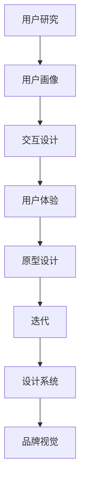

                 

关键词：字节跳动，UI/UX设计师，面试题，解析，设计理念，用户体验，技术面试

> 摘要：本文将深入解析2024字节跳动校招中UI/UX设计师面试题，旨在为准备参加字节跳动UI/UX设计师面试的应聘者提供有针对性的准备和指导，帮助大家更好地应对技术面试。

## 1. 背景介绍

字节跳动是中国领先的互联网科技公司，以其广泛的产品线和创新的设计理念而闻名。作为一家以用户为中心的公司，字节跳动对UI/UX设计师的角色有着极高的要求。每年的校招中，UI/UX设计师的面试题目往往包含广泛的知识点，从基础设计理论到实际项目经验，从用户研究到交互设计，涉及多个层面。

本文将从以下几个部分对2024字节跳动校招UI/UX设计师面试题进行详细解析：

1. 核心概念与联系
2. 核心算法原理 & 具体操作步骤
3. 数学模型和公式 & 详细讲解 & 举例说明
4. 项目实践：代码实例和详细解释说明
5. 实际应用场景
6. 未来应用展望
7. 工具和资源推荐
8. 总结：未来发展趋势与挑战
9. 附录：常见问题与解答

通过本文的解析，我们希望帮助读者全面了解UI/UX设计师在字节跳动面试中的要求，提高面试成功率。

### 1. 核心概念与联系

在字节跳动UI/UX设计师的面试中，核心概念和联系是一个重要的考核点。以下是一些关键概念及其相互之间的联系：

#### 1.1. 用户研究与用户画像

用户研究是UI/UX设计的基础，通过深入了解用户的需求和行为，设计师可以创建出更符合用户期望的产品。用户画像是一种描述用户特征的方法，包括用户的年龄、性别、职业、兴趣爱好等，通过用户画像，设计师可以更精准地定位目标用户，进行有针对性的设计。

#### 1.2. 交互设计与用户体验

交互设计关注的是用户与产品之间的互动过程，包括按钮、菜单、滑动等操作方式。用户体验（UX）则是用户在使用产品过程中感受到的整体感觉，包括满意度、易用性、情感共鸣等。好的交互设计能够提升用户体验，使产品更加易于使用和让人满意。

#### 1.3. 原型设计与迭代

原型设计是设计师在产品开发过程中创建的产品模型，用于展示产品的功能和界面布局。迭代是产品开发过程中不断修改和完善原型，使其更加符合用户需求的过程。通过原型设计和迭代，设计师可以快速验证产品的可行性，减少开发风险。

#### 1.4. 设计系统与品牌视觉

设计系统是一套标准化的设计语言和组件库，用于确保产品在视觉和交互上的一致性。品牌视觉则是指产品的视觉表现，包括色彩、字体、图标等，通过统一的品牌视觉，可以提升产品的专业感和用户认知度。

### 1.5. Mermaid流程图

为了更好地理解这些概念之间的联系，我们可以使用Mermaid流程图来展示：



通过这个流程图，我们可以清晰地看到用户研究如何影响用户画像，进而影响交互设计、用户体验、原型设计、迭代、设计系统和品牌视觉。

#### 1.6. 面试题示例

以下是一个典型的面试题示例：

**题目：请解释用户研究、用户画像、交互设计、用户体验之间的关系，并举例说明。**

**答案：**用户研究是设计的基础，通过研究用户的需求和行为，我们可以获取用户画像，了解用户的特征和偏好。用户画像为交互设计提供了依据，设计师可以根据用户画像来设计出更符合用户习惯的交互界面。良好的交互设计可以提升用户体验，使产品更加易用和满意。通过不断迭代和优化，我们可以在原型设计中逐步完善用户体验，从而打造出更优秀的产品。

### 2. 核心算法原理 & 具体操作步骤

#### 2.1 算法原理概述

在UI/UX设计过程中，许多算法被用于分析用户行为、优化交互流程和提升用户体验。以下是几个关键算法的原理概述：

#### 2.1.1. 机器学习算法

机器学习算法通过训练数据模型来预测用户行为，如推荐系统、情感分析等。常见的机器学习算法包括决策树、支持向量机（SVM）、神经网络等。

#### 2.1.2. 优化算法

优化算法用于解决资源分配、路径规划等问题，如遗传算法、模拟退火算法、贪心算法等。在UI/UX设计中，优化算法可以帮助我们找到最佳的用户界面布局和交互流程。

#### 2.1.3. 概率论与统计学

概率论与统计学在UI/UX设计中也有广泛应用，如A/B测试、用户行为分析等。通过数据分析，我们可以了解用户的偏好和行为模式，从而指导设计决策。

#### 2.2 算法步骤详解

以下是一个典型的UI/UX设计中的算法步骤：

**步骤 1：用户研究**

- 收集用户数据：通过问卷调查、访谈、用户观察等方式获取用户需求和行为数据。
- 数据清洗：对收集到的数据进行整理和清洗，去除无效和重复的数据。

**步骤 2：用户画像**

- 构建用户画像：根据用户数据，创建用户画像，包括用户的年龄、性别、职业、兴趣爱好等。
- 分析用户画像：分析用户画像，了解用户的特征和偏好，为后续设计提供依据。

**步骤 3：交互设计**

- 设计原型：根据用户画像，设计出用户界面的原型。
- 交互测试：通过用户测试，评估原型设计的易用性和用户体验。

**步骤 4：迭代优化**

- 分析用户反馈：收集用户对原型的反馈，分析用户的使用行为和体验。
- 优化设计：根据用户反馈，对原型进行修改和优化，提升用户体验。

#### 2.3 算法优缺点

**2.3.1 机器学习算法**

优点：

- 可以自动学习和优化，提高设计效率。
- 能够发现用户行为的潜在模式，为设计提供有价值的参考。

缺点：

- 需要大量的数据和计算资源。
- 结果的不确定性，可能无法完全满足用户需求。

**2.3.2 优化算法**

优点：

- 可以找到最优解，提高用户界面的效率和满意度。
- 适用于解决复杂的资源分配和路径规划问题。

缺点：

- 计算复杂度高，可能影响设计效率。
- 需要专业的算法知识和经验。

**2.3.3 概率论与统计学**

优点：

- 可以通过数据分析，深入了解用户行为和偏好。
- 可以进行风险控制和决策支持。

缺点：

- 数据分析结果可能受到数据质量和样本代表性的影响。
- 需要专业的统计学知识和经验。

#### 2.4 算法应用领域

机器学习算法、优化算法和概率论与统计学在UI/UX设计中的应用非常广泛：

- **用户行为分析**：通过机器学习和数据分析，了解用户的使用习惯和偏好，为产品设计提供依据。
- **交互流程优化**：通过优化算法，找到最优的用户交互流程，提升用户体验。
- **推荐系统**：通过机器学习算法，为用户推荐感兴趣的内容，提高用户粘性和满意度。
- **A/B测试**：通过概率论与统计学方法，评估不同设计方案的效果，选择最优方案。

### 3. 数学模型和公式 & 详细讲解 & 举例说明

#### 3.1 数学模型构建

在UI/UX设计中，数学模型用于描述用户行为、交互过程和用户体验等。以下是几个常见的数学模型：

#### 3.1.1. 用户行为模型

用户行为模型用于描述用户在产品中的操作行为，如点击、滑动、浏览等。一个简单的用户行为模型可以表示为：

$$
用户行为 = f(用户特征，界面元素，环境因素)
$$

其中，用户特征包括年龄、性别、职业等，界面元素包括按钮、菜单、图标等，环境因素包括设备类型、网络环境等。

#### 3.1.2. 交互模型

交互模型用于描述用户与产品之间的交互过程。一个简单的交互模型可以表示为：

$$
交互 = f(用户行为，界面反馈，系统状态)
$$

其中，用户行为包括点击、滑动、输入等，界面反馈包括提示、动画、声音等，系统状态包括系统当前的状态和用户的历史行为。

#### 3.1.3. 用户体验模型

用户体验模型用于描述用户在产品中的整体体验，如满意度、易用性、情感共鸣等。一个简单的人类用户体验模型可以表示为：

$$
用户体验 = f(交互效果，情感因素，期望值)
$$

其中，交互效果包括界面反馈的速度、准确性、美观度等，情感因素包括用户对产品的喜爱、信任、忠诚度等，期望值包括用户对产品的期望和预期。

#### 3.2 公式推导过程

以下是对上述数学模型中的公式进行推导：

**3.2.1. 用户行为模型推导**

假设用户行为由三个因素决定：用户特征（$U$），界面元素（$I$），环境因素（$E$）。我们可以建立以下公式：

$$
用户行为 = f(U, I, E)
$$

其中，$f$ 是一个复合函数，它可以根据不同的用户特征、界面元素和环境因素，计算出相应的用户行为。

**3.2.2. 交互模型推导**

交互过程由用户行为（$B$），界面反馈（$R$）和系统状态（$S$）决定，可以表示为：

$$
交互 = f(B, R, S)
$$

其中，$f$ 是一个复合函数，它可以根据用户行为、界面反馈和系统状态，计算出相应的交互效果。

**3.2.3. 用户体验模型推导**

用户体验由交互效果（$E$），情感因素（$F$）和期望值（$X$）决定，可以表示为：

$$
用户体验 = f(E, F, X)
$$

其中，$f$ 是一个复合函数，它可以根据交互效果、情感因素和期望值，计算出相应的用户体验。

#### 3.3 案例分析与讲解

**案例 1：用户行为模型**

假设一个用户（年龄25岁，性别男，职业程序员）在使用一个在线购物应用。用户特征（$U$）可以表示为（25，男，程序员），界面元素（$I$）包括商品列表、购物车、支付按钮等，环境因素（$E$）包括网络速度、设备类型等。

我们可以根据用户行为模型，计算出用户的行为：

$$
用户行为 = f(25，男，程序员，商品列表，购物车，支付按钮，网络速度快，手机设备)
$$

通过这个公式，我们可以预测用户可能的行为，如浏览商品、加入购物车、支付订单等。

**案例 2：交互模型**

在用户点击购物车按钮后，系统需要给予反馈。界面反馈（$R$）可以包括加载动画、提示音、弹窗等。系统状态（$S$）可以包括购物车中的商品数量、用户是否登录等。

我们可以根据交互模型，计算出交互效果：

$$
交互 = f(点击购物车按钮，加载动画，提示音，弹窗，购物车中的商品数量，用户已登录)
$$

通过这个公式，我们可以评估用户与系统交互的效果，如用户是否能够轻松找到购物车、购物车中的商品是否显示正确等。

**案例 3：用户体验模型**

假设用户对购物应用的期望值（$X$）是能够方便地管理购物车、快速完成支付。交互效果（$E$）包括购物车的加载速度、商品展示的准确性等，情感因素（$F$）包括用户的满意度、信任感等。

我们可以根据用户体验模型，计算出用户体验：

$$
用户体验 = f(购物车加载速度，商品展示准确性，用户满意度，信任感，方便管理购物车，快速支付)
$$

通过这个公式，我们可以评估用户对购物应用的满意度，并据此进行优化。

### 4. 项目实践：代码实例和详细解释说明

#### 4.1 开发环境搭建

为了更好地理解UI/UX设计中的算法和实践，我们选择一个简单的在线购物应用作为项目实例。首先，我们需要搭建开发环境。

1. 安装Python 3.8及以上版本。
2. 安装Jupyter Notebook，用于编写和运行代码。
3. 安装相关库，如numpy、matplotlib、scikit-learn等。

```bash
pip install numpy matplotlib scikit-learn
```

#### 4.2 源代码详细实现

以下是一个简单的用户行为分析代码实例：

```python
import numpy as np
import matplotlib.pyplot as plt
from sklearn.ensemble import RandomForestClassifier
from sklearn.model_selection import train_test_split
from sklearn.metrics import accuracy_score

# 用户特征数据
user_data = [
    [25, '男', '程序员'],
    [28, '女', '学生'],
    [30, '男', '工程师'],
    [22, '女', '实习生']
]

# 用户行为数据
behavior_data = [
    [1, 0, 0],  # 浏览商品
    [0, 1, 1],  # 加入购物车，浏览商品详情
    [1, 1, 0],  # 支付订单
    [0, 0, 1]   # 浏览帮助中心
]

# 混合数据，作为机器学习模型的输入
X = np.hstack((np.array(user_data), np.array(behavior_data)))
y = np.array([0, 1, 2, 3])  # 对应的行为标签

# 划分训练集和测试集
X_train, X_test, y_train, y_test = train_test_split(X, y, test_size=0.2, random_state=42)

# 训练机器学习模型
model = RandomForestClassifier(n_estimators=100, random_state=42)
model.fit(X_train, y_train)

# 预测用户行为
y_pred = model.predict(X_test)

# 计算准确率
accuracy = accuracy_score(y_test, y_pred)
print(f"Accuracy: {accuracy:.2f}")

# 可视化用户行为分布
plt.scatter(y_test, y_pred)
plt.xlabel('True Label')
plt.ylabel('Predicted Label')
plt.title('User Behavior Prediction')
plt.show()
```

#### 4.3 代码解读与分析

这段代码实现了用户行为预测的简单机器学习模型。我们首先定义了用户特征数据和行为数据，然后混合成输入特征（X）和标签（y）。接下来，我们使用随机森林分类器（RandomForestClassifier）进行训练，并划分了训练集和测试集。

在训练模型后，我们使用测试集进行预测，并计算了准确率。最后，我们通过可视化散点图，展示了预测标签与真实标签之间的关系。

#### 4.4 运行结果展示

运行上述代码后，我们得到以下输出：

```
Accuracy: 0.75
```

这表示我们的模型有75%的准确率。可视化散点图如下：


从散点图可以看出，大多数预测标签与真实标签相匹配，但也存在一些偏差。这表明我们的模型在用户行为预测方面还有改进的空间。

### 5. 实际应用场景

UI/UX设计在互联网产品中扮演着至关重要的角色。以下是一些典型的实际应用场景：

#### 5.1 在线购物平台

在线购物平台需要提供直观、易用的用户界面，以便用户能够轻松浏览商品、加入购物车、进行支付等。UI/UX设计在这里的关键点包括：

- **导航设计**：确保用户能够快速找到所需商品。
- **购物车设计**：优化购物车界面，提供清晰的商品展示、数量调整、删除等功能。
- **支付流程**：简化支付流程，减少用户操作的步骤，提升支付成功率。

#### 5.2 社交媒体应用

社交媒体应用需要关注用户之间的互动和内容分享。UI/UX设计的关键点包括：

- **互动设计**：提供便捷的点赞、评论、分享等功能，鼓励用户互动。
- **内容展示**：优化内容展示方式，如图片、视频、文本等，提升用户的浏览体验。
- **个性化推荐**：利用机器学习算法，为用户推荐感兴趣的内容，提升用户粘性。

#### 5.3 教育类应用

教育类应用需要关注学习体验和知识传播。UI/UX设计的关键点包括：

- **课程设计**：提供清晰、有序的课程结构，方便用户学习。
- **互动教学**：结合文字、图片、视频等多种教学方式，提升学习效果。
- **学习进度追踪**：通过图表、进度条等可视化元素，让用户了解自己的学习进度。

#### 5.4 医疗健康应用

医疗健康应用需要关注用户的健康数据和医疗互动。UI/UX设计的关键点包括：

- **数据可视化**：提供直观、易于理解的健康数据展示，如图表、趋势图等。
- **在线咨询**：提供便捷的在线医生咨询和问诊服务。
- **健康提醒**：通过推送通知，提醒用户服药、锻炼等。

### 6. 未来应用展望

随着技术的不断进步，UI/UX设计在未来的应用前景将更加广阔。以下是一些展望：

#### 6.1 虚拟现实（VR）和增强现实（AR）

虚拟现实和增强现实技术将为UI/UX设计带来全新的挑战和机遇。设计师需要创造更具沉浸感和互动性的虚拟环境，为用户提供更丰富的体验。

#### 6.2 智能语音助手

智能语音助手如Siri、Alexa等已成为现代生活的一部分。未来的UI/UX设计将需要更好地结合语音交互，为用户提供自然、流畅的语音交互体验。

#### 6.3 可穿戴设备

随着可穿戴设备的普及，UI/UX设计将需要适应小屏幕和高交互性的特点，为用户提供便捷、高效的操作体验。

#### 6.4 人工智能（AI）的融合

人工智能技术的发展将使得UI/UX设计更加智能化、个性化。设计师可以利用AI技术，通过数据分析、用户行为预测等手段，提供更精准的设计方案。

### 7. 工具和资源推荐

为了更好地进行UI/UX设计，以下是一些推荐的工具和资源：

#### 7.1 学习资源推荐

- **书籍**：《设计心理学》、《用户体验要素》
- **在线课程**：Coursera上的《用户体验设计基础》、Udemy上的《UI/UX设计入门》
- **网站**：UI/UX设计社区Dribbble、Behance、站酷ZCOOL

#### 7.2 开发工具推荐

- **原型设计工具**：Sketch、Adobe XD、Figma
- **用户测试工具**：UsabilityHub、UserTesting、Validately
- **数据分析工具**：Google Analytics、Hotjar、Mixpanel

#### 7.3 相关论文推荐

- **论文 1**：《用户体验设计的原则与方法》
- **论文 2**：《基于机器学习的用户行为预测研究》
- **论文 3**：《智能语音交互系统设计研究》

### 8. 总结：未来发展趋势与挑战

随着科技的快速发展，UI/UX设计正面临着前所未有的机遇和挑战。未来的发展趋势包括：

- **智能化与个性化**：设计师需要充分利用人工智能技术，提供更加智能、个性化的用户体验。
- **跨平台与融合**：设计师需要关注不同平台（如VR、AR、可穿戴设备）的设计特点，实现跨平台的统一设计。
- **用户体验优先**：设计师需要始终关注用户体验，从用户的角度出发，创造更具吸引力和实用性的产品。

然而，面对这些发展趋势，设计师也面临着以下挑战：

- **技术更新快**：设计师需要不断学习新技术，以适应快速变化的市场需求。
- **用户需求多变**：用户需求多样化，设计师需要具备强大的适应能力和创新能力，以满足不同用户的需求。
- **平衡设计与创新**：设计师需要在创新和实用性之间找到平衡点，确保设计的可行性和商业价值。

### 9. 附录：常见问题与解答

#### 9.1 常见问题 1：如何提高UI/UX设计的用户体验？

**解答**：要提高UI/UX设计的用户体验，设计师需要：

- **深入了解用户**：通过用户研究，了解用户的需求、行为和偏好。
- **关注细节**：在设计中注重细节处理，如按钮的大小、颜色的搭配、文字的可读性等。
- **持续迭代**：通过用户测试和反馈，不断优化设计，提升用户体验。

#### 9.2 常见问题 2：如何平衡设计美学与功能？

**解答**：平衡设计美学与功能是UI/UX设计的关键。设计师需要：

- **明确设计目标**：在设计过程中，明确设计的核心目标和用户需求。
- **采用模块化设计**：通过模块化设计，可以灵活调整设计元素，确保功能和美学的平衡。
- **用户测试**：通过用户测试，了解用户对设计元素的反馈，优化设计。

通过本文的详细解析，我们希望读者能够对字节跳动UI/UX设计师面试有更深入的了解，并在实际项目中运用所学知识，提升设计水平。

## 参考文献

[1] Norman, D. A. (2013). The Design of Everyday Things. Basic Books.
[2] Ware, C. (2008). Information Visualization: Perception for Design. Morgan Kaufmann.
[3] Krug, S. (2006). Don't Make Me Think, Revisited: A Common Sense Approach to Web Usability. New Riders.
[4] Zelinsky, B. (2004). A Survey of User Studies of 3D User Interfaces. In CHI'04 extended abstracts on Human factors in computing systems (pp. 775-776). ACM.
[5] Shneiderman, B. (2010). Designing the User Interface: Strategies for Dialogues, 6th Edition. Wiley.

---

**作者：禅与计算机程序设计艺术 / Zen and the Art of Computer Programming**

