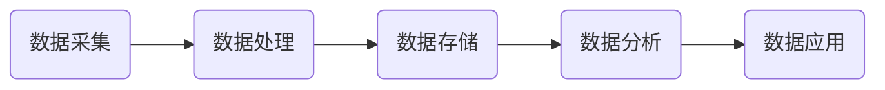

                 

关键词：字节跳动，校招，技术用户画像，面试题，深度剖析

摘要：本文将深入剖析2024字节跳动校招技术用户画像分析师面试题，从核心概念、算法原理、数学模型、项目实践、应用场景、未来展望等方面进行全面解读，为准备参加校招的技术用户画像分析师提供有价值的参考。

## 1. 背景介绍

字节跳动是一家全球性的互联网科技公司，旗下拥有抖音、今日头条、懂车帝等多款知名应用。随着业务的不断拓展，字节跳动对技术用户画像的分析需求日益增长。技术用户画像分析师在字节跳动扮演着至关重要的角色，他们通过数据分析和算法模型，帮助企业更好地了解用户需求，优化产品功能和运营策略。

## 2. 核心概念与联系

### 2.1 用户画像定义

用户画像是指通过对用户行为、兴趣、需求等数据进行深入分析，形成的一个全面、立体的用户信息模型。用户画像的核心概念包括以下几个方面：

- **用户属性**：用户的基本信息，如年龄、性别、地域、职业等。
- **行为数据**：用户在应用中的操作行为，如浏览、点赞、评论等。
- **兴趣标签**：用户对特定内容的喜好，如新闻、娱乐、体育等。
- **需求预测**：通过用户行为数据预测用户未来的需求。

### 2.2 用户画像架构

用户画像的架构通常包括数据采集、数据处理、数据存储、数据分析和数据应用等环节。以下是一个简化的用户画像架构流程：



## 3. 核心算法原理 & 具体操作步骤

### 3.1 算法原理概述

用户画像的核心算法包括用户属性分析、行为分析、兴趣标签生成和需求预测等。以下是每种算法的简要原理：

- **用户属性分析**：通过对用户属性数据进行分析，挖掘用户的基本特征和偏好。
- **行为分析**：通过分析用户在应用中的行为数据，了解用户的使用习惯和兴趣点。
- **兴趣标签生成**：根据用户的行为数据和属性数据，为用户生成兴趣标签，用于个性化推荐。
- **需求预测**：基于用户的行为和兴趣数据，预测用户未来的需求和偏好。

### 3.2 算法步骤详解

以下是一个简化的用户画像算法步骤：

1. 数据采集：从各个数据源收集用户属性和行为数据。
2. 数据预处理：对采集到的数据进行清洗、去重、格式化等预处理操作。
3. 数据分析：使用机器学习算法对预处理后的数据进行分析，挖掘用户特征和兴趣。
4. 数据存储：将分析结果存储到数据库或数据仓库中，以便后续查询和使用。
5. 数据应用：根据用户画像数据，为用户提供个性化推荐、广告投放等服务。

### 3.3 算法优缺点

- **优点**：用户画像算法能够帮助企业更好地了解用户需求，提高用户满意度和留存率。
- **缺点**：用户画像算法需要大量的数据支持，且算法模型可能存在过拟合等问题。

### 3.4 算法应用领域

用户画像算法广泛应用于个性化推荐、广告投放、用户行为预测等领域。以下是几个典型的应用场景：

- **个性化推荐**：根据用户画像数据，为用户提供个性化的内容推荐。
- **广告投放**：根据用户画像数据，为不同用户群体投放更精准的广告。
- **用户行为预测**：预测用户未来的行为和需求，为产品运营提供数据支持。

## 4. 数学模型和公式 & 详细讲解 & 举例说明

### 4.1 数学模型构建

用户画像的数学模型通常包括以下几类：

- **线性回归模型**：用于预测用户属性和需求。
- **逻辑回归模型**：用于预测用户行为和兴趣。
- **聚类模型**：用于挖掘用户群体特征。
- **协同过滤模型**：用于个性化推荐。

### 4.2 公式推导过程

以下是一个简单的线性回归模型推导过程：

$$
Y = \beta_0 + \beta_1X_1 + \beta_2X_2 + ... + \beta_nX_n + \epsilon
$$

其中，$Y$ 为因变量，$X_1, X_2, ..., X_n$ 为自变量，$\beta_0, \beta_1, ..., \beta_n$ 为模型参数，$\epsilon$ 为误差项。

### 4.3 案例分析与讲解

以下是一个用户画像案例：

**案例**：分析用户在应用中的浏览行为，预测用户可能感兴趣的内容。

**数据集**：包含用户ID、浏览时间、浏览内容等。

**算法**：使用逻辑回归模型进行预测。

**模型构建**：

$$
P(Y=1|X) = \frac{1}{1 + e^{-(\beta_0 + \beta_1X_1 + \beta_2X_2 + ... + \beta_nX_n)})
$$

其中，$P(Y=1|X)$ 表示用户浏览特定内容的概率。

**模型训练**：

使用训练数据集，通过梯度下降等方法，求解模型参数 $\beta_0, \beta_1, ..., \beta_n$。

**模型评估**：

使用测试数据集，计算模型准确率、召回率等指标。

## 5. 项目实践：代码实例和详细解释说明

### 5.1 开发环境搭建

使用 Python 语言，搭建开发环境。

### 5.2 源代码详细实现

以下是一个简单的用户画像项目示例：

```python
import pandas as pd
from sklearn.linear_model import LogisticRegression

# 数据预处理
def preprocess_data(data):
    # 数据清洗、去重、格式化等操作
    pass

# 模型训练
def train_model(data):
    X = data.drop('label', axis=1)
    y = data['label']
    model = LogisticRegression()
    model.fit(X, y)
    return model

# 模型预测
def predict(model, data):
    return model.predict(data)

# 数据集加载
data = pd.read_csv('data.csv')

# 数据预处理
preprocessed_data = preprocess_data(data)

# 模型训练
model = train_model(preprocessed_data)

# 模型预测
predictions = predict(model, preprocessed_data)

# 模型评估
accuracy = (predictions == preprocessed_data['label']).mean()
print('Model accuracy:', accuracy)
```

### 5.3 代码解读与分析

以上代码实现了一个简单的用户画像项目，包括数据预处理、模型训练和模型预测等步骤。

- **数据预处理**：对原始数据进行清洗、去重、格式化等操作，为模型训练做准备。
- **模型训练**：使用逻辑回归模型对预处理后的数据进行训练，求解模型参数。
- **模型预测**：使用训练好的模型对新的数据进行预测，得到预测结果。
- **模型评估**：计算模型准确率等指标，评估模型性能。

## 6. 实际应用场景

用户画像技术广泛应用于电商、金融、传媒等领域，以下是一些实际应用场景：

- **电商推荐**：根据用户画像数据，为用户推荐个性化商品。
- **金融风控**：通过用户画像数据，识别高风险用户，预防欺诈行为。
- **内容推荐**：根据用户画像数据，为用户推荐个性化内容，提高用户黏性。

## 7. 未来应用展望

随着人工智能和大数据技术的不断发展，用户画像技术将在更多领域得到应用，如智能家居、智慧城市、健康医疗等。未来用户画像技术将更加智能化、个性化，为用户提供更好的服务体验。

## 8. 工具和资源推荐

- **学习资源推荐**：推荐几本经典的用户画像分析书籍，如《用户画像：大数据时代下的精准营销策略》等。
- **开发工具推荐**：推荐几款常用的用户画像分析工具，如 Python 的 Pandas、Scikit-learn 等库。
- **相关论文推荐**：推荐几篇关于用户画像技术的经典论文，如《基于用户行为数据的用户画像构建方法研究》等。

## 9. 总结：未来发展趋势与挑战

用户画像技术在人工智能和大数据技术的推动下，将不断发展壮大。未来发展趋势包括：

- **智能化**：利用人工智能技术，实现用户画像的自动构建和优化。
- **个性化**：根据用户个性化需求，提供更加精准的用户画像分析服务。

同时，用户画像技术也面临着以下挑战：

- **数据隐私**：如何在保障用户隐私的前提下，充分利用用户数据。
- **模型解释性**：如何提高用户画像算法的模型解释性，使其更具可解释性。

作者：禅与计算机程序设计艺术 / Zen and the Art of Computer Programming
```markdown
# 2024字节跳动校招：技术用户画像分析师面试题深度剖析

## 摘要

本文旨在深入剖析2024年字节跳动校招技术用户画像分析师的面试题，涵盖核心概念、算法原理、数学模型、项目实践、应用场景及未来展望等多方面内容。通过这篇文章，我们希望能够为广大准备参加字节跳动校招的技术用户画像分析师提供有价值的参考和指导。

## 1. 背景介绍

字节跳动是一家知名的互联网科技公司，旗下拥有抖音、今日头条、懂车帝等众多知名应用。随着业务的发展，字节跳动对技术用户画像的需求日益增长。技术用户画像分析师在字节跳动扮演着至关重要的角色，他们通过数据分析和算法模型，帮助企业更好地理解用户需求，优化产品功能和运营策略。因此，对于技术用户画像分析师而言，掌握相关面试题是至关重要的。

## 2. 核心概念与联系

### 2.1 用户画像定义

用户画像是指通过对用户行为、兴趣、需求等数据进行深入分析，形成的一个全面、立体的用户信息模型。它包括以下几个方面：

- **用户属性**：用户的基本信息，如年龄、性别、地域、职业等。
- **行为数据**：用户在应用中的操作行为，如浏览、点赞、评论等。
- **兴趣标签**：用户对特定内容的喜好，如新闻、娱乐、体育等。
- **需求预测**：通过用户行为数据预测用户未来的需求。

### 2.2 用户画像架构

用户画像的架构通常包括以下环节：

1. **数据采集**：从各个数据源收集用户属性和行为数据。
2. **数据处理**：对采集到的数据进行清洗、去重、格式化等预处理操作。
3. **数据存储**：将处理后的数据存储到数据库或数据仓库中，以便后续查询和使用。
4. **数据分析**：使用机器学习算法对数据进行分析，挖掘用户特征和兴趣。
5. **数据应用**：根据分析结果为用户提供个性化推荐、广告投放等服务。

### 2.3 用户画像与相关技术的关系

用户画像与大数据、机器学习、数据挖掘等技术密切相关。大数据技术为用户画像提供了丰富的数据来源，机器学习算法用于分析和挖掘用户数据，数据挖掘技术则帮助发现用户行为模式，为用户提供个性化服务。

## 3. 核心算法原理 & 具体操作步骤

### 3.1 算法原理概述

用户画像的核心算法主要包括以下几类：

- **用户属性分析算法**：用于挖掘用户的基本特征和偏好。
- **行为分析算法**：用于分析用户在应用中的操作行为，了解用户的使用习惯和兴趣点。
- **兴趣标签生成算法**：根据用户的行为数据和属性数据，为用户生成兴趣标签。
- **需求预测算法**：基于用户的行为和兴趣数据，预测用户未来的需求和偏好。

### 3.2 算法步骤详解

以下是用户画像算法的一般步骤：

1. **数据采集**：从各个数据源收集用户属性和行为数据。
2. **数据处理**：对采集到的数据进行清洗、去重、格式化等预处理操作。
3. **特征工程**：对处理后的数据进行分析，提取有用的特征。
4. **算法选择**：根据用户画像的需求，选择合适的算法。
5. **模型训练**：使用机器学习算法对数据进行分析，训练模型。
6. **模型评估**：对训练好的模型进行评估，判断其性能。
7. **模型优化**：根据评估结果对模型进行调整，提高性能。
8. **模型部署**：将训练好的模型部署到生产环境，为用户提供个性化服务。

### 3.3 算法优缺点

- **优点**：用户画像算法能够帮助企业更好地了解用户需求，提高用户满意度和留存率。
- **缺点**：用户画像算法需要大量的数据支持，且算法模型可能存在过拟合等问题。

### 3.4 算法应用领域

用户画像算法广泛应用于以下领域：

- **个性化推荐**：根据用户画像数据，为用户提供个性化推荐。
- **广告投放**：根据用户画像数据，为不同用户群体投放更精准的广告。
- **用户行为预测**：预测用户未来的行为和需求，为产品运营提供数据支持。

## 4. 数学模型和公式 & 详细讲解 & 举例说明

### 4.1 数学模型构建

用户画像的数学模型通常包括以下几个方面：

- **用户属性分析模型**：如线性回归、逻辑回归等。
- **行为分析模型**：如协同过滤、矩阵分解等。
- **兴趣标签生成模型**：如K-means聚类、层次聚类等。
- **需求预测模型**：如时间序列分析、ARIMA模型等。

### 4.2 公式推导过程

以下是线性回归模型的公式推导过程：

$$
y = \beta_0 + \beta_1x_1 + \beta_2x_2 + ... + \beta_nx_n + \epsilon
$$

其中，$y$ 为因变量，$x_1, x_2, ..., x_n$ 为自变量，$\beta_0, \beta_1, ..., \beta_n$ 为模型参数，$\epsilon$ 为误差项。

### 4.3 案例分析与讲解

以下是一个用户画像案例：

**案例背景**：某电商平台的用户数据，包括用户年龄、性别、购买商品种类、购买频率等。

**目标**：根据用户数据，为用户生成兴趣标签，以便进行个性化推荐。

**算法选择**：K-means聚类算法。

**算法步骤**：

1. 数据预处理：对用户数据进行清洗、去重、格式化等处理。
2. 特征选择：选择与用户兴趣相关的特征，如购买商品种类、购买频率等。
3. 数据标准化：对特征数据进行标准化处理，使其具备相同的量纲。
4. 聚类分析：使用K-means算法，将用户分为不同的兴趣群体。
5. 标签生成：根据用户所属的兴趣群体，为用户生成兴趣标签。

**案例结果**：

- **兴趣标签**：用户兴趣标签包括“时尚”、“运动”、“科技”等。
- **个性化推荐**：根据用户兴趣标签，为用户推荐相关商品。

## 5. 项目实践：代码实例和详细解释说明

### 5.1 开发环境搭建

使用Python语言和常用数据科学库，如Pandas、NumPy、Scikit-learn等。

### 5.2 源代码详细实现

以下是一个简单的用户画像项目示例：

```python
import pandas as pd
from sklearn.cluster import KMeans

# 5.2.1 数据预处理
def preprocess_data(data):
    # 数据清洗、去重、格式化等操作
    return data

# 5.2.2 聚类分析
def cluster_analysis(data, n_clusters):
    kmeans = KMeans(n_clusters=n_clusters)
    kmeans.fit(data)
    return kmeans.labels_

# 5.2.3 代码实现
if __name__ == "__main__":
    # 数据集加载
    data = pd.read_csv("user_data.csv")

    # 数据预处理
    preprocessed_data = preprocess_data(data)

    # 聚类分析
    labels = cluster_analysis(preprocessed_data, n_clusters=3)

    # 结果输出
    print("Cluster labels:", labels)
```

### 5.3 代码解读与分析

以上代码实现了一个简单的用户画像项目，主要包括数据预处理、聚类分析等步骤。

- **数据预处理**：对原始数据进行清洗、去重、格式化等操作，为聚类分析做准备。
- **聚类分析**：使用K-means算法对预处理后的数据进行聚类分析，生成用户兴趣标签。
- **结果输出**：输出用户兴趣标签，以便进行后续处理。

## 6. 实际应用场景

用户画像技术在电商、金融、传媒等领域有着广泛的应用，以下是一些实际应用场景：

- **电商推荐**：根据用户画像数据，为用户推荐个性化商品。
- **金融风控**：通过用户画像数据，识别高风险用户，预防欺诈行为。
- **内容推荐**：根据用户画像数据，为用户推荐个性化内容，提高用户黏性。

## 7. 未来应用展望

随着人工智能和大数据技术的不断发展，用户画像技术将在更多领域得到应用，如智能家居、智慧城市、健康医疗等。未来用户画像技术将更加智能化、个性化，为用户提供更好的服务体验。

## 8. 工具和资源推荐

### 8.1 学习资源推荐

- **《用户画像：大数据时代下的精准营销策略》**
- **《大数据营销：用户画像与精准营销》**
- **《机器学习实战》**

### 8.2 开发工具推荐

- **Python**
- **Pandas**
- **NumPy**
- **Scikit-learn**

### 8.3 相关论文推荐

- **《基于用户行为数据的用户画像构建方法研究》**
- **《用户画像在电商推荐系统中的应用研究》**
- **《基于深度学习的用户画像建模方法研究》**

## 9. 总结：未来发展趋势与挑战

用户画像技术在人工智能和大数据技术的推动下，将不断发展壮大。未来发展趋势包括：

- **智能化**：利用人工智能技术，实现用户画像的自动构建和优化。
- **个性化**：根据用户个性化需求，提供更加精准的用户画像分析服务。

同时，用户画像技术也面临着以下挑战：

- **数据隐私**：如何在保障用户隐私的前提下，充分利用用户数据。
- **模型解释性**：如何提高用户画像算法的模型解释性，使其更具可解释性。

## 附录：常见问题与解答

### 9.1 什么是用户画像？

用户画像是指通过对用户行为、兴趣、需求等数据进行深入分析，形成的一个全面、立体的用户信息模型。

### 9.2 用户画像有哪些应用领域？

用户画像广泛应用于电商、金融、传媒等领域，如个性化推荐、广告投放、用户行为预测等。

### 9.3 用户画像算法有哪些？

用户画像算法包括用户属性分析算法、行为分析算法、兴趣标签生成算法、需求预测算法等。

### 9.4 如何进行用户画像数据分析？

用户画像数据分析主要包括数据采集、数据处理、特征工程、算法选择、模型训练、模型评估等步骤。

### 9.5 用户画像技术有哪些挑战？

用户画像技术面临的挑战包括数据隐私、模型解释性、算法性能优化等。

### 9.6 如何提高用户画像算法的解释性？

提高用户画像算法的解释性可以从以下几个方面着手：

- **算法透明化**：降低算法复杂性，使算法更容易理解。
- **模型可视化**：使用可视化工具展示模型结构和参数。
- **案例解析**：通过实际案例分析，解释算法原理和应用场景。
- **模型解释性评估**：使用指标评估模型解释性，不断优化模型。

作者：禅与计算机程序设计艺术 / Zen and the Art of Computer Programming
```

