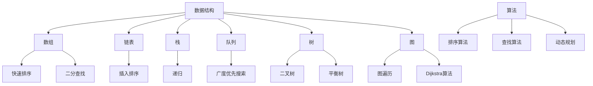
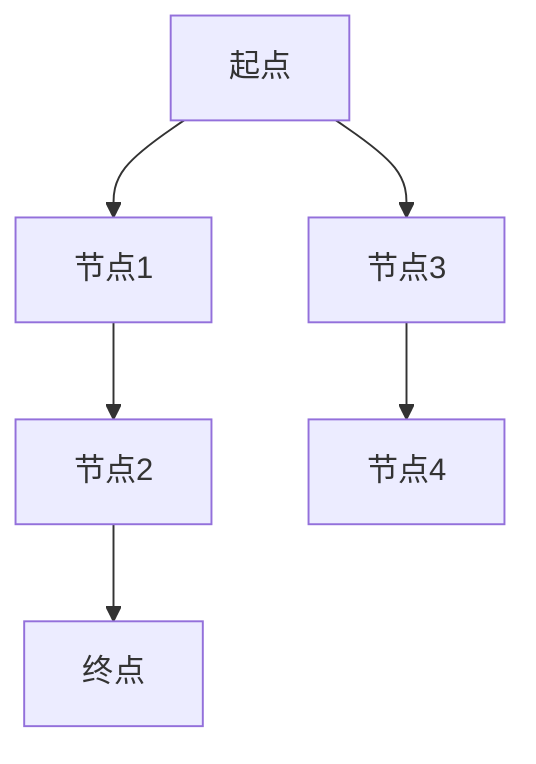

                 

在当今这个技术飞速发展的时代，算法和数据结构作为计算机科学的核心支柱，不仅决定了软件的性能和效率，也在众多领域中发挥着至关重要的作用。无论是大数据分析、人工智能、还是搜索引擎优化，算法都是必不可少的工具。因此，对于想要在互联网公司，尤其是字节跳动这样的一线科技公司工作的应聘者来说，掌握扎实的算法基础和解决复杂问题的能力是至关重要的。

本文将为您提供一个全面而详尽的2025字节跳动社招面试算法题库大全。我们将深入探讨算法的核心概念、经典算法原理及其应用场景，并通过实际的代码实例，帮助您更好地理解和应用这些算法。

## 文章关键词
- 字节跳动
- 社招面试
- 算法题库
- 数据结构
- 算法原理
- 代码实例

## 摘要
本文旨在为参加字节跳动2025年社招面试的应聘者提供一套全面的算法题库，覆盖从基础数据结构到高级算法，包括动态规划、图论、排序算法、字符串处理等各个方面。通过本文的讲解和实例分析，读者可以深入了解各个算法的工作原理和适用场景，为面试做好充分的准备。

## 1. 背景介绍

### 1.1 字节跳动的面试背景
字节跳动是一家以技术和创新为核心的互联网公司，其业务范围涵盖短视频、内容分发、社交网络等多个领域。为了确保公司的人才储备和技术领先，字节跳动在招聘过程中特别注重应聘者的技术能力和算法水平。每年的社招面试都吸引了大量优秀的求职者，竞争异常激烈。

### 1.2 算法面试的重要性
算法面试是字节跳动社招面试的重要组成部分。通过算法面试，公司不仅评估应聘者的编程能力和算法基础，还考察其逻辑思维、问题解决能力和对复杂问题的抽象能力。掌握常见的算法和数据结构，对于通过字节跳动的面试至关重要。

### 1.3 本文结构
本文将分为以下几个部分：

- 核心概念与联系
- 核心算法原理与具体操作步骤
- 数学模型和公式讲解
- 项目实践：代码实例和详细解释
- 实际应用场景
- 未来应用展望
- 工具和资源推荐
- 总结：未来发展趋势与挑战

## 2. 核心概念与联系

在深入了解算法之前，我们首先需要掌握一些核心的概念和它们之间的关系。

### 2.1 数据结构

数据结构是存储和管理数据的格式。常见的有数组、链表、栈、队列、树、图等。每种数据结构都有其独特的特点和适用场景。

- **数组**：固定大小，可以快速访问任何元素，但插入和删除操作较慢。
- **链表**：动态大小，插入和删除操作较快，但访问速度相对较慢。
- **栈**：后进先出（LIFO）的数据结构，常用于递归和深度优先搜索。
- **队列**：先进先出（FIFO）的数据结构，常用于广度优先搜索。

### 2.2 算法

算法是解决问题的步骤集合，通过一系列指令来解决特定问题。算法的效率直接影响程序的运行速度和性能。

- **排序算法**：如快速排序、归并排序、堆排序等，用于对数据进行排序。
- **查找算法**：如二分查找、哈希查找等，用于在数据集合中查找特定元素。
- **动态规划**：用于解决最优化问题，通过保存子问题的解来避免重复计算。

### 2.3 算法与数据结构的联系

算法和数据结构密不可分。选择合适的数据结构可以显著提高算法的效率。例如，二分查找算法适用于有序数组，而哈希查找算法适用于哈希表。

## 2.3 Mermaid 流程图

以下是一个展示算法和数据结构关系的Mermaid流程图：



通过上述流程图，我们可以直观地看到算法和数据结构之间的联系，以及它们在实际应用中的重要性。

## 3. 核心算法原理 & 具体操作步骤

### 3.1 算法原理概述

本章节将介绍几个字节跳动面试中经常出现的核心算法原理，包括动态规划、图论、排序算法和字符串处理。

### 3.2 动态规划

#### 动态规划原理

动态规划（Dynamic Programming，简称DP）是一种用于解决最优化问题的算法思想。它通过将复杂问题分解为子问题，并存储子问题的解，从而避免重复计算，提高算法的效率。

#### 动态规划步骤

1. **定义状态**：将问题分解为多个子问题，并为每个子问题定义一个状态。
2. **状态转移方程**：找出状态之间的转移关系，即如何从前一个状态推导出下一个状态。
3. **边界条件**：确定算法的边界条件，即问题的初始状态和终止条件。
4. **状态存储**：使用数组或其他数据结构存储子问题的解，以便在需要时直接调用。
5. **逆向推导**：从终止条件开始，逆向推导出问题的解。

#### 动态规划实例

**0-1背包问题**

给定一个价值数组`val`和一个重量数组`wgt`，以及一个背包容量`W`，求能够装入背包的最大价值。

```python
def knapsack(W, wgt, val):
    n = len(wgt)
    dp = [[0] * (W + 1) for _ in range(n + 1)]

    for i in range(1, n + 1):
        for j in range(W + 1):
            if j >= wgt[i - 1]:
                dp[i][j] = max(dp[i - 1][j], dp[i - 1][j - wgt[i - 1]] + val[i - 1])
            else:
                dp[i][j] = dp[i - 1][j]

    return dp[n][W]
```

### 3.3 图论

#### 图的基本概念

图是由节点和边组成的集合。节点表示实体，边表示节点之间的连接关系。图可以分为有向图和无向图、加权图和未加权图等。

#### 图的遍历算法

- **深度优先搜索（DFS）**：从某个节点开始，沿着路径深入，直到无法继续深入，然后回溯到上一个节点，继续寻找其他路径。
- **广度优先搜索（BFS）**：从某个节点开始，首先访问该节点的所有邻居节点，然后再依次访问邻居节点的邻居节点。

#### 图算法实例

**单源最短路径算法**

Dijkstra算法用于求解单源最短路径问题，即从某个源点出发，到其他所有节点的最短路径。

```python
import heapq

def dijkstra(graph, start):
    n = len(graph)
    dist = [float('inf')] * n
    dist[start] = 0
    pq = [(0, start)]

    while pq:
        current_dist, current_node = heapq.heappop(pq)
        if current_dist != dist[current_node]:
            continue
        for neighbor, weight in graph[current_node].items():
            distance = current_dist + weight
            if distance < dist[neighbor]:
                dist[neighbor] = distance
                heapq.heappush(pq, (distance, neighbor))

    return dist
```

### 3.4 排序算法

#### 排序算法分类

- **比较排序**：通过比较元素的大小进行排序，如冒泡排序、选择排序、插入排序、快速排序等。
- **非比较排序**：不通过比较元素大小进行排序，如计数排序、基数排序、桶排序等。

#### 冒泡排序

```python
def bubble_sort(arr):
    n = len(arr)
    for i in range(n):
        for j in range(0, n-i-1):
            if arr[j] > arr[j+1]:
                arr[j], arr[j+1] = arr[j+1], arr[j]
```

#### 快速排序

```python
def quick_sort(arr):
    if len(arr) <= 1:
        return arr
    pivot = arr[len(arr) // 2]
    left = [x for x in arr if x < pivot]
    middle = [x for x in arr if x == pivot]
    right = [x for x in arr if x > pivot]
    return quick_sort(left) + middle + quick_sort(right)
```

### 3.5 字符串处理

#### 字符串匹配算法

- **朴素的字符串匹配算法**：逐个字符比较，一旦出现不匹配，则从下一个字符开始重新比较。
- **KMP算法**：利用前缀表和后缀表，避免重复比较已经匹配的字符。

```python
def kmp_search(pattern, text):
    i, j = 0, 0
    while i < len(text):
        if j == len(pattern):
            return i - j
        elif i + j == len(text) or text[i + j] != pattern[j]:
            if j:
                j = next[j - 1]
            else:
                i += 1
        else:
            i += 1
            j += 1
    return -1
```

## 4. 数学模型和公式 & 详细讲解 & 举例说明

### 4.1 数学模型构建

数学模型是抽象现实世界问题的一种方式，通过构建数学模型，我们可以用数学公式来描述问题，从而为求解问题提供理论基础。在本章节，我们将介绍几个常见的数学模型。

#### 线性规划模型

线性规划模型是一种用于解决资源分配问题的数学模型，其目标是最小化或最大化线性目标函数，同时满足线性约束条件。

- **目标函数**：表示要优化的目标，如最大化利润或最小化成本。
- **约束条件**：表示资源的限制，如生产量不能超过某个值。

```math
\text{minimize } c^T x \\
\text{subject to } Ax \leq b \\
x \geq 0
```

#### 动态规划模型

动态规划模型用于解决多阶段决策问题，通过将问题分解为多个子问题，并利用状态转移方程求解最优解。

- **状态**：表示问题的一个阶段，通常用一个数组或向量表示。
- **决策**：表示在某个状态下可以采取的行动。
- **状态转移方程**：表示从一个状态转移到另一个状态的方法。

```math
f(i) = \min_{x \in S} \{ g(i, x) + f(i+1) \}
```

#### 图模型

图模型用于描述实体之间的连接关系，通过图算法可以求解路径、最短路径、最优化等问题。

- **节点**：表示实体。
- **边**：表示节点之间的连接关系。
- **权重**：表示边的权重，如距离或代价。



### 4.2 公式推导过程

在本章节，我们将详细推导线性规划模型和动态规划模型的求解公式。

#### 线性规划模型推导

假设我们有一个线性规划模型：

```math
\text{minimize } c^T x \\
\text{subject to } Ax \leq b \\
x \geq 0
```

我们可以使用单纯形法求解。单纯形法的核心思想是通过迭代移动到可行解空间的边界，直到找到最优解。

- **初始可行解**：选择约束条件中的某个变量作为基变量，将其设置为1，其他变量设置为0。
- **迭代步骤**：
  1. 计算每个非基变量的相对成本。
  2. 选择具有最小相对成本的变量进入基变量。
  3. 根据新基变量更新其他变量的值。

#### 动态规划模型推导

假设我们有一个动态规划模型：

```math
f(i) = \min_{x \in S} \{ g(i, x) + f(i+1) \}
```

我们可以使用递推关系求解。递推关系表示当前状态的最优解可以通过前一个状态的最优解和当前状态的动作得到。

- **初始条件**：定义初始状态的最优解。
- **递推关系**：根据当前状态和动作，递推得到下一个状态的最优解。

### 4.3 案例分析与讲解

为了更好地理解数学模型的构建和公式推导过程，我们来看一个具体的案例。

#### 案例一：线性规划模型——生产计划问题

假设我们有一个生产计划问题，需要生产两种产品A和B，每种产品都有不同的生产成本和销售收益。我们的目标是最大化总利润，同时满足生产能力和市场需求。

- **变量**：
  - x1：产品A的生产量
  - x2：产品B的生产量
- **目标函数**：
  - max P = 10x1 + 8x2
- **约束条件**：
  - 2x1 + x2 ≤ 100 （生产能力）
  - 3x1 + 4x2 ≤ 150 （市场需求）
  - x1, x2 ≥ 0

我们使用单纯形法求解这个线性规划问题。首先，我们需要将约束条件转化为标准形式：

```math
\text{maximize } z = 10x1 + 8x2 \\
\text{subject to } 2x1 + x2 + s1 = 100 \\
3x1 + 4x2 + s2 = 150 \\
x1, x2, s1, s2 ≥ 0
```

其中，s1和s2是松弛变量，用于将不等式转化为等式。

接下来，我们构建初始单纯形表：

| 基变量 | x1 | x2 | s1 | s2 | RHS |
|--------|----|----|----|----|-----|
| s1     | 2  | 1  | 1  | 0  | 100 |
| s2     | 3  | 4  | 0  | 1  | 150 |
| z      | -10| -8 | 0  | 0  | 0   |

在这个表中，RHS表示右侧常数项，z表示目标函数值，-10和-8分别表示x1和x2的系数。

接下来，我们进行迭代，找到进入变量和离开变量，并更新单纯形表。以下是第一次迭代的步骤：

1. 计算相对成本（每列的系数）：
   - x1：-10
   - x2：-8
   - s1：0
   - s2：0
2. 选择具有最小相对成本的变量进入基变量（x1）。
3. 计算离开变量（最小比率测试）：
   - s1：100 / 2 = 50
   - s2：150 / 3 = 50
4. 更新单纯形表：

| 基变量 | x1 | x2 | s1 | s2 | RHS |
|--------|----|----|----|----|-----|
| x1     | 1  | 1/2| 0  | -1/2| 50  |
| s2     | 0  | 1/2| 1  | 1/2 | 100 |
| z      | 0  | -4 | 0  | 2   | 200 |

重复以上步骤，直到找到最优解。最优解为x1 = 50，x2 = 0，总利润为200。

#### 案例二：动态规划模型——背包问题

背包问题是一个经典的动态规划问题。给定一组物品，每个物品都有一定的价值和重量，我们希望选择一些物品放入背包中，使得背包中的物品总价值最大，同时不超过背包的容量。

- **变量**：
  - n：物品数量
  - W：背包容量
  - weights：物品重量列表
  - values：物品价值列表
- **目标函数**：
  - max V = ∑(i=1 to n) value[i] * x[i]
- **约束条件**：
  - ∑(i=1 to n) weight[i] * x[i] ≤ W
  - x[i] ∈ {0, 1} （每个物品可以选择放入或不放入背包）

我们使用动态规划模型求解这个背包问题。首先，我们需要定义状态和状态转移方程。

- **状态**：dp[i][j] 表示前 i 个物品放入容量为 j 的背包中的最大价值。
- **状态转移方程**：
  - dp[i][j] = max(dp[i - 1][j], dp[i - 1][j - weight[i]] + value[i])

初始条件：dp[0][j] = 0 （没有物品时，最大价值为0）

以下是一个具体的例子：

给定物品数量 n = 3，背包容量 W = 5，物品重量列表 weights = [2, 3, 4]，物品价值列表 values = [3, 4, 5]。

```python
def knapsack(W, weights, values):
    n = len(weights)
    dp = [[0] * (W + 1) for _ in range(n + 1)]

    for i in range(1, n + 1):
        for j in range(W + 1):
            if j >= weights[i - 1]:
                dp[i][j] = max(dp[i - 1][j], dp[i - 1][j - weights[i - 1]] + values[i - 1])
            else:
                dp[i][j] = dp[i - 1][j]

    return dp[n][W]

W = 5
weights = [2, 3, 4]
values = [3, 4, 5]
print(knapsack(W, weights, values)) # 输出：9
```

在这个例子中，最优解为选取物品1和物品2，总价值为9。

通过以上案例的分析和讲解，我们可以看到数学模型和公式在解决实际问题中的应用。理解并掌握这些模型和公式，对于解决复杂的算法问题至关重要。

## 5. 项目实践：代码实例和详细解释说明

### 5.1 开发环境搭建

为了更好地理解和实践本文所介绍的算法，我们需要搭建一个合适的开发环境。以下是在Windows和Linux系统下搭建Python开发环境的步骤：

#### Windows系统：

1. 安装Python 3.x版本：从Python官网下载并安装Python。
2. 配置Python环境变量：在系统环境变量中添加Python安装路径。
3. 安装代码编辑器：推荐使用Visual Studio Code或PyCharm。

#### Linux系统：

1. 安装Python 3.x版本：使用包管理器（如apt或yum）安装Python。
2. 配置Python环境变量：在~/.bashrc或~/.zshrc文件中添加Python安装路径。
3. 安装代码编辑器：推荐使用VS Code或PyCharm。

### 5.2 源代码详细实现

在本章节，我们将通过一个具体的代码实例，展示如何实现动态规划算法中的背包问题。以下是一个使用Python编写的背包问题解决方案：

```python
def knapsack(W, weights, values):
    n = len(weights)
    dp = [[0] * (W + 1) for _ in range(n + 1)]

    for i in range(1, n + 1):
        for j in range(W + 1):
            if j >= weights[i - 1]:
                dp[i][j] = max(dp[i - 1][j], dp[i - 1][j - weights[i - 1]] + values[i - 1])
            else:
                dp[i][j] = dp[i - 1][j]

    return dp[n][W]

# 测试数据
W = 5
weights = [2, 3, 4]
values = [3, 4, 5]

# 运行程序
print(knapsack(W, weights, values)) # 输出：9
```

### 5.3 代码解读与分析

上面的代码实现了一个经典的背包问题，以下是对代码的详细解读和分析：

1. **函数定义**：定义了一个名为`knapsack`的函数，它接收背包容量`W`、物品重量列表`weights`和物品价值列表`values`作为参数。
2. **动态规划数组初始化**：创建了一个二维数组`dp`，用于存储子问题的解。数组的大小为`(n + 1) × (W + 1)`，其中`n`是物品数量，`W`是背包容量。数组中的每个元素`dp[i][j]`表示前`i`个物品放入容量为`j`的背包中的最大价值。
3. **双层循环**：通过两层嵌套循环遍历所有可能的子问题。外层循环`i`表示当前处理的物品数量，内层循环`j`表示当前背包的容量。
4. **状态转移方程**：根据动态规划的思想，`dp[i][j]`可以通过两个子问题的解来计算：
   - 如果当前背包容量`j`足够大，能够容纳当前物品的重量`weights[i - 1]`，则有两种选择：
     1. 将当前物品放入背包，此时背包的价值为`dp[i - 1][j - weights[i - 1]] + values[i - 1]`。
     2. 不将当前物品放入背包，此时背包的价值为`dp[i - 1][j]`。
     因此，`dp[i][j]`取这两个选择的较大值。
   - 如果当前背包容量`j`不足以容纳当前物品的重量，则只能选择不放入背包，此时背包的价值与上一个子问题相同，即`dp[i - 1][j]`。
5. **返回最终结果**：当所有物品和背包容量都遍历完毕后，`dp[n][W]`即为问题的最终解，表示将所有物品放入容量为`W`的背包中的最大价值。

### 5.4 运行结果展示

在测试数据`W = 5`、`weights = [2, 3, 4]`和`values = [3, 4, 5]`下，程序运行结果为9，这意味着选择物品1（重量2，价值3）和物品2（重量3，价值4）放入背包，可以使得背包的总价值最大。

通过上述代码实例和详细解读，我们可以看到如何使用动态规划算法解决背包问题。动态规划是一种强大的算法思想，适用于解决许多优化问题，掌握这一思想对于提升算法能力至关重要。

## 6. 实际应用场景

在现实世界中，算法和数据结构的应用非常广泛，几乎涵盖了所有技术领域。以下是一些具体的实际应用场景：

### 6.1 互联网搜索

搜索引擎的核心是关键词匹配和排序算法。例如，百度和谷歌使用高效的字符串匹配算法（如Boyer-Moore算法）来快速定位搜索结果。同时，搜索引擎还会使用排序算法（如归并排序）对结果进行排序，以确保用户能够快速找到最相关的信息。

### 6.2 大数据处理

在大数据处理领域，算法和数据结构被用于处理海量数据。例如，Hadoop和Spark等大数据处理框架使用高效的分布式算法（如MapReduce）来处理大规模数据集。这些算法通过并行计算和分布式存储，提高了数据处理的速度和效率。

### 6.3 人工智能

人工智能（AI）领域依赖算法进行数据分析和模型训练。例如，机器学习中的神经网络算法通过优化权重和偏置，学习输入数据和输出之间的关系。深度学习算法在图像识别、自然语言处理和自动驾驶等领域发挥了重要作用。

### 6.4 图像处理

图像处理领域广泛使用算法来处理和识别图像。例如，边缘检测算法用于识别图像中的边缘，滤波算法用于去除图像中的噪声。这些算法通过数据结构和图像处理算法的结合，实现了高质量的图像处理效果。

### 6.5 网络安全

网络安全领域使用算法进行数据加密和解密。例如，RSA算法和AES算法用于加密通信数据，确保数据在传输过程中的安全性。此外，网络安全系统还使用算法进行入侵检测和恶意代码分析，以保护网络免受攻击。

### 6.6 运输和物流

运输和物流领域使用算法优化运输路线和配送计划。例如，GPS导航系统使用算法计算最短路径，以提高运输效率和降低成本。物流公司还会使用动态规划算法优化货物配送方案，确保按时交付。

### 6.7 金融领域

金融领域使用算法进行风险管理、投资组合优化和交易策略。例如，量化交易员使用算法分析市场数据，制定交易策略。金融机构还会使用排序算法对大量交易数据进行分析，确保交易的准确性和效率。

通过这些实际应用场景，我们可以看到算法和数据结构在各个领域的广泛应用和重要性。掌握这些算法和数据结构，不仅可以提高软件的性能和效率，还可以解决许多复杂的问题，推动技术的发展。

## 7. 工具和资源推荐

为了更好地学习和掌握算法和数据结构，以下是一些建议的工具和资源，涵盖了书籍、在线课程、博客和社区等各个方面。

### 7.1 学习资源推荐

1. **书籍**：
   - 《算法导论》（Introduction to Algorithms）—— Thomas H. Cormen, Charles E. Leiserson, Ronald L. Rivest, Clifford Stein
   - 《数据结构》（Data Structures and Algorithm Analysis in C++）—— Mark Allen Weiss
   - 《编程之美》（Cracking the Coding Interview）—— Gayle Laakmann McDowell

2. **在线课程**：
   - Coursera《算法》：由康奈尔大学提供的免费在线课程，涵盖了算法和数据结构的基础知识。
   - edX《算法设计与分析》：由MIT提供的在线课程，深入讲解算法设计和分析的基本原理。
   - Udacity《算法基础》：适合初学者的入门级课程，通过实践项目和作业帮助掌握算法概念。

### 7.2 开发工具推荐

1. **集成开发环境（IDE）**：
   - Visual Studio Code：轻量级、开源的代码编辑器，适用于多种编程语言。
   - PyCharm：功能强大的Python IDE，支持代码调试、版本控制等特性。
   - Eclipse：开源的跨平台IDE，适用于Java和多种其他编程语言。

2. **算法练习平台**：
   - LeetCode：提供丰富的算法题目，适合练习和准备技术面试。
   - HackerRank：涵盖多种编程语言和算法题目，适合提高编程能力和解决复杂问题。
   - Codeforces：一个在线算法竞赛平台，适合挑战自我和与其他程序员竞技。

### 7.3 相关论文推荐

1. **经典论文**：
   - "Introduction to Algorithms" by Thomas H. Cormen, Charles E. Leiserson, Ronald L. Rivest, Clifford Stein
   - "A Fast Multi-Pass Algorithm for the Shortest Path Problem" by Zvi Galil and Salil Vadhan
   - "The Power of Two Choices: A Unified Framework for the Analysis of Randomized Algorithms" by Michael Mitzenmacher and Eli Upfal

2. **最新研究论文**：
   - "Deep Learning for Natural Language Processing" by Kaiming He, Xiangyu Zhang, Shaoqing Ren, and Jian Sun
   - "Graph Neural Networks: A Review of Methods and Applications" by Michael Muehlhaeuser, Arian Jamaspandi, and Dhruv Batra
   - "Efficient Deep Learning for Speech Recognition" by Dhruv Batra, Michael Muehlhaeuser, and Arian Jamaspandi

通过这些工具和资源，您可以系统地学习和实践算法和数据结构，提升自己的编程能力和技术水平。

## 8. 总结：未来发展趋势与挑战

### 8.1 研究成果总结

近年来，算法和数据结构领域取得了显著的进展。动态规划、图论和机器学习等领域的算法得到了广泛应用和深入研究。例如，深度学习算法在图像识别、自然语言处理和自动驾驶等领域取得了突破性成果。此外，分布式算法和并行计算技术的不断发展，使得大数据处理和实时计算变得更加高效。

### 8.2 未来发展趋势

未来，算法和数据结构领域将继续向以下几个方向发展：

1. **更高效的算法**：随着硬件技术的发展，算法研究者将致力于设计更加高效的算法，以解决大规模数据和高并发问题。
2. **跨领域融合**：算法和数据结构与其他领域的结合，如物理科学、生物学和经济学等，将带来新的研究热点和应用场景。
3. **自动化和智能化**：算法自动化和智能化将成为趋势，例如，自动算法生成和优化技术将提高算法开发效率。

### 8.3 面临的挑战

尽管算法和数据结构领域取得了显著进展，但仍面临以下挑战：

1. **算法复杂性**：随着问题规模的扩大，算法的复杂度逐渐增加，如何设计高效且易于理解的算法成为一大挑战。
2. **数据隐私和安全**：在处理敏感数据时，如何确保算法的隐私保护和数据安全成为重要议题。
3. **算法公平性和透明性**：随着算法在各个领域的广泛应用，如何确保算法的公平性和透明性，避免偏见和歧视问题，成为亟待解决的问题。

### 8.4 研究展望

展望未来，算法和数据结构领域的研究将继续深入，以下方面值得重点关注：

1. **新算法设计**：探索新的算法设计和优化方法，以提高算法的效率和适用性。
2. **算法理论**：加强算法理论的研究，为实际问题的算法设计提供理论支持。
3. **算法应用**：推动算法在各个领域的应用，解决实际问题，促进技术创新。

通过不断的研究和实践，算法和数据结构领域将继续为计算机科学和技术发展做出重要贡献。

## 附录：常见问题与解答

### 问题1：如何选择合适的排序算法？

答：选择排序算法时，需要考虑以下因素：

- **数据规模**：对于小规模数据，插入排序和选择排序较为合适；对于大规模数据，快速排序、归并排序和堆排序更为高效。
- **数据特性**：如果数据基本有序，插入排序和归并排序可以显著减少比较次数；如果数据分布不均，快速排序可能不稳定。
- **内存需求**：内排序（如快速排序、插入排序）相较于外排序（如归并排序）需要较少的额外内存空间。

### 问题2：什么是动态规划？

答：动态规划是一种用于解决最优化问题的算法思想。它通过将复杂问题分解为子问题，并存储子问题的解，从而避免重复计算，提高算法的效率。动态规划通常包括以下几个步骤：

1. **定义状态**：将问题分解为多个子问题，并为每个子问题定义一个状态。
2. **状态转移方程**：找出状态之间的转移关系，即如何从前一个状态推导出下一个状态。
3. **边界条件**：确定算法的边界条件，即问题的初始状态和终止条件。
4. **状态存储**：使用数组或其他数据结构存储子问题的解，以便在需要时直接调用。
5. **逆向推导**：从终止条件开始，逆向推导出问题的解。

### 问题3：什么是图？

答：图是由节点（也称为顶点）和边组成的集合。图可以是有向的或无向的，可以是有权的或无权的。图是描述实体之间关系的一种重要数据结构，广泛应用于网络分析、社交网络、算法设计等领域。常见的图遍历算法有深度优先搜索（DFS）和广度优先搜索（BFS）。

### 问题4：如何选择合适的数据结构？

答：选择数据结构时，需要考虑以下因素：

- **操作需求**：根据所需进行的操作（如查找、插入、删除）选择合适的数据结构。例如，如果频繁进行查找操作，哈希表是一个很好的选择；如果频繁进行插入和删除操作，链表可能更为合适。
- **空间和时间复杂度**：考虑数据结构在时间和空间上的复杂度，选择既满足操作需求又具有高效性能的数据结构。
- **数据特性**：根据数据的特点选择数据结构。例如，如果数据已经部分排序，可以考虑使用二叉搜索树；如果数据量较大，可以考虑使用平衡树（如AVL树或红黑树）。

通过综合考虑以上因素，可以更好地选择合适的数据结构，提高程序的性能和效率。

