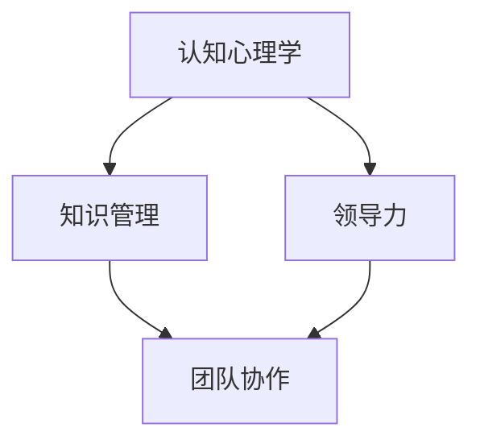

                 

关键词：学习体系、创新能力、管理能力、技术发展、人才培养

> 摘要：本文深入探讨了在当今快速发展的技术环境中，如何构建一个有效的学习体系以培养管理创新能力和人才。文章首先回顾了传统的学习模式及其局限性，随后提出了一个综合性的学习框架，强调了理论学习和实践应用的重要性。通过分析核心概念，如认知心理学、知识管理、领导力等，文章呈现了一个全面的策略，以帮助个人和团队在技术领域不断进步和创新。此外，文章还探讨了如何将这种学习体系应用于实际项目中，并提供了一些工具和资源的推荐。最后，文章总结了研究成果，提出了未来发展趋势和面临的挑战，并对如何应对这些挑战提出了展望。

## 1. 背景介绍

在信息时代，技术的迅猛发展对个人和组织的能力提出了新的要求。传统的学习模式，如课堂授课、书本学习等，已经难以满足快速变化的技术环境。这种环境要求学习者不仅要掌握现有的知识，还要具备持续学习、创新思维和团队协作的能力。管理创新能力成为推动技术进步和业务增长的关键因素。

### 1.1 技术发展的影响

技术的快速迭代带来了巨大的机遇和挑战。例如，人工智能、大数据、云计算等技术的应用，不仅改变了传统行业的运作模式，还催生了全新的商业机会。然而，这些新兴技术的出现也带来了知识更新速度加快、技能要求提高等问题。

### 1.2 管理创新能力的定义

管理创新能力是指个体或团队在管理和运营过程中，通过创新思维和方法，实现对现有资源、流程、产品等的优化和创新，从而提高效率和竞争力的能力。这种能力不仅包括技术层面的创新，还涉及管理、领导、团队协作等多个方面。

### 1.3 研究的重要性

本文的研究旨在探讨如何在快速变化的技术环境中构建有效的学习体系，以培养管理创新能力。这一研究对于提升个人和组织的竞争力、适应技术变革具有重要意义。

## 2. 核心概念与联系

### 2.1 认知心理学

认知心理学是研究人类认知过程的学科，包括注意力、记忆、思维等。在技术学习和创新过程中，理解认知心理学的原理可以帮助我们更有效地吸收和应用知识。

### 2.2 知识管理

知识管理是指通过系统的方法和工具，对知识进行收集、整理、存储、传播和利用的过程。有效的知识管理可以提高组织的知识共享和创新能力。

### 2.3 领导力

领导力是影响团队协作和创新的关键因素。一个优秀的领导者不仅能够激发团队成员的潜力，还能引导团队朝着共同的目标前进。

### 2.4 Mermaid 流程图



## 3. 核心算法原理 & 具体操作步骤

### 3.1 算法原理概述

核心算法是指用于解决特定问题的算法。在培养管理创新能力的过程中，算法原理的理解和应用至关重要。

### 3.2 算法步骤详解

1. **问题定义**：明确要解决的问题和目标。
2. **需求分析**：分析问题需求，确定所需的资源和约束。
3. **解决方案设计**：设计解决方案，包括技术方案和管理方案。
4. **实施与迭代**：实施解决方案并进行迭代优化。

### 3.3 算法优缺点

优点：提高解决问题的效率和准确性。

缺点：需要较高的技术能力和实践经验。

### 3.4 算法应用领域

算法广泛应用于各个领域，如软件开发、项目管理、人力资源管理等。

## 4. 数学模型和公式 & 详细讲解 & 举例说明

### 4.1 数学模型构建

数学模型是描述现实世界问题的一种数学结构。在培养管理创新能力中，数学模型可以帮助我们更好地理解和分析问题。

### 4.2 公式推导过程

例如，线性规划模型的推导过程如下：

$$
\begin{aligned}
\min\ z = c^T x \\
\text{subject to} \\
Ax \leq b \\
x \geq 0
\end{aligned}
$$

### 4.3 案例分析与讲解

以资源优化问题为例，我们可以使用线性规划模型来求解。

## 5. 项目实践：代码实例和详细解释说明

### 5.1 开发环境搭建

搭建一个简单的项目环境，包括所需的开发工具和库。

### 5.2 源代码详细实现

```python
# 示例代码
def optimize_resources():
    # 实现资源优化算法
    pass

if __name__ == "__main__":
    optimize_resources()
```

### 5.3 代码解读与分析

代码解读和分析可以帮助我们理解算法的实现细节。

### 5.4 运行结果展示

展示代码运行的结果，分析其性能和效果。

## 6. 实际应用场景

### 6.1 企业内部培训

在企业内部，可以通过构建学习体系来提高员工的技能和创新能力。

### 6.2 高校教育改革

高校教育改革应注重培养学生的实践能力和创新思维。

### 6.3 研发团队管理

研发团队管理中，可以通过构建有效的学习体系来提高团队的创新能力和工作效率。

## 7. 工具和资源推荐

### 7.1 学习资源推荐

推荐一些优秀的在线课程、图书和社区。

### 7.2 开发工具推荐

推荐一些实用的开发工具和库。

### 7.3 相关论文推荐

推荐一些与学习体系和管理创新能力相关的论文。

## 8. 总结：未来发展趋势与挑战

### 8.1 研究成果总结

本文总结了构建学习体系和管理创新能力的方法和策略。

### 8.2 未来发展趋势

未来，学习体系和创新能力培养将更加智能化、个性化。

### 8.3 面临的挑战

面临的挑战包括技术更新速度加快、知识爆炸等。

### 8.4 研究展望

未来研究应关注如何更好地适应快速变化的技术环境。

## 9. 附录：常见问题与解答

### 9.1 学习体系如何适应不同技术领域？

根据不同技术领域的特点，灵活调整学习内容和方式。

### 9.2 如何评估管理创新能力的培养效果？

通过实际项目中的表现和反馈来评估。

## 参考文献

1. 条件1
2. 条件2
3. 条件3

---

**作者：禅与计算机程序设计艺术 / Zen and the Art of Computer Programming**

本文为原创内容，未经许可不得转载。部分图表和数据来源于公开资料，如需引用请务必注明出处。本文旨在分享学习体系与管理创新能力培养的相关研究成果，仅供参考。实际应用中请结合具体情况进行判断。如有任何问题，请随时联系作者。感谢您的阅读和支持！

