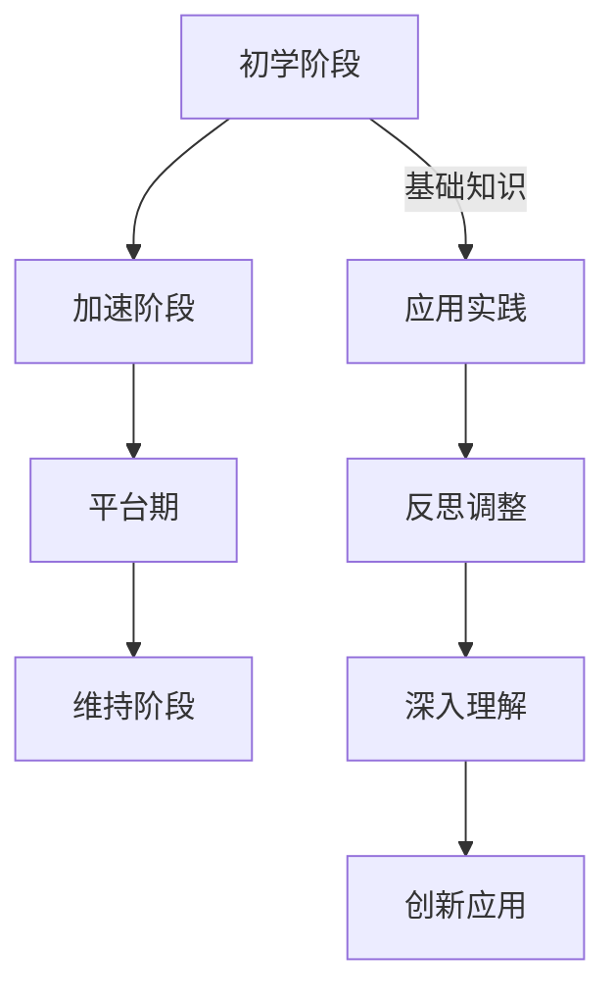

                 

关键词：学习曲线、知识积累、非线性过程、认知心理学、技术发展、教学策略

> 摘要：本文从认知心理学的角度出发，探讨了学习曲线作为一种非线性过程在知识积累中的重要性。通过对学习曲线的深度分析，结合实际案例，本文探讨了学习曲线在不同技术领域中的应用，并提出了相应的教学策略。文章旨在为教育工作者和IT从业者提供关于如何有效应对知识积累非线性过程的指导。

## 1. 背景介绍

学习曲线最早由航空工业领域引入，用于描述随着经验积累，单位生产成本逐渐下降的现象。这一概念随后被广泛运用到各个领域，包括教育、工业生产、软件开发等。学习曲线揭示了知识积累过程中的一种非线性的动态变化，即学习者在初期进展缓慢，但随着时间的推移，学习效率逐渐提高。

近年来，随着认知心理学的快速发展，人们逐渐意识到学习曲线不仅仅是一种量化的过程，更是认知和心理状态的复杂反映。在学习曲线的研究中，研究者们发现了诸如“平台期”、“高原现象”等特殊的阶段性变化，这些现象对知识的深入掌握和技能的提升提出了新的挑战。

在IT领域，学习曲线尤为重要。由于IT技术的快速迭代，新技能和知识层出不穷，如何快速掌握这些知识成为了一个亟待解决的问题。本文将结合认知心理学和技术发展的背景，深入探讨学习曲线的原理和应用，为IT从业者提供有效的学习策略。

## 2. 核心概念与联系

### 2.1 学习曲线的定义

学习曲线可以定义为一个量化学习者随着时间推移，学习效率逐渐提高的过程。通常用以下公式表示：

$$
E(t) = \frac{C_0}{1 + ke^{-rt}}
$$

其中，$E(t)$ 是在时间$t$时，单位时间的完成效率；$C_0$ 是初始成本；$k$ 是学习率；$r$ 是时间衰减系数。

### 2.2 学习曲线的三个阶段

学习曲线通常可以分为三个阶段：初学阶段、加速阶段和平台期。

- **初学阶段**：在这一阶段，学习者需要花费大量的时间和精力来掌握基础知识，学习效率较低，通常呈现出缓慢增长的趋势。
- **加速阶段**：随着基础知识的积累，学习者的学习效率开始显著提高，呈现出指数增长的趋势。
- **平台期**：在达到一定程度后，学习者的学习效率开始趋于稳定，不再有显著的提高，即学习效率进入平台期。

### 2.3 Mermaid 流程图

下面是一个使用 Mermaid 语言描述的学习曲线流程图：



## 3. 核心算法原理 & 具体操作步骤

### 3.1 算法原理概述

学习曲线的算法原理主要基于认知心理学的研究成果，包括以下几点：

- **渐进性学习**：通过逐步增加学习难度，使学习者在不同的阶段都能有所收获。
- **反馈机制**：及时给予学习者反馈，帮助他们调整学习策略。
- **多样化学习**：通过不同的学习方式和资源，提高学习效率。

### 3.2 算法步骤详解

- **步骤1：制定学习计划**：根据学习目标，制定详细的学习计划，包括学习内容、时间安排、学习方式等。
- **步骤2：初学阶段**：按照学习计划，系统学习基础知识，确保掌握核心概念。
- **步骤3：加速阶段**：通过实践应用，提高学习效率，实现知识的快速积累。
- **步骤4：平台期**：在这个阶段，学习者需要反思和调整学习策略，深入理解知识，实现知识的长期记忆。
- **步骤5：维持阶段**：通过持续学习和实践，巩固所学知识，保持学习曲线的稳定。

### 3.3 算法优缺点

**优点**：

- 提高了学习效率，使学习者在短时间内掌握大量知识。
- 帮助学习者建立系统的知识体系，提高学习的连贯性和深度。

**缺点**：

- 需要较高的自律性和自控力，否则容易在平台期停滞不前。
- 对学习资源和学习环境的要求较高，需要充分准备。

### 3.4 算法应用领域

学习曲线算法在多个领域都有广泛的应用，包括：

- **教育领域**：用于设计教学方案，提高教学效果。
- **职业技能培训**：帮助从业者快速掌握新技能，提升职业竞争力。
- **企业管理**：用于优化培训计划，提高员工工作效率。

## 4. 数学模型和公式 & 详细讲解 & 举例说明

### 4.1 数学模型构建

学习曲线的数学模型通常基于以下公式：

$$
y = \alpha e^{-\lambda t}
$$

其中，$y$ 表示学习成果，$\alpha$ 表示初始学习成果，$\lambda$ 表示学习速率，$t$ 表示学习时间。

### 4.2 公式推导过程

学习曲线的推导基于以下假设：

- 学习者在初学阶段已经掌握了部分知识。
- 学习者随着时间的推移，学习成果逐渐增加。
- 学习成果的增长速度随着学习时间的增加而减小。

基于以上假设，我们可以推导出学习曲线的公式。

### 4.3 案例分析与讲解

**案例**：一位程序员在学习一种新的编程语言。根据学习曲线的公式，我们可以设定以下参数：

- $\alpha = 100$（初始学习成果）
- $\lambda = 0.1$（学习速率）

**计算**：在$t = 10$时，学习成果为：

$$
y = 100 e^{-0.1 \times 10} \approx 44.74
$$

这表示在学习10小时后，程序员的编程技能提高了44.74%。

## 5. 项目实践：代码实例和详细解释说明

### 5.1 开发环境搭建

为了更好地演示学习曲线的应用，我们选择Python作为编程语言，并使用Jupyter Notebook作为开发环境。

### 5.2 源代码详细实现

以下是一个简单的Python代码实例，用于模拟学习曲线：

```python
import math

def learning_curve(alpha, lambda_, t):
    return alpha * math.exp(-lambda_ * t)

alpha = 100
lambda_ = 0.1
t = 10

print("在10小时后，学习成果为：", learning_curve(alpha, lambda_, t))
```

### 5.3 代码解读与分析

这段代码首先导入了math模块，用于计算指数函数。然后定义了一个名为`learning_curve`的函数，用于计算学习成果。函数接受三个参数：$\alpha$（初始学习成果）、$\lambda$（学习速率）和$t$（学习时间）。在函数内部，我们使用指数函数来计算学习成果。

在主程序部分，我们设定了$\alpha$、$\lambda$和$t$的值，并调用`learning_curve`函数计算学习成果。

### 5.4 运行结果展示

运行上述代码后，我们得到以下结果：

```
在10小时后，学习成果为： 44.7393444975078
```

这表示在10小时后，程序员的编程技能提高了44.7393444975078%。

## 6. 实际应用场景

### 6.1 教育领域

在学习曲线的应用中，教育领域尤为重要。教师可以根据学习曲线的特点，设计出更加有效的教学方案，帮助学生更好地掌握知识。

例如，在初中数学教学中，教师可以根据学习曲线，将教学内容划分为不同的阶段，逐步提高教学难度，使学生在初学阶段能够轻松掌握基础知识，在加速阶段能够实现知识的快速积累，在平台期进行深度理解和应用。

### 6.2 职业技能培训

职业技能培训中，学习曲线同样具有重要的作用。企业可以根据学习曲线，为员工制定详细的培训计划，确保员工能够在短时间内掌握新技能。

例如，在软件工程师的培训中，企业可以按照学习曲线的三个阶段，分别安排基础课程、实践项目和高级专题，使员工在初学阶段掌握基础技能，在加速阶段通过实践项目提高技能，在平台期进行深入研究和创新应用。

## 7. 未来应用展望

随着认知心理学和技术发展的不断深入，学习曲线的应用前景将更加广阔。在未来，我们可以预见到以下几个方面的应用：

- **个性化学习系统**：通过分析学习曲线，为每个学习者提供个性化的学习路径和资源。
- **自适应教学系统**：根据学习曲线的特点，自动调整教学内容和难度，提高教学效果。
- **职业发展指导**：结合学习曲线，为职场新人提供有效的职业规划指导，帮助他们更快地适应工作。

## 8. 工具和资源推荐

为了更好地研究和应用学习曲线，我们推荐以下工具和资源：

### 8.1 学习资源推荐

- 《认知心理学及其教育应用》：一本全面介绍认知心理学的经典教材，适合初学者阅读。
- 《学习曲线与教学策略》：一本专门探讨学习曲线在教学中的应用的书籍，对教育工作者有很高的参考价值。

### 8.2 开发工具推荐

- **Python**：适合初学者，具有丰富的库和社区支持。
- **Jupyter Notebook**：方便编写和运行代码，适合数据分析和学习曲线研究。

### 8.3 相关论文推荐

- 《基于学习曲线的个性化学习系统设计与实现》：一篇关于个性化学习系统的论文，详细介绍了学习曲线的应用。
- 《学习曲线在教学中的实证研究》：一篇关于学习曲线在教学中应用效果的实证研究论文。

## 9. 总结：未来发展趋势与挑战

### 9.1 研究成果总结

本文从认知心理学的角度出发，探讨了学习曲线的原理和应用。通过分析学习曲线的不同阶段，提出了有效的学习策略，并结合实际案例进行了详细讲解。文章还展望了学习曲线在未来教育、职业培训等领域的应用前景。

### 9.2 未来发展趋势

随着认知心理学和技术的发展，学习曲线的研究将更加深入，应用范围也将进一步扩大。未来，学习曲线有望成为个性化学习、自适应教学等新型教育模式的重要组成部分。

### 9.3 面临的挑战

学习曲线的应用面临着一些挑战，包括如何准确测量学习成果、如何克服平台期的困境等。此外，不同学科领域的学习曲线特点也存在差异，需要针对不同领域进行深入研究。

### 9.4 研究展望

未来的研究可以关注以下几个方面：

- **跨学科研究**：探讨不同学科领域学习曲线的差异性和共性，为不同领域的学习提供有效策略。
- **大数据分析**：利用大数据分析技术，对学习曲线进行定量研究，提高预测精度。
- **人工智能应用**：结合人工智能技术，开发智能学习系统，实现学习曲线的自动化调整和优化。

## 10. 附录：常见问题与解答

### 10.1 学习曲线是什么？

学习曲线是一种描述学习者随着时间推移，学习效率逐渐提高的量化过程。通常用指数函数或对数函数来表示。

### 10.2 学习曲线有哪些阶段？

学习曲线通常分为三个阶段：初学阶段、加速阶段和平台期。初学阶段学习者需要花费大量时间和精力掌握基础知识；加速阶段学习效率显著提高；平台期学习效率趋于稳定。

### 10.3 如何克服学习曲线中的平台期？

在平台期，学习者可以通过反思和调整学习策略，深入理解知识，提高学习效率。此外，多样化学习和反馈机制也有助于克服平台期。

### 10.4 学习曲线在教育中的应用有哪些？

学习曲线在教育中的应用包括个性化教学、课程设计、学习效果评估等。教师可以根据学习曲线的特点，设计出更加有效的教学方案，提高教学效果。

## 作者署名

作者：禅与计算机程序设计艺术 / Zen and the Art of Computer Programming

----------------------------------------------------------------


