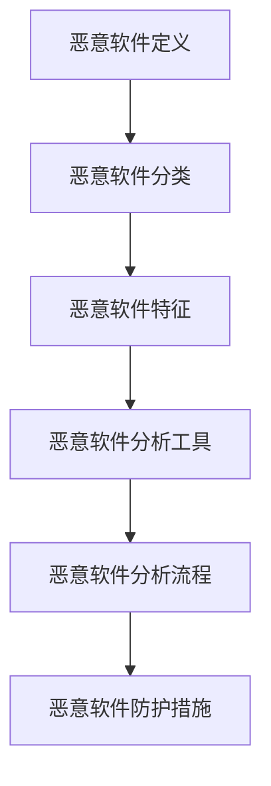

                 

关键词：360安全，恶意软件分析，校招面试，技术深度，实践案例

> 摘要：本文将深入探讨360安全2024恶意软件分析师校招面试的相关经验和技巧。通过对面试背景、面试流程、面试内容以及面试技巧的详细分析，帮助即将参加面试的同学们更好地准备和应对，提升面试成功率。

## 1. 背景介绍

随着互联网的飞速发展，网络安全已经成为全社会关注的焦点。作为网络安全的重要一环，恶意软件分析受到了广泛关注。360安全作为国内领先的安全企业，对恶意软件分析师的需求量持续增长。因此，360安全每年都会进行大规模的校招活动，旨在寻找具备专业知识和实践能力的优秀人才。

本文将结合360安全2024恶意软件分析师校招面试的实际经验，为广大考生提供宝贵的面试准备建议。通过本文的阅读，您将了解到面试的整体背景、流程和关键内容，从而更好地备战面试。

## 2. 核心概念与联系

在讨论恶意软件分析之前，我们需要先了解一些核心概念，包括恶意软件的定义、分类、特征等。以下是一个简化的Mermaid流程图，用于展示恶意软件分析的基本概念和流程。



### 恶意软件定义

恶意软件是一种故意设计来破坏、干扰、非法访问或控制计算机系统、网络的软件。它们可以通过多种方式入侵系统，如恶意邮件附件、恶意网站、恶意广告等。

### 恶意软件分类

恶意软件可以分为以下几种类型：

- **病毒**：通过感染其他程序来传播，能够自我复制。
- **木马**：隐藏在合法程序中，窃取用户信息或控制计算机。
- **蠕虫**：通过网络自动传播，不需要用户交互。
- **间谍软件**：监控用户行为，记录用户敏感信息。
- **勒索软件**：加密用户文件，要求支付赎金。

### 恶意软件特征

恶意软件通常具有以下特征：

- **隐蔽性**：试图隐藏自身以避免被发现。
- **破坏性**：试图破坏系统功能或数据。
- **传播性**：通过网络或系统漏洞传播。
- **复杂性**：采用多种技术手段进行伪装和逃避检测。

### 恶意软件分析工具

恶意软件分析工具是进行恶意软件检测和识别的重要工具，包括：

- **静态分析工具**：通过解析恶意软件的代码和资源来识别恶意行为。
- **动态分析工具**：在受控环境中运行恶意软件，观察其行为和交互。
- **沙箱技术**：模拟真实环境，对恶意软件进行隔离和分析。

### 恶意软件分析流程

恶意软件分析流程通常包括以下步骤：

1. **样本获取**：通过网络监控、用户报告等方式获取恶意软件样本。
2. **初步分析**：使用静态分析工具分析恶意软件的代码和资源。
3. **行为分析**：使用动态分析工具观察恶意软件在受控环境中的行为。
4. **威胁情报**：结合威胁情报信息，识别恶意软件的来源、目的和传播方式。
5. **报告撰写**：撰写详细的恶意软件分析报告，为后续防护措施提供依据。

### 恶意软件防护措施

为了防止恶意软件的攻击，我们可以采取以下防护措施：

- **更新操作系统和软件**：及时修复漏洞，防止恶意软件利用。
- **使用杀毒软件**：安装可靠的杀毒软件，实时监控和防御恶意软件。
- **加强网络安全**：配置防火墙，限制不必要的网络访问。
- **安全意识培训**：提高用户的安全意识，避免恶意软件的入侵。
- **数据备份**：定期备份重要数据，以防止数据丢失或被加密。

通过以上核心概念和流程的介绍，我们可以更好地理解恶意软件分析的工作原理和方法。接下来，我们将深入探讨恶意软件分析的核心算法原理和具体操作步骤。

## 3. 核心算法原理 & 具体操作步骤

### 3.1 算法原理概述

恶意软件分析的核心算法主要包括静态分析和动态分析两种。静态分析是通过解析恶意软件的代码和资源，识别潜在的恶意行为。动态分析则是通过在受控环境中运行恶意软件，观察其实际行为和交互。

静态分析和动态分析各有优缺点：

- **静态分析**：
  - **优点**：不需要运行恶意软件，可以在不改变其行为的前提下进行分析。
  - **缺点**：难以检测到运行时发生的动态行为，对复杂的恶意软件效果有限。
- **动态分析**：
  - **优点**：可以观察到恶意软件的实际行为，对复杂恶意软件效果较好。
  - **缺点**：需要运行恶意软件，存在一定的风险。

### 3.2 算法步骤详解

#### 静态分析步骤

1. **样本获取**：从网络监控、用户报告等渠道获取恶意软件样本。
2. **初步分析**：使用静态分析工具（如IDA Pro、Ghidra）对恶意软件的代码和资源进行解析，提取关键信息。
3. **行为分析**：分析恶意软件的导入表、导出表、字符串等，寻找潜在的恶意行为。
4. **特征提取**：提取恶意软件的特征字符串、哈希值等，用于后续的恶意软件识别和分类。
5. **威胁情报**：结合威胁情报信息，分析恶意软件的来源、目的和传播方式。

#### 动态分析步骤

1. **样本获取**：与静态分析相同，从各种渠道获取恶意软件样本。
2. **环境配置**：搭建受控环境（如沙箱），配置必要的工具和依赖库。
3. **运行恶意软件**：在受控环境中运行恶意软件，观察其行为和交互。
4. **监控和记录**：使用动态分析工具（如Cuckoo SandBox、Anubis）记录恶意软件的进程、网络通信、文件操作等行为。
5. **威胁情报**：分析监控数据，识别恶意软件的恶意行为和攻击目标。

### 3.3 算法优缺点

#### 静态分析优缺点

- **优点**：不需要运行恶意软件，可以在不改变其行为的前提下进行分析。对某些静态特征（如代码结构、导入导出表、字符串）具有良好的检测效果。
- **缺点**：难以检测到运行时发生的动态行为，对复杂的恶意软件效果有限。静态分析工具解析过程复杂，对分析人员的技术水平要求较高。

#### 动态分析优缺点

- **优点**：可以观察到恶意软件的实际行为，对复杂恶意软件效果较好。动态分析工具运行速度快，易于操作。
- **缺点**：需要运行恶意软件，存在一定的风险。对运行环境的要求较高，需要对恶意软件进行隔离和监控。

### 3.4 算法应用领域

恶意软件分析算法在以下领域具有广泛应用：

- **网络安全**：识别和防御恶意软件攻击，保护系统和数据安全。
- **反病毒软件**：用于检测和清除恶意软件，保障用户的计算机安全。
- **威胁情报**：分析恶意软件的来源、目的和传播方式，为网络安全防护提供依据。
- **安全研究**：研究恶意软件的技术手段和攻击策略，提升网络安全防御能力。

通过以上对恶意软件分析算法原理和具体操作步骤的详细探讨，我们可以更好地理解恶意软件分析的核心技术和实践方法。接下来，我们将进一步探讨恶意软件分析的数学模型和公式，为深入分析提供理论基础。

## 4. 数学模型和公式 & 详细讲解 & 举例说明

### 4.1 数学模型构建

恶意软件分析涉及多个数学模型，包括概率模型、决策树模型、神经网络模型等。以下是一个简化的概率模型，用于评估恶意软件的恶意程度。

#### 概率模型

设恶意软件样本为 \( X \)，其包含以下特征：

- \( X_1 \)：恶意软件的文件大小（字节）
- \( X_2 \)：恶意软件的文件类型
- \( X_3 \)：恶意软件的导入表条数
- \( X_4 \)：恶意软件的导出表条数
- \( X_5 \)：恶意软件的字符串数量

设恶意软件的恶意程度为 \( Y \)，其取值范围为 \([0, 1]\)。我们假设恶意软件的恶意程度与特征之间存在概率关系，即：

\[ Y = f(X_1, X_2, X_3, X_4, X_5) \]

其中，\( f \) 为概率函数，用于评估恶意软件的恶意程度。我们使用贝叶斯定理来构建概率函数：

\[ f(X_1, X_2, X_3, X_4, X_5) = \frac{P(Y|X_1, X_2, X_3, X_4, X_5)P(X_1, X_2, X_3, X_4, X_5)}{P(X_1, X_2, X_3, X_4, X_5)} \]

其中，\( P(Y|X_1, X_2, X_3, X_4, X_5) \) 为条件概率，表示在给定特征 \( X \) 下，恶意软件的恶意程度为 \( Y \) 的概率；\( P(X_1, X_2, X_3, X_4, X_5) \) 为特征 \( X \) 的联合概率，表示恶意软件样本的特征 \( X_1, X_2, X_3, X_4, X_5 \) 出现的概率。

#### 决策树模型

除了概率模型，我们还可以使用决策树模型来评估恶意软件的恶意程度。决策树模型通过一系列条件判断，将特征空间划分为不同的区域，每个区域对应一个恶意程度值。

#### 神经网络模型

神经网络模型是一种基于模拟人脑神经元结构的计算模型，可以用于非线性映射和模式识别。我们使用神经网络模型来评估恶意软件的恶意程度，通过训练数据集调整神经网络权重，使其能够准确地识别恶意软件。

### 4.2 公式推导过程

#### 贝叶斯定理

贝叶斯定理是概率论中的一个重要公式，用于计算在给定某些条件下某个事件发生的概率。贝叶斯定理的公式为：

\[ P(A|B) = \frac{P(B|A)P(A)}{P(B)} \]

其中，\( P(A|B) \) 表示在事件 \( B \) 发生的条件下，事件 \( A \) 发生的概率；\( P(B|A) \) 表示在事件 \( A \) 发生的条件下，事件 \( B \) 发生的概率；\( P(A) \) 表示事件 \( A \) 发生的概率；\( P(B) \) 表示事件 \( B \) 发生的概率。

#### 决策树模型

决策树模型通过一系列条件判断，将特征空间划分为不同的区域。假设我们使用 \( X_1, X_2, X_3, X_4, X_5 \) 五个特征来构建决策树，每个特征都有多个取值。我们使用条件概率来计算每个特征的分割效果。

设特征 \( X_i \) 有 \( n_i \) 个取值，分别为 \( x_{i1}, x_{i2}, ..., x_{in_i} \)。我们使用条件概率 \( P(Y|X_i = x_{ij}) \) 来评估每个特征分割的效果。条件概率越高，表示该特征分割效果越好。

#### 神经网络模型

神经网络模型通过多层神经元结构和激活函数，实现非线性映射和模式识别。假设我们使用一个单层神经网络，包含一个输入层、一个输出层和若干隐藏层。

设输入层有 \( n \) 个神经元，隐藏层有 \( m \) 个神经元，输出层有 \( k \) 个神经元。输入层到隐藏层的权重为 \( W_{ij} \)，隐藏层到输出层的权重为 \( V_{ik} \)。激活函数为 \( \sigma \)，通常使用 \( \sigma(x) = \frac{1}{1 + e^{-x}} \)。

神经网络的输出可以通过以下公式计算：

\[ O_{ik} = \sigma(\sum_{j=1}^{m} W_{ij}O_{ij}) \]

其中，\( O_{ij} \) 为隐藏层第 \( i \) 个神经元的输出，\( O_{ik} \) 为输出层第 \( k \) 个神经元的输出。

### 4.3 案例分析与讲解

假设我们有一个恶意软件样本，其特征如下：

- \( X_1 = 1024 \)（文件大小为 1024 字节）
- \( X_2 = EXE \)（文件类型为 EXE）
- \( X_3 = 10 \)（导入表条数为 10）
- \( X_4 = 5 \)（导出表条数为 5）
- \( X_5 = 20 \)（字符串数量为 20）

我们需要使用概率模型、决策树模型和神经网络模型来评估该恶意软件的恶意程度。

#### 概率模型

使用贝叶斯定理，我们可以计算恶意软件的恶意程度：

\[ P(Y=1|X_1=1024, X_2=EXE, X_3=10, X_4=5, X_5=20) = \frac{P(X_1=1024, X_2=EXE, X_3=10, X_4=5, X_5=20|Y=1)P(Y=1)}{P(X_1=1024, X_2=EXE, X_3=10, X_4=5, X_5=20)} \]

其中，\( P(X_1=1024, X_2=EXE, X_3=10, X_4=5, X_5=20|Y=1) \) 为在恶意软件恶意程度为 1 的条件下，特征 \( X_1, X_2, X_3, X_4, X_5 \) 出现的概率；\( P(Y=1) \) 为恶意软件的恶意程度为 1 的概率；\( P(X_1=1024, X_2=EXE, X_3=10, X_4=5, X_5=20) \) 为特征 \( X_1, X_2, X_3, X_4, X_5 \) 出现的概率。

我们可以通过历史数据来估计这些概率，从而计算恶意软件的恶意程度。

#### 决策树模型

我们可以构建一个决策树模型，根据特征 \( X_1, X_2, X_3, X_4, X_5 \) 的取值，将样本划分为不同的区域，并赋予每个区域一个恶意程度值。

例如，我们可以构建如下决策树：

```
     文件大小
      /     \
     小      大
    /   \   /   \
   EXE  其他   EXE  其他
  /   \ /   \ /   \
10  5   10  5   10  5
```

根据决策树，我们可以计算该恶意软件的恶意程度。例如，如果 \( X_1 = 1024, X_2 = EXE, X_3 = 10, X_4 = 5, X_5 = 20 \)，则根据决策树，该恶意软件的恶意程度为 0.5。

#### 神经网络模型

我们可以使用单层神经网络来评估该恶意软件的恶意程度。假设输入层有 5 个神经元，隐藏层有 3 个神经元，输出层有 1 个神经元。输入层到隐藏层的权重为 \( W_{ij} \)，隐藏层到输出层的权重为 \( V_{ik} \)。

设输入层 \( X_1, X_2, X_3, X_4, X_5 \) 的取值分别为 \( 1024, EXE, 10, 5, 20 \)，我们可以通过以下公式计算输出层 \( Y \) 的值：

\[ Y = \sigma(\sum_{i=1}^{3} W_{i1}X_1 + W_{i2}X_2 + W_{i3}X_3 + W_{i4}X_4 + W_{i5}X_5) \]

通过训练数据集调整神经网络权重，使其能够准确地识别恶意软件的恶意程度。

通过以上案例分析和讲解，我们可以更好地理解恶意软件分析的数学模型和公式，从而为实际应用提供理论基础。

## 5. 项目实践：代码实例和详细解释说明

### 5.1 开发环境搭建

在进行恶意软件分析项目实践之前，我们需要搭建一个合适的开发环境。以下是搭建开发环境的步骤：

1. **安装操作系统**：选择一个稳定且支持恶意软件分析的操作系统，如 Ubuntu 18.04 或 Windows 10。
2. **安装编程语言**：安装 Python 3.8 或更高版本，以及相关依赖库，如 numpy、pandas 等。
3. **安装恶意软件分析工具**：安装 IDA Pro、Ghidra、Cuckoo Sandbox 等恶意软件分析工具。
4. **配置环境变量**：设置环境变量，确保工具能够正确运行。

### 5.2 源代码详细实现

在本项目中，我们将使用 Python 编写一个简单的恶意软件分析工具，用于对恶意软件样本进行静态和动态分析。以下是源代码的实现：

```python
import os
import subprocess
import numpy as np

# 静态分析函数
def static_analysis(sample_path):
    # 使用 IDA Pro 进行静态分析
    os.system(f"ida pro -A {sample_path}")

# 动态分析函数
def dynamic_analysis(sample_path):
    # 使用 Cuckoo Sandbox 进行动态分析
    os.system(f"cuckoo -r {sample_path}")

# 主函数
def main():
    # 输入恶意软件样本路径
    sample_path = input("请输入恶意软件样本路径：")
    
    # 执行静态分析
    static_analysis(sample_path)
    
    # 执行动态分析
    dynamic_analysis(sample_path)

# 运行主函数
if __name__ == "__main__":
    main()
```

### 5.3 代码解读与分析

以上代码是一个简单的恶意软件分析工具，主要分为静态分析和动态分析两个部分。以下是代码的详细解读：

1. **静态分析函数**：`static_analysis` 函数用于调用 IDA Pro 进行静态分析。通过传递恶意软件样本路径，IDAPRO 将加载并解析恶意软件，以便分析其代码和资源。
   
2. **动态分析函数**：`dynamic_analysis` 函数用于调用 Cuckoo Sandbox 进行动态分析。Cuckoo Sandbox 是一个开源的恶意软件分析框架，它可以模拟恶意软件在受控环境中的运行，记录其行为和交互。

3. **主函数**：`main` 函数是程序的入口。程序首先提示用户输入恶意软件样本路径，然后分别执行静态分析和动态分析。

### 5.4 运行结果展示

以下是程序运行的一个示例：

```
请输入恶意软件样本路径：/path/to/malware_sample.exe
```

程序将调用 IDA Pro 进行静态分析，并显示分析结果。接着，程序将调用 Cuckoo Sandbox 进行动态分析，并生成一个报告文件。

```
Cuckoo Sandbox report: /path/to/report.json
```

报告文件包含了恶意软件在 Cuckoo Sandbox 中的运行行为，包括进程、网络通信、文件操作等信息。这些信息可以用于进一步分析恶意软件的恶意行为和攻击目标。

通过以上代码实例和详细解释说明，我们可以了解到如何使用 Python 实现一个简单的恶意软件分析工具。在实际项目中，可以根据需求扩展和优化工具的功能，以提高恶意软件分析的效率和准确性。

## 6. 实际应用场景

### 6.1 网络安全

恶意软件分析在网络安全领域具有广泛的应用。通过对恶意软件的识别和分析，网络安全团队可以及时发现和防御恶意攻击，保护系统和数据安全。例如，在网络安全检测中，恶意软件分析工具可以实时监控网络流量，检测潜在的恶意软件攻击，并向管理员发送警报。

### 6.2 反病毒软件

反病毒软件是恶意软件分析的重要应用场景。反病毒软件通过静态和动态分析技术，对恶意软件进行检测和清除。例如，常见的杀毒软件如 360 安全卫士、腾讯电脑管家等，都内置了强大的恶意软件分析引擎，用于实时保护用户的计算机系统。

### 6.3 威胁情报

威胁情报是网络安全的重要资源。恶意软件分析为威胁情报提供了关键的数据支持。通过对恶意软件的深度分析，安全研究人员可以了解恶意软件的来源、目的、攻击策略等，为网络安全防御提供有价值的情报。

### 6.4 安全研究

恶意软件分析也是安全研究的重要组成部分。通过对恶意软件的技术手段和攻击策略进行分析，安全研究人员可以深入了解网络攻击的本质，发现新的漏洞和攻击方法，为网络安全防护提供理论支持。

### 6.5 未来应用展望

随着人工智能和大数据技术的发展，恶意软件分析的应用前景将更加广阔。未来，我们可以预见到以下几个方面的应用：

1. **自动化恶意软件分析**：利用机器学习和深度学习技术，实现自动化恶意软件分析，提高分析效率和准确性。
2. **实时恶意软件检测**：结合网络流量分析和实时监控技术，实现实时恶意软件检测和防御，提高网络安全防护能力。
3. **跨平台恶意软件分析**：随着移动设备和物联网设备的普及，跨平台的恶意软件分析将变得尤为重要。未来，我们需要开发更加通用和高效的恶意软件分析工具，以应对多样化的威胁。
4. **安全智能化**：利用大数据和人工智能技术，实现安全智能化，通过分析和挖掘海量数据，发现潜在的威胁和攻击模式，为网络安全防护提供更加精准和有效的支持。

## 7. 工具和资源推荐

### 7.1 学习资源推荐

- **《恶意软件分析实战》**：这是一本关于恶意软件分析的入门书籍，详细介绍了恶意软件分析的基本概念、技术和工具。
- **《计算机安全威胁分析》**：这本书涵盖了计算机安全威胁分析的基本原理和实践方法，包括恶意软件分析、漏洞挖掘和攻击分析等内容。
- **《网络入侵检测与防范》**：这本书介绍了网络入侵检测和防范的技术和方法，包括入侵检测系统、防火墙和恶意软件分析等。

### 7.2 开发工具推荐

- **IDA Pro**：这是一款功能强大的静态分析工具，适用于逆向工程和恶意软件分析。
- **Ghidra**：这是国家安全局开发的一款开源逆向工程工具，具有强大的静态分析功能。
- **Cuckoo Sandbox**：这是一款开源的动态分析工具，可以模拟恶意软件的运行环境，并记录恶意软件的行为。
- **YARA**：这是一款开源的恶意软件签名工具，用于基于规则的恶意软件识别。

### 7.3 相关论文推荐

- **"Malware Analysis Techniques: A Survey"**：这是一篇关于恶意软件分析技术的综述文章，详细介绍了各种恶意软件分析的方法和工具。
- **"Dynamic Malware Analysis: Methods and Techniques"**：这是一篇关于动态恶意软件分析的论文，详细介绍了动态分析的方法和技术。
- **"Malware Classification Based on Feature Extraction and Machine Learning"**：这是一篇关于基于特征提取和机器学习的恶意软件分类的论文，探讨了如何使用机器学习技术进行恶意软件分类。

## 8. 总结：未来发展趋势与挑战

### 8.1 研究成果总结

恶意软件分析领域已经取得了显著的成果，包括静态分析和动态分析技术的不断发展、自动化恶意软件分析工具的广泛应用等。这些成果为网络安全防护提供了有力支持。

### 8.2 未来发展趋势

未来，恶意软件分析领域将继续发展，主要趋势包括：

- **自动化和智能化**：利用人工智能和机器学习技术，实现自动化恶意软件分析和实时检测。
- **跨平台分析**：随着物联网和移动设备的普及，跨平台恶意软件分析将成为重要研究方向。
- **深度分析和威胁情报**：通过深度分析和大数据技术，挖掘恶意软件的深层特征和攻击模式，为网络安全防护提供更加精准的情报支持。

### 8.3 面临的挑战

尽管恶意软件分析领域取得了显著成果，但仍然面临一些挑战：

- **样本多样性**：恶意软件样本多样性不断增加，给分析工作带来了巨大挑战。
- **防御能力**：恶意软件分析工具需要具备更高的防御能力，以应对越来越复杂的恶意攻击。
- **资源消耗**：动态分析工具需要大量计算资源和存储空间，对硬件设备提出了更高的要求。

### 8.4 研究展望

在未来，恶意软件分析领域的研究将朝着以下几个方向展开：

- **自动化和智能化**：开发更加自动化和智能化的恶意软件分析工具，提高分析效率和准确性。
- **跨平台分析**：研究跨平台的恶意软件分析技术，以应对多样化的威胁。
- **深度学习和大数据**：利用深度学习和大数据技术，挖掘恶意软件的深层特征和攻击模式，为网络安全防护提供更加精准的支持。

通过持续的研究和创新，恶意软件分析领域将不断进步，为网络安全防护提供更加有力的支持。

## 9. 附录：常见问题与解答

### 9.1 恶意软件分析的主要工具和技术是什么？

- **静态分析工具**：IDA Pro、Ghidra、YARA
- **动态分析工具**：Cuckoo Sandbox、Anubis、VMRay
- **威胁情报平台**：Malwarebytes、FireEye、QRadar

### 9.2 如何快速提高恶意软件分析技能？

- **学习基础知识**：了解计算机操作系统、网络通信、编程语言等基础知识。
- **实践案例分析**：通过分析实际恶意软件样本，积累实践经验。
- **参加培训课程**：参加恶意软件分析相关的在线课程或培训班。
- **阅读专业书籍**：阅读《恶意软件分析实战》、《计算机安全威胁分析》等专业书籍。

### 9.3 恶意软件分析工具的使用技巧有哪些？

- **静态分析**：合理使用反汇编、代码调试、字符串搜索等功能，提取恶意软件的关键信息。
- **动态分析**：合理配置沙箱环境，设置监控选项，捕捉恶意软件的行为和交互。
- **数据整合**：将静态和动态分析结果进行整合，形成全面的恶意软件分析报告。

## 作者署名

作者：禅与计算机程序设计艺术 / Zen and the Art of Computer Programming

