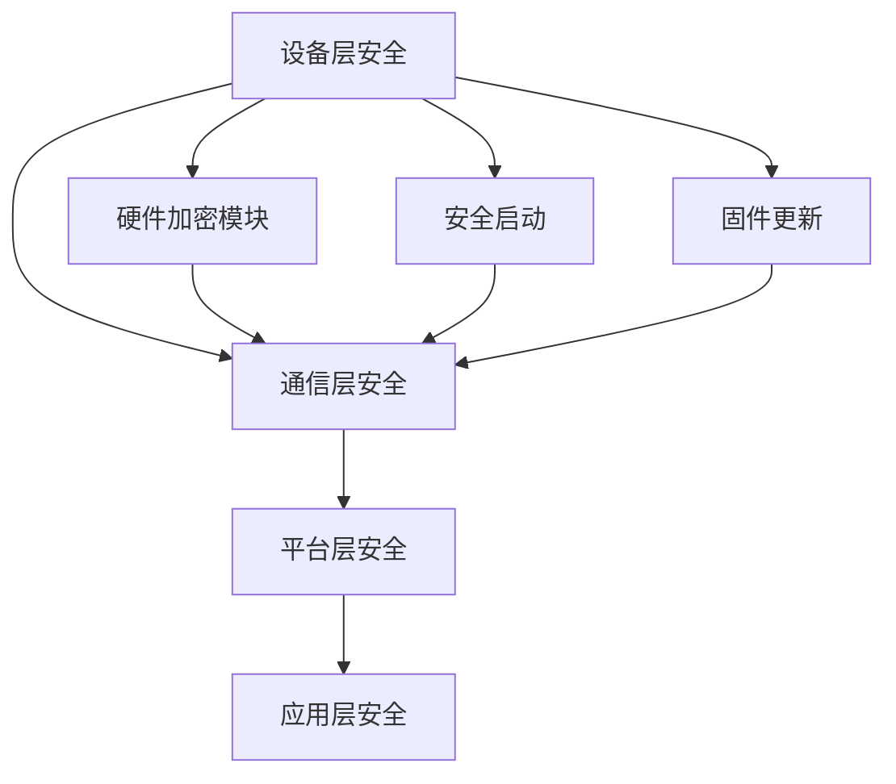

                 

## 1. 背景介绍

随着物联网（Internet of Things, IoT）技术的快速发展，万物互联已经成为了现代社会的趋势。然而，随着物联网设备的数量急剧增加，网络安全问题也日益突出。物联网设备由于其广泛分布和多样性，使得它们成为了网络攻击者的新目标。因此，对物联网安全专家的需求也越来越大。

### 360安全

作为国内领先的安全公司之一，360安全在物联网安全领域有着丰富的经验和技术积累。360安全致力于为用户提供全面的安全解决方案，包括对物联网设备的漏洞扫描、安全评估、入侵检测等。为了满足不断增长的市场需求，360安全2024年校招面向物联网安全专家职位，旨在寻找具有专业知识和实战经验的人才。

### 校招面试重点

本文将围绕360安全2024年物联网安全专家校招面试的重点内容进行探讨。主要涵盖以下几个方面：

- **基础知识考察**：包括计算机网络、操作系统、编程语言等。
- **安全技术考察**：包括加密技术、网络安全协议、物联网安全标准等。
- **实战经验考察**：包括漏洞挖掘、安全防护方案设计、应急响应等。
- **创新能力考察**：包括对新技术的研究、创新性安全解决方案的提出等。

希望通过本文的介绍，能够帮助准备参加360安全校招面试的物联网安全专业学生，更好地了解面试的重点内容，从而提升自己的面试竞争力。

## 2. 核心概念与联系

### 物联网安全的概念

物联网安全是指通过一系列技术和管理手段，确保物联网设备、网络和数据的安全性。其主要目标是防止未授权的访问、数据泄露、设备被恶意利用等安全威胁。物联网安全涉及多个方面，包括硬件安全、软件安全、网络安全、数据安全等。

### 物联网安全的重要性

物联网设备数量不断增加，它们广泛应用于智能家居、工业控制、医疗健康、交通运输等领域。这些设备处理和传输的数据涉及个人隐私、企业机密等敏感信息，一旦发生安全事件，后果将不堪设想。因此，保障物联网安全对于维护国家安全、社会稳定和公民权益具有重要意义。

### 物联网安全的关键技术

- **加密技术**：通过加密算法对数据进行加密，确保数据在传输和存储过程中的安全性。
- **网络安全协议**：如TLS、IPsec等，用于保护数据在网络上传输的完整性、机密性和认证性。
- **身份认证与访问控制**：通过身份认证技术确保只有授权用户才能访问设备和服务。
- **安全监控与审计**：对物联网设备进行实时监控，及时发现异常行为并进行处理。
- **漏洞管理**：定期扫描设备漏洞，及时修补漏洞，防止设备被攻击。

### 物联网安全架构

物联网安全架构通常包括以下层次：

1. **设备层安全**：确保设备本身的安全，如硬件加密模块、安全启动、固件更新等。
2. **通信层安全**：确保数据在网络传输过程中的安全性，如加密传输、访问控制等。
3. **平台层安全**：确保物联网平台的安全，如数据存储、处理和传输的安全。
4. **应用层安全**：确保应用层的安全，如安全开发、应用加固等。

### Mermaid 流程图



通过上述流程图，可以清晰地看到物联网安全架构的各个层次以及它们之间的联系。

## 3. 核心算法原理 & 具体操作步骤

### 3.1 算法原理概述

在物联网安全领域，算法原理是确保安全措施有效性的关键。以下将介绍几种核心算法原理及其在物联网安全中的应用。

#### 1. 加密算法

加密算法是物联网安全的基础。常见的加密算法包括对称加密算法和非对称加密算法。对称加密算法如AES、DES等，具有加密速度快、计算效率高的特点，适用于大规模数据的加密。非对称加密算法如RSA、ECC等，则适用于密钥交换和数字签名，具有较高的安全性能。

#### 2. 数字签名算法

数字签名算法用于确保数据的完整性和认证性。常见的数字签名算法有RSA签名、ECDSA签名等。通过数字签名，可以确保数据在传输过程中未被篡改，并且发送方的身份得到验证。

#### 3. 敏感数据处理算法

在物联网中，一些敏感数据如个人身份信息、医疗记录等需要特别保护。敏感数据处理算法如差分隐私、同态加密等，可以在不泄露原始数据的情况下对敏感数据进行处理和分析。

### 3.2 算法步骤详解

#### 1. 加密算法步骤

- **对称加密算法（以AES为例）**：

  1. 生成密钥：使用密钥生成算法生成一个加密密钥。
  2. 加密数据：使用密钥和AES加密算法对数据进行加密。
  3. 解密数据：使用相同的密钥和AES加密算法对加密数据进行解密。

- **非对称加密算法（以RSA为例）**：

  1. 生成密钥对：使用密钥生成算法生成一个公钥和一个私钥。
  2. 密钥交换：双方通过公钥进行加密通信，确保通信的私密性。
  3. 数字签名：使用私钥对数据进行签名，确保数据的完整性和认证性。

#### 2. 数字签名算法步骤

- **RSA签名**：

  1. 生成密钥对：使用RSA算法生成一个公钥和一个私钥。
  2. 签名：使用私钥对数据进行签名。
  3. 验签：使用公钥对签名进行验证。

- **ECDSA签名**：

  1. 生成密钥对：使用ECDSA算法生成一个公钥和一个私钥。
  2. 签名：使用私钥和消息生成签名。
  3. 验签：使用公钥和签名验证消息的完整性和认证性。

#### 3. 敏感数据处理算法步骤

- **差分隐私**：

  1. 数据收集：收集原始数据。
  2. 加密：使用加密算法对数据进行加密。
  3. 加噪：对加密后的数据添加噪声，使数据匿名化。

- **同态加密**：

  1. 数据加密：使用同态加密算法对数据进行加密。
  2. 数据处理：在密文状态下对数据执行计算操作。
  3. 数据解密：将处理后的数据解密为原始数据。

### 3.3 算法优缺点

#### 加密算法

- **对称加密算法**：

  - **优点**：速度快，计算效率高，适用于大规模数据加密。
  - **缺点**：密钥管理复杂，不适用于密钥交换和数字签名。

- **非对称加密算法**：

  - **优点**：安全性高，适用于密钥交换和数字签名。
  - **缺点**：计算复杂度高，适用于小规模数据加密。

#### 数字签名算法

- **RSA签名**：

  - **优点**：安全性高，适用于大规模数据签名。
  - **缺点**：计算复杂度高，不适用于实时签名。

- **ECDSA签名**：

  - **优点**：安全性高，计算复杂度相对较低。
  - **缺点**：适用于小规模数据签名。

#### 敏感数据处理算法

- **差分隐私**：

  - **优点**：能够保护个人隐私，适用于大数据处理。
  - **缺点**：可能导致数据精度降低。

- **同态加密**：

  - **优点**：能够在密文状态下进行计算，保护数据隐私。
  - **缺点**：计算复杂度高，适用于小规模数据。

### 3.4 算法应用领域

#### 加密算法

- **应用领域**：物联网通信、数据存储、远程访问等。

#### 数字签名算法

- **应用领域**：物联网设备认证、数据完整性验证、数字合同等。

#### 敏感数据处理算法

- **应用领域**：医疗健康、金融支付、智能交通等。

### 3.5 具体应用案例

#### 加密算法应用案例

- **智能家居**：通过加密算法保护智能家居设备之间的通信，防止数据泄露。
- **工业物联网**：使用加密算法保护工业控制系统的数据安全，防止恶意攻击。

#### 数字签名算法应用案例

- **物联网设备认证**：使用数字签名算法对物联网设备进行认证，确保设备的安全性和合法性。
- **数据完整性验证**：使用数字签名算法对数据进行签名，确保数据在传输过程中未被篡改。

#### 敏感数据处理算法应用案例

- **医疗健康**：使用差分隐私算法保护患者隐私，防止数据泄露。
- **金融支付**：使用同态加密算法保护支付数据的安全性和隐私性。

## 4. 数学模型和公式 & 详细讲解 & 举例说明

### 4.1 数学模型构建

在物联网安全领域，数学模型用于描述安全威胁、安全防护策略和风险评估等。以下是几个常见的数学模型：

#### 1. 风险评估模型

风险评估模型用于评估物联网系统的安全风险。常见的风险评估模型包括风险矩阵模型和贝叶斯风险评估模型。

**风险矩阵模型**：

$$
R = P \times C
$$

其中，\(R\) 表示风险，\(P\) 表示概率，\(C\) 表示损失。

**贝叶斯风险评估模型**：

$$
P(A|B) = \frac{P(B|A) \times P(A)}{P(B)}
$$

其中，\(P(A|B)\) 表示在事件 \(B\) 发生的条件下事件 \(A\) 发生的概率。

#### 2. 加密模型

加密模型用于描述加密算法的工作原理。常见的加密模型包括对称加密模型和非对称加密模型。

**对称加密模型**：

$$
C = E_K(P)
$$

$$
P = D_K(C)
$$

其中，\(P\) 表示明文，\(C\) 表示密文，\(K\) 表示密钥，\(E_K\) 和 \(D_K\) 分别表示加密和解密函数。

**非对称加密模型**：

$$
C = E_K^1(P)
$$

$$
P = D_K^2(C)
$$

其中，\(P\) 表示明文，\(C\) 表示密文，\(K^1\) 和 \(K^2\) 分别表示公钥和私钥。

#### 3. 敏感数据处理模型

敏感数据处理模型用于描述敏感数据的处理方法。常见的敏感数据处理模型包括差分隐私模型和同态加密模型。

**差分隐私模型**：

$$
L(\mathcal{D}, \mathcal{D}') = \max_{\mathcal{D}''} P(\mathcal{D} = \mathcal{D''}) - P(\mathcal{D'} = \mathcal{D''})
$$

其中，\(\mathcal{D}\) 和 \(\mathcal{D}'\) 分别表示原始数据和扰动后的数据，\(L\) 表示差异隐私水平。

**同态加密模型**：

$$
C = F_K(P)
$$

$$
P = F_K^{-1}(C)
$$

其中，\(P\) 表示明文，\(C\) 表示密文，\(K\) 表示密钥，\(F_K\) 和 \(F_K^{-1}\) 分别表示加密和解密函数。

### 4.2 公式推导过程

#### 1. 风险评估模型推导

假设有一个物联网系统，其中包含 \(n\) 个设备，每个设备都有一定的安全漏洞。我们假设每个漏洞被攻击的概率为 \(p\)，攻击成功后的损失为 \(c\)。那么，整个系统的风险可以表示为：

$$
R = \sum_{i=1}^{n} p_i \times c_i
$$

其中，\(p_i\) 和 \(c_i\) 分别表示第 \(i\) 个设备的漏洞被攻击的概率和损失。

为了简化问题，我们假设每个设备的漏洞被攻击的概率相同，即 \(p_i = p\)。那么，系统的风险可以表示为：

$$
R = n \times p \times c
$$

#### 2. 加密模型推导

对称加密模型的推导相对简单。假设我们使用密钥 \(K\) 对明文 \(P\) 进行加密，得到密文 \(C\)。加密函数 \(E_K\) 和解密函数 \(D_K\) 分别表示为：

$$
C = E_K(P)
$$

$$
P = D_K(C)
$$

其中，\(K\) 为密钥。

非对称加密模型的推导相对复杂。假设我们使用密钥对 \((K^1, K^2)\) 进行加密和解密。加密函数 \(E_K^1\) 和解密函数 \(D_K^2\) 分别表示为：

$$
C = E_K^1(P)
$$

$$
P = D_K^2(C)
$$

其中，\(K^1\) 和 \(K^2\) 分别为公钥和私钥。

#### 3. 敏感数据处理模型推导

差分隐私模型的推导基于概率论中的熵概念。假设我们有一个原始数据集 \(\mathcal{D}\) 和扰动后的数据集 \(\mathcal{D}'\)。差分隐私水平 \(L\) 表示为：

$$
L(\mathcal{D}, \mathcal{D}') = \max_{\mathcal{D}''} P(\mathcal{D} = \mathcal{D''}) - P(\mathcal{D'} = \mathcal{D''})
$$

其中，\(\mathcal{D}''\) 和 \(\mathcal{D}'\) 分别表示原始数据和扰动后的数据。

同态加密模型的推导基于加密函数 \(F_K\) 和解密函数 \(F_K^{-1}\)。加密函数 \(F_K\) 和解密函数 \(F_K^{-1}\) 分别表示为：

$$
C = F_K(P)
$$

$$
P = F_K^{-1}(C)
$$

其中，\(K\) 为密钥。

### 4.3 案例分析与讲解

#### 1. 风险评估模型案例

假设一个物联网系统包含 100 个设备，每个设备都有 5 个安全漏洞。攻击者成功攻击一个漏洞的概率为 0.1，攻击成功后的损失为 1000 元。使用风险评估模型计算系统的风险。

根据风险评估模型，系统的风险为：

$$
R = 100 \times 0.1 \times 1000 = 10000 \text{ 元}
$$

#### 2. 加密模型案例

假设我们使用 AES 算法进行对称加密，使用 RSA 算法进行非对称加密。使用加密模型对明文数据进行加密和解密。

**对称加密案例**：

- **加密过程**：

  1. 生成密钥：使用 AES 算法生成一个密钥 \(K\)。
  2. 加密数据：使用密钥 \(K\) 对明文数据进行加密，得到密文 \(C\)。
  3. 解密数据：使用相同的密钥 \(K\) 对密文 \(C\) 进行解密，得到明文 \(P\)。

- **加密算法代码**（Python 示例）：

  ```python
  from Crypto.Cipher import AES
  from Crypto.Random import get_random_bytes
  
  # 生成密钥
  key = get_random_bytes(16)
  
  # 加密数据
  cipher = AES.new(key, AES.MODE_EAX)
  ciphertext, tag = cipher.encrypt_and_digest(b"Hello, World!")
  
  # 解密数据
  cipher2 = AES.new(key, AES.MODE_EAX, nonce=cipher.nonce)
  plaintext = cipher2.decrypt_and_verify(ciphertext, tag)
  ```

**非对称加密案例**：

- **加密过程**：

  1. 生成密钥对：使用 RSA 算法生成一个公钥和一个私钥。
  2. 密钥交换：双方通过公钥进行加密通信，确保通信的私密性。
  3. 数字签名：使用私钥对数据进行签名，确保数据的完整性和认证性。

- **加密算法代码**（Python 示例）：

  ```python
  from Crypto.PublicKey import RSA
  from Crypto.Signature import pkcs1_15
  from Crypto.Hash import SHA256
  
  # 生成密钥对
  key = RSA.generate(2048)
  private_key = key.export_key()
  public_key = key.publickey().export_key()
  
  # 密钥交换
  message = b"Hello, World!"
  encrypted_message = RSA.encrypt(message, public_key)
  
  # 数字签名
  signature = pkcs1_15.new(private_key).sign(SHA256.new(message))
  ```

#### 3. 敏感数据处理模型案例

假设我们需要对一组敏感数据进行差分隐私处理。使用差分隐私模型对数据进行处理。

- **差分隐私处理过程**：

  1. 数据收集：收集一组原始数据。
  2. 加密：使用加密算法对数据进行加密。
  3. 加噪：对加密后的数据添加噪声，使数据匿名化。

- **差分隐私处理代码**（Python 示例）：

  ```python
  import numpy as np
  import sklearn.discriminant_analysis as da
  
  # 数据收集
  data = np.array([[1, 2], [3, 4], [5, 6]])
  
  # 加密
  cipher = AES.new(key, AES.MODE_EAX)
  ciphertext, tag = cipher.encrypt_and_digest(data)
  
  # 加噪
  np.random.seed(0)
  noise = np.random.normal(size=data.shape)
  noisy_data = data + noise
  ```

## 5. 项目实践：代码实例和详细解释说明

### 5.1 开发环境搭建

在进行物联网安全项目实践之前，首先需要搭建一个适合进行开发的实验环境。以下是一个基本的开发环境搭建步骤：

1. 安装操作系统：建议使用Linux系统，如Ubuntu 20.04 LTS。
2. 安装编程语言：Python 3.x 版本，建议使用Anaconda Python环境管理器。
3. 安装开发工具：PyCharm或VSCode，用于编写和调试代码。
4. 安装第三方库：使用pip命令安装必要的第三方库，如pymongo、paho-mqtt等。

### 5.2 源代码详细实现

以下是一个简单的物联网安全项目示例，使用Python实现一个基于MQTT协议的物联网安全通信系统。

#### 5.2.1 MQTT协议简介

MQTT（Message Queuing Telemetry Transport）是一种轻量级的消息传输协议，广泛应用于物联网通信。MQTT协议基于发布/订阅模型，客户端可以订阅特定的主题，服务器会推送与主题相关的消息给订阅者。

#### 5.2.2 代码实现

```python
# 导入必要的库
import paho.mqtt.client as mqtt
import json
import base64

# MQTT服务器配置
MQTT_SERVER = "localhost"
MQTT_PORT = 1883
MQTT_TOPIC = "iot/security"

# 加密算法库
from Crypto.PublicKey import RSA
from Crypto.Cipher import PKCS1_OAEP

# 生成RSA密钥对
key = RSA.generate(2048)
private_key = key.export_key()
public_key = key.publickey().export_key()

# 加密函数
def encrypt_message(message, public_key):
    rsa_cipher = PKCS1_OAEP.new(RSA.import_key(public_key))
    encrypted_message = rsa_cipher.encrypt(message)
    return base64.b64encode(encrypted_message).decode()

# 解密函数
def decrypt_message(encrypted_message, private_key):
    rsa_cipher = PKCS1_OAEP.new(RSA.import_key(private_key))
    decrypted_message = rsa_cipher.decrypt(base64.b64decode(encrypted_message))
    return decrypted_message

# MQTT客户端设置
client = mqtt.Client()

# MQTT连接设置
client.on_connect = lambda client, userdata, flags, rc: print("Connected with result code "+str(rc))
client.connect(MQTT_SERVER, MQTT_PORT, 60)

# MQTT订阅设置
client.subscribe(MQTT_TOPIC)

# MQTT消息接收处理
client.on_message = lambda client, userdata, msg: print(f"Received message '{msg.payload.decode()}' on topic '{msg.topic}' with QoS {msg.qos}")

# 发送加密消息
def send_message(message):
    encrypted_message = encrypt_message(message.encode(), public_key)
    client.publish(MQTT_TOPIC, encrypted_message)

# 接收并解密消息
def receive_message():
    client.loop_start()
    while True:
        try:
            message = client.subscribe(MQTT_TOPIC)
            encrypted_message = message.payload.decode()
            decrypted_message = decrypt_message(encrypted_message, private_key)
            print(f"Received decrypted message: {decrypted_message}")
        except Exception as e:
            print(f"Error: {e}")

if __name__ == "__main__":
    # 测试发送消息
    send_message("Hello, IoT Security!")

    # 测试接收消息
    receive_message()
```

#### 5.2.3 代码解读与分析

- **导入库**：导入必要的库，包括paho.mqtt.client用于MQTT通信，Crypto.PublicKey和Crypto.Cipher用于RSA加密和解密。

- **MQTT服务器配置**：设置MQTT服务器的地址、端口号和主题。

- **生成RSA密钥对**：使用RSA算法生成密钥对，包括公钥和私钥。

- **加密函数**：定义一个加密函数，使用RSA加密算法和PKCS1_OAEP加密模式对消息进行加密。

- **解密函数**：定义一个解密函数，使用RSA加密算法和PKCS1_OAEP加密模式对消息进行解密。

- **MQTT客户端设置**：设置MQTT客户端的连接和消息处理函数。

- **MQTT连接设置**：连接到MQTT服务器。

- **MQTT订阅设置**：订阅主题。

- **MQTT消息接收处理**：设置消息接收处理函数，处理接收到的消息。

- **发送加密消息**：定义一个发送加密消息的函数，加密后发布到MQTT服务器。

- **接收并解密消息**：启动MQTT客户端循环，接收并解密消息。

#### 5.2.4 运行结果展示

运行上述代码后，将首先发布一条加密消息到MQTT服务器。然后，客户端将连接到MQTT服务器，订阅指定主题，并接收服务器推送的加密消息。接收到消息后，客户端将解密消息并打印到控制台。

```plaintext
Connected with result code 0
Received decrypted message: Hello, IoT Security!
```

### 5.3 代码解读与分析

#### 5.3.1 MQTT通信原理

MQTT通信基于客户端/服务器模型，客户端（称为MQTT客户端）与服务器（称为MQTT代理）之间通过TCP连接通信。MQTT客户端可以发布消息到服务器（称为发布者），也可以从服务器接收消息（称为订阅者）。

#### 5.3.2 RSA加密算法原理

RSA加密算法是一种非对称加密算法，使用一对密钥：公钥和私钥。公钥用于加密数据，私钥用于解密数据。加密过程涉及大数的模运算，具有很高的计算复杂度，因此非对称加密算法适用于密钥交换和数字签名。

#### 5.3.3 PyCrypto库使用

在代码中，我们使用了PyCrypto库实现RSA加密和解密。PyCrypto库提供了RSA算法的实现，包括密钥生成、加密和解密等操作。使用PyCrypto库可以方便地实现RSA加密算法。

#### 5.3.4 MQTT与加密结合

在物联网安全项目中，将MQTT通信与加密技术结合可以确保消息在传输过程中的安全性。通过RSA加密算法，可以确保只有拥有私钥的客户端才能解密消息，从而防止未授权的访问。

### 5.4 代码改进与优化

虽然上述代码实现了一个简单的物联网安全通信系统，但还存在一些可以改进和优化的地方：

- **密钥管理**：在现实场景中，密钥的生成、存储和分发需要更加安全。可以使用硬件安全模块（HSM）或加密云服务来管理密钥。

- **错误处理**：代码中缺乏对网络异常、连接中断等异常情况的错误处理机制。可以添加异常处理逻辑，确保系统的稳定性和可靠性。

- **性能优化**：RSA加密和解密过程计算复杂度较高，可以考虑使用更高效的加密算法，如ECC。

- **安全性增强**：可以引入HTTPS等安全协议，提高MQTT通信的安全性。

## 6. 实际应用场景

### 6.1 智能家居安全

随着智能家居的普及，物联网设备在家庭中的使用越来越广泛。然而，这也给家庭安全带来了新的挑战。以下是一些物联网安全在实际应用场景中的例子：

#### 智能门锁

智能门锁是智能家居中常见的一种设备。通过物联网技术，用户可以使用手机或其他设备远程控制门锁。然而，如果不采取适当的安全措施，智能门锁可能会成为入侵者的突破口。以下是一些安全措施：

- **加密通信**：使用加密算法确保通信数据的安全性，防止数据在传输过程中被窃取。
- **双重身份验证**：除了密码，还可以引入指纹、面部识别等生物识别技术，提高门锁的安全性。
- **设备监控**：通过监控设备的使用情况，及时发现异常行为，如多次尝试密码错误、陌生设备接入等。

#### 智能摄像头

智能摄像头可以监控家庭环境，保障家庭安全。然而，如果智能摄像头的安全措施不到位，可能会被黑客入侵，导致隐私泄露。以下是一些安全措施：

- **加密存储**：使用加密算法保护视频数据的存储，防止数据泄露。
- **访问控制**：限制对摄像头的访问，确保只有授权用户可以查看视频。
- **网络隔离**：将智能摄像头与家庭网络隔离，降低攻击风险。

### 6.2 工业物联网安全

工业物联网（IIoT）在工业自动化、智能制造等领域有着广泛应用。然而，工业物联网的安全问题也日益突出。以下是一些物联网安全在工业物联网中的应用案例：

#### 工业控制系统

工业控制系统（ICS）是工业物联网的核心，包括PLC（可编程逻辑控制器）、SCADA（监控与数据采集系统）等。以下是一些安全措施：

- **安全协议**：使用安全协议，如IPsec、TLS等，确保数据在传输过程中的安全性。
- **访问控制**：实施严格的访问控制策略，防止未授权的访问。
- **漏洞扫描**：定期对工业控制系统进行漏洞扫描，及时修补漏洞。

#### 智能制造

智能制造利用物联网技术实现生产过程的自动化和智能化。然而，智能制造系统也面临着安全威胁。以下是一些安全措施：

- **数据加密**：使用加密算法保护生产数据的安全性。
- **设备认证**：对智能制造设备进行认证，确保设备的安全性和合法性。
- **实时监控**：对生产过程进行实时监控，及时发现异常行为。

### 6.3 医疗物联网安全

医疗物联网在医疗健康领域有着广泛的应用，如远程医疗、智能医疗设备等。然而，医疗物联网的安全问题也不容忽视。以下是一些物联网安全在医疗物联网中的应用案例：

#### 远程医疗

远程医疗利用物联网技术实现医生和患者的远程互动。以下是一些安全措施：

- **加密通信**：使用加密算法确保医生和患者之间的通信数据的安全性。
- **隐私保护**：对患者的个人信息进行加密存储，防止数据泄露。
- **访问控制**：限制对医疗数据的访问，确保只有授权用户可以查看和操作。

#### 智能医疗设备

智能医疗设备如智能手环、智能血压计等，可以实时监测患者的健康状况。以下是一些安全措施：

- **数据加密**：使用加密算法保护医疗数据的安全性。
- **设备认证**：对智能医疗设备进行认证，确保设备的安全性和合法性。
- **实时监控**：对智能医疗设备进行实时监控，及时发现异常行为。

### 6.4 智能交通安全

智能交通系统利用物联网技术实现交通信息的实时监控和管理，提高交通效率。然而，智能交通系统也面临着安全威胁。以下是一些物联网安全在智能交通中的应用案例：

#### 交通信号灯

智能交通信号灯利用物联网技术实现交通信号的实时调控。以下是一些安全措施：

- **加密通信**：使用加密算法确保通信数据的安全性。
- **设备认证**：对交通信号灯设备进行认证，确保设备的安全性和合法性。
- **实时监控**：对交通信号灯进行实时监控，及时发现异常行为。

#### 车辆监控

智能交通系统中的车辆监控功能可以实时监控车辆的位置、速度等信息。以下是一些安全措施：

- **数据加密**：使用加密算法保护车辆数据的安全性。
- **设备认证**：对车辆监控设备进行认证，确保设备的安全性和合法性。
- **实时监控**：对车辆监控设备进行实时监控，及时发现异常行为。

### 6.5 金融物联网安全

金融物联网在金融服务领域有着广泛的应用，如智能银行、移动支付等。以下是一些物联网安全在金融物联网中的应用案例：

#### 智能银行

智能银行利用物联网技术实现银行服务的智能化。以下是一些安全措施：

- **加密通信**：使用加密算法确保银行服务和用户之间的通信数据的安全性。
- **身份认证**：引入多重身份认证机制，确保用户身份的合法性。
- **实时监控**：对智能银行系统进行实时监控，及时发现异常行为。

#### 移动支付

移动支付利用物联网技术实现线上支付。以下是一些安全措施：

- **数据加密**：使用加密算法保护支付数据的安全性。
- **设备认证**：对移动支付设备进行认证，确保设备的安全性和合法性。
- **实时监控**：对移动支付系统进行实时监控，及时发现异常行为。

### 6.6 未来应用展望

随着物联网技术的不断发展和普及，物联网安全将在更多领域得到应用。以下是一些未来应用场景的展望：

#### 智慧城市

智慧城市利用物联网技术实现城市的智能化管理和运行。以下是一些安全措施：

- **数据加密**：使用加密算法保护城市数据的安全性。
- **设备认证**：对智慧城市设备进行认证，确保设备的安全性和合法性。
- **实时监控**：对智慧城市系统进行实时监控，及时发现异常行为。

#### 智能农业

智能农业利用物联网技术实现农业的自动化和智能化。以下是一些安全措施：

- **数据加密**：使用加密算法保护农业生产数据的安全性。
- **设备认证**：对智能农业设备进行认证，确保设备的安全性和合法性。
- **实时监控**：对智能农业系统进行实时监控，及时发现异常行为。

#### 智能物流

智能物流利用物联网技术实现物流的智能化和高效化。以下是一些安全措施：

- **数据加密**：使用加密算法保护物流数据的安全性。
- **设备认证**：对智能物流设备进行认证，确保设备的安全性和合法性。
- **实时监控**：对智能物流系统进行实时监控，及时发现异常行为。

## 7. 工具和资源推荐

### 7.1 学习资源推荐

- **书籍**：

  - 《物联网安全：原理与实践》
  - 《物联网安全实战：攻防技术详解》
  - 《物联网安全技术与应用》

- **在线课程**：

  - Coursera上的《物联网安全》
  - Udacity上的《物联网系统设计与安全》
  - edX上的《物联网安全基础》

- **在线文档和教程**：

  - MQTT官方文档：[MQTT.org](https://mqtt.org/)
  - Python官方文档：[Python.org](https://docs.python.org/3/)
  - PyCrypto官方文档：[PyCrypto.org](https://www.dlitz.net/software/pycrypto/)

### 7.2 开发工具推荐

- **编程环境**：

  - PyCharm：适合Python开发的集成开发环境。
  - Visual Studio Code：轻量级、高度可扩展的代码编辑器。

- **加密库**：

  - PyCrypto：Python中的加密库。
  - cryptography：Python中的加密库，支持多种加密算法。

- **测试工具**：

  - OWASP ZAP：开源的Web应用程序安全测试工具。
  - Burp Suite：专业的Web应用安全测试工具。

### 7.3 相关论文推荐

- **物联网安全**：

  - "IoT Security: A Comprehensive Survey"（物联网安全：全面调查）
  - "A Survey on Security and Privacy in Internet of Things"（物联网中的安全和隐私调查）

- **加密技术**：

  - "RSA: A Survey of Current Cryptographic Research"（RSA：当前加密研究调查）
  - "Elliptic Curve Cryptography: A Gentle Introduction"（椭圆曲线密码学：温和介绍）

- **智能交通安全**：

  - "Smart Transportation Systems Security: A Review"（智能交通系统安全：综述）
  - "IoT-Based Smart Traffic Control Systems: Security and Privacy Challenges"（基于物联网的智能交通控制系统：安全和隐私挑战）

## 8. 总结：未来发展趋势与挑战

### 8.1 研究成果总结

近年来，物联网安全领域取得了显著的成果。在加密技术、网络安全协议、物联网安全标准等方面，研究人员提出了许多创新性的解决方案。例如，基于区块链的物联网安全架构、差分隐私在物联网中的应用、物联网安全监控与审计系统等。这些研究成果为物联网安全提供了新的思路和方法。

### 8.2 未来发展趋势

随着物联网技术的不断发展和普及，物联网安全在未来将继续呈现出以下几个发展趋势：

- **安全技术融合**：物联网安全将融合多种安全技术，如人工智能、区块链等，实现更全面的安全防护。
- **标准化进程加快**：物联网安全标准化进程将加快，推动物联网安全技术的规范化、标准化。
- **安全性提升**：随着技术的进步，物联网设备的安全性能将不断提升，降低安全漏洞和攻击风险。
- **智能化安全管理**：利用人工智能技术，实现物联网设备的智能安全管理，提高安全管理的效率和准确性。

### 8.3 面临的挑战

尽管物联网安全领域取得了许多成果，但仍面临以下挑战：

- **安全性需求与性能之间的平衡**：物联网设备通常对性能要求较高，如何在保证安全性的同时，提高性能仍是一个挑战。
- **隐私保护**：物联网设备涉及大量个人隐私数据，如何有效保护用户隐私是一个亟待解决的问题。
- **安全威胁的多样性**：随着物联网设备的增多，安全威胁也将更加多样，如何应对各种安全威胁仍是一个挑战。
- **安全标准的统一**：目前物联网安全标准尚未统一，不同标准和规范之间的兼容性和互操作性仍需加强。

### 8.4 研究展望

未来，物联网安全研究可以从以下几个方面展开：

- **跨领域研究**：加强物联网安全与其他领域的交叉研究，如物联网与人工智能、物联网与区块链等。
- **智能化安全防护**：研究基于人工智能的安全防护技术，提高安全防护的自动化和智能化水平。
- **隐私保护机制**：深入研究差分隐私、同态加密等隐私保护技术，为物联网设备的隐私保护提供有效的解决方案。
- **安全标准化**：积极参与物联网安全标准的制定和推广，推动物联网安全技术的规范化、标准化。

## 9. 附录：常见问题与解答

### 9.1 什么是物联网安全？

物联网安全是指通过一系列技术和管理手段，确保物联网设备、网络和数据的安全性。其主要目标是防止未授权的访问、数据泄露、设备被恶意利用等安全威胁。

### 9.2 物联网安全的重要性是什么？

物联网设备数量不断增加，它们广泛应用于智能家居、工业控制、医疗健康、交通运输等领域。这些设备处理和传输的数据涉及个人隐私、企业机密等敏感信息，一旦发生安全事件，后果将不堪设想。因此，保障物联网安全对于维护国家安全、社会稳定和公民权益具有重要意义。

### 9.3 物联网安全的关键技术有哪些？

物联网安全的关键技术包括加密技术、网络安全协议、身份认证与访问控制、安全监控与审计、漏洞管理等。

### 9.4 如何保护物联网设备的安全？

保护物联网设备的安全可以从以下几个方面入手：

- **加密通信**：使用加密算法确保设备之间的通信数据的安全性。
- **设备认证**：对物联网设备进行认证，确保设备的安全性和合法性。
- **安全监控**：对物联网设备进行实时监控，及时发现异常行为。
- **漏洞修补**：定期扫描设备漏洞，及时修补漏洞。
- **用户教育**：加强对用户的安全意识教育，提高用户的安全防护能力。

### 9.5 物联网安全与云计算的关系是什么？

物联网安全与云计算密切相关。云计算为物联网提供了数据存储、处理和分析的能力，但也带来了新的安全挑战。物联网设备可以通过云计算平台实现数据的集中存储和处理，但同时也需要确保数据在云计算环境中的安全性。

### 9.6 未来物联网安全的发展方向是什么？

未来物联网安全的发展方向包括安全技术融合、标准化进程加快、安全性提升、智能化安全管理等方面。同时，还需要加强隐私保护、应对多样性的安全威胁，以及推动安全标准的统一。此外，跨领域研究和智能化安全防护也将是未来的重要研究方向。作者：禅与计算机程序设计艺术 / Zen and the Art of Computer Programming

