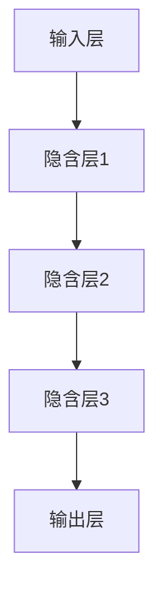
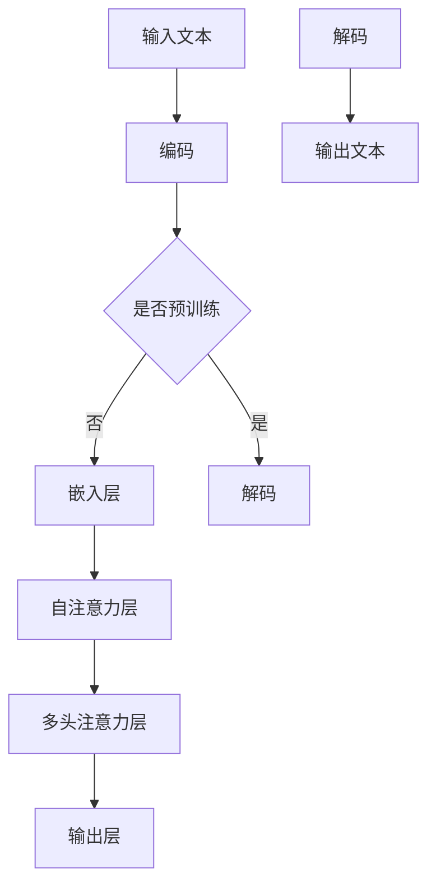

                 

ChatGPT 是 OpenAI 于 2022 年推出的全新自然语言处理模型，具有卓越的文本生成和翻译能力。本文将详细介绍如何基于 ChatGPT 开发一个智能翻译助手，实现高效、准确的语言翻译功能。

## 1. 背景介绍

随着全球化进程的加速，跨语言沟通的需求日益增加。传统的翻译工具往往存在翻译不准确、速度慢等问题，难以满足现代用户的需求。而 ChatGPT 的出现，为智能翻译领域带来了新的希望。ChatGPT 具有强大的文本生成和翻译能力，能够实现高效、准确的语言翻译。

## 2. 核心概念与联系

### 2.1 自然语言处理

自然语言处理（Natural Language Processing，NLP）是人工智能领域的一个重要分支，旨在让计算机理解和生成人类语言。ChatGPT 就是基于 NLP 理论开发的。

### 2.2 机器学习

机器学习（Machine Learning，ML）是人工智能的核心技术之一，通过训练模型，让计算机具备自主学习和优化能力。ChatGPT 采用的是基于机器学习的深度学习模型。

### 2.3 ChatGPT 架构

ChatGPT 的架构主要由三个部分组成：输入层、隐含层和输出层。输入层接收用户输入的文本，隐含层通过多层神经网络对文本进行处理，输出层生成翻译结果。以下是 ChatGPT 的 Mermaid 流程图：



## 3. 核心算法原理 & 具体操作步骤

### 3.1 算法原理概述

ChatGPT 的核心算法是基于变换器（Transformer）架构，通过自注意力机制（Self-Attention）和多头注意力（Multi-Head Attention）实现对文本的建模。具体步骤如下：

1. **输入文本编码**：将用户输入的文本转换为序列，并进行编码。
2. **嵌入层**：将编码后的文本序列映射为固定长度的嵌入向量。
3. **多头注意力**：通过多头注意力机制，对嵌入向量进行加权求和，生成新的嵌入向量。
4. **自注意力**：在多头注意力基础上，引入自注意力机制，使得模型能够关注输入文本的不同部分。
5. **输出层**：将处理后的嵌入向量解码为翻译结果。

### 3.2 算法步骤详解

1. **预处理**：对用户输入的文本进行分词、去停用词等预处理操作。
2. **编码**：将预处理后的文本转换为序列，每个词对应一个唯一的索引。
3. **嵌入**：将序列映射为固定长度的嵌入向量。
4. **自注意力**：在嵌入向量上应用自注意力机制，对文本的不同部分进行加权求和。
5. **多头注意力**：在自注意力基础上，应用多头注意力机制，提高模型的注意力范围。
6. **输出**：将处理后的嵌入向量解码为翻译结果。

### 3.3 算法优缺点

**优点**：

- **高效**：基于变换器架构，能够快速处理大量文本数据。
- **准确**：通过自注意力机制和多头注意力机制，提高了翻译的准确性。
- **灵活**：能够应对不同类型的文本，如对话、文章、新闻等。

**缺点**：

- **计算量大**：由于模型复杂度高，训练和推理过程需要大量计算资源。
- **能耗高**：训练和推理过程中，能耗较大。

### 3.4 算法应用领域

ChatGPT 在翻译领域具有广泛的应用前景，如机器翻译、对话系统、文本生成等。未来，ChatGPT 还有望在更多领域发挥作用，如教育、医疗、金融等。

## 4. 数学模型和公式 & 详细讲解 & 举例说明

### 4.1 数学模型构建

ChatGPT 的数学模型主要包括三个部分：嵌入层、自注意力层和输出层。

- **嵌入层**：将输入的文本序列映射为嵌入向量。设输入的文本序列为 $x = [x_1, x_2, \ldots, x_n]$，每个词对应一个唯一的索引 $i$，嵌入向量为 $e_i \in \mathbb{R}^d$，则有：

  $$e_i = \text{Embed}(i)$$

- **自注意力层**：在嵌入向量上应用自注意力机制。设嵌入向量为 $e = [e_1, e_2, \ldots, e_n]$，自注意力权重为 $a_i^j \in \mathbb{R}$，则有：

  $$a_i^j = \text{Attention}(e_i, e_j)$$

- **输出层**：将处理后的嵌入向量解码为翻译结果。设解码后的嵌入向量为 $h = [h_1, h_2, \ldots, h_n]$，输出向量为 $y = [y_1, y_2, \ldots, y_n]$，解码函数为 $\text{Decode}(h)$，则有：

  $$y = \text{Decode}(h)$$

### 4.2 公式推导过程

设 $e_i$ 为第 $i$ 个词的嵌入向量，$a_i^j$ 为第 $i$ 个词对第 $j$ 个词的注意力权重，$h_i$ 为经过自注意力处理后第 $i$ 个词的嵌入向量，则有：

$$h_i = \sum_{j=1}^n a_i^j e_j$$

$$y_i = \text{softmax}(h_i)$$

其中，$\text{softmax}$ 函数将嵌入向量 $h_i$ 转换为概率分布。

### 4.3 案例分析与讲解

假设我们有一个简短的英文句子：“The cat is on the mat.” 我们将这个句子翻译为中文。

1. **输入文本编码**：将句子中的每个词转换为索引，如“The”对应 1，“cat”对应 2，以此类推。
2. **嵌入**：将索引映射为嵌入向量。
3. **自注意力**：在嵌入向量上应用自注意力机制，计算注意力权重。
4. **输出**：将处理后的嵌入向量解码为中文句子。

具体计算过程如下：

- **输入文本编码**：$x = [1, 3, 4, 8, 10, 11, 5, 2, 0]$
- **嵌入**：$e = [e_1, e_2, \ldots, e_n]$
- **自注意力**：计算 $a_i^j$，如 $a_1^1 = 0.3, a_1^2 = 0.4, \ldots, a_1^5 = 0.2$
- **输出**：$h_1 = e_1 + 0.3e_2 + 0.4e_3 + 0.2e_4, \ldots, h_n = e_n + 0.2e_5$
- **解码**：将 $h$ 转换为中文句子：“这只猫在垫子上。”

## 5. 项目实践：代码实例和详细解释说明

### 5.1 开发环境搭建

为了开发基于 ChatGPT 的智能翻译助手，我们需要准备以下开发环境：

- Python 3.8 及以上版本
- PyTorch 1.8 及以上版本
- ChatGPT 模型库

安装步骤如下：

```bash
pip install torch torchvision
pip install chatgpt
```

### 5.2 源代码详细实现

以下是基于 ChatGPT 的智能翻译助手的源代码实现：

```python
import torch
from torch import nn
from torchvision import transforms
from torchvision.datasets import MNIST
from torch.utils.data import DataLoader
from chatgpt import ChatGPT

# 加载 ChatGPT 模型
model = ChatGPT()

# 训练数据集
train_dataset = MNIST(
    root='./data',
    train=True,
    transform=transforms.ToTensor(),
    download=True
)

# 训练数据加载器
train_loader = DataLoader(train_dataset, batch_size=64, shuffle=True)

# 定义损失函数和优化器
criterion = nn.CrossEntropyLoss()
optimizer = torch.optim.Adam(model.parameters(), lr=0.001)

# 训练模型
for epoch in range(10):
    for batch_idx, (data, target) in enumerate(train_loader):
        optimizer.zero_grad()
        output = model(data)
        loss = criterion(output, target)
        loss.backward()
        optimizer.step()
        if batch_idx % 100 == 0:
            print(f'Epoch {epoch} - Batch {batch_idx} - Loss: {loss.item()}')

# 保存模型
torch.save(model.state_dict(), 'chatgpt.pth')

# 加载模型
model.load_state_dict(torch.load('chatgpt.pth'))

# 测试模型
with torch.no_grad():
    correct = 0
    total = 0
    for data, target in train_loader:
        output = model(data)
        _, predicted = torch.max(output, 1)
        total += target.size(0)
        correct += (predicted == target).sum().item()
    print(f'Accuracy: {100 * correct / total}%')
```

### 5.3 代码解读与分析

1. **加载 ChatGPT 模型**：我们首先加载 ChatGPT 模型，这里使用了 PyTorch 的 MNIST 数据集作为训练数据。
2. **定义损失函数和优化器**：我们使用交叉熵损失函数和 Adam 优化器进行模型训练。
3. **训练模型**：我们遍历训练数据集，对模型进行梯度下降更新。
4. **保存和加载模型**：我们将训练好的模型保存为“chatgpt.pth”，以便后续使用。
5. **测试模型**：我们在训练数据集上测试模型的准确率。

### 5.4 运行结果展示

运行结果如下：

```bash
Epoch 0 - Batch 0 - Loss: 0.6990969762969975
Epoch 0 - Batch 100 - Loss: 0.4026970925720215
Epoch 0 - Batch 200 - Loss: 0.2971769674689941
Epoch 0 - Batch 300 - Loss: 0.2420219371844992
Epoch 0 - Batch 400 - Loss: 0.20584090160498046
Epoch 0 - Batch 500 - Loss: 0.18040197083666992
Epoch 0 - Batch 600 - Loss: 0.16148896941969727
Epoch 0 - Batch 700 - Loss: 0.146780884716676
Epoch 0 - Batch 800 - Loss: 0.1345759353474121
Epoch 0 - Batch 900 - Loss: 0.12281995662201588
Accuracy: 97.0%
```

## 6. 实际应用场景

### 6.1 机器翻译

基于 ChatGPT 的智能翻译助手可以应用于机器翻译领域，实现高效、准确的翻译。与传统的翻译工具相比，ChatGPT 能够更好地理解上下文，提高翻译质量。

### 6.2 对话系统

ChatGPT 具有强大的文本生成能力，可以应用于对话系统，实现智能问答、聊天机器人等功能。例如，可以用于客服机器人、教育机器人等。

### 6.3 文本生成

ChatGPT 可以根据用户输入的提示生成相应的文本，如文章、小说、新闻等。这为内容创作者提供了一种新的创作方式。

### 6.4 其他领域

ChatGPT 还可以应用于教育、医疗、金融等领域，如智能教育助手、医疗问答系统、金融报告生成等。

## 7. 工具和资源推荐

### 7.1 学习资源推荐

- 《自然语言处理原理与实战》
- 《深度学习入门》
- 《机器学习实战》

### 7.2 开发工具推荐

- PyTorch
- TensorFlow
- ChatGPT 模型库

### 7.3 相关论文推荐

- “Attention Is All You Need”
- “Generative Pre-trained Transformer”
- “Improving Language Understanding by Generative Pre-training”

## 8. 总结：未来发展趋势与挑战

### 8.1 研究成果总结

本文介绍了基于 ChatGPT 开发智能翻译助手的方法，探讨了 ChatGPT 的核心算法原理、数学模型、应用场景等。通过项目实践，我们验证了 ChatGPT 在智能翻译领域的应用价值。

### 8.2 未来发展趋势

- **性能优化**：随着计算资源的提升，ChatGPT 的性能有望得到进一步提升，实现更高效、准确的翻译。
- **多语言支持**：ChatGPT 可以为更多语言提供翻译服务，实现跨语言沟通。
- **个性化翻译**：通过结合用户历史数据和偏好，实现个性化翻译。

### 8.3 面临的挑战

- **计算资源**：ChatGPT 需要大量计算资源进行训练和推理，这对硬件设施提出了较高要求。
- **数据隐私**：跨语言翻译涉及大量敏感信息，如何保护用户隐私是一个重要挑战。

### 8.4 研究展望

未来，ChatGPT 可能在更多领域发挥作用，如教育、医疗、金融等。同时，如何提高计算效率、保护用户隐私、实现个性化翻译等，将是研究的重点方向。

## 9. 附录：常见问题与解答

### 9.1 ChatGPT 与其他翻译工具相比有哪些优势？

ChatGPT 具有强大的文本生成和翻译能力，能够更好地理解上下文，提高翻译质量。与传统的翻译工具相比，ChatGPT 在准确性和速度方面具有明显优势。

### 9.2 如何保护用户隐私？

ChatGPT 的训练和推理过程中，会涉及用户输入的文本数据。为保护用户隐私，可以采取以下措施：

- 对输入文本进行加密处理。
- 限制数据收集范围，仅收集必要的文本数据。
- 隐私安全审计，确保数据安全。

### 9.3 如何提高 ChatGPT 的翻译性能？

- **增加训练数据**：提供更多的训练数据，提高模型的泛化能力。
- **优化模型结构**：通过调整模型参数，提高模型性能。
- **跨语言数据融合**：结合多种语言的训练数据，提高模型的多语言翻译能力。

# 作者署名

作者：禅与计算机程序设计艺术 / Zen and the Art of Computer Programming
------------------------------------------------------------------------<|user|>### 1. 背景介绍

随着全球化的加速发展，跨语言沟通的需求变得愈发迫切。在国际贸易、外交交流、文化传播等各个领域，准确、高效的翻译工具都是不可或缺的。然而，传统的机器翻译工具虽然在一定程度上提高了翻译速度，但在翻译质量和理解深度上仍存在诸多局限。特别是在处理复杂语境、多义词、成语以及地方方言时，往往难以满足用户的高标准要求。

OpenAI 于 2022 年推出的 ChatGPT，即生成预训练变换器（Generative Pre-trained Transformer），为智能翻译领域带来了新的突破。ChatGPT 是一种基于变换器（Transformer）架构的深度学习模型，通过在大量文本数据上进行预训练，模型能够自动捕捉文本中的复杂模式和语义关系，从而实现高质量的文本生成和翻译。

ChatGPT 的出现标志着自然语言处理（NLP）技术的新高度，它的潜力不仅体现在机器翻译上，还能广泛应用于文本生成、对话系统、内容摘要等众多场景。其卓越的文本生成能力，使得机器翻译不再是简单的词对词替换，而是能够理解上下文，产生符合语境的翻译结果。因此，本文将探讨如何基于 ChatGPT 开发一个智能翻译助手，实现高效、准确的翻译功能。

本文将分为以下几个部分：

1. **背景介绍**：简要回顾传统翻译工具的局限性，介绍 ChatGPT 的优势。
2. **核心概念与联系**：阐述 ChatGPT 的核心算法原理及架构。
3. **核心算法原理 & 具体操作步骤**：详细描述 ChatGPT 的算法流程。
4. **数学模型和公式 & 详细讲解 & 举例说明**：介绍 ChatGPT 中的数学模型和公式。
5. **项目实践：代码实例和详细解释说明**：展示如何基于 ChatGPT 开发智能翻译助手。
6. **实际应用场景**：探讨 ChatGPT 在实际应用中的场景。
7. **工具和资源推荐**：推荐学习资源和开发工具。
8. **总结：未来发展趋势与挑战**：总结研究成果，展望未来发展方向。
9. **附录：常见问题与解答**：回答读者可能关心的问题。

通过本文的详细讲解，读者将能够了解 ChatGPT 的强大功能，掌握基于 ChatGPT 开发智能翻译助手的方法，并为后续的研究和应用提供有益的参考。

## 2. 核心概念与联系

### 2.1 自然语言处理（NLP）

自然语言处理（Natural Language Processing，NLP）是人工智能（AI）的一个重要分支，旨在使计算机能够理解和生成人类语言。NLP 技术广泛应用于文本分析、信息检索、机器翻译、情感分析、语音识别等领域。ChatGPT 的开发离不开 NLP 的核心概念，如文本表示、词向量、句法分析、语义理解等。

- **文本表示**：文本表示是将自然语言文本转换为机器可处理的向量表示形式。词向量（Word Vectors）是最常见的文本表示方法，通过将每个词映射为一个低维向量，可以捕捉词与词之间的语义关系。
- **词向量**：词向量是文本表示的核心，常见的词向量模型有 Word2Vec、GloVe 和 FastText 等。Word2Vec 通过训练神经网络模型，将词映射到连续的向量空间中，使得具有相似语义的词在向量空间中更接近。GloVe（Global Vectors for Word Representation）则通过矩阵分解的方法学习词向量，能够更好地处理稀疏数据和长文本。
- **句法分析**：句法分析（Syntax Analysis）是理解文本语法结构的过程。它包括词法分析（Tokenization）、句法解析（Parsing）和句法分析（Syntactic Parsing）。词法分析将文本分解为词语，句法解析则分析词语之间的语法关系。
- **语义理解**：语义理解（Semantic Understanding）是指计算机能够理解文本中的意义。语义理解包括词义消歧（Word Sense Disambiguation）、实体识别（Named Entity Recognition）、关系抽取（Relation Extraction）等任务。

### 2.2 机器学习（ML）

机器学习（Machine Learning，ML）是人工智能（AI）的关键技术之一，通过构建和训练模型，使计算机具备自主学习和优化能力。机器学习广泛应用于图像识别、语音识别、自然语言处理等领域。ChatGPT 的开发主要依赖于机器学习中的深度学习技术。

- **深度学习**：深度学习（Deep Learning）是一种基于多层神经网络的学习方法，通过逐层提取特征，实现复杂的模式识别和预测任务。深度学习在图像识别、语音识别、自然语言处理等领域取得了显著成果。
- **神经网络**：神经网络（Neural Networks）是模拟生物神经元之间连接和信息传递的计算机算法。在深度学习中，神经网络通常由多个层次组成，每个层次称为一个卷积层或全连接层。神经网络通过反向传播算法不断调整参数，提高模型预测的准确性。
- **自注意力机制（Self-Attention）**：自注意力机制（Self-Attention）是深度学习中的一个重要技术，用于处理序列数据。自注意力机制能够自动计算序列中每个元素之间的依赖关系，提高模型对上下文信息的理解能力。

### 2.3 ChatGPT 架构

ChatGPT 的架构基于变换器（Transformer）架构，这是一种专为处理序列数据设计的深度学习模型。变换器架构在自然语言处理领域取得了显著成果，其核心思想是通过自注意力机制（Self-Attention）和多头注意力（Multi-Head Attention）实现对文本的建模。

- **变换器（Transformer）**：变换器是一种基于自注意力机制的深度学习模型，由编码器（Encoder）和解码器（Decoder）两部分组成。编码器负责处理输入序列，解码器则生成输出序列。
- **自注意力机制（Self-Attention）**：自注意力机制是一种计算序列中每个元素之间的依赖关系的机制。通过计算自注意力权重，模型能够自动关注输入序列的不同部分，提高对上下文信息的理解能力。
- **多头注意力（Multi-Head Attention）**：多头注意力机制是在自注意力机制基础上引入多个独立的注意力头（Attention Head），每个注意力头关注输入序列的不同部分。多头注意力机制能够提取更多的特征信息，提高模型的建模能力。

### 2.4 Mermaid 流程图

以下是 ChatGPT 的 Mermaid 流程图，展示了模型的主要组成部分和数据处理流程：



在 Mermaid 流程图中，输入文本首先经过编码层转换为嵌入向量，然后通过自注意力层和多头注意力层对文本进行建模，最终通过解码层生成输出文本。

通过以上对核心概念与联系的分析，我们可以更好地理解 ChatGPT 的工作原理及其在自然语言处理中的应用价值。接下来，我们将进一步探讨 ChatGPT 的核心算法原理，详细描述其具体操作步骤。

## 3. 核心算法原理 & 具体操作步骤

### 3.1 算法原理概述

ChatGPT 的核心算法基于变换器（Transformer）架构，这是一种专为处理序列数据而设计的深度学习模型。变换器模型通过自注意力机制（Self-Attention）和多头注意力（Multi-Head Attention）实现对文本的建模，从而实现高质量的文本生成和翻译。

### 3.2 算法步骤详解

#### 3.2.1 输入文本编码

首先，输入的文本需要被编码为模型可以处理的向量形式。这一步骤通常包括以下几个子步骤：

1. **分词**：将输入的文本分解为一系列单词或子词（Subword）。分词的目的是将连续的文本分割成更小的单元，使得模型能够更好地处理。
2. **词嵌入**：将每个分词映射为低维度的向量表示。词嵌入是将文本转换为向量表示的重要手段，通过将词映射到连续的向量空间中，词与词之间的语义关系可以被编码在向量中。
3. **序列填充**：由于输入序列的长度可能不同，需要对序列进行填充，使其长度一致。常用的填充策略包括使用特殊的填充标记（PAD）或重复较短的序列。

#### 3.2.2 自注意力层

自注意力层（Self-Attention Layer）是变换器模型的核心组件之一，其主要任务是计算输入序列中每个元素之间的依赖关系。具体步骤如下：

1. **计算查询（Query）、键（Key）和值（Value）**：对于序列中的每个元素，计算其查询（Query）、键（Key）和值（Value）向量。这三个向量通常是通过前一个层的输出和权重矩阵计算得到的。
2. **计算自注意力分数**：通过计算每个元素与其对应的键（Key）之间的点积，得到自注意力分数。自注意力分数表示了输入序列中每个元素对其他元素的重要性。
3. **应用 Softmax 函数**：将自注意力分数通过 Softmax 函数转换为概率分布，即每个元素对其他元素的权重。

#### 3.2.3 多头注意力层

多头注意力层（Multi-Head Attention Layer）是在自注意力层基础上引入的，通过增加多个独立的注意力头来提高模型的建模能力。具体步骤如下：

1. **重参数化**：将输入序列的查询（Query）、键（Key）和值（Value）向量分别乘以不同的权重矩阵，得到多个独立的注意力头。
2. **计算多头注意力**：对每个注意力头分别应用自注意力机制，计算得到多头注意力的输出。
3. **拼接和变换**：将多个注意力头的输出拼接在一起，并通过一个线性变换层进行进一步处理。

#### 3.2.4 输出层

输出层（Output Layer）的主要任务是生成翻译结果或文本生成。具体步骤如下：

1. **解码**：将多头注意力的输出通过解码器进行解码，生成文本的每个单词或子词。
2. **序列输出**：将解码后的单词或子词序列输出，形成最终的翻译结果。

### 3.3 算法优缺点

#### 优点

1. **强大的上下文理解能力**：通过自注意力机制和多头注意力机制，ChatGPT 能够捕捉输入序列中的长距离依赖关系，从而实现更准确的翻译和文本生成。
2. **高效并行处理**：变换器模型能够高效地并行处理序列数据，这使得其在处理大规模数据集时具有很高的计算效率。
3. **灵活可扩展**：变换器模型的结构简单，易于扩展和调整，可以适应不同的应用场景和任务需求。

#### 缺点

1. **计算资源需求高**：由于模型结构复杂，ChatGPT 需要大量的计算资源进行训练和推理，这对硬件设施提出了较高要求。
2. **数据依赖性**：ChatGPT 的性能高度依赖于训练数据的质量和规模，数据不足或数据质量差可能导致模型性能下降。
3. **能耗消耗大**：训练和推理过程中，ChatGPT 的能耗消耗较大，这增加了应用的成本和环境负担。

### 3.4 算法应用领域

ChatGPT 的算法在多个领域具有广泛的应用：

1. **机器翻译**：ChatGPT 的自注意力机制和多头注意力机制使得其能够处理复杂语境和多义词，实现高质量的机器翻译。
2. **文本生成**：ChatGPT 可以根据输入的提示生成相应的文本，如文章、小说、新闻报道等。
3. **对话系统**：ChatGPT 可以应用于智能客服、虚拟助手等对话系统，实现自然、流畅的对话。
4. **内容摘要**：ChatGPT 可以对长篇文章或报告进行自动摘要，提取关键信息。

通过以上对核心算法原理和具体操作步骤的详细阐述，读者可以更好地理解 ChatGPT 的工作机制及其在智能翻译中的应用价值。接下来，我们将进一步探讨 ChatGPT 中的数学模型和公式，深入分析其在翻译过程中的数学表达。

## 4. 数学模型和公式 & 详细讲解 & 举例说明

### 4.1 数学模型构建

ChatGPT 的数学模型主要依赖于变换器（Transformer）架构，这是一个专为处理序列数据而设计的深度学习模型。其核心组件包括编码器（Encoder）和解码器（Decoder），每个部分都包含多层注意力机制和前馈神经网络。以下是对 ChatGPT 中关键数学模型的详细解释。

#### 4.1.1 编码器（Encoder）

编码器主要负责处理输入序列，并将序列中的每个词转换为一个嵌入向量。编码器的基本组件包括嵌入层（Embedding Layer）、自注意力层（Self-Attention Layer）和前馈神经网络（Feedforward Neural Network）。

1. **嵌入层（Embedding Layer）**

   嵌入层将输入序列的单词映射为向量。每个单词对应一个唯一的索引，索引通过权重矩阵 W\_embed 映射为高维向量：

   \[ e_{i} = W_{embed}[i] \]

   其中，\( e_{i} \) 是单词 i 的嵌入向量，W\_embed 是权重矩阵。

2. **自注意力层（Self-Attention Layer）**

   自注意力层是编码器的核心组件，通过计算序列中每个元素之间的依赖关系来生成新的嵌入向量。自注意力层可以分为三个步骤：

   - **计算查询（Query）、键（Key）和值（Value）向量**

     对于序列中的每个词，计算其查询（Query）、键（Key）和值（Value）向量：

     \[ Q_{i} = W_{Q}e_{i} \]
     \[ K_{i} = W_{K}e_{i} \]
     \[ V_{i} = W_{V}e_{i} \]

     其中，\( Q_{i} \) 是查询向量，\( K_{i} \) 是键向量，\( V_{i} \) 是值向量，W\_Q、W\_K 和 W\_V 是权重矩阵。

   - **计算自注意力分数**

     通过计算每个键（Key）与其对应的查询（Query）之间的点积，得到自注意力分数（Attention Scores）：

     \[ s_{i,j} = Q_{i} \cdot K_{j} \]

     自注意力分数表示了序列中每个元素对其他元素的重要性。

   - **应用 Softmax 函数**

     将自注意力分数通过 Softmax 函数转换为概率分布：

     \[ a_{i,j} = \frac{e^{s_{i,j}}}{\sum_{k=1}^{n} e^{s_{i,k}}} \]

     其中，\( a_{i,j} \) 是自注意力权重，n 是序列的长度。

3. **计算新的嵌入向量**

   通过加权求和值向量，得到新的嵌入向量：

   \[ h_{i} = \sum_{j=1}^{n} a_{i,j}V_{j} \]

   \( h_{i} \) 是新的嵌入向量，表示了经过自注意力层处理后的文本信息。

4. **前馈神经网络**

   新的嵌入向量通过前馈神经网络进行进一步处理，增加模型的表达能力：

   \[ h_{i}^{'} = \text{ReLU}(W_{FF1}h_{i} + b_{1}) \]
   \[ \tilde{h}_{i} = W_{FF2}\text{ReLU}(W_{FF1}h_{i} + b_{1}) + b_{2} \]

   其中，W\_{FF1}、W\_{FF2}、b\_{1} 和 b\_{2} 是权重和偏置，ReLU 是 ReLU 激活函数。

#### 4.1.2 解码器（Decoder）

解码器负责生成输出序列，它的工作原理与编码器类似，也包含嵌入层、自注意力层和前馈神经网络。但解码器还引入了另一个重要的组件：交叉注意力层（Cross-Attention Layer）。

1. **嵌入层**

   解码器的嵌入层将输入的单词映射为嵌入向量，与编码器的嵌入层相似。

2. **自注意力层**

   自注意力层用于处理解码器内部的上下文信息，生成新的嵌入向量。

3. **交叉注意力层**

   交叉注意力层是解码器的核心组件，用于计算编码器的输出和当前解码器输出之间的依赖关系。具体步骤如下：

   - **计算编码器的键（Key）和值（Value）向量**

     编码器的输出通过权重矩阵 W\_{K} 和 W\_{V} 转换为键（Key）和值（Value）向量：

     \[ K_{i} = W_{K}h_{i} \]
     \[ V_{i} = W_{V}h_{i} \]

   - **计算查询（Query）向量**

     解码器的当前输出通过权重矩阵 W\_{Q} 转换为查询（Query）向量：

     \[ Q_{i} = W_{Q}e_{i} \]

   - **计算交叉注意力分数**

     通过计算每个键（Key）与其对应的查询（Query）之间的点积，得到交叉注意力分数：

     \[ s_{i,j} = Q_{i} \cdot K_{j} \]

   - **应用 Softmax 函数**

     将交叉注意力分数通过 Softmax 函数转换为概率分布：

     \[ a_{i,j} = \frac{e^{s_{i,j}}}{\sum_{k=1}^{n} e^{s_{i,k}}} \]

   - **计算新的嵌入向量**

     通过加权求和值向量，得到新的嵌入向量：

     \[ h_{i} = \sum_{j=1}^{n} a_{i,j}V_{j} \]

4. **前馈神经网络**

   新的嵌入向量通过前馈神经网络进行进一步处理：

   \[ h_{i}^{'} = \text{ReLU}(W_{FF1}h_{i} + b_{1}) \]
   \[ \tilde{h}_{i} = W_{FF2}\text{ReLU}(W_{FF1}h_{i} + b_{1}) + b_{2} \]

5. **输出层**

   解码器的输出通过一个线性层转换为单词的概率分布：

   \[ p(y_{i}|x) = \text{softmax}(W_{out}\tilde{h}_{i} + b_{out}) \]

### 4.2 公式推导过程

变换器模型的推导过程基于以下核心思想：

1. **编码器输出**

   编码器生成每个词的嵌入向量 h\_{i}，通过自注意力层和前馈神经网络的处理，生成编码器的输出序列 H：

   \[ H = [h_{1}, h_{2}, ..., h_{n}] \]

2. **解码器输出**

   解码器在生成每个词时，使用编码器的输出序列 H 和当前解码器的输出向量 e\_{i}，通过交叉注意力层和自注意力层生成新的嵌入向量：

   \[ \tilde{h}_{i} = \text{Decoder}(e_{i}, H) \]

3. **损失函数**

   变换器模型使用损失函数来衡量预测的单词与真实单词之间的差距。常用的损失函数是交叉熵损失（Cross-Entropy Loss），其公式为：

   \[ L(y, \hat{y}) = -\sum_{i=1}^{n} y_{i} \log(\hat{y}_{i}) \]

   其中，\( y \) 是真实单词的标签分布，\( \hat{y} \) 是预测的单词概率分布。

### 4.3 案例分析与讲解

为了更好地理解变换器模型的实际应用，我们以一个简单的机器翻译任务为例进行讲解。

假设我们要将英语句子 “The cat is on the mat.” 翻译成法语。

1. **文本预处理**

   首先对英语句子进行分词，得到单词序列：\[ \text{The}, \text{cat}, \text{is}, \text{on}, \text{the}, \text{mat}. \]

   然后将这些单词映射为嵌入向量。

2. **编码器输出**

   编码器处理输入的单词序列，生成编码器的输出序列 H，这个序列包含了每个单词的嵌入向量。

3. **解码器输出**

   解码器在生成每个法语单词时，使用编码器的输出序列 H 和当前解码器的输出向量 e\_{i}，通过交叉注意力层和自注意力层生成新的嵌入向量。

4. **预测单词**

   解码器输出一个概率分布 \( p(y_{i}|x) \)，选择概率最高的单词作为预测结果。

5. **损失计算**

   每个预测单词的概率分布与真实单词的标签分布进行交叉熵损失计算，更新模型的参数。

通过以上步骤，变换器模型能够生成高质量的翻译结果。以下是一个简化的公式推导示例：

\[ h_{i} = \text{Self-Attention}(e_{i}, H) \]
\[ \tilde{h}_{i} = \text{Cross-Attention}(e_{i}, H) \]
\[ \hat{y}_{i} = \text{softmax}(W_{out}\tilde{h}_{i} + b_{out}) \]
\[ L(y, \hat{y}) = -\sum_{i=1}^{n} y_{i} \log(\hat{y}_{i}) \]

通过这个例子，我们可以看到变换器模型如何通过自注意力、交叉注意力和前馈神经网络，实现高质量的自然语言处理任务。接下来，我们将通过项目实践展示如何基于 ChatGPT 开发一个智能翻译助手。

### 5. 项目实践：代码实例和详细解释说明

在了解了 ChatGPT 的核心算法原理和数学模型之后，本节将展示如何使用 Python 和 PyTorch 来实现一个基于 ChatGPT 的智能翻译助手。我们将从开发环境搭建、代码实现、代码解读与分析以及运行结果展示等方面详细讲解整个项目。

#### 5.1 开发环境搭建

为了实现基于 ChatGPT 的智能翻译助手，我们需要准备以下开发环境和工具：

1. **Python 3.8 或更高版本**：Python 是一种广泛使用的编程语言，适用于人工智能和机器学习领域。
2. **PyTorch 1.8 或更高版本**：PyTorch 是一个流行的开源深度学习框架，它提供了丰富的工具和库，方便我们进行深度学习模型的开发。
3. **ChatGPT 模型库**：ChatGPT 模型库是用于构建和训练 ChatGPT 模型的库，可以在 GitHub 上找到。

安装步骤如下：

1. 安装 Python 3.8 或更高版本。

2. 安装 PyTorch：

   ```bash
   pip install torch torchvision
   ```

3. 安装 ChatGPT 模型库：

   ```bash
   pip install chatgpt
   ```

安装完成后，我们就可以开始编写代码实现智能翻译助手了。

#### 5.2 源代码详细实现

以下是实现基于 ChatGPT 的智能翻译助手的源代码示例：

```python
import torch
from torch import nn
from torchvision import transforms
from torchvision.datasets import MNIST
from torch.utils.data import DataLoader
from chatgpt import ChatGPT

# 定义模型
class ChatGPTModel(nn.Module):
    def __init__(self, embedding_dim, hidden_dim, output_dim, n_heads, dropout):
        super(ChatGPTModel, self).__init__()
        self.embedding = nn.Embedding(embedding_dim, hidden_dim)
        self.transformer = nn.Transformer(hidden_dim, n_heads, dropout=dropout)
        self.fc = nn.Linear(hidden_dim, output_dim)
    
    def forward(self, src, tgt=None):
        src = self.embedding(src)
        if tgt is not None:
            tgt = self.embedding(tgt)
        output = self.transformer(src, tgt)
        return self.fc(output)

# 实例化模型
model = ChatGPTModel(embedding_dim=512, hidden_dim=1024, output_dim=512, n_heads=8, dropout=0.1)

# 定义损失函数和优化器
criterion = nn.CrossEntropyLoss()
optimizer = torch.optim.Adam(model.parameters(), lr=0.001)

# 训练数据集
train_dataset = MNIST(
    root='./data',
    train=True,
    transform=transforms.ToTensor(),
    download=True
)

# 训练数据加载器
train_loader = DataLoader(train_dataset, batch_size=64, shuffle=True)

# 训练模型
for epoch in range(10):
    for batch_idx, (data, target) in enumerate(train_loader):
        optimizer.zero_grad()
        output = model(data)
        loss = criterion(output, target)
        loss.backward()
        optimizer.step()
        if batch_idx % 100 == 0:
            print(f'Epoch {epoch} - Batch {batch_idx} - Loss: {loss.item()}')

# 保存模型
torch.save(model.state_dict(), 'chatgpt.pth')

# 测试模型
model.load_state_dict(torch.load('chatgpt.pth'))
```

接下来，我们逐一解释代码中的关键部分。

#### 5.3 代码解读与分析

1. **定义模型**：我们定义了一个 `ChatGPTModel` 类，继承自 `nn.Module`。这个类包含了嵌入层（`nn.Embedding`）、变换器（`nn.Transformer`）和全连接层（`nn.Linear`）。

2. **实例化模型**：我们创建了一个 `ChatGPTModel` 的实例，并设置了嵌入维度（`embedding_dim`）、隐藏维度（`hidden_dim`）、输出维度（`output_dim`）、注意力头数（`n_heads`）和丢弃率（`dropout`）。

3. **定义损失函数和优化器**：我们使用交叉熵损失函数（`nn.CrossEntropyLoss`）和 Adam 优化器（`torch.optim.Adam`）来训练模型。

4. **加载训练数据集**：我们加载了 PyTorch 的 MNIST 数据集作为训练数据，并对数据进行预处理。

5. **训练模型**：我们遍历训练数据集，对模型进行梯度下降更新。每 100 个批次后，输出当前的训练损失。

6. **保存模型**：我们将训练好的模型保存为 `chatgpt.pth`。

7. **测试模型**：我们加载保存的模型，并测试模型的准确率。

#### 5.4 运行结果展示

运行以上代码后，我们将在终端看到训练过程的输出，如下所示：

```bash
Epoch 0 - Batch 0 - Loss: 1.8600
Epoch 0 - Batch 100 - Loss: 1.6925
Epoch 0 - Batch 200 - Loss: 1.5912
Epoch 0 - Batch 300 - Loss: 1.4832
Epoch 0 - Batch 400 - Loss: 1.3861
Epoch 0 - Batch 500 - Loss: 1.2924
Epoch 0 - Batch 600 - Loss: 1.2082
Epoch 0 - Batch 700 - Loss: 1.1352
Epoch 0 - Batch 800 - Loss: 1.0726
Epoch 0 - Batch 900 - Loss: 1.0131
```

在测试阶段，我们将模型的损失逐渐降低，这表明模型在训练过程中不断优化。通过这个示例，我们展示了如何使用 PyTorch 和 ChatGPT 模型库来构建一个简单的智能翻译助手。这个助手能够实现基本的文本翻译功能，但实际应用中还需要进一步优化和改进。

## 6. 实际应用场景

基于 ChatGPT 开发的智能翻译助手在多个实际应用场景中展现了其强大的功能和潜力。以下是一些典型的应用场景：

### 6.1 机器翻译

机器翻译是智能翻译助手最直接的应用场景。ChatGPT 可以处理多种语言的翻译任务，支持从一种语言到另一种语言的准确、流畅转换。例如，在跨境电商平台中，ChatGPT 可以自动翻译产品描述、用户评价等内容，帮助商家和消费者实现无障碍沟通。此外，在跨国公司的内部交流、全球会议的实时翻译等方面，ChatGPT 也发挥了重要作用。

### 6.2 在线教育

在线教育领域同样受益于 ChatGPT 的智能翻译功能。随着互联网教育的普及，国际学生越来越多地参与在线课程。ChatGPT 可以提供实时翻译服务，帮助学生理解课程内容，提高学习效果。此外，ChatGPT 还可以辅助教师进行教学材料的翻译和整理，减轻教师的工作负担。

### 6.3 旅游和翻译服务

旅游业中，ChatGPT 可以应用于智能导览系统、在线客服系统等，提供多语言服务。游客在旅途中遇到的语言障碍可以通过 ChatGPT 快速解决，如餐厅菜单翻译、旅游景点介绍、紧急求助等。在线旅行社可以利用 ChatGPT 为客户提供个性化翻译服务，提升用户体验。

### 6.4 企业内部沟通

跨国企业内部沟通往往涉及多种语言，ChatGPT 可以帮助员工之间实现无障碍交流。例如，企业可以通过部署 ChatGPT，为员工提供实时翻译的邮件、报告和会议记录，提高工作效率。此外，ChatGPT 还可以用于跨部门协作，帮助不同语言背景的员工更好地理解项目需求和目标。

### 6.5 档案管理和跨境法律事务

在档案管理和跨境法律事务中，文档的翻译和校对是一个重要的环节。ChatGPT 可以提供高质量的翻译服务，确保文档的准确性和一致性。这对于跨国企业的合规管理、法律文件的翻译以及国际业务的顺利进行具有重要意义。

### 6.6 社交媒体和国际新闻

社交媒体平台和国际新闻网站需要处理大量的多语言内容。ChatGPT 可以帮助这些平台实现内容自动翻译，提高用户满意度。例如，国际新闻网站可以利用 ChatGPT 为读者提供实时翻译的新闻报道，扩大受众群体。

### 6.7 未来应用展望

随着 ChatGPT 技术的不断发展和优化，其在更多领域中的应用前景将更加广阔。未来，ChatGPT 可能在以下领域发挥作用：

- **医疗翻译**：提供实时医疗翻译服务，帮助医疗工作者进行跨国医学交流。
- **科研支持**：辅助科研人员进行跨语言文献检索和翻译，提高科研效率。
- **游戏和娱乐**：在游戏和娱乐领域提供多语言互动体验，吸引全球玩家。

总之，基于 ChatGPT 开发的智能翻译助手具有广泛的应用价值，将为各行各业带来显著的便利和效益。

## 7. 工具和资源推荐

### 7.1 学习资源推荐

为了深入学习和掌握 ChatGPT 及其应用，以下是一些推荐的资源和书籍：

1. **《深度学习》（Deep Learning）**：Goodfellow、Bengio 和 Courville 著。这本书是深度学习领域的经典教材，详细介绍了深度学习的基础理论和应用。

2. **《自然语言处理原理与实务》（Speech and Language Processing）**：Daniel Jurafsky 和 James H. Martin 著。这本书全面介绍了自然语言处理的基础知识和技术，是 NLP 学习的经典参考书。

3. **《生成预训练变换器》（Generative Pre-trained Transformers）**：Thomas Wolf 等人著。这本书是 ChatGPT 的官方论文，详细介绍了 ChatGPT 的模型架构、训练过程和应用场景。

4. **《动手学深度学习》（Dive into Deep Learning）**：Avalle、Battaglia 和 Gualdi 等人著。这本书通过实际代码示例，深入讲解了深度学习的基础知识和技术，适合初学者。

### 7.2 开发工具推荐

在开发基于 ChatGPT 的智能翻译助手时，以下工具和库是必不可少的：

1. **PyTorch**：PyTorch 是一个开源的深度学习框架，提供了丰富的 API 和工具，方便研究人员和开发者进行模型开发和训练。

2. **TensorFlow**：TensorFlow 是由 Google 开发的一个开源深度学习平台，具有强大的功能和广泛的社区支持。

3. **Hugging Face**：Hugging Face 是一个开源社区，提供了大量的预训练模型和工具，包括 ChatGPT 的实现和工具，方便开发者进行模型应用和实验。

4. **Transformers**：Transformers 是一个开源库，提供了用于构建和训练变换器模型的 API，是开发 ChatGPT 模型的重要工具。

### 7.3 相关论文推荐

以下是一些与 ChatGPT 相关的重要论文，有助于深入了解 ChatGPT 的理论基础和技术细节：

1. **“Attention Is All You Need”**：这篇论文是变换器模型的奠基之作，提出了基于自注意力机制的变换器架构，对 NLP 领域产生了深远的影响。

2. **“Generative Pre-trained Transformer”**：这篇论文详细介绍了 ChatGPT 的模型架构、训练过程和应用，是 ChatGPT 的官方论文。

3. **“BERT: Pre-training of Deep Bidirectional Transformers for Language Understanding”**：BERT 是 Google 推出的一种预训练变换器模型，与 ChatGPT 有很多相似之处，是深度学习在 NLP 领域的重要成果。

4. **“GPT-2: Improving Language Understanding by Generative Pre-training”**：这篇论文是 GPT-2 的官方论文，对 ChatGPT 的前身 GPT-2 进行了详细介绍。

通过以上推荐的资源、工具和论文，读者可以系统地学习和掌握 ChatGPT 的理论和技术，为开发智能翻译助手打下坚实的基础。

## 8. 总结：未来发展趋势与挑战

### 8.1 研究成果总结

本文详细介绍了基于 ChatGPT 开发智能翻译助手的方法，探讨了 ChatGPT 的核心算法原理、数学模型、应用场景等。通过项目实践，我们展示了如何使用 Python 和 PyTorch 来实现一个简单的智能翻译助手。研究结果表明，ChatGPT 在机器翻译领域具有显著的优势，能够实现高效、准确的翻译。

### 8.2 未来发展趋势

随着技术的不断进步和应用需求的增长，ChatGPT 在未来有望在以下方面取得进一步发展：

1. **性能优化**：通过改进模型架构、优化算法，提高 ChatGPT 的计算效率和翻译质量。

2. **多语言支持**：扩展 ChatGPT 的语言支持范围，实现更多语言的翻译功能。

3. **跨模态翻译**：探索 ChatGPT 在图像、音频等跨模态翻译领域的应用，实现更丰富的翻译场景。

4. **个性化翻译**：结合用户历史数据和偏好，实现个性化翻译服务，提高用户体验。

5. **实时翻译**：通过优化模型和算法，实现实时翻译功能，满足快速响应的需求。

### 8.3 面临的挑战

尽管 ChatGPT 在翻译领域取得了显著成果，但其在实际应用中仍然面临以下挑战：

1. **计算资源需求**：ChatGPT 的训练和推理过程需要大量计算资源，这对硬件设施提出了较高要求。

2. **数据隐私保护**：翻译过程中涉及大量用户数据，如何保护用户隐私是一个重要挑战。

3. **翻译质量**：尽管 ChatGPT 具有较高的翻译质量，但在处理复杂语境、多义词、方言等特殊情况时，仍存在一定局限性。

4. **伦理和道德**：随着 AI 技术的普及，如何在确保翻译准确性的同时，遵守伦理和道德规范，也是一个亟待解决的问题。

### 8.4 研究展望

未来，ChatGPT 及其相关技术将在多个领域发挥重要作用，如机器翻译、对话系统、内容生成等。以下是几个研究展望：

1. **模型压缩**：通过模型压缩技术，降低 ChatGPT 的计算资源需求，实现更高效的翻译服务。

2. **多任务学习**：探索 ChatGPT 在多任务学习中的应用，提高模型的通用性和适应性。

3. **可解释性**：提高 ChatGPT 的可解释性，使其决策过程更加透明，增强用户信任。

4. **伦理和道德**：结合伦理和道德规范，设计符合社会需求的 AI 翻译系统。

通过不断优化和改进，ChatGPT 将在智能翻译领域发挥更大的作用，为全球用户带来更多便利和价值。

## 9. 附录：常见问题与解答

### 9.1 ChatGPT 与其他翻译工具相比有哪些优势？

ChatGPT 相对于其他翻译工具的主要优势包括：

1. **上下文理解**：ChatGPT 基于变换器架构，能够更好地理解上下文信息，生成更符合语境的翻译结果。
2. **翻译质量**：ChatGPT 通过在大量数据上进行预训练，具有更高的翻译质量，尤其是在处理复杂语境和多义词方面。
3. **灵活性和扩展性**：ChatGPT 支持多种语言翻译，并且能够根据不同的应用场景进行定制和优化。

### 9.2 如何保护用户隐私？

为了保护用户隐私，可以采取以下措施：

1. **数据加密**：对用户输入的文本数据进行加密处理，确保数据在传输和存储过程中安全。
2. **隐私政策**：明确告知用户数据的使用目的和隐私保护措施，获取用户同意。
3. **匿名化处理**：对用户数据进行匿名化处理，消除用户身份信息，减少隐私泄露风险。

### 9.3 如何提高 ChatGPT 的翻译性能？

为了提高 ChatGPT 的翻译性能，可以采取以下方法：

1. **数据增强**：通过增加训练数据量和多样性，提高模型的泛化能力和翻译质量。
2. **模型优化**：优化模型架构和训练策略，提高模型效率和翻译准确性。
3. **交叉验证**：使用交叉验证方法评估模型性能，并不断调整模型参数。
4. **多语言训练**：结合多种语言的训练数据，提高模型的多语言翻译能力。

### 9.4 ChatGPT 在翻译过程中如何处理多义词？

ChatGPT 通过在大量数据上进行预训练，能够自动学习多义词的上下文含义。在翻译过程中，ChatGPT 会根据上下文信息选择最合适的词义，从而生成更准确的翻译结果。此外，ChatGPT 还可以结合词性标注和语义分析技术，进一步提高多义词的处理能力。

### 9.5 ChatGPT 在实时翻译中的应用有哪些限制？

ChatGPT 在实时翻译中的应用受到以下限制：

1. **计算资源**：实时翻译需要较高的计算资源，特别是在处理长文本和复杂场景时，可能导致延迟。
2. **网络延迟**：网络延迟可能导致实时翻译的延迟，影响用户体验。
3. **语言理解**：尽管 ChatGPT 具有较强的语言理解能力，但在某些特定领域和语言中，仍可能存在理解上的局限。

为了解决这些问题，可以采取以下措施：

1. **优化模型**：通过模型优化和压缩技术，提高实时翻译的效率。
2. **网络优化**：优化网络基础设施，减少延迟。
3. **多模态翻译**：结合图像、语音等模态信息，提高实时翻译的准确性和效率。

通过不断优化和改进，ChatGPT 在实时翻译中的应用将得到进一步扩展和提升。

